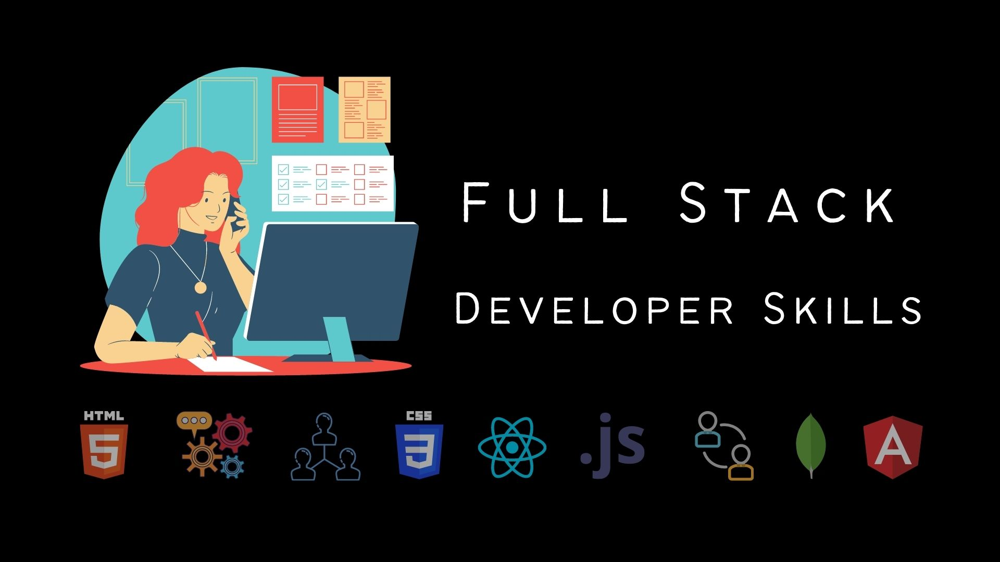

# Fullstack Interviews

## Tuyển tập câu hỏi phỏng vấn cho lập trình web.

## Ngôn ngữ lập trình

| | |
|-|-|
|  | [28 Câu hỏi phỏng vấn C++](./basics/cpp/) |
|  | [54 Câu hỏi phỏng vấn Java](./mobile/java/) |
|  | [34 Câu hỏi phỏng vấn Python](./backend/python/) |
|  | [30 Câu hỏi phỏng vấn JavaScript](./frontend/javascript/) |
|  | [33 Câu hỏi phỏng vấn PHP](./backend/php/) |
|  | [30 Câu hỏi phỏng vấn C#](./backend/csharp/) |
|  | [30 Câu hỏi phỏng vấn Golang](./devops/golang/) |

## Thư mục

### Cơ bản

- Kiến thức:
    - [**Cấu trúc dữ liệu**](./basics/data-structures): 40 câu hỏi phỏng vấn cấu trúc dữ liệu.
    - [**Thuật toán**](./basics/algorithms): 30 câu hỏi phỏng vấn thuật toán.
    - [**Hướng đối tượng**](./basics/oops): 40 câu hỏi phỏng vấn OOP.
    - [**Design Patterns**](./basics/design-patterns): 28 câu hỏi phỏng vấn design pattern.
    - [**Hệ điều hành**](./basics/os): 40 câu hỏi phỏng vấn hệ điều hành.
    - [**Mạng máy tính**](./basics/network): 35 câu hỏi phỏng vấn mạng máy tính.
    - [**An ninh mạng**](./basics/cyber):  42 câu hỏi phỏng vấn an ninh mạng.
- Ngôn ngữ lập trình:
    - [**C++**](./basics/cpp): 28 Câu hỏi phỏng vấn C++.

### Cơ sở dữ liệu
- Kiến thức:
    - [**MySQL**](./database/mysql): 31 câu hỏi phỏng vấn MySQL.
    - [**PostgreSQL**](./database/postgresql): 26 câu hỏi phỏng vấn PostgreSQL.
    - [**MongoDB**](./database/mongodb): 24 câu hỏi phỏng vấn MongoDB.
- Ngôn ngữ lập trình:
    - [**SQL**](./database/sql): 40 câu hỏi phỏng vấn SQL.

### Frontend

- Kiến thức:
    - [**Web API**](./frontend/web-api): 13 câu hỏi phỏng vấn Web API.
    - [**React**](./frontend/react): 40 câu hỏi phỏng vấn ReactJS.
    - [**HTML**](./frontend/html): 62 câu hỏi phỏng vấn HTML.
    - [**CSS**](./frontend/css): 54 câu hỏi phỏng vấn CSS.
- Ngôn ngữ lập trình:
    - [**JavaScript**](./frontend/javascript): 30 câu hỏi phỏng vấn JavaScript.
    - [**ES6**](./frontend/es6): 39 câu hỏi phỏng vấn ES6.
    - [**TypeScript**](./frontend/typescript): 50 câu hỏi phỏng vấn TypeScript.

### Backend

- Kiến thức:
    - [**Web Services**](./backend/web-services): 35 câu hỏi phỏng vấn dịch vụ Web.
    - [**Node.js**](./backend/nodejs): 36 câu hỏi phỏng vấn Node.js.
    - [**Django**](./backend/django): 37 câu hỏi phỏng vấn Django. 
    - [**Nginx**](./backend/nginx): 18 câu hỏi phỏng vấn Nginx.
    - [**WebSocket**](./backend/websocket/): 12 câu hỏi phỏng vấn WebSocket.
    - [**Microservice**](./backend/microservice): 30 câu hỏi phỏng vấn Microservices.
- Ngôn ngữ:
    - [**C#**](./backend/csharp): 30 câu hỏi phỏng vấn C#.
    - [**PHP**](./backend/php): 33 câu hỏi phỏng vấn về PHP.
    - [**Python**](./backend/python): 37 câu hỏi phỏng vấn Python.
        - [**Numpy**](./backend/python/numpy): 11 câu hỏi phỏng vấn NumPy.
        - [**Pandas**](./backend/python/pandas): 10 câu hỏi phỏng vấn Pandas.

### Devops

- Kiến thức
    - [**DevOps cơ bản**](./devops): 35 câu hỏi phỏng vấn DevOps.
    - [**Docker**](./devops/docker): 35 câu hỏi phỏng vấn Docker.
    - [**Kubernetes**](./devops/kubernetes): 26 câu hỏi phỏng vấn Kubernetes.
- Ngôn ngữ lập trình:
    - [**Golang**](./devops/golang): 30 câu hỏi phỏng vấn Golang.

### Mobile
- Kiến thức
    - [**Android**](./mobile/android): 39 câu hỏi phỏng vấn về Android.
    - [**iOS**](./mobile/ios): 36 câu hỏi phỏng vấn về iOS.
    - [**React Native**](./mobile/react-native/): 30 câu hỏi phỏng vấn về React Native.
- Ngôn ngữ lập trình:
    - [**Java**](./mobile/java): 54 câu hỏi phỏng vấn về Java.
    
# Tham khảo 

* [**Interviewbit**](https://www.interviewbit.com)

* [**Code Problems**](https://github.com/blakeembrey/code-problems)

* [**Fullstack Cafe**](https://www.fullstack.cafe)

* [**Learning Zone**](https://github.com/learning-zone)

* [**Career Guru99**](https://career.guru99.com/)