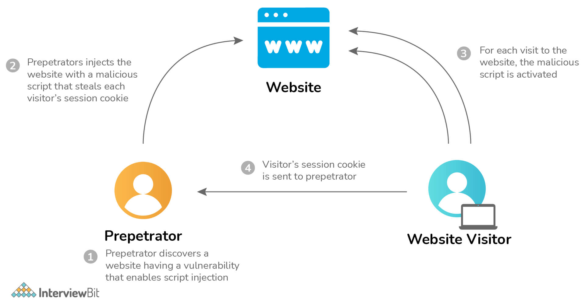
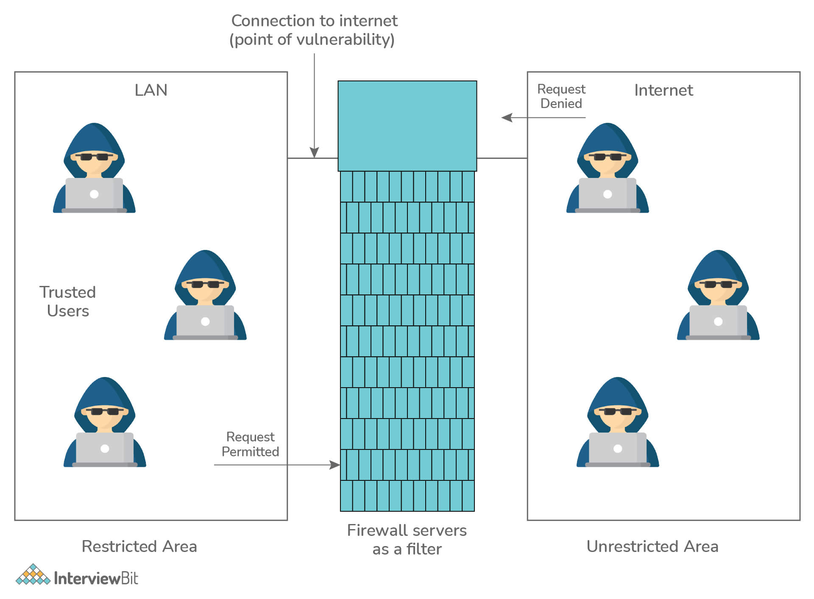
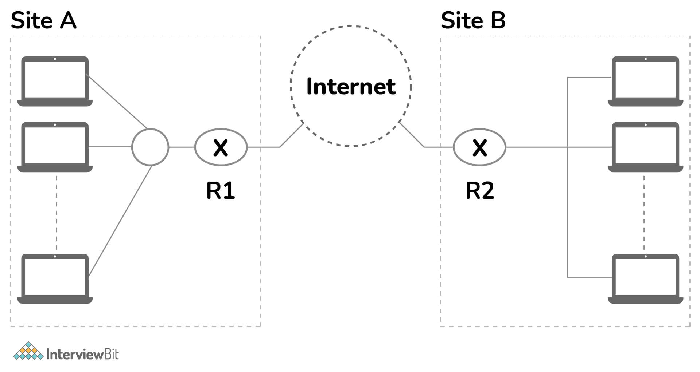
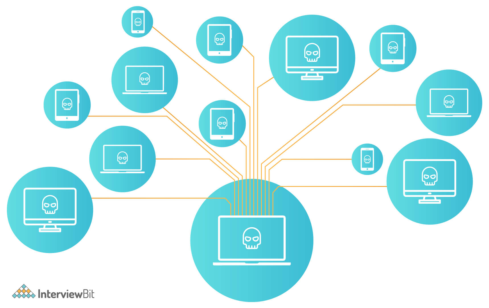
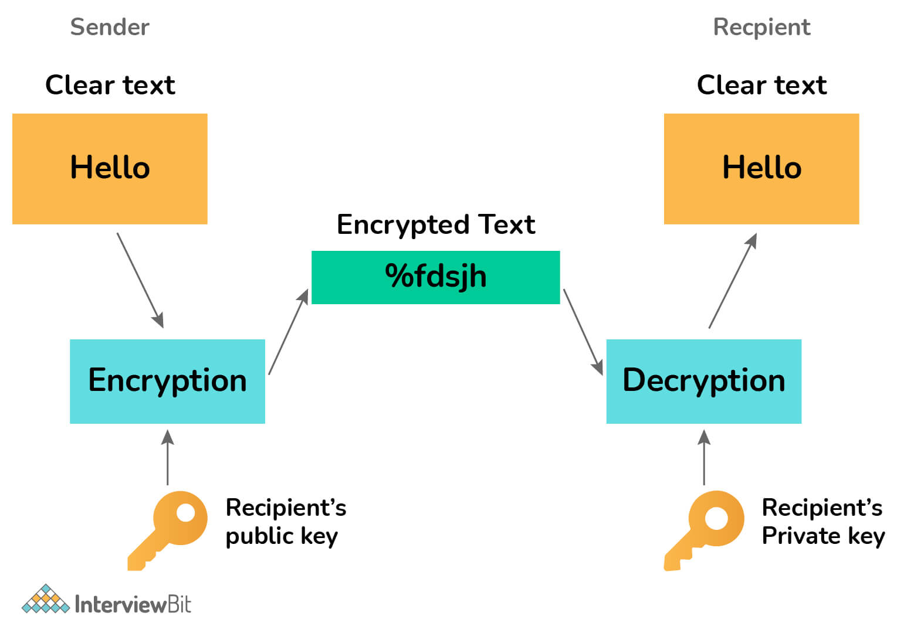

# Câu hỏi phỏng vấn an ninh mạng

## Giới thiệu về an ninh mạng

An ninh mạng là quá trình bảo vệ các hệ thống được kết nối internet như máy tính, máy chủ, thiết bị di động, hệ thống điện tử, mạng và dữ liệu khỏi các cuộc tấn công độc hại. An ninh mạng có thể được chia thành hai phần con: cyber (không gian mạng) và security (bảo mật).

Thuật ngữ "cyber" dùng để chỉ một loạt các công nghệ, bao gồm hệ thống, mạng, chương trình và dữ liệu. Mặt khác, security liên quan đến việc bảo vệ hệ thống, mạng, ứng dụng và dữ liệu. Nó còn được gọi là bảo mật thông tin điện tử hoặc bảo mật công nghệ thông tin trong một số trường hợp. 

An ninh mạng "được định nghĩa là" một tập hợp các công nghệ, quy trình thực tiễn nhằm ngăn chặn các cuộc tấn công, trộm cắp, làm hỏng, sửa đổi hoặc truy cập trái phép vào mạng, thiết bị, chương trình và dữ liệu. Nói cách khác, An ninh mạng là một tập hợp các khái niệm và kỹ thuật nhằm bảo vệ tài nguyên máy tính và thông tin trực tuyến của chúng ta trước những kẻ tấn công.

## Tầm quan trọng của an ninh mạng:

Hiện nay chúng ta đang sống trong kỷ nguyên kỹ thuật số, trong đó internet, máy tính và các thiết bị điện tử khác, cũng như các chương trình phần mềm, là những phần không thể thiếu trong cuộc sống hàng ngày của chúng ta. Tất cả các cơ sở hạ tầng quan trọng, bao gồm hệ thống ngân hàng, bệnh viện, tổ chức tài chính, chính phủ và các công xưởng, đều dựa vào các thiết bị kết nối Internet để vận hành doanh nghiệp của họ. Một số dữ liệu của họ, chẳng hạn như sở hữu trí tuệ, dữ liệu tài chính và thông tin cá nhân, rất dễ bị truy cập hoặc tiết lộ trái phép, có thể dẫn đến hậu quả nghiêm trọng. Những kẻ xâm nhập và các tác nhân đe dọa có thể sử dụng thông tin này để xâm nhập chúng vì lợi ích tài chính, tống tiền, hay vì lý do chính trị - xã hội hoặc đơn giản là phá hoại.

Các cuộc tấn công mạng, làm tổn hại hệ thống, đang trở thành mối quan tâm toàn cầu và các vi phạm an ninh khác có thể gây nguy hiểm cho nền kinh tế toàn cầu. Do đó, việc có một chiến lược an ninh mạng mạnh mẽ để bảo vệ dữ liệu nhạy cảm khỏi các vi phạm bảo mật cao cấp là rất quan trọng. Hơn nữa, khi số lượng các cuộc tấn công mạng tăng lên, các doanh nghiệp và tổ chức, đặc biệt là những tổ chức xử lý  thông tin kinh doanh và cá nhân nhạy cảm như hồ sơ an ninh quốc gia, sức khỏe hoặc tài chính, phải sử dụng các biện pháp và quy trình an ninh mạng mạnh mẽ để bảo vệ dữ liệu nhạy cảm của họ.

## Câu hỏi phỏng vấn an ninh mạng cho Fresher

### 1. Đối tượng chính trong an ninh mạng là gì?

Mục tiêu chính của an ninh mạng là bảo vệ dữ liệu. Để bảo vệ dữ liệu khỏi các cuộc tấn công mạng, lĩnh vực bảo mật đưa ra mô hình tam giác gồm ba nguyên tắc. Bộ ba CIA là tên cho nguyên tắc này. Mô hình CIA nhằm giúp các tổ chức phát triển các chính sách cho kiến trúc bảo mật thông tin của họ. Một hoặc nhiều nguyên tắc này sẽ bị phá vỡ khi phát hiện ra vi phạm bảo mật. Tính bảo mật, tính toàn vẹn và tính khả dụng là ba thành phần của mô hình CIA. Đó là một mô hình bảo mật hướng dẫn các cá nhân thông qua nhiều khía cạnh của bảo mật CNTT. Chúng ta hãy xem xét kỹ hơn từng phần.

- **Tính bảo mật** của thông tin là mức độ bảo mật cần thiết nhằm đảm bảo những dữ liệu quan trọng không bị rò rỉ hay lộ thông tin. Kẻ tấn công có thể thực hiện nhiều phương thức nhằm đạt được mục đích là lấy những thông tin mong muốn. Những phương thức đó có thể là giám sát hệ thống mạng, lấy các file chứa mật khẩu, hay Social engineering. Thông tin có thể bị lộ do không sử dụng các phương thức mã hóa đủ mạnh khi truyền hay lưu trữ thông tin.
- **Tính toàn vẹn** của thông tin là mức độ bảo mật cần thiết nhằm đảm bảo độ tin tưởng của thông tin không bị thay đổi hay chỉ được chỉnh sửa bởi người có thẩm quyền. Kẻ tấn công có thể thực hiện nhiều phương thức nhằm thay đổi những thông tin mong muốn. Những phương thức đó có thể là đột nhập vượt qua các quá trình xác thực, hoặc tấn công khai thác lỗ hổng bảo mật của hệ thống. Đây là mức độ bảo mật thông tin quan trọng, hàng năm có rất nhiều tổ chức doanh nghiệp bị tấn công khai thác lỗ hổng bảo mật và bị thay đổi dữ liệu.
- **Tính khả dụng**, khả năng đáp ứng của thông tin là điều rất quan trọng, điều này thể hiện tính sẵn sàng phục vụ của các dịch vụ. Khả năng đáp ứng của hệ thống chịu ảnh hưởng bởi khá nhiều thành phần: có thể là phần cứng, phần mềm hay hệ thống Backup. Khả năng đáp ứng của hệ thống cần được tính đến dựa trên số người truy cập và mức độ quan trọng của dữ liệu.

### 2. Sự khác biệt giữa mối đe dọa, lỗ hổng bảo mật và rủi ro?

**Threat:** Mối đe dọa là bất kỳ dạng nguy cơ nào có khả năng phá hủy hoặc đánh cắp dữ liệu, làm gián đoạn hoạt động hoặc gây hại nói chung. Phần mềm độc hại, lừa đảo, vi phạm dữ liệu và thậm chí cả những nhân viên không có đạo đức đều là những ví dụ về các mối đe dọa.
Các tác nhân đe dọa, có thể là các cá nhân hoặc nhóm với nhiều nguồn gốc và động cơ khác nhau, thể hiện các mối đe dọa. Hiểu các mối đe dọa là điều cần thiết để phát triển các biện pháp giảm thiểu hiệu quả và đưa ra các quyết định về an ninh mạng sáng suốt. Thông tin tình báo về mối đe dọa là thông tin liên quan đến các mối đe dọa và tác nhân đe dọa.

**Vulnerability:** Lỗ hổng bảo mật là một lỗ hổng trong phần cứng, phần mềm, nhân sự hoặc quy trình mà các tác nhân đe dọa có thể sử dụng để đạt được mục tiêu của họ.

Các lỗ hổng vật lý, chẳng hạn như thiết bị mạng bị lộ công khai, lỗ hổng phần mềm, chẳng hạn như lỗ hổng tràn bộ đệm trong trình duyệt và thậm chí lỗ hổng con người, chẳng hạn như một nhân viên dễ bị tấn công lừa đảo, đều là những ví dụ về lỗ hổng.

Quản lý lỗ hổng bảo mật là quá trình xác định, báo cáo và sửa chữa các lỗ hổng. Lỗ hổng zero-day là lỗ hổng chưa có biện pháp khắc phục.

**Risk:** Xác suất của một mối đe dọa và hậu quả của một lỗ hổng được kết hợp để tạo thành rủi ro. Nói một cách khác, rủi ro là khả năng tác nhân đe dọa khai thác thành công một lỗ hổng, có thể được tính bằng công thức:

### 3. XSS là gì? Và cách ngăn chặn nó?

XSS là viết tắt của Cross-site scripting. Đây là một lỗ hổng bảo mật web cho phép kẻ tấn công thao túng cách người dùng tương tác với một ứng dụng dễ bị tấn công. Nó cho phép kẻ tấn công thực hiện chính sách cùng origin, nghĩa là giữ cho các trang web tách biệt với nhau. Tấn công XXS cho phép kẻ tấn công đóng giả người dùng, nạn nhân, và thực hiện bất kỳ hành động nào mà người dùng có thể thực hiện, cũng như truy cập bất kỳ dữ liệu nào của người dùng. Nếu người dùng có quyền truy cập đặc quyền vào ứng dụng, kẻ tấn công có thể kiểm soát hoàn toàn chức năng và dữ liệu của ứng dụng.

Cách ngăn chặn XSS có thể đơn giản trong một số trường hợp, nhưng có thể khó hơn nhiều trong những trường hợp khác, tùy thuộc vào độ tinh vi của ứng dụng và cách nó xử lý dữ liệu do người dùng kiểm soát. Nói chung, việc ngăn chặn các lỗ hổng XSS gần như chắc chắn sẽ cần sự kết hợp của các biện pháp sau: 
#### Lọc (filter)

Có hai khái niệm cơ bản về quá trình lọc (filter) XSS: lọc đầu vào (input filtering) và lọc đầu ra (output filtering). Cách sử dụng phổ biến nhất là lọc đầu vào. Input Filtering được xem là chính xác hơn so với Output Filtering, đặc biệt trong trường hợp XSS Reflected. Tuy nhiên có một sự khác biệt nhỏ, quá trình lọc đầu vào áp dụng cho tất cả các loại dữ liệu, loại bỏ những nội dung không hợp lệ trong khi lọc đầu ra chỉ mang tính áp dụng lại, mục đích bài trừ các loại mã độc còn xót lại.

#### Input Encoding

Mã hóa đầu vào có thể trở thành một vị trí trung tâm cho tất cả các bộ lọc, đảm bảo chỉ có một điểm duy nhất cho tất cả các bộ lọc.

Mã hóa phía máy chủ là một tiến trình mà tất cả nội dung phát sinh động sẽ đi qua một hàm mã hóa nơi mà các thẻ script sẽ được thay thể bởi mã của nó. Nói chung, việc mã hóa (encoding) được khuyến khích sử dụng vì nó không yêu cầu bạn phải đưa ra quyết định những kí tự nào là hợp lệ hoặc không hợp lệ.Tuy nhiên việc mã hóa tất cả dữ liệu không đáng tin cậy có thể tốn tài nguyên và ảnh hưởng đến khả năng thực thi của một số máy chủ.

#### Output Encoding

Mục đích của việc mã hóa đầu ra (vì nó liên quan Cross Site Scripting) là chuyển đổi đầu vào không tin cậy vào một hình thức an toàn, nơi đầu vào sẽ được hiển thị như dữ liệu cho người sử dụng mà không thực hiện được như đang trong trình duyệt. ( cái này khá đa dạng, các bạn có thể tìm hiểu thêm sau 😄 )

#### Dùng Header

Sử dụng `Content-Type` và `X-Content-Type-Options` để đảm bảo rằng trình duyệt độc phản hồi HTTP theo cách của bạn, ngăn XSS trong phản hồi HTTP không có bất kỳ HTML hoặc JavaScript nào.

#### Policy 

Bạn có thể sử dụng Content Security Policy (CSP) làm tuyến phòng thủ cuối cùng để giảm thiểu mức độ nghiêm trọng của bất kỳ vấn đề XSS nào còn lại. 

### 4. Tường lửa là gì?

Tường lửa (Firewall) là một hệ thống an ninh mạng, có thể dựa trên phần cứng hoặc phần mềm, sử dụng các quy tắc để kiểm soát traffic vào, ra khỏi hệ thống. Tường lửa hoạt động như một rào chắn giữa mạng an toàn (LAN) và mạng không an toàn (Internet). Nó kiểm soát các truy cập đến nguồn lực của mạng thông qua một mô hình kiểm soát chủ động. Nghĩa là, chỉ những traffic phù hợp với chính sách được định nghĩa trong tường lửa mới được truy cập vào mạng, mọi traffic khác đều bị từ chối.

Như trong hình bên dưới là tường lửa giữa LAN và Internet.

Có hai loại tường lửa trong hệ thống là: một cái dùng bộ lọc tầng network còn cái kia dùng server proxy ở tầng network hay application.

### 5. VPN là gì?

Thuật ngữ VPN dùng để chỉ Virtual Private Network, một mạng riêng ảo. Nó cho phép bạn kết nối máy tính của mình với mạng riêng, thiết lập kết nối được mã hóa để ẩn địa chỉ IP của bạn, cho phép bạn chia sẻ dữ liệu và truy cập web một cách an toàn đồng thời bảo vệ danh tính trực tuyến của bạn.

Mạng riêng ảo, hay VPN, là một liên kết được mã hóa giữa thiết bị và mạng qua Internet. Kết nối được mã hóa hỗ trợ việc truyền dữ liệu nhạy cảm một cách an toàn. Nó chống lại việc nghe trộm lưu lượng truy cập bất hợp pháp và cho phép người dùng làm việc từ xa. Trong các công ty, công nghệ VPN thường được sử dụng.

### 6. Hacker black hat, white hat và grey hat là gì?

Một cách tổng quát, hacker được chia ra làm ba loại là: black hat, grey hat và white hat.

#### Black hat hacker
Đây là những gã mà mọi người nghĩ đến khi họ nghe thấy từ hacker. Những gã này là những người xấu. Họ sử dụng năng lực và trí thông minh của mình để kiếm tiền theo những cách trái pháp luật.

Bất cứ khi nào họ tìm thấy một kẽ hở, họ sẽ tìm cách sử dụng chúng cho lợi ích của mình và không cho chủ nhân của chúng biết về những mối đe doạ và kẽ hở đó.

Họ cố gắng ăn cắp password, email và những thông tin liên quan đến người dùng và bán nó trên Dark Web.

#### Grey hat hacker
Đây là thể loại đứng giữa hai loại hacker mũ trắng và mũ đen. Những gã này tìm ra lỗ hổng và thông báo chúng cho chính phủ, cơ quan tình báo hay đôi khi là quân đội.

Sau đó, chính phủ sẽ sử dụng những thông tin này để hack vào một cơ quan hay một nhóm tội phạm hình sự.

Họ có thể là cá nhân hay những nhà nghiên cứu theo đuổi việc tìm kiếm bugs và những sai sót có thể hữu ích cho chính phủ.

#### White hat hacker
Đây là những người tốt, họ hack vào một hệ thống hay một phần mềm và sau đó thông báo nó cho những người có trách nhiệm về những bugs cần được sửa.

Họ giúp đỡ để xây dựng một phần mềm tốt hơn và an toàn hơn. Họ kiếm tiền dưới hình thức là tiền thưởng khi thông báo cho những công ty biết về lỗ hổng bảo mật.

Tiền thưởng là khác nhau dựa vào mức độ nghiêm trọng của lỗ hổng, tuy nhiên, nó có thể từ $500 đến $100000.

### 7. Các loại an ninh mạng?

Tài sản của mọi công ty được tạo thành từ nhiều hệ thống khác nhau. Các hệ thống này có một thế trận an ninh mạng mạnh mẽ, đòi hỏi các hành động phối hợp trên diện rộng. Do đó, an ninh mạng có thể được chia thành các lĩnh vực phụ sau:

**An ninh mạng:** Là quá trình bảo vệ mạng máy tính chống lại sự truy cập trái phép, những kẻ xâm nhập, tấn công, làm gián đoạn và lạm dụng phần cứng và phần mềm. Bảo mật này hỗ trợ trong việc bảo vệ tài sản của tổ chức khỏi các mối đe dọa từ bên ngoài lẫn bên trong. Ví dụ: Sử dụng Tường lửa.
**Bảo mật ứng dụng:** Nó đòi hỏi phải bảo vệ phần mềm và thiết bị an toàn trước các cuộc tấn công nguy hiểm. Điều này có thể được thực hiện bằng cách thường xuyên cập nhật các ứng dụng để đảm bảo rằng chúng an toàn trước các mối đe dọa.
Bảo mật dữ liệu: Nó đòi hỏi phải có một hệ thống lưu trữ dữ liệu mạnh mẽ để đảm bảo tính toàn vẹn và quyền riêng tư của dữ liệu trong quá trình lưu trữ và vận chuyển.
**Quản lý danh tính:** Nó đề cập đến quá trình xác định mức độ truy cập của mỗi cá nhân bên trong một tổ chức. Ví dụ: Hạn chế quyền truy cập vào dữ liệu theo vai trò công việc của một cá nhân trong công ty.
**Bảo mật hoạt động:** Nó đòi hỏi phải phân tích và đưa ra quyết định về cách xử lý và bảo mật tài sản dữ liệu. Ví dụ: Lưu trữ dữ liệu ở dạng mã hóa trong cơ sở dữ liệu.
**Bảo mật di động:** Nó đề cập đến việc bảo vệ dữ liệu tổ chức và cá nhân được lưu giữ trên các thiết bị di động như điện thoại di động, PC, máy tính bảng và các thiết bị tương tự khác chống lại nhiều cuộc tấn công thù địch. Truy cập trái phép, mất hoặc trộm thiết bị, phần mềm độc hại và các mối đe dọa khác là những ví dụ về những mối nguy hiểm này.
**Bảo mật đám mây:** Nó đề cập đến việc bảo vệ dữ liệu được lưu giữ trong môi trường kỹ thuật số hoặc trong cơ sở hạ tầng đám mây cho một tổ chức. Nó sử dụng nhiều nhà cung cấp dịch vụ đám mây khác nhau, bao gồm AWS, Azure, Google và các nhà cung cấp khác, để đảm bảo bảo vệ khỏi nhiều mối đe dọa.

### 8. Ưu điểm của an ninh mạng?

Sau đây là một số ưu điểm của việc áp dụng an ninh mạng:

- Doanh nghiệp được bảo vệ khỏi các cuộc tấn công mạng và vi phạm dữ liệu.
- Cả dữ liệu và an ninh mạng đều được bảo vệ.
- Quyền truy cập trái phép của người dùng được giữ ở mức tối thiểu.
- Có thời gian phục hồi nhanh hơn sau khi vi phạm.
- Bảo vệ cho người dùng cuối và thiết bị điểm cuối.
- Tuân thủ quy định.
- Hoạt động nhất quán.
- Các nhà phát triển, đối tác, người tiêu dùng, các bên liên quan và nhân viên có mức độ tin tưởng cao hơn vào danh tiếng của công ty.

### 9. Botnet là gì? 

Botnet thuật ngữ đầy đủ là “Bots network” dùng để chỉ một mạng lưới các máy tính bị chi phối bởi ai đó và bị điều khiển bởi một con máy tính khác từ xa. Botnet là một phần mềm độc hại, đa phần các máy tính đều bị nhiễm bởi một Bot nào đó mà chúng ta không thể nào phát hiện được.

### 10. Honeyput là gì?

Một honeypot là một hệ thống máy tính decoy cho bẫy hacker hoặc theo dõi các phương pháp hack độc đáo hoặc mới. Honeypots được thiết kế để cố tham gia và tin tặc đánh lừa và xác định hoạt động độc hại thực hiện qua Internet. Nhiều honeypots thể được đặt trên một mạng lưới để tạo thành một Honeynet.

### 11. Sự khác biệt giữa Đánh giá lỗ hổng và Kiểm tra thâm nhập?

Đánh giá lỗ hổng và kiểm tra thâm nhập là hai cụm từ khác nhau, cả hai đều phục vụ cùng một mục đích: bảo mật môi trường mạng.

**Đánh giá lỗ hổng bảo mật** là một quá trình xác định, phát hiện và ưu tiên các lỗ hổng trong hệ thống máy tính, cơ sở hạ tầng mạng, ứng dụng và các hệ thống khác, cũng như cung cấp thông tin cần thiết cho tổ chức để sửa chữa các lỗ hổng.

**Kiểm tra thâm nhập** còn được gọi là kiểm tra đạo đức hoặc kiểm tra bút. Đó là một phương pháp xác định các lỗ hổng trong mạng, hệ thống, ứng dụng hoặc các hệ thống khác để ngăn những kẻ tấn công khai thác chúng. Nó được sử dụng phổ biến nhất để bổ sung tường lửa ứng dụng web trong bối cảnh bảo mật ứng dụng web (WAF).

Quét lỗ hổng tương tự như việc tiếp cận một cánh cửa và kiểm tra xem nó có được mở khóa hay không trước khi dừng lại. Thử nghiệm thâm nhập tiến xa hơn một bước, không chỉ kiểm tra xem cửa có mở khóa hay không mà còn mở cửa và bước vào ngay.

### 12. Null Session nghĩa là gì?

Null Session xảy ra khi người dùng không được phép sử dụng tên người dùng hoặc mật khẩu. Nó có thể gây lo ngại về bảo mật cho các ứng dụng vì nó ngụ ý rằng người đưa ra yêu cầu là không xác định. 

### 13. Các kiểu tấn công mạng phổ biến

- Malware 
- Cross-Site Scripting (XSS) 
- Denial-of-Service (DoS)
- Domain Name System Attack
- Man-in-the-Middle Attacks 
- SQL Injection Attack 
- Phishing
- Session Hijacking
- Brute Force

### 14. Tấn công brute force là gì?

Tấn công Brute Force là một loại tấn công mạng, trong đó bạn có một phần mềm, xoay vòng các ký tự khác nhau, kết hợp để tạo ra một mật khẩu đúng. Phần mềm Brute Force Attack password cracker đơn giản sẽ sử dụng tất cả các kết hợp có thể để tìm ra mật khẩu cho máy tính hoặc máy chủ mạng. Nó rất đơn giản và không sử dụng bất kỳ kỹ thuật thông minh nào. Vì phương pháp này chủ yếu dựa trên toán học, phải mất ít thời gian hơn để crack mật khẩu, bằng cách sử dụng các ứng dụng brute force thay vì tìm ra chúng theo cách thủ công. Nói phương pháp này dựa trên toán học vì máy tính làm rất tốt các phép toán và thực hiện chúng trong vài giây, nhanh hơn rất nhiều lần so với bộ não con người (mất nhiều thời gian hơn để tạo ra các sự kết hợp).

### 15. Shouder surfing là gì?

Là một kỹ thuật thu thập password bằng cách xem qua vai người khác khi họ đăng nhập vào hệ thống. Hacker có thể xem người sử dụng hợp lệ đăng nhập và sau đó sử dụng password đó đề giành được quyền truy xuất đến hệ thống.

### 16. Phishing là gì?

Phishing (Tấn công giả mạo) là hình thức tấn công mạng mà kẻ tấn công giả mạo thành một đơn vị uy tín để lừa đảo người dùng cung cấp thông tin cá nhân cho chúng.

Thông thường, tin tặc sẽ giả mạo thành ngân hàng, trang web giao dịch trực tuyến, ví điện tử, các công ty thẻ tín dụng để lừa người dùng chia sẻ các thông tin nhạy cảm như: tài khoản & mật khẩu đăng nhập, mật khẩu giao dịch, thẻ tín dụng và các thông tin quý giá khác.

Phương thức tấn công này thường được tin tặc thực hiện thông qua email và tin nhắn. Người dùng khi mở email và click vào đường link giả mạo sẽ được yêu cầu đăng nhập. Nếu “mắc câu”, tin tặc sẽ có được thông tin ngay tức khắc.

Bạn có thể tự bảo vệ mình khỏi các cuộc tấn công giả mạo bằng cách làm theo các nguyên tắc sau:

- Đừng đưa ra những thông tin quan trọng trên những trang web mà bạn không biết.
- Kiểm tra tính bảo mật của trang web.
- Sử dụng tường lửa.
- Sử dụng công cụ Anti-Phishing.

### 17. Sự khác biệt giữa mã hoá và băm?

#### Băm (hashing)

- Hashing là quá trình biến đầu vào là một nội dung có kích thước, độ dài bất kỳ rồi sử dụng những thuật toán, công thức toán học để biến thành đầu ra tiêu chuẩn có độ dài nhất định. Quá trình đó sử dụng những Hàm băm (Hash function).

- Hàm băm mật mã: Như tên gọi của nó vậy, những hàm băm như vậy được sử dụng vào mục đích mã hóa dữ liệu. Những hàm băm mật mã cũng giống như những hàm băm thông thường, nhưng mang trong mình một số đặc điểm khác, quan trọng nhất là không thể đảo ngược. Điều này có nghĩa là khi bạn có trong tay giá trị sau khi băm, bạn không thể biết giá trị ban đầu là gì. Điều này đơn giản như việc bạn uống một cốc sinh tố hỗn hợp rất ngon nhưng không thể nào liệt kê tất cả nguyên liệu của nó vậy.

Ngoài ra, hàm băm mật mã còn mang một số đặc điểm khác như tính tránh va chạm (xảy ra khi hai giá trị khác nhau nhưng khi chạy qua hàm băm lại trả về hai kết quả giống nhau), tính hiệu quả (thời gian tính toán những giá trị băm phải nhanh) và cả tính nhạy cảm (chỉ cần sự thay đổi nhỏ trong giá trị ban đầu có thể thay đổi hoàn toàn giá trị băm).

Vd: MD5, SHA256,... 

#### Mã hoá (encryption)

Thuật ngữ mã hóa dữ liệu (Data Encrypt) mô tả việc làm cho dữ liệu không thể đọc được đối với người hoặc máy tính khác mà nếu không được phép (không nên nhìn thấy nội dung). Dữ liệu được mã hóa được tạo bằng chương trình mã hóa như PGP, máy mã hóa hoặc khóa mật mã đơn giản và xuất hiện dưới dạng rác cho đến khi được giải mã. Để đọc hoặc sử dụng dữ liệu, dữ liệu phải được giải mã và chỉ những người có mật khẩu hoặc khóa giải mã chính xác mới có thể đọc lại dữ liệu.

Thuật ngữ mã hóa dữ liệu (Data Encrypt) mô tả việc làm cho dữ liệu không thể đọc được đối với người hoặc máy tính khác mà nếu không được phép (không nên nhìn thấy nội dung). Dữ liệu được mã hóa được tạo bằng chương trình mã hóa như PGP, máy mã hóa hoặc khóa mật mã đơn giản và xuất hiện dưới dạng rác cho đến khi được giải mã. Để đọc hoặc sử dụng dữ liệu, dữ liệu phải được giải mã và chỉ những người có mật khẩu hoặc khóa giải mã chính xác mới có thể đọc lại dữ liệu.

Vd: RSA, AES

### 18. Xác thực hai yếu tố là gì?

Xác thực hai yếu tố (2FA), thường được gọi là xác minh hai bước hoặc xác thực yếu tố kép, là một phương pháp bảo mật trong đó người dùng xác thực danh tính của họ bằng hai yếu tố xác thực độc lập. Quy trình này được thực hiện để bảo vệ tốt hơn thông tin đăng nhập của người dùng cũng như các tài nguyên mà người dùng có quyền truy cập. Xác thực một yếu tố (SFA), trong đó người dùng chỉ cung cấp một yếu tố - thường là mật khẩu hoặc mật mã - cung cấp mức độ bảo mật thấp hơn so với xác thực hai yếu tố (TFA). Vì chỉ sở hữu mật khẩu của bị cáo là không đủ để thực hiện kiểm tra xác thực, xác thực hai yếu tố bổ sung thêm một lớp bảo mật cho quá trình xác thực, khiến những kẻ tấn công khó truy cập vào thiết bị hoặc tài khoản trực tuyến của một người hơn.

.jpg)