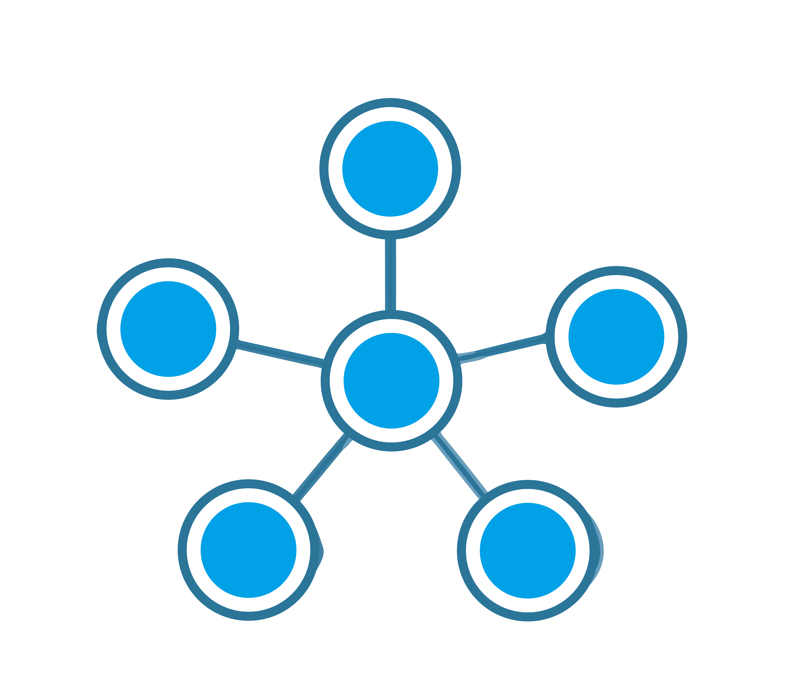
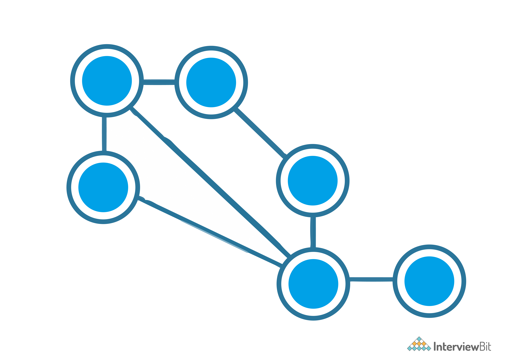
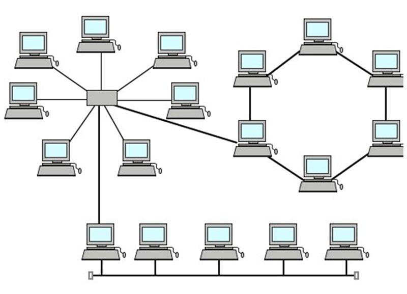
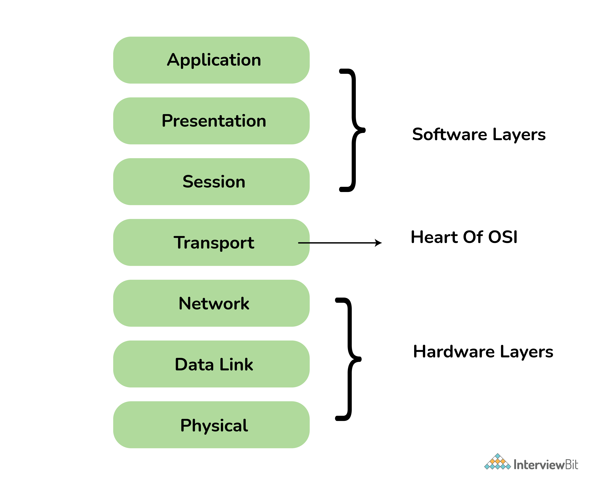
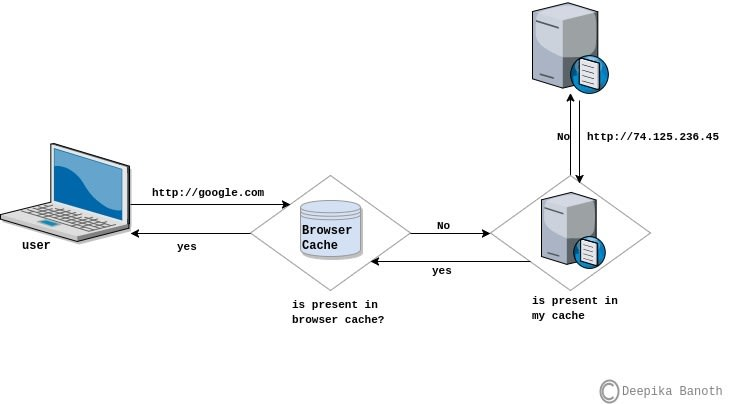

# Mạng máy tính

## Mạng máy tính là gì?

Theo Merriam Webster, mạng là một nhóm được kết nối với nhau một cách không chính thức bởi các thực thế khác nhau như con người, máy tính, đài phát thanh,...

Ví dụ, Dominos có mạng lưới 1232 chi nhánh trên khắp Ấn Độ. Cho thấy mạng máy tính là một hệ thống các thiết bị ngoại vi hoặc máy tính được kết nối với nhau và có một kênh giao tiếp tiêu chuẩn được thiết lập giữa chúng để trao đổi các loại thông tin và dữ liệu khác nhau. 

## Tại sao mang máy tính quan trọng?

Bạn đã bao giờ nghe nói về Internet hoặc NET? Tôi đoán là có, vì bạn chỉ có thể đọc bài viết này nhờ vào Internet. Nhưng, bạn đã bao giờ nghĩ về internet chưa? Internet là một mạng lưới kết nối tất cả các thiết bị hỗ trợ mạng khác nhau cho phép chia sẻ dữ liệu và thông tin giữa chúng và điều đó làm cho mạng máy tính trở thành một phần cốt lõi trong cuộc sống của chúng ta và các cuộc phỏng vấn công nghệ.

Dưới đây là danh sách tất cả các câu hỏi mạng thường gặp trong các cuộc phỏng vấn từ cấp độ cơ bản đến nâng cao.

## Câu hỏi phỏng vấn mạng máy tính cho Fresher

### 1. Mạng máy tính được phân loại như thế nào?

Các loại mạng có thể được phân loại và phân chia dựa trên khu vực phân bố của chúng. Sơ đồ dưới đây sẽ giúp hiểu nhanh hơn:

### 2. Giải thích về các loại mạng?

| Loại | Mô tả |
|------|-------|
| PAN (Personal Area Network) | Các thiết bị kết nối và giao tiếp trong phạm vi người dùng (như kết nối bluetooth) |
| LAN (Local Area Network) | Mạng thuộc sở hữu tư nhân như trong một văn phòng, nhà máy,...
| MAN (Metropolotan Area Network) | Được kết nối trên khu vực toàn thành phố vd như hệ thống TV cable |
| WAN (Wide Area Network) | Nó trải dài trên một khu vực địa lý rộng lớn, thường là một quốc gia hoặc lục địa. Internet là mạng WAN lớn nhất |
| GAN (Global Area Network) | Còn được gọi là internet, kết nối toàn cầu thông qua vệ tinh. |

### 3. Giải thích về LAN?

Mạng LAN được sử dụng rộng rãi để kết nối máy tính/laptop và thiết bị điện tử tiêu dùng cho phép chúng chia sẻ tài nguyên (ví dụ: máy in, máy fax) và trao đổi thông tin. Khi mạng LAN được sử dụng bởi các công ty hoặc tổ chức, chúng được gọi là mạng doanh nghiệp. Có hai loại mạng LAN khác nhau, tức là mạng LAN không dây (không có dây, khi sử dụng Wi-Fi) và mạng LAN có dây (sử dụng được bằng cáp LAN). Ngày nay, mạng LAN không dây rất phổ biến ở những nơi khó lắp đặt dây. Các sơ đồ dưới đây giải thích cả mạng LAN không dây và có dây.

.png)

### 4. VPN là gì?

VPN hay Virtual Private Network là một mạng WAN riêng tư được xây dựng trên internet. Nó cho phép tạo một đường hầm bảo mật (secured tunnel) giữa hai mạng khác nhau sử dụng internet. Bằng cách dùng VPN, một client có thể kết nối từ xa tới mạng của tổ chức. So đồ dưới đây cho thấy một mạng wan của tổ chức ở Úc sử dụng VPN:

.png)

### 5. Lợi ích của VPN?

- VPN được sử dụng để kết nối các văn phòng ở các vị trí địa lý khác nhau từ xa và rẻ hơn khi so sánh với kết nối WAN.
- VPN được sử dụng cho các giao dịch an toàn và truyền dữ liệu bí mật giữa nhiều văn phòng đặt tại các vị trí địa lý khác nhau.
- VPN giữ cho thông tin của tổ chức được bảo mật trước mọi mối đe dọa hoặc sự xâm nhập tiềm ẩn bằng cách sử dụng ảo hóa.
- VPN mã hóa lưu lượng truy cập internet và che giấu danh tính trực tuyến.

### 6. Các loại VPN khác nhau?

- **Access VPN** được dùng để cung cấp kết nối cho người dùng di động từ xa và thiết bị viễn thông. Nó phục vụ như một sự thay thế cho kết nối dial-up hay ISDN (Integrated Services Digital Network). Nó là một giải pháp chi phí thấy và cung cấp một loạt kết nối.
- **Site-to-Site VPN** hay Router-to-Router VPN thường được dùng bởi các công ty lớn có các chi nhánh ở các địa điểm khác nhau để kết nối mạng cho các văn phòng ở các địa điểm khác nhau. Nó có hai kiểu phụ là:
- **Intranet VPN**: hữu ích khi kết nối các văn phòng từ xa trên các khu vực địa lý khác nhau bằng cơ sở hạ tầng chung (kết nối internet và server) với các chĩnh sách hỗ trợ như mạng WAN riêng tư.
- **Extranet VPN** sử dụng cơ sở hạ tầng chung qua mạng intranet, nhà cung cấp, khách hàng, đối tác và các thực thể khác và kết nối chúng bằng kết nối chuyên dụng. 

### 7. Nodes và links là gì?

**Node** tạm dịch là nút, bất kỳ thiết bị giao tiếp nào trong mạng đều được gọi là nút. Một nút là một điểm giao nhau trong mạng. Nó có thể gửi/nhận dữ liệu và thông tin trong mạng. Ví dụ một nút có thể là máy tính, laptop, máy in, máy fax,...

**Link** tạm dịch là liên kết, đề cập đến khả năng kết nối giữa hai nút trong mạng. Nó bao gồm kiểu kết nối không dây và có dây giữa các nút và giao thức được sử dụng để chúng có thể giao tiếp lẫn nhau.

### 8. Cấu trúc liên kết mạng là gì?

Cấu trúc liên kết mạng là một bố trí vật lý của mạng, kết nối các nút khác nhau bằng các liên kết. Nó mô tả kết nối giữa các máy tính, thiết bị, cáp, v.v.

### 9. Các kiểu cấu trúc liên kết mạng khác nhau?

#### Dạng bus:

- Tất cả nút đều kết nối với liên kết trung tâm gọi là bus.
- Hữu ích với số lượng thiết bị nhỏ.
- Nếu cáp chính bị hỏng, nó sẽ làm hỏng toàn bộ mạng.

#### Dạng sao:

- Tất cả các nút được kết nối với một nút duy nhất được gọi là nút trung tâm.
- Nó mạnh mẽ hơn. bus
- Nếu nút trung tâm bị lỗi, toàn bộ mạng sẽ bị hỏng.
- Dễ dàng khắc phục sự cố.
- Chủ yếu được sử dụng trong mạng gia đình và văn phòng.

#### Dạng vòng:

- Mỗi nút được kết nối với chính xác hai nút tạo thành cấu trúc vòng.
- Nếu một trong các nút bị hỏng, nó sẽ làm hỏng toàn bộ mạng.
- Nó rất hiếm khi được sử dụng vì nó đắt và khó cài đặt và quản lý.

#### Dạng lưới:

- Mỗi nút được kết nối với một hoặc nhiều nút.
- Nó chắc chắn hỏng khi một liên kết ngắt kết nối nút đó.
- Nó hiếm khi được sử dụng và việc cài đặt cũng như quản lý rất khó khăn.

#### Dạng cây:

- Là kết hợp giữa dạng sao và dạng bus còn được gọi là dạng bus mở rộng.
- Tất cả các mạng sao nhỏ hơn được kết nối với một bus duy nhất.
- Nếu bus chính bị lỗi, toàn bộ mạng bị hỏng.

#### Dạng nâng cao:

- Nó là sự kết hợp của các cấu trúc liên kết khác nhau để tạo thành một cấu trúc liên kết mới.
- Nó giúp bỏ qua nhược điểm của một cấu trúc liên kết cụ thể và giúp chọn điểm mạnh từ cấu trúc khác.

### 10. Địa chỉ IPv4 là gì? Các lớp của IPv4?

Một địa chỉ IP là địa chỉ 32-bit của một nút trong mạng. Một địa chỉ IPv4 có 4 octet, mỗi octet là 8-bit với mỗi số có giá trị lên đến 255.

Các lớp IPv4 được phân biệt dựa trên số lượng máy chủ mà nó hỗ trợ trên mạng. Có năm loại lớp IPv4 và dựa trên octet đầu tiên của địa chỉ IP được phân loại là Lớp A, B, C, D hoặc E.

| Lớp IPv4 | Địa chỉ bắt đầu | Địa chỉ kết thúc | Sử dụng |
|----------|-----------------|------------------|---------|
| A | 0.0.0.0 | 127.255.255.255 | Dùng cho mạng lớn |
| B | 128.0.0.0 | 191.255.255.255 | Dùng cho mạng cỡ vừa |
| C | 192.0.0.0 | 223.255.255.255 | Dùng cho mạng LAN |
| D | 224.0.0.0 | 239.255.255.255 | Dành riêng cho nhiều người |
| E | 240.0.0.0 | 255.255.255.254 | Nghiên cứu và R&D |

### 11. Địa chỉ IP riêng tư và đặc biệt?

**Địa chỉ riêng tư:** Đối với mỗi lớp, có các IP cụ thể được dành riêng cho mục đích sử dụng riêng. Không thể sử dụng địa chỉ IP này cho các thiết bị trên Internet vì chúng không thể định tuyến được.

| Lớp IPv4 | Địa chỉ bắt đầu | Địa chỉ kết thúc |
|----------|-----------------|------------------|
| A | 10.0.0.0 | 10.255.255.255 |
| B | 172.16.0.0 | 172.31.255.255 |
| B | 192.168.0.0 | 192.168.255.255 |

**Địa chỉ đặc biệt:** Dải IP từ 127.0.0.1 đến 127.255.255.255 là địa chỉ kiểm tra mạng còn được gọi là địa chỉ loopback hay địa chỉ IP đặc biệt.

## Câu hỏi phỏng vấn mạng máy tính cho Experienced

### 12. Mô tả mô hình OSI?

**Open System Interconnections (OSI)** là kiến trúc mạng dựa trên chuẩn ISO. Được gọi là mô hình OSI, nó giải quyết việc kết nối các hệ thống mở để giao tiếp với các hệ thống khác.

Mô hình OSI có 7 tầng. Các nguyên tắc dùng cho mỗi tầng có thể tổng hợp như sau:
- Tạo một tầng mới nếu cần một sự trừu tượng khác.
- Mỗi tầng phải có chức năng được xác định rõ ràng.
- Chức năng của mỗi tầng được chọn dựa trên các giao thức chuẩn hoá quốc tế.

### 13. Các tầng trong mô hình OSI là gì?

| Tầng | Đơn vị | Mô tả |
|------|--------|-------|
| 1.Physical | Bit | Lớp vật lý định nghĩa các đặc tính vật lý của mạng chẳng hạn như kết nối, cấp điện áp và thời gian. |
| 2.Data Link | Frame | Các lớp liên kết dữ liệu định dạng các thông điệp vào một khung dữ liệu(Frame), và thêm vào đó một header chứa các địa chỉ phần cứng nơi nhận và địa chỉ nguồn của nó. Tiêu đề này chịu trách nhiệm cho việc tìm kiếm các thiết bị đích tiếp theo trên một mạng nội bộ. |
| 3.Network | Package | Lớp này cung cấp địa chỉ logic mà router sẽ sử dụng để xác định đường đi đến đích.Trong hầu hết các trường hợp, địa chỉ logic ở đây có nghĩa là các địa chỉ IP (bao gồm nguồn & địa chỉ đích IP). |
| 4.Transport | TPDU  | Lớp này duy trì kiểm soát luồng của dữ liệu, thực hiện kiểm tra lỗi và khôi phục dữ liệu giữa các thiết bị. Ví dụ phổ biến nhất của tầng giao vận là Transmission Control Protocol (TCP) và User Datagram Protocol (UDP). |
| 5.Session | SPDU | Nhiệm vụ của lớp này là thiết lập, duy trì và kết thúc giao tiếp với các thiết bị nhận. |
| 6.Presentation | PPDU | Lớp này đảm bảo việc trình bày dữ liệu, mà các thông tin liên lạc qua lớp này nằm trong các hình thức thích hợp đối với người nhận. Nói chung, nó hoạt động như một dịch giả của mạng. Ví dụ, bạn muốn gửi một email và tầng trình bày sẽ định dạng dữ liệu của bạn sang định dạng email. Hoặc bạn muốn gửi ảnh cho bạn bè của bạn, lớp Presentation sẽ định dạng dữ liệu của bạn vào các định dạng GIF, JPG hoặc PNG. |
| 7.Application | APDU | Đây là lớp gần gũi nhất với người dùng cuối. Nó cung cấp giao diện giữa các ứng dụng với các lớp phía dưới. Nhưng chú ý rằng các chương trình bạn đang sử dụng (như một trình duyệt web - IE, Firefox hay Opera ...) không thuộc về lớp Application.Telnet, FTP, client email (SMTP), HyperText Transfer Protocol (HTTP) là những ví dụ của lớp Application. |

### 14. Mô tả mô hình TCP/IP?

Nó là một phiên bản nén của mô hình OSI chỉ có 4 tầng. Nó được phát triển bởi Bộ Quốc phòng Hoa Kỳ (DoD) vào những năm 1980. Tên của mô hình này dựa trên 2 giao thức tiêu chuẩn được sử dụng, đó là TCP (Transmission Control Protocol) và IP (Internet Protocol).

### 15. Các tầng trong mô hình TCP/IP là gì?

| Tầng | Mô tả |
|------|-------|
| 1.Link | Là sự kết hợp giữa tầng Vật lý và tầng liên kết dữ liệu của mô hình OSI. Chịu trách nhiệm truyền dữ liệu giữa hai thiết bị trong cùng một mạng. Tại đây, các gói dữ liệu được đóng vào khung (gọi là Frame) và được định tuyến đi đến đích đã được chỉ định ban đầu. |
| 2.Internet | Gần giống như tầng mạng của mô hình OSI. Tại đây, nó cũng được định nghĩa là một giao thức chịu trách nhiệm truyền tải dữ liệu một cách logic trong mạng. Các phân đoạn dữ liệu sẽ được đóng gói (Packets) với kích thước mỗi gói phù hợp với mạng chuyển mạch mà nó dùng để truyền dữ liệu. Lúc này, các gói tin được chèn thêm phần Header chứa thông tin của tầng mạng và tiếp tục được chuyển đến tầng tiếp theo. Các giao thức chính trong tầng là IP, ICMP và ARP. |
| 3.Transport | Chức năng chính của tầng 3 là xử lý vấn đề giao tiếp giữa các máy chủ trong cùng một mạng hoặc khác mạng được kết nối với nhau thông qua bộ định tuyến. Tại đây dữ liệu sẽ được phân đoạn, mỗi đoạn sẽ không bằng nhau nhưng kích thước phải nhỏ hơn 64KB. Cấu trúc đầy đủ của một Segment lúc này là Header chứa thông tin điều khiển và sau đó là dữ liệu. |
| 4.Application | Đây là lớp giao tiếp trên cùng của mô hình. Đúng với tên gọi, tầng Ứng dụng đảm nhận vai trò giao tiếp dữ liệu giữa 2 máy khác nhau thông qua các dịch vụ mạng khác nhau (duyệt web, chat, gửi email, một số giao thức trao đổi dữ liệu: SMTP, SSH, FTP,...). Dữ liệu khi đến đây sẽ được định dạng theo kiểu Byte nối Byte, cùng với đó là các thông tin định tuyến giúp xác định đường đi đúng của một gói tin. |

### 16. Sự khác biệt của mô hình OSI và mô hình TCP/IP?

| Mô hình OSI | Mô hình TCP/IP |
|-------------|----------------|
| Kiến trúc 7 tầng | Kiến trúc 4 tầng | 
| Có ranh giới và chức năng cố định cho mỗi lớp | Kiến trúc linh hoạt không có ranh giới nghiêm ngặt giữa các lớp |
| Độ tin cậy thấp | Độ tin cậy cao |
| Tiếp cận các tầng theo chiều dọc | Tiếp cận các tầng theo chiều ngang |

### 17. Giao thức HTTP và HTTPS là gì?

HTTP là viết tắt của HyperText Transfer Protocol, giao thức truyền tải siêu văn bản, nó xác định một tập hợp quy tắc và chuẩn để truyền tải dữ liệu trên World Wide Web (WWW). Nó giúp trình duyệt web và web server có thể giao tiếp. Nó là "stateless protocol trong đó mỗi lệnh là độc lập với các lệnh trước đó. HTTP là giao thức ở tầng ứng dụng xây dựng trên TCP. Cổng mặc định của nó là 80.

Còn HTTPS là viết tắt của từ HyperText Transfer Protocol Secure. Nó là phiên bản bảo mật và nâng cao của HTTP. Trên cùng của HTTP, giao thức SSL/TLC được dùng cho bảo mật. Nó mã hóa dữ liệu truyền tải nhằm gia tăng bảo mật giữa Web sever đến các trình duyệt web. Nó sử dụng cổng mặc định là 443.

### 18. Giao thức SMTP là gì?

SMTP là viết tắt của Simple Mail Transfer Protocol. SMTP tập hợp các quy tắc giao tiếp giữa các server. Tập quy tắc này giúp phần mềm gửi nhận mail trên internet. Nó hỗ trợ phương thức End-to-End và Store-and-Forward. Nó luôn luôn hoạt động trên cổng 25.

### 19. DNS là gì?

DNS là viết tắt của cụm từ Domain Name System, mang ý nghĩa đầy đủ là hệ thống phân giải tên miền. Hiểu một cách ngắn gọn nhất, DNS cơ bản là một hệ thống chuyển đổi các tên miền website mà chúng ta đang sử dụng, ở dạng www.tenmien.com sang một địa chỉ IP dạng số tương ứng với tên miền đó và ngược lại.

### 20. Công dụng của router là gì và nó khác với gateway như thế nào?

Bộ định tuyến (router) là một thiết bị mạng được sử dụng để kết nối hai hoặc nhiều phân đoạn mạng. Nó định hướng lưu lượng trong mạng. Nó chuyển thông tin và dữ liệu như trang web, email, hình ảnh, video, v.v. từ nguồn đến đích dưới dạng các gói tin. Nó hoạt động ở tầng netwwork. 

Các cổng (gateway) cũng được sử dụng để định tuyến và điều tiết lưu lượng mạng nhưng chúng cũng có thể gửi dữ liệu giữa hai mạng khác nhau trong khi một bộ định tuyến chỉ có thể gửi dữ liệu đến các mạng tương tự.

### 21. Giao thức TCP là gì?

TCP hay TCP/IP là viết tắt của Transmission Control Protocol/Internet Protocol. Nó là một tập quy tác để các quyết định cách máy tính kết nối với Internent và truyền dữ liệu qua mạng. Nó tạo một mạng ảo khi có nhiều hơn một máy tính kết nối đến mạng và sử dụng mô hình bắt tay ba bước để thiết lập kết nối.

### 22. Giao thức UDP là gì?

UDP (User Datagram Protocol) dựa trên Datagrams. Chủ yếu được dùng cho phát sóng đa hướng. Chức năng của nó tương tự TCP/IP ngoại trừ việc nó không dùng đến bắt tay ba bước và điều này làm nó kém tin cậy hơn.

### 23. So sánh TCP và UDP?

| TCP | UDP |
|-----|-----|
| Giao thức hướng kết nối | Giao thức không kết nối |
| Độ tin cậy cao | Độ tin cậy thấp |
| Truyền tải chậm | Truyền tải nhanh |
| Thứ tự gói tin có thể được giữ nguyên hoặc được sắp xếp lại | Thứ  tự gói tin không cố định và độc lập với nhau |
| Sử dụng mô hình bắt tay ba bước cho thiết lập | Thiết lập đơn giản không cần bắt tay |
| Gói tin nặng nề | Gói tin nhẹ nhàng |
| Hỗ trợ cơ chế kiểm lỗi | Không có cơ chế kiểm lỗi |
| Các giao thức như HTTP, FTP, Telnet, SMTP sử dụng TCP | Các giao thức DNS, RTP, BOOTP, RIP, SNMP sử dụng UDP |

### 24. Giao thức ICMP là gì?

ICMP được viết tắt bởi cụm từ Internet Control Message Protocol. Người đọc có thể hiểu nghĩa một cách đơn giản là một giao thức của gói Internet Protocol, hay được gọi là giao thức điều khiển truyền tin trên mạng.

ICMP được dùng để thông báo các lỗi xảy ra trong quá trình truyền đi của các gói dữ liệu trên mạng. Hay dùng để thăm dò và quản lý quá trình hoạt động của mạng. Cổng mặc định của nó là 7.

### 25. Giao thức DHCP là gì?

DHCP chính là từ viết tắt của cụm từ Dynamic Host Configuration Protocol (được dịch là Giao thức Cấu hình Host Động). Theo đó, DHCP là giao thức có chức năng cấp phát địa chỉ IP cho tất cả các thiết bị truy cập trên cùng một mạng thông qua máy chủ DHCP được tích hợp trên router. 

Bên cạnh đó, DHCP còn có nhiệm vụ cấp thông số cần thiết của mạng đến các thiết bị. Cụ thể là thông tin về subnet mask, default gateway và dịch vụ DNS. Cổng mặc định của nó là 67.

### 26. Giao thức ARP là gì?

Giao thức phân giải địa chỉ (Address Resolution Protocol hay ARP) là một giao thức truyền thông được sử dụng để chuyển địa chỉ từ tầng mạng (Internet layer) sang tầng liên kết dữ liệu theo mô hình OSI. Đây là một chức năng quan trọng trong giao thức IP của mạng máy tính.

### 27. Giao thức FTP là gì?

FTP - File Transfer Protocol (Giao thức truyền tải tập tin) được dùng trong việc trao đổi dữ liệu trong mạng thông qua giao thức TCP/IP, thường hoạt động trên 2 cổng là 20 và 21. Với giao thức này, các máy client trong mạng có thể truy cập đến máy chủ FTP để gửi hoặc lấy dữ liệu. Điểm nổi bật là người dùng có thể truy cập vào máy chủ FTP để truyền và nhận dữ liệu dù đang ở xa.

### 28. Địa chỉ MAC là gì?

Địa chỉ MAC là viết tắt của Media Access Control. Nó là một dãy 48-bit hoặc 64-bit duy nhất của phần cứng máy tính. Nó còn được gọi là địa chỉ vật lý nhúng với NIC (Network Interface Card) được sử dụng ở tầng Data Link. NIC là một thiết bị phần cứng được cài đặt trên máy tính để nó có thể được kết nối với internet.

### 29. Sự khác biệt giữa địa chỉ IP và địa chỉ MAC?

| MAC | IP |
|-----|----|
| 6 hoặc 8 byte dạng thập lục phân | IPv4 hoặc IPv6 |
| Được nhúng với NIC | Nó được lấy từ mạng | 
| Địa chỉ vật lý | Địa chỉ logic |
| Hoạt động ở tầng Data Link | Hoạt động ở tầng Network |
| Giúp định danh thiết bị | Giúp định danh thiết bị kết nối trong mạng |

### 30. Subnet là gì?

Subnet (mạng con) là một mạng bên trong một mạng khác được tạo bởi quá trình gọi là chia mạng con (subnetting) giúp phân chia một mạng thành các mạng con. Nó được sử dụng để có hiệu quả định tuyến cao hơn và nâng cao tính bảo mật của mạng. Nó làm giảm thời gian trích xuất địa chỉ máy chủ từ bảng định tuyến.

### 31. So sánh Hub với Switch?

| Hub | Switch |
|-----|--------|
| Hoạt động ở tầng Physical | Hoạt động ở tầng Data Link |
| Chế độ truyền tải Half-Duplex | Chế độ truyền tải Full-Duplex |
| Các thiết bị Ethernet có thể được kết nối | Các thiết bị LAN có thể được kết nối |
| Ít phức tạp, rẻ, kém thông minh | Thông minh và hiệu quả |
| Không có phần mềm hỗ trợ admin | Hỗ trợ phần mềm admin |
| Tốc độ nhỏ hơn 100MBPS | Hỗ trợ tốc độ cao GBPS |
| Kém hiệu quả hơn vì không có cách nào để tránh xung đột khi nhiều nút gửi các gói tin cùng một lúc | Hiệu quả hơn vì có thể tránh hoặc giảm xung đột so với Hub |

### 32. Sự khác biệt giữa ipconfig và ifconfig?

| ipconfig | ifconfig |
|----------|----------|
| Internet Protocol Configuration | Interface Configuration |
| Lệnh trong hệ điều hành Microsoft để xem và cấu hình interface mạng | Lệnh dùng trong MAC, Unix để xem cấu hình interface mạng |
| Được sử dụng để lấy thông tin tổng hợp TCP/IP và cho phép thay đổi cài đặt DHCP và DNS |

### 33. Tường lửa là gì?

Tường lửa là một hệ thống an ninh mạng được sử dụng để giám sát lưu lượng đến và đi và chặn các lưu lượng giống nhau dựa trên các chính sách bảo mật của tường lửa. Nó hoạt động như một bức tường giữa internet (mạng công cộng) và các thiết bị mạng (mạng riêng). Nó có thể là thiết bị phần cứng hay chương trình phần mềm hoặc kết hợp cả hai. Nó bổ sung một lớp bảo mật cho mạng.

### 34. Unicasting, Anycasting, Multicasting và Broadcasting là gì?

- **Unicasting:** Nếu thông điệp được gửi cho một nút đơn từ một nguồn được gọi là Unicasting. Đây là cách phổ biến để thiết lập kết nối trong mạng.
- **Anycasting:** Nếu thông điệp được gửi đến bất kỳ nút nào từ nguồn được gọi là anycasting. Nó chủ yếu được dùng để lấy nội dung từ bất kỳ server nào trong CDS (Content Delivery System).
- **Multicasting:** nếu thông điệp được gửi đến mạng con của một nút từ nguồn nó được gọi là multicasting. Nó được dùng để gửi cùng dữ liệu đến nhiều người nhận.
- **Broadcasting:** nếu thông điệp được gửi cho tất cả nút trong mạng từ một nguồn nó được gọi là broadcasting. DHCP và ARP là mạng cục bộ dùng broadcasting.

### 35. Điều gì xảy ra khi nhập google.com trên trình duyệt web?

1. Trước tiên, kiểm tra bộ đệm trình duyệt trước nếu nội dung đã có ở bộ đệm thì hiển thị nó.
2. Nếu không, trình duyệt kiểm tra IP hoặc URL ở bộ đệm (trình duyệt hoặc HĐH) nếu không, yêu cầu hệ điều hành thực hiện tra cứu DNS bằng UDP để lấy địa chỉ IP tương ứng với URL từ DNS để thiết lập kết nối TCP mới.
3. Kết nối TCP mới được thiết lập giữa trình duyệt và server sử dụng bắt tay ba bước.
4. Yêu cầu HTTP được gửi đến server sử dụng kết nối TCP.
5. Web server xử lý yêu cầu HTTP và gửi phản hồi.
6. Trình duyệt xử lý phản hổi HTTP được gửi từ server và đóng kết nối TCP hoặc sử dụng lại trong tương lai.
7. Nếu dữ liệu phản hồi có thể lưu vào bộ đệm thì trình duyệt sẽ lưu vào bộ đệm giống nhau.
8. Trình duyệt decode phản hồi và hiển thị nội dung.

