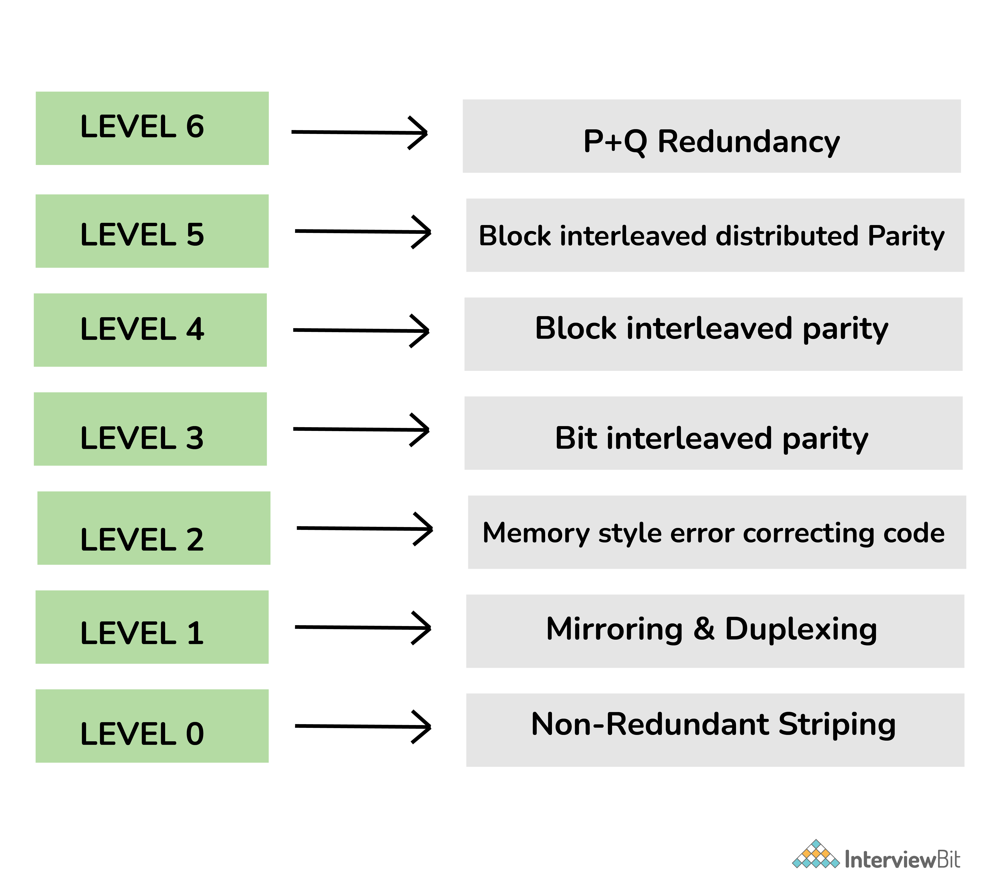
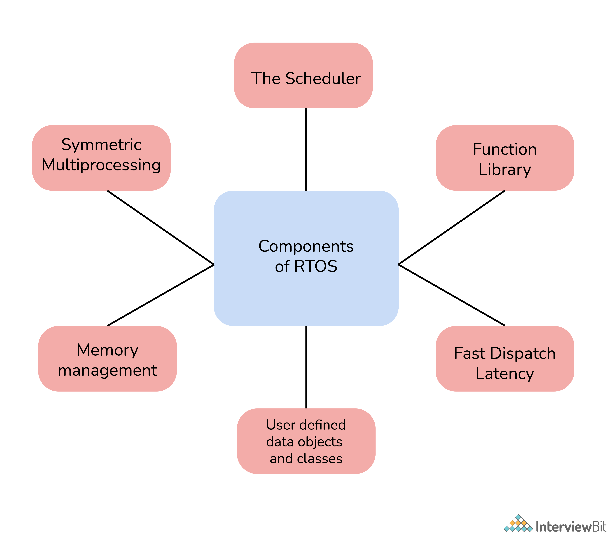

# Câu hỏi phỏng vấn hệ điều hành

## Hệ điều hành là gì ?

Hệ điều hành (Operating System: OS) là một chương trình phần mềm để quản lý và xử lý tất cả nguồn tài nguyên của máy tính như phần cứng và phần mềm. Hệ điều hành đầu tiên được giới thiệu vào năm 1950 là GMOs. Một hệ điều hành chịu trách nhiệm cho quản lý, xử lý, điều phối các hoạt động tổng thể và chia sẻ tài nguyên máy tính. Nó đóng vai trò trung gian giữa những người sử dụng máy tính và phần cứng máy tính.

Chức năng của hệ điều hành:

- Quản lý bộ nhớ và các tiến trình.
- Cung cấp giao diện người dùng.
- Quản lý file và thiết bị.
- Lập lịch các nguồn tài nguyên và công việc.
- Phát hiện lỗi.
- Bảo mật

## Câu hỏi phỏng vấn hệ điều hành cho Fresher

### 1. Tại sao hệ điều hành quan trọng ?

Hệ điều hành là phần thiết yếu và quan trọng nhất của máy tính mà không có nó thì nó được coi là vô dụng. Nó kích hoạt một giao diện hoặc hoạt động giống như một liên kết để tương tác giữa phần mềm máy tính được cài đặt trên hệ điều hành và người dùng. Nó cũng giúp giao tiếp với phần cứng và duy trì sự cân bằng giữa phần cứng và CPU. Nó cũng cung cấp các dịch vụ cho người dùng và một nền tảng cho các chương trình chạy trên đó. Nó thực hiện tất cả các tác vụ chung mà ứng dụng yêu cầu.

### 2. Mục đích chính của hệ điều hành là gì? Các loại hệ điều hành khác nhau là gì?

Mục đích chính của HĐH là thực thi các chương trình của người dùng và giúp người dùng hiểu và tương tác với máy tính cũng như chạy các ứng dụng dễ dàng hơn. Nó được thiết kế đặc biệt để đảm bảo rằng hệ thống máy tính hoạt động tốt hơn bằng cách quản lý tất cả các hoạt động tính toán. Nó cũng quản lý bộ nhớ máy tính, các quy trình và hoạt động của tất cả phần cứng và phần mềm.

Các loại hệ điều hành:

- Batched OS (Payroll System, Transactions Process, ...)
- Multi-Programmed OS (Windows OS, UNIX OS, ...)
- Timesharing OS (Multics, ...)
- Distributed OS (LOCUS, ...)
- Real-Time OS (PSOS, VRTX, ...)

### 3. Lợi ích của hệ thống đa xử lý ?

Hệ thống đa xử lý là một loại hệ thống bao gồm hai hoặc nhiều CPU. Nó liên quan đến việc xử lý các chương trình máy tính khác nhau cùng một lúc chủ yếu bởi một hệ thống máy tính có hai hoặc nhiều CPU đang chia sẻ bộ nhớ duy nhất.

Lợi ích:

- Các hệ thống như vậy ngày nay được sử dụng rộng rãi để cải thiện hiệu suất trong các hệ thống đang chạy nhiều chương trình đồng thời.
- Bằng cách tăng số lượng bộ xử lý, số lượng tác vụ lớn hơn có thể được hoàn thành trong thời gian đơn vị.
- Nó còn nhận được sự gia tăng đáng kể về thông lượng cũng như hiệu quả về chi phí vì tất cả các bộ xử lý đều chia sẻ cùng một tài nguyên.
- Nó chỉ đơn giản là cải thiện độ tin cậy của hệ thống máy tính.

### Cấu trúc RAID trong hệ điềuh ành là gì ?

RAID(Redundant Arrays of Independent Disks) là một phương pháp được dùng để lưu trữ dữ liệu trên nhiều đĩa cứng do đó có thể xem nó là một công nghệ lưu trữ dữ liệu ảo hoá để kết hợp nhiều đĩa cứng. Nó chỉ đơn giản là cân bằng, bảo vệ dữ liệu, hiệu suất hệ thống, không gian lưu trữ, v.v. 

Nó được dùng để cải thiện toàn bộ hiệu suất và độ tin cậy của bộ lưu trữ dữ liệu. Nó còn tăng không gian lưu trữ của hệ thống và có mục đích chính là dự phòng dữ liệu để tránh thất thoát.

#### Các level khác nhau của RAID.

Ngày nay, RAID khả dụng với các level như sau:

- RAID 0 - Non-redundant striping: Được dùng để tăng hiệu suất của server.
- RAID 1 - Mirroring and duplexing: còn gọi là "disk mirroring" dữ liệu được ghi vào hai ở đĩa như nhau, trong trường hợp một ổ bị trục trắc ổ còn lại sẽ hoạt động bình thường. 
- RAID 2 - Memory-style error-correcting codes: sử dụng kỹ thuật parity (tính chẵn lẻ - là dữ liệu bổ sung cho việc khôi phục). Dữ liệu được parity ở cấp độ bit, các bit dự phòng được tính toán bằng mã Hamming. Nếu một lỗi đơn xảy ra, nó sẽ được sửa ngay tức thì. Cấp độ này có khả năng chịu lỗi một ổ đĩa.
RAID 3 - Bit-interleaved Parity: Cấp độ này yêu cầu một drive parity để lưu trữ thông tin parity.
RAID 4 - Block-interleaved Parity: tương tự như RAID 5 nhưng khác biệt duy nhất là cấp này giới hạn tất cả dữ liệu parity trong một drive duy nhất.
RAID 5 - Block-interleaved distributed Parity: Cấp độ này cung cấp hiệu suất tốt hơn nhiều so với tính năng sao chép đĩa và khả năng chịu lỗi.
RAID 6 - P+Q Redundancy: Cấp độ này thường cung cấp khả năng chịu lỗi cho hai lỗi ổ đĩa.

### 5. GUI là gì ?

GUI (Graphical User Interface) về cơ bản là một loại giao diện người dùng cho phép người dùng sử dụng đồ họa để tương tác với hệ điều hành. GUI được tạo ra vì nó thân thiện với người dùng hơn, ít phức tạp hơn và dễ hiểu hơn là một giao diện dòng lệnh. Mục tiêu chính của nó là tăng hiệu quả và dễ sử dụng. Thay vì phải ghi nhớ các lệnh, người dùng có thể chỉ cần click vào một nút để thực hiện công việc một cách đơn giản. Ví dụ về GUI bao gồm Microsoft Windows, macOS, Apple's iOS, v.v.

### 6. Pipe là gì và khi nào sử dụng ? 

Pipe nói chung là một kết nối giữa hai hoặc nhiều quá trình có liên quan đến nhau. Nó là một cơ chế được sử dụng để giao tiếp giữa các quá trình bằng cách sử dụng truyền thông điệp. Người ta có thể dễ dàng gửi thông tin chẳng hạn như đầu ra của một quy trình chương trình đến một quy trình chương trình khác bằng cách sử dụng một đường ống. Nó có thể được sử dụng khi hai quá trình muốn giao tiếp một chiều, tức là giao tiếp giữa các quá trình (IPC).

### 7. Các loại hoạt động khác nhau có thể có trên semaphore là gì ?

Có hai hoạt động có thể là :
- Wait()
- Signal()

### 8. Chương trình bootstrap trong hệ điều hành là gì ?

Nó là một chương trình khởi tạo hệ điều hành khi khởi động, dòng code đầu tiên sẽ được thực thi bất cứ khi nào hệ thống máy tính khởi động. HĐH được tải thông qua tiến trình bootstrap hoặc một chương trình gọi là booting. Nhìn chung hệ điều hành chỉ phụ thuộc vào chương trình bootstrap để thực hiện và hoạt động chính xác. Nó được lưu trữ đầy đủ trong các khối khởi động tại một vị trí cố định trên đĩa. Nó cũng định vị nhân và tải nó vào bộ nhớ chính, sau đó chương trình bắt đầu thực thi.

### 9. Demand Paging là gì ?

Demand paging (tạm dịch: phân trang theo yêu cầu) là một phương pháp tải các trang vào bộ nhớ theo yêu cầu. Phương pháp này chủ yếu được sử dụng trong bộ nhớ ảo. Trong đó, một trang chỉ được đưa vào bộ nhớ khi một vị trí trên trang cụ thể đó được tham chiếu trong quá trình thực thi. Các bước sau thường được tuân theo: 

- Truy cập trang.
- Nếu trang đó hợp lệ (có trong bộ nhớ) các tiến trình instruction sẽ diễn ra bình thường
- Nếy là không hợp lệ, thì xảy ra **page-fault trap**.
- Kiểm tra nếu tham chiếu bộ là hợp lệ tham chiếu đến một vùng ở bộ nhớ phụ. Nếu không, tiến trình sẽ bị chấm dứt (**truy cập bộ nhớ bất hợp pháp**). Ngược lại, ta có trang trong trang được yêu cầu.
- Lên lịch hoạt động của đĩa để đọc trang mong muốn vào bộ nhớ chính.
- Khởi động lại instruction đã bị gián đoạn bởi trap của hệ điều hành.

### 10. RTOS là gì ?

Real Time Operating System (RTOS) là một hệ điều hành được sử dụng cho các ứng thời gian thực. Nó hoạt động tốt hơn nhiều đối với các tác vụ cần được thực thi trong thời gian ngắn. Nó cũng xử lý các quá trình thực thi, giám sát và kiểm soát tất cả. Nó cũng chiếm ít bộ nhớ hơn và tiêu thụ ít tài nguyên hơn. 

Các loại RTOS:

- Hard Real-Time
- Firm Real-Time
- Soft Real-Time

RTOS được sử dụng trong Hệ thống kiểm soát không lưu, Hệ thống chống bó phanh và Máy tạo nhịp tim.

### 11. Đồng bộ hoá tiến trình là gì ?

Đồng bộ hóa tiến trình về cơ bản là một cách để điều phối các tiến trình sử dụng tài nguyên hoặc dữ liệu được chia sẻ. Điều cần thiết là đảm bảo thực hiện đồng bộ các tiến trình hợp tác để duy trì tính nhất quán của dữ liệu. Mục đích chính của nó là chia sẻ tài nguyên mà không có bất kỳ sự can thiệp nào bằng cách sử dụng loại trừ lẫn nhau. Có hai loại đồng bộ hóa tiến trình:

- Tiến trình độc lập
- Tiến trình hợp tác

### 12. IPC là gì ? Các cơ chế IPC khác nhau ?

IPC (Interprocess Communication) là một cơ chế yêu cầu sử dụng các tài nguyên như bộ nhớ được chia sẻ giữa các tiến trình hoặc luồng. Với IPC, hệ điều hành cho phép các tiến trình khác nhau giao tiếp với nhau. Nó đơn giản là được sử dụng để trao đổi dữ liệu giữa nhiều luồng trong một hoặc nhiều chương trình hoặc tiến trình. Trong cơ chế này, các tiến trình khác nhau có thể giao tiếp với nhau dưới sự chấp thuận của HĐH.

Các cơ chế IPC khác nhau:

- Pipes
- Message Queuing
- Semaphores
- Socket
- Shared Memory
- Signals

### 13. Sự khác biệt giữa bộ nhớ chính và bộ nhớ phụ ?

**Bộ nhớ chính:** bộ nhớ chính trong máy tính là RAM (Random Access Memory). Nó còn được gọi là bộ nhớ chính hoặc bộ nhớ đọc-ghi hoặc bộ nhớ trong. Các chương trình và dữ liệu mà CPU yêu cầu trong quá trình thực thi một chương trình được lưu trữ trong bộ nhớ này.
**Bộ nhớ phụ:** bộ nhớ phụ trong máy tính là thiết bị lưu trữ có thể lưu trữ dữ liệu và chương trình. Nó còn được gọi là bộ nhớ ngoài hoặc bộ nhớ bổ sung hoặc bộ nhớ dự phòng hoặc bộ nhớ phụ. Các thiết bị lưu trữ như vậy có khả năng lưu trữ dữ liệu khối lượng lớn. Thiết bị lưu trữ có thể là ổ cứng, ổ USB flash, CD, v.v.

| Bộ nhớ chính | Bộ nhớ phụ |
|--------------|------------|
|Dữ liệu có thể được truy cập trực tiếp bởi đơn vị xử lý| Đầu tiên, dữ liệu được chuyển đến bộ nhớ chính và sau đó được chuyển đến đơn vị xử lý |
