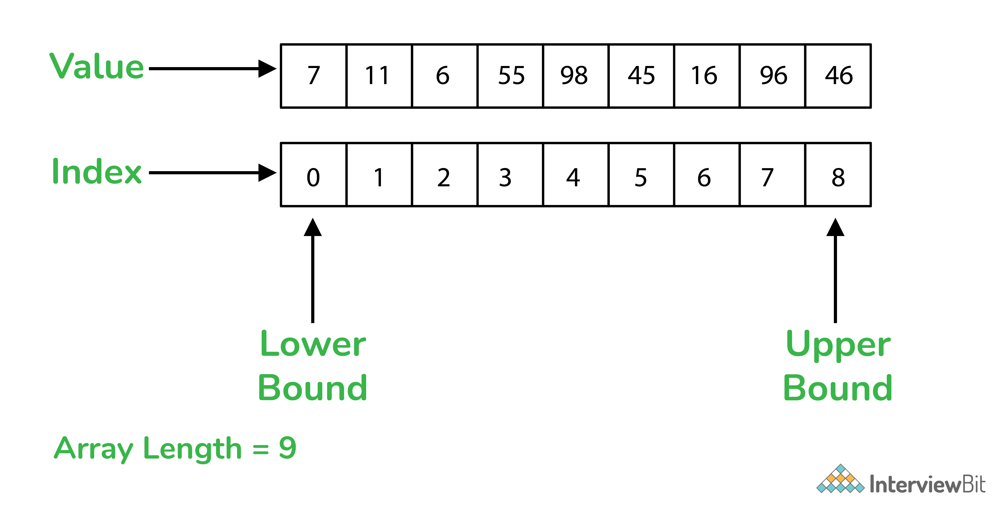
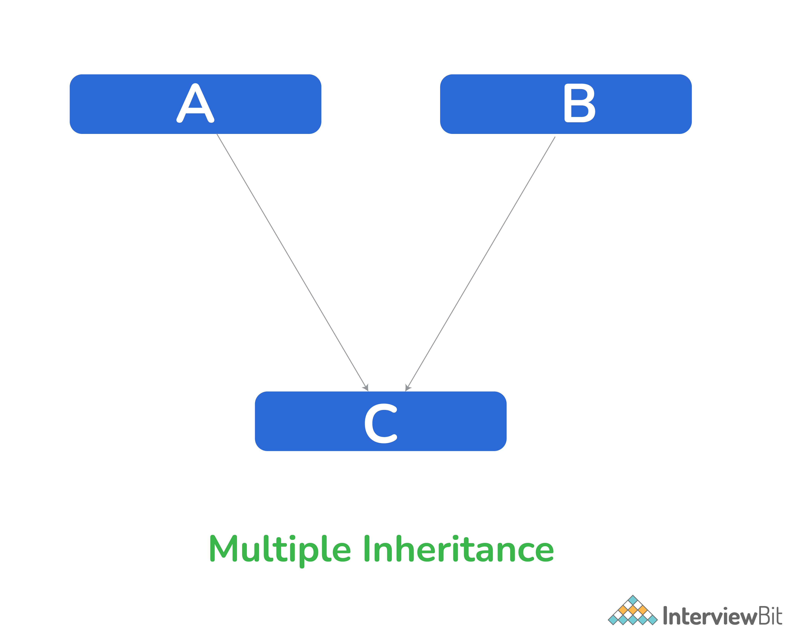

# Câu hỏi phỏng vấn C#


# C# là gì?

C# là ngôn ngữ lập trình hướng đối tượng được phát triển bởi Microsoft. Cùng với framework .NET nó có thể dùng cho tạo website, ứng dụng hay game. Các ưu điểm của C# có thể kể đến như sau:
- Tương đối dễ dàng hơn: Bắt đầu với C# có thể gọi là tương đối dễ dàng hơn so với các ngôn ngữ lập trình khác
- Sử dụng phát triển rộng hơn: Sử dụng C#, bạn có thể tạo các ứng dụng web, ứng dụng di động, ứng dụng máy tính hay trò chơi. C# có một số tính năng tuyệt vời như bộ thu gom rác tự động, interface, v.v. giúp xây dựng các ứng dụng tốt hơn.
- Đối tượng mục tiêu lớn hơn: Việc được hỗ trợ bởi Microsoft mang lại lợi thế cho các ứng dụng được tạo bằng C# vì nó sẽ có mục tiêu rộng hơn.

Vì C# là một ngôn ngữ lập trình được sử dụng rộng rãi như vậy, nên rất nhiều tổ chức lớn và nhỏ sử dụng sản phẩm của họ. Vì vậy, hãy chuẩn bị cho mình những câu hỏi C# cơ bản và nâng cao để hoàn thành tốt các cuộc phỏng vấn.

## Mục lục 

[1. C# khác với C/C++ như thế nào?](#1-c-kh%C3%A1c-v%E1%BB%9Bi-cc-nh%C6%B0-th%E1%BA%BF-n%C3%A0o)

[2. CLR là gì?](#2-clr-l%C3%A0-g%C3%AC)

[3. Bộ dọn rác trong C#?](#3-b%E1%BB%99-d%E1%BB%8Dn-r%C3%A1c-trong-c)

[4. Các kiểu class trong C#?](#4-c%C3%A1c-ki%E1%BB%83u-class-trong-c)

[5. Sự khác biệt giữa lớp trừu tượng và interface?](#5-s%E1%BB%B1-kh%C3%A1c-bi%E1%BB%87t-gi%E1%BB%AFa-l%E1%BB%9Bp-tr%E1%BB%ABu-t%C6%B0%E1%BB%A3ng-v%C3%A0-interface)

[6. Sự khác biệt giữa từ khoá ref và out?](#6-s%E1%BB%B1-kh%C3%A1c-bi%E1%BB%87t-gi%E1%BB%AFa-t%E1%BB%AB-kho%C3%A1-ref-v%C3%A0-out)

[7. Phương thức mở rộng trong C#?](#7-ph%C6%B0%C6%A1ng-th%E1%BB%A9c-m%E1%BB%9F-r%E1%BB%99ng-trong-c)

[8. Generic trong C#?](#8-generic-trong-c)

[9. Lớp partial trong C# là gì?](#9-l%E1%BB%9Bp-partial-trong-c-l%C3%A0-g%C3%AC)

[10. Sự khác biệt giữa late binding và early binding trong C#?](#10-s%E1%BB%B1-kh%C3%A1c-bi%E1%BB%87t-gi%E1%BB%AFa-late-binding-v%C3%A0-early-binding-trong-c)

[11. Mảng trong C# là gì?](#11-m%E1%BA%A3ng-trong-c-l%C3%A0-g%C3%AC)

[12. Sự khác biệt giữa Array và ArrayList trong C#?](#12-s%E1%BB%B1-kh%C3%A1c-bi%E1%BB%87t-gi%E1%BB%AFa-array-v%C3%A0-arraylist-trong-c)

[13. Kế thừa và đa kế thừa trong C#?](#13-k%E1%BA%BF-th%E1%BB%ABa-v%C3%A0-%C4%91a-k%E1%BA%BF-th%E1%BB%ABa-trong-c)

[14. Boxing và Unboxing trong C#?](#14-boxing-v%C3%A0-unboxing-trong-c)

[15. Thuộc tính trong C# là gì?](#15-thu%E1%BB%99c-t%C3%ADnh-trong-c-l%C3%A0-g%C3%AC)

[16. Indexer trong C# là gì?](#16-indexer-trong-c-l%C3%A0-g%C3%AC)

[17. Sự khác biệt giữa toán tử == và phương thức equals() trong C#?](#17-s%E1%BB%B1-kh%C3%A1c-bi%E1%BB%87t-gi%E1%BB%AFa-to%C3%A1n-t%E1%BB%AD--v%C3%A0-ph%C6%B0%C6%A1ng-th%E1%BB%A9c-equals-trong-c)

[18. Nạp chồng trong C#](#18-n%E1%BA%A1p-ch%E1%BB%93ng-trong-c)

[19. Reflection trong C#?](#19-reflection-trong-c)

[20. Sự khác biệt giữa hằng và readonly trong C#?](#20-s%E1%BB%B1-kh%C3%A1c-bi%E1%BB%87t-gi%E1%BB%AFa-h%E1%BA%B1ng-v%C3%A0-readonly-trong-c)

[21. Sự khác biệt giữa String và StringBuilder?](#21-s%E1%BB%B1-kh%C3%A1c-bi%E1%BB%87t-gi%E1%BB%AFa-string-v%C3%A0-stringbuilder)

## Câu hỏi phỏng vấn C# cho Fresher

### 1. C# khác với C/C++ như thế nào?

C có thể xem là ngôn ngữ lập trình bậc thấp vì nó có cấu trúc, thủ tục lập trình giản đơn. C nên là lựa chọn hàng đầu khi xây dựng các chương trình lõi, hệ điều hành, chương trình nhúng….

C++ có thể được phân là ngôn ngữ lập trình bậc trung. Nó là một thế hệ con của C, được thiết kế nhằm khắc phục những hạn chế của C. Nó hỗ trợ cho việc lập trình hướng đối tượng mà vẫn giữ được những tính chất ban đầu và tốc độ thực thi của C. Hoàn toàn không có lớp ảo hóa nào ở trung gian, trình biên dịch C++ chuyển trực tiếp từ mã nguồn sang mã máy.

C# kế thừa C và C++, và là ngôn ngữ lập trình hướng đối tượng bậc cao, ngang hàng với các ngôn ngữ lập trình bậc cao khác như Python, Java… Lập trình viên sử dụng C#, sẽ được hỗ trợ nhiều tính năng hơn. Cũng giống như Python hay Java, mã nguồn C# sẽ được chuyển sang dạng bytecode trên máy ảo CLR (Common Language Runtime), sau đó mới chuyển sang mã máy.

Với C và C++, người dùng có thể trực tiếp quản lý vùng nhớ của họ. Tuy vậy, hai ngôn ngữ lập trình này không có cơ chế dọn rác tự động.

Còn với C# bạn không cần lo lắng về vùng nhớ. Nhờ hỗ trợ chức năng dọn rác tự động, ngôn ngữ này giúp bạn quản lý vùng nhớ dễ dàng và hiệu quả hơn. Khi đầy rác, vùng nhớ bị hết; nó sẽ tự xóa rác mà không cần bạn phải vào thao tác.

### 2. CLR là gì?

Common Language Runtime (CLR) xử lý chương trình thực thi chương trình cho nhiều ngôn ngữ khác nhau bao gồm cả C#. Kiến trúc của CLR xử lý quản lý bộ nhớ, thu gom rác, xử lý bảo mật và trông giống như: 

.png)

### 3. Bộ dọn rác trong C#?

Bộ dọn rác (garbage collection) là quá trình giải phóng bộ nhớ bị chiếm bởi các đối tượng không mong muốn. Khi bạn tạo một đối tượng, tự động một số không gian bộ nhớ được cấp cho đối tượng trong bộ nhớ heap. Bây giờ, sau khi bạn thực hiện tất cả các hành động trên đối tượng, không gian bộ nhớ bị chiếm bởi đối tượng sẽ trở thành lãng phí. Sẽ là cần thiết để giải phóng bộ nhớ. Việc thu gom rác xảy ra trong ba trường hợp: 
- Nếu bộ nhớ bị chiếm bởi các đối tượng vượt quá ngưỡng giá trị đặt trước.
- Nếu phương thức thu gom rác được gọi
- Nếu hệ thống của bạn có bộ nhớ vật lý thấp

### 4. Các kiểu class trong C#?

Class trong C# chính là cách thể hiện khái niệm về lớp trong lập trình hướng đối tượng. Trong C# có 4 kiểu class:
- **static class:** khai báo bởi từ khoá `static` không cho phép kế thừa. Do đó không thể tạo đối tượng từ static class.

```csharp
static class classname
{
    // static data 
    // static methods
}
```

- **partial class:** khai báo bởi từ khoá `partial` cho phép các thành viên của nó phân chia hoặc chia sẻ với file (.cs) nguồn.
- **abstract class:** là lớp không thể khởi tạo nên bạn không thể tạo đối tượng. abstract class hoạt động dựa trên khái niệm trừu tượng trong OOP. Tính trừu tượng giúp trích xuất các chi tiết cần thiết và ẩn những chi tiết không cần thiết. 
- **sealed class:**  Lớp được đóng dấu là lớp không thể được kế thừa. Sử dụng từ khóa `sealead` để hạn chế quyền truy cập đối với người dùng kế thừa lớp đó.

```csharp
sealed class classname
{
    // static data 
    // static methods
}
```

### 5. Sự khác biệt giữa lớp trừu tượng và interface?

Hãy cùng tìm hiểu sự khác biệt giữa lớp trừu tượng và interface:

- Các lớp trừu tượng là các lớp không thể được khởi tạo tức là chúng không thể tạo một đối tượng. Interface giống như một lớp trừu tượng vì tất cả các phương thức bên trong interface đều là phương thức trừu tượng.
- Các lớp trừu tượng có thể có cả phương thức trừu tượng và không trừu tượng nhưng tất cả các phương thức của một interface đều là phương thức trừu tượng.
- Vì các lớp trừu tượng có thể có cả phương thức trừu tượng và không trừu tượng, chúng ta cần sử dụng từ khóa `abstract` để khai báo các phương thức trừu tượng. Nhưng trong interface, không cần như vậy.
- Một lớp trừu tượng có các hàm tạo trong khi một interface thì không.

##### Lớp trừu tượng:

```csharp
public abstract class Shape{
    public abstract void draw();
}
```

##### Interface:

```csharp
public interface Paintable{
    void paint();
}
```

### 6. Sự khác biệt giữa từ khoá ref và out?

Từ khoá `ref` truyền đối số bằng tham chiếu chứ không phải giá trị. 

```csharp
void Method(ref int refArgument)
{
   refArgument = refArgument + 10;
}
int number = 1;
Method(ref number);
Console.WriteLine(number);
// Output: 11
```

Từ khoá `out` truyền đối số trong phương thức và hàm. Từ khóa `out` được sử dụng để truyền các đối số trong một phương thức làm tham chiếu để trả về nhiều giá trị. Mặc dù nó giống với từ khóa `ref`, nhưng từ khóa `ref` cần phải được khởi tạo trước khi được truyền. Ở đây, các từ khóa `out` và `ref` rất hữu ích khi chúng ta muốn trả về một giá trị trong cùng các biến được truyền dưới dạng đối số.

```csharp
public static string GetNextFeature(ref int id)  
{  
   string returnText = "Next-" + id.ToString();  
   id += 1;  
   return returnText;  
}  
public static string GetNextFeature(out int id)  
{  
   id = 1;  
   string returnText = "Next-" + id.ToString();  
   return returnText;  
}
```

### 7. Phương thức mở rộng trong C#?

Các phương pháp mở rộng giúp thêm các phương pháp mới vào các phương pháp hiện có. Các phương thức được thêm vào là tĩnh. Đôi khi, khi bạn muốn thêm các phương thức vào một lớp hiện có nhưng không nhận thấy quyền sửa đổi lớp đó hoặc không có quyền, bạn có thể tạo một lớp tĩnh mới chứa các phương thức mới. Khi các phương thức mở rộng được khai báo, hãy liên kết lớp này với lớp hiện có và xem các phương thức sẽ được thêm vào lớp hiện có.

```csharp
// C# program to illustrate the concept
// of the extension methods
using System;
 
namespace ExtensionMethod {
    static class NewMethodClass {
    
        // Method 4
        public static void M4(this Scaler s)
        {
            Console.WriteLine("Method Name: M4");
        }
        
        // Method 5
        public static void M5(this Scaler s, string str)
        {
            Console.WriteLine(str);
        }
    }
    
    // Now we create a new class in which
    // Scaler class access all the five methods
    public class IB {
    
        // Main Method
        public static void Main(string[] args)
        {
            Scaler s = new Scaler();
            s.M1();
            s.M2();
            s.M3();
            s.M4();
            s.M5("Method Name: M5");
        }
    }
}
```

Kết quả:

```
Method Name: M1

Method Name: M2

Method Name: M3

Method Name: M4

Method Name: M5
```

### 8. Generic trong C#?

Trong C#, lập trình tổng quát (generics) là một dạng lập trình đặc biệt trong đó kiểu dữ liệu (của biến thành viên, biến cục bộ, tham số, kiểu trả về của phương thức,...) không được xác định ở giai đoạn xây dựng đơn vị code (như lớp, phướng thức) mà chỉ được xác định ở giai đoạn khởi tạo và sử dụng.

Để thực hiện điều này, ở giai đoạn khai báo người ta dùng một kiểu dữ liệu giả. Ở giai đoạn sử dụng, kiểu dữ liệu giả sẽ được thay thế bằng kiểu dữ liệu thực. Cú pháp dùng cho generic:

```csharp
GenericList<float> list1 = new GenericList<float>();
GenericList<Features> list2 = new GenericList<Features>();
GenericList<Struct> list3 = new GenericList<Struct>();
```

Ở đây, `GenericList<float>` là lớp generic. Với mỗi thực thể của `Generic<T>`, mỗi khi T xuất hiện trong lớp đều được thay thế bằng kiểu tham số ở thời điểm chạy. Bằng cách thay thế T, ta tạo ra ba kiểu khác nhau sử dụng cùng một lớp.

### 9. Lớp partial trong C# là gì?

Các lớp partial thực hiện chức năng của một lớp đơn lẻ thành nhiều file. Nhiều file này được kết hợp thành một trong thời gian biên dịch. Lớp partial có thể được tạo bằng từ khóa `partial`.

```csharp
public partial Clas_name  
{
   // code
}
```

Bạn có thể dễ dàng chia các chức năng của phương thức, interface hoặc cấu trúc thành nhiều file. Thậm chí có thể thêm các lớp partial lồng nhau.

### 10. Sự khác biệt giữa late binding và early binding trong C#?

Late binding và early binding là hai ví dụ cho khái niệm đa hình trong OOPs.

Ví dụ: một hàm `calculateBill()` sẽ tính toán chi phí cho khách hàng vip, khách hàng cơ bản và khách hàng tiềm năng dựa trên các chính sách khác nhau. Việc tính toán cho tất cả đối tượng khác nhau này nhưng sử dụng cùng một hàm được gọi là đa hình.

Khi đối tượng được gán một biến đối tượng trong C#, framework .NET thực hiện liên kết.

Khi hàm liên kết xảy ra ở thời gian biên dịch nó được gọi là early binding. Nó kiểm tra các phương thức và thuộc tính của các đối tượng tĩnh. Với early binding, số lỗi thời gian chạy giảm đáng kể và nó thực thi khá nhanh.

Nhưng nếu liên kết xảy ra ở thời gian chạy, nó được gọi là late binding. Late binding xảy ra khi đối tượng là động (dựa trên dữ liệu mà nó giữ). Nó chậm hơn so với early binding

### 11. Mảng trong C# là gì?

Khi một nhóm các phần tử tương tự được gộp lại với nhau dưới một tên, chúng được gọi là mảng.

Vd. Một mảng `Atea[4]: [green tea, chamomile tea, black tea, lemon tea]`. Độ dài của mảng xác định có bao nhiêu phần tử hiện diện trong mảng.

Trong C#, việc cấp phát bộ nhớ cho các phần tử của mảng diễn ra tự động. Đây là cách các giá trị được lưu trữ trong một mảng một cách tuần tự.



Cú pháp `<Data Type>[] <Name_Array>`

#### Vài lưu ý trong mảng

- Cấp phát động
- Mảng trong C# được xem như là đối tượng.
- Chiều dài của mảng số lượng thành viên của mảng.
- Thành viên trong mảng là có thứ tự và bắt đầu từ 0.
- Kiểu mảng là kiểu tham chiếu đến kiểu mảng cơ sở.

### 12. Sự khác biệt giữa Array và ArrayList trong C#?

Array (mảng) là một tập hợp biến có cùng kiểu được gộp lại dưới một cái tên. Trong khi ArrayList là tập hợp các đối tượng có chỉ mục riêng biệt. Với ArrayList bạn có thể truy cập với các tính ănng như cấp phát bộ nhớ động, thêm, tìm và sắp xếp mục trên ArrayList.

- Khi khai bao một mảng ta phải thiết lập kích cỡ tĩnh, do đó bộ nhớ là cố định. Trong khi ArrayList, có thể tăng giảm tuỳ ý.
- Mảng đi cùng với namespace `system.array` trong khi ArrayList đi cùng với namespace `system.collection`.
- Tất cả mục trong một mảng có cùng kiểu dữ liệu trong khi ArrayList có thể giống hoặc khác kiểu dữ liệu.
- Trong khi mảng không chấp nhận null, thì ArrayList chấp nhận giá trị null

```csharp
// C# program to illustrate the ArrayList
using System;
using System.Collections;
 
class IB {
 
    // Main Method
    public static void Main(string[] args)
    {
    
        // Create a list of strings
        ArrayList al = new ArrayList();
        al.Add("Bruno");
        al.Add("Husky");
        al.Add(10);
        al.Add(10.10);
    
        // Iterate list element using foreach loop
        foreach(var names in al)
        {
            Console.WriteLine(names);
        }
    }
}
```

## Câu hỏi phỏng vấn C# cho Experienced

### 13. Kế thừa và đa kế thừa trong C#?
 
Kế thừa là một hoặc nhiều thuộc tính được truyền từ lớp cha sang lớp con.



Ví dụ, lớp `C` kế thừa thuộc tính từ lớp `A` và lớp `B`. Đây là một ví dụ về kế thừa.

```csharp
// C# program to illustrate
// multiple class inheritance
using System;
using System.Collections;

// Parent class 1
class Scaler {

    // Providing the implementation
    // of features() method
    public void features()
    {

        // Creating ArrayList
        ArrayList My_features= new ArrayList();

        // Adding elements in the
        // My_features ArrayList
        My_features.Add("Abstraction");
        My_features.Add("Encapsulation");
        My_features.Add("Inheritance");

        Console.WriteLine("Features provided by OOPS:");
        foreach(var elements in My_features)
        {
            Console.WriteLine(elements);
        }
    }
}

// Parent class 2
class Scaler2 :Scaler{

    // Providing the implementation
    // of courses() method
    public void languages()
    {

        // Creating ArrayList
        ArrayList My_features = new ArrayList();

        // Adding elements in the
        // My_features ArrayList
        My_features.Add("C++");
        My_features.Add("C#");
        My_features.Add("JScript");
        

        Console.WriteLine("\nLanguages that use OOPS concepts:");
        foreach(var elements in My_features)
        {
            Console.WriteLine(elements);
        }
    }
}

// Child class
class ScalertoScaler : Scaler2 {
}

public class Scaler1 {

    // Main method
    static public void Main()
    {

        // Creating object of ScalertoScaler class
        ScalertoScaler obj = new ScalertoScaler();
        obj.features();
        obj.languages();
    }
}
```

C# không hỗ trợ đa kế thừa, thay vào đó bạn có thể dùng interface cho kế thừa thuộc tính bằng tên lớp.

### 14. Boxing và Unboxing trong C#?

**Boxing** là quá trình chuyển dữ liệu từ kiểu tham trị sang kiểu tham chiếu.Quá trình boxing một biến kiểu tham trị sẽ khởi tạo một đối tượng trong vùng nhớ heap và sao chép giá trị của biến tham trị vào đối tượng mới này. Và quá trình boxing được thực hiện nhờ quá trình chuyển đổi ngầm định.


```csharp
int num = 23; // 23 will assigned to num
Object Obj = num; // Boxing
```

**Unboxing** là quá trình ngược lại với Boxing, tức là đưa từ kiểu tham chiếu ra kiểu tham trị. Quá trình này sẽ được thực hiện một cách tường minh. Gồm có 2 bước :
1. Kiểm tra chắc chắn rằng đối tượng đã được boxing đúng kiểu giá trị đưa ra.
2. Sao chép giá trị sang biến dữ liệu kiểu tham trị.

```csharp
int num = 23;         // value type is int and assigned value 23
Object Obj = num;    // Boxing
int i = (int)Obj;    // Unboxing
```

### 15. Thuộc tính trong C# là gì?

Các thuộc tính trong C# là các thành viên công khai của một lớp nơi chúng cung cấp khả năng truy cập các thành viên riêng tư của một lớp. Nguyên tắc cơ bản của đóng gói cho phép bạn ẩn một số thuộc tính nhạy cảm với người dùng bằng cách đặt các biến ở chế độ riêng tư. Các thành viên riêng tư không thể truy cập nếu không trong một lớp. Do đó, bằng cách sử dụng các thuộc tính trong C#, bạn có thể dễ dàng truy cập các thành viên riêng tư và thiết lập giá trị của chúng.

Các giá trị có thể được gán dễ dàng bằng cách sử dụng các phương thức get và set, còn được gọi là trình truy cập. Trong khi phương thức get trích xuất giá trị, phương thức set sẽ gán giá trị cho các biến.

### 16. Indexer trong C# là gì?

Indexer được gọi là mảng thông minh cho phép truy cập vào một biến thành viên. Các indexer cho phép các biến thành viên sử dụng các tính năng của một mảng. Chúng được tạo bằng từ khóa `Indexer`. Indexer không phải là thành viên tĩnh. 

```csharp
<return type> this[<parameter type> index]
{
    get{
        // return the value from the specified index of an internal collection
    }
    set{
        // set values at the specified index in an internal collection
    }
}
```

### 17. Sự khác biệt giữa toán tử == và phương thức equals() trong C#?

Cả hai đều dùng cho so sánh giá trị đối tượng, ví dụ:

```csharp
int x = 10;
int y = 10;
Console.WriteLine( x == y);
Console.WriteLine(x.Equals(y));

// Output:
// True
// True
```

**Toán tử ==**: là một kiểu tham chiếu có nghĩa là nó sẽ trả về true nếu điểm tham chiếu đến đối tượng giống nhau.

**Phương thức Equals()** dùng so sánh giá trị hai được mang bởi các đối tượng. Trả về true khi tất cả giá trị được mang bởi đối tượng bằng nhau.

### 18. Nạp chồng trong C#?

Nạp chồng (Overloading) có nghĩa là khi các phương thức có cùng tên nhưng mang các giá trị khác nhau để sử dụng trong một ngữ cảnh khác. Chỉ có phương thức main() không thể được nạp chồng.

Để thực hiện phương thức nạp chồng trong C#:
- Thay đổi số lượng tham số
- Thay đổi thứ tự tham số
- Sử dụng kiểu dữ liệu khác nhau cho tham số

Vd:

```csharp
public class Area {
    public double area(double x) {
        double area = x * x;
        return area;
    }
    public double area(double a, double b) {
        double area = a * b;
        return area;
    }
}
```

Ở đây, phương thức Area được sử dụng hai lần. Trong khai báo đầu tiên, một đối số được sử dụng trong khi trong khai báo thứ hai, có hai đối số được sử dụng. Sử dụng các tham số khác nhau trong cùng một phương thức, chúng ta có thể nạp chồng phương thức `area()`.

### 19. Reflection trong C#?

Reflection trong C# trích xuất metadata từ các kiểu dữ liệu trong thời gian chạy.

Để thêm reflection trong .NET, chỉ cần dùng namespace `System.Reflection` trong chương trình để truy xuất kiểu của bất cứ thứ gì từ:
* Assembly
* Module
* Enum
* MethodInfo
* ConstructorInfo
* MemberInfo
* ParameterInfo
* Type
* FieldInfo
* EventInfo
* PropertyInfo

### 20. Sự khác biệt giữa hằng và readonly trong C#?

Từ khoá **const** trong C# dùng để khai báo hằng trong suốt chương trình. Điều này có nghĩa là sau khi biến được khai báo là hằng, giá trị của nó không thể thay đổi.

Trong C# hằng là một số, chuỗi, tham chiếu null hoặc giá trị boolean.

```csharp
class IB {
 
    // Constant fields
    public const int xvar = 20;
    public const string str = "InterviewBit";
    
    // Main method
    static public void Main()
    {
    
        // Display the value of Constant fields
        Console.WriteLine("The value of xvar: {0}", xvar);
        Console.WriteLine("The value of str: {0}", str);
    }
}
```

Kết quả:

```
The value of xvar is 20.
The value of string is Interview Bit
```

Mặt khác, từ khoá **readonly** chỉ có thể gán biến khi nó được khai báo hoặc trong một constructor của cùng một lớp mà nó được khai báo. 

```csharp
public readonly int xvar1;
   public readonly int yvar2;
 
   // Values of the readonly 
   // variables are assigned
   // Using constructor
   public IB(int b, int c)
   {
 
       xvar1 = b;
       yvar2 = c;
       Console.WriteLine("The value of xvar1 {0}, "+
                       "and yvar2 {1}", xvar1, yvar2);
   }
 
   // Main method
   static public void Main()
   {
     IB obj1 = new IB(50, 60);
   }
}
```

Kết quả:

```
The value of xvar1 is 50, and yvar2 is 60
```

- Các hằng số là tĩnh theo mặc định trong khi readonly nên có một giá trị được gán khi phương thức khởi tạo được khai báo.
- Hằng số có thể được khai báo trong các hàm trong khi các sửa đổi readonly có thể được sử dụng với các kiểu tham chiếu.

### 21. Sự khác biệt giữa String và StringBuilder?

Sự khác biệt chính giữa String và StringBuilder là các đối tượng String là bất biến trong khi StringBuilder tạo ra một chuỗi ký tự có thể thay đổi. StringBuilder sẽ thực hiện các thay đổi đối với đối tượng hiện có hơn là tạo đối tượng mới.

StringBuilder đơn giản hóa toàn bộ quá trình thực hiện thay đổi đối với đối tượng chuỗi hiện có. Vì lớp String là bất biến nên sẽ tốn kém hơn khi tạo một đối tượng mới mỗi khi chúng ta cần thực hiện thay đổi. Vì vậy, lớp StringBuilder xuất hiện có thể được gợi lên bằng cách sử dụng không gian tên System.Text.

Trong trường hợp, một đối tượng chuỗi sẽ không thay đổi trong toàn bộ chương trình, thì hãy sử dụng lớp String hoặc StringBuilder khác.

```csharp
string s = string.Empty; 
for (i = 0; i < 1000; i++) 
{ 
    s += i.ToString() + " "; 
}
```

Tại đây, bạn sẽ cần tạo 2001 đối tượng trong đó 2000 sẽ không được sử dụng.

Điều tương tự có thể được áp dụng bằng cách sử dụng StringBuilder:

```csharp
StringBuilder sb = new StringBuilder(); 
for (i = 0; i < 1000; i++) 
{ 
   sb.Append(i); sb.Append(' '); 
}
```

Bằng cách sử dụng StringBuilder ở đây, bạn cũng giảm bớt căng thẳng cho bộ cấp phát bộ nhớ.