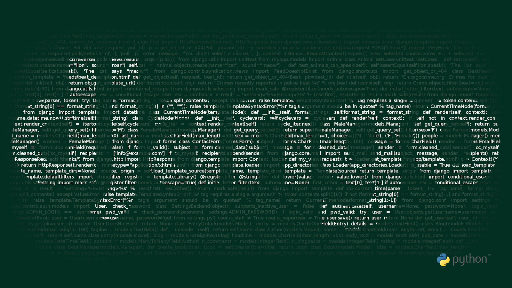
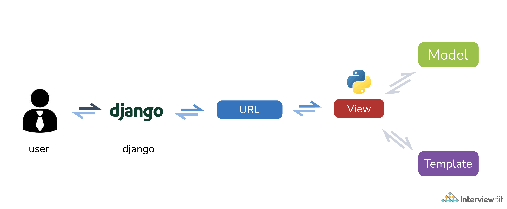
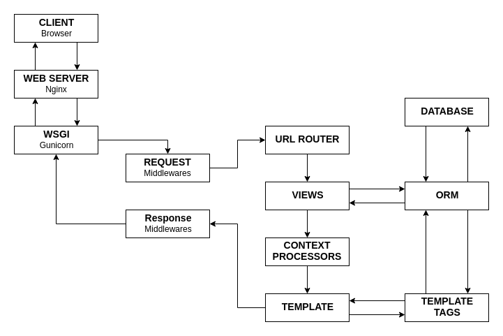

# Câu hỏi phỏng vấn Django



Django là một framework web mã nguồn mở, miễn phí trên nền tảng Python tuân theo mô hình MVT (model-view-template). Hiện tại, nó được phát triển và duy trì bởi Django Software Foundation (DSF), một tổ chức độc lập ở Hoa kỳ.

Django được tạo vào năm 2003 bởi lập trình viên Adrian Holovaty và Simon Willson. Hai năm sau, nó được phát hành công cộng theo giấy phép BSD. Sau đó đến năm 2008, DSF đảm nhận việc phát triển Django.

#### Các tổ chức lớn sử dụng Django
- PBS
- Instagram
- Mozilla
- The Washington Times
- Disqus, Bitbucket
- NextDoor

### Ưu điểm của Django:
- **Hệ sinh thái lớn**: nó đi kèm với một lượng lớn ứng dụng bên thứ 3 dễ dàng tích hợp với các yêu cầu dự án.
- **Tuổi đời**: Django đã được dùng hơn một thập kỷ. Suốt thời gian qua, rất nhiều tính năng được bổ sung và nâng cao để phát triển nó thành một framework mạnh mẽ. Ngoài ra, có rất nhiều tổ chức lớn đang sử dụng Django.
- **Admin**: django hỗ trợ sẵn trang admin cho các thao tác CRUD với các model.
- **Plugins**: cho phép lập trình viện thêm các tính năng mới vào ứng dụng.
- **Thư viện**: vì có cộng đồng lớn nên nó có một lượng lớn thư viện cho mọi tác vụ.
- **ORM**: nó giúp làm việc với dữ liệu theo cách hướng đối tượng.

## Mục lục

[1. Giải thích kiến trúc Django?](#1-gi%E1%BA%A3i-th%C3%ADch-ki%E1%BA%BFn-tr%C3%BAc-django)

[2. Giải thích cấu trúc thư mục Django?](#2-gi%E1%BA%A3i-th%C3%ADch-c%E1%BA%A5u-tr%C3%BAc-th%C6%B0-m%E1%BB%A5c-django)

[3. Model trong Django là gì?](#3-model-trong-django-l%C3%A0-g%C3%AC)

[4. Template trong Django hay DTL là gì?](#4-template-trong-django-hay-dtl-l%C3%A0-g%C3%AC)

[5. View trong Django là gì?](#5-view-trong-django-l%C3%A0-g%C3%AC)

[6. Django ORM là gì?](#6-django-orm-l%C3%A0-g%C3%AC)

[7. Static file là gì?](#7-static-file-l%C3%A0-g%C3%AC)

[8. Django Rest Framework là gì?](#8-django-rest-framework-l%C3%A0-g%C3%AC)

[9. Django-admin và manage.py là gì?](#9-django-admin-v%C3%A0-managepy-l%C3%A0-g%C3%AC)

[10. Jinja là gì?](#10-jinja-l%C3%A0-g%C3%AC)

[11. Django URL là gì?](#11-django-url-l%C3%A0-g%C3%AC)

[12. Sự khác biệt giữa ứng dụng và dự án trong Django?](#12-s%E1%BB%B1-kh%C3%A1c-bi%E1%BB%87t-gi%E1%BB%AFa-%E1%BB%A9ng-d%E1%BB%A5ng-v%C3%A0-d%E1%BB%B1-%C3%A1n-trong-django)

[13. Các kiểu kế thừa trong Django?](#13-c%C3%A1c-ki%E1%BB%83u-k%E1%BA%BF-th%E1%BB%ABa-trong-django)

[14. Signals trong Django là gì?](#14-signals-trong-django-l%C3%A0-g%C3%AC)

[15. Giải thích về caching trong Django?](#15-gi%E1%BA%A3i-th%C3%ADch-v%E1%BB%81-caching-trong-django)

[16. Giải thích về xác thực người dùng trong Django?](#16-gi%E1%BA%A3i-th%C3%ADch-v%E1%BB%81-x%C3%A1c-th%E1%BB%B1c-ng%C6%B0%E1%BB%9Di-d%C3%B9ng-trong-django)

[17. Cách để config file static?](#17-c%C3%A1ch-%C4%91%E1%BB%83-config-file-static)

[18. Giải thích về vòng đời Response trong Django?](#18-gi%E1%BA%A3i-th%C3%ADch-v%E1%BB%81-v%C3%B2ng-%C4%91%E1%BB%9Di-response-trong-django)

[19. Cơ sở dữ liệu được hỗ trợ bởi Django?](#19-c%C6%A1-s%E1%BB%9F-d%E1%BB%AF-li%E1%BB%87u-%C4%91%C6%B0%E1%BB%A3c-h%E1%BB%97-tr%E1%BB%A3-b%E1%BB%9Fi-django)

[20. Session framework là gì?](#20-session-framework-l%C3%A0-g%C3%AC)

[21. Middleware trong Django là gì?](#21-middleware-trong-django-l%C3%A0-g%C3%AC)

[22. Context trong Django là gì?](#22-context-trong-django-l%C3%A0-g%C3%AC)

[23. Hàm django.shortcuts.render là gì?](#23-h%C3%A0m-djangoshortcutsrender-l%C3%A0-g%C3%AC)

[24. Đặc trưng của file settings.py?](#24-%C4%91%E1%BA%B7c-tr%C6%B0ng-c%E1%BB%A7a-file-settingspy)

[25. Cách xem tất cả mục trong model?](#25-c%C3%A1ch-xem-t%E1%BA%A5t-c%E1%BA%A3-m%E1%BB%A5c-trong-model)

[26. Cách lọc mục trong model?](#26-c%C3%A1ch-l%E1%BB%8Dc-m%E1%BB%A5c-trong-model)

[27. Sử dụng file-based session như thế nào?](#27-s%E1%BB%AD-d%E1%BB%A5ng-file-based-session-nh%C6%B0-th%E1%BA%BF-n%C3%A0o)

[28. Mixin là gì?](#28-mixin-l%C3%A0-g%C3%AC)

[29. Field trong Django là gì?](#29-field-trong-django-l%C3%A0-g%C3%AC)

[31. Sự khác biệt giữa OneToOneField và ForeignKey Field?](#31-s%E1%BB%B1-kh%C3%A1c-bi%E1%BB%87t-gi%E1%BB%AFa-onetoonefield-v%C3%A0-foreignkey-field)

[32. Kết hợp nhiều queryset trong một view?](#32-k%E1%BA%BFt-h%E1%BB%A3p-nhi%E1%BB%81u-queryset-trong-m%E1%BB%99t-view)

[33. Lấy một mục cụ thể trong Model?](#33-l%E1%BA%A5y-m%E1%BB%99t-m%E1%BB%A5c-c%E1%BB%A5-th%E1%BB%83-trong-model)

[34. Làm cách nào để lấy truy vấn SQL từ queryset?](#34-l%C3%A0m-c%C3%A1ch-n%C3%A0o-%C4%91%E1%BB%83-l%E1%BA%A5y-truy-v%E1%BA%A5n-sql-t%E1%BB%AB-queryset)

[35. Cách tuỳ chỉnh chức năng của Django Admin Interface?](#35-c%C3%A1ch-tu%E1%BB%B3-ch%E1%BB%89nh-ch%E1%BB%A9c-n%C4%83ng-c%E1%BB%A7a-django-admin-interface)

[36. Sự khác biệt giữa select_related và prefetch_related?](#36-s%E1%BB%B1-kh%C3%A1c-bi%E1%BB%87t-gi%E1%BB%AFa-selectrelated-v%C3%A0-prefetchrelated)

[37. Giải thích đối tượng Q trong Django ORM?](#37-gi%E1%BA%A3i-th%C3%ADch-%C4%91%E1%BB%91i-t%C6%B0%E1%BB%A3ng-q-trong-django-orm)

## Câu hỏi phỏng vấn Django cho Fresher

### 1. Giải thích kiến trúc Django?

Django tuân theo mô hình kiến trúc MVT (Model View Template) thay vì mô hình MVC (Model View Controller) truyền thống. Nó khác với MVC ở chỗ, logic vốn của controller được xử lý ở chính view của framework. Còn template nằm ở tầng biểu diễn. HTML được kết hợp với Django Template Language (DTL). Các nhà phát triển cung cấp model, view và template sau đó ánh xạ nó vào URL, để nó phục vụ người dùng.



### 2. Giải thích cấu trúc thư mục Django?

- `manage.py`: dùng cho các dòng lệnh cần thiết tương tác với ứng dụng Django.
- `__init__.py`: file rỗng nói với Python rằng xem thư mục hiện tại như một package Python.
- `settings.py`: thiết lập các biến môi trường cho ứng dụng như tên cơ sở dữ liệu, secret key,...
- `urls.py`: tất cả url của ứng dụng sẽ ở file này.
- `wsgi.py`: điểm vào của ứng dụng, dược dùng bởi các web server khi dự án được tạo thành ứng dụng thực.

### 3. Model trong Django là gì?

Một model trong Django là một lớp sẽ được ánh xạ thành một bảng hoặc collection của cơ sở dữ liệu. Mỗi thuộc tính của lớp trong model sẽ là một trường trong cơ sở dữ liệu, nó được định nghĩa trong `app/models.py`

Ví dụ:

```py
from django.db import models

class SampleModel(models.Model):
    field1 = models.CharField(max_length = 50)
    field2 = models.IntegerField()

    class Meta:
        db_table = "sample_model"
```

Tất cả model đều kết thừa từ `django.db.models.Model`.

Ở ví dụ trên ta có hai thuộc tính (1 char và 1 integer). Meta giúp bạn thiết lập những thứ có sẵn như quyền truy cập, phiên bản số nhiều và số ít của tên, tên bảng được liên kết, có abstract hay không,...

### 4. Template trong Django hay DTL là gì?

Template là một phần trong kiến trúc MVT của Django. Nó bao gồm HTML, CSS nơi các biến hay thông tin được nhúng vào từ view. Các biến hay tag sẽ được template engine nhận ra và thông dịch chúng. 

Template được render với một ngữ cảnh nhất định, để thay thế các biến thành giá trị của nó và biểu diễn trong ngữ cảnh đó, đồng thời xử lý các tag. Tất cả thứ khác sẽ được giữ nguyên.

Cú pháp của DTL bao gồm các cấu trsuc sau:
- Biến
- Tag
- Bộ lọc
- Comment

### 5. View trong Django là gì?

Một hàm view hay view, đơn giản là một hàm Python nhận các yêu cầu web và trả về phản hồi. Phản hồi có thể là nội dung HTML của một trang web, một redirect (điều hướng sang trang khác), lỗi 404, hình ảnh hay một XML hoặc JSON,...

Ví dụ:

```py
from django.http import HttpResponse
def sample_function(request):
    return HttpResponse("Welcome to Django")
```

Có hai loại view:
- **Function-Based Views**: ta import view như một hàm.
- **Class-based Views**: tiếp cận theo hướng đối tượng.

### 6. Django ORM là gì?

ORM (Object Relational Mapper) giúp ta tương tác với cơ sở dữ liệu theo code python thay vì viết các truy vấn sql thuần, nó giúp ta truy xuất, lưu và xoá dễ dàng hơn. Nó hoạt động ở tầng trừu tượng giữa model và cơ sở dữ liệu.

### 7. Static file là gì?

Website cần phục vụ các files như hình ảnh, js và css. Trong Django, các file này gọi là "static file". Nó được cung cấp bởi `django.contrib.staticfiles` để quản lý các file đấy.

### 8. Django Rest Framework là gì?

Django Rest Framework (DJF) là một framework mã nguồn mở dựa trên Django để tạo RESTful API.

### 9. Django-admin và manage.py là gì?

Django-admin là câu lệnh dùng cho các công việc quản trị trong Django. Bên cạnh đó, manage.py là file tự động tạo khi ta tạo dự án django. Nó không chỉ thực hiện các công việc chung như django-admin mà còn thiết lập môi trường biến `DJANGO_SETTINGS_MODULE` trỏ đến file settings.py trong dự án.
Các câu lệnh thường dùng trong django.

- `django-admin startproject` - tạo dự án Django với cấu trúc thư mục cho tên dự án nằm trong thư mục hiện tại hoặc đường dẫn.
- `django-admin startapp` - tạo ứng dụng django trong dự án django với tên dự án.
- `django-admin makemigrations` - tạo migration mới sau mỗi lần thay đổi model.
- `django-admin migrate` - thực thi lệnh SQL, đồng bộ cơ sở dữ liệu với model và migrations.
- `django-admin runserver` - chạy web server trên máy localhost. Cổng mặc định là 8000 với địa chỉ IP là 127.0.0.1. Có thể tuỳ chỉnh địa chỉ IP và port.
- `django-admin createsuperuser` - tạo tài khoản với quyền quản trị.

### 10. Jinja là gì?

Jinja2 là một ngôn ngữ tạo template cung cấp cho các lập trình viên Python, được tạo ra dựa trên ý tưởng của Django template.

Jinja2 được sử dụng để tạo HTML, XML hoặc các định dạng file khác dựa trên nguyên tắc kết hợp các dữ liệu vào các vị trí đã được đánh dấu trong văn bản.


### 11. Django URL là gì?

URL là một phần quan trọng trong ứng dụng web và Django cung cấp cách thiết kế để tuỳ chỉnh URL có tên là URLconf (URL Configuration). Chức năng cơ bản của nó là giúp bạn thiết kế URL ứng với các hàm view. Các URL này có thể là tĩnh hoặc động, được khai báo trong `urls.py` 

Cú pháp:

```py
from django.urls import path
from . import views
urlpatterns = [
   path('data/2020/', views.data_2020),
   path('data/<int:year>/', views.data_year)
]
```

### 12. Sự khác biệt giữa ứng dụng và dự án trong Django?

Trong Django, dự án (project) chỉ toàn bộ ứng dụng (app) và ứng dụng là một phần trong dự án cho xử lý một trường hợp cụ thể.
Ví dụ, hệ thống thanh toán (app) trong ứng dụng e-commerce(project).

### 13. Các kiểu kế thừa trong Django?

- **Abstract Base Class Inheritance:** dùng khi bạn cần giữ thông tin ở lớp cha để không phải ghi lại ở mỗi lớp con.
- **Multi-Table Model Inheritance:** dùng khi phân lớp một model đã có và cần bảng riêng cho mỗi model trong cơ sở dữ liệu.
- **Proxy Model Inheritance:**  dùng khi muốn giữ lại vài trường trong model trong khi chỉnh sửa model của hàm python.

## Câu hỏi phỏng vấn Django cho Experienced

### 14. Signals trong Django là gì?

Bất cứ khi nào chỉnh sửa model, ta cần kích hoạt vài hành động. Django cung cấp một cách để xử lý chúng dưới dạng tín hiệu (signal). Các tín hiệu là những tiện ích cho phép chúng ta liên kết các sự kiện với các hành động. Chúng ta có thể thực hiện những điều này bằng cách phát triển một hàm sẽ chạy khi một tín hiệu gọi nó. 

| Signals | Mô tả |
|---------|-------|
| django.db.models.pre_init & django.db.models.post_init | Gửi trước hoặc sau khi phương thức `_init_()` của model được gọi |
| django.db.models.signals.pre_save & django.db.models.signals.post_save | Gửi trước hoặc sau khi phương thức `save()` của model được gọi |
| django.db.models.signals.pre_delete & django.db.models.signals.post_delete | Gửi trước hoặc sau phương thức `delete()` của model hoặc queryset được gọi |
| django.db.models.signals.pre_delete & django.db.models.signals.post_delete | Gửi khi `ManyToManyField` được thay đổi |
| django.core.signals.request_started & django.core.signals.request_finished | Gửi khi yêu cầu HTTP bắt đầu hoặc kết thúc |

### 15. Giải thích về caching trong Django?

Caching đề cập đến kỹ thuật lưu giữ kết quả output ở lần xử lý đầu tiên cho các lần tiếp theo nếu kết quả trùng lặp. Thay vì xử lý các yêu cầu giống nhau lại lần nữa, ta lấy kết quả cũ đã lưu, giúp truy cập nhanh hơn. Django cung cấp hệ thống cache mạnh mẽ cho lưu trữ ở các trang web động.

| Cache | Mô tả |
|-------|-------|
| Memcached | Một memory-based cache server nhanh và hiệu quả |
| FileSystem Caching | Giá trị cache được lưu từng file riêng biệt theo trật tự serialize |
| Local-memory Caching | Chiến lược cache mặc định của django. Nó xử lý từng tiến trình và thread-safe. |
| Database caching | Dữ liệu cache được lưu trong cơ sở dữ liệu và hoạt động hiệu quả nếu bạn đánh chỉ mục DB |

### 16. Giải thích về xác thực người dùng trong Django?

Django cung cấp sẵn hệ thống xác thực người dùng, với các đối tượng như `users`, `groups`, `user-permissions` và `user sesions`. Django không chỉ xác thực (authen) mà còn uỷ quyền (authorize) người dùng.

Các đối tượng trong hệ thống:

- Users
- Permissions
- Groups
- Password Hashing System
- Forms Validation
- A pluggable backend system

### 17. Cách để config file static?

Đảm bảo rằng `django.contrib.staticfiles` đã được thêm vào `INSTALLED_APP` ở file `settings.py`.

Nếu bạn muốn thiết lập url cho file static: `STATIC_URL = "/static/"`

Trong template, sử dụng thẻ template để tạo URL cho dường dẫn liên quan:

```html


```

Các file static được lưu trong thư mục static trong ứng dụng. Như `my_sample/static/my_sample/abcxy.jpg`.

### 18. Giải thích về vòng đời Response trong Django?

Bất cứ khi nào một yêu cầu (request) đến web, Django sẽ tạo một đối tượng HttpRequest bao gồm metadata của request. Sau đó Django tải view cụ thể, truyền HttpRequest như tham số đầu tiên cho hàm view. Mỗi view sẽ trả về một đối tượng HttpResponse.



1. Đầu tiên file settings.py được tải chứa các lớp middleware khác nhau (`MIDDLEWARES`)
2. Các middleware được thực thi theo thứ tự mà chúng được thiết lập trong `MIDDLEWAREST`.
3. Từ đây, request được chuyển đến URL Router, thứ này chỉ cần lấy đường dẫn URL từ request và cố gắng ánh xạ với các đường dẫn URL tương ứng trong urls.py.
4. Ngay sau khi nó được ánh xạ, nó sẽ gọi hàm view tương đương, từ đó một responsei tương đương được tạo ra.
5. Response cũng đi qua middleware phản hồi và gửi lại cho trình duyệt.

### 19. Cơ sở dữ liệu được hỗ trợ bởi Django?

Các cơ sở dữ liệu được Django hỗ trợ sẵn như PostgreSQL, MySQL, SQLite, Oracle bên cạnh đó là ODBC, Microsoft SQL Server, IBM DB2, SAP SQL. Hiện tại Django đã hỗ trợ NoSQL với mongoengine hay django-redis-cache.

### 20. Session framework là gì?

Với session framework, ta có thể dễ dàng lưu trữ và truy xuất dữ liệu tuỳ ý dựa trên các lần truy cập trước. Nó lưu trữ dữ liệu phía server và xử lý các quá trình gửi nhận cookie. Do cookie chỉ bao gồm session ID, không có dữ liệu thực trừ khi bạn chỉ định nó.

### 21. Middleware trong Django là gì?

Middleware là một thứ gì đó nằm giữa request và response. Nói đơn giản hơn nó là một cây cầu. Trong Django, một request được chuyển đến view thông qua middleware và dữ liệu được truyền tới response thông qua middleware.

### 22. Context trong Django là gì?

Context là một tên biến mẫu ánh xạ được cấp cho các đối tượng Python trong Django. Đây là tên chung, nhưng bạn có thể đặt bất kỳ tên nào khác tùy thích nếu bạn muốn.

### 23. Hàm django.shortcuts.render là gì?

Khi một hàm view trả về một trang web như HttpResponse thay vì một chuỗi, ta sử dụng `render()`. Hàm render là một hàm nhỏ giúp lập trình viên dễ dàng truyền dữ liệu vào template. Hàm này kết hợp template với dữ liệu thông qua template engine. Sau cùng, nó trả về một HttpResponse như một văn bản đã render, để trả về dữ liệu bởi model. Do đó, render() bỏ quả hầu hết công việc so với các template engine khác.

Cú pháp:

```py
render(request, template_name, context=None, content_type=None, status=None, using=None)
```

Trong đó, `request` là một tham số dùng cho tạo response. `template_name` là HTML template dùng. `context` là dữ liệu được truyền vào trang web. Bạn cũng có thẻ chỉ định content-type, status của dữ liệu và render lại.

### 24. Đặc trưng của file settings.py?

Như tên gọi, file này lưu trữ cấu hình hay thiết lập cho ứng dụng Django, như kết nối cơ sở dữ liệu, backend engine, middleware, các ứng dụng bên thứ 3, URL chính, thư mục lưu file static, template engine, key bảo mật, host được phép truy cập,...

### 25. Cách xem tất cả mục trong model?

```py
ModelName.objects.all()
```

### 26. Cách lọc mục trong model?

```py
ModelName.objects.filter(field_name="term")
```

### 27. Sử dụng file-based session như thế nào?

Bạn cần thiết lập cài đặt `SESSION_ENGINE` thành `"django.contrib.sessions.backends.file"`.

### 28. Mixin là gì?

Mixin là kiểu đa kế thừa trong đó ta có thể kết hợp các hành vi và thuộc tính từ nhiều hơn một lớp cha. Nó cung cấp cách thông minh giúp sử dụng lại code từ nhiều lớp. Một hạn chế của việc sử dụng các mixin này là khó phân tích xem một lớp đang làm gì và phương thức nào cần ghi đè trong trường hợp code của nó quá rải rác giữa nhiều lớp.

### 29. Field trong Django là gì?

Field (trường) đề cập đến một lớp trừu tượng biểu diễn một cột trong bảng cơ sở dữ liệu. Lớp Field chỉ là một lớp con của RegisterLookupMixin. Trong Django, các trường này được dùng cho tạo bảng cơ sở dữ liệu (`db_types()`), được dùng để ánh xạ kiểu Python sang cơ sở dữ liệu sử dụng `get_prep_value()` và ngược lại bằng phương thúc `from_db_value()`. Do đó, các field là phần cơ bản trong các API khác nhau, chẳng hạn như model và querysets.

### 31. Sự khác biệt giữa OneToOneField và ForeignKey Field?

Cả hai đều kà các kiểu phổ biến dùng cho trường trong Django. Sự khác biệt của cả hai là ForeignKet bao gồm lựa chọn `on_delete` cung với một lớp model vì nó dùng cho mối quan hệ many-to-one trong khi OneToOneField dùng cho mối quan hệ one-to-one và chỉ yêu cầu lớp model.

### 32. Kết hợp nhiều queryset trong một view?

Cách dễ nhất là kết hợp các queryset vào một list. Ví dụ

```py
from itertools import chain

result_list = list(chain(model1_list, model2_list, model3_list))
```

### 33. Lấy một mục cụ thể trong Model?

```py
ModelName.objects.get(id="term")
```

Nếu không có kết quả trùng, `get()` sẽ trả về một ngoại lệ **DoesNotExist**. Nếu nhiều hơn một kết quả, nó sẽ trả về **MultipleObjectsReturned**.

### 34. Làm cách nào để lấy truy vấn SQL từ queryset?

```py
print(queryset.query)
```

### 35. Cách tuỳ chỉnh chức năng của Django Admin Interface?

Có nhiều cách để tùy chỉnh chức năng của Django Admin Interface. Bạn có thể dựa trên form thêm/thay đổi do Django tạo tự động, bạn có thể thêm module JavaScript bằng cách sử dụng tham số js. Tham số này về cơ bản là danh sách các URL trỏ đến các module JavaScript sẽ được đưa vào dự án của bạn trong thẻ  `<script>`. Bạn cũng có thể viết lượt xem cho quản trị viên nếu bạn muốn.

### 36. Sự khác biệt giữa select_related và prefetch_related?

Cả hai hàm đều dùng cho lấy các trường liên quan từ model nhưng có vài khác biệt nhỏ. `select_related` dùng cho mối quan hệ với foreign key tức là dùng join trên chính truy vấn trong khi `prefetch_related` dùng cho các lookup riêng biệt và join phía python. Ví dụ

- **select_related**

```py
from django.db import models
class Country(models.Model):
    country_name = models.CharField(max_length=5)
class State(models.Model):
    state_name = models.CharField(max_length=5)
    country = model.ForeignKey(Country)
>> states = State.objects.select_related('country').all()
>> for state in states:
…   print(state.state_name) 
```

```sql
SELECT state_id, state_name, country_name FROM State INNER JOIN Country ON (State.country_id = Country.id)
```

- **prefetch_related**

```py
>> country = Country.objects.prefetch_related(‘state’).get(id=1)
>> for state in country.state.all():
…   print(state.state_name)
```

```sql
SELECT id, country_name FROM country WHERE id=1;
SELECT state_id, state_name WHERE State WHERE country_id IN (1);
```

### 37. Giải thích đối tượng Q trong Django ORM?

Đối tượng Q được dùng cho viết các truy vấn phức tạp, như một hàm `filter()` với các điều kiện `AND` hay `OR`. Ví dụ:

```py
from django.db import models
from django.db.models import Q
>> objects = Models.objects.get(
   Q(tag__startswith='Human'),
   Q(category='Eye') | Q(category='Nose')
)
```

Nó tương tự câu truy vấn:

```sql
SELECT * FROM Model WHERE tag LIKE 'Human%' AND (category='Eye' OR category='Nose')
```
