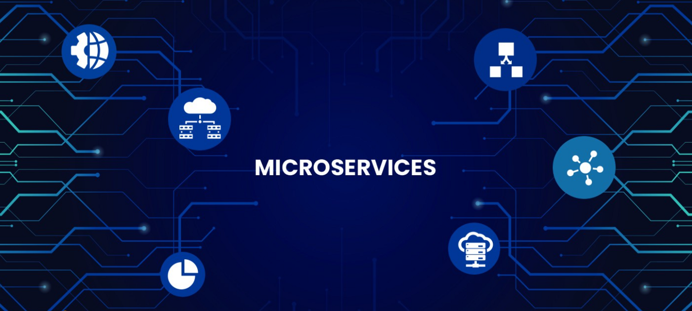
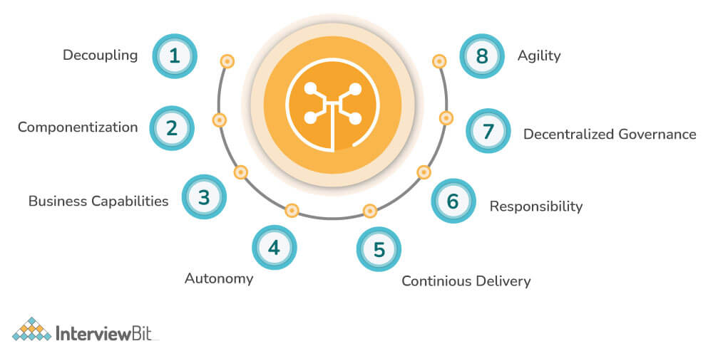
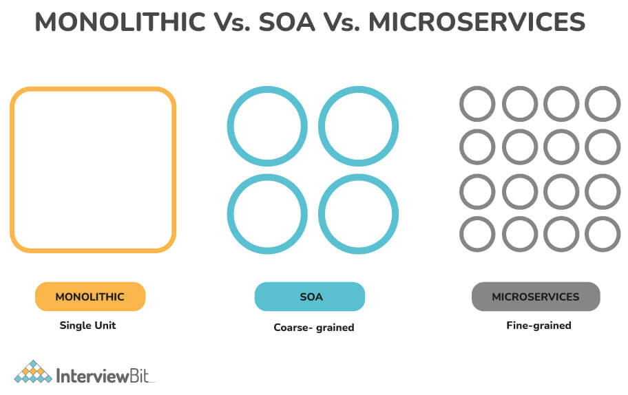
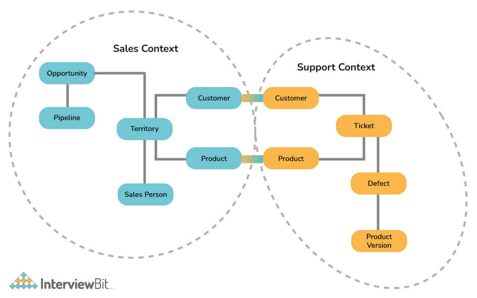
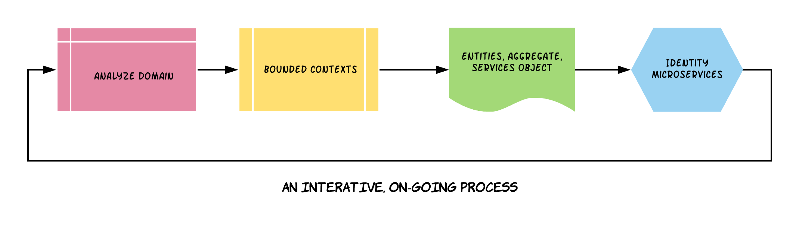
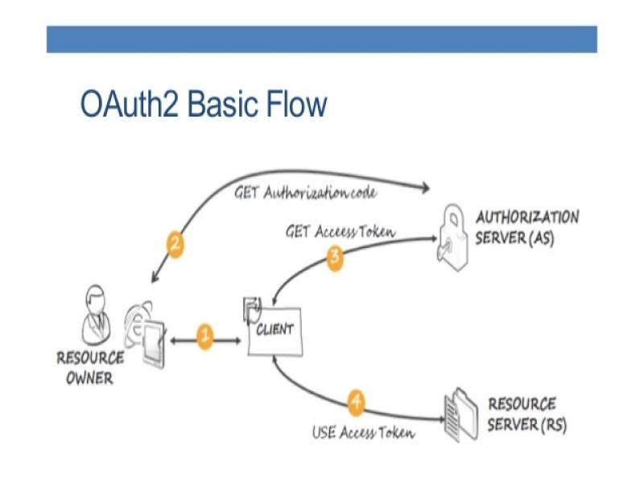
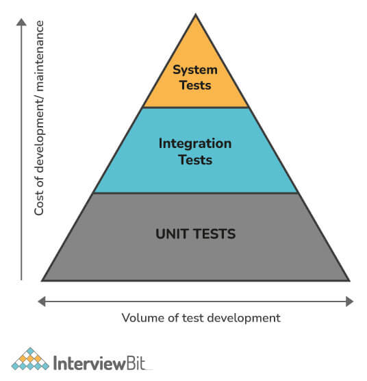
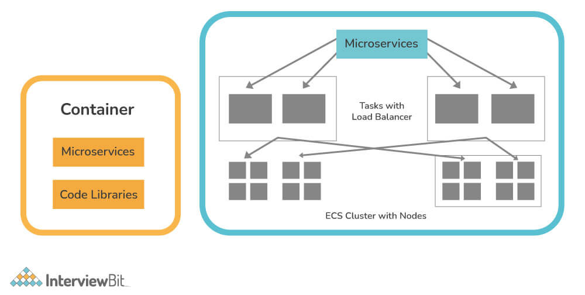

# Câu hỏi phỏng vấn Microservice

## Microservice là gì?

Microservice là một kỹ thuật phát triển phần mềm, một biến thể của kiến trúc hướng dịch vụ cấu trúc một ứng dụng như một tập hợp các dịch vụ được kết nối lỏng lẻo. Trong kiến trúc microservice, các dịch vụ được xử lý tốt và các giao thức rất nhẹ. Các ứng dụng được mô hình hoá dưới dạng các dịch vụ, nó giúp:
- Dễ bảo trì và kiếm tra
- Kết nối mềm
- Có thể triển khai độc lập
- Được thiết kế hoặc tổ chức dựa trên khả năng doanh nghiệp
- Được quản lý bởi một team nhỏ

## Mục lục

[1. Các tính năng chính của Microservices?](#1-c%C3%A1c-t%C3%ADnh-n%C4%83ng-ch%C3%ADnh-c%E1%BB%A7a-microservices)

[2. Các thành phần chính trong Microservices?](#2-c%C3%A1c-th%C3%A0nh-ph%E1%BA%A7n-ch%C3%ADnh-trong-microservices)

[3. Ưu nhược điểm của Microservices?](#3-%C6%B0u-nh%C6%B0%E1%BB%A3c-%C4%91i%E1%BB%83m-c%E1%BB%A7a-microservices)

[4. Các công cụ thường dùng cho Microservices?](#4-c%C3%A1c-c%C3%B4ng-c%E1%BB%A5-th%C6%B0%E1%BB%9Dng-d%C3%B9ng-cho-microservices)

[5. Giải thích kiến trúc Microservice?](#5-gi%E1%BA%A3i-th%C3%ADch-ki%E1%BA%BFn-tr%C3%BAc-microservice)

[6. Sự khác biệt giữa Monolithic, SOA và Microservices?](#6-s%E1%BB%B1-kh%C3%A1c-bi%E1%BB%87t-gi%E1%BB%AFa-monolithic-soa-v%C3%A0-microservices)

[7. Cohesion và Coupling là gì?](#7-cohesion-v%C3%A0-coupling-l%C3%A0-g%C3%AC)

[8. Bounded Context là gì?](#8-bounded-context-l%C3%A0-g%C3%AC)

[9. Viết các đặc điểm cơ bản của Thiết kế Microservice?](#9-vi%E1%BA%BFt-c%C3%A1c-%C4%91%E1%BA%B7c-%C4%91i%E1%BB%83m-c%C6%A1-b%E1%BA%A3n-c%E1%BB%A7a-thi%E1%BA%BFt-k%E1%BA%BF-microservice)

[10. Các thách thức khi sử dụng Microservices?](#10-c%C3%A1c-th%C3%A1ch-th%E1%BB%A9c-khi-s%E1%BB%AD-d%E1%BB%A5ng-microservices)

[11. Giải thích PACT trong Microservices?](#11-gi%E1%BA%A3i-th%C3%ADch-pact-trong-microservices)

[12. Giải thích cách microservice giao tiếp với các phần khác?](#12-gi%E1%BA%A3i-th%C3%ADch-c%C3%A1ch-microservice-giao-ti%E1%BA%BFp-v%E1%BB%9Bi-c%C3%A1c-ph%E1%BA%A7n-kh%C3%A1c)

[13. Client certificates là gì?](#13-client-certificates-l%C3%A0-g%C3%AC)

[14. Giải thích về CDC?](#14-gi%E1%BA%A3i-th%C3%ADch-v%E1%BB%81-cdc)

[15. Các công ty nổi tiếng sử dụng kiến trúc Microservices?](#15-c%C3%A1c-c%C3%B4ng-ty-n%E1%BB%95i-ti%E1%BA%BFng-s%E1%BB%AD-d%E1%BB%A5ng-ki%E1%BA%BFn-tr%C3%BAc-microservices)

[16. Semantic Monitoring là gì?](#16-semantic-monitoring-l%C3%A0-g%C3%AC)

[17. Continuos monitoring là gì?](#17-continuos-monitoring-l%C3%A0-g%C3%AC)

[18. Domain Driven Design là gì?](#18-domain-driven-design-l%C3%A0-g%C3%AC)

[19. Giải thích về OAuth và OAuth2?](#19-gi%E1%BA%A3i-th%C3%ADch-v%E1%BB%81-oauth-v%C3%A0-oauth2)

[20. Distributed Transactions là gì?](#20-distributed-transactions-l%C3%A0-g%C3%AC)

[21. Idempotence là gì?](#21-idempotence-l%C3%A0-g%C3%AC)

[22. Ent-to-end microservices testing là gì?](#22-ent-to-end-microservices-testing-l%C3%A0-g%C3%AC)

[23. Thuật ngữ Euruka trong Microservices?](#23-thu%E1%BA%ADt-ng%E1%BB%AF-euruka-trong-microservices)

[24. Giải thích sự quan trọng của reports và dashboard trong microservices?](#24-gi%E1%BA%A3i-th%C3%ADch-s%E1%BB%B1-quan-tr%E1%BB%8Dng-c%E1%BB%A7a-reports-v%C3%A0-dashboard-trong-microservices)

[25. Reactive Extension là?](#25-reactive-extension-l%C3%A0)

[26. Giải thích các kiểu test thường dùng trong Microservices?](#26-gi%E1%BA%A3i-th%C3%ADch-c%C3%A1c-ki%E1%BB%83u-test-th%C6%B0%E1%BB%9Dng-d%C3%B9ng-trong-microservices)

[27. Kiểm tra kim tự tháp Mike Cohn's là gì?](#27-ki%E1%BB%83m-tra-kim-t%E1%BB%B1-th%C3%A1p-mike-cohns-l%C3%A0-g%C3%AC)

[28. Giải thích Container trong Microservices?](#28-gi%E1%BA%A3i-th%C3%ADch-container-trong-microservices)

[29. Vai trò của Docker trong Microservices?](#29-vai-tr%C3%B2-c%E1%BB%A7a-docker-trong-microservices)

[30. Giải thích cách thực hiện khám phá dịch vụ trong kiến trúc microservices?](#30-gi%E1%BA%A3i-th%C3%ADch-c%C3%A1ch-th%E1%BB%B1c-hi%E1%BB%87n-kh%C3%A1m-ph%C3%A1-d%E1%BB%8Bch-v%E1%BB%A5-trong-ki%E1%BA%BFn-tr%C3%BAc-microservices)

## Câu hỏi phỏng vấn cho Fresher

### 1. Các tính năng chính của Microservices?

- **Phân Tách:** Trong một hệ thống, các dịch vụ chủ yếu được phân tách. Do đó, toàn bộ ứng dụng có thể dễ dàng được xây dựng, thay đổi và có thể mở rộng.
- **Thành phần hóa:** Microservice được xem như các thành phần độc lập có thể dễ dàng được trao đổi hoặc nâng cấp.
- **Kích cỡ nghiệp vụ:** Microservice tương đối đơn giản và chỉ tập trung vào một dịch vụ.
- **Quyền tự chủ của nhóm:** Các nhà phát triển làm việc độc lập với nhau, cho phép tiến trình dự án nhanh hơn.
- **Phân phối liên tục:** Cho phép phát hành phần mềm thường xuyên thông qua hệ thống tự động hóa phát triển, kiểm tra và phê duyệt phần mềm.
- **Trách nhiệm:** Microservices không tập trung vào các ứng dụng như các dự án. Thay vào đó, họ coi các ứng dụng là sản phẩm mà họ chịu trách nhiệm.
- **Quản trị phi tập trung:** Lựa chọn công cụ phù hợp theo công việc là mục tiêu. Các nhà phát triển có thể chọn các công cụ tốt nhất để giải quyết vấn đề của họ
- **Kết hợp Agile:** Microservices tạo điều kiện cho kết hợp với phương pháp Agile. Có thể tạo các tính năng mới một cách nhanh chóng và loại bỏ chúng bất cứ lúc nào

### 2. Các thành phần chính trong Microservices?

* Containers, Clustering, và Orchestration.
* IaC [Infrastructure as Code Conception] 
* Cloud Infrastructure 
* API Gateway 
* Enterprise Service Bus 
* Service Delivery 

### 3. Ưu nhược điểm của Microservices?

**Ưu điểm**

- Module triển khai khép kín và độc lập.
- Các dịch vụ được quản lý độc lập.
- Để cải thiện hiệu suất, dịch vụ yêu cầu có thể được triển khai trên nhiều server.
- Nó dễ kiểm tra hơn và có ít phụ thuộc hơn.
- Khả năng mở rộng lớn hơn.
- Đơn giản trong việc debug và bảo trì.
- Giao tiếp tốt hơn giữa nhà phát triển và người dùng doanh nghiệp.
- Các nhóm phát triển có quy mô nhỏ hơn.

**Nhược điểm**

- Do sự phức tạp của kiến trúc, việc kiểm tra và giám sát khó khăn hơn.
- Thiếu văn hóa doanh nghiệp phù hợp để nó hoạt động.
- Lập kế hoạch trước là điều cần thiết.
- Phát triển phức tạp.
- Yêu cầu một sự chuyển dịch văn hóa.
- Đắt so với monoliths.
- Nguy cơ về bảo mật.
- Việc duy trì mạng khó khăn hơn.

### 4. Các công cụ thường dùng cho Microservices?

- Wiremock
- Docker
- Hstrix

### 5. Giải thích kiến trúc Microservice?

- **Clients**: Người dùng khác nhau gửi yêu cầu đến thiết bị khác nhau.
- **Identity Provider**: Xác thực định danh người dùng hoặc client và cấp token bảo mật.
- **API Gateway**: xử lý yêu cầu từ client.
- **Static Content**: Bao gồm tất cả nội dung của hệ thống.
- **Management**: Dịch vụ được cản bằng trên các node và lỗi được xác định.
- **Service Discovery**: Hướng dẫn khám phá các định tuyến để giao tiếp trong microservices.
- **CDN**: bao gồm mạng phân phối của proxy server và trung tâm dữ liệu của họ.
- **Remote Service**: Cung cấp khả năng truy cập từ xa vào dữ liệu hoặc thông tin trên các máy tính và thiết bị được nối mạng.

### 6. Sự khác biệt giữa Monolithic, SOA và Microservices?

**Monolithic**: Giống như một container lớn, trong đó là tất cả thành phần của ứng dụng được gói cùng với nhau. Nó được xây dựng như một hệ thống lớn với một code-base.

**SOA (Serivce-Oriented Architecture)**: Nó là một nhóm các dịch vụ tương tác hoặc giao tiếp với nhau. Tùy thuộc vào bản chất của giao tiếp, nó có thể là trao đổi dữ liệu đơn giản hoặc nó có thể liên quan đến một số dịch vụ phối hợp một số hoạt động. 

**Microservice**: Nó liên quan đến việc cấu trúc một ứng dụng dưới dạng một cluster (cụm) các dịch vụ nhỏ, tự trị được mô hình hóa xung quanh một miền doanh nghiệp. Các module chức năng có thể được triển khai độc lập, có thể mở rộng, nhằm đạt được các mục tiêu kinh doanh cụ thể và giao tiếp với nhau qua các giao thức tiêu chuẩn.

### 7. Cohesion và Coupling là gì?

**Khớp nối (Cohesion):** Nó được định nghĩa là mối quan hệ giữa các module phần mềm A và B, và mức độ một module phụ thuộc hoặc tương tác với một module khác. Các cohesion nối được chia thành ba loại chính:
- Các module phụ thuộc nhiều vào nhau.
- Các module ít phụ thuộc (lỏng lẻo).
- Các module tách rời hoàn toàn.

Loại cohesion tốt nhất là loại ít phụ thuộc, được thực hiện thông qua các interface.

**Liên kết (Coupling):** Nó được định nghĩa là mối quan hệ giữa hai hoặc nhiều phần tử của một module phục vụ cùng một mục đích. Nói chung, một module có tính liên kết cao có thể thực hiện một chức năng cụ thể một cách hiệu quả mà không cần giao tiếp với bất kỳ module nào khác. Tính liên kết cao nâng cao chức năng của module.

### 8. Bounded Context là gì?

Một bounded context là một mẫu trung tâm trong DDD (Domain-Driven Design), đề cập đến sự cộng tác giữa các mô hình và nhóm lớn. DDD chia nhỏ các mô hình lớn thành nhiều ngữ cảnh để giúp chúng dễ quản lý hơn. Ngoài ra, nó giải thích mối quan hệ của chúng một cách rõ ràng. Khái niệm này thúc đẩy phương pháp tiếp cận hướng đối tượng để phát triển các dịch vụ gắn với mô hình dữ liệu và cũng chịu trách nhiệm đảm bảo tính toàn vẹn và khả năng thay đổi của mô hình dữ liệu nói trên.

### 9. Viết các đặc điểm cơ bản của Thiết kế Microservice?

- Dựa trên khả năng kinh doanh: Các dịch vụ được phân chia và tổ chức xoay quanh khả năng kinh doanh.
- Sản phẩm không phải dự án: Một sản phẩm nên thuộc về team có trách nhiệm xử lý nó.
- Dựa vào các framework message: Loại bỏ các bus dịch vụ tập trung bằng cách nắm lấy khái niệm phân quyền.

### 10. Các thách thức khi sử dụng Microservices?

Những thách thức mà ta phải đối mặt khi sử dụng microservices có thể là cả chức năng và kỹ thuật như dưới đây:

#### Thách thức chức năng:

- Yêu cầu thiết lập cơ sở hạ tầng nặng.
- Cần đầu tư nặng.
- Yêu cầu lập kế hoạch quá mức để xử lý hoặc quản lý chi phí hoạt động

#### Thách thức kỹ thuật:

- Các microservices luôn phụ thuộc lẫn nhau. Vì vậy, chúng phải giao tiếp với nhau.
- Nó là một mô hình có nhiều liên kết vì là một hệ thống phân tán.
- Bạn cần chuẩn bị cho các hoạt động nhiều chi phí nếu bạn đang sử dụng kiến trúc Microservice.
- Để hỗ trợ các microservices phân phối không đồng nhất, bạn cần các chuyên gia với tay nghề cao.
- Rất khó để tự động hóa vì số lượng các thành phần nhỏ hơn. Vì lý do đó, mỗi thành phần phải được xây dựng, triển khai và giám sát riêng biệt.
- Rất khó để quản lý cấu hình trên các môi trường khác nhau cho tất cả các thành phần.
- Những thách thức liên quan đến triển khai, gỡ lỗi và thử nghiệm.

### 11. Giải thích PACT trong Microservices?

PACT được định nghĩa là một công cụ mã nguồn mở cho phép các nhà cung cấp dịch vụ và người tiêu dùng kiểm tra các tương tác một cách tách biệt với các hợp đồng đã được thực hiện để tăng độ tin cậy của tích hợp microservice. Nó cũng cung cấp hỗ trợ cho nhiều ngôn ngữ, chẳng hạn như Ruby, Java, Scala, .NET, JavaScript, Swift/Objective-C.

### 12. Giải thích cách microservice giao tiếp với các phần khác?

Giao tiếp giữa các microservice có thể thực hiện:
- HTTP/REST với JSON hoặc giao thức nhị phân cho request/response.
- Websocket cho streaming
- Một broker hoặc server dùng cho các thuật toán routing.

RabbitMQ, Kafka,... có thể dùng như một message broker, mỗi cái được xây dựng để xử lý message cụ thể. 

### 13. Client certificates là gì?

Client certificates là một loại chứng chỉ kỹ thuật số thường cho phép các hệ thống client xác thực các yêu cầu của họ tới các server từ xa. Trong nhiều thiết kế xác thực lẫn nhau, nó đóng một vai trò quan trọng trong việc cung cấp sự đảm bảo mạnh mẽ về danh tính của người yêu cầu.

### 14. Giải thích về CDC?

Như tên của nó, CDC (Consumer-Driven Contract) về cơ bản đảm bảo khả năng tương thích giao tiếp dịch vụ bằng cách thiết lập một thỏa thuận giữa người tiêu dùng và nhà cung cấp dịch vụ về định dạng dữ liệu được trao đổi giữa họ. Một thỏa thuận như thế này được gọi là hợp đồng (contract). Nó là một mẫu được sử dụng để phát triển các Microservices để chúng có thể được các hệ thống bên ngoài sử dụng một cách hiệu quả.

### 15. Các công ty nổi tiếng sử dụng kiến trúc Microservices?

- Twitter
- Netflix
- Amazon

## Câu hỏi phỏng vấn cho Experienced

### 16. Semantic Monitoring là gì?

Semantic monitoring, còn được gọi là giám sát tổng hợp, sử dụng các bài kiểm tra tự động và giám sát ứng dụng để xác định lỗi trong quy trình kinh doanh. Công nghệ này cung cấp cái nhìn sâu hơn về hiệu suất giao dịch, tính khả dụng của dịch vụ và hiệu suất ứng dụng tổng thể để xác định các vấn đề về hiệu suất của microservices, phát hiện lỗi trong giao dịch và cung cấp mức hiệu suất tổng thể cao hơn.

### 17. Continuos monitoring là gì?

Giám sát liên tục (continuos monitoring) liên quan đến việc xác định các vấn đề tuân thủ và rủi ro trong môi trường tài chính và hoạt động của công ty. Nó bao gồm con người, quy trình và hệ thống làm việc hỗ trợ hoạt động hiệu quả.

### 18. Domain Driven Design là gì?

DDD (Domain Driven Design) là một phương pháp tiếp cận trong việc phân tích và phát triển phần mềm khi giải quyết những vấn đề nghiệp vụ phức tạp. Ý tưởng cơ bản của phương pháp này là việc xây dựng kết nối chặt chẽ giữa thiết kế phần mềm và mô hình nghiệp vụ trong suốt vòng đời phát triển sản phẩm. Để tạo nên sự kết nối này, DDD đưa ra 3 yêu cầu cơ bản:

- Trọng tâm của dự án là những nguyên tắc và logic nghiệp vụ
- Thiết kế phần mềm cần phải phản ánh chính xác mô hình nghiệp vụ
- Sự cộng tác liên tục giữa kĩ sư và chuyên gia nghiệp vụ

Kết quả của việc phân tích hệ thống dựa trên phương pháp DDD, kết hợp cùng mô hình kiến trúc Microservices giúp chúng ta tổ chức và phát triển những microservices giải quyết các vấn đề nghiệp vụ một cách tương ứng. Hoạt động kết hợp này được phản ánh qua một qui trình bao gồm các bước:

- Phân tích nghiệp vụ - domain model
- Định nghĩa ngữ cảnh - bounded context
- Định nghĩa đối tượng (entities), tập hợp (aggregate) và dịch vụ (service)
- Xác định microservices cần xây dựng

### 19. Giải thích về OAuth và OAuth2?

**OAuth** là một phương thức xác thực giúp một ứng dụng bên thứ 3 có thể được ủy quyền bởi người dùng để truy cập đến tài nguyên người dùng nằm trên một dịch vụ khác. OAuth là từ ghép của O(Open) và Auth tượng trưng cho:

- *Authentication*: xác thực người dùng.
- *Authorization*: cấp quyền truy cập đến tài nguyên mà người dùng hiện đang nắm giữ.

OAuth2 là bản nâng cấp của OAuth1.0, là một giao thức chứng thực cho phép các ứng dụng chia sẻ một phần tài nguyên với nhau mà không cần xác thực qua username và password như cách truyền thống từ đó giúp hạn chế được những phiền toái khi phải nhập username, password ở quá nhiều nơi hoặc đăng ký quá nhiều tài khoản mật khẩu mà chúng ta chẳng thể nào nhớ hết.

Trong OAuth2 định nghĩa 4 vai trò:

- **Resource owner:** là những người dùng có khả năng cấp quyền truy cập, chủ sở hữu của tài nguyên mà ứng dụng muốn lấy.
- **Resource server:** nơi lưu trữ các tài nguyên, có khả năng xử lý yêu cầu truy cập đến các tài nguyên được bảo vệ.
- **Client**: là những ứng dụng bên thứ 3 muốn truy cập vào phần tài nguyên được chia sẻ với tư cách của người sở hữu (resource owner) và tất nhiên trước khi truy cập ứng dụng cần được sự ủy quyền của người dùng.
- **Authorization server:** làm nhiệm vụ xác thực, kiểm tra thông tin mà người dùng gửi đến từ đó cấp quyền truy cập cho ứng dụng bằng việc sinh ra các đoạn access token. Đôi khi authorization server cũng chính là resource server.

### 20. Distributed Transactions là gì?

Giao dịch phân tán (distributed transactions) là một cách tiếp cận lỗi thời trong kiến trúc microservice ngày nay khiến nhà phát triển gặp phải các vấn đề nghiêm trọng về khả năng mở rộng. Các giao dịch được phân phối cho một số dịch vụ được gọi để hoàn thành giao dịch theo trình tự. Với rất nhiều bộ phận chuyển động, nó rất phức tạp và dễ bị hỏng hóc.

### 21. Idempotence là gì?

Thuật ngữ "Idempotence" đề cập đến việc thực hiện lặp đi lặp lại một nhiệm vụ mặc dù cùng một kết quả. Nói cách khác, nó là một tình huống trong đó một nhiệm vụ được thực hiện lặp đi lặp lại với kết quả cuối cùng được giữ nguyên.
 
Cách sử dụng: Khi dịch vụ từ xa hoặc nguồn dữ liệu nhận được hướng dẫn nhiều lần, Idempotence đảm bảo rằng nó sẽ xử lý từng yêu cầu một lần.

### 22. Ent-to-end microservices testing là gì?

Thông thường, end-to-end (E2E) microservice testing là một kỹ thuật không phối hợp, chi phí cao được sử dụng để đảm bảo rằng tất cả các thành phần hoạt động cùng nhau cho một hành trình hoàn chỉnh của người dùng. Thông thường, nó được thực hiện thông qua giao diện người dùng, bắt chước cách nó xuất hiện với người dùng. Nó cũng đảm bảo tất cả các quy trình trong quy trình làm việc hoạt động bình thường.

### 23. Thuật ngữ Euruka trong Microservices?

Eureka Server, còn được gọi là Netflix Service Discovery Server, là một ứng dụng theo dõi tất cả các ứng dụng dịch vụ client. Vì mọi Microservice đăng ký với Server Eureka, Eureka biết tất cả các ứng dụng client đang chạy trên các cổng và địa chỉ IP khác nhau. Nó thường sử dụng Spring Cloud và không nặng về quá trình phát triển ứng dụng.

### 24. Giải thích sự quan trọng của reports và dashboard trong microservices?

Giám sát một hệ thống thường liên quan đến việc sử dụng các report (báo cáo) và dashboard (trang tổng quan). Sử dụng report và dashboard cho các microservices có thể giúp bạn:

- Xác định microservices hỗ trợ tài nguyên nào.
- Xác định dịch vụ nào bị ảnh hưởng bất cứ khi nào thay đổi được thực hiện hoặc xảy ra đối với các thành phần.
- Làm cho tài liệu dễ dàng truy cập bất cứ khi nào cần thiết.
- Xem lại các phiên bản thành phần đã triển khai.
- Xác định mức độ phát triển và tuân thủ từ các thành phần.

### 25. Reactive Extension là?

Reactive Programming như một khái niệm đã tồn tại trong hơn 20 năm nhưng đã không phát triển cho đến Reactive Extensions ra đời. Reactive Extension (còn được gọi là ReactiveX hay Rx) là giao diện lập trình ứng dụng (Application Programming Interface-API) hoặc lập trình bất đồng bộ với các luồng có thể quan sát được.

ReactiveX có hai lớp: lớp có thể quan sát (Observable) và lớp quan sát (Observer). Observable là nguồn dữ liệu của các luồng hoặc các sự kiện và Observer là lớp sử dụng (hoặc phản ứng lại) các phần tử được tạo ra.

Một Observable có thể có nhiều Observer để mỗi mục dữ liệu được tạo ra sẽ được nhận bởi một Observer. Trong ReactiveX, một Observer theo dõi một Observable. Sau đó, Observable tạo ra các luồng dữ liệu, Observer sẽ lắng nghe và phản ứng lại. Điều này tạo ra một loạt các hoạt động trên luồng dữ liệu. Một chủ thể vừa có thể hoạt động như Observer vừa có thể đóng vai trò là Observable.

Chúng ta cũng có thể áp dụng toán tử cho các luồng. Các toán tử xác định cách thức và thời điểm Observable sẽ tạo luồng. Hầu hết các toán tử thực thi các hàm trên Observable và trả về một Observable.

### 26. Giải thích các kiểu test thường dùng trong Microservices?

Vì có nhiều microservice hoạt động cùng nhau, việc test microservice trở nên khá phức tạp khi làm việc với microservices. Do đó, các bài test được phân loại theo cấp độ của chúng:

- **Test cấp thấp:** các test này xử lý với công nghệ, như unit test và performance test. Đây là quá trình tự động hoàn thành
- **Test cấp trung bình:** chúng ta có các bài test như stress test và usability test.
- **Test cấp cao:** chúng ta có một số test chấp nhận hạn chế. Các bài test chấp nhận giúp các bên liên quan hiểu và xác minh các tính năng của phần mềm.

### 27. Kiểm tra kim tự tháp Mike Cohn's là gì?

Kiểm tra kim tự tháp Mike Cohn's giải thích các kiểu khác nhau của test tự động cần cho phát triển phần mềm. Kiểm tra kim tự tháp về cơ bản là được sử dụng để tối đa hoá tự động hoá tất cả các cấp độ test, bao gồm unit testing, service testing, UI testing,...Kim tự tháp cũng cho biết rằng các unit test nhanh hơn và cô lập hơn, trong khi các ui test, tốn nhiều thời gian hơn và tập trung vào tích hợp.

Theo kim tự tháp, số lượng bài test phải cao nhất ở lớp đầu tiên. Ở lớp service, ít test được thực hiện hơn ở mức unit test, nhưng lớn hơn ở mức end-to-end.

### 28. Giải thích Container trong Microservices?

Container là công nghệ hữu ích để phân bổ và chia sẻ tài nguyên. Nó được coi là phương pháp hiệu quả nhất và dễ dàng nhất để quản lý các ứng dụng dựa trên microservice để phát triển và triển khai chúng riêng lẻ. Sử dụng Docker, bạn cũng có thể đóng gói một microservice cùng với các phần phụ thuộc của nó trong một container image, sau đó có thể được sử dụng để cuộn các phiên bản theo yêu cầu của microservice mà không cần thực hiện thêm bất kỳ công việc nào.

### 29. Vai trò của Docker trong Microservices?

Docker thường cung cấp một môi trường container, trong đó bất kỳ ứng dụng nào cũng có thể được host. Điều này được thực hiện bằng cách đóng gói chặt chẽ cả ứng dụng và các phụ thuộc cần thiết để hỗ trợ nó. Các sản phẩm đóng gói này được gọi là Container và vì Docker đã quen với việc đó nên chúng được gọi là Docker container. Về bản chất, Docker cho phép bạn chứa các microservice của mình và quản lý các microservices này dễ dàng hơn.

### 30. Giải thích cách thực hiện khám phá dịch vụ trong kiến trúc microservices?

Có nhiều cách để thiết lập tính năng khám phá dịch vụ, nhưng Eureka của Netflix là cách hiệu quả nhất. Đây là một thủ tục đơn giản, không phức tạp và không tạo thêm nhiều dung lượng cho ứng dụng. Nó cũng hỗ trợ một loạt các ứng dụng web. Một số chú thích được cung cấp bởi Spring Cloud để làm cho việc sử dụng nó trở nên đơn giản nhất có thể và để ẩn đi các khái niệm phức tạp.