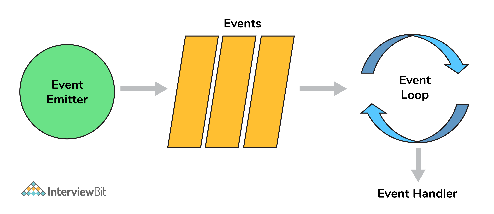

# Câu hỏi phỏng vấn Node.js


## Node.js là gì

Nodejs là một nền tảng được xây dựng, vận hành tại V8 JavaScript runtime của Chrome. Với Nodejs, bạn có thể chạy JavaScript trên server và thể xây dựng, phát triển các ứng dụng mạng nhanh chóng và dễ dàng.

Nền tảng này bắt đầu được xây dựng, phát triển tại California từ năm 2009 với phần Core phía dưới được lập trình bằng C++ gần như 100%. Điều này tạo nên ưu thế về tốc độ xử lý cũng như hiệu năng của nền tảng này. Đến nay, Nodejs vẫn đang "gây bão" trong cộng đồng công nghệ bởi khả năng phát triển ứng dụng vượt trội.

## Câu hỏi phỏng vấn Node.js cho Fresher

### 1. First class function là gì ?

First class function hay hàm hạng nhất là khi một hàm được sử dụng như một biến (được gán, truyền như tham số hay trả về). Có nhiều ngôn ngữ lập trình như Scala, Haskell, và JavaScript... đều có hàm hạng nhất.
Các hàm này có thể truyền dưới dạng tham số hay trả về cho một hàm khác gọi là HOC(high-order function).

Các hàm `map()` và `filter()` là các HOC phổ biến được dùng.

### 2. Node.js  hoạt động thế nào ?

Ý tưởng chính của Node js là sử dụng non-blocking, hướng sự vào ra dữ liệu thông qua các tác vụ thời gian thực một cách nhanh chóng. Bởi vì, Node js có khả năng mở rộng nhanh chóng, khả năng xử lý một số lượng lớn các kết nối đồng thời bằng thông lượng cao. Nếu như các ứng dụng web truyền thống, các request tạo ra một luồng xử lý yêu cầu mới và chiếm RAM của hệ thống thì việc tài nguyên của hệ thống sẽ được sử dụng không hiệu quả. Chính vì lẽ đó giải pháp mà Node js đưa ra là sử dụng luồng đơn (Single-Threaded), kết hợp với non-blocking I/O để thực thi các request, cho phép hỗ trợ hàng chục ngàn kết nối đồng thời.

### 3. Quản lý package trong ứng dụng Node.js ?

Khi thảo luận về Node js thì một điều chắc chắn không nên bỏ qua là xây dựng package quản lý sử dụng các công cụ NPM mà mặc định với mọi cài đặt Node js. Ý tưởng của mô-đun NPM là khá tương tự như Ruby-Gems: một tập hợp các hàm có sẵn có thể sử dụng được, thành phần tái sử dụng, tập hợp các cài đặt dễ dàng thông qua kho lưu trữ trực tuyến với các phiên bản quản lý khác nhau. Bên cạnh npm cũng có thể sử dụng yarn với bộ chức năng tương tự.

### 4. Node.js có tốt hơn các framework khác ?

- **Bất đồng bộ**: Đặc điểm đầu tiên của Nodejs là tính bất đồng bộ. Node.js không cần đợi API trả dữ liệu về, vậy nên mọi APIs nằm trong thư viện Node.js đều không được đồng bộ, hiểu đơn giản là chúng không hề blocking (khóa). Server có cơ chế riêng để gửi thông báo và nhận phản hồi về các hoạt động của Node.js và API đã gọi.
- **Tốc độ nhanh**: Với phần core phía dưới lập trình gần như toàn bộ bằng ngôn ngữ C++, kết hợp với V8 Javascript Engine mà Google Chrome cung cấp, tốc độ vận hành, thực hiện code của thư viện Node.js diễn ra rất nhanh.
- **Đơn giản/Hiệu quả**: Tiến trình vận hành của Node.js đơn giản song lại mang đến hiệu năng cao nhờ ứng dụng mô hình single thread và các sự kiện lặp. Một loạt cơ chế sự kiện cho phép server trả về phản hồi bằng cách không block, đồng thời tăng hiệu quả sử dụng. Các luồng đơn cung cấp dịch vụ cho nhiều request hơn hẳn Server truyền thống.
- **Không đệm**: Nền tảng Node.js không có vùng đệm, tức không cung cấp khả năng lưu trữ dữ liệu buffer.
- **Có giấy phép**: Đây là nền tảng đã được cấp giấy phép, phát hành dựa trên MIT License.
### 5. Các bước để luồng điều khiển kiểm soát các lệnh gọi hàm ?

- Kiểm soát trật tự thực thi
- Thu thập dữ liệu
- Giới hạn đồng thời
- Gọi bước sau trong chương trình.

### 6. Các tính năng thời gian của Node.js?

Các hàm Set Timer:
- `setImmediate()` : chạy ngay lập tức (thực ra nó sẽ chạy ở lần lặp tiếp theo trong event loop)
- `setTimeout()` : chạy trong một khoảng thời gian.
- `setInterval()`: lặp đi lặp lại trong khoảng thời gian

Các hàm Clear timer
- `clearImmediate()` : dừng một đối tượng setImmediate, tạo bởi hàm setImmediate()
- `clearTimeout()` : dừng một đối tượng setTimeout, tạo bởi hàm setTimeout()
- `clearInterval()` : dừng một đối tượng setInterval, tạo bởi hàm setInterval()

### 7. Ưu điểm của promise so với callback?

Ưu điểm chính của việc sử dụng **promise** là bạn có được một đối tượng để quyết định hành động cần được thực hiện sau khi tác vụ bất đồng bộ hoàn thành. Điều này cung cấp cod dễ quản lý hơn và tránh callback hell.

### 8. fork trong Node.js là gì?

Một fork dùng cho tạo các tiến trình con. Trong nodejs, nó được dùng để tạo thực thể mới của v8 để chạy nhiều worker cho thực thi code.

### 9. Tại sao Node.js lại là đơn luồng?

Node.js được tạo rõ ràng như một thử nghiệm trong xử lý bất đồng bộ. Lý thuyết là thực hiện xử lý bất đồng bộ trên một luồng duy nhất có thể cung cấp hiệu suất và khả năng mở rộng cao hơn so với các triển khai đa luồng truyền thống.

Một ứng dụng node.js không hoạt động chuyên sâu về CPU có thể chạy hàng nghìn kết nối đồng thời tốt hơn Apache hoặc IIS hoặc các máy chủ đa luồng khác.

### 10. Tạo ứng dụng hello world với node.js?

```js
var http = require("http");
http.createServer(function (request, response) {
    response.writeHead(200, {'Content-Type': 'text/plain'});
    response.end('Hello World\n');
}).listen(3000);
```

### 11. Các kiểu hàm API trong node.js?

Có hai kiểu hàm API:
- Hàm bất đồng bộ, non-blocking: sử dụng chủ yếu cho các hoạt động I/O có thể tách ra khỏi vòng lặp chính.
- Hàm đồng bộ, blocking: sử dụng cho các hoạt động ảnh hưởng đến tiến trình đang chạy trong vòng lặp chính.

### 12. REPL là gì?

REPL là từ viết tắt của Read Eval Print Loop (hiểu nôm na là: Đọc – Đánh giá – In – Lặp) và nó biểu diễn môi trường máy tính như màn hình console trong Linux shell nơi bạn có thể gõ các dòng lệnh và hệ thống sẽ trả về các kết quả. NodeJS cũng có môi trường REPL. Nó để thực hiện các tác vụ mong muốn:

**Read**: Đọc các thông tin input của người dùng, chuyển đổi thành các dữ liệu Javascript và lưu trữ trong bộ nhớ.

**Eval**: Đánh giá các cấu trúc dữ liệu này.

**Print**: In các kết quả.

**Loop**: Lặp các dòng lệnh đến khi người dùng gõ ctrl-c hai lần.

### 13. Hai tham số mà async.queue nhận làm đầu vào?

- Hàm tác vụ (Task function)
- Giá trị đồng thời (Concurrency Value)

### 14. Ý nghĩa của module.exports?

Được sử dụng để hiển thị các chức năng của một module hoặc file cụ thể sẽ được sử dụng ở những nơi khác trong dự án. Nó có thể được sử dụng để đóng gói tất cả các chức năng tương tự trong một file giúp cải thiện cấu trúc dự án.

Ví dụ:

```js
const getSolutionInJavaScript = async ({
    problem_id
}) => {
...
};
const getSolutionInPython = async ({
    problem_id
}) => {
    ...
};
module.exports = { getSolutionInJavaScript, getSolutionInPython }
```

Bây giờ ta có thể sử dụng lại các hàm trên ở file khác:

```js
const { getSolutionInJavaScript, getSolutionInPython} = require("./utils")
```

### 15. Công cụ dùng để đảm bảo code style nhất quán?

ESLint có thể dùng với bất kỳ IDE nào để đảm bảo code style nhất quán cho duy trì codebase trong tương lai.

### 16. Callback hell là gì?

```js
async_A(function(){
    async_B(function(){
        async_C(function(){
            async_D(function(){
            ....
            });
        });
    });
});
```

Đối với ví dụ trên, chúng ta đang truyền các hàm callback và nó làm cho code không thể đọc được càng không thể bảo trì, do đó chúng ta nên thay đổi logic bất đồng bộ để tránh điều này.

### 17. Event-Loop trong Node.js là gì?

Bất cứ thứ gì bất đồng bộ đều được quản lý bởi event loop sử dụng queue và listener. Ta có thể mường tượng với sơ đồ sau:



Khi hàm main được chạy thì các đoạn code trong main sẽ được thực thi. Nó sẽ lần lượt đẩy các hàm vào bên trong call stack theo nguyên tắc LIFO.

Các hàm hay tác vụ liên quan đến Events (click, change, listener, …), AJAX (Call APIs), Timing (setTimeout, setInterval) sẽ được đẩy từ call stack sang Web APIs. Còn lại thì sẽ được thực thi trong call stack đến khi nào xong thì pop nó ra cho hàm bên dưới được thực thi.

Ở Web APIs sẽ tận dụng các nhân của thiết bị để xử lý riêng biệt các tác vụ này. Sau khi hoàn tất thì Web APIs sẽ trả về một callback và đẩy nó vào trong Callback Queue.

Callack Queue hoạt động theo nguyên tắc của queue là FIFO (vào trước ra trước) không như stack.

Event loop hiểu nôm na là một vòng lặp vô tận, nó luôn trực chờ ở đó để quan sát Callback Queue và Call stack.

Bất kể khi nào mà call stack trống (tất cả các hàm được pop ra) thì nó sẽ lấy các callback ở trong Callback Queue và ném đưa trong Call Stack để tiếp tục thực thi.

### 18. Nếu node.js đơn luồng thì nó xử lý đồng thời như thế nào?

Ví dụ:

```js
const crypto = require("crypto");
const start = Date.now();
function logHashTime() {
    crypto.pbkdf2("a", "b", 100000, 512, "sha512", () => {
        console.log("Hash: ", Date.now() - start);
    });
}
logHashTime();
logHashTime();
logHashTime();
logHashTime();
```

Kết quả là:

```text
Hash: 1213
Hash: 1225
Hash: 1212
Hash: 1222
```

Khi cần xử lý đồng thời, thư viện libuv trong node.js sẽ dùng thread pool để tạo thêm luồng cho xử lý đồng thời như vậy. 

### 19. Sự khác biệt giữa process.nextTick() và setImmediate()?

Cả hai đều dùng để chuyển sang chế độ bất đồng bộ bởi hàm listener.

**process.nextTick()** đặt calblack cho thực thi còn **setImmediate** đẩy callback vào hàng đợi để thực thi. Vì vậy event-loop sẽ chạy như sau.

**`timers–>pending callbacks–>idle,prepare–>connections(poll,data,etc)–>check–>close callbacks`**

Ở phương thức process.nextTick() này, thêm hàm callback để bắt đầu ở event queue kế tiếp, còn phương thức setImmediate() đặt hàm vào giai đoạn kiếm tra của event queue kế tiếp.

### 20. Nodejs giải quyết vấn đề block I/O như thế nào?

Vì node có event loop có thể dùng cho tất cả hoạt động I/O bật đồng bộ mà không cần blocking ở hàm chính.

Ví dụ: nếu một cuộc gọi mạng xảy ra, nó sẽ được lập lịch trong event loop thay vì luồng chính. Nếu có nhiều lệnh gọi I/O như vậy, mỗi lệnh gọi sẽ được xếp vào hàng đợi tương ứng để thực thi (ngoài luồng chính).

Vì vậy, ngay cả khi đơn luồng các hoạt động I/O vẫn được xử lý theo cách non-blocking.

### 21. Sử dụng async await trong Node.js?

```js
// this code is to retry with exponential backoff
function wait (timeout) {
    return new Promise((resolve) => {
        setTimeout(() => {
            resolve()
        }, timeout);
    });
}

async function requestWithRetry (url) {
    const MAX_RETRIES = 10;
    for (let i = 0; i <= MAX_RETRIES; i++) {
        try {
            return await request(url);
        } catch (err) {
            const timeout = Math.pow(2, i);
            console.log('Waiting', timeout, 'ms');
            await wait(timeout);
            console.log('Retrying', err.message, i);
        }
    }
}
```

### 22. Node.js stream là gì?

Stream là một thực thể của EventEmitter, có thể dùng cho dữ liệu streaming trong Node.js. Nó có thể dùng để xử lý và quản lý các file streaming lớn như video, mp3, ... qua mạng. Nó sử dụng buffers như bộ lưu trữ tạm thời.

Nó có 4 kiểu chính là:

- **Writable**: streams cho phép ghi dữ liệu (ví dụ: `fs.createWriteStream()`).
- **Readable**: streams cho phép đọc dữ liệu (ví dụ: `fs.createReadStream()`).
- **Duplex**: streams là kết hợp của cả Readable và Writable (ví dụ `net.Socket`).
- **Transform**: là stream Duplex có thể chỉnh sửa hoặc chuyển đổi dữ liệu khi nó được ghi hay đọc (ví dụ `zlib.createDeflate()`).

### 23. Buffers trong node.js?

Buffer là một vùng lưu trữ tạm thời chứa các dữ liệu đang được chuyển từ nơi này đến nơi khác. Buffer có kích thước xác định và giới hạn. Kích thước của buffer được xác định bằng những thuật toán cho từng trường hợp cụ thể. Buffer là một kỹ thuật được phát triển nhằm ngăn chặn sự tắc nghẽn dữ liệu khi truyền từ nơi này đến nơi khác.

Buffer là một class trong Node.js API dùng để giao tiếp với các dữ liệu nhị phân. Buffer class đã được khai báo trong phạm vi global trong các phiên bản Node.js sau này, nên chúng ta không cần phải `require('buffer')` để sử dụng. 

### 24. Middleware là gì?

Middleware nằm giữa request và logic nghiệp vụ. Nó được dùng để ghi log, giới hạn truy cập, định tuyến, xác thực hay bất cứ điều gì không phải là một phần của logic nghiệp vụ. Ngoài ra third-party middleware chẳng hạn như body-parser có thể viết middleware của riêng mình cho một trường hợp cụ thể.

## Câu hỏi phỏng vấn Node.js cho Experienced

### 25. Giải thích Reactor Pattern trong Nodejs?

Reactor pattern là một pattern cho thao tác non-blocking I/O. Nhưng rộng hơn nó được dùng cho cả kiến trúc event-driven.

Có hai thành phần chính là:
- **Reactor**: có nhiệm vụ gửi sự kiện I/O cho handler phù hợp
- **Handler**: có nhiệm vụ thực hiện công việc với sự kiện

### 26. Tại sao tách biệt app và server trong Express?

Server có trách nhiệm khởi tạo routes, middleware và các logic ứng dụng khác trong khi đó app là tất cả logic nghiệp vụ để phục vụ các routes của server. Điều này đảm bảo rằng các logic nghiệp vụ sẽ được đóng gói và phân tách với logic ứng dụng giúp dự án dễ đọc và bảo trì.

### 27. Tại sao Nodejs lại dùng V8 Engine?

Thực tế, ta có nhiều hơn một lựa chọn về Javascript Engine chẳng hạn như Spidermonkey từ Firefox, Chakra từ Edge nhưng V8 của Google là phiên bản phát triển nhất (vì nó là mã nguồn mở nên có một cộng đồng lớn giúp phát triển các tính năng và sửa lỗi) và nhanh nhất (vì nó được viết bằng c ++). Cho đến hiện tại nó như một  JavaScript Engine và WebAssembly. 

### 28. Thoát mã trong Node.js?

Thoát mã (exit code) cung cấp ý tưởng về cách tạm dừng hay huỷ chương trình.

Một vài thoát mã:
- Uncaught fatal exception - (code - 1) - Đã có một ngoại lệ không được xử lý
- Unused - (code - 2) - Cái này được đặt trước bởi bash
- Fatal Error - (code - 5) - Đã xảy ra lỗi trong V8 với đầu ra stderr của mô tả
- Internal Exception handler Run-time failure - (code - 7) - Đã có một ngoại lệ khi hàm khởi động được gọi
- Internal JavaScript Evaluation Failure - (code - 4) - Đã có một ngoại lệ khi quá trình khởi động không thể trả về giá trị hàm khi được đánh giá.

### 29. Giải thích khái niệm stub trong Nodejs?

Stubs được sử dụng trong các bài kiểm tra viết, là một phần quan trọng của sự phát triển. Nó thay thế toàn bộ chức năng đang được kiểm tra.

Điều này giúp ích trong các tình huống mà ta cần kiểm tra:

- Các cuộc gọi bên ngoài làm cho các bài kiểm tra chậm và khó ghi (ví dụ: cuộc gọi HTTP / cuộc gọi DB)
Kích hoạt các kết quả khác nhau cho một đoạn mã (ví dụ: điều gì sẽ xảy ra nếu một lỗi được ném ra / nếu nó vượt qua)

```js
const request = require('request');
const getPhotosByAlbumId = (id) => {
const requestUrl = `https://jsonplaceholder.typicode.com/albums/${id}/photos?_limit=3`;
return new Promise((resolve, reject) => {
    request.get(requestUrl, (err, res, body) => {
        if (err) {
            return reject(err);
        }
        resolve(JSON.parse(body));
    });
});
};
module.exports = getPhotosByAlbumId;
```

Để kiểm tra hàm này, ta có stub:

```js
const expect = require('chai').expect;
const request = require('request');
const sinon = require('sinon');
const getPhotosByAlbumId = require('./index');
describe('with Stub: getPhotosByAlbumId', () => {
    before(() => {
        sinon.stub(request, 'get')
            .yields(null, null, JSON.stringify([
                {
                    "albumId": 1,
                    "id": 1,
                    "title": "A real photo 1",
                    "url": "https://via.placeholder.com/600/92c952",
                    "thumbnailUrl": "https://via.placeholder.com/150/92c952"
                },
                {
                    "albumId": 1,
                    "id": 2,
                    "title": "A real photo 2",
                    "url": "https://via.placeholder.com/600/771796",
                    "thumbnailUrl": "https://via.placeholder.com/150/771796"
                },
                {
                    "albumId": 1,
                    "id": 3,
                    "title": "A real photo 3",
                    "url": "https://via.placeholder.com/600/24f355",
                    "thumbnailUrl": "https://via.placeholder.com/150/24f355"
                }
            ]));
    });
    after(() => {
        request.get.restore();
    });
    it('should getPhotosByAlbumId', (done) => {
        getPhotosByAlbumId(1).then((photos) => {
            expect(photos.length).to.equal(3);
            photos.forEach(photo => {
                expect(photo).to.have.property('id');
                expect(photo).to.have.property('title');
                expect(photo).to.have.property('url');
            });
            done();
        });
    });
});
```

### 30. Even Emitter trong Nodejs là gì?

EventEmitter là một lớp Node.js bao gồm tất cả các đối tượng về cơ bản có khả năng emitting ra các sự kiện. Điều này có thể được thực hiện bằng cách đính kèm các sự kiện đã đặt tên được emitt ra bởi đối tượng bằng cách sử dụng một hàm `eventEmitter.on()`. Vì vậy, bất cứ khi nào đối tượng này throw một sự kiện, các hàm kèm theo sẽ được gọi đồng bộ.


```js
const EventEmitter = require('events');
class MyEmitter extends EventEmitter {}
const myEmitter = new MyEmitter();
myEmitter.on('event', () => {
    console.log('an event occurred!');
});
myEmitter.emit('event');
```

### 31. Tăng cường hiệu suất Node.js thông qua phân cluster?

Các ứng dụng Node.js chạy trên một bộ xử lý duy nhất, có nghĩa là theo mặc định, chúng không tận dụng được hệ thống đa lõi. Chế độ cluster được sử dụng để khởi động nhiều tiến trình node.js do đó có nhiều phiên bản của event-loop. Khi chúng tôi bắt đầu sử dụng cluster trong một ứng dụng nodejs phía sau, nhiều tiến trình node.js được tạo ra nhưng cũng có một tiến trình mẹ được gọi là trình quản lý cluster chịu trách nhiệm theo dõi tình trạng của các phiên bản riêng lẻ trong ứng dụng của ta.


### 32. Thread pool là gì?

Thread pool được xử lý bởi thư viện libuv. libuv là thư viện C đa nền tảng, cung cấp hỗ trợ các hoạt động bất đồng bộ I/O như hệ thống file, mạng, đồng thời,...


### 33. WASI là gì?

Web assembly cung cấp triển khai đặc tả WebAssembly System Interface thông qua API WASI trong node.js được triển khai bằng cách sử dụng lớp WASI. Việc thêm lớp WASI được thực hiện bởi nó có thể sử dụng hệ điều hành cơ bản thông qua tập hợp các hàm giống như POSIX, do đó, cho phép ứng dụng sử dụng hiệu quả hơn các tài nguyên và các tính năng yêu cầu quyền truy cập cấp hệ thống.

### 34. Các luồng worker khác gì với cluster?

**Cluster**

- Có một tiến trình trên mỗi CPU với IPC để giao tiếp.
- Trong trường hợp muốn nhiều server chấp nhận yêu cầu HTTP thông qua cổng đơn, cluster có thể hữu ích.
- Các tiến trình được sinh từ mỗi CPU, do đó sẽ có bộ nhớ và thực thể node riêng biệt, dẫn đến các vấn đề về bộ nhớ.

**Worker Thread**

- Chỉ có một tiến trình trong nhiều luồng.
- Mỗi luồng có một thực thể node(một event-loop, một js-engine) với hầu hết API có thể truy cập.
- Chia sẻ bộ nhớ với các luồng khác (SharedArrayBuffer)
- Có thể được dùng cho các tác vụ đòi hỏi nhiều CPU như xử lý dữ liệu hoặc truy cập hệ thống file vì Node là đơn luồng, các tác vụ đồng bộ có thể thực hiện hiệu quả hơn nhờ worker của thread.

### 35. Làm thế nào để đo thời gian của các hoạt động không đồng bộ?

API Performance cung cấp cho chúng ta các công cụ để tìm ra các chỉ số hiệu suất cần thiết. Một ví dụ đơn giản sẽ là sử dụng `async_hooks` và `perf_hooks`

```js
'use strict';
const async_hooks = require('async_hooks');
const {
    performance,
    PerformanceObserver
} = require('perf_hooks');
const set = new Set();
const hook = async_hooks.createHook({
    init(id, type) {
        if (type === 'Timeout') {
            performance.mark(`Timeout-${id}-Init`);
            set.add(id);
        }
    },
    destroy(id) {
    if (set.has(id)) {
        set.delete(id);
        performance.mark(`Timeout-${id}-Destroy`);
        performance.measure(`Timeout-${id}`,
                            `Timeout-${id}-Init`,
                            `Timeout-${id}-Destroy`);
        }
    }
});
hook.enable();
const obs = new PerformanceObserver((list, observer) => {
    console.log(list.getEntries()[0]);
    performance.clearMarks();
    observer.disconnect();
});
obs.observe({ entryTypes: ['measure'], buffered: true });
setTimeout(() => {}, 1000);
```

Điều này sẽ cung cấp cho chúng ta thời gian chính xác để thực hiện lệnh callback.

### 36. Làm thế nào để đo lường hiệu suất của các hoạt động không đồng bộ?

API Perfomance cung cấp cho chúng tôi các công cụ để tìm ra các chỉ số hiệu suất cần thiết.

```js
const { PerformanceObserver, performance } = require('perf_hooks');
const obs = new PerformanceObserver((items) => {
    console.log(items.getEntries()[0].duration);
    performance.clearMarks();
});
obs.observe({ entryTypes: ['measure'] });
performance.measure('Start to Now');
performance.mark('A');
doSomeLongRunningProcess(() => {
    performance.measure('A to Now', 'A');
    performance.mark('B');
    performance.measure('A to B', 'A', 'B');
});
```