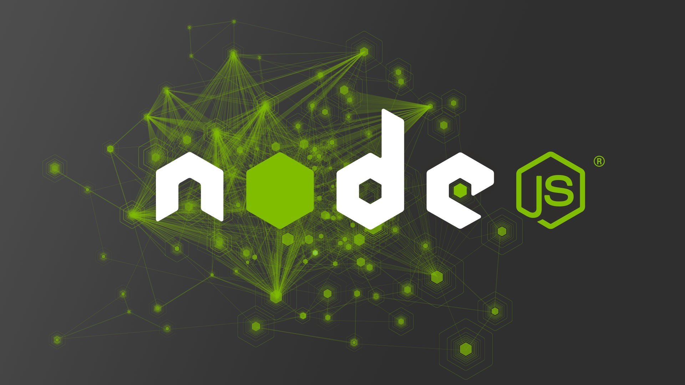
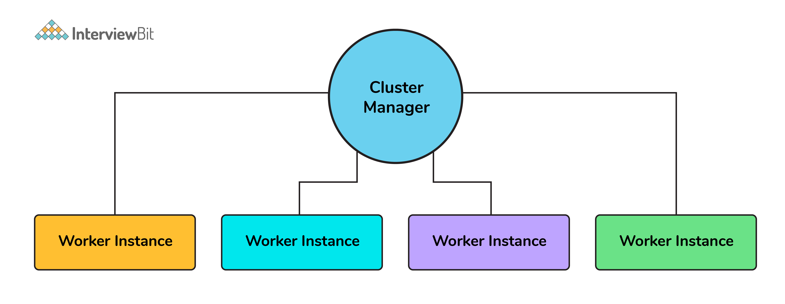
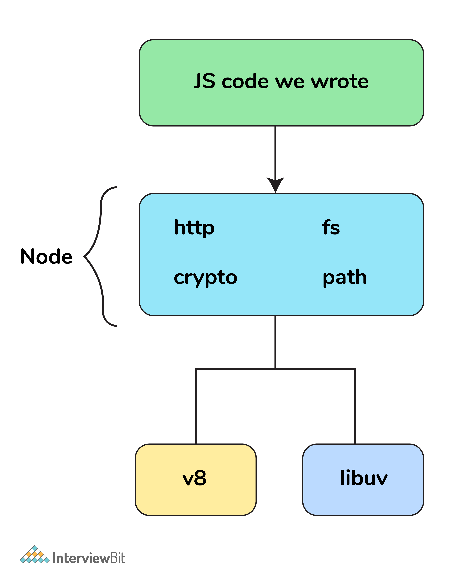

# Câu hỏi phỏng vấn Node.js



## Node.js là gì

Nodejs là một nền tảng được xây dựng, vận hành tại V8 JavaScript runtime của Chrome. Với Nodejs, bạn có thể chạy JavaScript trên server và thể xây dựng, phát triển các ứng dụng mạng nhanh chóng và dễ dàng.

Nền tảng này bắt đầu được xây dựng, phát triển tại California từ năm 2009 với phần core phía dưới được lập trình bằng C++ gần như 100%. Điều này tạo nên ưu thế về tốc độ xử lý cũng như hiệu năng của nền tảng này. Đến nay, Nodejs vẫn đang "gây bão" trong cộng đồng công nghệ bởi khả năng phát triển ứng dụng vượt trội.

## Mục lục

[1. First class function là gì?](#1-first-class-function-l%C3%A0-g%C3%AC)

[2. Node.js hoạt động thế nào?](#2-nodejs-ho%E1%BA%A1t-%C4%91%E1%BB%99ng-th%E1%BA%BF-n%C3%A0o)

[3. Quản lý package trong ứng dụng Node.js?](#3-qu%E1%BA%A3n-l%C3%BD-package-trong-%E1%BB%A9ng-d%E1%BB%A5ng-nodejs)

[4. Node.js có tốt hơn các framework khác?](#4-nodejs-c%C3%B3-t%E1%BB%91t-h%C6%A1n-c%C3%A1c-framework-kh%C3%A1c)

[5. Các bước để luồng điều khiển kiểm soát các lệnh gọi hàm?](#5-c%C3%A1c-b%C6%B0%E1%BB%9Bc-%C4%91%E1%BB%83-lu%E1%BB%93ng-%C4%91i%E1%BB%81u-khi%E1%BB%83n-ki%E1%BB%83m-so%C3%A1t-c%C3%A1c-l%E1%BB%87nh-g%E1%BB%8Di-h%C3%A0m)

[6. Các tính năng thời gian của Node.js?](#6-c%C3%A1c-t%C3%ADnh-n%C4%83ng-th%E1%BB%9Di-gian-c%E1%BB%A7a-nodejs)

[7. Ưu điểm của promise so với callback?](#7-%C6%B0u-%C4%91i%E1%BB%83m-c%E1%BB%A7a-promise-so-v%E1%BB%9Bi-callback)

[8. fork trong Node.js là gì?](#8-fork-trong-nodejs-l%C3%A0-g%C3%AC)

[9. Tại sao Node.js lại là đơn luồng?](#9-t%E1%BA%A1i-sao-nodejs-l%E1%BA%A1i-l%C3%A0-%C4%91%C6%A1n-lu%E1%BB%93ng)

[10. Tạo ứng dụng hello world với node.js?](#10-t%E1%BA%A1o-%E1%BB%A9ng-d%E1%BB%A5ng-hello-world-v%E1%BB%9Bi-nodejs)

[11. Các kiểu hàm API trong node.js?](#11-c%C3%A1c-ki%E1%BB%83u-h%C3%A0m-api-trong-nodejs)

[12. REPL là gì?](#12-repl-l%C3%A0-g%C3%AC)

[13. Sự khác biệt giữa bất đồng bộ và non-blocking?](#13-s%E1%BB%B1-kh%C3%A1c-bi%E1%BB%87t-gi%E1%BB%AFa-b%E1%BA%A5t-%C4%91%E1%BB%93ng-b%E1%BB%99-v%C3%A0-non-blocking)

[14. Ý nghĩa của module.exports?](#14-%C3%BD-ngh%C4%A9a-c%E1%BB%A7a-moduleexports)

[15. Công cụ dùng để đảm bảo code style nhất quán?](#15-c%C3%B4ng-c%E1%BB%A5-d%C3%B9ng-%C4%91%E1%BB%83-%C4%91%E1%BA%A3m-b%E1%BA%A3o-code-style-nh%E1%BA%A5t-qu%C3%A1n)

[16. Callback hell là gì?](#16-callback-hell-l%C3%A0-g%C3%AC)

[17. Event-Loop trong Node.js là gì?](#17-event-loop-trong-nodejs-l%C3%A0-g%C3%AC)

[18. Nếu node.js đơn luồng thì nó xử lý đồng thời như thế nào?](#18-n%E1%BA%BFu-nodejs-%C4%91%C6%A1n-lu%E1%BB%93ng-th%C3%AC-n%C3%B3-x%E1%BB%AD-l%C3%BD-%C4%91%E1%BB%93ng-th%E1%BB%9Di-nh%C6%B0-th%E1%BA%BF-n%C3%A0o)

[19. Sự khác biệt giữa process.nextTick() và setImmediate()?](#19-s%E1%BB%B1-kh%C3%A1c-bi%E1%BB%87t-gi%E1%BB%AFa-processnexttick-v%C3%A0-setimmediate)

[20. Nodejs giải quyết vấn đề block I/O như thế nào?](#20-nodejs-gi%E1%BA%A3i-quy%E1%BA%BFt-v%E1%BA%A5n-%C4%91%E1%BB%81-block-io-nh%C6%B0-th%E1%BA%BF-n%C3%A0o)

[21. Sử dụng async await trong Node.js?](#21-s%E1%BB%AD-d%E1%BB%A5ng-async-await-trong-nodejs)

[22. Node.js stream là gì?](#22-nodejs-stream-l%C3%A0-g%C3%AC)

[23. Buffers trong node.js?](#23-buffers-trong-nodejs)

[24. Middleware là gì?](#24-middleware-l%C3%A0-g%C3%AC)

[25. Giải thích Reactor Pattern trong Nodejs?](#25-gi%E1%BA%A3i-th%C3%ADch-reactor-pattern-trong-nodejs)

[26. Tại sao tách biệt app và server trong Express?](#26-t%E1%BA%A1i-sao-t%C3%A1ch-bi%E1%BB%87t-app-v%C3%A0-server-trong-express)

[27. Tại sao Nodejs lại dùng V8 Engine?](#27-t%E1%BA%A1i-sao-nodejs-l%E1%BA%A1i-d%C3%B9ng-v8-engine)

[28. Thoát mã trong Node.js?](#28-tho%C3%A1t-m%C3%A3-trong-nodejs)

[29. Giải thích khái niệm stub trong Nodejs?](#29-gi%E1%BA%A3i-th%C3%ADch-kh%C3%A1i-ni%E1%BB%87m-stub-trong-nodejs)

[30. Even Emitter trong Nodejs là gì?](#30-even-emitter-trong-nodejs-l%C3%A0-g%C3%AC)

[31. Tăng cường hiệu suất Node.js thông qua phân cluster?](#31-t%C4%83ng-c%C6%B0%E1%BB%9Dng-hi%E1%BB%87u-su%E1%BA%A5t-nodejs-th%C3%B4ng-qua-ph%C3%A2n-cluster)

[32. Thread pool là gì?](#32-thread-pool-l%C3%A0-g%C3%AC)

[33. WASI là gì?](#33-wasi-l%C3%A0-g%C3%AC)

[34. Các luồng worker khác gì với cluster?](#34-c%C3%A1c-lu%E1%BB%93ng-worker-kh%C3%A1c-g%C3%AC-v%E1%BB%9Bi-cluster)

[35. Làm thế nào để đo thời gian của các hoạt động không đồng bộ?](#35-l%C3%A0m-th%E1%BA%BF-n%C3%A0o-%C4%91%E1%BB%83-%C4%91o-th%E1%BB%9Di-gian-c%E1%BB%A7a-c%C3%A1c-ho%E1%BA%A1t-%C4%91%E1%BB%99ng-kh%C3%B4ng-%C4%91%E1%BB%93ng-b%E1%BB%99)

[36. Làm thế nào để đo lường hiệu suất của các hoạt động không đồng bộ?](#36-l%C3%A0m-th%E1%BA%BF-n%C3%A0o-%C4%91%E1%BB%83-%C4%91o-l%C6%B0%E1%BB%9Dng-hi%E1%BB%87u-su%E1%BA%A5t-c%E1%BB%A7a-c%C3%A1c-ho%E1%BA%A1t-%C4%91%E1%BB%99ng-kh%C3%B4ng-%C4%91%E1%BB%93ng-b%E1%BB%99)

## Câu hỏi phỏng vấn Node.js cho Fresher

### 1. First class function là gì?

First class function hay hàm hạng nhất là khi một hàm được sử dụng như một biến (được gán, truyền như tham số hay trả về). Có nhiều ngôn ngữ lập trình như Scala, Haskell, và JavaScript... đều có hàm hạng nhất.
Các hàm này có thể truyền dưới dạng tham số hay trả về cho một hàm khác gọi là HOC(high-order function).

Các hàm `map()` và `filter()` là các HOC phổ biến được dùng.

### 2. Node.js hoạt động thế nào?

Node hoàn toàn theo cơ chế event-driven. Về cơ bản server bao gồm một luồng duy nhất xử lý từ sự kiện này đến sự kiện khác.

Một yêu cầu mới đến là một loại sự kiện. Server bắt đầu xử lý nó và khi có hoạt động blocking IO, nó sẽ không đợi cho đến khi hoàn thành mà thay vào đó sẽ đăng ký một hàm callback. Sau đó, server ngay lập tức bắt đầu xử lý một sự kiện khác (có thể là một yêu cầu khác). Khi hoạt động IO kết thúc, đó là một loại sự kiện khác và server sẽ xử lý nó (tức là tiếp tục làm việc theo yêu cầu) bằng cách thực hiện lệnh callback ngay khi có thời gian.

Vì vậy, server không bao giờ cần tạo thêm các luồng hoặc chuyển đổi giữa các luồng, có nghĩa là nó có rất ít chi phí. Nếu bạn muốn sử dụng đầy đủ nhiều lõi phần cứng, bạn chỉ cần bắt đầu nhiều đối tượng node.js

Nền tảng Node.js không tuân theo mô hình đa luồng. Mà nó theo mô hình đơn luồng với Event Loop. Mô hình xử lý trong Node.js chủ yếu dựa trên mô hình JavaScript Event và cơ chế callback.

Các bước trong mô hình xử lý đơn luồng với Event Loop:
- Client gửi yêu cầu đến web server.
- Web server Node.js duy trì một Thread pool để cung cấp dịch vụ cho các yêu cầu từ client.
- Node.js nhận các yêu cầu này và đặt nó vào một hàng đợi. Gọi là Event Queue.
- Trong Nodejs có một thành phần là Event Loop. Nó sử dụng một vòng lặp để nhận yêu cầu và xử lý chúng.
- Event Loop sử dụng một luồng duy nhất. Nó được gọi là trái tim của Node.js
- Event Loop kiểm tra yêu cầu có ở trong Event Queue. Nếu khong nó sẽ đợi cho đến khi yêu cầu đến.
- Nếu có, nó lấy yêu cầu từ Event Queue:
    - Nó bắt đầu xử lý yêu cầu đó.
    - Nếu yêu cầu đó không phải là blocking IO, thì nó xử lý và chuẩn bị phản hồi để gửi về client.
    - Nếu nó cần vài thao tác blocking IO như tương tác với cơ sở dữ liệu, hệ thống file, mạng thì nó sẽ có cách tiếp cận khác:
        + Kiểm tra luồng khả dụng từ Thread Pool
        + Chọn luồng và gán nó cho yêu cầu client.
        + Các luồng này nhận yêu cầu và xử lý chúng thực hiện hành động blocking IO, chuẩn bị phản hồi và gửi nó về Event Loop.
        + Event Loop lấy nó và gửi phản hồi đó về lại client.
    
### 3. Quản lý package trong ứng dụng Node.js?

Khi thảo luận về Node js thì một điều chắc chắn không nên bỏ qua là xây dựng package quản lý sử dụng các công cụ NPM mà mặc định với mọi cài đặt Node js. Ý tưởng của mô-đun NPM là khá tương tự như Ruby-Gems: một tập hợp các hàm có sẵn có thể sử dụng được, thành phần tái sử dụng, tập hợp các cài đặt dễ dàng thông qua kho lưu trữ trực tuyến với các phiên bản quản lý khác nhau. Bên cạnh npm cũng có thể sử dụng yarn với bộ chức năng tương tự.

### 4. Node.js có tốt hơn các framework khác?

- **Bất đồng bộ**: Đặc điểm đầu tiên của Nodejs là tính bất đồng bộ. Node.js không cần đợi API trả dữ liệu về, vậy nên mọi APIs nằm trong thư viện Node.js đều không được đồng bộ, hiểu đơn giản là chúng không hề blocking (khóa). Server có cơ chế riêng để gửi thông báo và nhận phản hồi về các hoạt động của Node.js và API đã gọi.
- **Tốc độ nhanh**: Với phần core phía dưới lập trình gần như toàn bộ bằng ngôn ngữ C++, kết hợp với V8 Javascript Engine mà Google Chrome cung cấp, tốc độ vận hành, thực hiện code của thư viện Node.js diễn ra rất nhanh.
- **Đơn giản/Hiệu quả**: Tiến trình vận hành của Node.js đơn giản song lại mang đến hiệu năng cao nhờ ứng dụng mô hình single thread và các sự kiện lặp. Một loạt cơ chế sự kiện cho phép server trả về phản hồi bằng cách không block, đồng thời tăng hiệu quả sử dụng. Các luồng đơn cung cấp dịch vụ cho nhiều request hơn hẳn Server truyền thống.
- **Không đệm**: Nền tảng Node.js không có vùng đệm, tức không cung cấp khả năng lưu trữ dữ liệu buffer.
- **Có giấy phép**: Đây là nền tảng đã được cấp giấy phép, phát hành dựa trên MIT License.
### 5. Các bước để luồng điều khiển kiểm soát các lệnh gọi hàm?

- Kiểm soát trật tự thực thi
- Thu thập dữ liệu
- Giới hạn đồng thời
- Gọi bước sau trong chương trình.

### 6. Các tính năng thời gian của Node.js?

Các hàm Set Timer:
- `setImmediate()` : chạy ngay lập tức (thực ra nó sẽ chạy ở lần lặp tiếp theo trong event loop)
- `setTimeout()` : chạy trong một khoảng thời gian.
- `setInterval()`: lặp đi lặp lại trong khoảng thời gian

Các hàm Clear timer
- `clearImmediate()` : dừng một đối tượng setImmediate, tạo bởi hàm setImmediate()
- `clearTimeout()` : dừng một đối tượng setTimeout, tạo bởi hàm setTimeout()
- `clearInterval()` : dừng một đối tượng setInterval, tạo bởi hàm setInterval()

### 7. Ưu điểm của promise so với callback?

Ưu điểm chính của việc sử dụng **promise** là bạn có được một đối tượng để quyết định hành động cần được thực hiện sau khi tác vụ bất đồng bộ hoàn thành. Điều này cung cấp cod dễ quản lý hơn và tránh callback hell.

### 8. fork trong Node.js là gì?

Một fork dùng cho tạo các tiến trình con. Trong nodejs, nó được dùng để tạo thực thể mới của v8 để chạy nhiều worker cho thực thi code.

### 9. Tại sao Node.js lại là đơn luồng?

Node.js được tạo rõ ràng như một thử nghiệm trong xử lý bất đồng bộ. Lý thuyết là thực hiện xử lý bất đồng bộ trên một luồng duy nhất có thể cung cấp hiệu suất và khả năng mở rộng cao hơn so với các triển khai đa luồng truyền thống.

Một ứng dụng node.js không hoạt động chuyên sâu về CPU có thể chạy hàng nghìn kết nối đồng thời tốt hơn Apache hoặc IIS hoặc các máy chủ đa luồng khác.

### 10. Tạo ứng dụng hello world với node.js?

```js
var http = require("http");
http.createServer(function (request, response) {
    response.writeHead(200, {'Content-Type': 'text/plain'});
    response.end('Hello World\n');
}).listen(3000);
```

### 11. Các kiểu hàm API trong node.js?

Có hai kiểu hàm API:
- Hàm bất đồng bộ, non-blocking: sử dụng chủ yếu cho các hoạt động I/O có thể tách ra khỏi vòng lặp chính.
- Hàm đồng bộ, blocking: sử dụng cho các hoạt động ảnh hưởng đến tiến trình đang chạy trong vòng lặp chính.

**Hàm blocking** trong các thao tác blocking, tất cả code khác sẽ bị ngăn khi cho đến khi thực hiện xong thao tác IO. Vd:

```js
const fs = require('fs');
const data = fs.readFileSync('/file.md'); // blocks here until file is read
console.log(data);
// moreWork(); will run after console.log
```

Dòng code thứ hai chặn việc thực thi JavaScript bổ sung cho đến khi toàn bộ file được đọc. `moreWork()` sẽ chỉ được gọi sau `console.log`.

**Hàm non-blocking** trong các thao tác non-blocking, nhiều lệnh gọi IO có thể thực hiện mà chương trình không bị tạm dừng. Vd:

```js
const fs = require('fs');
fs.readFile('/file.md', (err, data) => {
  if (err) throw err;
  console.log(data);
});
// moreWork(); will run before console.log
```

Vì `fs.readFile()` là không chặn, `moreWork()` không phải đợi file đọc xong trước khi được gọi.

### 12. REPL là gì?

REPL là từ viết tắt của Read Eval Print Loop (hiểu nôm na là: Đọc – Đánh giá – In – Lặp) và nó biểu diễn môi trường máy tính như màn hình console trong Linux shell nơi bạn có thể gõ các dòng lệnh và hệ thống sẽ trả về các kết quả. NodeJS cũng có môi trường REPL. Nó để thực hiện các tác vụ mong muốn:

**Read**: Đọc các thông tin input của người dùng, chuyển đổi thành các dữ liệu Javascript và lưu trữ trong bộ nhớ.

**Eval**: Đánh giá các cấu trúc dữ liệu này.

**Print**: In các kết quả.

**Loop**: Lặp các dòng lệnh đến khi người dùng gõ ctrl-c hai lần.

### 13. Sự khác biệt giữa bất đồng bộ và non-blocking?

- **Bất đồng bộ:** Kiến trúc của bất đồng bộ giải thích rằng thông điệp được gửi sẽ không trả lời ngay lập tức giống như chúng ta gửi mail nhưng không nhận được trả lời ngay lập tức. Nó không có bất kỳ sự phụ thuộc hay thứ tự nào. Do đó cải thiện hiệu quả và hiệu suất của hệ thống. Server lưu trữ thông tin và khi hành động được thực hiện, nó sẽ được thông báo.
- **Non-blocking:** Non-blocking phản hồi ngay lập tức với bất kỳ dữ liệu nào có sẵn. Hơn nữa, nó không chặn bất kỳ quá trình thực thi nào và tiếp tục chạy từng yêu cầu. Nếu một câu trả lời không thể được truy xuất hơn trong những trường hợp đó, API trả về ngay lập tức với một lỗi. Tính năng non-block hầu hết được sử dụng với I/O (input/output). Bản thân Node.js dựa trên mô hình I/O non-blocking. Hàm callback sẽ được gọi khi hoạt động hoàn thành. Lệnh gọi non-blocking sử dụng sự trợ giúp của javascript cung cấp chức năng callback.

| Bất đồng bộ | Non-blocking |
|-|-|
| Bất đồng bộ không phản hồi ngay lập tức | Non-blocing phản hồi ngay lập tức nếu dữ liệu khả dụng còn không nó sẽ trả về lỗi |
| Bất đồng bộ cải thiện hiệu quả bằng cách thực hiện tác vụ nhanh chóng vì phản hồi có thể đến sau đó, trong lúc đó có thể hoàn thành các tác vụ khác | Non-blocking không chặn bất kỳ quá trình thực thi nào và nếu dữ liệu có sẵn, nó sẽ truy xuất thông tin một cách nhanh chóng |
| Là đối nghịch của đồng bộ | Là đối nghịch của blocking IO |

### 14. Ý nghĩa của module.exports?

Được sử dụng để hiển thị các chức năng của một module hoặc file cụ thể sẽ được sử dụng ở những nơi khác trong dự án. Nó có thể được sử dụng để đóng gói tất cả các chức năng tương tự trong một file giúp cải thiện cấu trúc dự án.

Ví dụ:

```js
const getSolutionInJavaScript = async ({
    problem_id
}) => {
...
};
const getSolutionInPython = async ({
    problem_id
}) => {
    ...
};
module.exports = { getSolutionInJavaScript, getSolutionInPython }
```

Bây giờ ta có thể sử dụng lại các hàm trên ở file khác:

```js
const { getSolutionInJavaScript, getSolutionInPython} = require("./utils")
```

### 15. Công cụ dùng để đảm bảo code style nhất quán?

ESLint có thể dùng với bất kỳ IDE nào để đảm bảo code style nhất quán cho duy trì codebase trong tương lai.

### 16. Callback hell là gì?

Callback hell là một hiện tượng ảnh hưởng đến nhà phát triển JavaScript khi cố gắng thực thi nhiều hoạt động bất đồng bộ lần lượt.

Một hàm bất đồng bộ là một hàm trong đó một số hoạt động bên ngoài phải hoàn thành trước khi kết quả có thể được xử lý; nó là "bất đồng bộ" theo nghĩa là có một khoảng thời gian không thể đoán trước trước khi có kết quả. Các hàm như vậy yêu cầu một hàm callback để xử lý lỗi và xử lý kết quả.

```js
getData(function(a){
    getMoreData(a, function(b){
        getMoreData(b, function(c){ 
            getMoreData(c, function(d){ 
	            getMoreData(d, function(e){ 
		            ...
		        });
	        });
        });
    });
});
```

Cách tránh callback hell
- Dùng async từ npm
- Dùng promise
- Dùng async-await

### 17. Event-Loop trong Node.js là gì?

Event loop  là thứ cho phép Node.js thực hiện các hoạt động I/O non-blocking - mặc dù thực tế là JavaScript là đơn luồng - bằng cách giảm tải các hoạt động cho nhân hệ thống bất cứ khi nào có thể.

Node.js là ứng dụng đơn luồng, nhưng hỗ trợ đồng thời thông qua khái niệm **event** và **callbacks**. Tất cả API của Node.js là bất đồng bộ và đơn luồng, ta sử dụng hàm async để duy trì tính đồng thời. Node sử dụng observer pattern. Luồng node giữ một event loop và bất cứ khi nào một tác vụ được hoàn thành, nó sẽ kích hoạt sự kiện tương ứng để báo hiệu cho hàm listener-event thực thi.

#### Lập trình event-driven

Trong ứng dụng event-driven, nó là vòng lặp chính cho lắng nghe tất cả sự kiện sau đó kích hoạt một hàm callback khi một sự kiện được phát hiện.

Mặc dù các sự kiện trông khá giống với các hàm callback, sự khác biệt nằm ở chỗ các hàm callback được gọi khi một hàm bất đồng bộ trả về kết quả của nó, trong khi việc xử lý sự kiện hoạt động trên observer pattern. Các hàm lắng nghe các sự kiện hoạt động như các Observers. Bất cứ khi nào một sự kiện được kích hoạt, hàm listener của nó sẽ bắt đầu thực thi. Node.js có nhiều sự kiện có sẵn thông qua module sự kiện và lớp EventEmitter được sử dụng để liên kết sự kiện và event-listeners như sau:

```js
// Import events module
var events = require('events');

// Create an eventEmitter object
var eventEmitter = new events.EventEmitter();
```

Ví dụ:

```js
// Import events module
var events = require('events');

// Create an eventEmitter object
var eventEmitter = new events.EventEmitter();

// Create an event handler as follows
var connectHandler = function connected() {
   console.log('connection succesful.');
  
   // Fire the data_received event 
   eventEmitter.emit('data_received');
}

// Bind the connection event with the handler
eventEmitter.on('connection', connectHandler);
 
// Bind the data_received event with the anonymous function
eventEmitter.on('data_received', function() {
   console.log('data received succesfully.');
});

// Fire the connection event 
eventEmitter.emit('connection');

console.log("Program Ended.");
```

### 18. Nếu node.js đơn luồng thì nó xử lý đồng thời như thế nào?

Ví dụ:

```js
const crypto = require("crypto");
const start = Date.now();
function logHashTime() {
    crypto.pbkdf2("a", "b", 100000, 512, "sha512", () => {
        console.log("Hash: ", Date.now() - start);
    });
}
logHashTime();
logHashTime();
logHashTime();
logHashTime();
```

Kết quả là:

```text
Hash: 1213
Hash: 1225
Hash: 1212
Hash: 1222
```

Khi cần xử lý đồng thời, thư viện libuv trong node.js sẽ dùng thread pool để tạo thêm luồng cho xử lý đồng thời như vậy. 

### 19. Sự khác biệt giữa process.nextTick() và setImmediate()?

Cả hai đều dùng để chuyển sang chế độ bất đồng bộ bởi hàm listener.

**process.nextTick()** đặt calblack cho thực thi còn **setImmediate** đẩy callback vào hàng đợi để thực thi. Vì vậy event-loop sẽ chạy như sau.

**`timers–>pending callbacks–>idle,prepare–>connections(poll,data,etc)–>check–>close callbacks`**

Ở phương thức process.nextTick() này, thêm hàm callback để bắt đầu ở event queue kế tiếp, còn phương thức setImmediate() đặt hàm vào giai đoạn kiểm tra của event queue kế tiếp.

### 20. Nodejs giải quyết vấn đề block I/O như thế nào?

Vì node có event loop có thể dùng cho tất cả hoạt động I/O bật đồng bộ mà không cần blocking ở hàm chính.

Ví dụ: nếu một cuộc gọi mạng xảy ra, nó sẽ được lập lịch trong event loop thay vì luồng chính. Nếu có nhiều lệnh gọi I/O như vậy, mỗi lệnh gọi sẽ được xếp vào hàng đợi tương ứng để thực thi.

Vì vậy, ngay cả khi đơn luồng các hoạt động I/O vẫn được xử lý theo cách non-blocking.

### 21. Sử dụng async await trong Node.js?

```js
// this code is to retry with exponential backoff
function wait (timeout) {
    return new Promise((resolve) => {
        setTimeout(() => {
            resolve()
        }, timeout);
    });
}

async function requestWithRetry (url) {
    const MAX_RETRIES = 10;
    for (let i = 0; i <= MAX_RETRIES; i++) {
        try {
            return await request(url);
        } catch (err) {
            const timeout = Math.pow(2, i);
            console.log('Waiting', timeout, 'ms');
            await wait(timeout);
            console.log('Retrying', err.message, i);
        }
    }
}
```

### 22. Node.js stream là gì?

Stream là một thực thể của EventEmitter, có thể dùng cho dữ liệu streaming trong Node.js. Nó có thể dùng để xử lý và quản lý các file streaming lớn như video, mp3, ... qua mạng. Nó sử dụng buffers như bộ lưu trữ tạm thời.

Nó có 4 kiểu chính là:

- **Writable**: streams cho phép ghi dữ liệu (ví dụ: `fs.createWriteStream()`).
- **Readable**: streams cho phép đọc dữ liệu (ví dụ: `fs.createReadStream()`).
- **Duplex**: streams là kết hợp của cả Readable và Writable (ví dụ `net.Socket`).
- **Transform**: là stream Duplex có thể chỉnh sửa hoặc chuyển đổi dữ liệu khi nó được ghi hay đọc (ví dụ `zlib.createDeflate()`).

### 23. Buffers trong node.js?

Buffer là một vùng lưu trữ tạm thời chứa các dữ liệu đang được chuyển từ nơi này đến nơi khác. Buffer có kích thước xác định và giới hạn. Kích thước của buffer được xác định bằng những thuật toán cho từng trường hợp cụ thể. Buffer là một kỹ thuật được phát triển nhằm ngăn chặn sự tắc nghẽn dữ liệu khi truyền từ nơi này đến nơi khác.

Buffer là một class trong Node.js API dùng để giao tiếp với các dữ liệu nhị phân. Buffer class đã được khai báo trong phạm vi global trong các phiên bản Node.js sau này, nên chúng ta không cần phải `require('buffer')` để sử dụng. 

### 24. Middleware là gì?

Middleware nằm giữa request và logic nghiệp vụ. Nó được dùng để ghi log, giới hạn truy cập, định tuyến, xác thực hay bất cứ điều gì không phải là một phần của logic nghiệp vụ. Ngoài ra third-party middleware chẳng hạn như body-parser có thể viết middleware của riêng mình cho một trường hợp cụ thể.

## Câu hỏi phỏng vấn Node.js cho Experienced

### 25. Giải thích Reactor Pattern trong Nodejs?

Reactor Pattern là một ý tưởng về các hoạt động I/O non-blocking trong Node.js. Ơattern này cung cấp một trình xử lý (handler), với Node.js là một hàm callback, được liên kết với mỗi thao tác I/O. Khi một yêu cầu I/O được tạo, nó sẽ được gửi đến bộ phân kênh (demultiplexer).

Bộ phân kênh này là một interface thông báo được sử dụng để xử lý đồng thời trong chế độ I/O non-blocking và thu thập mọi yêu cầu dưới dạng sự kiện và xếp từng sự kiện vào một hàng đợi. Do đó, bộ phân kênh cung cấp Event Queue, mà chúng ta thường nghe. Khi một yêu cầu được thu thập bởi bộ phân kênh, nó sẽ trả lại quyền điều khiển cho hệ thống và không chặn I/O. Đồng thời, có Event Loop lặp lại các mục trong Event Queue. Mọi sự kiện đều có một hàm callback được liên kết với nó và hàm callback đó được gọi khi Event Loop lặp lại.

Ngoài ra, hàm callback chủ yếu có các lệnh callback khác được liên kết bên trong đại diện cho một số hoạt động bất đồng bộ. Các hoạt động này được chèn vào Event Queue bởi bộ phân kênh và sẵn sàng được xử lý khi Event Loop lặp lại chúng. Đó là lý do tại sao các cuộc gọi đến các hoạt động khác phải bất đồng bộ.

Khi tất cả các mục trong Event Queue được xử lý và không còn hoạt động nào đang chờ xử lý, Node.js sẽ tự động dừng ứng dụng.


1. Ứng dụng tạo hoạt động I/O mới bằng cách gửi yêu cầu đến Event Demultiplexer. Ứng dụng cũng chỉ định một trình xử lý (handler), trình xử lý này sẽ được gọi khi hoạt động hoàn tất. Gửi một yêu cầu mới đến Event Demultiplexer là một lời gọi non-blocking và ngay lập tức trả lại quyền điều khiển cho ứng dụng.
2. Khi một tập hợp các thao tác I/O hoàn tất, Event Demultiplexer sẽ đẩy các sự kiện mới vào Event Queue.
3. Tại thời điểm này, Event Loop lặp lại các mục của Event Queue.
4. Đối với mỗi sự kiện, trình xử lý liên quan được gọi.
5. Trình xử lý, là một phần của code ứng dụng, sẽ cung cấp lại quyền điều khiển cho Event Loop khi quá trình thực thi của nó hoàn tất (5a). Tuy nhiên, các hoạt động bất đồng bộ mới có thể được yêu cầu trong quá trình thực thi trình xử lý (5b), khiến các hoạt động mới được chèn vào Event Demultiplexer (1), trước khi điều khiển được đưa trở lại Event Loop.
6. Khi tất cả các mục trong Event Queue được xử lý, vòng lặp sẽ chặn lại trên Event Demultiplexer, sau đó sẽ kích hoạt một chu kỳ khác.

### 26. Tại sao tách biệt app và server trong Express?

Server có trách nhiệm khởi tạo routes, middleware và các logic ứng dụng khác trong khi đó app là tất cả logic nghiệp vụ để phục vụ các routes của server. Điều này đảm bảo rằng các logic nghiệp vụ sẽ được đóng gói và phân tách với logic ứng dụng giúp dự án dễ đọc và bảo trì.

### 27. Tại sao Nodejs lại dùng V8 Engine?

Thực tế, ta có nhiều hơn một lựa chọn về Javascript Engine chẳng hạn như Spidermonkey từ Firefox, Chakra từ Edge nhưng V8 của Google là phiên bản phát triển nhất (vì nó là mã nguồn mở nên có một cộng đồng lớn giúp phát triển các tính năng và sửa lỗi) và nhanh nhất (vì nó được viết bằng c ++). Cho đến hiện tại nó như một  JavaScript Engine và WebAssembly. 

### 28. Thoát mã trong Node.js?

Thoát mã (exit code) cung cấp ý tưởng về cách tạm dừng hay huỷ chương trình.

Một vài thoát mã:
- Uncaught fatal exception - (code - 1) - Đã có một ngoại lệ không được xử lý
- Unused - (code - 2) - Cái này được đặt trước bởi bash
- Fatal Error - (code - 5) - Đã xảy ra lỗi trong V8 với đầu ra stderr của mô tả
- Internal Exception handler Run-time failure - (code - 7) - Đã có một ngoại lệ khi hàm khởi động được gọi
- Internal JavaScript Evaluation Failure - (code - 4) - Đã có một ngoại lệ khi quá trình khởi động không thể trả về giá trị hàm khi được đánh giá.

### 29. Giải thích khái niệm stub trong Nodejs?

Theo dõi và xác minh cho các kiểm tra thử nghiệm node.js. Cho phép bạn xác thực và ghi đè hành vi của các đoạn code lồng nhau, chẳng hạn như phương thức, require() và npm  module hoặc thậm chí các thực thể của lớp. Thư viện này được lấy cảm hứng từ node-gently, MockJS và mock-require.

#### Tính năng của Stub:
- Tạo ra các đối tượng đơn giản, nhẹ có khả năng kéo dài xuống cây của chúng
- Tương thích với Nodejs
- Dễ dàng mở rộng trực tiếp hoặc thông qua ExtensionManager
- Đi kèm với các tiện ích mở rộng có thể sử dụng, được xác định trước

Stub là hàm/chương trình mô phỏng hành vi của các thành phần/module. Stubs cung cấp các câu trả lời soạn trước cho các lệnh gọi hàm được thực hiện trong các trường hợp thử nghiệm. 

Ví dụ:

```js
var fs = require('fs');

var readFileStub = sinon.stub(fs, 'readFile', function (path, cb) {  
  return cb(null, 'filecontent');
});

expect(readFileStub).to.be.called;  
readFileStub.restore();
```

### 30. Even Emitter trong Nodejs là gì?

EventEmitter là một lớp Node.js bao gồm tất cả các đối tượng về cơ bản có khả năng emitting ra các sự kiện. Điều này có thể được thực hiện bằng cách đính kèm các sự kiện đã đặt tên được emitt ra bởi đối tượng bằng cách sử dụng một hàm `eventEmitter.on()`. Vì vậy, bất cứ khi nào đối tượng này throw một sự kiện, các hàm kèm theo sẽ được gọi đồng bộ.

Ví dụ

```js
var events = require('events');
var eventEmitter = new events.EventEmitter();

// listener #1
var listner1 = function listner1() {
   console.log('listner1 executed.');
}

// listener #2
var listner2 = function listner2() {
   console.log('listner2 executed.');
}

// Bind the connection event with the listner1 function
eventEmitter.addListener('connection', listner1);

// Bind the connection event with the listner2 function
eventEmitter.on('connection', listner2);

var eventListeners = require('events').EventEmitter.listenerCount
   (eventEmitter,'connection');
console.log(eventListeners + " Listner(s) listening to connection event");

// Fire the connection event 
eventEmitter.emit('connection');

// Remove the binding of listner1 function
eventEmitter.removeListener('connection', listner1);
console.log("Listner1 will not listen now.");

// Fire the connection event 
eventEmitter.emit('connection');

eventListeners = require('events').EventEmitter.listenerCount(eventEmitter,'connection');
console.log(eventListeners + " Listner(s) listening to connection event");

console.log("Program Ended.");
```

Kết quả:

```
2 Listner(s) listening to connection event
listner1 executed.
listner2 executed.
Listner1 will not listen now.
listner2 executed.
1 Listner(s) listening to connection event
Program Ended.
```

### 31. Tăng cường hiệu suất Node.js thông qua phân cluster?

Các ứng dụng Node.js chạy trên một bộ xử lý duy nhất, có nghĩa là theo mặc định, chúng không tận dụng được hệ thống đa lõi. Chế độ cluster được sử dụng để khởi động nhiều tiến trình node.js do đó có nhiều phiên bản của event-loop. Khi chúng tôi bắt đầu sử dụng cluster trong một ứng dụng nodejs phía sau, nhiều tiến trình node.js được tạo ra nhưng cũng có một tiến trình mẹ được gọi là trình quản lý cluster chịu trách nhiệm theo dõi tình trạng của các phiên bản riêng lẻ trong ứng dụng của ta.



### 32. Thread pool là gì?

Thread pool được xử lý bởi thư viện libuv. libuv là thư viện C đa nền tảng, cung cấp hỗ trợ các hoạt động bất đồng bộ I/O như hệ thống file, mạng, đồng thời,...



### 33. WASI là gì?

Web assembly cung cấp triển khai đặc tả WebAssembly System Interface thông qua API WASI trong node.js được triển khai bằng cách sử dụng lớp WASI. Việc thêm lớp WASI được thực hiện bởi nó có thể sử dụng hệ điều hành cơ bản thông qua tập hợp các hàm giống như POSIX, do đó, cho phép ứng dụng sử dụng hiệu quả hơn các tài nguyên và các tính năng yêu cầu quyền truy cập cấp hệ thống.

### 34. Các luồng worker khác gì với cluster?

**Cluster**

- Có một tiến trình trên mỗi CPU với IPC để giao tiếp.
- Trong trường hợp muốn nhiều server chấp nhận yêu cầu HTTP thông qua cổng đơn, cluster có thể hữu ích.
- Các tiến trình được sinh từ mỗi CPU, do đó sẽ có bộ nhớ và thực thể node riêng biệt, dẫn đến các vấn đề về bộ nhớ.

**Worker Thread**

- Chỉ có một tiến trình trong nhiều luồng.
- Mỗi luồng có một thực thể node(một event-loop, một js-engine) với hầu hết API có thể truy cập.
- Chia sẻ bộ nhớ với các luồng khác (SharedArrayBuffer)
- Có thể được dùng cho các tác vụ đòi hỏi nhiều CPU như xử lý dữ liệu hoặc truy cập hệ thống file vì Node là đơn luồng, các tác vụ đồng bộ có thể thực hiện hiệu quả hơn nhờ worker của thread.

### 35. Làm thế nào để đo thời gian của các hoạt động không đồng bộ?

API Performance cung cấp cho chúng ta các công cụ để tìm ra các chỉ số hiệu suất cần thiết. Một ví dụ đơn giản sẽ là sử dụng `async_hooks` và `perf_hooks`

```js
'use strict';
const async_hooks = require('async_hooks');
const {
    performance,
    PerformanceObserver
} = require('perf_hooks');
const set = new Set();
const hook = async_hooks.createHook({
    init(id, type) {
        if (type === 'Timeout') {
            performance.mark(`Timeout-${id}-Init`);
            set.add(id);
        }
    },
    destroy(id) {
    if (set.has(id)) {
        set.delete(id);
        performance.mark(`Timeout-${id}-Destroy`);
        performance.measure(`Timeout-${id}`,
                            `Timeout-${id}-Init`,
                            `Timeout-${id}-Destroy`);
        }
    }
});
hook.enable();
const obs = new PerformanceObserver((list, observer) => {
    console.log(list.getEntries()[0]);
    performance.clearMarks();
    observer.disconnect();
});
obs.observe({ entryTypes: ['measure'], buffered: true });
setTimeout(() => {}, 1000);
```

Điều này sẽ cung cấp cho chúng ta thời gian chính xác để thực hiện lệnh callback.

### 36. Làm thế nào để đo lường hiệu suất của các hoạt động không đồng bộ?

API Perfomance cung cấp cho chúng tôi các công cụ để tìm ra các chỉ số hiệu suất cần thiết.

```js
const { PerformanceObserver, performance } = require('perf_hooks');
const obs = new PerformanceObserver((items) => {
    console.log(items.getEntries()[0].duration);
    performance.clearMarks();
});
obs.observe({ entryTypes: ['measure'] });
performance.measure('Start to Now');
performance.mark('A');
doSomeLongRunningProcess(() => {
    performance.measure('A to Now', 'A');
    performance.mark('B');
    performance.measure('A to B', 'A', 'B');
});
```