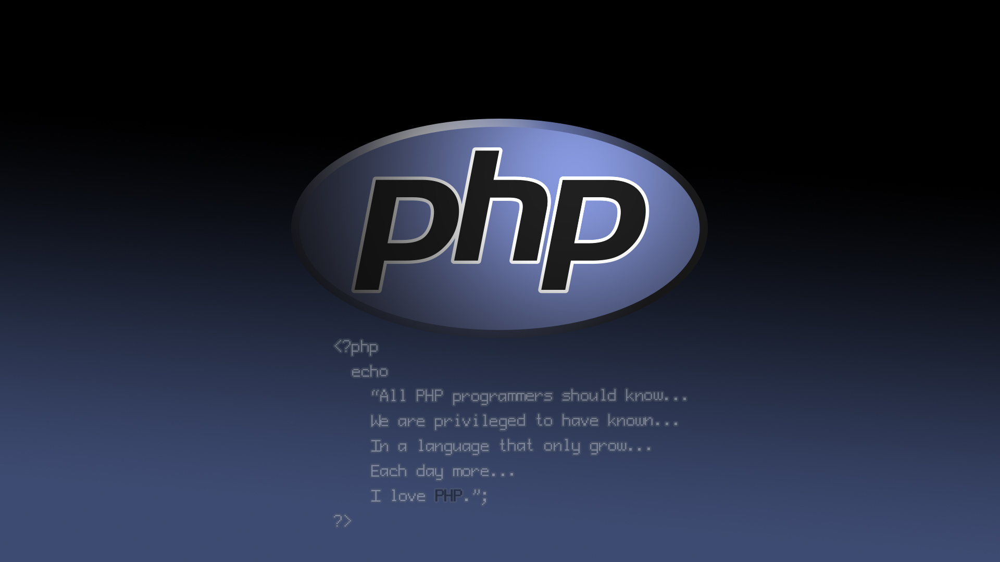
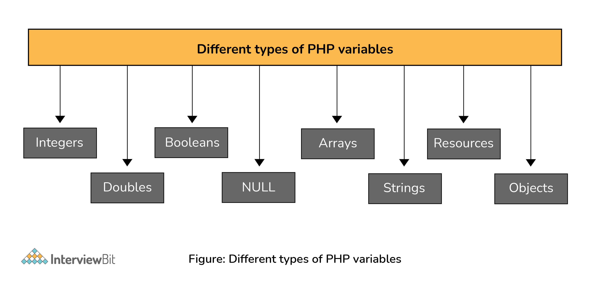
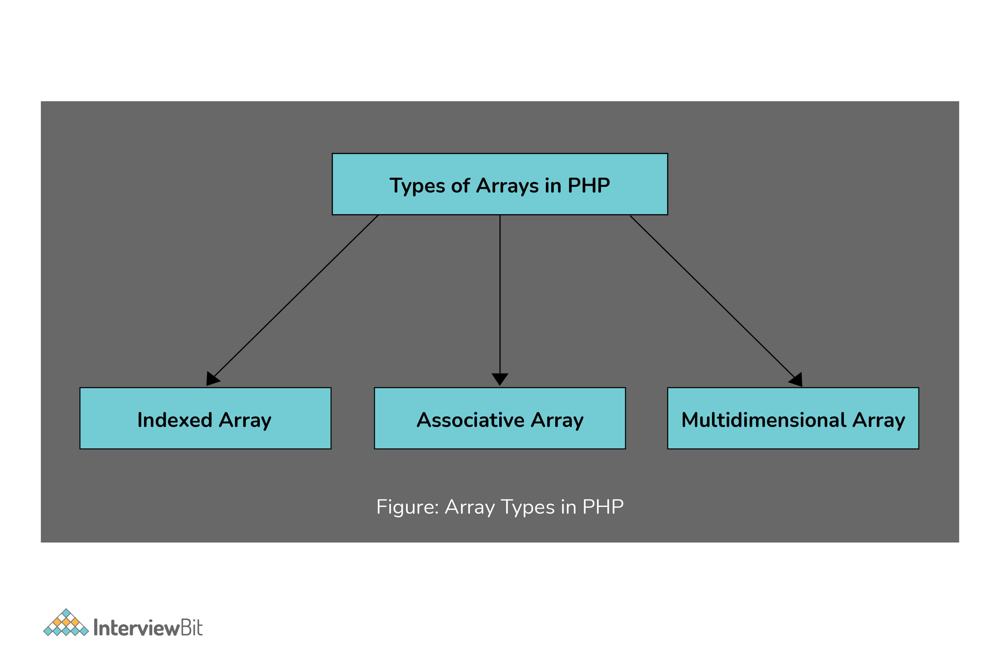
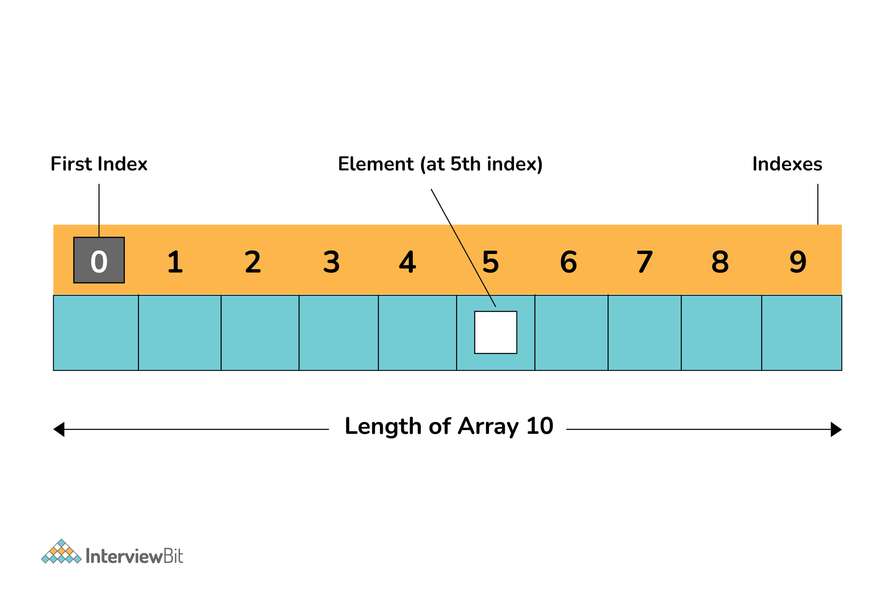
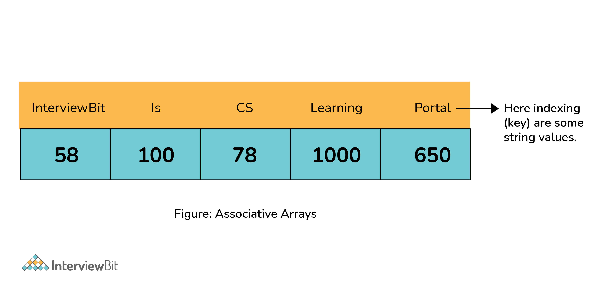
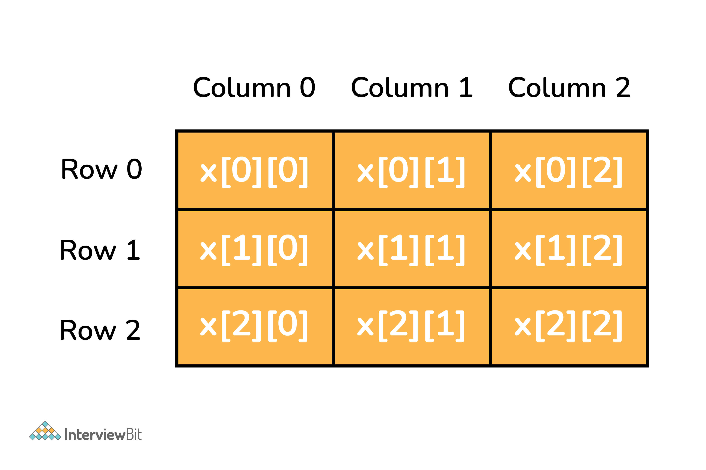
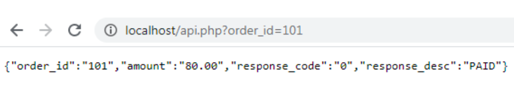

# Câu hỏi phỏng vấn PHP



## PHP là gì ?

PHP là viết tắt của PHP Hypertext Preprocessor là ngôn ngữ script server-side mã nguồn mở được sử dụng rộng rải cho thiết kế website động và API di động.

PHP hỗ trợ nhiều cơ sở dữ liệu như MySQL, Solid, PostgreSQL, Oracle, Sybase, ... Code PHP được nhúng trong HTML.

PHP cũng là ngôn ngữ cho xây dựng WordPress chiếm khoảng 80% website trên Internet.

## Tại sao lại học PHP

PHP không phải là ngôn ngữ script phía server duy nhất có sẵn – vẫn còn nhiều ngôn ngữ khác nữa. Tuy nhiên, nó có lợi thế hơn các đối thủ cạnh tranh nếu như bạn đang chạy trang web WordPress.

Như chúng tôi đã đề cập trước đó, WordPress được xây dựng dựa trên việc sử dụng PHP. Vì vậy sử dụng ngôn ngữ này giúp cải thiện đáng kể số lượng tùy chỉnh có thể có trên trang web. Bạn có thể sử dụng nó để sửa đổi plugins và themes có sẵn hoặc tự tạo plugin! Nếu bạn muốn trở thành nhà phát triển WordPress, bạn bắt buộc phải học PHP.

Nếu vẫn chưa bị thuyết phục, đây là một số lý do khác khiến PHP là ngôn ngữ script tuyệt vời để sử dụng:

* **Dễ học** – bạn có thể học dễ dàng vì nó có tài liệu tuyệt vời về các chức năng cùng các ví dụ.
* **Được sử dụng rộng rãi** – nó được sử dụng để tạo ra các loại nền tảng như thương mại điện tử, blogs, phương tiện truyền thông xã hội, v.v. Thống kê cho thấy 80% tất cả các trang web đều sử dụng PHP!
* **Chi phí thấp** – nó là nguồn mở để bạn có thể sử dụng miễn phí.
* **Cộng đồng lớn** – nếu gặp phải bất kỳ vấn đề nào với nó, bạn không phải lo lắng vì có rất nhiều blog PHP trên internet.

## Mục lục

[1. Sự khác biệt giữa biến và hằng trong PHP?](#1-s%E1%BB%B1-kh%C3%A1c-bi%E1%BB%87t-gi%E1%BB%AFa-bi%E1%BA%BFn-v%C3%A0-h%E1%BA%B1ng-trong-php)

[2. Session trong PHP là gì?](#2-session-trong-php-l%C3%A0-g%C3%AC)

[3. PEAR là gì?](#3-pear-l%C3%A0-g%C3%AC)

[4. Giải thích sự khác biệt giữa $message và $$message?](#4-gi%E1%BA%A3i-th%C3%ADch-s%E1%BB%B1-kh%C3%A1c-bi%E1%BB%87t-gi%E1%BB%AFa-message-v%C3%A0-message)

[5. PHP có phải là case-sensitive?](#5-php-c%C3%B3-ph%E1%BA%A3i-l%C3%A0-case-sensitive)

[6. Các kiểu dữ liệu trong PHP?](#6-c%C3%A1c-ki%E1%BB%83u-d%E1%BB%AF-li%E1%BB%87u-trong-php)

[7. Luật đặt tên biến trong PHP?](#7-lu%E1%BA%ADt-%C4%91%E1%BA%B7t-t%C3%AAn-bi%E1%BA%BFn-trong-php)

[8. Sự khác biệt giữa echo và print trong PHP?](#8-s%E1%BB%B1-kh%C3%A1c-bi%E1%BB%87t-gi%E1%BB%AFa-echo-v%C3%A0-print-trong-php)

[9. Hạn chế của PHP?](#9-h%E1%BA%A1n-ch%E1%BA%BF-c%E1%BB%A7a-php)

[10. HTML và PHP tương tác như thế nào?](#10-html-v%C3%A0-php-t%C6%B0%C6%A1ng-t%C3%A1c-nh%C6%B0-th%E1%BA%BF-n%C3%A0o)

[11. @ trong PHP là gì?](#11--trong-php-l%C3%A0-g%C3%AC)

[12. Giải thích về Parser trong PHP?](#12-gi%E1%BA%A3i-th%C3%ADch-v%E1%BB%81-parser-trong-php)

[13. Các kiểu array trong PHP?](#13-c%C3%A1c-ki%E1%BB%83u-array-trong-php)

[14. Giải thích các kiểu lỗi?](#14-gi%E1%BA%A3i-th%C3%ADch-c%C3%A1c-ki%E1%BB%83u-l%E1%BB%97i)

[15. Trait là gì?](#15-trait-l%C3%A0-g%C3%AC)

[16. JavaScript có thể tương tác với PHP?](#16-javascript-c%C3%B3-th%E1%BB%83-t%C6%B0%C6%A1ng-t%C3%A1c-v%E1%BB%9Bi-php)

[17. Vòng lặp foreach trong PHP?](#17-v%C3%B2ng-l%E1%BA%B7p-foreach-trong-php)

[18. Cách băm mật khẩu trong PHP?](#18-c%C3%A1ch-b%C4%83m-m%E1%BA%ADt-kh%E1%BA%A9u-trong-php)

[19. Sự khác biệt giữa include và require()?](#19-s%E1%BB%B1-kh%C3%A1c-bi%E1%BB%87t-gi%E1%BB%AFa-include-v%C3%A0-require)

[20. Cookie trong PHP là gì?](#20-cookie-trong-php-l%C3%A0-g%C3%AC)

[21. Thuật ngữ "Escaping to PHP" là gì?](#21-thu%E1%BA%ADt-ng%E1%BB%AF-%22escaping-to-php%22-l%C3%A0-g%C3%AC)

[22. Giải thích về Path Traversal?](#22-gi%E1%BA%A3i-th%C3%ADch-v%E1%BB%81-path-traversal)

[23. Phương thức final và lớp final là gì?](#23-ph%C6%B0%C6%A1ng-th%E1%BB%A9c-final-v%C3%A0-l%E1%BB%9Bp-final-l%C3%A0-g%C3%AC)

[24. Các bước tạo cơ sở dữ liệu dùng PHP và MySQL?](#24-c%C3%A1c-b%C6%B0%E1%BB%9Bc-t%E1%BA%A1o-c%C6%A1-s%E1%BB%9F-d%E1%BB%AF-li%E1%BB%87u-d%C3%B9ng-php-v%C3%A0-mysql)

[25. Hàm session_start() và session_destroy() trong PHP?](#25-h%C3%A0m-sessionstart-v%C3%A0-sessiondestroy-trong-php)

[26. Memcache và Memcached trong PHP là gì?](#26-memcache-v%C3%A0-memcached-trong-php-l%C3%A0-g%C3%AC)

[27. Các cách khác nhau để xử lý tập kết quả của MySQL trong PHP?](#27-c%C3%A1c-c%C3%A1ch-kh%C3%A1c-nhau-%C4%91%E1%BB%83-x%E1%BB%AD-l%C3%BD-t%E1%BA%ADp-k%E1%BA%BFt-qu%E1%BA%A3-c%E1%BB%A7a-mysql-trong-php)

[28. Cách kết nối URL trong PHP?](#28-c%C3%A1ch-k%E1%BA%BFt-n%E1%BB%91i-url-trong-php)

[29. Tạo API cho PHP?](#29-t%E1%BA%A1o-api-cho-php)

[30. PDO là gì?](#30-pdo-l%C3%A0-g%C3%AC)

[31. Sự khác biệt giữa GET và POST?](#31-s%E1%BB%B1-kh%C3%A1c-bi%E1%BB%87t-gi%E1%BB%AFa-get-v%C3%A0-post)

[32. Type hinting trong PHP là gì?](#32-type-hinting-trong-php-l%C3%A0-g%C3%AC)

[33. Làm thế nào để dừng việc thực thi script trong PHP?](#33-l%C3%A0m-th%E1%BA%BF-n%C3%A0o-%C4%91%E1%BB%83-d%E1%BB%ABng-vi%E1%BB%87c-th%E1%BB%B1c-thi-script-trong-php)

## Câu hỏi phỏng vấn PHP cho Fresher

### 1. Sự khác biệt giữa biến và hằng trong PHP?

| Biến | Hằng |
|------|------|
| Có thể thay đổi giá trị khi thực thi script | Không thể thay đổi giá trị khi thực thi script |
| Các biến yêu cầu bắt buộc sử dụng ký hiệu $ khi bắt đầu | Ký hiệu $ không bắt buộc khi dùng hằng |
| Có thể khai báo thông qua phép gán đơn giản | Không thể khai báo qua phép gán mà phải sử dụng hàm define() |
| Scope mặc định là scope đang truy cập | Có thể được truy cập bởi bất kỳ scope nào |

### 2. Session trong PHP là gì?

Session là một cách để lưu trữ thông tin (trong các biến) được sử dụng trên nhiều trang.

Không giống như một cookie, thông tin session được lưu trữ trên server, chứ không được lưu trữ trên máy tính người dùng.

Khi bạn làm việc với một ứng dụng, bạn mở nó, thực hiện một số thay đổi, và sau đó bạn đóng nó lại. Điều này giống như một phiên (session). Máy tính biết bạn là ai. Nó biết khi bạn bắt đầu ứng dụng và khi bạn kết thúc. Nhưng trên internet có một vấn đề: máy chủ web không biết bạn là ai hoặc bạn làm gì, vì giao thức HTTP không duy trì trạng thái.

Các biến session giải quyết vấn đề này bằng cách lưu trữ thông tin người dùng được sử dụng trên nhiều trang (ví dụ: tên người dùng, sở thích, v.v.). Theo mặc định, các biến session tồn tại cho đến khi người dùng đóng trình duyệt.

Vì thế biến sesion giữ thông tin về một người dùng duy nhất và có sẵn cho tất cả các trang trong một ứng dụng.

### 3. PEAR là gì?

PEAR là viết tắt của **PHP Extension and Application Repository**. Mục đích chính của nó là trở thành một kho chứa cho phần mã thư viện và mở rộng dùng cho PHP, và với tham vọng định ra các chuẩn mực có thể giúp các nhà phát triển tạo nên những dòng mã khả chuyển và có thể dùng lại.

PEAR  nó cung cấp:

- Một thư viện có cấu trúc các mã nguồn mở cho người dùng PHP.
- Một hệ thống phân phối và đóng gói mã nguồn
- Một phong cách chuẩn viết mã trong PHP
- PHP Foundation Classes (PFC)
- PHP Extension Community Library (PECL)

### 4. Giải thích sự khác biệt giữa $message và $$message?

| $message | $$message |
|----------|-----------|
| Là biến thông thường | Là biến tham chiếu |
| Có tên và lưu trữ giá trị cố định | Lưu trữ dữ liệu về biến |
| Lưu trữ dữ liệu cố định | Dữ liệu được lưu có thể thay đổi khi giá trị của biến thay đổi |

### 5. PHP có phải là case-sensitive?

PHP chỉ case-sensitive một nữa. Tên các biến là phân biệt hoa thường nhưng hàm thì không. 

Ví dụ: các hàm do người dùng định nghĩa trong PHP có thể được định nghĩa bằng chữ thường nhưng sau đó được gọi bằng chữ hoa thì nó vẫn hoạt động bình thường.

### 6. Các kiểu dữ liệu trong PHP?



Có 8 kiểu dữ liệu chính trong PHP cho khai báo biến:
- **Integer:** bao gồm toàn bộ số nguyên. Vd: 1235
- **Double:** bao gồm các số dấu phẩy động như 7.786
- **Booleans:** biểu diễn giá trị luân lý - true hoặc false.
- **NULL:** là kiểu đặc biệt chỉ có một giá trị là NULL. Khi không có giá trị nào được gán cho một biến, nó có thể được gán với NULL. 
- **Arrays:** là tập hợp có thứ tự với kiểu dữ liệu giống nhau. 
- **Strings:** là chuỗi tuần tự các ký tự.
- **Resources:** là biến đặc biệt bao gồm tham chiếu đến các nguồn tài nguyên bên ngoài PHP.
- **Objects:** là thực thể của lớp bao gồm dữ liệu và hàm

### 7. Luật đặt tên biến trong PHP?

- Biến phải bắt đầu với ký tự dollar "$", theo sau là tên biến. Ví dụ: `$price=100`, trong đó price là tên biến.
- Tên biến phải bắt đầu là một ký tự chữ cái hoặc gạch dưới.
- Tên biến có thể bao gồm chữ cái, số hay gạch dưới. Nhưng không thể sử dụng ký tự như `+`, `-`, `%`, `&`,...
- Tên biến không thể bao gồm khoảng trắng.
- Biến PHP phân biệt hoa thường. Nên $NAME và $name là hai biến khác nhau.

### 8. Sự khác biệt giữa echo và print trong PHP?

| echo | print |
|------|-------|
| echo có thể xuất một hay nhiều chuỗi | print chỉ xuất một chuỗi và luôn trả về 1 |
| echo nhanh hơn print vì không phải trả về giá trị | print chậm hơn echo |
| Nếu bạn muốn truyền nhiều hơn một tham số cho echo, thì nên sử dụng dấu ngoặc đơn | Không bắt buộc phải sử dụng dấu ngoặc với danh sách đối số |

### 9. Hạn chế của PHP?

- Nhược điểm phải nói đến đầu tiên khi dùng PHP chính là cấu trúc ngôn ngữ của nó nhìn không được gọn gàng cho lắm. Mọi câu lệnh được viết trong cặp câu lệnh `<?php … ?>`.
- Không giống như Java và C# khi bạn học thì có thể làm website, các ứng dụng điện thoại, chương trình hay phần mềm… . tuy nhiên đối với PHP chỉ có thể sử dụng làm website và các ứng dụng website mở rộng mà thôi.
- Nhược điểm lớn nhất đáng nói đến là khả năng bị sao chép và hack mã code dễ hơn và độ an toàn không cao như các ngôn ngữ lập trình khác. Nhưng từ khi lên phiên bản PHP 7 chấm trở lên đã khác phục được rất nhiều vấn đề này.

### 10. HTML và PHP tương tác như thế nào?

Script PHP có thể tạo ra HTML, và có thể chuyển thông tin từ HTML sang PHP.

PHP là ngôn ngữ server-side trong khi HTML là ngôn ngữ client-side. Vì vậy PHP thực thi ở phía server và tạo ra kết quả là chuỗi, mảng, đối tượng rồi hiển thị các giá trị đó ở HTML.

### 11. @ trong PHP là gì?

PHP có một toán tử kiểm soát lỗi, tức là ký hiệu (`@`). Bất cứ khi nào nó được sử dụng với một biểu thức, thì tất cả thông báo lỗi nào có thể được tạo ra bởi biểu thức đó sẽ bị bỏ qua.

### 12. Giải thích về Parser trong PHP?

Một PHP Parser là một phần mềm chuyển mã nguồn PHP thành code mà máy tính có thể hiểu được. Tức là bất cứ tập hướng dẫn nào mà ta đưa ra dưới dạng code PHP đều được trình phân tích cú pháp chuyển đổi thành dạng máy có thể đọc được.

Ta có thể parse code PHP bằng cách dùng hàm `token_get_all()`.

### 13. Các kiểu array trong PHP?

Trong PHP có 3 kiểu array:



#### Indexed Array

Một mảng với giá trị khoá là số còn được gọi là indexed array. Giá trị được lưu trữ và truy cập theo thứ tự tuyến tính.



#### Associative Array

Một mảng với giá trị khoá được đặt tên và là chuỗi còn được gọi là associative array. Giá trị phần tử được lưu cùng với giá trị khoá thay vì theo thứ tự tuyến tính.



#### Multidimensional Array

Một mảng có một hoặc nhiều mảng khác nằm trong nó được gọi là multidimensional array. Giá trị có thể truy cập bằng nhiều chỉ mục.



### 14. Giải thích các kiểu lỗi?

Có 3 kiểu lỗi trong PHP:
- **Notices**: là những lỗi không nghiêm trọng có thể xảy ra trong quá trình thực thi script. Những điều này không hiển thị cho người dùng. Ví dụ một biến undefined.
- **Warrnings**: là những cảnh báo quan trọng hơn. Warning không làm gián đoạn quá trình thực thi script. Theo mặc định chúng hiển thị cho người dùng. Vd: `include` một file không tồn tại.
- **Fatal**: là loại lỗi nghiêm trọng nhất khi xảy ra, nó sẽ chấm dứt thực thi script. Vd truy cập thuộc tính của một đối tượng không tồn tại hoặc `require()` một file không tồn tại.

### 15. Trait là gì?

Traits là một cơ chế để tái sử dụng code trong các ngôn ngữ đơn kế thừa như PHP. Một Trait nhằm giảm hạn chế của sự đơn thừa kế bằng cách cho phép nhà phát triển sử dụng lại các bộ phương thức một cách tự do trong một số lớp độc lập trong các hệ thống phân cấp lớp khác nhau.

Một Trait tương tự như một lớp (Class), nhưng chỉ nhằm mục đích nhóm chức năng một cách chi tiết và nhất quán. Và nó không có khả năng khởi tạo ví dụ: `new class ABC()`. Nó là một sự bổ sung cho sự thừa kế truyền thống (đơn kế thừa) trong ngôn ngữ PHP.

### 16. JavaScript có thể tương tác với PHP?

JavaScript là ngôn ngữ dùng cả hai phía server và client (chủ yếu), còn PHP dùng cho phía server. PHP có khả năng tạo biến JavaScript, và có thể thực thi chúng trên trình duyệt. Từ đó giúp bạn có thể chuyển các biến sang PHP bằng một URL đơn giản. 

### 17. Vòng lặp foreach trong PHP?

Lệnh foreach là một vòng lặp dùng trong PHP cho phép lặp qua các kiểu dữ liệu array.

Hoạt động của foreach rất đơn giản, với mỗi lần truyền giá trị, các phần tử được gán một giá trị và các con trỏ được tăng dần. Quá trình này được thực hiện lặp đi lặp lại cho đến khi đến cuối mảng.

Cú pháp :

```php
foreach($array as $value)
{
    Code inside the loop;
}
```

### 18. Cách băm mật khẩu trong PHP?

Hàm `crypt()` dùng cho chức năng băm với một lượng lớn thuật toán băm có thể sử dụng như `sha1`, `sha256` hoặc `md5`.

### 19. Sự khác biệt giữa include và require()?

Khi import một file bằng hàm `require()` nếu file không tồn tại hoặc chương trình không tìm thấy, nó sẽ trả về lỗi (`E_COMPILE_ERROR`) và tạm dừng chương trình. Còn với `include()` nó chỉ trả về cảnh báo (`E_WARNING`) và tiếp tục chương trình.

### 20. Cookie trong PHP là gì?

Cookie là mẩu tin nhỏ được lưu ở máy người dùng (cụ thể là tại trình duyệt), cookie sử dụng với mục đích để theo dõi, lưu lại hoạt động truy cập. Ví dụ nhớ tên người dùng truy cập vào website có thể hoạt động qua các bước như sau:

- Server gửi các cookie cho trình duyệt (ví dụ tên người dùng: username) ...
- Trình duyệt lưu lại thông tin này (cookie)
- Lần sau truy cập URL cùng domain (tên miền) trình duyệt sẽ gửi ngược các cookie này lên server và server sẽ nhận được cookie, từ đó xác định được thông tin (như username) ...
Nên nhớ cookie được lưu lại ở trình duyệt, sau đó mỗi lần gửi yêu cầu đến server nó sẽ tự động gửi thông tin này đến server

Theo mặc định, cookie là URL cụ thể. Ví dụ, các cookie của Gmail không được Yahoo hỗ trợ và ngược lại. Mỗi trang có thể tạo 20 cookie trong một trang web hoặc ứng dụng web. 50 byte là kích thước ban đầu của cookie và 4096 byte là kích thước tối đa của cookie.

#### Tạo cookie trong PHP:

Cú pháp 

```php
setcookie(name, value, expire, path, domain, secure, httponly);
```

Ví dụ:

```php
setcookie("instrument_selected", "guitar")
```

### 21. Thuật ngữ "Escaping to PHP" là gì?

PHP parsing engine cần một cách để phân biệt code PHP với các phần tử trang khác. Cơ chế để thực hiện điều này gọi là "escaping to PHP". Escaping có nghĩa là giảm sự trùng lặp khi dùng chuỗi.

Ví dụ, khi bạn khai báo một chuỗi trong cặp dấu nháy đơn hoặc kép:

"Hello, Interviewer"

Nhưng nếu ta thêm dấu nháy vào chuỗi:

"Hello "Interviewer""

Bây giờ ta gặp vấn đề - trình thông dịch sẽ không hiểu chuỗi kết thúc ở đấu. Nếu ta vẫn muốn giữ dấu nháy ta có hai cách. Hoặc là ta sử dụng dấu nháy đơn bọc bên ngoài.

'Hello "Interviewer"'

Hoặc ta dùng escape

"Hello \"Interviewer\""

Bất kỳ dấu nháy kép nào đứng trước dấu gạch chéo đều được escape và được hiểu là một phần giá trị của chuỗi.

### 22. Giải thích về Path Traversal?

Path traversal hay còn gọi là Directory traversal là một lỗ hổng bảo mật cho phép kẻ tấn công đọc các file TÙY Ý trên server. Nó dẫn đến việc bị lộ thông tin nhạy cảm của ứng dụng web như thông tin đăng nhập, một số file hoặc thư mục hệ điều hành.

Sở dĩ nói là TÙY Ý, bởi vì trên server sẽ có sự phân quyền và sở hữu đối với các file và folder, admin sẽ sử dụng Access Control List để quy định ai được sử dụng những file này nhằm mục đích gì (read, write, excute). Còn Path Traversal sẽ thực hiện hành vi truy cập vào các file hay folder bị hạn chế truy cập như thế này.

Ví dụ: ta có một button `Show File` dùng để mở một vài URL.

Với tấn công path traversal kiểu cổ điển, kẻ tấn công có thể truy cập file hệ thống `/etc/paswd` (giả sử là hệ thống Unix/Linux). Nếu ứng dụng nhận giá trị của tham số file từ URL và chuyển nó đến lệnh gọi hệ thống, nó sẽ đi qua đường dẫn tương đối `../../etc/passwd` bắt đầu từ `/var/www` và yêu cầu hệ thống tải file password.

Kỹ thuật này còn được gọi là **dot-dot-slash**, vì nó thường ký tự `../` hoặc `\..` trên Windows để lên đường dẫn cao hơn.

### 23. Phương thức final và lớp final là gì?

Từ khoá `final` trong khai báo phương thức chỉ ra rằng phương thức đó sẽ không thể bị ghi đè bởi lớp con. Một lớp được khai báo là final sẽ không thể có lớp con.

Điều này đặc biệt hữu ích khi chúng ta đang tạo một lớp bất biến như lớp String. Chỉ các lớp và phương thức mới có thể được khai báo là final, các thuộc tính không thể được khai báo là final.

## Câu hỏi phỏng vấn PHP cho Experienced

### 24. Các bước tạo cơ sở dữ liệu dùng PHP và MySQL?

4 bước để tạo cơ sở dữ liệu MySQL trong PHP:
- Thiết lập kết nối đến MySQL Server bằng PHP script.
- Kết nối được xác thực. Nếu nó thành công, ta có thể viết một truy vấn để kiểm thử.
- Truy vấn tạo cơ sở dữ liệu là input và được lưu dạng biến chuỗi sau đó.
- Sau đó, truy vấn tạo lần lượt được thực thi.

### 25. Hàm session_start() và session_destroy() trong PHP?

Hàm session_start () được sử dụng để bắt đầu một phiên mới. Ngoài ra, nó có thể tiếp tục một phiên hiện có đang bị dừng. 

```php
session_start();
```

Hàm session_destroy() dùng để huỷ tất cả biến phiên.

```php
<?php
session_start();
session_destroy();
?>
```

### 26. Memcache và Memcached trong PHP là gì?

Memcached là một daemon bộ nhớ đệm hiệu quả được thiết kế đặc biệt để giảm tải cơ sở dữ liệu trong các ứng dụng web động. Memcache cung cấp giao diện hướng đối tượng và thủ tục tiện dụng cho Memcached.

Memcache là không gian lưu trữ bộ nhớ. Chúng tôi có thể chạy Memcache trên một hoặc một số máy chủ. Do đó, có thể chia sẻ một phiên bản Memcache duy nhất giữa nhiều dự án.

Có thể cấu hình một ứng dụng client để nói chuyện với một tập hợp các trường hợp riêng biệt. Do đó, nó được phép chạy hai tiến trình Memcache khác nhau trên cùng một máy chủ. Mặc dù chạy trên cùng một máy chủ, cả hai quy trình Memcache như vậy vẫn độc lập, trừ khi có một phân vùng dữ liệu

### 27. Các cách khác nhau để xử lý tập kết quả của MySQL trong PHP?

Có 4 cách xử lý tập kết quả MySQL trong PHP là:
- `mysqli_fetch_array()`: Trả về hàng hiện tại của tập kết quả dưới dạng một mảng kết hợp, một mảng số hoặc cả hai.
- `mysqli_fetch_assoc()`: Trả về hàng hiện tại của tập hợp kết quả dưới dạng một mảng kết hợp.
- `mysqli_fetch_object()`: Trả về hàng hiện tại của tập hợp kết quả dưới dạng một đối tượng.
- `mysqli_fetch_row()`: Trả về hàng kết quả dưới dạng một mảng được liệt kê.

### 28. Cách kết nối URL trong PHP?

Bất kỳ URL nào cũng có thể kết nối đến PHP dễ dàng bằng cách dùng thư viện cURL. Nó là một thư viện mặc định với cài đặt chuẩn của PHP. 

Thuật ngữ cURL là viết tắt của client-side URL. cURL sử dụng libcurl (client-side URL Transfer Library). Nó hỗ trợ các phương thức như FTP, FTPS, HTTP/1, HTTP POST, HTTP PUT, HTTP proxy, HTTPS, IMAP, Kerberos,... Nó cho phép bạn kết nối một URL và truy xuất hiển thi thông tin của trang web đó (như nội dung HTML của trang, HTTP Header hay dữ liệu liên kết với chúng).

#### Các bước kết nối URL sử dụng PHP cURL POST:

1. Tạo phiên cURL
2. Khai báo URL mà bạn muốn POST. Ta có thể nhập trực tiếp URL này vào tham số tuỳ chọn chèn URL hoặc ta có thể gán nó cho một đối tượng.
3. Bây giờ, xác định tuỳ chọn cURL mà bạn muốn thực thi với POST.
4. Sau khi thiết lập tất cả hàm, thì thực thi cURL của chúng ta.
5. Sau đó đóng cURL và lặp lại đối tượng để kiểm tra phản hồi của chúng.

```php
//Step 1 To initialize curl
    $ch = curl_init();
//Step 2 To set url where you want to post
    $url = 'http://www.localhost.com';
//Step 3 Set curl functions which are needs to you
    curl_setopt($ch,CURLOPT_URL,$url);
    curl_setopt($ch,CURLOPT_POST,true);
    curl_setopt($ch,CURLOPT_RETURNTRANSFER,true);
    curl_setopt($ch,CURLOPT_POSTFIELD,'postv1 = value1&postv2 = value2');
//Step 4 To execute the curl
    $result = curl_exec($ch);
//Step 5 Close curl
    curl_close($ch);
```

### 29. Tạo API cho PHP?

**Bước 1 - Tạo cơ sở dữ liệu**

```sql
CREATE DATABASE phptest
```

**Bước 2 - Tạo bảng:** Sau khi tạo cơ sở dữ liệu, bạn phải tạo một bảng với dữ liệu giả. Để tạo một bảng, hãy chạy truy vấn đưa ra bên dưới:

```sql
CREATE TABLE IF NOT EXISTS `transactions` 
(
    `id` int(20) NOT NULL AUTO_INCREMENT,
    `order_id` int(50) NOT NULL,
    `amount` decimal(9,2) NOT NULL,
    `response_code` int(10) NOT NULL,
    `response_desc` varchar(50) NOT NULL,
    PRIMARY KEY (`id`),
    UNIQUE KEY `order_id` (`order_id`)
) ENGINE=InnoDB DEFAULT CHARSET=latin1;
```

**Bước 3 - Kết nối đến cơ sở dữ liệu:** Tạo file db.php và dán đoạn code bên dưới vào nó.

```php
<?php
    // Enter your Host, username, password, database below.
    $con = mysqli_connect("localhost","root","","phptest");
    if (mysqli_connect_errno())
    {
        echo "Failed to connect to MySQL: " . mysqli_connect_error();
        die();
    }
?>
```

**Bước 4 - Tạo file REST API:** Tạo file api.php và tiếp tục dạn đoạn code bên dưới vào.

```php
<?php
    header("Content-Type:application/json");
    if (isset($_GET['order_id']) && $_GET['order_id']!="") {
        include('db.php');
        $order_id = $_GET['order_id'];
        $result = mysqli_query($con,
            "SELECT * FROM `transactions` WHERE order_id=$order_id");
        if(mysqli_num_rows($result)>0) {
            $row = mysqli_fetch_array($result);
            $amount = $row['amount'];
                $response_code = $row['response_code'];
                $response_desc = $row['response_desc'];
            response($order_id, $amount, $response_code, $response_desc);
            mysqli_close($con);
        }
        else {
            response(NULL, NULL, 200,"No Record Found");
        }
    }
    else {
        response(NULL, NULL, 400,"Request is invalid");
    }

    function response($order_id,$amount,$response_code, $response_desc) {
        $response['order_id'] = $order_id;
        $response['amount'] = $amount;
        $response['response_code'] = $response_code;
            $response['response_desc'] = $response_desc;
        $json_response = json_encode($response);
        echo $json_response;
    }
?>
```

Đoạn code trên sẽ chấp nhận yêu cầu GET và trả về kết quả đầu ra ở định dạng JSON.

Bây giờ bạn có thể nhận được đầu ra như dưới đây:



### 30. PDO là gì?

PHP Data Objects (PDO) là một lớp truy xuất cơ sở dữ liệu cung cấp một phương pháp thống nhất để làm việc với nhiều loại cơ sở dữ liệu khác nhau. Khi làm việc với PDO bạn sẽ không cần phải viết các câu lệnh SQL cụ thể mà chỉ sử dụng các phương thức mà PDO cung cấp, giúp tiết kiệm thời gian và làm cho việc chuyển đổi Hệ quản trị cơ sở dữ liệu trở nên dễ dàng hơn, chỉ đơn giản là thay đổi Connection String (chuỗi kết nối CSDL).

Bạn chỉ cần nắm rõ API mà PDO cung cấp là có thể làm việc được với nhiều Hệ quản trị cơ sở dữ liệu khác nhau như MySQL, SQLite, PostgreSQL, Microsoft SQL Server,... và có thể dễ dàng chuyển đổi chúng.

### 31. Sự khác biệt giữa GET và POST?

| GET | POST |
|-----|------|
| Phương thức GET dùng để yêu cầu dữ liệu từ một nguồn cụ thể | Phương thức POST dùng để gửi dữ liệu đến server như một package trong một giao tiếp riêng biệt với script xử lý |
| Dữ liệu được gửi dưới dạng tham số URL là chuỗi các cặp tên-giá trị được phân tách bằng dấu và (&) | Dữ liệu được gửi trong POST sẽ không hiện trong URL |
| Phương thức GET không thể được dùng để gửi dữ liệu nhị phân như hình ảnh hoặc tài liệu word | Phương thức POST có thể được sử dụng để gửi ASCII cũng như dữ liệu nhị phân như hình ảnh và tài liệu văn bản |
| Không được sử dụng phương pháp này nếu bạn có bất kỳ thông tin nhạy cảm nào như mật khẩu được gửi đến server | Thông tin nhạy cảm có thể được gửi bằng phương pháp này |
| Nó có thể được sử dụng để gửi form mà người dùng có thể đánh dấu kết quả | Không thể đánh dấu các submission bằng form với POST |
| Bạn chỉ có thể sử dụng phương pháp này cho dữ liệu không an toàn | Dữ liệu được gửi qua phương thức này được bảo mật |
| Phương thức GET không an toàn vì các tham số có thể được lưu trữ trong log server web hoặc lịch sử trình duyệt | Phương pháp POST an toàn hơn GET vì các tham số không được lưu trữ trong log server web hoặc lịch sử trình duyệt |

### 32. Type hinting trong PHP là gì?

Trong PHP, kiểu gợi ý - type hinting, được sử dụng để chỉ định kiểu dữ liệu mong đợi (mảng, đối tượng, interface, v.v.) cho một đối số trong khai báo hàm. Nó đã được giới thiệu trong PHP5.

Bất cứ khi nào hàm được gọi, PHP sẽ kiểm tra xem các đối số có thuộc kiểu người dùng mong muốn hay không. Nếu đối số không thuộc kiểu được chỉ định, sẽ hiển thị lỗi và chương trình sẽ không thực thi.

Nó hữu ích trong việc tổ chức code tốt hơn và cải thiện thông báo lỗi.

```php
//sendEmail() function argument $email is type hinted of Email Class. It means to call this function you must have to pass an email object otherwise an error is generated.
<?php
    function sendEmail (Email $email)
    {
      $email->send();
    }
?>
```

### 33. Làm thế nào để dừng việc thực thi script trong PHP?

Để chấm dứt việc thực thi script trong PHP, hàm `exit()` được sử dụng. Nó là một hàm có sẵn để xuất ra một thông báo và sau đó kết thúc script hiện tại.

Thông báo mà bạn muốn hiển thị được chuyển dưới dạng tham số cho hàm `exit()`. Việc kết thúc script sẽ được thực hiện bởi hàm này sau khi hiển thị thông báo. Nó là một tên bí danh của hàm `die()`. Nó không trả lại bất kỳ giá trị nào.

Cú pháp: `exit(mesage)`

Trong đó message là một tham số được truyền dưới dạng một đối số. Nó xác định một thông báo hoặc trạng thái.

Ví dụ:

```php
<?php
    $site = "https://www.interviewbit.com//";
    fopen($site,"r")
    or exit("Unable to connect to $site");
?>
```