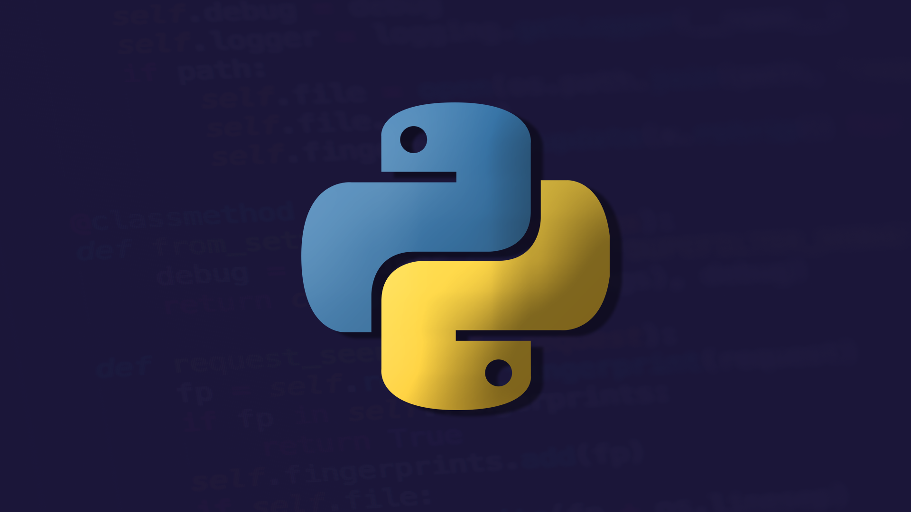
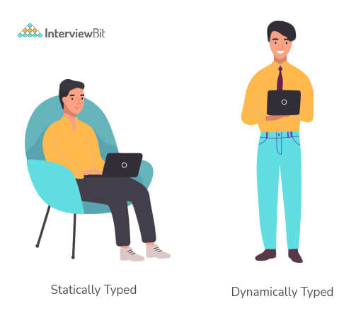
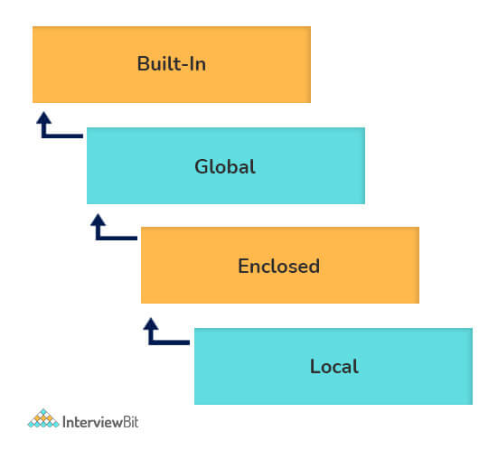
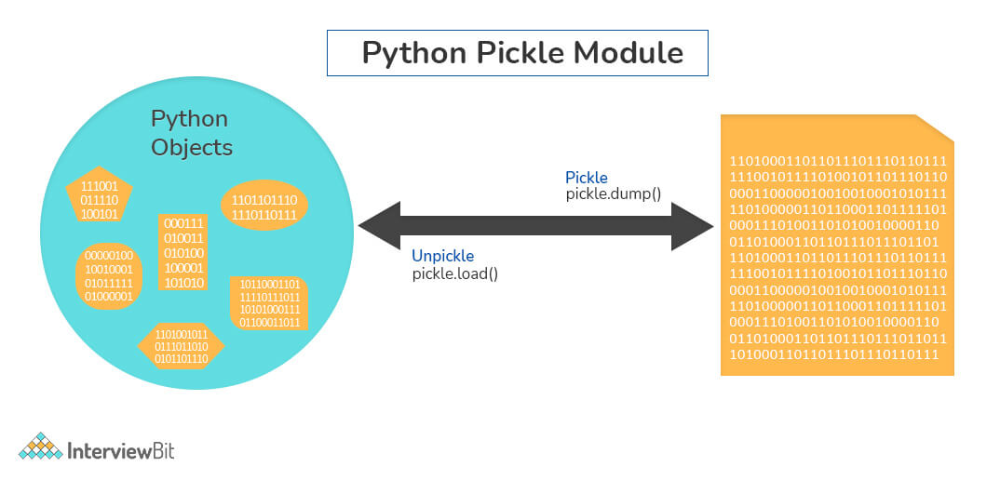

# Câu hỏi phỏng vấn Python



## Python là gì?

Python được phát triển bởi Guido van Rossum và công bố vào ngày 20 tháng 2, 1991. Nó là một trong những ngôn ngữ lập trình được yêu thích và phổ biến nhất thế giới. Về bản chất nó là ngôn ngữ thông dịch do đó nó cung cấp sự linh hoạt trong việc kết hợp ngữ nghĩa động. Nó cũng là một ngôn ngữ mã nguồn mở và miễn phí với cú pháp rất đơn giản và rõ ràng. Điều này giúp mọi người dễ dàng học python. Python cũng hỗ trợ lập trình hướng đối tượng và được sử dụng rộng rãi trong giới lập trình.

Do tính chất đơn giản và khả năng đạt được nhiều chức năng trong ít dòng code hơn, nên mức độ phổ biến của python đang tăng lên rất nhiều. Python cũng được sử dụng trong Máy học, Trí tuệ nhân tạo, Phát triển Web, Web Scraping và nhiều lĩnh vực khác do khả năng hỗ trợ tính toán mạnh mẽ bằng cách sử dụng các thư viện mạnh mẽ. Vì thế, nhu cầu tuyển các nhà phát triển python là rất lớn trên toàn thế giới. Các công ty sẵn sàng cung cấp các đặc quyền và lợi ích tuyệt vời cho những dev này.

## Lợi ích của sử dụng Python

- Python là ngôn ngữ lập trình đa năng có cú pháp đơn giản, dễ học, nhấn mạnh tính dễ đọc nhờ đó giảm chi phí bảo trì chương trình. Hơn nữa, ngôn ngữ này có khả năng viết script, hoàn toàn là mã nguồn mở và có số lượng thư viện hỗ trợ dồi dào.

- Cấu trúc dữ liệu cấp cao kết hợp với tính năng kiểu động và liên kết động, thu hút một cộng đồng lớn các lập trình viên sử dụng nó để triển khai và phát triển ứng dụng nhanh chóng.

## Mục lục

[1. Thế nào là ngôn ngữ kiểu động?](#1-th%E1%BA%BF-n%C3%A0o-l%C3%A0-ng%C3%B4n-ng%E1%BB%AF-ki%E1%BB%83u-%C4%91%E1%BB%99ng)

[2. Ngôn ngữ thông dịch là gì?](#2-ng%C3%B4n-ng%E1%BB%AF-th%C3%B4ng-d%E1%BB%8Bch-l%C3%A0-g%C3%AC)

[3. PEP 8 là gì và tại sao nó lại quan trọng?](#3-pep-8-l%C3%A0-g%C3%AC-v%C3%A0-t%E1%BA%A1i-sao-n%C3%B3-l%E1%BA%A1i-quan-tr%E1%BB%8Dng)

[4. Scope trong Python?](#4-scope-trong-python)

[5. List và Tuple là gì? Sự khác biệt giữa chúng?](#5-list-v%C3%A0-tuple-l%C3%A0-g%C3%AC-s%E1%BB%B1-kh%C3%A1c-bi%E1%BB%87t-gi%E1%BB%AFa-ch%C3%BAng)

[6. Kiểu dữ liệu trong Python?](#6-ki%E1%BB%83u-d%E1%BB%AF-li%E1%BB%87u-trong-python)

[7. Pass trong Python?](#7-pass-trong-python)

[8. Module và package trong Python?](#8-module-v%C3%A0-package-trong-python)

[9. Các quyền truy cập thuộc tính trong Python?](#9-c%C3%A1c-quy%E1%BB%81n-truy-c%E1%BA%ADp-thu%E1%BB%99c-t%C3%ADnh-trong-python)

[10. Self trong Python?](#10-self-trong-python)

[11. __init__ là gì?](#11-init-l%C3%A0-g%C3%AC)

[12. break, continue và pass trong Python?](#12-break-continue-v%C3%A0-pass-trong-python)

[13. Unit test trong Python là gì?](#13-unit-test-trong-python-l%C3%A0-g%C3%AC)

[14. Docstring là gì?](#14-docstring-l%C3%A0-g%C3%AC)

[15. Slicing trong Python?](#15-slicing-trong-python)

[16. Cách thực thi Python script trên Unix?](#16-c%C3%A1ch-th%E1%BB%B1c-thi-python-script-tr%C3%AAn-unix)

[17. Sự khác biệt giữa array và list trong Python?](#17-s%E1%BB%B1-kh%C3%A1c-bi%E1%BB%87t-gi%E1%BB%AFa-array-v%C3%A0-list-trong-python)

[18. Quản lý bộ nhớ trong Python?](#18-qu%E1%BA%A3n-l%C3%BD-b%E1%BB%99-nh%E1%BB%9B-trong-python)

[19. Namespace là gì?](#19-namespace-l%C3%A0-g%C3%AC)

[20. Scope Resolution trong Python?](#20-scope-resolution-trong-python)

[21. Decorator trong Python là gì?](#21-decorator-trong-python-l%C3%A0-g%C3%AC)

[22. Dict và List comprehensions trong Python?](#22-dict-v%C3%A0-list-comprehensions-trong-python)

[23. Lambda trong Python?](#23-lambda-trong-python)

[24. Sao chép đối tượng trong Python?](#24-sao-ch%C3%A9p-%C4%91%E1%BB%91i-t%C6%B0%E1%BB%A3ng-trong-python)

[25. Sự khác biệt giữa xrange và range trong Python?](#25-s%E1%BB%B1-kh%C3%A1c-bi%E1%BB%87t-gi%E1%BB%AFa-xrange-v%C3%A0-range-trong-python)

[26. Pickling và unpickling là gì?](#26-pickling-v%C3%A0-unpickling-l%C3%A0-g%C3%AC)

[27. Generator trong Python là gì?](#27-generator-trong-python-l%C3%A0-g%C3%AC)

[28. PYTHONPATH là gì?](#28-pythonpath-l%C3%A0-g%C3%AC)

[29. Hàm help() và dir() để làm gì?](#29-h%C3%A0m-help-v%C3%A0-dir-%C4%91%E1%BB%83-l%C3%A0m-g%C3%AC)

[30. Sự khác biệt giữa .py và .pyc?](#30-s%E1%BB%B1-kh%C3%A1c-bi%E1%BB%87t-gi%E1%BB%AFa-py-v%C3%A0-pyc)

[31. Python được thông dịch?](#31-python-%C4%91%C6%B0%E1%BB%A3c-th%C3%B4ng-d%E1%BB%8Bch)

[32. Truyền tham số bằng giá trị và bằng tham chiếu trong Python?](#32-truy%E1%BB%81n-tham-s%E1%BB%91-b%E1%BA%B1ng-gi%C3%A1-tr%E1%BB%8B-v%C3%A0-b%E1%BA%B1ng-tham-chi%E1%BA%BFu-trong-python)

[33. Iterator trong Python?](#33-iterator-trong-python)

[34. Cách xoá một file trong Python?](#34-c%C3%A1ch-xo%C3%A1-m%E1%BB%99t-file-trong-python)

[35. Giải thích hàm split() và join() trong Python?](#35-gi%E1%BA%A3i-th%C3%ADch-h%C3%A0m-split-v%C3%A0-join-trong-python)

[36. *args và *kwargs là gì?](#36-args-v%C3%A0-kwargs-l%C3%A0-g%C3%AC)

[37. Chỉ mục âm là gì và cách sử dụng?](#37-ch%E1%BB%89-m%E1%BB%A5c-%C3%A2m-l%C3%A0-g%C3%AC-v%C3%A0-c%C3%A1ch-s%E1%BB%AD-d%E1%BB%A5ng)

## Câu hỏi phỏng vấn cho Fresher

### 1. Thế nào là ngôn ngữ kiểu động?

Trước khi hiểu về ngôn ngữ kiểu động ta nên biết về kiểu là gì. Trong ngôn ngữ lập trình, kiểu đề cập đến việc kiểm tra kiểu dữ liệu. Nếu một ngôn ngữ kiểu mạnh, thì `"1" + 2` sẽ báo lỗi vì không thể tự động ép kiểu. Nhưng nếu là ngôn ngữ kiểu yếu thì sẽ cho về kết quả là `12`.

Kiểm tra kiểu có hai loại:
- **Static**: kiểm tra kiểu dữ liệu trước khi thực thi.
- **Dynamic**: kiểm tra kiểu dữ liệu khi đang thực thi.

Python là ngôn ngữ thông dịch, thực thi câu lệnh theo từng dòng do đó việc kiểm tra kiểu xảy ra khi đang thực thi. Python là ngôn ngữ kiểu động.



### 2. Ngôn ngữ thông dịch là gì?

Ngôn ngữ thông dịch là ngôn ngữ thực thi từng dòng lệnh, ví dụ như Python, JavaScript, R, PHP và Ruby. Chương trình viết bằng ngôn ngữ thông dịch có thể chạy trực tiếp từ code, không cần bước biên dịch.

### 3. PEP 8 là gì và tại sao nó lại quan trọng?

PEP là viết tắt của **Python Enhancement Proposal**. Một PEP là một tài liệu thiết kế chính thống cung cấp thông tin từ cộng đồng Python hoặc mô tả tính năng mới của Python. PEP 8 đặc biệt quan trọng vì nó ghi lại các hướng dẫn về phong cách code Python. Rõ ràng là việc đóng góp cho cộng đồng mã nguồn mở Python đòi hỏi bạn phải tuân theo các nguyên tắc về phong cách này một cách nghiêm ngặt.

### 4. Scope trong Python?

Phạm vi (scope) đề cập đến vùng code mà từ đó đối tượng trong Python có thể truy cập được. Do đó, ta không thể truy cập bất kỳ đối tượng cụ thể nào từ bất kỳ nơi nào trong code, việc truy cập phải được cho phép theo phạm vi của đối tượng.

Các kiểu phạm vi trong Python:

- Một **local scope** đề cập đến đối tượng cục bộ khả dụng trong hàm hiện tại.

- Một **global scope** đề cập đến đối tượng khả dụng trong suốt quá trình thực thi code kể từ khi chúng ra đời.

- Một **module-level scope** đề cập đến đối tượng toàn cục của module hiện tại có thể truy cập trong chương trình.

- Một **outermost scope** đề cập đến các tên built-in có thể gọi trong chương trình. 

### 5. List và Tuple là gì? Sự khác biệt giữa chúng?

List và Tuple là hai kiểu dữ liệu tuần tự cho lưu trữ tập hợp đối tượng trong Python. List được biểu diễn bằng cặp ngoặc vuông `['sara', 6, 0.19]` trong khi tuple được biểu diễn bằng dấu ngoặc đơn `('ansh', 5, 0.97)`.

Bên cạnh sự khác biệt về cú pháp, điểm khác biệt chính của cả hai là tuple chỉ lưu đối tượng *bất biến*. Có nghĩa là list có thể chỉnh sửa, thêm hay xoá trong khi tuple chỉ lưu hằng và không chỉnh sửa gì được. 

```python
my_tuple = ('sara', 6, 5, 0.97)
my_list = ['sara', 6, 5, 0.97]
print(my_tuple[0])     # output => 'sara'
print(my_list[0])     # output => 'sara'
my_tuple[0] = 'ansh'    # modifying tuple => throws an error
my_list[0] = 'ansh'    # modifying list => list modified
print(my_tuple[0])     # output => 'sara'
print(my_list[0])     # output => 'ansh'
```

### 6. Kiểu dữ liệu trong Python?

Mặc dù Python không yêu cầu kiểu dữ liệu khi khai báo biến nhưng lỗi vẫn xảy là nếu ta dùng kiểu dữ liệu khác với tương thích của nó. Python cung cấp hàm `type()` và `isinstance()` để kiểm tra kiểu của các các biến. Trong Python có các kiểu dữ liệu sau:

- **None**: từ khoá `None` biểu diễn giá trị null trong Python. Có thể thực hiện so sánh bằng với đối tượng kiểu None.

   | Tên | Mô tả |
   |------------|-------------|
   | NoneType | Biểu diễn giá trị Null |

- **Kiểu số**: có 3 kiểu số trong Python là **int**, **float** và **complex**. Bên cạnh đó boolean cũng là kiểu con của int.

   | Tên | Mô tả |
   |-----|-------|
   | int | lưu trữ kiểu số nguyên dạng thập phân, nhị phân, bát phân |
   | float | lưu trữ giá trị thập phân, phân số, số chấm động |
   | complex | lưu trữ kiểu số phức (A + Bj) với A là phần thực, B là phần ảo |
   | bool | lưu giá trị nhị nguyên (True hoặc False) |

- **Kiểu tuần tự**: có 3 kiểu tuần tự cơ bản trong Python - **list**, **tuple** và **range**. Kiểu tuần tự có thể thực hiện toán tử `in` và `not in`  để duyệt qua tất cả phần tử của chúng. Các toán tử này có cùng mức độ ưu tiên với các toán tử so sánh.

   | Tên | Mô tả |
   |-----|-------|
   | list | Dùng cho lưu tập hợp phần tử, có thể chỉnh sửa |
   | tuple | Dùng cho lưu tập hợp phần tử, bất biến |
   | range | Biểu diễn chuỗi số bất biến trong suốt quá trình thực thi |
   | str | Chuỗi bất biến Unicode cho lưu trữ dữ liệu văn bản |

   *Lưu ý*: thư viện chuẩn còn bổ sung hai kiểu là Binary data như `bytearray bytes`, `memoryview` và Text string như `str`.

- **Kiểu ánh xạ**: Trong Python, một đối tượng ánh xạ (mapping object) là một tập hợp các cặp key-value. Nó ánh xạ giá trị (value) với key tương ứng. Kiểu dữ liệu ánh xạ duy nhất trong Python là **dictionary**. 

   | Tên | Mô tả |
   |-----|-------|
   | dict | Lưu trữ tập hợp riêng biệt dạng cặp key/value |

- **Kiểu tập hợp**: hiện tại Python có hai kiểu tập hợp là **set** và **frozenset**. Kiểu set có thể thay đổi với hai phướng thức là `add()` và `remove()`, kiểu frozenset là bất biến, không thể chỉnh sửa sau khi tạo.

   | Tên | Mô tả |
   |-----|-------|
   | set | Tập hợp không thứ tự có thể chỉnh sửa |
   | frozenset | Tập hợp đối tượng riêng biệt bất biến |

- **Modules**

### 7. Pass trong Python?

Từ khoá `pass` biểu diễn toán tử null trong Python. Nó được dùng nhằm mục đích lắp đầy các khối code trống có thể thực thi trong thời gian chạy nhưng hiện tại vẫn chưa viết. Nếu không có lệnh pass, ta có thể gặp lỗi khi thực thi code.

```python
def myEmptyFunc():
   # do nothing
   pass
myEmptyFunc()    # nothing happens
## Without the pass keyword
# File "<stdin>", line 3
# IndentationError: expected an indented block
```

### 8. Module và package trong Python?

Package và module là hai cơ chế cho phép **lập trình module** trong Python. Việc module hoá đem lại các lợi ích như:
- **Tính đơn giản:** Làm việc trên một module duy nhất giúp bạn tập trung vào một phần tương đối nhỏ của vấn đề hiện tại. Điều này giúp cho việc phát triển dễ dàng hơn và ít bị lỗi hơn.
- **Khả năng bảo trì:** Các module được thiết kế để thực thi các logic giữa các khía cạnh vấn đề khác nhau. Nếu chúng được viết theo cách làm giảm sự phụ thuộc lẫn nhau, thì các sửa đổi trong một module ít gây ảnh hưởng đến các phần khác của chương trình.
- **Khả năng tái sử dụng:** Các hàm được khai báo trong một module có thể được sử dụng lại dễ dàng bởi các phần khác của ứng dụng.
- **Phạm vi:** Các module thường xác định một namespace riêng biệt, giúp tránh nhầm lẫn giữa các định danh từ các phần khác của chương trình.

**Modules**, là một file Python với mở rộng `.py` và có một tập hàm, lớp hoặc biến được khai báo và triển khai trong nó. Nó có thể được import ở file khác bằng lệnh `import`. Vd:

```py
from foo import bar
```

**Package** cho phép cấu trúc phân cấp module bằng cách dùng ký hiệu `.`. Nếu như module giúp tránh xung đột giữa các tên biến toàn cục thì các package giúp tránh xung đột giữa các tên module.

Việc tạo một package rất dễ dàng vì nó sử dụng cấu trúc file vốn có của hệ thống. Vì vậy, chỉ cần đưa các module vào một thư mục là bạn sẽ có nó, tên thư mục là tên package. Việc import một module hoặc nội dung của nó từ package này yêu cầu tên package làm tiền tố cho tên module được nối bằng dấu chấm.

### 9. Các quyền truy cập thuộc tính trong Python?

- **Global** là các biến công khai được khai báo ở global scope. Để dùng các biến này trong hàm, ta sử dụng từ khoá `global`.
- **Protected** là thuộc tính được khai báo với dấu gạch dưới phía trước để định danh, vd `_sara`. Nó có thể truy cập và chỉnh sửa bên ngoài lớp. 
- **Private** là thuộc tính với hai dấu gạch dưới phía trước để định danh, vd: `__ansh`. Nó không thể truy cập hay chỉnh sửa bên ngoài lớp.

### 10. Self trong Python?

Self được sử dụng để đại diện cho thực thể của lớp. Với từ khóa `this`, bạn có thể truy cập các thuộc tính và phương thức của lớp trong python. Nó liên kết các thuộc tính với các đối số đã cho. Self được sử dụng ở những nơi khác nhau và thường được cho là một từ khóa. Nhưng không giống như trong C ++, self không phải là một từ khóa trong Python.

### 11. __init__ là gì?

`__init__` là một phương thức khởi tạo trong Python và tự động gọi bộ nhớ cấp phát khi một đối tượng/thực thể mới được tạo. Tất cả lớp đều có phương thức `__init_-` liên kết với chúng. Nó giúp phân biệt phương thức và thuộc tính từ biến cục bộ.

```py
# class definition
class Student:
   def __init__(self, fname, lname, age, section):
      self.firstname = fname
      self.lastname = lname
      self.age = age
      self.section = section
# creating a new object
stu1 = Student("Sara", "Ansh", 22, "A2")
```

### 12. break, continue và pass trong Python?

| | |
|-|-|
| Break | lệnh break huỷ vòng lặp ngay lập tức và chuyển luồng điều khiển đến phần thân sau vòng lặp đó |
| Continue | lệnh continue huỷ lần lặp hiện tại của câu lệnh, nó bỏ quả phần code của lần lặp hiện tại và chuyển luồng điều khiển đến lần lặp kế tiếp |
| Pass | Từ khoá pass trong Python dùng để lấp đầy các empty block, tương tự một câu lệnh trống (`;`) trong Java, C++ |

```py
pat = [1, 3, 2, 1, 2, 3, 1, 0, 1, 3]
for p in pat:
   pass
   if (p == 0):
       current = p
       break
   elif (p % 2 == 0):
       continue
   print(p)    # output => 1 3 1 3 1
print(current)    # output => 0
```

### 13. Unit test trong Python là gì?

- Unit test là một framework kiểm thử đơn vị của Python.
- Unit test có nghĩa là kiểm tra các thành phần khác nhau của phần mềm một cách riêng biệt. Bạn có thể biết lý do tại sao unit test lại quan trọng không? Hãy tưởng tượng một tình huống, bạn đang xây dựng phần mềm sử dụng ba thành phần là A, B và C. Bây giờ, giả sử phần mềm của bạn bị hỏng tại một thời điểm. Làm thế nào bạn sẽ tìm thấy thành phần nào chịu trách nhiệm cho sự cố đó? Có thể thành phần A bị lỗi, thành phần B bị lỗi, và điều này thực sự đã làm hỏng phần mềm. Có thể có nhiều cách kết hợp như vậy.
- Đây là lý do tại sao cần phải kiểm tra từng thành phần đúng cách để thành phần nào có thể chịu trách nhiệm chính cho sự cố của phần mềm.
### 14. Docstring là gì?

Docstring hay documentation string là một chuỗi nhiều dòng dùng để ghi lại một đoạn code cụ thể.

Docstrign mô tả hàm hoặc phương thức hoạt động.

### 15. Slicing trong Python?

Slicing mô tả hành vi phân tách các mục trong một đối tượng dạng mảng (array, string, list và tuple). Cú pháp **[start: stop: step]**

- `start` là chỉ mục bắt đầu tách.
- `stop` là chỉ mục dừng lại.
- `step` là số bước nhảy.

Giá trị mặc định của start là 0, stop là số lượng mục, step là 1.

```py
numbers = [1, 2, 3, 4, 5, 6, 7, 8, 9, 10]
print(numbers[1 : : 2])  

#output : [2, 4, 6, 8, 10]
```

### 16. Cách thực thi Python script trên Unix?

Script phải bắt đầu với `#!/usr/bin/env python`

### 17. Sự khác biệt giữa array và list trong Python?

- Array (mảng) trong Python bao gồm các phần tử có cùng kiểu dữ liệu. 
- List (danh sách) trong Python gồm các phần tử có thể khác kiểu dữ liệu.

```py
import array
a = array.array('i', [1, 2, 3])
for i in a:
   print(i, end=' ')    #OUTPUT: 1 2 3
a = array.array('i', [1, 2, 'string'])    #OUTPUT: TypeError: an integer is required (got type str)

a = [1, 2, 'string']
for i in a:
   print(i, end=' ')    #OUTPUT: 1 2 string
```

## Câu hỏi phỏng vấn cho Experienced

### 18. Quản lý bộ nhớ trong Python?

Bộ nhớ trong Python được xử lý bởi **Python Memory Manager**. Bộ nhớ được cấp phát bởi manager trong một **private heap space** dành riêng cho Python. Tất cả đối tượng Python được lưu trữ trong heap này và là riêng tư, nó không thể truy cập bởi lập trình viện. Tuy nhiên, Python cung cấp một vài hàm API cốt lõi cho làm việc trên **private heap space**.

Ngoài ra, Python có một bộ dọn rác có sẵn để dọn dẹp bộ nhớ không được sử dụng cho **private heap space**.


### 19. Namespace là gì?

Namespace trong Python đề cập đến tên đối tượng trong một chương trình duy nhất và có thể dùng mà không có xung đột. Python triển khai các namespace này như một từ điển với tên giống như là khoá ánh xạ tới đối tượng tương ứng giống như giá trị. Nó cho phép nhiều namespace sử dụng cùng tên và ánh xạ nó đến các đối tượng riêng biệt. Một vài ví dụ của namespace:
- **Local Namespace** bao gồm tên cục bộ bên trong một hàm. Namespace được tạo tạm thời cho gọi hàm và sẽ bị xoá khi hàm đó trả về.
- **Global Namespace** bao gồm tên từ các package/module khác được import để sử dụng trong dự án hiện tại. Namespace này được tạo khi package được import trong script cho đến khi script được thực thi.
- **Built-in Namespace** bao gồm các hàm có sẵn của Python và tên có sẵn cho các kiểu thực thi khác nhau.

Vòng đời của namespace dựa trên đối tượng mà nó ánh xạ. Nên ở ngoài phạm vi của đối tượng, thì vòng đời của namespace sẽ kết thúc. Do đó, không thể truy cập vào trong đối tượng namespace từ bên ngoài namespace.



### 20. Scope Resolution trong Python?

Thỉnh thoảng trong cùng một scope sẽ có đối tượng cùng tên nhưng khác chứ năng. Trong trường hợp đó, scope resolution sẽ được Python tự động chạy. Một vài ví dụ hành vi như:
- Module Python có tên như 'math' và 'cmath' có nhiều hàm giống nhau như `log10()`, `acos()`, `exp()`. Để giải quyết vấn đề xung đột, ta cần thêm tên module vào phía trước chúng như `math.exp()` và `cmath.exp()`
- Hãy xem xét đoạn code dưới đây, một đối tượng `temp` đã được khởi tạo bằng 10 trên toàn cục và sau đó là 20 khi gọi hàm. Tuy nhiên, lệnh gọi hàm không thay đổi giá trị của `temp` trên toàn cục. Ở đây, chúng ta có thể quan sát thấy rằng Python vẽ ra một ranh giới rõ ràng giữa các biến toàn cục và cục bộ, coi các namespace của chúng là danh tính riêng biệt.

```py
temp = 10   # global-scope variable
def func():
   temp = 20   # local-scope variable
   print(temp)
print(temp)   # output => 10
func()    # output => 20
print(temp)   # output => 10
```

Hành vi này có thể bị ghi đè bằng cách dùng từ khoá `global` trong hàm như ví dụ bên dưới.

```py
temp = 10   # global-scope variable
def func():
   global temp
   temp = 20   # local-scope variable
   print(temp)
print(temp)   # output => 10
func()    # output => 20
print(temp)   # output => 20
```

### 21. Decorator trong Python là gì?

Decorator trong Python về cơ bản là các hàm bổ sung chức năng cho một hàm hiện có trong Python mà không thay đổi cấu trúc của chính hàm đó. Chúng được biểu diễn là `@decorator_name` bằng Python và được gọi theo kiểu từ dưới lên. Ví dụ:

```py
# decorator function to convert to lowercase
def lowercase_decorator(function):
   def wrapper():
      func = function()
      string_lowercase = func.lower()
      return string_lowercase
   return wrapper
# decorator function to split words
def splitter_decorator(function):
   def wrapper():
      func = function()
      string_split = func.split()
      return string_split
   return wrapper
@splitter_decorator # this is executed next
@lowercase_decorator # this is executed first
def hello():
   return 'Hello World'
hello()   # output => [ 'hello' , 'world' ]
```

Cái hay của decorator nằm ở chỗ bên cạnh việc thêm chức năng vào đầu ra của phương thức, chúng thậm chí có thể chấp nhận các đối số cho các hàm và có thể sửa đổi thêm các đối số đó trước khi truyền nó vào chính hàm. Hàm lồng nhau bên trong, tức là hàm 'wrapper', đóng một vai trò quan trọng ở đây. Nó được dùng để thực thi tính năng đóng gói, do đó tự ẩn mình khỏi phạm vi toàn cục.

```py
# decorator function to capitalize names
def names_decorator(function):
   def wrapper(arg1, arg2):
      arg1 = arg1.capitalize()
      arg2 = arg2.capitalize()
      string_hello = function(arg1, arg2)
      return string_hello
   return wrapper
@names_decorator
def say_hello(name1, name2):
   return 'Hello ' + name1 + '! Hello ' + name2 + '!'
say_hello('sara', 'ansh')   # output => 'Hello Sara! Hello Ansh!'
```

### 22. Dict và List comprehensions trong Python?

Python comprehensions, giống như decorator, chúng là những cấu trúc cú pháp tuyệt vời cho xây dựng một list, dictionaries hay set có thể chỉnh sửa và chọn lọc. Sử dụng comprehensions giúp tiết kiệm thời gian và code trở nên rõ ràng hơn. Ta có các ví dụ sau đây:

- Thực hiện phép toán trên một list:

```py
my_list = [2, 3, 5, 7, 11]
squared_list = [x**2 for x in my_list]    # list comprehension
# output => [4 , 9 , 25 , 49 , 121]
squared_dict = {x:x**2 for x in my_list}    # dict comprehension
# output => {11: 121, 2: 4 , 3: 9 , 5: 25 , 7: 49}
```

- Thực hiện lọc theo điều kiện trên một list:

```py
my_list = [2, 3, 5, 7, 11]
squared_list = [x**2 for x in my_list if x%2 != 0]    # list comprehension
# output => [9 , 25 , 49 , 121]
squared_dict = {x:x**2 for x in my_list if x%2 != 0}    # dict comprehension
# output => {11: 121, 3: 9 , 5: 25 , 7: 49}
```

- Kết hợp nhiều list thành một:

```py
a = [1, 2, 3]
b = [7, 8, 9]
[(x + y) for (x,y) in zip(a,b)]  # parallel iterators
# output => [8, 10, 12]
[(x,y) for x in a for y in b]    # nested iterators
# output => [(1, 7), (1, 8), (1, 9), (2, 7), (2, 8), (2, 9), (3, 7), (3, 8), (3, 9)] 
```

- Làm phẳng list đa chiều:

```py
my_list = [[10,20,30],[40,50,60],[70,80,90]]
flattened = [x for temp in my_list for x in temp]
# output => [10, 20, 30, 40, 50, 60, 70, 80, 90]
```

### 23. Lambda trong Python?

Lambda là một hàm ẩn danh trong Python, có thể chấp nhận bất kỳ số lượng đối số nào, nhưng chỉ có thể có một biểu thức duy nhất. Nó thường được sử dụng trong các tình huống yêu cầu một hàm ẩn danh trong một khoảng thời gian ngắn. Các hàm Lambda có thể được sử dụng theo một trong hai cách:

- Gán hàm lambda cho một biến:

```py
mul = lambda a, b : a * b
print(mul(2, 5))    # output => 10
```

- Bộc hàm lambda trong một hàm khác:

```py
def myWrapper(n):
   return lambda a : a * n
mulFive = myWrapper(5)
print(mulFive(2))    # output => 10
```

### 24. Sao chép đối tượng trong Python?

Trong Python, câu lệnh gán (toán tử `=`) không sao chép các đối tượng. Thay vào đó, nó tạo ra một ràng buộc giữa đối tượng hiện có và tên biến mục tiêu. Để tạo bản sao của một đối tượng bằng Python, chúng ta cần sử dụng module **copy**. Hơn nữa, có hai cách để tạo bản sao cho đối tượng đã cho bằng cách sử dụng module **copy**

- **Shallow copy** là một bản sao khôn ngoan của một đối tượng. Đối tượng được sao chép được tạo có bản sao chính xác của các giá trị trong đối tượng gốc. Nếu một trong hai giá trị là một tham chiếu đến các đối tượng khác, thì chỉ cần sao chép các địa chỉ tham chiếu cho cùng một.
- **Deep copy** sao chép tất cả các giá trị một cách đệ quy từ đối tượng nguồn sang đối tượng đích, tức là nó thậm chí sao chép các đối tượng được tham chiếu bởi đối tượng nguồn.

```py
from copy import copy, deepcopy
list_1 = [1, 2, [3, 5], 4]
## shallow copy
list_2 = copy(list_1) 
list_2[3] = 7
list_2[2].append(6)
list_2    # output => [1, 2, [3, 5, 6], 7]
list_1    # output => [1, 2, [3, 5, 6], 4]
## deep copy
list_3 = deepcopy(list_1)
list_3[3] = 8
list_3[2].append(7)
list_3    # output => [1, 2, [3, 5, 6, 7], 8]
list_1    # output => [1, 2, [3, 5, 6], 4]
```

### 25. Sự khác biệt giữa xrange và range trong Python?

xrange() và range() khá giống nhau về chức năng. Cả hai đều tạo một chuỗi số nguyên, với khác biệt duy nhất là `range()` trả về một list trong khi `xrange()` trả về một đối tượng xrange.

Bởi vì không giống như `range()`, `xrange()` không tạo ra một list tĩnh, nó tạo ra giá trị đang di chuyển. Kỹ thuật này thường được sử dụng với generator và được gọi là **yielding**.

Yielding là rất quan trọng trong các ứng dụng mà bộ nhớ là một hằng. Việc tạo list tĩnh như trong `range()` có thể dẫn đến `Memory Error` trong những điều kiện như vậy, trong khi `xrange()` có thể xử lý nó một cách tối ưu bằng cách sử dụng vừa đủ bộ nhớ cho generator (ít hơn đáng kể khi so sánh).

```py
for i in xrange(10):    # numbers from o to 9
   print i       # output => 0 1 2 3 4 5 6 7 8 9
for i in xrange(1,10):    # numbers from 1 to 9
   print i       # output => 1 2 3 4 5 6 7 8 9
for i in xrange(1, 10, 2):    # skip by two for next
   print i       # output => 1 3 5 7 9
```

*Lưu ý:* `xrange` không được hỗ trợ ở Python3. Nên `range` được dùng giống như `xrange` ở Python2.

### 26. Pickling và unpickling là gì?

Thư viện Python cung cấp một tính năng - tuần tự hóa (serialization) ra khỏi hộp. Việc tuần tự hóa một đối tượng đề cập đến việc chuyển đổi nó thành một định dạng có thể được lưu trữ, để sau này có thể giải mã hóa đối tượng để lấy được đối tượng ban đầu. Ở đây, module **pickle** được dùng.

**Pickling:**

- Pickling là tên của quá trình tuần tự hóa trong Python. Bất kỳ đối tượng nào trong Python đều có thể được tuần tự hóa thành một luồng byte và được kết xuất dưới dạng file trong bộ nhớ. Quá trình pickling là nhỏ gọn nhưng các đối tượng pickle có thể được nén thêm. Hơn nữa, pickle theo dõi các đối tượng mà nó đã tuần tự hóa và việc tuần tự hóa có thể di động qua các phiên bản.
- Hàm dùng cho quá trình này là `pickle.dump()`.

**Unpickling:**

- Unpickling là nghịch đảo hoàn toàn của pickling. Nó giải mã dòng byte để tạo lại các đối tượng được lưu trữ trong file và tải đối tượng vào bộ nhớ.
- Hàm dùng cho quá trình này là `pickle.load()`.



*Lưu ý:* Python có một module tuần tự hóa khác, nguyên thủy hơn được gọi là **marshall**, tồn tại chủ yếu để hỗ trợ các file .pyc trong Python và khác biệt đáng kể với pickle.

### 27. Generator trong Python là gì?

Generator là hàm trả về một tập hợp mục có thể lặp lại, mỗi lần một mục, theo một cách nhất định. Nói chung, các generator được sử dụng để tạo các trình vòng lặp - iterator với một cách tiếp cận khác. Chúng sử dụng từ khóa `yield` thay vì quay lại để trả về một đối tượng generator. 

Ví dụ generator với số fibonacci:

```py
## generate fibonacci numbers upto n
def fib(n):
   p, q = 0, 1
   while(p < n):
       yield p
       p, q = q, p + q
x = fib(10)    # create generator object 
 
## iterating using __next__(), for Python2, use next()
x.__next__()    # output => 0
x.__next__()    # output => 1
x.__next__()    # output => 1
x.__next__()    # output => 2
x.__next__()    # output => 3
x.__next__()    # output => 5
x.__next__()    # output => 8
x.__next__()    # error
 
## iterating using loop
for i in fib(10):
   print(i)    # output => 0 1 1 2 3 5 8
```

### 28. PYTHONPATH là gì?

PYTHONPATH là một biến môi trường mà bạn có thể đặt để thêm các thư mục bổ sung nơi Python sẽ tìm kiếm các module và package. Điều này đặc biệt hữu ích trong việc duy trì các thư viện Python mà bạn không muốn cài đặt ở vị trí mặc định chung.

### 29. Hàm help() và dir() để làm gì?

Hàm `help()` dùng để hiển thị tài liệu cho các module, class, function, keyword. Nó không có tham số truyền vào, dùng để hiển thị tiện ích tương tác trên console.

Hàm `dir()` trả về một danh sách các thuộc tính và phương thức hợp lệ của đối tượng mà nó được gọi. Nó hoạt động khác nhau với các đối tượng khác nhau nhằm mục đích tạo ra dữ liệu phù hợp nhất thay vì thông tin đầy đủ.

- Đối với các đối tượng module/thư viện, nó trả về danh sách tất cả các thuộc tính, có trong module đó.
- Đối với đối tượng lớp, nó trả về danh sách tất cả các thuộc tính hợp lệ và thuộc tính cơ sở.
- Không có đối số nào được truyền, nó trả về một danh sách các thuộc tính trong phạm vi hiện tại.

### 30. Sự khác biệt giữa .py và .pyc?

- Các file `.py` chứa mã nguồn của một chương trình. Trong khi đó, file `.pyc` chứa mã bytecode của chương trình của bạn. Chúng tôi nhận được mã bytecode sau khi biên dịch file `.py` (mã nguồn). Các file `.pyc` không được tạo cho tất cả các file mà bạn chạy. Nó chỉ được tạo cho các file mà bạn nhập.

- Trước khi thực hiện một chương trình python, trình thông dịch python kiểm tra các file đã biên dịch. Nếu file có mặt, máy ảo sẽ thực thi file đó. Nếu không tìm thấy, nó sẽ kiểm tra file `.py`. Nếu được tìm thấy, hãy biên dịch nó thành file `.pyc` và sau đó máy ảo python thực thi nó.

Có file `.pyc` giúp bạn tiết kiệm thời gian biên dịch
### 31. Python được thông dịch?

- Python là một ngôn ngữ không được thông dịch hoặc biên dịch. Thông dịch hoặc biên dịch là thuộc tính của việc triển khai. Python là một bytecode (tập hợp các hướng dẫn có thể đọc được của trình thông dịch) được thông dịch chung.
- Mã nguồn là một file có phần mở rộng .py.
- Python biên dịch mã nguồn thành một tập hợp các hướng dẫn cho một máy ảo. Trình thông dịch Python là một triển khai của máy ảo đó. Định dạng trung gian này được gọi là "bytecode".
- Mã nguồn `.py` đầu tiên được biên dịch để cung cấp `.pyc` là mã bytecode. Bytecode này sau đó có thể được thông dịch bởi CPython chính thức hoặc JIT (trình biên dịch Just in Time) do PyPy biên dịch.

### 32. Truyền tham số bằng giá trị và bằng tham chiếu trong Python?

- Truyền bằng giá trị: Sao chép đối tượng thực được truyền. Thay đổi giá trị của đối tượng sao chép sẽ không ảnh hướng đến đối tượng gốc.
- Truyền bằng tham chiếu: Tham chiếu đến đối tượng thực được truyền. Thay đổi giá trị ở đối tượng mới sẽ thay đổi cả giá trị ở đối tượng gốc.

```py
def appendNumber(arr):
   arr.append(4)
arr = [1, 2, 3]
print(arr)  #Output: => [1, 2, 3]
appendNumber(arr)
print(arr)  #Output: => [1, 2, 3, 4]
```

### 33. Iterator trong Python?

- Một iterator là một đối tượng.
- Nó nhớ trạng thái của nó, tức là nó đang ở đâu trong vòng lặp (xem đoạn code bên dưới).
- Phương thức `__iter__()` khởi tạo một iterator.
- Nó có phương thứ `__next__()` để trả về mục tiếp theo trong lần lặp và trỏ đến phần tử tiếp theo. Khi đến cuối đối tượng có thể lặp lại `__next__()` trả về `StopIteration exception`
- Nó có thể tự lặp lại.
- Iterator là một đối tượng mà chúng ta có thể lặp qua đối tượng như list, string,..

```py
class ArrayList:
   def __init__(self, number_list):
      self.numbers = number_list
   def __iter__(self):
      self.pos = 0
      return self
   def __next__(self):
      if(self.pos < len(self.numbers)):
         self.pos += 1
         return self.numbers[self.pos - 1]
      else:
         raise StopIteration
array_obj = ArrayList([1, 2, 3])
it = iter(array_obj)
print(next(it)) #output: 2
print(next(it)) #output: 3
print(next(it))
#Throws Exception
#Traceback (most recent call last):
#...
#StopIteration
```

### 34. Cách xoá một file trong Python?

Ta có thể dùng lệnh `os.remove(file_name)`:

```py
import os
os.remove("ChangedFile.csv")
print("File Removed!")
```

### 35. Giải thích hàm split() và join() trong Python?

- Bạn có thể dùng hàm split() để tách chuỗi dựa trên một dấu phân cách trong list của chuỗi.
- Bạn có thể dùng hàm join() để kết hợp một list của chuỗi dựa trên khoảng cách đựa cho từ chuỗi đơn.

```py
string = "This is a string."
string_list = string.split(' ') #delimiter is ‘space’ character or ‘ ‘
print(string_list) #output: ['This', 'is', 'a', 'string.']
print(' '.join(string_list)) #output: This is a string.
```

### 36. *args và *kwargs là gì?

#### *args
- *args là cú pháp đặc biệt dùng trong hàm để xác định độ dài biến tham số được truyền vào.
- "*" nghĩa là độ dài biến và "args" là tên dùng theo quy ước. 

```py
def multiply(a, b, *argv):
   mul = a * b
   for num in argv:
      mul *= num
   return mul
print(multiply(1, 2, 3, 4, 5)) #output: 120
```

#### *kwargs

- *kwargs là cú pháp đặc biệt trong hàm để xác định độ dài biến tham số có từ khoá.
- Ở đâu "kwargs" được dùng theo quy ước.
- Đối số có từ khóa có nghĩa là một biến có tên khi được truyền cho một hàm.
- Nó thực sự là một dictionary về tên biến và giá trị của nó.

```py
def tellArguments(**kwargs):
   for key, value in kwargs.items():
      print(key + ": " + value)
tellArguments(arg1 = "argument 1", arg2 = "argument 2", arg3 = "argument 3")
#output:
# arg1: argument 1
# arg2: argument 2
# arg3: argument 3
```
### 37. Chỉ mục âm là gì và cách sử dụng?

- Chỉ mục âm là chỉ mục tính từ phía cuối của list, tuple hoặc string.
- Arr[-1] nghĩa là phần tử cuối cùng của mảng Arr[].

```py
arr = [1, 2, 3, 4, 5, 6]
#get the last element
print(arr[-1]) #output 6
#get the second last element
print(arr[-2]) #output 5
```