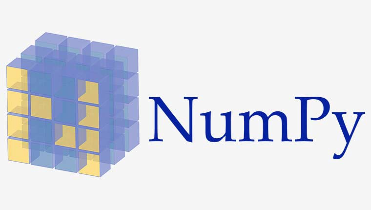

# Câu hỏi phỏng vấn NumPy

## Numpy là gì



Numpy là một thư viện lõi phục vụ cho khoa học máy tính của Python, hỗ trợ cho việc tính toán các mảng nhiều chiều, có kích thước lớn với các hàm đã được tối ưu áp dụng lên các mảng nhiều chiều đó. Numpy đặc biệt hữu ích khi thực hiện các hàm liên quan tới đại số tuyến tính.

## Mục lục

[1. Bạn hiểu gì về NumPy?](#1-b%E1%BA%A1n-hi%E1%BB%83u-g%C3%AC-v%E1%BB%81-numpy)

[2. Ưu điểm của mảng trong Numpy so với list trong Python?](#2-%C6%B0u-%C4%91i%E1%BB%83m-c%E1%BB%A7a-m%E1%BA%A3ng-trong-numpy-so-v%E1%BB%9Bi-list-trong-python)

[3. Tạo mảng 1D, 2D và 3D?](#3-t%E1%BA%A1o-m%E1%BA%A3ng-1d-2d-v%C3%A0-3d)

[4. Cho một mảng numpy và một cột mới làm input. Làm thế nào để xóa cột thứ hai và thay thế cột bằng một giá trị cột mới?](#4-cho-m%E1%BB%99t-m%E1%BA%A3ng-numpy-v%C3%A0-m%E1%BB%99t-c%E1%BB%99t-m%E1%BB%9Bi-l%C3%A0m-input-l%C3%A0m-th%E1%BA%BF-n%C3%A0o-%C4%91%E1%BB%83-x%C3%B3a-c%E1%BB%99t-th%E1%BB%A9-hai-v%C3%A0-thay-th%E1%BA%BF-c%E1%BB%99t-b%E1%BA%B1ng-m%E1%BB%99t-gi%C3%A1-tr%E1%BB%8B-c%E1%BB%99t-m%E1%BB%9Bi)

[5. Load dữ liệu từ file text như thế nào?](#5-load-d%E1%BB%AF-li%E1%BB%87u-t%E1%BB%AB-file-text-nh%C6%B0-th%E1%BA%BF-n%C3%A0o)

[6. Cách đọc dữ liệu CSV trong NumPy?](#6-c%C3%A1ch-%C4%91%E1%BB%8Dc-d%E1%BB%AF-li%E1%BB%87u-csv-trong-numpy)

[7. Sắp xếp mảng dựa trên cột thứ N?](#7-s%E1%BA%AFp-x%E1%BA%BFp-m%E1%BA%A3ng-d%E1%BB%B1a-tr%C3%AAn-c%E1%BB%99t-th%E1%BB%A9-n)

[8. Bạn sẽ tìm giá trị gần nhất trong một mảng numpy như thế nào?](#8-b%E1%BA%A1n-s%E1%BA%BD-t%C3%ACm-gi%C3%A1-tr%E1%BB%8B-g%E1%BA%A7n-nh%E1%BA%A5t-trong-m%E1%BB%99t-m%E1%BA%A3ng-numpy-nh%C6%B0-th%E1%BA%BF-n%C3%A0o)

[9. Cách đảo ngược mảng trong NumPy chỉ với một dòng?](#9-c%C3%A1ch-%C4%91%E1%BA%A3o-ng%C6%B0%E1%BB%A3c-m%E1%BA%A3ng-trong-numpy-ch%E1%BB%89-v%E1%BB%9Bi-m%E1%BB%99t-d%C3%B2ng)

[10. Cách tìm hình dạng của bất kỳ mảng nào trong NumPy?](#10-c%C3%A1ch-t%C3%ACm-h%C3%ACnh-d%E1%BA%A1ng-c%E1%BB%A7a-b%E1%BA%A5t-k%E1%BB%B3-m%E1%BA%A3ng-n%C3%A0o-trong-numpy)

## Câu hỏi phỏng vấn NumPy

### 1. Bạn hiểu gì về NumPy?

NumPy là một trong những thư viện phổ biến nhất, dễ sử dụng, đa năng, mã nguồn mở, dựa trên Python, mục đích chung được sử dụng để xử lý mảng. NumPy là viết tắt của Numerical PYthon. Điều này rất nổi tiếng với các công cụ được tối ưu hóa cao mang lại hiệu suất cao và tính năng xử lý mảng N-Dimensional mạnh mẽ được thiết kế rõ ràng để hoạt động trên các mảng phức tạp. Do tính phổ biến và hiệu suất mạnh mẽ và tính linh hoạt của nó để thực hiện các phép toán khác nhau như phép toán lượng giác, tính toán đại số và thống kê, nó được sử dụng phổ biến nhất để thực hiện các phép tính khoa học và các chức năng phát sóng khác nhau. Hình ảnh sau đây cho thấy các ứng dụng của NumPy:


Các ứng dụng:
- Các thuật toán
- Broadcast
- Phép tính trên bit
- Xếp chồng
- Phép tính ma trận
- Tìm kiếm và sắp xếp
- Phép tính số học
- Sao chép và xam mảng
- Thống kê
- Đại số tuyến tính

### 2. Ưu điểm của mảng trong Numpy so với list trong Python?

Cấu trúc dữ liệu list của python rất hiệu quả và có khả năng thực hiện nhiều chức năng khác nhau. Tuy nhiên, chúng có những hạn chế nghiêm trọng khi nói đến việc tính toán vector như phép nhân hay phép cộng. List cũng yêu cầu thông tin liên quan đến kiểu của mọi phần tử dẫn đến chi phí code điều phối được thực thi mỗi khi bất kỳ thao tác nào được thực hiện trên bất kỳ phần tử nào. Với Numpy nó khắc phục tất cả hạn chế trên.

Ngoài ra, khi kích thước của các mảng NumPy tăng lên, NumPy trở nên nhanh hơn khoảng 30 lần so với list Python. Điều này là do các mảng Numpy được đóng gói dày đặc trong bộ nhớ do bản chất đồng nhất của chúng. Điều này đảm bảo việc giải phóng bộ nhớ cũng nhanh hơn.

### 3. Tạo mảng 1D, 2D và 3D?

Tạo mảng 1D:

```py
import numpy as np
one_dimensional_list = [1,2,4]
one_dimensional_arr = np.array(one_dimensional_list)
print("1D array is : ",one_dimensional_arr)
```

Tạo mảng 2D:

```py
import numpy as np
two_dimensional_list=[[1,2,3],[4,5,6]]
two_dimensional_arr = np.array(two_dimensional_list)
print("2D array is : ",two_dimensional_arr)
```

Tạo mảng 3D:

```py
import numpy as np
three_dimensional_list=[[[1,2,3],[4,5,6],[7,8,9]]]
three_dimensional_arr = np.array(three_dimensional_list)
print("3D array is : ",three_dimensional_arr)
```

Tạo mảng ND: Có thể thực hiện với thuộc tính `ndmin`. Ví dụ minh hoạ các tạo mảng 6D:

```py
import numpy as np
ndArray = np.array([1, 2, 3, 4], ndmin=6)
print(ndArray)
print('Dimensions of array:', ndArray.ndim)
```

### 4. Cho một mảng numpy và một cột mới làm input. Làm thế nào để xóa cột thứ hai và thay thế cột bằng một giá trị cột mới?

#### Ví dụ:

Cho mảng

```py
[
    [35 53 63]
    [72 12 22]
    [43 84 56]
]
```

Giá trị cột mới.

```py
[
    20
    30
    40
]
```

#### Giải pháp:

```py
import NumPy as np
#inputs
inputArray = np.array([[35,53,63],[72,12,22],[43,84,56]])
new_col = np.array([[20,30,40]])
# delete 2nd column
arr = np.delete(sampleArray , 1, axis = 1)
#insert new_col to array
arr = np.insert(arr , 1, new_col, axis = 1)
print (arr) 
```

### 5. Load dữ liệu từ file text như thế nào?

Ta có thể sử dụng phương thức `numpy.loadtxt()` có thể tự động đọc các dòng header  và footer của file và các comment nếu có.

Phương pháp này có hiệu quả cao và ngay cả khi phương pháp này kém hiệu quả hơn, thì dữ liệu nên được biểu diễn ở định dạng hiệu quả hơn như CSV, v.v. Có thể xem xét các lựa chọn thay thế khác nhau tùy thuộc vào phiên bản NumPy được sử dụng.

Sau đây là các định dạng file được hỗ trợ:

- **File text:** những file này rất lớn, chậm nhưng có thể di động và con người có thể đọc được.
- **Raw binary:** file này không có bất kỳ metadata nào và không thể di động. Nhưng nó rất nhanh.
- **Pickle:** là các borderline chậm và di động nhưng phụ thuộc vào phiên bản NumPy.
- **HDF5:** còn gọi là định dạng High-Powered Kitchen Sink hỗ trợ cả định dạng PyTables và h5py.
- **.npy:**  là định dạng dữ liệu nhị phân gốc của NumPy, cực kỳ đơn giản, hiệu quả và di động.

### 6. Cách đọc dữ liệu CSV trong NumPy?

Có thể thực hiện bằng phương thức `genfromtxt()` 

```py
from numpy import genfromtxt
csv_data = genfromtxt('sample_file.csv', delimiter=',')
```

### 7. Sắp xếp mảng dựa trên cột thứ N?

Ví dụ mảng `arr`.

```py
arr = np.array([[8, 3, 2],
        [3, 6, 5],
        [6, 1, 4]])
```

Ta cần sắp xếp hàm theo cột thứ hai để có kết quả như sau:

```py
[[6, 1, 4],
[8, 3, 2],
[3, 6, 5]]
```

**Giải pháp:** Sử dụng phương thức sort()

```py
import numpy as np
arr = np.array([[8, 3, 2],
        [3, 6, 5],
        [6, 1, 4]])
#sort the array using np.sort
arr = np.sort(arr.view('i8,i8,i8'),
       order=['f1'],
       axis=0).view(np.int)
```

Ta cũng có thể thực hiện sắp xếp tại chỗ như sau:

```py
arr.view('i8,i8,i8').sort(order=['f1'], axis=0)
```

### 8. Bạn sẽ tìm giá trị gần nhất trong một mảng numpy như thế nào?

Ta sử dụng phương thức `argmin()` như sau:

```py
import numpy as np
def find_nearest_value(arr, value):
    arr = np.asarray(arr)
    idx = (np.abs(arr - value)).argmin()
    return arr[idx]
#Driver code
arr = np.array([ 0.21169,  0.61391, 0.6341, 0.0131, 0.16541,  0.5645,  0.5742])
value = 0.52
print(find_nearest_value(arr, value)) # Prints 0.5645
```

### 9. Cách đảo ngược mảng trong NumPy chỉ với một dòng?

```py
reversed_array = arr[::-1]
```

Trong đó, `arr` là mảng đầu vào ban đầu, `reverse_array` là kết quả sau khi tất cả phần tử được đảo ngược.

### 10. Cách tìm hình dạng của bất kỳ mảng nào trong NumPy?

Chúng ta có thể sử dụng thuộc tính shape của mảng numpy để tìm hình dạng. Nó trả về hình dạng của mảng về số lượng hàng và số cột của mảng.

```py
import numpy as np
arr_two_dim = np.array([("x1","x2", "x3","x4"),
             ("x5","x6", "x7","x8" )])
arr_one_dim = np.array([3,2,4,5,6])
# find and print shape
print("2-D Array Shape: ", arr_two_dim.shape)
print("1-D Array Shape: ", arr_one_dim.shape)
```

Kết quả:

```
2-D Array Shape:  (2, 4)
1-D Array Shape:  (5,)
```
