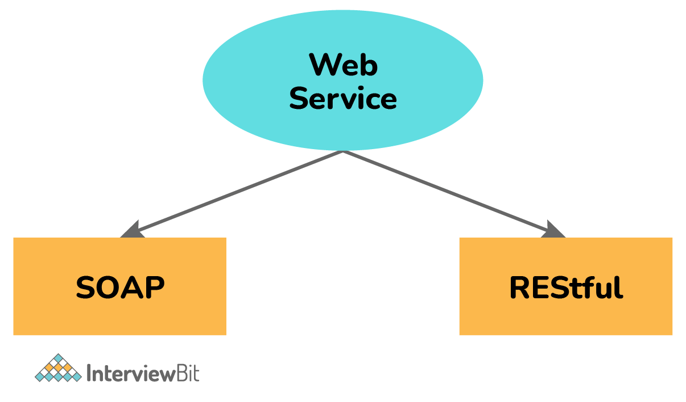

# Web Service

## Web Service là gì ? 

Dịch vụ Web đơn giản là một hệ thống phần mềm được thiết kế đặc biệt để giao tiếp với các ứng dụng server và client trên WWW (World Wide Web). Nói đơn giản hơn, nó là một phương thức cho giao tiếp giữa hai hay nhiều thiết bị trên mạng. Nó cho phép các ứng dụng được tạo bởi các ngôn ngữ lập trình khác nhau giao tiếp với nhau mà không có vấn đề gì. Nó sử dụng internet cho tương tác trực tiếp giữa ứng dụng và ứng dụng, và cũng cho phép bạn hiển thị logic nghiệp vụ bằng cách sử dụng API.

## Câu hỏi phỏng vấn cho Fresher

## 1. Giải thích các kiểu web service khác nhau ?

Có hai kiểu web service cơ bản là :

**SOAP (Simple Object Access Protocol)**: Nó còn được gọi là giao thức truyền tải thông điệp độc lập với mục đích chính là truyền thông báo, và dựa trên giao thức XML. 

**RESTful (Representational State Transfer)**: Nó được phát triển để khắc phục những thiếu sót của SOAP và làm cho các dịch vụ web hiệu quả hơn.

### 2. Các tính năng quan trọng của Web Service ?

Một số tính năng quan trọng của dịch vụ web bao gồm:

- Được sử dụng để tiêu chuẩn hóa hệ thống truyền tải thông điệp XML.
- Không ràng buộc với bất kỳ ngôn ngữ lập trình hoặc bất kỳ hệ điều hành nào.
- Có thể khám phá thông qua một cơ chế tìm kiếm đơn giản.
- Có sẵn trên internet hoặc các mạng riêng.
- Hỗ trợ kết nối mềm giữa các hệ thống.
- Có thể đồng bộ hoặc không đồng bộ.
- Hỗ trợ trao đổi dữ liệu minh bạch để tạo điều kiện tích hợp.
- Hỗ trợ giao tiếp giữa các ứng dụng khác nhau bằng HTML, XML, WSDL, SOAP, v.v.
- Hỗ trợ RPC (Remote Procedure Calls).

### 3. Các thành phần của Web Service 

Các thành phần khác nhau của web service:

- SOAP (Simple Object Access Protocol) 
- UDDI (Universal Description, Discovery, and Integration) 
- WSDL (Web Services Description Language) 
- RDF (Resource Description Framework) 
- XML (Extensible Markup Language) 

### 4. Khác biệt giữa API và Web Service

**API (Application Programming Interface):** hành động như một interface giữa hai thiết bị để chúng có thể giao tiếp với nhau mà không cần người dùng can thiệp. Một số tính năng của chúng như linh động, dễ tích hợp với GUI,ngôn ngữ độc lập,... Các API không phải Web Service

**Web Service:** tạo điều kiện tương tác giữa hai thiết bị qua mạng. Chúng được sử dụng rộng rãi để trao đổi dữ liệu giữa các hệ thống hoặc ứng dụng. Một số tính năng của nó bao gồm liên kết mềm, hỗ trợ trao đổi tài liệu, khả năng tương tác, khả năng mở rộng, v.v. Các dịch vụ Web là API.

| API | Web Service |
|-----|-------------|
| Có thể online hoặc offline | Buộc phải có mạng |
| Kiến trúc gọn nhẹ | Yêu cầu SOAP cho gửi và nhận dữ liệu mạng, do đó kiến trúc không nhẹ |
| Có thể dùng bất kỳ kiểu thiết kế hay giao thức nào | Chỉ dùng SOAP, thỉnh thoảng dùng REST, RPC, XML |
| Không yêu cầu mạng cho các tác | Cần mạng cho mọi thao tác |
| Mã nguồn mở và dùng XML | Mã nguồn đóng và dùng JSON |

### 5. Các công cụ kiểm thử web service

Có nhiều công cụ khác nhau cho kiểm tra web service:

SoapUI 
Poster 
Postman 
REST client 
JMeter
