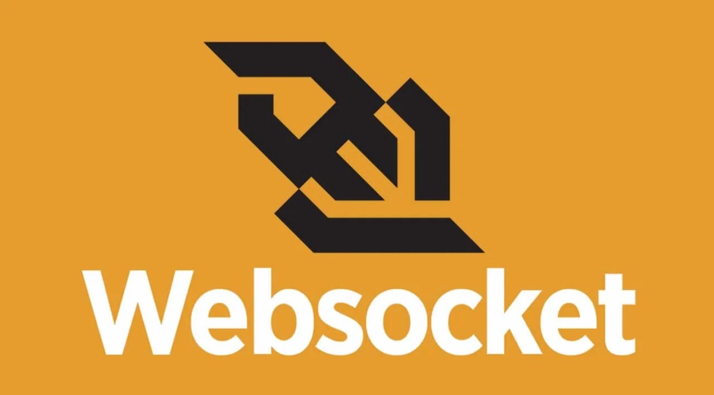
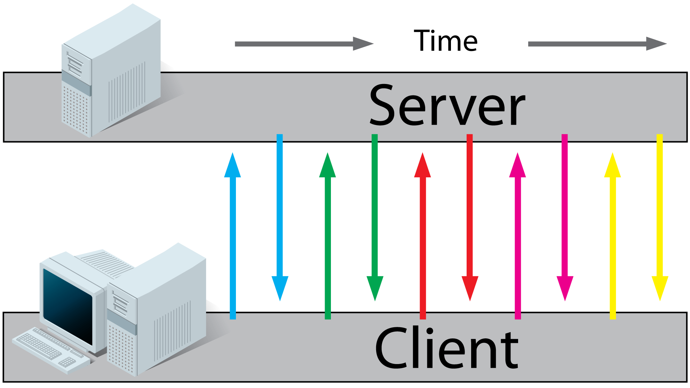
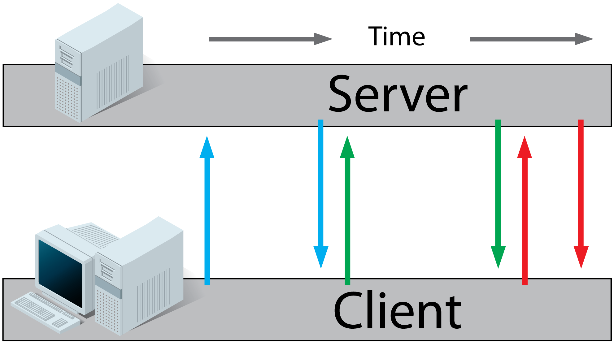

# Câu hỏi phỏng vấn WebSocket

## WebSocket là gì?



WebSoket là công nghệ hỗ trợ giao tiếp hai chiều giữa client và server bằng cách sử dụng một TCP socket để tạo một kết nối hiệu quả và ít tốn kém. Mặc dù được thiết kế để chuyên sử dụng cho các ứng dụng web, lập trình viên vẫn có thể đưa chúng vào bất kì loại ứng dụng nào.

WebSockets mới xuất hiện trong HTML5, là một kỹ thuật Reverse Ajax. WebSockets cho phép các kênh giao tiếp song song hai chiều và hiện đã được hỗ trợ trong nhiều trình duyệt (Firefox, Google Chrome và Safari). Kết nối được mở thông qua một HTTP request (yêu cầu HTTP), được gọi là liên kết WebSockets với những header đặc biệt. Kết nối được duy trì để bạn có thể viết và nhận dữ liệu bằng JavaScript như khi bạn đang sử dụng một TCP socket đơn thuần.

## Mục lục

[1. WebSockets là gì?](#1-websockets-l%C3%A0-g%C3%AC)

[2. Giải thích Server-Sent Events/EventSource?](#2-gi%E1%BA%A3i-th%C3%ADch-server-sent-eventseventsource)

[3. Tương tác với độ trễ thấp là gì?](#3-t%C6%B0%C6%A1ng-t%C3%A1c-v%E1%BB%9Bi-%C4%91%E1%BB%99-tr%E1%BB%85-th%E1%BA%A5p-l%C3%A0-g%C3%AC)

[4. Short Polling là gì?](#4-short-polling-l%C3%A0-g%C3%AC)

[5. Tại sao dùng WebSocket thay vì HTTP?](#5-t%E1%BA%A1i-sao-d%C3%B9ng-websocket-thay-v%C3%AC-http)

[6. Giải thích Long Polling là gì?](#6-gi%E1%BA%A3i-th%C3%ADch-long-polling-l%C3%A0-g%C3%AC)

[7. Lợi ích của SSE so với WebSocket?](#7-l%E1%BB%A3i-%C3%ADch-c%E1%BB%A7a-sse-so-v%E1%BB%9Bi-websocket)

[8. Giải thích các kỹ thuật giao tiếp khác nhau trên web mà bạn biết?](#8-gi%E1%BA%A3i-th%C3%ADch-c%C3%A1c-k%E1%BB%B9-thu%E1%BA%ADt-giao-ti%E1%BA%BFp-kh%C3%A1c-nhau-tr%C3%AAn-web-m%C3%A0-b%E1%BA%A1n-bi%E1%BA%BFt)

[9. Sự khác biệt giữa SSE và WebSocket?](#9-s%E1%BB%B1-kh%C3%A1c-bi%E1%BB%87t-gi%E1%BB%AFa-sse-v%C3%A0-websocket)

[10. Giải thích về giao thức WebSocket?](#10-gi%E1%BA%A3i-th%C3%ADch-v%E1%BB%81-giao-th%E1%BB%A9c-websocket)

[11. WebSocket Frame là gì?](#11-websocket-frame-l%C3%A0-g%C3%AC)

[12. Khi nào WebRTC tốt hơn WebSocket?](#12-khi-n%C3%A0o-webrtc-t%E1%BB%91t-h%C6%A1n-websocket)

## Câu hỏi phỏng vấn WebSocket?

### 1. WebSockets là gì?

WebSocket là công nghệ cho phép client thiết lập kết nối hai chiều *full-duplex* để giao tiếp với server.

Với WebSocket, cả client và server có thể kích hoạt giao tiếp với phía còn lại, chúng có thể gửi tin nhắn cùng lúc. Ngược lại trong giao tiếp HTTP truyền thống chỉ có thể đi một chiều là client đến server.

### 2. Giải thích Server-Sent Events/EventSource?

SSE (Server-Sent Events) là một kỹ thuật cho gửi thông điệp, nó cho phép server đẩy cập nhật lên client bằng cách tận dụng JavaScript `EventSource`.

EventSource mở một một kết nối liên tục, một chiều với server qua HTTP sử dụng header đặc biệt `text/event-stream` và lắng nghe thông điệp, được code của bạn xử lý giống như sự kiện JavaScript.

Server-Sent Events (SSE) phù hợp cho các ứng dụng mà bạn không cần gửi cho server bất kỳ dữ liệu nào. Ví dụ: trang tin tức Twitter hoặc sàn chứng khoán cổ phiếu. Một điểm ưu việc khác là SSE hoạt động qua HTTP và API tương đối dễ sử dụng.

Tuy nhiên:
- SSE không hỗ trợ các trình duyệt cũ.
- Phần lớn trình duyệt giới hạn số lượng kết nối SSE mà bạn tạo cùng lúc.

### 3. Tương tác với độ trễ thấp là gì?

**Độ trễ thấp (low latency)** có nghĩa là có rất ít độ trễ giữa thời gian bạn yêu cầu điều gì đó và thời gian bạn nhận được phản hồi. Như nó áp dụng cho WebSockets, nó có nghĩa là dữ liệu có thể được gửi nhanh hơn (đặc biệt là qua các liên kết chậm) bởi vì kết nối đã được thiết lập nên không cần thêm gói tin để thiết lập kết nối TCP. 

### 4. Short Polling là gì?

Short Polling hoặc Ajax Polling là một kỹ thuật khi bạn yêu cầu client ping liên tục đến server, chẳng hạn như sau mỗi 500ms(hoặc trên một số độ trễ nhất định). Bằng cách đó, bạn nhận được dữ liệu mới sau mỗi 500ms:
1. Client yêu cầu trang web từ một server bằng HTTP thông thường.
2. Client nhận được trang web và thực thi JavaScript trên trang yêu cầu file từ server theo khoảng thời gian đều đặn (vd: 0.5s)
3. Server tính toán từng phản hồi và gửi lại, giống như lưu lượng HTTP thông thường.



Có một số nhược điểm rõ ràng của điều này:
- Có độ trễ 500ms
- Nó tiêu thụ tài nguyên server với một loạt các yêu cầu và hầu hết các yêu cầu sẽ trả về trống nếu dữ liệu không được cập nhật thường xuyên.

### 5. Tại sao dùng WebSocket thay vì HTTP?

WebSocket là một kết nối liên tục giữa client và server. Kết nối liên tục đó cho phép những điều sau:

- Dữ liệu có thể được gửi từ server đến client bất kỳ lúc nào mà không cần client yêu cầu. Điều này thường được gọi là push server và rất có giá trị đối với các ứng dụng mà khách hàng cần biết khá nhanh khi có điều gì đó xảy ra trên server (chẳng hạn như một tin nhắn trò chuyện mới đã được nhận hoặc giá mới đã được cập nhật). Một client không thể push được dữ liệu qua HTTP. Client sẽ phải thường xuyên thăm dò ý kiến bằng cách đưa ra yêu cầu HTTP vài giây một lần để có được dữ liệu mới kịp thời. Client polling không hiệu quả.

- Dữ liệu có thể được gửi theo cả hai cách rất hiệu quả. Bởi vì kết nối đã được thiết lập và khung dữ liệu webSocket được tổ chức rất hiệu quả, người ta có thể gửi dữ liệu hiệu quả hơn rất nhiều thông qua một yêu cầu HTTP nhất thiết phải chứa header, cookie, v.v.

### 6. Giải thích Long Polling là gì?

Phương thức **Long Polling** được server dùng để nhận yêu cầu, nhưng không phản hồi cho đến khi nó nhận dữ liệu mới từ yêu cầu khác.

Long polling hiệu quả hơn ping server liên tục vì nó giúp tiết kiệm những rắc rối khi parse header của yêu cầu, truy vấn dữ liệu mới và gửi phần hồi (thường là trống).

Tuy nhiên:
- server phải theo dõi nhiều yêu cầu và thứ tự của chúng
- yêu cầu có thể hết thời gian chờ và yêu cầu mới cần đưa ra định kỳ

Các bước:



1. Client yêu cầu trang web từ server sử dụng HTTP thông thường.
2. Client nhận trang web được yêu cầu và thực thi JavaScript trên trang yêu cầu file từ server.
3. Server không phản hồi ngay lập tức với thông tin được yêu cầu mà đợi cho đến khi có thông tin mới.
4. Khi có thông tin mới, server sẽ phản hồi với thông tin mới.
5. Client nhận được thông tin mới và ngay lập tức gửi một yêu cầu khác đến server, bắt đầu lại quy trình.

### 7. Lợi ích của SSE so với WebSocket?

- Được truyền qua HTTP đơn giản thay vì một giao thức tùy chỉnh
- Có thể được lấp đầy bằng javascript để "backport" SSE cho các trình duyệt chưa hỗ trợ nó.
- Tích hợp hỗ trợ cho tái kết nối và id của sự kiện
- Giao thức đơn giản hơn
- Không có vấn đề gì với tường lửa của công ty thực hiện kiểm tra packet.

#### Các trường hợp dùng SSE:
- Sàn chứng khoán trực tiếp
- Trang newsfeed mạng xã hội
- Thông báo đến trình duyệt

### 8. Giải thích các kỹ thuật giao tiếp khác nhau trên web mà bạn biết?

- **AJAX** - `request` → `response`. Tạo một kết nối đến server, gửi yêu cầu gồm header và dữ liệu tuỳ chọn, nhận phản hồi từ server và đóng kết nối. Được hỗ trợ trên mọi loại trình duyệt.

- **Long poll** - `request` → `wait` → `response`. Tạo một kết nối đến server giống như AJAX, nhưng duy trì kết nối mở keep-alive trong một khoảng thời gian. Trong suốt kết nối, client có thể truy xuất dữ liệu từ server. Client phải kết nối lại đỊnh kỳ sau khi kết nối bị đóng, do hết thời gian chờ hoặc hết dữ liệu. Ở phía server, nó vẫn được xem như một yêu cầu HTTP, giống như AJAX, ngoại trừ câu trả lời cho yêu cầu xảy ra ngay bây giờ hoặc một lúc nào đó trong tương lại, được xác định bởi logic ứng dụng.

- **WebSockets** - `client` ↔ `server`. Tạo kết nối TCP tới server và giữ nó mở nếu cần. Server hoặc client có thể dễ dàng đóng kết nối. Client trải qua quá trình bắt tay 3 bước HTTP. Nếu nó thành công, thì server và client có thể trao đổi dữ liệu theo cả hai hướng bất kỳ lúc nào. Sẽ hiệu quả nếu ứng dụng yêu cầu trao đổi dữ liệu thường xuyên theo cả hai cách. WebSockets có khung dữ liệu bao gồm che dấu cho mỗi tin nhắn được gửi từ client đến server, vì vậy dữ liệu được mã hóa đơn giản.

- **WebRTC** - `peer` ↔ `peer`. Transport thiết lập giao tiếp giữa client và các phương tiện truyền tải, vì vậy nó có thể sử dụng UDP, TCP hoặc các lớp trừu tượng khác. Nó thường được dùng để truyền dữ liệu khối lượng lớn chẳng hạn như video/audio, trong đó độ tin cậy là thứ yêu và một vài frame có thể hy sinh đổi lại thời gian phản hồi và truyền dữ liệu. Cả hai phía (peer) có thể đẩy dữ liệu một cách độc lập. Mặc dù nó có thể được sử dụng hoàn toàn độc lập với bất kỳ server tập trung nào, nó vẫn yêu cầu một số cách trao đổi dữ liệu endPoints, trong đó trong hầu hết các trường hợp, các nhà phát triển vẫn sử dụng server tập trung để "liên kết" các server. Điều này chỉ được yêu cầu để trao đổi dữ liệu cần thiết để thiết lập kết nối, sau đó không cần server tập trung.

- **Server-Sent Events** - `client` ← `server`. Client thiết lập kết nối liên tục và lâu dài với server. Chỉ server mới có thể gửi dữ liệu đến client. Nếu client muốn gửi dữ liệu đến server, nó sẽ yêu cầu sử dụng công nghệ/giao thức khác để làm điều đó. Giao thức này tương thích với HTTP và dễ triển khai trong hầu hết các nền tảng phía server. Đây là một giao thức thích hợp được sử dụng thay vì Long Polling.

### 9. Sự khác biệt giữa SSE và WebSocket?

Websockets và SSE (Server Sent Events) đều có khả năng đẩy dữ liệu lên trình duyệt, tuy nhiên chúng không phải là công nghệ cạnh tranh.

- Kết nối Websockets vừa có thể gửi dữ liệu đến trình duyệt vừa nhận dữ liệu từ trình duyệt. Một ví dụ điển hình về ứng dụng có thể sử dụng websockets là ứng dụng chat.

- Kết nối SSE chỉ có thể đẩy dữ liệu đến trình duyệt. Báo giá cổ phiếu trực tuyến hoặc cập nhật newsfeed hoặc nguồn cấp dữ liệu là những ví dụ điển hình về một ứng dụng có thể sử dụng SSE.

Việc sử dụng WebSockets có thể là quá mức cần thiết đối với một số loại ứng dụng và backend có thể dễ dàng triển khai hơn với một giao thức như SSE. Hơn nữa, SSE có thể được thêm vào các trình duyệt cũ hơn không hỗ trợ nó nguyên bản chỉ sử dụng JavaScript.

### 10. Giải thích về giao thức WebSocket?

WebSocket là giao thức khác cho gửi và nhận thông điệp như HTTP.

Cả HTTP và WebSocket gửi thông điệp qua một kết nối TCP (Transmission Control Protocol), nó là một chuẩn transport-layer để đảm bảo tằng streams của byte, được gửi qua packet và phân phối đến những máy khác. Thế nên, HTTP và WebSocket sử dụng cùng cơ chế phân phối ở level packet/byte, nhưng giao thức cho cấu trúc thông điệp lại khác nhau.

Khi WebSocket thiết lập kết nối đến server, client sẽ gửi một yêu cầu "bắt tay" HTTP với header nâng cấp, chỉ ra rằng client muốn thiết lập một kết nối webSocket. Yêu cầu được gửi có URI là `ws:` hoặc `wss:` (như http và https). Nếu server có khả năng thiết lập một kết nối WebSocket và kết nối được chấp nhận (vd, nếu yêu cầu đến cùng với xác thực) server sẽ phản hồi "bắt tay" thành công, được biểu thị bằng code **101 Switching Protocols**.

Sau khi kết nối được nâng cấp, giao thức chuyển từ HTTP sang WebSocket, và các packet vẫn được gửi qua TCP, nhưng bây giờ giao tiếp sẽ chuyển qua định dạng thông điệp của WebSocket. Vì TCP là giao thức bên dưới việc truyền tải packet dữ liệu, là một giao thức full-duplex, cả client và server có thể gửi dữ liệu cùng lúc. Thông điệp có thể bị phân mảnh, vì vậy có thể gửi một thông điệp lớn mà không cần khai báo trước kích thước. Trong trường hợp đó, WebSockets sẽ chia nó thành các frame. Mỗi frame chứa một header nhỏ cho biết độ dài và loại payload và liệu đây có phải là frame cuối cùng hay không.

### 11. WebSocket Frame là gì?

WebSocket không phải giao thức dựa trên stream như TCP, mà nó dựa trên thông điệp. Giao thức websocket giao tiếp với các **frame**. Frame bao gồm header và dữ liệu ứng dụng. Dữ liệu ứng dụng là bất cứ thứ gì nằm trong "body".

Phần lớn giao thức websocket có 3 frame điều kiến và 3 frame không điều kiến:

- Điều khiển (control):
    - 'close' - nói rằng chúng tôi muốn đóng hoặc đang phản hồi về việc đóng
    - 'ping' - pings!
    - 'pong' - pongs!
- Không điều kiển (no-control):
    - 'text' - biểu thị chúng tôi đang gửi các byte được mã hóa "UTF-8"
    - 'binary' - biểu thị chúng tôi đang gửi các byte raw
    - 'continue' - biểu thị thông báo này là một đoạn tiếp nối của thông báo trước đó.

```shell
0                   1                   2                   3
 0 1 2 3 4 5 6 7 8 9 0 1 2 3 4 5 6 7 8 9 0 1 2 3 4 5 6 7 8 9 0 1
+-+-+-+-+-------+-+-------------+-------------------------------+
|F|R|R|R| opcode|M| Payload len |    Extended payload length    |
|I|S|S|S|  (4)  |A|     (7)     |             (16/64)           |
|N|V|V|V|       |S|             |   (if payload len==126/127)   |
| |1|2|3|       |K|             |                               |
+-+-+-+-+-------+-+-------------+ - - - - - - - - - - - - - - - +
|     Extended payload length continued, if payload len == 127  |
+ - - - - - - - - - - - - - - - +-------------------------------+
|                               |Masking-key, if MASK set to 1  |
+-------------------------------+-------------------------------+
| Masking-key (continued)       |          Payload Data         |
+-------------------------------- - - - - - - - - - - - - - - - +
:                     Payload Data continued ...                :
+ - - - - - - - - - - - - - - - - - - - - - - - - - - - - - - - +
|                     Payload Data continued ...                |
+---------------------------------------------------------------+
```

### 12. Khi nào WebRTC tốt hơn WebSocket?

Khi bạn xây dựng một ứng dụng chat cho phép video, audio và văn bản. Bạn sẽ chọn WebRTC hay WebSocket.

- **WebRTC** được thiết kế để giao tiếp video/audio hiệu suất cao, chất lượng cao  và dữ liệu tùy ý. Nói cách khác, đối với các ứng dụng chính xác như những gì bạn mô tả.
- WebRTC chủ yếu là UDP. Vì vậy, lý do chính của việc sử dụng WebRTC thay vì Websocket là độ trễ. Với WebRTC, bạn có thể đạt được độ trễ thấp và phát lại mượt mà là yếu tố quan trọng đối với truyền thông VoIP.
- Với WebRTC, dữ liệu được mã hóa end-to-end và không chuyển qua server (ngoại trừ đôi khi server TURN là cần thiết, nhưng chúng không có quyền truy cập vào phần nội dung của thông điệp mà chúng chuyển tiếp).
- Các ứng dụng WebRTC cần một dịch vụ mà qua đó chúng có thể trao đổi metadata mạng và phương tiện, một quá trình được gọi là báo hiệu.
- Mặt khác, **WebSocket** được thiết kế để giao tiếp hai chiều giữa client và server. Có thể phát trực tuyến âm thanh và video qua WebSocket, nhưng công nghệ và API vốn dĩ không được thiết kế để phát trực tuyến hiệu quả, mạnh mẽ theo cách của WebRTC.
- Websockets sử dụng giao thức TCP. Với phát trực tuyến websocket, bạn sẽ có độ trễ cao hoặc phát lại bị giật với độ trễ thấp.
- Với Websockets, dữ liệu phải đi qua một server web trung tâm, server này thường thấy tất cả lưu lượng truy cập và có thể truy cập nó.