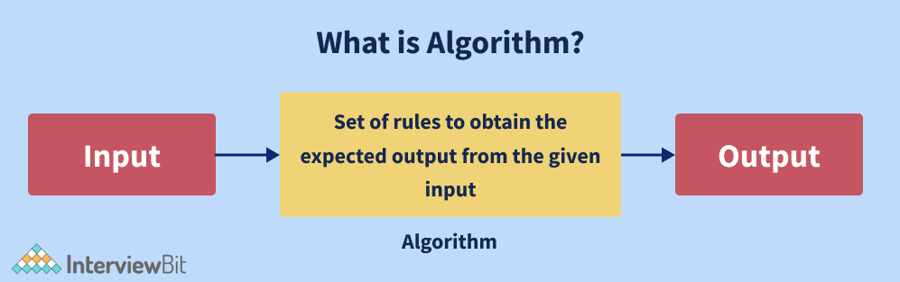
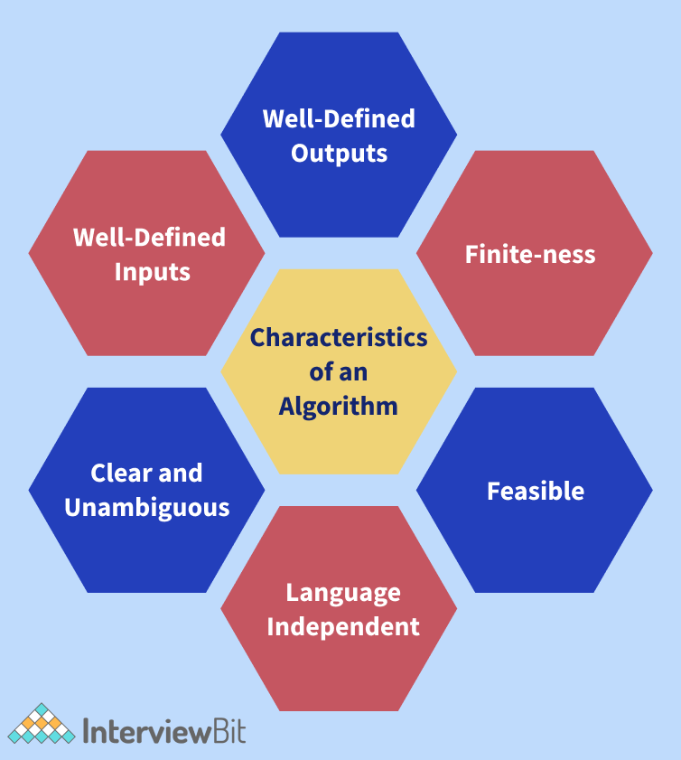
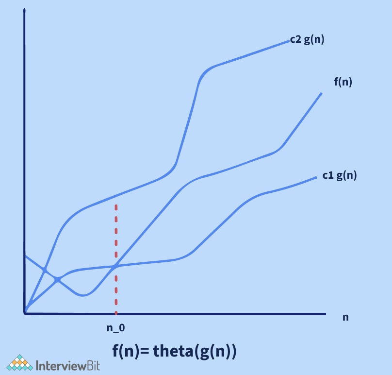
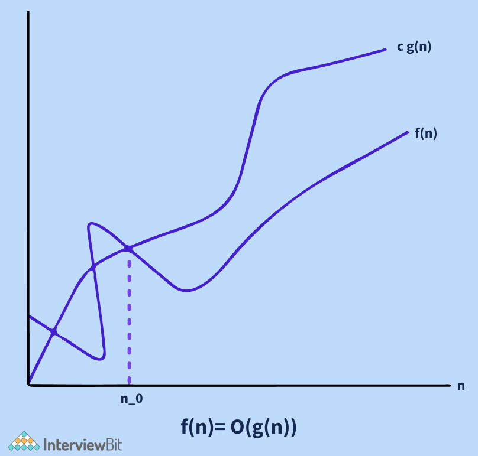
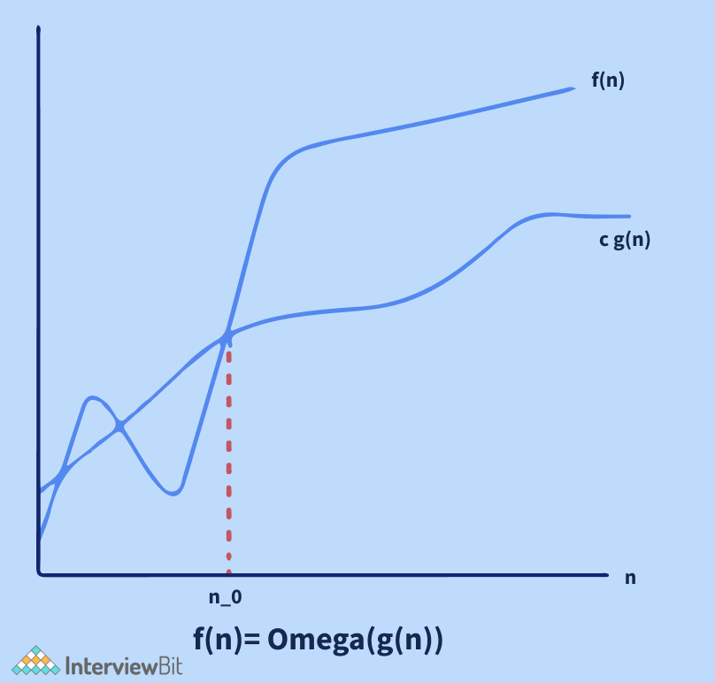
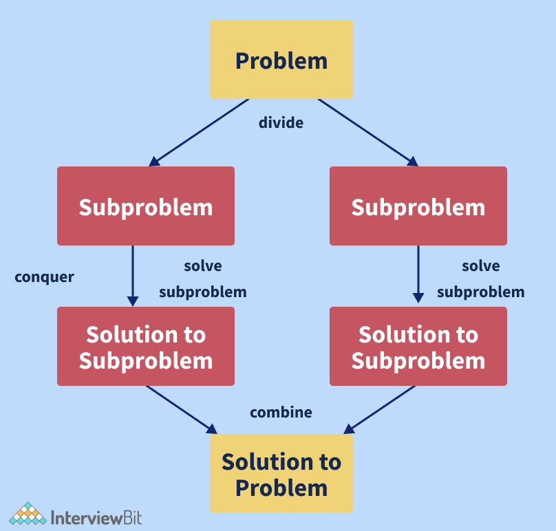
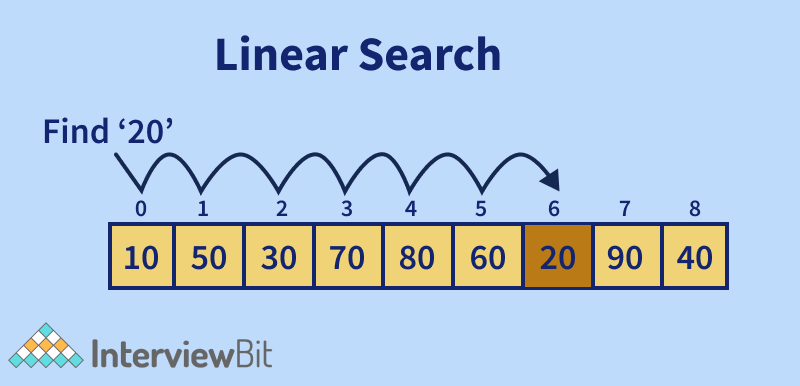
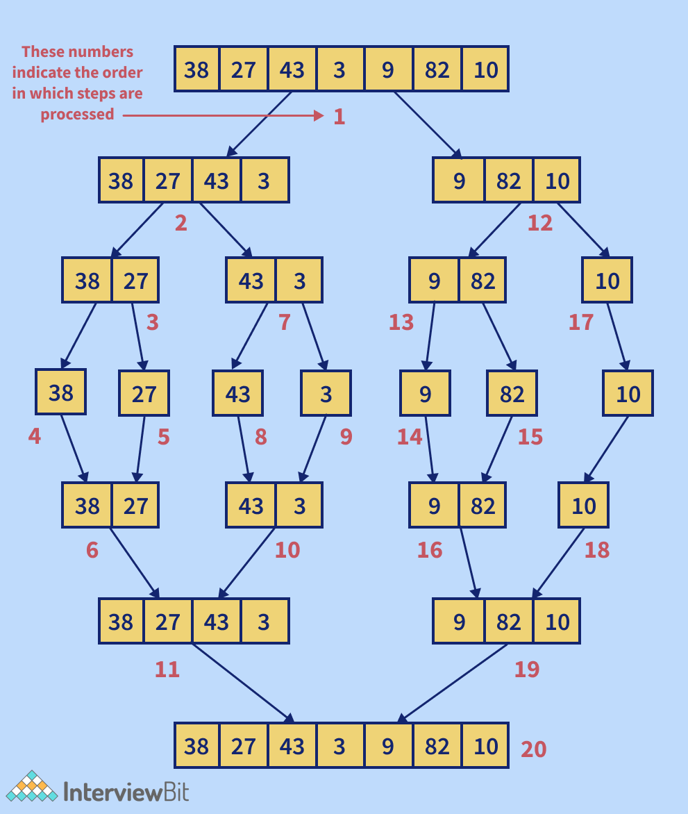

# Thuật toán


## Thuật toán là gì?

Cấu trúc dữ liệu và giải thuật là những khái niệm cốt lõi trong mọi buổi phỏng vấn dev, bất kể bạn là dev C, Java, Web hay Mobile. Dù là ở lĩnh vực nào trong công nghệ thông tin thì bạn cũng cần phải biết về giải thuật.



Một lập trình viên cần hiểu kỹ lưỡng về cả hai khái niệm là cấu trúc dữ liệu (mảng, danh sách liên kết, cây, ngăn xếp, hàng đợi,..) và các thuật toán như Tìm kiếm nhị phân, Quy Hoạch động,... Do đó, bài viết này chủ yếu tập trung vào thuật toán - giới thiệu về thuật toán, với 30 câu hỏi phỏng vấn về thuật toán.

Trước hết, câu hỏi đầu tiên và phổ biến nhất với hầu hết mọi người "Thuật toán là gì?". Câu trả lời đầy đủ có thể là: **Thuật toán là một tập hợp hữu hạn các hướng dẫn được xác định rõ ràng, có thể thực hiện được bằng máy tính, thường để giải quyết một lớp vấn đề hoặc để thực hiện một phép tính.**

Thuật toán thường được sử dụng để chỉ định cách tính toán, xử lý dữ liệu, suy luận tự động, ra quyết định tự động và các tác vụ khác cần được thực hiện. Thuật toán là một phương pháp hiệu quả, có thể được biểu diễn trong một khoảng không gian và thời gian hữu hạn, và bằng một ngôn ngữ hình thức được xác định rõ ràng để tính toán một hàm số. Bắt đầu từ trạng thái ban đầu và đầu vào ban đầu (input - có thể trống), khi được thực thi, sẽ tiến hành một hữu hạn các trạng thái kế tiếp được xác định rõ ràng, và cuối cùng là tạo ra đầu ra (output) và dừng ở trạng thái kết thúc. Sự chuyển đổi từ trạng thái này sang trạng thái khác không nhất thiết phải mang tính xác định, một số thuật toán được gọi là thuật toán ngẫu nhiên, kết hợp đầu vào ngẫu nhiên.

### Lợi ích của thuật toán

* Gia tăng sự hiệu quả của một giải pháp đã tồn tại.
* Dễ dàng sử dụng để so sánh hiệu suất của các thuật toán khác nhau cho cùng một vấn đề bằng cách dùng các phương pháp như độ phức tạp thời gian, độ phức tạp không gian,...
* Thuật toán cung cấp một bản thiết kế với các mô tả chi tiết cốt lõi để giải quyết vấn đề.
* Giúp hiểu đúng về luồng hoạt động của chương trình.
* Các thuật toán đánh giá mức độ hoạt động của các phương pháp tiếp cận trong các tình huống khác nhau (Trường hợp tốt nhất, trường hợp xấu nhất, trường hợp trung bình).
* Một thuật toán cũng xác định tài nguyên nào (input/output) là cần thiết.
* Ta có thể định lượng và đánh giá độ phức tạp của vấn đề về thời gian và không gian bằng cách sử dụng thuật toán.
* Chi phí thiết kế sẽ giảm nếu dùng các thuật toán thích hợp.



## Mục lục

[1. Làm thế nào để so sánh hai thuật toán trên cùng một vấn đề?](#1-làm-thế-nào-để-so-sánh-hai-thuật-toán-trên-cùng-một-vấn-đề)

[2. Trường hợp tốt nhất, xấu nhất và trung bình?](#2-trường-hợp-tốt-nhất-xấu-nhất-và-trung-bình)

[3. Bạn hiểu gì về ký hiệu tiệm cận?](#3-bạn-hiểu-gì-về-ký-hiệu-tiệm-cận)

[4. Viết chương trình đổi giá trị hai số mà không dùng biến tạm?](#4-viết-chương-trình-đổi-giá-trị-hai-số-mà-không-dùng-biến-tạm)

[5. Giải thích về mô hình Chia Để Trị. Liệt kê các thuật toán sử dụng mô hình này?](#5-giải-thích-về-mô-hình-chia-để-trị-liệt-kê-các-thuật-toán-sử-dụng-mô-hình-này)

[6. Giải thích về thuật toán tham lam và liệt kê các ví dụ sử dụng nó?](#6-giải-thích-về-thuật-toán-tham-lam-và-liệt-kê-các-ví-dụ-sử-dụng-nó)

[7. Bạn hiểu gì về thuật toán tìm kiếm? Liệt kê vài thuật toán tìm kiếm?](#7-bạn-hiểu-gì-về-thuật-toán-tìm-kiếm-liệt-kê-vài-thuật-toán-tìm-kiếm)

[8. Mô tả thuật toán tìm kiếm tuyến tính?](#8-mô-tả-thuật-toán-tìm-kiếm-tuyến-tính)

[9. Mô tả thuật toán tìm kiếm nhị phân?](#9-mô-tả-thuật-toán-tìm-kiếm-nhị-phân)

[10. Viết ra một thuật toán để thêm một nút vào danh sách liên kết được sắp xếp theo thứ tự tăng dần (duy trì thuộc tính sắp xếp)?](#10-viết-ra-một-thuật-toán-để-thêm-một-nút-vào-danh-sách-liên-kết-được-sắp-xếp-theo-thứ-tự-tăng-dần-duy-trì-thuộc-tính-sắp-xếp)

[11. Viết thuật toán đếm số nút lá trong cây nhị phân?](#11-viết-thuật-toán-đếm-số-nút-lá-trong-cây-nhị-phân)

[12. Quy hoạch động là gì? Liệt kê các vấn đề sử dụng quy hoạch động?](#12-quy-hoạch-động-là-gì-liệt-kê-các-vấn-đề-sử-dụng-quy-hoạch-động)

[13. Viết thuật toán đảo chuỗi. Ví dụ như nhập vào Hello đảo thành Olleh?](#13-viết-thuật-toán-đảo-chuỗi-ví-dụ-như-nhập-vào-hello-đảo-thành-olleh)

[14. Bạn hiểu gì về thuật toán BFS (Breadth First Search)?](#14-bạn-hiểu-gì-về-thuật-toán-bfs-breadth-first-search)

[15. Bạn hiểu gì về thuật toán DFS (Depth First Search)?](#15-bạn-hiểu-gì-về-thuật-toán-dfs-depth-first-search)

[16. Cách mà thuật toán mã hoá hoạt động?](#16-cách-mà-thuật-toán-mã-hoá-hoạt-động)

[17. Các thuật toán mã hoá phổ biến hiện nay?](#17-các-thuật-toán-mã-hoá-phổ-biến-hiện-nay)

[18. Mô tả thuật toán merge sort?](#18-mô-tả-thuật-toán-merge-sort)

[19. Mô tả thuật toán quick sort?](#19-mô-tả-thuật-toán-quick-sort)

[20. Mô tả thuật toán bubble cùng với ví dụ?](#20-mô-tả-thuật-toán-bubble-sort-cùng-với-ví-dụ)

[21. Viết thuật toán tính tổng mảng con lớn nhất của một mảng cho trước. Nói cách khác, tìm tổng lớn nhất có thể đạt được bằng cách lấy các phần tử được sắp xếp từ một mảng số nguyên cho trước?](#21-viết-thuật-toán-tính-tổng-mảng-con-lớn-nhất-của-một-mảng-cho-trước-nói-cách-khác-tìm-tổng-lớn-nhất-có-thể-đạt-được-bằng-cách-lấy-các-phần-tử-được-sắp-xếp-từ-một-mảng-số-nguyên-cho-trước)

[22. Giải thích Thuật toán Dijkstra để tìm đường đi ngắn nhất giữa một nút đến bất kỳ nút nào khác trong đồ thị?](#22-giải-thích-thuật-toán-dijkstra-để-tìm-đường-đi-ngắn-nhất-giữa-một-nút-đến-bất-kỳ-nút-nào-khác-trong-đồ-thị)

[23. Có thể sử dụng tìm kiếm nhị phân với danh sách liên kết không?](#23-có-thể-sử-dụng-tìm-kiếm-nhị-phân-với-danh-sách-liên-kết-không)

[24. Thuật toán đệ quy là gì? Nêu các quy tắc quan trọng mà mọi thuật toán đệ quy phải tuân theo?](#24-thuật-toán-đệ-quy-là-gì-nêu-các-quy-tắc-quan-trọng-mà-mọi-thuật-toán-đệ-quy-phải-tuân-theo)

[25. Viết một thuật toán để chèn một nút trong Cây tìm kiếm nhị phân?](#25-viết-một-thuật-toán-để-chèn-một-nút-trong-cây-tìm-kiếm-nhị-phân)

[26. Phân biệt select sort và insert sort?](#26-phân-biệt-select-sort-và-insert-sort)

[27. Định nghĩa duyệt cây và liệt kê một số thuật toán để duyệt cây nhị phân?](#27-định-nghĩa-duyệt-cây-và-liệt-kê-một-số-thuật-toán-để-duyệt-cây-nhị-phân)

[28. Mô tả thuật toán sắp xếp Heap sort?](#28-mô-tả-thuật-toán-sắp-xếp-heap-sort)

[29. Độ phức tạp không gian của thuật toán sắp xếp chèn là gì?](#29-độ-phức-tạp-không-gian-của-thuật-toán-sắp-xếp-chèn-là-gì)

[30. Độ phức tạp không gian của thuật toán sắp xếp lựa chọn là gì?](#30-độ-phức-tạp-không-gian-của-thuật-toán-sắp-xếp-lựa-chọn-là-gì)

## Câu hỏi phỏng vấn cho Fresher

### 1. Làm thế nào để so sánh hai thuật toán trên cùng một vấn đề?

Độ phức tạp của một thuật toán là một kỹ thuật được sử dụng để phân loại mức độ hiệu quả của một thuật toán so với các thuật toán khác. Nó tập trung vào kích thước của tập dữ liệu được xử lý ảnh hưởng đến thời gian thực thi như thế nào. Trong lập trình, tính toán độ phức tạp của thuật toán là rất quan trọng. Bạn nên phân loại các thuật toán theo lượng thời gian hoặc không gian mà chúng chiếm dụng và mô tả thời gian hoặc không gian mà chúng chiếm dưới dạng một hàm của kích thước đầu vào.

* **Độ phức tạp thời gian (Complex of Time)**: thời gian chạy của một chương trình được xem như một hàm phụ thuộc vào kích thước đầu vào được gọi là độ phức tạp thời gian.
* **Độ phức tạp không gian (Complex of Space)**: dựa trên không gian mà chương trình yêu cầu để xử lý hoàn tất một tác vụ.

> Trước đây, bộ nhớ phần cứng bị hạn chế nên độ phức tạp không gian là rất quan trọng, nhưng ngày nay bộ nhớ máy tính rất lớn, nên khi đề cập đến độ phức tạp người ta chủ yếu tập trung vào độ phức tạp thời gian.

### 2. Trường hợp tốt nhất, xấu nhất và trung bình?

Nền tảng toán học cho hiệu suất thực thi thuật toán được xác định bằng tiệm cận. Ta có thể quyết định trường hợp tốt nhất, xấu nhất và trung bình của một thuật toán bằng cách dùng tiệm cận.

* **Trường hợp tốt nhất:** là tập dữ liệu được sắp xếp sao cho thuật toán hoạt động nhanh nhất hay tốn ít không gian nhất. Ví dụ như trong tìm kiếm nhị phân, trường hợp tốt nhất là khi giá trị cần tìm ở giữa mảng dữ liệu, lúc đó thuật toán có độ phức tạp thời gian là `O(1)`.
* **Trường hợp xấu nhất:** ngược lại với trường hợp tốt nhất, là khi tập dữ liệu khiến thuật toán mất nhiều thời gian và không gian thực thi nhất. Ví dụ, trong quicksort trường hợp xấu nhất là khi giá trị `pivot` là phần tử lớn nhất hoặc nhỏ nhất của `sublist`, lúc này sẽ có độ phức tạp thời gian là `O(n^2)` với n là kích thước của tập dữ liệu cần sắp xếp.
* **Trường hợp trung bình:** theo lý thuyết về độ phức tạp, thì trường hợp trung bình là lượng tài nguyên mà chương trình cần dùng, được tính trung bình trên tất cả đầu vào có thể. Vd, độ phức tạp trung bình của quicksort là `O(n*log(n))`, với n là kích thước của tập dữ liệu cần sắp xếp.

### 3. Bạn hiểu gì về ký hiệu tiệm cận?

Phân tích tiệm cận là một kỹ thuật được dùng để xác định hiệu quả của một thuật toán mà không dựa vào các thông số kỹ thuật phần cứng và tránh để thuật toán so sánh chính nó với cách tiếp cận lãng phí thời gian. Với phân tích tiệm cận, ký hiệu tiệm cận là một kỹ thuật toán học được dùng để chỉ ra độ phức tạp thời gian của thuật toán.

Ta có 3 ký hiệu tiệm cận phổ biến như sau:

- **Ký hiệu theta (θ)**: dùng để xác định chính xác *dáng điệu tiệm cận*. Nó liên kết các hàm từ bên trên và bên dưới để xác định dáng điệu tiệm cận. Bỏ qua các số hạng bậc thấp và các hằng số đứng đầu là một cách đơn giản để lấy ký hiệu theta cho một biểu thức.



- **Ký hiệu O lớn**: dùng để xác định cận trên của một thuật toán. Xem xét thuật toán Insert Sort: trong trường hợp tốt nhất nó cần thời gian tuyến tính và trường hợp xấu nhất cần thời gian bậc hai. Insert Sort có độ phức tạp thời gian là (O(n^2)). Nó hữu ích khi ta chỉ có cận trên về độ phức tạp thời gian của thuật toán.



- **Ký hiệu omega (Ω)**: dùng để cung cấp cận dưới cho một hàm, ngược với ký hiệu O lớn. Nó hữu ích khi ta chỉ có cận dưới của độ phức tạp thời gian của thuật toán.



### 4. Viết chương trình đổi giá trị hai số mà không dùng biến tạm?

Đây là một câu hỏi thường gặp trong các cuộc phỏng vấn ở nhiều công ty khác nhau. Có nhiều cách để đổi giá trị cho hai số, tuy nhiên ở đây điều kiệu là không được dùng biến tạm. Đối với bài toán này, nếu bạn có thể giải quyết tình huống overflow bạn sẽ để lại ấn tượng tốt với người phỏng vấn.

Giả sử ta có hai số nguyên a và b, với `a=5` và `b=6` ta cần hoán đổi hai số này mà không cần dùng biến tạm, ta có thể làm như sau:

```java
a = a + b;
b = a - b; // this will act like (a+b) - b, and now b equals a.
a = a - b; // this will act like (a+b) - a, and now an equals b.
```

Đã xong, nhưng nó có một vấn đề là nếu phép cộng vượt quá giá trị lớn nhất của kiểu int (như `Integer.MAX_VALUE` trong Java) hoặc nếu phép trừ nhỏ hơn giá trị nhỏ nhất (`Integer.MIN_VALUE`) thì nó sẽ gây ra hiện tượng overflow.

#### Phương thức XOR

Để khắc phục vấn đề trên ta có thể dùng XOR, trong các ngôn ngữ như C, C++ hay Java có một toán tử bit là XOR (`^`).

```java
x = x ^ y; 
y = x ^ y; 
x = x ^ y;
```

### 5. Giải thích về mô hình Chia Để Trị. Liệt kê các thuật toán sử dụng mô hình này?

Chia để trị là một mô hình thuật toán, không phải thuật toán. Nó được xây dựng để xử lý một lượng lớn dữ liệu, bằng cách chia nhỏ nó thành từng phần nhỏ hơn và xác định giải pháp cho các phần nhỏ. Nó kết hợp giải pháp của tất cả phần nhỏ thành một giải pháp toàn cục duy nhất. Dưới đây là mô hình của chia để trị:

* **Devider**: Tách bài toán ban đầu thành một tập các bài toán con.
* **Conquer**: Giải quyết từng bài toán con đơn lẻ.
* **Combiner**: Kết hợp giải pháp của các bài toán con thành một giải pháp tổng thể.



Các thuật toán dùng mô hình chia để trị:

* Binary Search
* Merge Sort
* Strassen's Matrix Multiplication
* Quick Sort
* Closest pair of points

### 6. Giải thích về thuật toán tham lam và liệt kê các ví dụ sử dụng nó?

Thuật toán tham lam là một phương pháp nhằm mục địch chọn ra quyết định tối ưu nhất ở mỗi bước con, cuối cùng dẫn đến giải pháp tối ưu tổng thể. Tức là, tại mỗi thời điểm thuật toán luôn chọn câu trả lời tốt nhất ngay lập tức mà không cần cân nhắc tương lai. Cũng có thể nói thuật toán sẽ chọn ra câu trả lời tốt nhất hiện có, bất kể hậu quả là gì. Các thuật toán tham lam có thể tìm ra câu trả lời không phải là tối ưu nhất trong một số trường hợp.

Các ví dụ sử dụng thuật toán tham lam:

* Prim's Minimal Spanning Tree Algorithm
* Kruskal's Minimal Spanning Tree Algorithm
* Travelling Salesman Problem
* Fractional Knapsack Problem
* Dijkstra's Algorithm
* Job Scheduling Problem
* Graph Map Coloring
* Graph Vertex Cover

### 7. Bạn hiểu gì về thuật toán tìm kiếm? Liệt kê vài thuật toán tìm kiếm?

Thuật toán tìm kiếm được sử dụng để tìm kiếm một phần tử hoặc lấy nó ra từ một cấu trúc dữ liệu (thường là một danh sách các phần tử). Các thuật toán này được chia thành hai loại dựa trên loại hoạt động tìm kiếm:

* **Tìm kiếm tuần tự**: Phương pháp này duyệt qua danh sách các phần tử liên tục, kiểm tra từng phần tử và báo cáo nếu phần tử cần tìm có được tìm thấy hay không. Tìm kiếm tuyến tính là một ví dụ về Thuật toán tìm kiếm tuần tự.
* **Tìm kiếm theo khoảng**: các thuật toán này được tạo đặc biệt cho tìm kiếm trên các cấu trúc dữ liệu đã sắp xếp. Vì nó hướng đến tìm kiếm ở trung tâm cấu trúc và chia ra thành các khoảng nhỏ, để tìm kiếm mục tiêu. Các loại thuật toán này hiệu quả hơn nhiều so với tìm kiếm tuần tự. Tìm kiếm Nhị phân là một ví dụ về tìm kiếm theo khoảng

### 8. Mô tả thuật toán tìm kiếm tuyến tính?

Để tìm kiếm một phần tử trong một tập hợp phần tử, có thể sử dụng tìm kiếm tuyến tính. Nó hoạt động bằng cách duyệt qua tập phần tử từ đầu đến cuối và quan sát thuộc tính của tất cả phần tử đã đi qua. Giả sử ta có trường hợp với mảng chỉ toàn số nguyên, ta muốn tìm và in tất cả vị trí của phần tử trùng với một giá trị cụ thể (còn gọi là `key` trong tìm kiếm tuyến tính). Tìm kiếm tuyến tính hoạt động như sau:

1. Dùng vòng lặp duyệt qua danh sách phần tử đã cho.
2. Với mỗi lần lặp, so sánh giá trị hiện tại với key.
3. Nếu trùng in ra vị trí của phần tử hiện tại.
4. Chuyển đến phần tử kế tiếp nếu giá trị không trùng.
5. Lặp lại từ 1 đến 4 cho đến khi hết danh sách.



Độ phức tạp thời gian của thuật toán tìm kiếm tuyến tính là `O(n)` trong đó n là kích thước của danh sách các phần tử và độ phức tạp không gian của nó là không đổi, nghĩa là `O(1)`.

### 9. Mô tả thuật toán tìm kiếm nhị phân?

Để áp dụng tìm kiếm nhị phân trên danh sách các phần tử, điều kiện tiên quyết là danh sách các phần tử phải được sắp xếp. Nó dựa trên mô hình thuật toán Chia để Trị. Trong tìm kiếm nhị phân, ta chia khoảng tìm kiếm thành hai phần để tìm trong danh sách đã sắp xếp. Ta bắt đầu bằng cách tạo khoảng trên toàn bộ danh sách. Nếu giá trị của khoá tìm kiếm nhỏ hơn phần tử ở giữa khoảng, thì khoảng đó được thu hẹp về trước, còn không nó sẽ được thu hẹp về sau. Ta tiếp tục thực hiện chia trên các khoảng nhỏ cho đến khi tìm được kết quả. Dưới đây là mô tả thuật toán tìm kiếm nhỉ phân.

1. `x` sẽ được so sánh với phần tử ở giữa
2. Trả về nếu `x` trùng với phần tử ở giữa
3. Ngược lại nếu `x` lớn hơn, `x` chỉ có thể ở nữa phía sau của mảng vì mảng được sắp xếp theo thứ tự tăng dần. Ta lặp lại với nữa mảng con phía sau.
4. Nếu như `x` bé hơn, `x` chỉ có thể ở nữa phía trước của mảng, ta lặp lại với nữa mảng con phía trước.
5. Nếu các khoảng được chia chỉ còn một phần tử(không thể chia nữa), ta dừng tìm kiếm nhị phân.

Độ phức tạp thời gian của tìm kiếm nhị phân là `O(log(n))` với n là kích thước của danh sách phần tử và độ phức tạp không gian là `O(1)`

### 10. Viết ra một thuật toán để thêm một nút vào danh sách liên kết được sắp xếp theo thứ tự tăng dần (duy trì thuộc tính sắp xếp)?

Dưới đây là một thuật toán để thêm một nút vào danh sách liên kết được sắp xếp:

1. Kiểm tra danh sách liên kết có rỗng hay không. Nếu có tạo nút `head` và trả về.
2. Kiểm tra giá trị của nút thêm vào có nhỏ hơn nút `head` hay không. Nếu có, đặt nó ở đầu và biến nó thành `head`.
3. Nếu không thì thì sử dụng vòng lặp để thêm nút đó vào vào vị trí thích hợp. Bằng cách bắt đầu duyệt từ nút `head` trỏ đến phần tử kế tiếp cho đến khi tìm được nút có giá trị lớn hơn nút đầu vào.
4. Sau khi tìm được vị trí cần chèn thì thực hiện chèn nút.

### 11. Viết thuật toán đếm số nút lá trong cây nhị phân?

Dưới đây là một thuật toán để đếm số lượng nút lá trong cây nhị phân:

1. Nếu nút hiện tại là null, trả về giá trị 0.
2. Nếu gặp phải nút lá, nghĩa là nếu nút trái và nút phải của nút hiện tại đều rỗng, thì trả về 1.
3. Tính đệ quy số nút lá bằng cách cộng số nút lá trong cây con bên trái với số nút lá trong cây con bên phải.

### 12. Quy hoạch động là gì? Liệt kê các vấn đề sử dụng quy hoạch động?


Quy hoạch động chủ yếu là tối ưu hoá đệ quy. Ta có thể sử dụng Quy hoạch động để tối ưu hoá bất kỳ giải pháp đệ quy nào có các lời gọi lặp lại cho cùng một đầu vào. Mục đích đơn giản là để lưu trữ kết quả các vấn đề con cho lần tính toán tiếp theo. Độ phức tạp thời gian của sự tối ưu hoá này được giảm theo cấp số nhân. Ví dụ: nếu  ta tạo một giải pháp đệ quy đơn giản cho số Fibonacci, thì độ phức tạp về thời gian là cấp số nhân, nhưng nếu ta tối ưu hóa nó bằng cách lưu trữ các câu trả lời cho các bài toán con bằng Quy hoạch động, thì độ phức tạp về thời gian là tuyến tính. 

Code minh hoạ như sau:

**Với đệ quy (không QHĐ)**: Độ phức tạp về thời gian của code đã cho sẽ theo cấp số nhân.

```cpp
int nFibonacci(int n){
   if(n == 0 || n == 1) return n;
   else return nFibonacci(n - 1) + nFibonacci(n - 2);
}
```

**Với đệ quy (dùng QHĐ)**: Độ phức tạp về thời gian của code đã cho sẽ là tuyến tính.

```cpp
int nFibonacci(int n){
   vector<int> fib(n + 1);
   fib[0] = 0;
   fib[1] = 1;
   for(int i = 2;i <= n;i ++){
      fib[i] = fib[i - 1] + fib[i - 2];
   }
   return fib[n]; 
}
```

Một vài vấn đề cần dùng Quy Hoạch động:
- Tìm số Fibonacci thứ n
- Tìm chuỗi con chung dài nhất giữa hai chuỗi.
- Tìm chuỗi con Palindromic dài nhất trong một chuỗi.
- Vấn đề Knapsack (hoặc 0-1) rời rạc.
- Đường đi ngắn nhất giữa hai nút bất kỳ trong đồ thị (Thuật toán Floyd Warshall).

### 13. Viết thuật toán đảo chuỗi. Ví dụ như nhập vào Hello đảo thành Olleh?

Thuật toán cho đảo chuỗi như sau:

1. Ta có hai biến là `l` và `r`.
2. Gán giá trị cho `l` là 0 và `r` là chiều dài chuỗi - 1.
3. Hoán đổi giá trị của các ký tự ở vị trí `l` và `r` trong chuỗi.
4. Tăng `l` lên một đơn vị.
5. Giảm `r` xuống một đơn vị.
6. Nếu giá trị `r` lớn hơn `l`, trở về bước 3.
7. Dừng.

### 14. Bạn hiểu gì về thuật toán BFS (Breadth First Search)?

Thuật toán duyệt đồ thị ưu tiên chiều rộng (Breadth-first search - BFS) là một trong những thuật toán tìm kiếm cơ bản và thiết yếu trên đồ thị. Mà trong đó, những đỉnh nào gần đỉnh xuất phát hơn sẽ được duyệt trước. Nó bắt đầu bằng cách duyệt qua đồ thị từ nút gốc và đi đến tất cả các nút lân cận. Nó chọn nút gần nhất và từ đó truy cập tất cả các nút chưa được truy cập. Cho đến khi nó đến nút mục tiêu, thuật toán lặp lại cùng một phương pháp cho mỗi nút gần nhất.

Thuật toán BFS được đưa ra dưới đây:

1. Đặt `status = 1` làm bước đầu tiên cho tất cả các nút (trạng thái sẵn sàng).
2. Đặt `status` của nút ban đầu A là `2`, tức là trạng thái chờ.
3. Lặp lại các bước 4 và 5 cho đến khi đầy hàng đợi.
4. Dequeue và xử lý nút N từ hàng đợi, thiết lập `status` của nó thành 3, nghĩa là trạng thái đã xử lý.
5. Đặt tất cả nút lân cận của N đang ở trạng thái sẵn sàng (`status = 1`) vào hàng đợi và chuyển `status` của chúng thành 2 (trạng thái chờ)
6. Thoát.

### 15. Bạn hiểu gì về thuật toán DFS (Depth First Search)?

Tìm kiếm ưu tiên chiều sâu hay tìm kiếm theo chiều sâu là một kỹ thuật để duyệt hoặc tìm kiếm trên các cấu trúc dữ liệu như cây và đồ thị. Thuật toán bắt đầu ở nút gốc (trong trường hợp đồ thị, bất kỳ nút ngẫu nhiên nào cũng có thể được sử dụng làm nút gốc) và kiểm tra từng nhánh càng xa càng tốt trước khi kiểm tra lại. Vì vậy, ý tưởng cơ bản là bắt đầu tại gốc hoặc bất kỳ nút nào tùy ý và đánh dấu nó, sau đó tiến tới nút không được đánh dấu tiếp theo và lặp lại cho đến khi không còn nút nào chưa được đánh dấu. Sau đó, quay lại và kiểm tra xem có bất kỳ nút nào chưa được đánh dấu để vượt qua không. Cuối cùng, in các nút của đường đi. Thuật toán DFS được đưa ra dưới đây:

1. Tạo một hàm đệ quy lấy chỉ mục của nút và một mảng đã đi qua làm đầu vào.
2. Đặt nút hiện tại thành nút đã truy cập và hiển thị nó.
3. Gọi hàm đệ quy với chỉ mục của nút liền kề sau khi đi ngang qua tất cả các nút lân cận và không được đánh dấu.

## Câu hỏi phỏng vấn cho Experienced

### 16. Cách mà thuật toán mã hoá hoạt động?

Quá trình chuyển đổi từ văn bản thuần (plaintext) thành một dạng mã bí mật "ciphertext" được gọi là quá trình mã hoá. Trong mật mã học, kỹ thuật này sử dụng một chuỗi còn gọi là "khoá" để chuyển đổi văn bản. Khoá càng lớn càng có nhiều bản tiềm năng để tạo thành bản mã hoá - ciphertext. Phần lớn các thuật toán mã hóa sử dụng các khối đầu vào cố định với độ dài từ 64 đến 128 bit, trong khi các thuật toán khác sử dụng kỹ thuật dòng.

### 17. Các thuật toán mã hoá phổ biến hiện nay?

Một số thuật toán mật mã được sử dụng rộng rãi nhất như sau:

- IDEA
- CAST
- CMEA
- 3-way
- Blowfish
- GOST
- LOKI
- DES và Triple DES.

### 18. Mô tả thuật toán merge sort?

Merge sort (tạm dịch là sắp xếp trộn) là một thuật toán sắp xếp đa dụng có hiệu quả rất cao. Nó được xếp vào thể loại sắp xếp so sánh. Năm 1945, John von Neumann đã phát minh ra phương pháp sắp xếp trộn, dựa trên mô hình thuật toán chia để trị. Sau đây là cách sắp xếp trộn hoạt động:
- Chia danh sách chưa được sắp xếp thành n danh sách con,  mỗi danh sách có một phần tử (danh sách một phần tử được coi là đã sắp xếp).
- Gộp các danh sách con nhiều lần để tạo ra danh sách con được sắp xếp mới cho đến khi chỉ còn lại một danh sách con. Danh sách con cuối cùng chính là danh sách đã sắp xếp.

Độ phức tạp thời gian của sắp xếp trộn là `O(n*log(n))` với n là kích thước của danh sách phần tử cần sắp xếp, còn độ phức tạp không gian là `O(n)`.



### 19. Mô tả thuật toán quick sort?

Quicksort (tạm dịch là sắp xếp nhanh) là một thuật toán sắp xếp tại chỗ (có nghĩa là một thuật toán biến đổi đầu vào mà không sử dụng cấu trúc dữ liệu phụ). Nó được tạo ra bởi nhà khoa học máy tính người Anh Tony Hoare vào năm 1959 và được công bố vào năm 1961, đến nay nó vẫn là một thuật toán sắp xếp phổ biến. Nó có thể nhanh hơn một chút so với merge sort và nhanh hơn hai hoặc ba lần so với heap sort khi được thực hiện đúng cách. 

Quicksort dựa trên mô hình thuật toán chia để trị. Nó thực hiện bằng cách chọn một phần tử "pivot" từ mảng và tách mảng thành hai mảng con dựa trên việc các phần tử còn lại lớn hơn hay bé hơn pivot. Do đó, nó còn được gọi là sắp xếp phân vùng. Mảng con sau đó sẽ được sắp xếp với đệ quy.

Sau đây là các bước cho quicksort:

- Nếu có ít hơn hai phần tử trong mảng, trả về ngay lập tức vì không thể làm gì khác. 

- Nếu không, chọn một giá trị làm `pivot` (chốt), cách lựa chọn là tuỳ ý, song vẫn có một số cách lựa chọn tiêu biểu như sau:
   + Chọn phần tử đứng đầu hoặc đứng cuối.
   + Chọn phần tử đứng giữa.
   + Chọn phần tử trung vị trong 3 phần tử đứng đầu, đứng giữa và đứng cuối.
   + Chọn phần tử ngẫu nhiên. (Cách này có thể dẫn đến khả năng rơi vào các trường hợp đặc biệt)

- Xác định điểm phân chia sao cho tất cả các phần tử có giá trị nhỏ hơn `pivot` đều xuất hiện trước và tất cả các phần tử có giá trị lớn hơn `pivot` sẽ xuất hiện sau nó; các phần tử có giá trị bằng `pivot` có thể xuất hiện theo một trong hai hướng.

- Áp dụng quicksort đệ quy lên các phạm vi con cả trước và sau điểm phân chia, loại bỏ phần tử bằng `pivot` tại điểm phân chia khỏi cả hai phạm vi.


Phân tích toán học của Quicksort cho thấy rằng, trường hợp trung bình sẽ mất độ phức tạp thời gian `O(n * log(n))` để sắp xếp n mục. Trong trường hợp xấu nhất, nó phải thực hiện với độ phức tạp thời gian là `O(n ^ 2)`.

### 20. Mô tả thuật toán bubble sort cùng với ví dụ?

Sắp xếp nổi bọt là một thuật toán sắp xếp cơ bản lặp lại qua một danh sách, so sánh các phần tử liền kề và hoán đổi chúng nếu chúng không theo thứ tự. Danh sách được lặp đi lặp lại nhiều lần cho đến khi nó được sắp xếp. Phương pháp này được đặt tên theo cách mà các phần tử nhỏ hơn hoặc lớn hơn "nổi bọt" lên đầu danh sách. Phương pháp đơn giản này hoạt động không tốt trong các tình huống thực tế và chủ yếu được sử dụng trong giảng dạy. Lấy một ví dụ để hiểu cách sắp xếp nổi bọt hoạt động:

Giả sử rằng mảng cần sắp xếp là (50 10 40 20 80). Các lần sắp xếp nổi bọt như sau:

- **Lần đầu tiên**:
   + (50 10 40 20 80) -> (10 50 40 20 80), Vì 50 > 10, thuật toán so sánh hai phần tử đầu tiên và hoán đổi chúng.
   + (10 50 40 20 80) -> (10 40 50 20 80), Vì 50 > 40, thuật toán hoán đổi các giá trị ở vị trí thứ hai và thứ ba.
   + (10 40 50 20 80) -> (10 40 20 50 80), Vì 50 > 20, thuật toán hoán đổi phần tử thứ ba và thứ tư.
   + (10 40 20 50 80) -> (10 40 20 50 80), không hoán đổi phần tử thứ tư và thứ năm vì chúng đã có thứ tự (80 > 50).
- **Lần thứ hai**:
   + (10 40 20 50 80) -> (10 40 20 50 80), Các phần tử ở vị trí thứ nhất và thứ hai theo thứ tự nên không hoán đổi vị trí.
   + (10 40 20 50 80) -> (10 20 40 50 80), Vì 40 > 20, thuật toán hoán đổi các giá trị ở vị trí thứ hai và thứ ba.
   + (10 20 40 50 80) -> (10 20 40 50 80), Các phần tử ở vị trí thứ ba và thứ tư theo thứ tự nên không hoán đổi vị trí.
(10 20 40 50 80) -> (10 20 40 50 80), Các phần tử ở vị trí thứ tư và thứ năm theo thứ tự nên không hoán đổi vị trí.

Mảng hiện tại đã được sắp xếp, nhưng thuật toán nổi bọt không biết điều đó. Để chắc chắn, nó phải hoàn thành một vòng lặp nữa mà không có bất kỳ sự hoán đổi nào.

- **Lần thứ hai**:
   + ( 10 20 40 50 80 ) –> ( 10 20 40 50 80 ), Các phần tử ở vị trí thứ nhất và thứ hai theo thứ tự nên không hoán đổi vị trí.
   + ( 10 20 40 50 80 ) –> ( 10 20 40 50 80 ), Các phần tử ở vị trí thứ hai và thứ ba theo thứ tự nên không hoán đổi vị trí.
   + ( 10 20 40 50 80 ) –> ( 10 20 40 50 80 ), Các phần tử ở vị trí thứ ba và thứ tư theo thứ tự nên không hoán đổi vị trí.
   + ( 10 20 40 50 80 ) –> ( 10 20 40 50 80 ), Các phần tử ở vị trí thứ tư và thứ năm theo thứ tự nên không hoán đổi vị trí.

### 21. Viết thuật toán tính tổng mảng con lớn nhất của một mảng cho trước. Nói cách khác, tìm tổng lớn nhất có thể đạt được bằng cách lấy các phần tử được sắp xếp từ một mảng số nguyên cho trước?

Thuật toán Kadane có thể được sử dụng để tìm tổng mảng con lớn nhất cho một mảng nhất định. Từ trái sang phải, thuật toán của Kadane tìm kiếm mảng được cung cấp. Sau đó, nó tính toán mảng con có tổng lớn nhất kết thúc ở vị trí `j` trong bước thứ `j` và tổng này được lưu trữ trong biến `currentSum`. Sau đó, nó tính toán mảng con với tổng lớn nhất ở bất kỳ vị trí nào trong mảng con bắt đầu từ vị trí đầu tiên đến vị trí thứ `j`, nghĩa là `A[1 ... j]` và lưu trữ nó trong biến `bestSum`. Điều này được thực hiện bằng cách lấy giá trị lớn nhất của biến `currentSum` cho đến bây giờ và sau đó lưu trữ nó trong biến `bestSum`. Cuối cùng, giá trị của `bestSum` được trả về là câu trả lời cuối cùng cho vấn đề của chúng ta.

Mã giả:

```
Step 1: Khởi tạo biến:
bestSum = INT_MIN
currentSum = 0 // nếu mảng trống, giá trị khởi tạo là 0
Step 2: Lặp qua tất cả phần tử trong mảng A
   (a) currentSum  = currentSum  + A[i]
   (b) if(bestSum < currentSum)
      bestSum = currentSum 
   (c) if(currentSum  < 0)
      currentSum = 0
Step 3: return bestSum
```

### 22. Giải thích Thuật toán Dijkstra để tìm đường đi ngắn nhất giữa một nút đến bất kỳ nút nào khác trong đồ thị?

Thuật toán Dijkstra là một phương pháp xác định đường đi ngắn nhất giữa các nút trong đồ thị, có thể được sử dụng để mô tả mạng lưới đường. Edsger W. Dijkstra, một nhà khoa học máy tính, đã tạo ra nó vào năm 1956 và công bố nó ba năm sau đó. Có rất nhiều biến thể của thuật toán. Thuật toán Dijkstra ban đầu dùng để tìm ra đường đi ngắn nhất giữa hai nút, nhưng một biến thể nổi tiếng hơn đã đặt một nút duy nhất làm nút "nguồn" và tìm các đường đi ngắn nhất từ ​​nguồn đến tất cả các nút khác trong đồ thị. Chúng ta hãy xem xét Thuật toán Dijkstra để tìm đường đi ngắn nhất giữa một nút nhất định trong đồ thị đến bất kỳ nút nào khác:

Đầu tiên ta gọi nút nơi chúng ta bắt đầu quá trình là nút ban đầu. Khoảng cách từ nút ban đầu đến Y là khoảng cách của nút Y.Thuật toán Dijkstra sẽ bắt đầu với khoảng cách không giới hạn và cố gắng cải thiện chúng trong từng bước:

   - Bước 1: Đánh dấu tất cả các nút chưa được truy cập. Tập hợp chưa được truy cập là tập hợp tất cả các nút chưa được truy cập.
   - Bước 2: Gán giá trị khoảng cách dự kiến ​​cho mỗi nút: đặt nó thành 0 cho nút đầu tiên của chúng ta và vô cùng cho tất cả các nút khác. Độ dài của đường đi ngắn nhất được phát hiện cho đến nay giữa nút `v` và nút ban đầu là khoảng cách dự kiến ​​của nút `v`. Bởi vì không có đỉnh nào khác ngoài nút ban đầu, tất cả các khoảng cách dự kiến ​​khác được đặt thành vô cùng. Đặt nút hiện tại là nút ban đầu
   - Bước 3: Xem xét tất cả các nút lân cận không được truy cập của nút hiện tại và xác định khoảng cách gần đúng của chúng qua nút hiện tại. So sánh khoảng cách dự kiến ​​mới được tính toán với giá trị được chỉ định hiện tại và chọn giá trị nhỏ hơn. Nếu nút hiện tại `A` có khoảng cách là 5 và cạnh liên kết nó với nút lân cận `B` có độ dài là 3 thì khoảng cách từ B đến A sẽ là 5 +3 = 8. Thay đổi B thành 8 nếu trước đó nó được đánh dấu bằng khoảng cách lớn hơn 8. Nếu không, giá trị hiện tại sẽ được giữ lại.
   - Bước 4: Đánh dấu nút hiện tại là đã được truy cập và xóa nó khỏi tập hợp chưa được truy cập khi chúng ta đã xem xét tất cả các nút lân cận chưa được truy cập của nút hiện tại. Một nút đã được truy cập sẽ không bao giờ được kiểm tra lại.
   - Dừng lại nếu nút đích đã được đánh dấu là đã truy cập hoặc nếu khoảng cách dự kiến ​​nhỏ nhất giữa các nút trong tập hợp chưa truy cập là vô cùng. Thuật toán hoàn tất.
   - Bước 5: Nếu không, hãy quay lại bước 3 và chọn nút chưa truy cập được chỉ định với khoảng cách dự kiến ​​ngắn nhất làm nút hiện tại mới.


Không bắt buộc phải đợi cho đến khi nút đích được "truy cập" như mô tả ở trên, trong khi xây dựng một đường đi: thuật toán có thể kết thúc khi nút đích có khoảng cách dự kiến nhỏ nhất trong số tất cả các nút "chưa được truy cập" (và do đó có thể được chọn là nút tiếp theo "hiện tại"). Đối với các đồ thị có hướng tùy ý với trọng số không giới hạn, thuật toán Dijkstra là tiệm cận của thuật toán đường đi ngắn nhất với nguồn đơn nhanh nhất được biết đến với độ phức tạp theo thời gian là `O(|E| + |V|log(|V|))`, trong đó |V| là số nút và |E| là số cạnh trong đồ thị.

### 23. Có thể sử dụng tìm kiếm nhị phân với danh sách liên kết không?

Không. Bởi vì truy cập ngẫu nhiên không thể thực hiện trong danh sách liên kết, việc truy cập phần tử ở giữa trong thời gian không đổi hoặc O(1) là không thể. Do đó, việc sử dụng thuật toán tìm kiếm nhị phân trên danh sách được liên kết là không thể.

### 24. Thuật toán đệ quy là gì? Nêu các quy tắc quan trọng mà mọi thuật toán đệ quy phải tuân theo?

Thuật toán đệ quy là một cách giải quyết một vấn đề phức tạp bằng cách chia nó thành các bài toán con nhỏ hơn và nhỏ hơn nữa cho đến khi vấn đề đủ nhỏ để giải quyết nhanh chóng. Nó thường liên quan đến một hàm gọi chính nó (thuộc tính của hàm đệ quy).

Ba quy tắc phải được tuân theo bởi tất cả các thuật toán đệ quy như sau:

1. Một thuật toán đệ quy phải gọi chính nó, một cách đệ quy.
2. Một thuật toán đệ quy phải có một trường hợp cơ sở.
3. Một thuật toán đệ quy phải thay đổi trạng thái của nó và chuyển sang trường hợp cơ sở.

### 25. Viết một thuật toán để chèn một nút trong Cây tìm kiếm nhị phân?

Dưới đây là một thuật toán để chèn một nút trong Cây tìm kiếm nhị phân:

1. Gán nút hiện tại cho `root`.
2. Nếu giá trị của `root` lớn hơn giá trị được thêm vào:
   - Nếu `root` có nút con bên trái, hãy chuyển sang bên trái.
   - Còn không thì chèn nó ở đây.
3. Nếu giá trị của `root` nhỏ hơn giá trị được thêm vào:
   - Nếu `root` có nút con bên phải, hãy chuyển sang bên phải.
   - Còn không thì chèn nó ở đây.

### 26. Phân biệt select sort và insert sort?

**Insert Sort**: Sắp xếp chèn phân tách danh sách thành các danh sách con được sắp xếp và không được sắp xếp. Nó sẽ chèn từng phần tử vào vị trí thích hợp trong danh sách con được sắp xếp. Sau khi chèn, đầu ra là một danh sách con được sắp xếp. Nó hoạt động lặp đi lặp lại trên tất cả các phần tử của danh sách con không được sắp xếp và chèn chúng vào danh sách con được sắp xếp theo thứ tự.

**Select Sort**: Sắp xếp lựa chọn là một kỹ thuật sắp xếp tại chỗ. Nó tách bộ sưu tập dữ liệu thành các danh sách con được sắp xếp và không được sắp xếp. Phần tử tối thiểu từ danh sách con chưa được sắp xếp sau đó được chọn và đặt trong danh sách đã sắp xếp. Điều này lặp lại cho đến khi tất cả các phần tử trong danh sách con chưa được sắp xếp đã được sử dụng bởi danh sách con được sắp xếp.

*Lưu ý*: Cả hai đều dùng hai danh sách con, đã sắp xếp và chưa sắp xếp, đồng thời đặt từng phần tử vào danh sách con đã sắp xếp. Sắp xếp chèn lấy phần tử hiện được chọn và đặt nó vào mảng đã sắp xếp ở đúng điểm trong khi vẫn giữ các thuộc tính sắp xếp chèn. Mặt khác, sắp xếp lựa chọn tìm kiếm phần tử nhỏ nhất trong danh sách con chưa được sắp xếp và thay thế nó với phần tử hiện tại.

### 27. Định nghĩa duyệt cây và liệt kê một số thuật toán để duyệt cây nhị phân?

Quá trình truy cập tất cả các nút của một cây được gọi là quá trình duyệt qua cây.

Một số thuật toán để duyệt cây nhị phân như sau:
- Duyệt tiền thứ tự.
- Duyệt trung thứ tự.
- Duyệt hậu thứ tự.
- Tìm kiếm theo chiều sâu.
- Duyệt ZigZag.

### 28. Mô tả thuật toán sắp xếp Heap sort?

Heap sort là thuật toán dựa trên so sánh. Heap sort tương tự selection sort trong đó nó chia mảng đầu vào thành hai mảng con đã sắp xếp và chưa sắp xếp, nó giảm phạm vi mảng chưa được sắp xếp cho đến phần tử cuối cùng và đặt nó vào mảng đã sắp xếp. Không giống như selection sort, heap sort không phải lãng phí thời gian cho quét mảng chưa sắp xếp một cách tuyến tính, thay vào đó nó giữ mảng chưa sắp xếp ở cấu trúc dữ liệu heap để xác định phần tử lớn nhất trong từng bước mở rộng.

Đầu tiên heap sort chuyển đổi mảng sang heap. Với heap giá trị lớn nhất được lưu ở gốc. Thuật toán hoán đổi giá trị gốc và giá trị cuối cùng của heap, sau đó giảm kích thước của heap đi 1 và lọc giá trị đầu tiên mới vào vị trí heap của nó. Quá trình này lặp đi lặp lại cho đến khi kích thước của heap là 1.

- Với danh sách, hãy dùng hàm `buildMaxHeap()`. Hàm này còn được gọi là `heapify()` tạo một heap từ một danh sách trong thác tác O(n).
- Hoán đổi phần tử đầu và cuối của heap. Giảm kích thước của nó đi 1.
- Để sàng lọc phần tử ban đầu mới vào chỉ mục thích hợp của nó trong heap, hãy sử dụng hàm `siftDown()`.
- Trừ khi kích thước của heap là một, lặp lại bước 2.

### 29. Độ phức tạp không gian của thuật toán sắp xếp chèn là gì?

Sắp xếp chèn là một phương pháp sắp xếp tại chỗ, có nghĩa là nó không yêu cầu bất kỳ lưu trữ dữ liệu bổ sung nào. Trong sắp xếp chèn, chỉ một phần tử danh sách duy nhất phải được lưu trữ bên ngoài dữ liệu ban đầu, dẫn đến độ phức tạp không gian không đổi hoặc độ phức tạp không gian O (1).

### 30. Độ phức tạp không gian của thuật toán sắp xếp lựa chọn là gì?

Sắp xếp lựa chọn là một phương pháp sắp xếp tại chỗ, có nghĩa là nó không yêu cầu bất kỳ bộ nhớ bổ sung hoặc lưu trữ dữ liệu tối thiểu nào. Do đó, thuật toán sắp xếp lựa chọn có độ phức tạp không gian không đổi hoặc độ phức tạp không gian O (1).