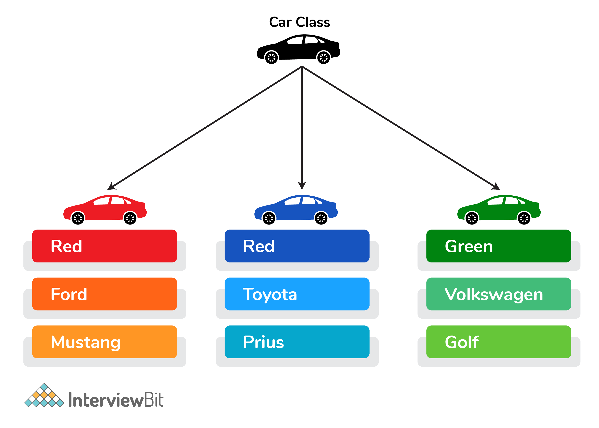
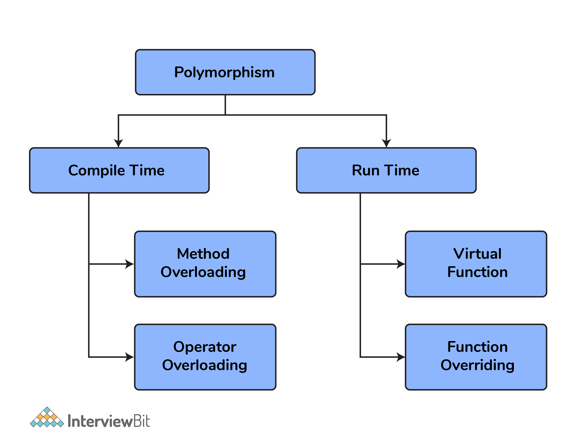
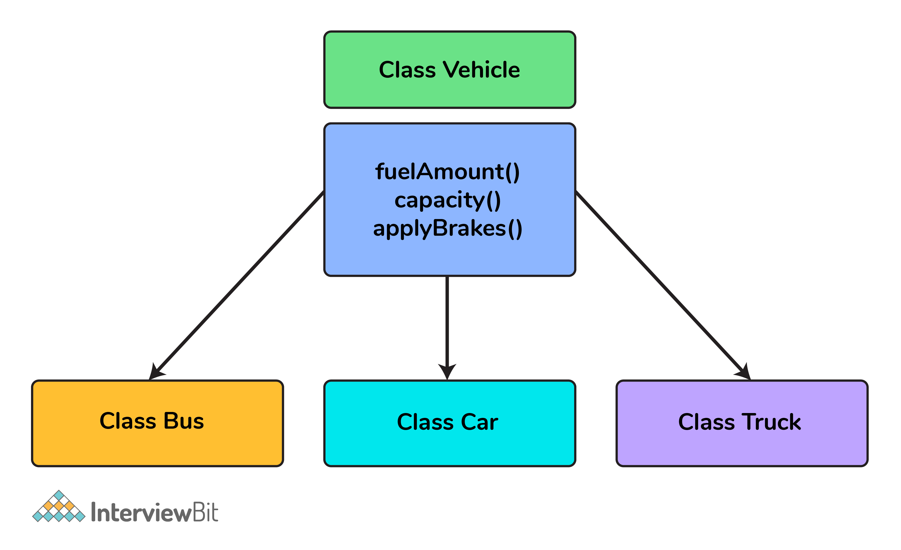

# Câu hỏi phỏng vấn C++


## C++ là gì

C++ là ngôn ngữ lập trình mạnh mẽ được phát triển bởi Bjarne Stroustrup at Bell Labs. Nó dựa trên nền tảng của C và phát triển xa hơn với các bổ sung như hướng đối tượng. C++ cực kỳ phổ biến nhờ khả năng tương thích và hiệu suất cao.

Nó được dùng rộng rãi cho lập trình game và server, bên cạnh đó nó còn được ứng dụng trong:
- Hệ điều hành
- Hệ thống phân tán
- Cơ sở dữ liệu
- Trình duyệt web
- Ứng dụng ngân hàng
- Hệ thống nhúng
- Các tính toán và đồ hoạ nâng cao

## Mục lục

[1. Các kiểu dữ liệu trong C++?](#1-c%C3%A1c-ki%E1%BB%83u-d%E1%BB%AF-li%E1%BB%87u-trong-c)

[2. Sự khác biệt giữa C và C++?](#2-s%E1%BB%B1-kh%C3%A1c-bi%E1%BB%87t-gi%E1%BB%AFa-c-v%C3%A0-c)

[3. Lớp và đối tượng trong C++ là gì?](#3-l%E1%BB%9Bp-v%C3%A0-%C4%91%E1%BB%91i-t%C6%B0%E1%BB%A3ng-trong-c-l%C3%A0-g%C3%AC)

[4. Sự khác biệt giữa struct và class?](#4-s%E1%BB%B1-kh%C3%A1c-bi%E1%BB%87t-gi%E1%BB%AFa-struct-v%C3%A0-class)

[5. Nạp chồng toán tử là gì?](#5-n%E1%BA%A1p-ch%E1%BB%93ng-to%C3%A1n-t%E1%BB%AD-l%C3%A0-g%C3%AC)

[6. Đa hình trong C++?](#6-%C4%91a-h%C3%ACnh-trong-c)

[7. Giải thích về constructor trong C++?](#7-gi%E1%BA%A3i-th%C3%ADch-v%E1%BB%81-constructor-trong-c)

[8. Hàm ảo là gì?](#8-h%C3%A0m-%E1%BA%A3o-l%C3%A0-g%C3%AC)

[9. So sánh đa hình thời gian chạy và đa hình thời gian biên dịch?](#9-so-s%C3%A1nh-%C4%91a-h%C3%ACnh-th%E1%BB%9Di-gian-ch%E1%BA%A1y-v%C3%A0-%C4%91a-h%C3%ACnh-th%E1%BB%9Di-gian-bi%C3%AAn-d%E1%BB%8Bch)

[10. Hàm bạn và lớp bạn là gì?](#10-h%C3%A0m-b%E1%BA%A1n-v%C3%A0-l%E1%BB%9Bp-b%E1%BA%A1n-l%C3%A0-g%C3%AC)

[11. Các kiểu truy cập trong C++?](#11-c%C3%A1c-ki%E1%BB%83u-truy-c%E1%BA%ADp-trong-c)

[12. Function inline là gì?](#12-function-inline-l%C3%A0-g%C3%AC)

[13. Tham chiếu trong C++ là gì?](#13-tham-chi%E1%BA%BFu-trong-c-l%C3%A0-g%C3%AC)

[14. Trừu tượng trong C++ là gì?](#14-tr%E1%BB%ABu-t%C6%B0%E1%BB%A3ng-trong-c-l%C3%A0-g%C3%AC)

[15. Có thể nạp chồng destructor không? Tại sao?](#15-c%C3%B3-th%E1%BB%83-n%E1%BA%A1p-ch%E1%BB%93ng-destructor-kh%C3%B4ng-t%E1%BA%A1i-sao)

[16. Gọi bởi giá trị và gọi bởi tham chiếu?](#16-g%E1%BB%8Di-b%E1%BB%9Fi-gi%C3%A1-tr%E1%BB%8B-v%C3%A0-g%E1%BB%8Di-b%E1%BB%9Fi-tham-chi%E1%BA%BFu)

[17. Lớp trừu tường là gì?](#17-l%E1%BB%9Bp-tr%E1%BB%ABu-t%C6%B0%E1%BB%9Dng-l%C3%A0-g%C3%AC)

[18. Destructor trong C++ là gì?](#18-destructor-trong-c-l%C3%A0-g%C3%AC)

[19. Hàm tĩnh và biến tĩnh là gì?](#19-h%C3%A0m-t%C4%A9nh-v%C3%A0-bi%E1%BA%BFn-t%C4%A9nh-l%C3%A0-g%C3%AC)

[20. Giải thích về kế thừa?](#20-gi%E1%BA%A3i-th%C3%ADch-v%E1%BB%81-k%E1%BA%BF-th%E1%BB%ABa)

[21. Copy constructor là gì?](#21-copy-constructor-l%C3%A0-g%C3%AC)

[22. Sự khác biệt giữa shall copy và deep copy?](#22-s%E1%BB%B1-kh%C3%A1c-bi%E1%BB%87t-gi%E1%BB%AFa-shallow-copy-v%C3%A0-deep-copy)

[23. Sự khác biệt hàm ảo và hàm thuần ảo?](#23-s%E1%BB%B1-kh%C3%A1c-bi%E1%BB%87t-h%C3%A0m-%E1%BA%A3o-v%C3%A0-h%C3%A0m-thu%E1%BA%A7n-%E1%BA%A3o)

[24. Nếu lớp D có nguồn gốc từ một lớp cơ sở B. Khi tạo một đối tượng kiểu D thì thứ tự constructor của các lớp này sẽ được gọi như thế nào?](#24-n%E1%BA%BFu-l%E1%BB%9Bp-d-c%C3%B3-ngu%E1%BB%93n-g%E1%BB%91c-t%E1%BB%AB-m%E1%BB%99t-l%E1%BB%9Bp-c%C6%A1-s%E1%BB%9F-b-khi-t%E1%BA%A1o-m%E1%BB%99t-%C4%91%E1%BB%91i-t%C6%B0%E1%BB%A3ng-ki%E1%BB%83u-d-th%C3%AC-th%E1%BB%A9-t%E1%BB%B1-constructor-c%E1%BB%A7a-c%C3%A1c-l%E1%BB%9Bp-n%C3%A0y-s%E1%BA%BD-%C4%91%C6%B0%E1%BB%A3c-g%E1%BB%8Di-nh%C6%B0-th%E1%BA%BF-n%C3%A0o)

[25. Ta có thể gọi hàm ảo từ một constructor không?](#25-ta-c%C3%B3-th%E1%BB%83-g%E1%BB%8Di-h%C3%A0m-%E1%BA%A3o-t%E1%BB%AB-m%E1%BB%99t-constructor-kh%C3%B4ng)

[26. Con trỏ void là gì?](#26-con-tr%E1%BB%8F-void-l%C3%A0-g%C3%AC)

[27. Con trỏ this là gì?](#27-con-tr%E1%BB%8F-this-l%C3%A0-g%C3%AC)

[28. Cấp phát và giải phóng bộ nhớ trong C++?](#28-c%E1%BA%A5p-ph%C3%A1t-v%C3%A0-gi%E1%BA%A3i-ph%C3%B3ng-b%E1%BB%99-nh%E1%BB%9B-trong-c)

## Câu hỏi phỏng vấn C++ cho Fresher

### 1. Các kiểu dữ liệu trong C++?

Có 4 kiểu dữ liệu trong C++:
- Kiểu nguyên thuỷ, như char, short, int, float, long, double, bool,...
- Kiểu dẫn xuất, như array, pointer,..
- Enum
- Kiểu người dùng định nghĩa: structure, class,...

### 2. Sự khác biệt giữa C và C++?

| C | C++ |
|---|-----|
| C là ngôn ngữ hướng thủ tục | C++ là ngôn ngữ hướng đối tượng |
| C không hỗ trợ ẩn dữ liệu | Dữ liệu được ẩn bởi tính đóng gói đảm bảo cấu trúc dữ liệu và phép toán được sử dụng nội bộ |
| C là tập con của C++ | C++ là mở rộng của C |
| Không hộ trợ nạp chồng | Hỗ trợ nạp chồng hàm và toán tử |
| Không có tính năng namespace | Có tính năng namespace để tránh xung đột |
| Hàm không thể định nghĩa bên trong cấu trúc | Hàm có thể định nghĩa bên trong cấu trúc |
| hàm calloc() và malloc() dùng cho cấp phát bộ nhớ và free() để giải phóng | toán tử new dùng cho cấp phát bộ nhớ và toán tử delete dùng cho giải phóng bộ nhớ |

### 3. Lớp và đối tượng trong C++ là gì?

Một lớp là kiểu người dùng tự định nghĩa có dữ liệu và hàm thành viên. Dữ liệu là các biến và hàm là các hàm thực hiện hành động trên các biến.

Đối tượng là một thực thể của lớp. 

Ví dụ:

```cpp
class A {
    private:
        int data;
    public:
        void func() {

        }
}
```



### 4. Sự khác biệt giữa struct và class?

| Struct | Class |
|--------|-------|
| Các thành viên của struct mặc định là public | Thành viên của class mặc định là private |
| Khi dẫn xuất một struct từ một struct khác, truy cập mặc định cho struct cơ sở là public | Khi dẫn xuất một class, truy cập mặc định là private |

### 5. Nạp chồng toán tử là gì?

Nạp chồng toán tử là một yếu tố rất cần thiết để thực hiện các hoạt động trên các kiểu dữ liệu do người dùng xác định. Bằng cách nạp chồng toán tử, chúng ta có thể sửa đổi ý nghĩa mặc định thành các toán tử như +, -, *, /, <=, v.v.

Ví dụ: Đoạn code bên dưới thực hiện công hai số phức bằng nạp chồng toán tử

```cpp
class complex{
    private:
        float r, i;
    public:
        complex(float r, float i){
            this->r=r;
            this->i=i;
        }
        complex(){}
        void displaydata(){
            cout<<"real part = "<<r<<endl;
            cout<<"imaginary part = "<<i<<endl;
        }
        complex operator+(complex c) {
            return complex(r+c.r, i+c.i);
        }
};

int main(){
    complex a(2,3);
    complex b(3,4);
    complex c=a+b;
    c.displaydata();
    return 0;
}
```

### 6. Đa hình trong C++?

Đa hình nói một cách đơn giản có nghĩa là có nhiều dạng. Hành vi của nó là khác nhau trong các tình huống khác nhau. Và điều này xảy ra khi chúng ta có nhiều lớp có liên quan với nhau theo kế thừa.

Ví dụ: Ta có một lớp cơ sở được gọi là `Car` có một phương thức được gọi là `car_brand()`. Các loại xe có nguồn gốc có thể là Mercedes, BMW, Audi - Và chúng cũng có cách triển khai xe của riêng mình

Hai loại đa hình trong c ++ là:

- Đa hình thời gian biên dịch
- Đa hình thời gian chạy



### 7. Giải thích về constructor trong C++?

Contrustor là một hàm thành viên được thực thi tự động bất cứ khi nào đối tượng được tạo. Constructor có cùng tên với lớp để trình biên dịch biết hàm thành viên nào là constructor. Constructor không có kiểu trả về.

```cpp
class A{
    private:
        int val;
    public:
        A(int x){             //one argument constructor
            val=x;
        }
        A(){                    //zero argument constructor
        }
}
int main(){
    A a(3);     

    return 0;
}
```

### 8. Hàm ảo là gì?

Hàm ảo là một hàm thành viên trong lớp cơ sở mà bạn xác định lại trong một lớp dẫn xuất. Một hàm ảo được khai báo bằng từ khóa `virtual`. Khi hàm được tạo ảo, C++ xác định hàm nào sẽ được gọi trong thời gian chạy dựa trên kiểu đối tượng được trỏ bởi con trỏ lớp cơ sở.

### 9. So sánh đa hình thời gian chạy và đa hình thời gian biên dịch?

#### Đa hình thời gian chạy

- Trong phương thức này, chúng ta sẽ biết tại thời điểm chạy phương thức nào sẽ được gọi. Lệnh gọi không được giải quyết bởi trình biên dịch.

- Nó cung cấp khả năng thực thi chậm hơn so với tính đa hình thời gian biên dịch vì nó được biết trước tại thời điểm chạy.

- Có thể thực hiện bằng hàm ảo và con trỏ.

- Ví dụ

```cpp
class A{
    public:
        virtual void fun(){
            cout<<"base";
        }
};
class B: public A{
    public:
        void fun(){
            cout<<"derived ";
        }
};
int main(){
    A *a=new B;
    a->fun();

    return 0;
}
```

#### Đa hình thời gian biên dịch

- Trong phương thức này, chúng ta sẽ biết tại thời điểm biên dịch phương thức nào sẽ được gọi. Và lời gọi được giải quyết bởi trình biên dịch.

- Nó cung cấp khả năng thực thi nhanh chóng vì nó đã được biết trước tại thời điểm biên dịch.

- Có thể thực hiện bằng nạp chồng toán tử và nạp chồng hàm.

- Ví dụ:

```cpp
int add(int a, int b){
    return a+b;
}
int add(int a, int b, int c){
    return a+b+c;
}

int main(){
    cout<<add(2,3)<<endl;
    cout<<add(2,3,4)<<endl;


    return 0;
}
```

### 10. Hàm bạn và lớp bạn là gì?

Một lớp bạn có thể truy cập thành viên pulic, protected hay private của lớp khác mà lớp đó được khai báo là bạn.

Giống như lớp bạn, hàm bạn cũng có thể truy cập các thành viên private, protected và public. Nhưng, hàm bạn không phải là hàm thành viên.

```cpp
class A{
    private:
        int data_a;
    public:
        A(int x){
            data_a=x;
        }
    friend int fun(A, B);
}
class B{
    private:
        int data_b;
    public:
        A(int x){
            data_b=x;
        }
        friend int fun(A, B);
}
int fun(A a, B b){
    return a.data_a+b.data_b;
}
int main(){
    A a(10);
    B b(20);
    cout<<fun(a,b)<<endl;
    return 0;
}
```

Do đó, ta có thể truy cập dữ liệu private của lớp A và B.

### 11. Các kiểu truy cập trong C++?

- Public: tất cả dữ liệu và hàm thành viên đều có thể truy cập từ bên ngoài lớp.
- Protected: tất cả dữ liệu và hàm thành viên đều có thể truy cập từ bên trong lớp và lớp dẫn xuất.
- Private: tất cả dữ liệu và hàm thành viên đều chỉ có thể truy cập từ bên trong lớp.

### 12. Function inline là gì?

Inline functions (hàm nội tuyến) là một loại hàm trong ngôn ngữ lập trình C++. Từ khoá inline được sử dụng để đề nghị (không phải là bắt buộc) trình biên dịch thực hiện inline expansion (khai triển nội tuyến) với hàm đó hay nói cách khác là chèn code của hàm đó tại địa chỉ mà nó được gọi.

Ví dụ:

```cpp
inline int max(int a, int b)
{
	return a > b ? a : b;
}

int main()
{
	cout << max(3, 6) << '\n';
	cout << max(6, 3) << '\n';

	return 0;
}
```

Khi được biên dịch, code được tạo như sau:

```cpp
int main()
{
	cout << (3 > 6 ? 3 : 6) << '\n';
	cout << (6 > 3 ? 6 : 3) << '\n';

	return 0;
}
```

### 13. Tham chiếu trong C++ là gì?

Tham chiếu giống như con trỏ, sau khi một tham chiếu được khởi tạo với một biến, biến đó có thể truy cập đến cả tên biến và tên tham chiếu.

```cpp
int x=10;
int &ref=x;           //reference variable
```

Nếu chúng ta thay đổi giá trị của `ref`, nó sẽ được phản ánh trong `x`. Khi một biến tham chiếu được khởi tạo, nó không thể tham chiếu đến bất kỳ biến nào khác. Chúng ta có thể khai báo một mảng con trỏ nhưng một mảng tham chiếu thì không thể.

### 14. Trừu tượng trong C++ là gì?

Trừu tượng là quá trình hiển thị các chi tiết cần thiết cho người dùng và ẩn các chi tiết mà ta không muốn hiển thị cho người dùng hoặc ẩn các chi tiết không liên quan đến một người dùng cụ thể.

### 15. Có thể nạp chồng destructor không? Tại sao?

Không thể nạp chồng destructor, vì destructor không nhận về bất kỳ tham số nào, thế nên nó chỉ làm một việc là huỷ đối tượng.

### 16. Gọi bởi giá trị và gọi bởi tham chiếu?

Trong phương thức gọi bởi giá trị, chúng ta truyền một bản sao của tham số được truyền cho các hàm. Đối với các giá trị được sao chép này, một bộ nhớ mới được gán và các thay đổi được thực hiện đối với các giá trị này không phản ánh biến trong hàm chính.

Trong phương thức gọi bởi tham chiếu, chúng ta chuyển địa chỉ của biến và địa chỉ được sử dụng để truy cập đối số thực được sử dụng trong lệnh gọi hàm. Vì vậy, các thay đổi được thực hiện trong tham số sẽ làm thay đổi đối số truyền.

### 17. Lớp trừu tường là gì?

Một lớp được gọi là một lớp trừu tượng khi mà các đối tượng của nó không bao giờ có thể được tạo ra. Một lớp như vậy tồn tại như một lớp cha cho các lớp dẫn xuất. Chúng ta có thể làm cho một lớp trở nên trừu tượng bằng cách đặt một hàm thuần ảo trong lớp.

### 18. Destructor trong C++ là gì?

Một constructor được tự động gọi khi một đối tượng được tạo lần đầu tiên. Tương tự như vậy khi một đối tượng bị hủy, một hàm có tên là destructor sẽ tự động được gọi. Một destructor có cùng tên với constructor (giống với tên lớp) nhưng đứng trước một dấu ngã `~`.

```cpp
class A{
    private:
        int val;
    public:
        A(int x){           
            val=x;
        }

        A(){                
        }

        ~A(){                  //destructor
        }
}
int main(){
    A a(3);     
    return 0;
}
```

### 19. Hàm tĩnh và biến tĩnh là gì?

Khi một biến trong một lớp được khai báo là `static`, không gian cho nó sẽ được cấp cho thời gian tồn tại của chương trình. Bất kể có bao nhiêu đối tượng của lớp đó đã được tạo, chỉ có một bản sao của thành viên tĩnh. Vì vậy, cùng một thành viên tĩnh có thể được truy cập bởi tất cả các đối tượng của lớp đó.

Một hàm thành viên tĩnh có thể được gọi ngay cả khi không có đối tượng nào của lớp tồn tại và hàm tĩnh được truy cập chỉ bằng cách sử dụng tên lớp và toán tử phân giải phạm vi `::`.

### 20. Giải thích về kế thừa?

Kế thừa là quá trình tạo các lớp mới, được gọi là lớp dẫn xuất, từ các lớp hiện có. Các lớp hiện có này được gọi là các lớp cơ sở. Các lớp dẫn xuất kế thừa tất cả các khả năng của lớp cơ sở nhưng có thể thêm các tính năng và cải tiến mới của riêng chúng.



Các lớp `Bus`, `Car` và `Truck` kế thừa thuộc tính từ lớp `Vehicle`. Điều quan trọng nhất của kế thừa là khả năng sử dụng lại code.

## Câu hỏi phỏng vấn C++ cho Experienced

### 21. Copy constructor là gì?

Một copy constructor là một hàm thành viên được tạo khi một đối tượng sử dụng đối tượng khác ở cùng lớp.

```cpp
class A{
    int x,y;
    A(int x, int y){
        this->x=x;
        this->y=y;
    }

};
int main(){
    A a1(2,3);
    A a2=a1;     //default copy constructor is called
    return 0;
}
```

### 22. Sự khác biệt giữa shallow copy và deep copy?

| Shallow Copy | Deep Copy |
|--------------|-----------|
| Lưu trữ tham chiếu của đối tượng từ địa chỉ bộ nhớ gốc | Tạo một bản sao mới và riêng biệt của toàn bộ đối tượng với địa chỉ bộ nhớ duy nhất của nó |
| Nhanh hơn | Chậm hơn |
| Phản ánh những thay đổi được thực hiện đối với đối tượng mới/được sao chép trong đối tượng gốc | Không phản ánh những thay đổi được thực hiện đối với đối tượng mới/được sao chép trong đối tượng gốc |

### 23. Sự khác biệt hàm ảo và hàm thuần ảo?

Một hàm ảo là một hàm thành viên trong lớp cơ sở mà bạn xác định lại trong một lớp dẫn xuất. Nó được khai báo bằng từ khóa `virtual`.

```cpp
class base {
    public:
        virtual void func() {

        }
};
```

Một hàm thuần ảo là một hàm không có phần thực thi và được khai báo bằng cách gán với 0. Nó không có phần thân.

```cpp
class base{
    public:
        virtual void fun()=0;
};
```

Ở đây, dấu = không liên quan gì đến việc gán và giá trị 0 không được gán cho bất kỳ thứ gì. Nó được sử dụng để chỉ cho trình biên dịch biết rằng một hàm sẽ thuần và nó sẽ không có gì cả.

### 24. Nếu lớp D có nguồn gốc từ một lớp cơ sở B. Khi tạo một đối tượng kiểu D thì thứ tự constructor của các lớp này sẽ được gọi như thế nào?

Lớp dẫn xuất có hai phần, một phần cơ sở và một phần dẫn xuất. Khi C++ xây dựng các đối tượng dẫn xuất, nó sẽ làm như vậy theo từng giai đoạn. Đầu tiên, lớp cơ sở nhất (ở trên cùng của cây kế thừa) được xây dựng. Sau đó, mỗi lớp con được xây dựng theo thứ tự cho đến khi lớp con nhiều nhất được xây dựng cuối cùng.
Vì vậy, constructor đầu tiên của lớp B sẽ được gọi và sau đó mới gọi constructor của lớp D.

Trong quá trình huỷ thứ tự ngược lại được tuân theo. Đó là destructor bắt đầu từ lớp dẫn xuất nhất và hoạt động theo cách của nó xuống lớp cơ sở.
Vì vậy, destructor đầu tiên của lớp D sẽ được gọi và sau đó sẽ đến destructor của lớp B.

### 25. Ta có thể gọi hàm ảo từ một constructor không?

Có, chúng ta có thể gọi một hàm ảo từ một constructor. Nhưng hành vi có một chút khác biệt trong trường hợp này. Khi một hàm ảo được gọi, cuộc gọi ảo sẽ được giải quyết trong thời gian chạy. Nó luôn luôn là hàm thành viên của lớp hiện tại được gọi. Tức là hàm ảo không hoạt động trong constructor.

```cpp
class base{
    private:
        int value;
    public:
        base(int x){
            value=x;
        }
        virtual void fun(){
        
        }
}

class derived{
    private:
        int a;
    public:
        derived(int x, int y):base(x){
            base *b;
            b=this;
            b->fun();      //calls derived::fun()
        }
        void fun(){
            cout<<"fun inside derived class"<<endl;
        }
}
```

### 26. Con trỏ void là gì?

Con trỏ void là một con trỏ không có kiểu dữ liệu nào được liên kết với nó. Nó có thể chứa bất kỳ loại địa chỉ nào.

```cpp
void *ptr;
char *str;

p = str;        // no error
str = p;        // error because of type mismatch
```

Chúng ta có thể gán một con trỏ thuộc bất kỳ loại nào cho một con trỏ void nhưng điều ngược lại là không đúng trừ khi bạn ép kiểu nó bằng

```cpp
str=(char*) ptr;
```

### 27. Con trỏ this là gì?

Các hàm thành viên của mọi đối tượng đều có một con trỏ được đặt tên là `this`, con trỏ này trỏ đến chính đối tượng. Giá trị `this` được đặt thành địa chỉ của đối tượng mà nó được gọi. Nó có thể được sử dụng để truy cập dữ liệu trong đối tượng mà nó trỏ tới.

```cpp
class A{
    private:
        int value;
    public:
        void setvalue(int x){
            this->value=x; 
        }
};

int main(){
    A a;
    a.setvalue(5);
    return 0;
}
```

### 28. Cấp phát và giải phóng bộ nhớ trong C++?

Toán tử `new` dùng cho cấp phát bộ nhớ và toán tử `delete` dùng cho giải phóng bộ nhớ trong C++.

```cpp
int value=new int;  		//allocates memory for storing 1 integer
delete value;          		// deallocates memory taken by value

int *arr=new int[10];    	//allocates memory for storing 10 int
delete []arr;              	// deallocates memory occupied by arr
```