# Câu hỏi phỏng vấn Cấu Trúc Dữ Liệu


- Cấu trúc dữ liệu là một khái niệm cơ bản trong bất kỳ ngôn ngữ lập trình nào, là phần thiết yếu trong thiết kế thuật toán.

- Nó được sử dụng để tổ chức và chỉnh sửa dữ liệu một cách hiệu quả.

- Cấu trúc dữ liệu là cách dữ liệu và các mối quan hệ của nó được biểu diễn, hỗ trợ việc áp dụng các tính năng hoặc thuật toán khác nhau hoạt động một cách tối ưu.

### Kiểu

Có hai kiểu cấu trúc dữ liệu:
- Cấu trúc dữ liệu tuyến tính: Nếu các phần tử của cấu trúc dữ liệu là một chuỗi tuần tự hoặc danh sách tuyến tính. Nó được gọi là cấu trúc dữ liệu tuyến tính. Ví dụ: ,mảng, danh sách liên kết, ngăn xếp, hàng đợi,...
- Cấu trúc dữ liệu phi tuyến tính: Nếu các phần tử của cấu trúc dữ liệu tạo ra cách duyệt qua các phần tử không theo thứ tự, thì nó là cấu trúc dữ liệu phi tuyến tính. Ví dụ: Cây, đồ thị,...

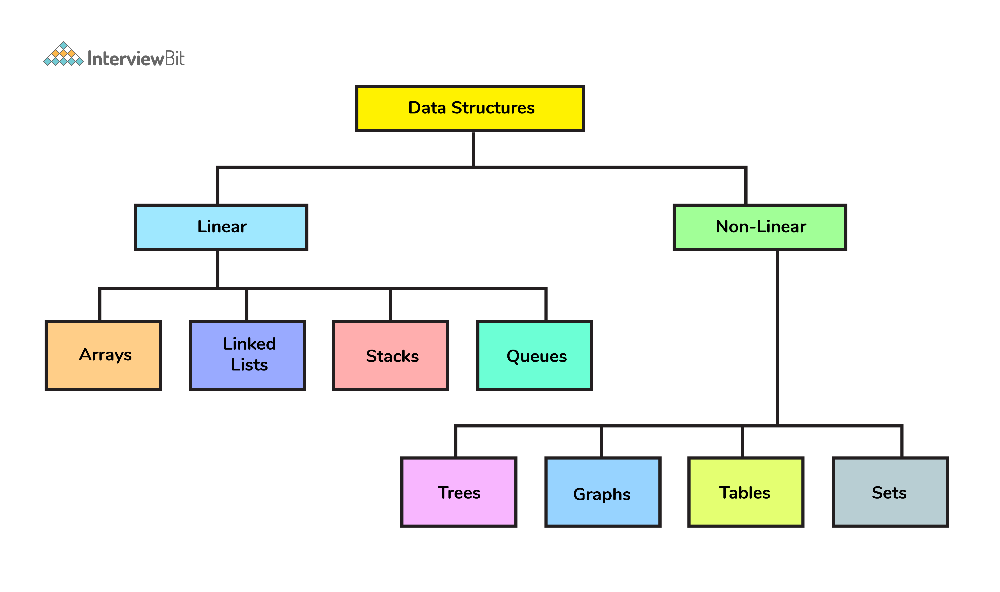

### Ứng dụng

Cấu trúc dữ liệu là nền tảng cốt lõi của lập trình phần mềm vì để bất kỳ thuật toán cho một vấn đề nhất định nào hoạt động hiệu quả đều phụ thuộc vào mức độ hiệu quả của dữ liệu được cấu trúc.

Các ứng dụng của cấu trúc dữ liệu:
1. Trí thông minh nhân tạo
2. Thiết kế trình biên dịch
3. Máy học
4. Thiết kế và quản lý cơ sở dữ liệu
5. Blockchain
6. Tính toán và thống kê
7. Phát triển hệ điều hành
8. Xử lý hình ảnh và âm thanh
9. Mã hoá

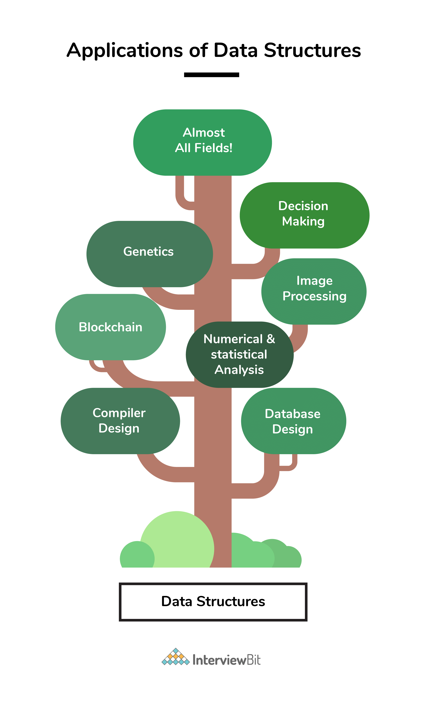

### Lợi ích

Bất kỳ vấn đề nào đều có những hạn chế về tốc độ giải quyết (thời gian) và lượng tài nguyên tiêu tốn (không gian). Một vấn đề bị hạn chế bởi độ phức tạp về không gian và thời gian phải được giải quyết một cách hiệu quả.

Để làm được điều này, vấn đề phải được biểu diễn ở một dạng cấu trúc phù hợp mà ở đó các thuật toán được áp dụng tốt nhất.

Lựa chọn cấu trúc dữ liệu thích hợp trở thành bước quan trọng nhất trước khi áp dụng thuật toán cho bất kỳ vấn đề nào.

> "Có sẵn kiến thức về các loại cấu trúc dữ liệu khác nhau sẽ giúp lập trình viên lựa chọn cấu trúc dữ liệu phù hợp nhất để giải quyết vấn đề một cách hiệu quả. Nó không chỉ nằm ở việc làm giải pháp của bạn hoạt động, mà còn là giải pháp đó hoạt động hiệu quả như thế nào."

## Mục lục

[1. Bạn có thể giải thích sự khác nhau giữa cấu trúc tập tin và cấu trúc lưu trữ](#1-bạn-có-thể-giải-thích-sự-khác-nhau-giữa-cấu-trúc-tập-tin-và-cấu-trúc-lưu-trữ)

[2. Bạn có thể nói sự khác biệt giữa cấu trúc dữ liệu tuyến tính và phi tuyến tính?](#2-bạn-có-thể-nói-sự-khác-biệt-giữa-cấu-trúc-dữ-liệu-tuyến-tính-và-phi-tuyến-tính)

[3. Mảng là gì?](#3-mảng-là-gì)

[4. Mảng đa chiều là gì?](#4-mảng-đa-chiều-là-gì)

[5. Danh sách liên kết là gì?](#5-danh-sách-liên-kết-là-gì)

[6. Danh sách liên kết là tuyến tính hay phi tuyến tính?](#6-danh-sách-liên-kết-là-tuyến-tính-hay-phi-tuyến-tính)

[7. Danh sách liên kết có hiệu quả hơn mảng?](#7-danh-sách-liên-kết-có-hiệu-quả-hơn-mảng)

[8. Giải thích trường hợp nào sử dụng danh sách liên kết và trường hợp nào sử dụng](#8-giải-thích-trường-hợp-nào-sử-dụng-danh-sách-liên-kết-và-trường-hợp-nào-sử-dụng-mảng)

[9. Danh sách liên kết đôi (DDL) là gì?](#9-danh-sách-liên-kết-đôi-ddl-là-gì)

[10. Ngăn xếp là gì?](#10-ngăn-xếp-là-gì)

[11. Hàng đợi là gì?](#11-hàng-đợi-là-gì)

[12. Ngăn xếp và hàng đợi khác nhau thế nào?](#12-ngăn-xếp-và-hàng-đợi-khác-nhau-thế-nào)

[13. Giải thích quy trình đằng sau việc lưu trữ một biến trong bộ nhớ?](#13-giải-thích-quy-trình-đằng-sau-việc-lưu-trữ-một-biến-trong-bộ-nhớ)

[14. Triển khai hàng đợi bằng ngăn xếp](#14-triển-khai-hàng-đợi-bằng-ngăn-xếp)

[15. Triển khai ngăn xếp bằng hàng đợi](#15-triển-khai-ngăn-xếp-bằng-hàng-đợi)

[16. Hashmap trong Java là gì?](#16-hashmap-trong-java-là-gì)

[17. Yêu cầu đối với một đối tượng được sử dụng làm khóa hoặc giá trị trong HashMap là gì?](#17-yêu-cầu-đối-với-một-đối-tượng-được-sử-dụng-làm-khóa-hoặc-giá-trị-trong-hashmap-là-gì)

[18. Xử lý xung đột trong HashMap với Java?](#18-xử-lý-xung-đột-trong-hashmap-với-java)

[19. Độ phức tạp thời gian của thao tác get() và put() trong HashMap](#19-độ-phức-tạp-thời-gian-của-thao-tác-get-và-put-trong-hashmap)

[20. Cơ sở dữ liệu nào được dùng cho triển khai bộ đệm LRU?](#20-cơ-sở-dữ-liệu-nào-được-dùng-cho-triển-khai-bộ-đệm-lru)

[21. Hàng đợi ưu tiên là gì?](#21-hàng-đợi-ưu-tiên-là-gì)

[22. Có thể lưu trữ một khóa trùng lặp trong HashMap không?](#22-có-thể-lưu-trữ-một-khóa-trùng-lặp-trong-hashmap-không)

[23. Cấu trúc dữ liệu cây là gì?](#23-cấu-trúc-dữ-liệu-cây-là-gì)

[24. Cây nhị phân là gì](#24-cây-nhị-phân-là-gì)

[25. Số lượng nút tối đa của cây nhị phân có chiều dài k](#25-số-lượng-nút-tối-đa-của-cây-nhị-phân-có-chiều-dài-k)

[26. Viết hàm đệ quy tính chiều cao cây nhị phân trong Java](#26-viết-hàm-đệ-quy-tính-chiều-cao-cây-nhị-phân-trong-java)

[27. Viết hàm Java đếm số lượng nút trong cây](#27-viết-hàm-java-đếm-số-lượng-nút-trong-cây)

[28. Duyệt cây là gì?](#28-duyệt-cây-là-gì)

[29. Cây tìm kiếm nhị phân là gì?](#29-cây-tìm-kiếm-nhị-phân-là-gì)

[30. Cây AVL là gì?](#30-cây-avl-là-gì)

[31. In chế độ xem bên trái của bất kỳ cây nhị phân nào](#31-in-chế-độ-xem-bên-trái-của-bất-kỳ-cây-nhị-phân-nào)

[32. Cấu trúc dữ liệu đồ thị là gì?](#32-cấu-trúc-dữ-liệu-đồ-thị-là-gì)

[33. Ứng dụng của đồ thị?](#33-ứng-dụng-của-đồ-thị)

[34. Làm thế nào để biểu diễn đồ thị?](#34-làm-thế-nào-để-biểu-diễn-đồ-thị)

[35. Sự khác biệt giữa cấu trúc dữ liệu cây và đồ thị](#35-sự-khác-biệt-giữa-cấu-trúc-dữ-liệu-cây-và-đồ-thị)

[36. Sự khác biệt giữa BFS (Breadth First Search) và DFS (Delth First Search)](#36-sự-khác-biệt-giữa-bfs-breadth-first-search-và-dfs-delth-first-search)

[37. Khi nào sử dụng DFS tốt hơn BFS?](#37-khi-nào-sử-dụng-dfs-tốt-hơn-bfs)

[38. Sắp xếp tô pô trong đồ thị là gì?](#38-sắp-xếp-tô-pô-trong-đồ-thị-là-gì)

[39. Cho một bản đồ lưới 2D, m x n trong đó giá trị "1" đại diện cho đất và "0" đại diện cho nước, trả về số lượng các hòn đảo (được bao quanh bởi nước và được hình thành bằng cách kết nối các vùng đất liền kề theo 2 hướng - theo chiều dọc hoặc chiều ngang). Giả sử rằng các trường hợp ranh giới - tức là tất cả bốn cạnh của lưới đều được bao quanh bởi nước.
](#39-cho-một-bản-đồ-lưới-2d-m-x-n-trong-đó-giá-trị-1-đại-diện-cho-đất-và-0-đại-diện-cho-nước-trả-về-số-lượng-các-hòn-đảo-được-bao-quanh-bởi-nước-và-được-hình-thành-bằng-cách-kết-nối-các-vùng-đất-liền-kề-theo-2-hướng---theo-chiều-dọc-hoặc-chiều-ngang-giả-sử-rằng-các-trường-hợp-ranh-giới---tức-là-tất-cả-bốn-cạnh-của-lưới-đều-được-bao-quanh-bởi-nước)

[40. Cấu trúc dữ liệu heap là gì?](#40-cấu-trúc-dữ-liệu-heap-là-gì)

## Câu hỏi phỏng vấn cho Fresher

### 1. Bạn có thể giải thích sự khác nhau giữa cấu trúc tập tin và cấu trúc lưu trữ?

Sự khác biệt chính giữa cấu trúc tập và cấu trúc lưu trữ là dựa trên không gian bộ nhớ đang được truy cập.

**Cấu trúc lưu trữ:** Là sự biểu diễn cấu trúc dữ liệu trong bộ nhớ máy tính.

**Cấu trúc tập tin:** Là biểu diễn cấu trúc lưu trữ trong bộ nhớ phụ/thứ cấp.

### 2. Bạn có thể nói sự khác biệt giữa cấu trúc dữ liệu tuyến tính và phi tuyến tính?

Nếu các phần tử của cấu trúc dữ liệu là một chuỗi hay danh sách tuyến tính thì nó gọi là cấu trúc dữ liệu tuyến tính. Trong khi đó, cấu trúc dữ liệu cho duyệt các phần tử không theo thứ tự nào gọi cấu trúc dữ liệu phi tuyến tính.

Danh sách, ngăn xếp và hàng đợi là ví dụ của cấu trúc dữ liệu tuyến tính trong khi cây và đồ thị là cấu trúc dữ liệu phi tuyến tính.

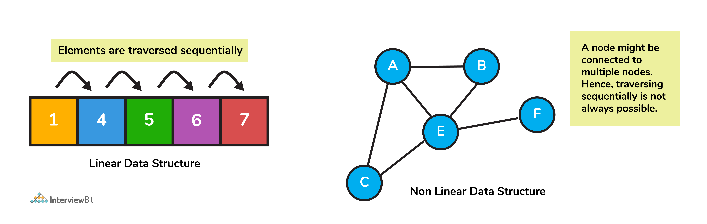

### 3. Mảng là gì?

Mảng là tập hợp các loại dữ liệu cùng **kiểu** được lưu trữ tại các vị trí bộ nhớ liền kề.
Đây là cấu trúc dữ liệu đơn giản nhất mà phần tử dữ liệu có thể được truy cập ngẫu nhiên bằng cách sử dụng chỉ mục của nó.

### 4. Mảng đa chiều là gì?

Mảng đa chiều là những cấu trúc dữ liệu mảng trên nhiều chiều khác nhau.

Điều này chỉ ra rằng sẽ có nhiều hơn một chỉ mục cho mỗi điểm lưu trữ. Loại cấu trúc dữ liệu này chủ yếu được sử dụng trong trường hợp dữ liệu không thể được biểu diễn hoặc lưu trữ trên mảng một chiều. Mảng đa chiều được sử dụng phổ biến nhất là mảng hai chiều.

Mảng hai chiều mô phỏng cấu trúc dạng bảng giúp dễ dàng lưu trữ lượng lớn dữ liệu được truy cập bằng cách sử dụng con trỏ hàng và cột.

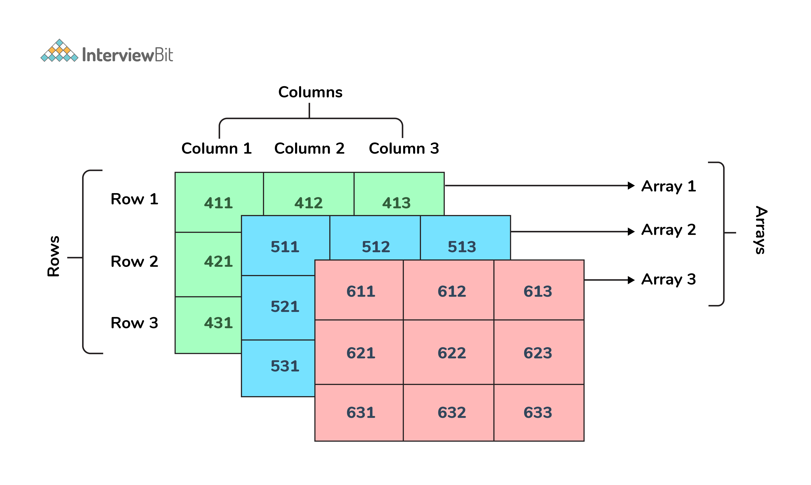

### 5. Danh sách liên kết là gì?

Danh sách liên kết là một **chuỗi tuần tự các nút**, trong đó các nút được liên kết với nhau thông qua con trỏ tham chiếu. Các phần tử **không được lưu trữ** tại các vị trí liền kề trong bộ nhớ. Chúng được liên kết bằng cách sử dụng con trỏ để tạo thành một chuỗi. Điều này tạo thành một liên kết dạng chuỗi để lưu trữ dữ liệu. 

Mỗi nút thường có hai phần:
- Trường dữ liệu
- Tham chiếu(con trỏ) đến nút kế tiếp

Nút đầu tiên trong danh sách liên kết gọi là head, nút cuối cùng gọi là tail và trỏ đến null. Null trong trường tham chiếu chỉ ra nút đó là tail. Nếu danh sách trống, head sẽ là tham chiếu null.

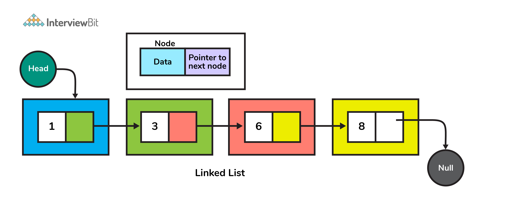

### 6. Danh sách liên kết là tuyến tính hay phi tuyến tính?

Danh sách liên kết có thể được coi là cấu trúc dữ liệu tuyến tính và cả phi tuyến tính. Điều này phụ thuộc vào ứng dụng mà chúng được sử dụng.

Khi danh sách liên kết được sử dụng cho truy cập, nó được coi là một cấu trúc dữ liệu tuyến tính. Khi chúng được sử dụng để lưu trữ dữ liệu, nó có thể được coi là một cấu trúc dữ liệu phi tuyến tính.

### 7. Danh sách liên kết có hiệu quả hơn mảng?

1. **Chèn và xoá**

- Quá trình chèn và xoá là rất tốn kém trong mảng vì phải tạo các phần tử mới và dịch chuyển các phần tử đã có.
- Nhưng trong danh sách liên kết, các thao tác này dễ dàng hơn vì chỉ cập nhật địa chỉ hiện tại trong con trỏ tiếp theo của một nút.

2. **Cấu trúc dữ liệu động**

- Danh sách liên kết là cấu trúc dữ liệu động có nghĩa là không cần cho kích thước ban đầu khi tạo, nó có thể mở rộng hay co lại theo thời gian bởi quá trình cấp phát hay thu hồi của bộ nhớ.
- Trong khi đó, kích thước của mảng là giới hạn về số lượng phần tử được lưu trong bộ nhớ chính.

3. **Không lãng phí bộ nhớ**

- Vì kích thước của danh sách liên kết có thể tăng lên hoặc co lại dựa trên nhu cầu của chương trình, nên không có bộ nhớ nào bị lãng phí vì nó được cấp phát trong thời gian chạy.

- Với mảng, nếu chúng ta khai báo một mảng có kích thước 10 và chỉ lưu trữ 3 phần tử trong đó, thì không gian cho 7 phần tử sẽ bị lãng phí. Do đó, khả năng lãng phí bộ nhớ trong các mảng nhiều hơn.

### 8. Giải thích trường hợp nào sử dụng danh sách liên kết và trường hợp nào sử dụng mảng?

Các trường hợp sử dụng danh sách liên kết tốt hơn mảng:

- Khi ta không biết trước chính xác số lượng phần tử.
- Khi ta biết sẽ có một lượng lớn thao tác thêm hoặc xoá.
- Số lượng thao tác truy cập ngẫu nhiên là rất ít.
- Khi muốn chèn các mục vào bất kỳ vị trí nào giữa danh sách, chẳng hạn như khi triển khai hàng đợi ưu tiên, danh sách liên kết sẽ phù hợp hơn.

Các trường hợp dùng mảng tốt hơn danh sách liên kết:
- Khi cần đánh chỉ mục cho các truy cập phần tử ngẫu nhiên thường xuyên.
- Khi ta biết trước số lượng phần tử mảng để cấp phát bộ nhớ.
- Khi chúng ta cần tốc độ khi lặp lại các phần tử trong chuỗi.
- Khi cần quan tâm bộ nhớ:
    1. Một mảng đầy sẽ tốn ít bộ nhớ hơn danh sách liên kết
    2. Mỗi phần tử trong mảng chỉ biễu diễn dữ liệu trong khi mỗi nút trong danh sách liên kết phải biễu diễn thêm một hoặc nhiều con trỏ cho liên kết đến các nút khác.

Tóm lại, các yêu cầu về không gian, thời gian và mức độ dễ thực hiện được xem xét để quyết định cấu trúc dữ liệu nào sẽ được sử dụng cho mục đích gì.

### 9. Danh sách liên kết đôi (DDL) là gì?

Đây là một loại danh sách liên kết phức tạp, trong đó một nút có hai tham chiếu:
- Một tham chiếu liên kết với nút tiếp theo trong chuỗi
- Một tham chiếu khác liên kết với nút trước đó.

Cấu trúc này cho phép duyệt các phần tử dữ liệu theo cả hai hướng (trái sang phải và ngược lại).

Các ứng dụng của DLL là:
- Danh sách phát nhạc với bài hát tiếp theo và các tùy chọn điều hướng bài hát trước đó.
- Bộ nhớ cache của trình duyệt với các trang đã truy cập BACK-FORWARD
- Chức năng hoàn tác và phục hồi trên các nền tảng như word, paint, v.v., nơi bạn có thể nút undo để truy cập trang trước.

### 10. Ngăn xếp là gì

Ngăn xếp là một cấu trúc dữ liệu tuyến tính tuân theo cách tiếp cận LIFO (Last In First Out) để truy cập các phần tử. 

Các thao tác cơ bản trong ngăn xếp:
- *Push*: thêm phần tử vào đỉnh ngăn xếp
- *Pop*: lấy phần tử từ đỉnh ngăn xếp
- *Peek*: lấy giá trị phần tử từ đỉnh ngăn xếp, mà không xóa nó khỏi ngăn xếp

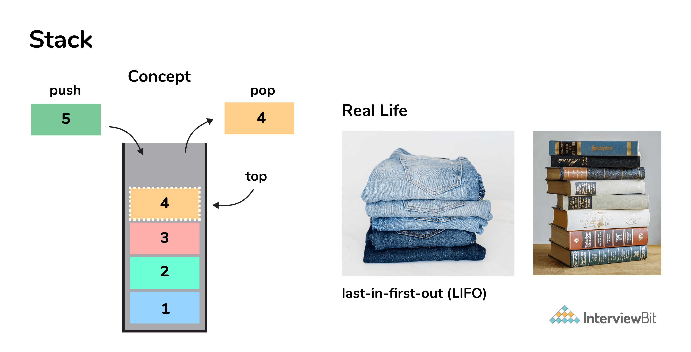

Các ứng dụng của ngăn xếp:
- Tính các biểu thức đại số
- Quản lý bộ nhớ khi thực thi chương trình

### 11. Hàng đợi là gì

Hàng đợi là một cấu trúc dữ liệu tuyến tính tuân theo phương pháp FIFO (First In First Out) để truy cập các phần tử.

Các thao tác cơ bản trong hàng đợi:
- *enqueue*: thêm đối tượng vào cuối hàng đợi.
- *dequeue*: lấy đối tượng ở đầu ra khỏi hàng đợi và trả về giá trị của nó.
- *front*: trả về giá trị của phần tử nằm ở đầu hàng đợi mà không hủy nó.
- *rear*: trả về giá trị của phần tử nằm ở cuối hàng đợi mà không hủy nó.

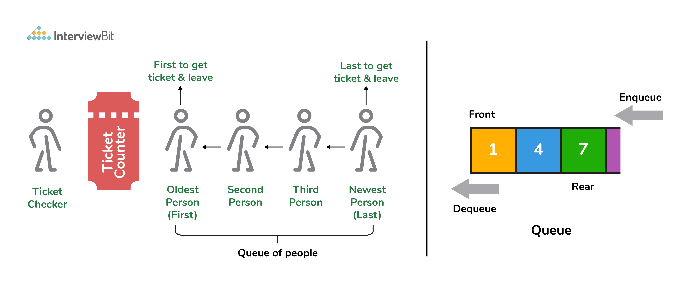

Ứng dụng của hàng đợi:
- Dùng trong các hệ điều hành song song
- Xử lý yêu cầu trang web
- Dùng làm bộ đệm cho ứng dụng nghe nhạc
- Tác vụ CPU

### 12. Ngăn xếp và hàng đợi khác nhau thế nào?

Trong ngăn xếp phần tử được thêm vào gần nhất sẽ được lấy ra đầu tiên, còn trong hàng đợi nó sẽ được lấy ra cuối cùng.

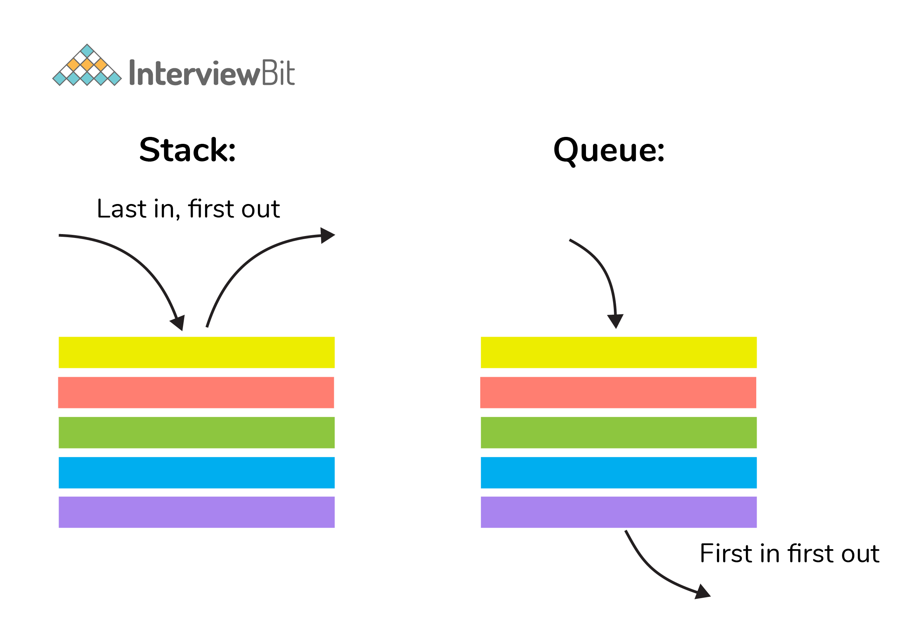

### 13. Giải thích quy trình đằng sau việc lưu trữ một biến trong bộ nhớ.

Một biến được lưu trữ trong bộ nhớ dựa trên dung lượng bộ nhớ cần thiết. Sau đây là các bước được thực hiện để lưu trữ một biến:

1. Đầu tiên, nó chỉ định số lượng bộ nhớ cần thiết.
2. Sau đó, nó được lưu trữ dựa trên cấu trúc dữ liệu đang được sử dụng.
    - Sử dụng các khái niệm như cấp phát động đảm bảo hiệu quả cao và các đơn vị lưu trữ có thể được truy cập dựa trên các yêu cầu trong thời gian thực.

### 14. Triển khai hàng đợi bằng ngăn xếp

Một hàng đợi có thể triển khai bằng cách dùng **hai ngăn xếp**. 

Cho hàng đợi `q` và hai ngăn xếp `stack1` và `stack2` để triển khai `q`. Ta biết ngăn xếp hỗ trợ các thao tác push, pop và peek, ta sẽ dùng các thao tác đó để mô phỏng các hoạt động của hàng đợi, enqueue và dequeue. Do đó, hàng đợi `q` có thể triển khai theo hai cách (cả hai cách đều có độ phức tạp không gian là O(n)):

1. Cần nhiều chi phí chi enqueue

Ở đây, phần tử cũ nhất luôn ở trên cùng của `stack1` đảm bảo hoạt động dequeue xảy ra với độ phức tạp thời gian O (1).

Để đặt phần tử vào đầu `stack1`, `stack2` được sử dụng.

Mã giả:

- Enqueue: Độ phức tạp thời gian là O(n):

```text
enqueue(q, data):
    While stack1 is not empty:
        Push everything from stack1 to stack2.
        Push data to stack1
        Push everything back to stack1.
```

- Dequeue: Độ phức tạp thời gian là O(1):

```text
dequeue(q):
    If stack1 is empty then error
    else
        Pop an item from stack1 and return it
```

2. Cần nhiều chi phí cho dequeue

Ở đây, đối với thao tác enqueue, phần tử mới được đẩy lên trên cùng của `stack1`.Thế nên, độ phức tạp thời gian hoạt động của enqueue là O(1).

Với dequeue, nếu `stack2` trống, tất cả các phần tử từ `stack1` sẽ được chuyển đến `stack2` và pop phần tử trên cùng của `stack2` để lấy kết quả. Về cơ bản, đảo ngược danh sách bằng cách đẩy vào một ngăn xếp và trả về phần tử được enqueue đầu tiên. Thao tác đẩy tất cả các phần tử vào ngăn xếp mới có độ phức tạp O(n).

Mã giả:

- Enqueue: Độ phức tạp thời gian là O(1):

```text
enqueue(q, data):
    Push data to stack1
```

- Dequeue: Độ phức tạp thời gian là O(n):

```text
dequeue(q):
    If both stacks are empty then raise error.
    If stack2 is empty:
        While stack1 is not empty:
            push everything from stack1 to stack2.
    Pop the element from stack2 and return it.
```

### 15. Triển khai ngăn xếp bằng hàng đợi?

Một ngăn xếp có thể được triển khai bằng 2 hai hàng đợi. Một hàng đợi hỗ trợ các thao tác là enqueue và dequeue. Ta sẽ dùng chúng để tạo các thao tác push, pop.

Đầu tiên ta có hai hàng đợi là `q1` và `q2`. Ngăn xếp được triển khai bởi hàng đợi theo hai cách.

1. Tốn chi phí cho push:

Phương thức này đảm bảo các phần tử mới được thêm vào sẽ luôn ở đằng trước của `q1`, thế nên thao tác pop sẽ là deque từ `q1`.

`q2` được dùng như một hàng đợi phụ trợ để phần tử mới vào trước `q1` trong khi đảm bảo pop xảy ra ở độ phức tạp O(1).

Mã giả:

- Push phần tử vào ngăn xếp: Độ phức tạp thời gian là O(n).
```
push(s, data):
    Enqueue data to q2
    Dequeue elements one by one from q1 and enqueue to q2.
    Swap the names of q1 and q2
```

- Pop phần tử khỏi ngăn xếp: Độ phức tạp thời gian là O(1).
```
pop(s):
    dequeue from q1 and return it.
```

2. Tốn chi phí cho pop:

Trong hoạt động push, phần tử được enqueue vào hàng đợi `q1`.

Trong hoạt động pop, tất cả các phần tử từ `q1` ngoại trừ phần tử còn lại cuối cùng, được đẩy sang `q2` nếu nó trống. Phần tử cuối cùng còn lại đó của `q1` được dequeue và trả về.

Mã giả:

- Push phần tử vào ngăn xếp: Độ phức tạp thời gian là O(1).
```
push(s,data):
    Enqueue data to q1
```

- Pop phần tử khỏi ngăn xếp: Độ phức tạp thời gian là O(n).
```
pop(s):
    Step1: Dequeue every elements except the last element from q1 and enqueue to q2.
    Step2: Dequeue the last item of q1, the dequeued item is stored in result variable.
    Step3: Swap the names of q1 and q2 (for getting updated data after dequeue)
    Step4: Return the result.
```

## Câu hỏi phỏng vấn cho Experienced
### 16. Hashmap trong Java là gì?

HashMap trong Java là một bảng băm dựa trên việc thực hiện Java's Map interface. Map là một tập hợp các cặp key-value. Nó ánh xạ các key tới các value.

Nói đơn giản hơn thì HashMap về cơ bản chỉ định các unique key cho các value tương ứng có thể được truy xuất tại bất kỳ điểm nào.

### 17. Yêu cầu đối với một đối tượng được sử dụng làm khóa hoặc giá trị trong HashMap là gì?

Đối tượng khoá hay giá trị được dùng trong hashmap phải triển khai phương thức `equals()` và `hashcode()`.

Phương thức `hashcode()` được dùng khi thêm một đối tượng khoá vào map, còn `equals()` được dùng khi truy cập dữ liệu từ map.

### 18. Xử lý xung đột trong HashMap với Java?

Lớp `java.util.HashMap` trong Java sử dụng phương pháp chuỗi để xử lý xung đột. Trong chuỗi, nếu giá trị mới có khoá trùng với giá trị đã thêm vào, thì các giá trị này được lưu trữ trong danh sách liên kết ở bucket của khoá dưới dạng chuỗi cùng với giá trị hiện có.

Trong trường hợp tệ nhất, tất cả các khoá đều có cùng hashcode, nó sẽ trả về bảng băm giống như là một danh sách liên kết. Trong trường hợp này, việc tìm kiếm một giá trị sẽ mất độ phức tạp thời gian là O(n) thay vì O(1). Do đó, cần phải cẩn thận khi lựa chọn thuật toán băm.

### 19. Độ phức tạp thời gian của thao tác get() và put() trong HashMap 

Độ phức tạp thời gian là O(1) giả sử rằng hàm băm được sử dụng trong hashmap phân phối các phần tử một cách đồng nhất giữa các bucket.

### 20. Cơ sở dữ liệu nào được dùng cho triển khai bộ đệm LRU?

Bộ đệm LRU (Least Recently Used) cho phép xác định nhanh một phần tử đã không được sử dụng trong thời gian dài, bằng cách sắp xếp các mục theo thứ tự sử dụng. Để thực hiện được điều này, hai cấu trúc dữ liệu được sử dụng: 

- **Queue** - Triển khai này sử dụng một danh sách liên kết đôi. Kích thước tối đa của hàng đợi dựa trên kích thước bộ đệm, bằng tổng số frame khả dụng. Các trang ít được dùng gần đây nhất sẽ ở gần với phần trước của hàng đợi trong khi các trang sử dụng nhiều gần đây nhất sẽ ở cuối hàng.
- **Hashmap** - Hashmap lưu trữ số trang dưới dạng khóa cùng với địa chỉ của nút hàng đợi tương ứng dưới dạng giá trị.

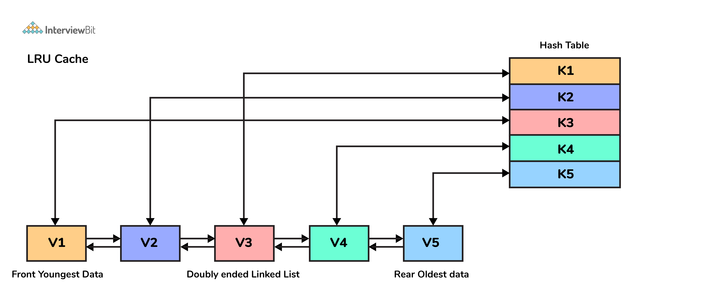

### 21. Hàng đợi ưu tiên là gì?

Hàng đợi ưu tiên là một kiểu dữ liệu trừu tượng giống như một hàng đợi bình thường nhưng có quyền ưu tiên được gán cho các phần tử.

Các phần tử có mức độ ưu tiên cao hơn được xử lý trước các phần tử có mức độ ưu tiên thấp hơn.

Để thực hiện điều này, cần có tối thiểu hai hàng đợi - một hàng cho dữ liệu và hàng còn lại để lưu trữ mức độ ưu tiên.

### 22. Có thể lưu trữ một khóa trùng lặp trong HashMap không?

**Không**, không thể chèn các khóa trùng lặp vào HashMap. Nếu bạn cố gắng chèn bất kỳ khoá nào bằng khóa hiện có, thì giá trị cũ sẽ bị ghi đè bằng giá trị mới. Và điều này sẽ không thay đổi kích thước của HashMap.

Đây là lý do tại sao phương thức `keySet()` trả về tất cả các khóa dưới dạng SET trong Java vì nó không cho phép trùng lặp.

### 23. Cấu trúc dữ liệu cây là gì?

Cây là một cấu trúc dữ liệu đệ quy, phi tuyến tính bao gồm tập hợp một hoặc nhiều nút dữ liệu trong đó một nút được chỉ định là gốc và các nút còn lại được gọi là con của gốc.

Cây tổ chức dữ liệu theo cách phân cấp.

Cấu trúc dữ liệu cây được sử dụng phổ biến nhất là cây nhị phân và các biến thể của nó.

Một vài ứng dụng của cây:
1. Hệ thống file
2. Bình luận trên mạng xã hội
3. Cây gia phả


### 24. Cây nhị phân là gì?

Cây nhị phân là một kiểu câu đặc biệt trong đó mỗi nút có nhiều nhất hai nút con. Cây nhị phân thường được phân chia thành ba tập con rời rạc, tức là gốc của cây, cây con bên trái và cây con bên phải. 

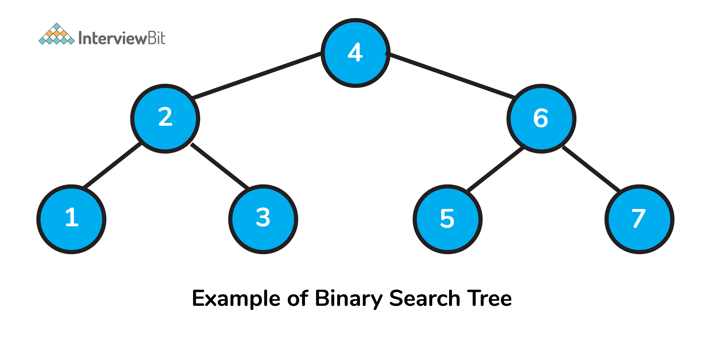

### 25. Số lượng nút tối đa của cây nhị phân có chiều dài k 

Số lượng nút tối đa là 2^(k+1) - 1, với k >= 1.

### 26. Viết hàm đệ quy tính chiều cao cây nhị phân trong Java 

Trước hết ta tạo một lớp đại diện cho mọi nút trong cây:

```java
public class Node{
    int data;
    Node left;
    Node right;
}
```

Hàm để tính chiều cao của cây:

```java
int heightOfBinaryTree(Node node)  
    { 
        if (node == null) 
            return 0; // If node is null then height is 0 for that node.
        else 
        { 
            // compute the height of each subtree
            int leftHeight = heightOfBinaryTree(node.left); 
            int rightHeight = heightOfBinaryTree(node.right); 

            //use the larger among the left and right height and plus 1 (for the root)
            return Math.max(leftHeight, rightHeight) + 1; 
        } 
    }
```

### 27. Viết hàm Java đếm số lượng nút trong cây

```java
int countNodes(Node root)
{
    int count =  1;             //Root itself should be counted
    if (root ==null)
        return 0;
    else
    {
        count += countNodes(root.left);
        count += countNodes(root.right);
        return count;
    }
}
```

### 28. Duyệt cây là gì?

Duyệt cây là quá trình đi qua tất cả nút trong cây. Từ gốc (root) là nút đầu tiên đến tất cả các nút được liên kết. Có 3 cách duyệt cây:

#### 1. Duyệt trung thứ tự:
- Thuật toán:
    + Bước 1: Duyệt cây con bên trái, gọi InOrder(root.left)
    + Bước 2: Duyệt root
    + Bước 3: Duyệt cây con bên phải, gọi InOrder(root.right)
- Code Java:
```java
// Print inorder traversal of given tree.
void printInorderTraversal(Node root) 
{ 
    if (root == null) 
        return; 

    //first traverse to the left subtree
    printInorderTraversal(root.left); 

    //then print the data of node
    System.out.print(root.data + " "); 

    //then traverse to the right subtree
    printInorderTraversal(root.right); 
}
```
- Dùng: cho tìm kiếm kiếm cây nhị phân.

#### 2. Duyệt tiền thứ tự:
- Thuật toán:
    + Bước 1: Duyệt root
    + Bước 2: Duyệt cây con bên trái, gọi InOrder(root.left)
    + Bước 3: Duyệt cây con bên phải, gọi InOrder(root.right)
- Code Java:
```java
// Print preorder traversal of given tree.
void printPreorderTraversal(Node root) 
{ 
    if (root == null) 
        return; 
    //first print the data of node
    System.out.print(root.data + " "); 

    //then traverse to the left subtree
    printPreorderTraversal(root.left);                    

    //then traverse to the right subtree
    printPreorderTraversal(root.right); 
}
```
- Dùng: Để tạo bản sao cây, và cũng được sử dụng để lấy biểu thức tiền tố của cây biểu thức.

#### 3. Duyệt hậu thứ tự:
- Thuật toán:
    + Bước 1: Duyệt cây con bên trái, gọi InOrder(root.left)
    + Bước 2: Duyệt cây con bên phải, gọi InOrder(root.right)
    + Bước 3: Duyệt root
- Code Java:
```java
// Print postorder traversal of given tree.
void printPostorderTraversal(Node root) 
{ 
    if (root == null) 
        return; 

    //first traverse to the left subtree
    printPostorderTraversal(root.left);                    

    //then traverse to the right subtree
    printPostorderTraversal(root.right); 

    //then print the data of node
    System.out.print(root.data + " "); 
}
```
- Dùng: Dùng để xoá cây và cũng được sử dụng để lấy biểu thức hậu tố của cây biểu thức.

Ví dụ: ta có cây nhị phân như sau:

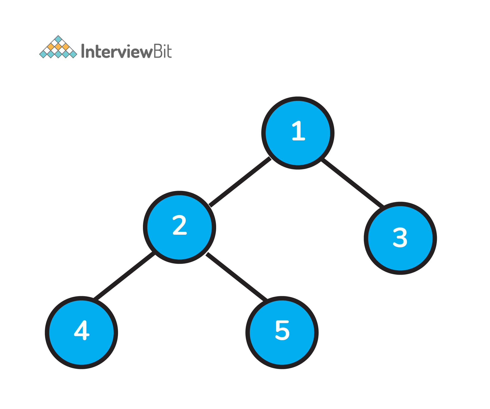

- Duyệt trung thứ tự => Left, Root, Right : [4, 2, 5, 1, 3]
- Duyệt tiền thứ tự => Root, Left, Right : [1, 2, 4, 5, 3]
- Duyệt hậu thứ tự => Left, Right, Root : [4, 5, 2, 3, 1]

### 29. Cây tìm kiếm nhị phân là gì?

Cây tìm kiếm nhị phân (BST) là một biến thể của cấu trúc dữ liệu cây nhị phân, lưu trữ dữ liệu một cách hiệu quả, trong đó các giá trị của các nút trong cây con bên trái nhỏ hơn giá trị của nút gốc và giá trị của các nút bên phải cao hơn nút gốc.

Ngoài ra, từng cây con bên trái và bên phải cũng phải đảm bảo tính chất trên trong mọi trường hợp.


### 30. Cây AVL là gì?

Cây AVL là cây cân bằng. Cây AVL kiểm tra chiều cao của cây con bên trái và bên phải và đảm bảo rằng sự khác biệt không quá 1. Sự khác biệt này được gọi là Hệ số Cân bằng và được tính bằng: `BalanceFactor = chiều cao (cây con bên trái) - chiều cao (cây con bên phải)`.

### 31. In chế độ xem bên trái của bất kỳ cây nhị phân nào 

Ý tưởng chính để giải quyết vấn đề này là duyệt cây theo tiền thứ tự và truyền thông tin về cấp bậc cùng với nó. Nếu cấp được truy cập lần đầu tiên, thì chúng ta lưu trữ thông tin của nút hiện tại và cấp hiện tại trong hashmap. Về cơ bản, thì ta đang có được chế độ xem bên trái bằng cách quan sát đến nút đầu tiên của mọi cấp độ.
Khi kết thúc quá trình duyệt, chúng ta có thể tìm ra giải pháp bằng cách duyệt qua map.

Hãy xem xét cây sau đây làm ví dụ để tìm chế độ xem bên trái:

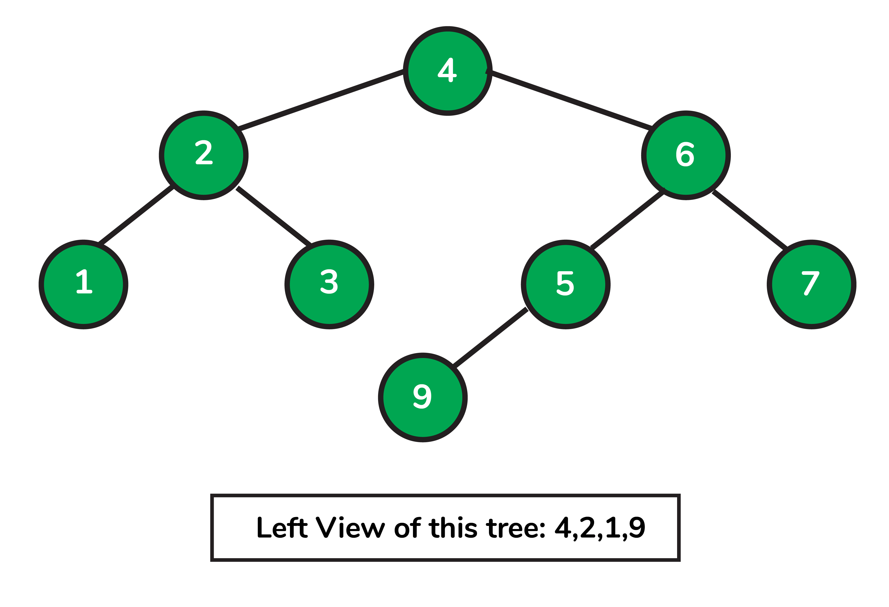

Code Java:

```java
import java.util.HashMap;

//to store a Binary Tree node
class Node
{
    int data;
    Node left = null, right = null;

    Node(int data) {
        this.data = data;
    }
}
public class InterviewBit
{
    // traverse nodes in pre-order way
    public static void leftViewUtil(Node root, int level, HashMap<Integer, Integer> map)
    {
        if (root == null) {
            return;
        }

        // if you are visiting the level for the first time
        // insert the current node and level info to the map
        if (!map.containsKey(level)) {
            map.put(level, root.data);
        }

        leftViewUtil(root.left, level + 1, map);
        leftViewUtil(root.right, level + 1, map);
    }

    // to print left view of binary tree
    public static void leftView(Node root)
    {
        // create an empty HashMap to store first node of each level
        HashMap<Integer, Integer> map = new HashMap<>();

        // traverse the tree and find out the first nodes of each level
        leftViewUtil(root, 1, map);

        // iterate through the HashMap and print the left view
        for (int i = 0; i <map.size(); i++) {
            System.out.print(map.get(i) + " ");
        }
    }

    public static void main(String[] args)
    {
        Node root = new Node(4);
        root.left = new Node(2);
        root.right = new Node(6);
        root.left.left = new Node(1);
        root.left.left = new Node(3);
        root.right.left = new Node(5);
        root.right.right = new Node(7);
        root.right.left.left = new Node(9);

        leftView(root);
    }
}
```

### 32. Cấu trúc dữ liệu đồ thị là gì?

Đồ thị là một loại cấu trúc dữ liệu phi tuyến tính bao gồm các đỉnh hoặc nút được kết nối bằng các cạnh hoặc liên kết để lưu trữ dữ liệu. Đồ thị có thể là có hướng hoặc vô hướng.


### 33. Ứng dụng của đồ thị?

Đồ thị được sử dụng trong nhiều ứng dụng khác nhau. Một số trong số chúng như sau:

- Đồ thị mạng xã hội để xác định luồng thông tin trong các trang web mạng xã hội như facebook, linkedin, v.v.
- Đồ thị mạng neural trong đó các nút đại diện cho các neuron và cạnh biểu thị các khớp thần kinh giữa chúng.
- Lưới giao thông trong đó các trạm là các nút và các tuyến là các cạnh của đồ thị.
- Đồ thị tiện ích điện hoặc nước trong đó các đỉnh là điểm kết nối và cạnh là dây hoặc đường ống kết nối chúng.
- Thuật toán tìm đường đi ngắn nhất giữa hai điểm.

### 34. Làm thế nào để biểu diễn đồ thị?

Ta có hai cách để biểu diễn đồ thị:

- Ma trận : Được sử dụng để biểu diễn dữ liệu tuần tự

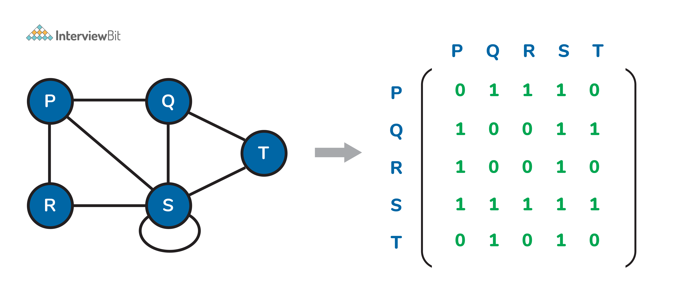

- Danh sách: Sử dụng để biểu diễn dữ liệu được liên kết


### 35. Sự khác biệt giữa cấu trúc dữ liệu cây và đồ thị 

Cây và đồ thị được phân biệt bởi cấu trúc cây phải được kết nối và không bao giờ có thể có vòng lặp (chu trình) trong khi trong đồ thị không có hạn chế đó.

Cây cung cấp thông tin chi tiết về mối quan hệ giữa các nút theo hệ thống phân cấp còn đồ thị tuân theo mô hình mạng.

### 36. Sự khác biệt giữa BFS (Breadth First Search) và DFS (Delth First Search)

| BFS | DFS |
|-----|-----|
| Breadth First Search | Depth First Search |
| Sử dụng hàng đợi | Sử dụng Ngăn xếp |
| Có thể được dùng để tìm đường đi ngắn nhất trong một đồ thị không trọng số, bởi vì trong BFS, ta có thể đến một đỉnh có số cạnh tối thiểu từ một đỉnh nguồn | Ta có thể đi qua nhiều cạnh hơn để đến một đỉnh đích từ một nguồn |
| Phù hợp để tìm kiếm các đỉnh gần với nguồn | Phù hợp khi có các giải pháp xa nguồn |
| Xem xét tất cả đỉnh lân cận do đó không thích hợp sử dụng trong trò chơi hay câu đố | Phù hợp cho vấn đề câu đố và trò chơi. Ta đưa ra quyết định sau đó khám phá tất cả đường đi thông qua quyết định này |
| Độ phức tạp thời gian O(V+E) khi dùng danh sách liền kề và O(V^2) khi dùng ma trận liền kề, trong đÓ V là đỉnh và E là cạnh | Độ phức tạp thời gian O(V+E) khi dùng danh sách liền kề và O(V^2) khi dùng ma trận liền kề, trong đÓ V là đỉnh và E là cạnh |
| Đến định liền kề trước khi đến đỉnh con | Đến đỉnh con trước khi đến đỉnh liền kề |

### 37. Khi nào sử dụng DFS tốt hơn BFS?

Việc sử dụng DFS hay BFS phụ thuộc nhiều vào cấu trúc của cây/đồ thị tìm kiếm, số lượng và vị trí của các giải pháp cần thiết:

- Nếu biết rằng giải pháp nằm gần gốc, thì BFS có thể tốt hơn.
- Nếu cây rất sâu và hiếm giải pháp, DFS sẽ mất rất nhiều thời gian, và BFS có thể nhanh hơn.
- Nếu cây rất rộng, BFS có thể cần quá nhiều bộ nhớ, vì vậy nó có thể hoàn toàn không thực tế. Ta DFS trong những trường hợp như vậy.
- Nếu có nhiều giải pháp nhưng nằm sâu trong cây, nên chọn DFS.
- Nếu cây rất sâu, ta sẽ cần hạn chế tìm kiếm với DFS.

### 38. Sắp xếp tô pô trong đồ thị là gì?

- Sắp xếp tô pô của một đồ thị có hướng là một thứ tự sắp xếp của các đỉnh sao cho với mọi cung từ đỉnh `i` đến đỉnh `j` trong đồ thị, `i` luôn nằm trước `j`.

- Sắp xếp tô pô chỉ khả dụng với Đồ thị có hướng không tuần hoàn (DAG).

- Các ứng dụng:
    1. Lập kế hoạch công việc từ các phụ thuộc đã cho giữa các công việc.
    2. Thứ tự đánh giá ô công thức trong bảng tính
    3. Thứ tự các nhiệm vụ biên dịch được thực hiện trong tạo file,
    4. Tuần tự hóa dữ liệu
    5. Giải quyết sự phụ thuộc ký hiệu trong trình liên kết.

Code sắp xếp cấu trúc tô pô trong Java:

```java
    // V - total vertices
    // visited - boolean array to keep track of visited nodes
    // graph - adjacency list.
    // Main Topological Sort Function. 
    void topologicalSort() 
    { 
        Stack<Integer> stack = new Stack<Integer>(); 
  
        // Mark all the vertices as not visited 
        boolean visited[] = new boolean[V]; 
        for (int j = 0; j < V; j++){ 
            visited[j] = false; 
        }
        // Call the util function starting from all vertices one by one 
        for (int i = 0; i < V; i++) 
            if (visited[i] == false) 
                topologicalSortUtil(i, visited, stack); 
  
        // Print contents of stack -> result of topological sort
        while (stack.empty() == false) 
            System.out.print(stack.pop() + " "); 
    } 
    
    // A helper function used by topologicalSort
    void topologicalSortUtil(int v, boolean visited[], 
                             Stack<Integer> stack) 
    { 
        // Mark the current node as visited. 
        visited[v] = true; 
        Integer i; 
  
        // Recur for all the vertices adjacent to the current vertex 
        Iterator<Integer> it = graph.get(v).iterator(); 
        while (it.hasNext()) { 
            i = it.next(); 
            if (!visited[i]) 
                topologicalSortUtil(i, visited, stack); 
        } 
  
        // Push current vertex to stack that saves result 
        stack.push(new Integer(v)); 
    } 
```

### 39. Cho một bản đồ lưới 2D, m x n trong đó giá trị "1" đại diện cho đất và "0" đại diện cho nước, trả về số lượng các hòn đảo (được bao quanh bởi nước và được hình thành bằng cách kết nối các vùng đất liền kề theo 2 hướng - theo chiều dọc hoặc chiều ngang). Giả sử rằng các trường hợp ranh giới - tức là tất cả bốn cạnh của lưới đều được bao quanh bởi nước.

Các hạn chế:

```
m == grid.length
n == grid[i].length
1 <= m, n <= 300
```

Giá trị của grid[i][j] có thể là `0` hoặc `1`.

Ví dụ:

```js
grid = [
    ["1", "1", "1", "0", "0"],
    ["1", "1", "0", "0", "0"],
    ["0", "0", "1", "0", "1"],
    ["0", "0", "0", "1", "1"],
]
```

Output: 3

Code giải quyết trong Java:
```java
class InterviewBit {
    public int numberOfIslands(char[][] grid) {
        if(grid==null || grid.length==0||grid[0].length==0)
            return 0;

        int m = grid.length;
        int n = grid[0].length;

        int count=0;
        for(int i=0; i<m; i++){
            for(int j=0; j<n; j++){
                if(grid[i][j]=='1'){
                    count++;
                    mergeIslands(grid, i, j);
                }
            }
        }

        return count;
    }

    public void mergeIslands(char[][] grid, int i, int j){
        int m=grid.length;
        int n=grid[0].length;

        if(i<0||i>=m||j<0||j>=n||grid[i][j]!='1')
            return;

        grid[i][j]='X';

        mergeIslands(grid, i-1, j);
        mergeIslands(grid, i+1, j);
        mergeIslands(grid, i, j-1);
        mergeIslands(grid, i, j+1);
    }
}
```

### 40. Cấu trúc dữ liệu heap là gì?

Heap là một cấu trúc dữ liệu phi tuyến tính dựa trên một cây nhị phân hoàn chỉnh. Một cây nhị phân được cho là hoàn chỉnh nếu tất cả các cấp được lấp đầy hoàn toàn ngoại trừ cấp cuối cùng và cấp cuối cùng có tất cả các phần tử hướng về bên trái càng nhiều càng tốt. Các heap có hai loại:

1. Max-Heap:

- Trong một Max-Heap, phần tử dữ liệu hiện diện ở nút gốc phải lớn nhất trong số tất cả các phần tử dữ liệu có trong cây.
- Thuộc tính này phải đúng một cách đệ quy cho tất cả các cây con của cây nhị phân đó.

2. Min-Heap:
- Trong một Min-Heap, phần tử dữ liệu hiện diện ở nút gốc phải là nhỏ nhất trong số tất cả các phần tử dữ liệu có trong cây.
- Thuộc tính này phải đúng một cách đệ quy cho tất cả các cây con của cây nhị phân đó