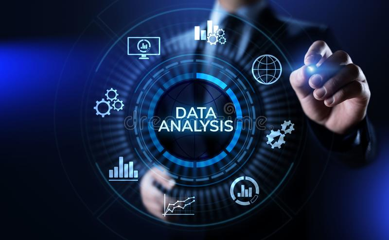
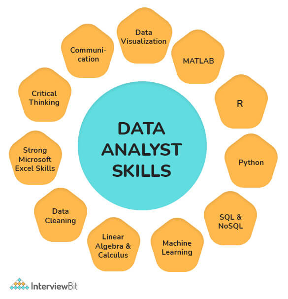
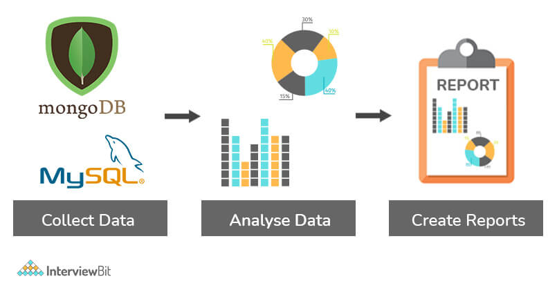

# Câu hỏi phỏng vấn Phân tích dữ liệu

Phân tích dữ liệu là một quá trình kiểm tra, làm sạch, chuyển đổi và mô hình hóa dữ liệu với mục tiêu khám phá thông tin hữu ích, thông báo kết luận và hỗ trợ ra quyết định. Phân tích dữ liệu có nhiều khía cạnh và cách tiếp cận, bao gồm các kỹ thuật đa dạng dưới nhiều tên khác nhau và được sử dụng trong các lĩnh vực kinh doanh, khoa học và khoa học xã hội khác nhau. Trong thế giới kinh doanh ngày nay, phân tích dữ liệu đóng vai trò giúp đưa ra quyết định khoa học hơn và giúp doanh nghiệp hoạt động hiệu quả hơn.

## Câu hỏi phỏng vấn phân tích dữ liệu cho Fresher

### 1. Nhiệm vụ của phân tích dữ liệu?

- Thu thập và phân tích dữ liệu bằng các kỹ thuật thống kê và báo cáo kết quả.
- Diễn giải và phân tích các xu hướng hoặc mẫu trong các tập dữ liệu phức tạp.
- Thiết lập nhu cầu kinh doanh cùng với nhóm kinh doanh hoặc đội quản lý.
- Tìm cơ hội cải tiến trong các quy trình hoặc lĩnh vực hiện có.
- Vận hành tập dữ liệu và ngừng hoạt động.
- Tuân theo các nguyên tắc khi xử lý dữ liệu hoặc thông tin bí mật.
- Kiểm tra các thay đổi và cập nhật đã được thực hiện đối với hệ thống sản xuất nguồn.
- Cung cấp cho người dùng cuối chương trình đào tạo về các báo cáo và trang tổng quan mới.
- Hỗ trợ cấu trúc lưu trữ dữ liệu, khai thác dữ liệu và làm sạch dữ liệu.

### 2. Các kỹ năng cần có cho phân tích dữ liệu?

Một vài kỹ năng nổi bật cần có:
- Kiến thức về gói báo cáo (đối tượng doanh nghiệp), ngôn ngữ lập trình (XML, JavaScript), và cơ sở dữ liệu (SQL, SQLite).
- Khả năng phân tích, tổ chức, thu thập và phổ biến dữ liệu lớn một cách chính xác và hiệu quả.
- Khả năng thiết kế cơ sở dữ liệu, tạo mô hình dữ liệu, thực hiện khai thác dữ liệu và phân đoạn dữ liệu.
- Hiểu biết tốt về các gói thống kê để phân tích tập dữ liệu lớn (SAS, SPSS, Microsoft Excel,...).
- Kỹ năng giải quyết vấn đề, làm việc theo nhóm và giao tiếp bằng văn bản và bằng lời nói hiệu quả.
- Xuất sắc trong việc viết truy vấn, báo cáo và thuyết trình.
- Hiểu biết về phần mềm trực quan hóa dữ liệu bao gồm Tableau và Qlik.
- Khả năng tạo và áp dụng các thuật toán chính xác nhất vào bộ dữ liệu để tìm kiếm giải pháp.

### 3. Quá trình phân tích dữ liệu?

Phân tích dữ liệu thường đề cập đến quá trình tập hợp, làm sạch, diễn giải, chuyển đổi và mô hình hóa dữ liệu để có được thông tin chi tiết hoặc kết luận và tạo báo cáo có ích chop doanh nghiệp. Sơ đồ sau minh họa các bước khác nhau liên quan đến quy trình:

- **Thu thập dữ liệu**: dữ liệu được thu thập từ các nguồn khác nhau và được lưu trữ để chuẩn bị và dọn sách. Bước này liên quan đến việc loại bỏ tất cả các giá trị bị thiếu và giá trị ngoại lai.
- **Phân tích dữ liệu**: Ngay sau khi dữ liệu được chuẩn bị, bước tiếp theo là phân tích nó. Các cải tiến được thực hiện bằng cách chạy lặp lại một mô hình. Sau đó, mô hình được xác nhận để đảm bảo rằng nó đang đáp ứng các yêu cầu. 
- **Tạo báo cáo**: cuối cùng, triển khai mô hình và tạo báo cáo để phân phối đến các bên liên quan.

### 4. Các thử thách khi phân tích dữ liệu?

- Các mục trùng lặp và lỗi chính tả. Chất lượng dữ liệu có thể bị cản trở và giảm do những lỗi này.
- Cách trình bày dữ liệu thu được từ nhiều nguồn có thể khác nhau. Nó có thể gây ra sự chậm trễ trong quá trình phân tích nếu dữ liệu thu thập được kết hợp sau khi được làm sạch và sắp xếp.
- Một thách thức lớn khác trong phân tích dữ liệu là dữ liệu không đầy đủ. Điều này luôn dẫn đến lỗi hoặc kết quả bị lỗi.
- Bạn sẽ phải mất rất nhiều thời gian để làm sạch dữ liệu nếu bạn đang trích xuất dữ liệu từ một nguồn kém.
- Lịch trình và kỳ vọng không thực tế của các bên liên quan trong kinh doanh
- Kết hợp / tích hợp dữ liệu từ nhiều nguồn là một thách thức, đặc biệt nếu không có các thông số và quy ước nhất quán
- Không đủ kiến trúc dữ liệu và công cụ để đạt được mục tiêu phân tích đúng hạn.

### 5. Giải thích data cleansing?

Làm việc với dữ liệu xấu đi kèm với các hậu quả khác nhau, từ chi phí bổ sung cho đến thời gian tăng thêm. Để tránh những kết quả tiêu cực này, nhiều tổ chức sẽ thực hiện các dự án làm sạch dữ liệu.

Làm sạch dữ liệu (data cleansing) là việc xem xét và chỉnh sửa hồ sơ hoặc cơ sở dữ liệu để loại bỏ chúng khỏi sự dư thừa và thông tin không chính xác, không đầy đủ hoặc sai lệch có thể làm sai lệch kết quả và gây ra các quyết định sai lầm hoặc không thực tế.

### 6. Các công cụ dùng cho phân tích dữ liệu?

- RapidMiner 
- KNIME 
- Google Search Operators 
- Google Fusion Tables 
- Solver 
- NodeXL 
- OpenRefine 
- Wolfram Alpha 
- io 
- Tableau

### 7. Sự khác biệt giữa data mining và data profiling?

