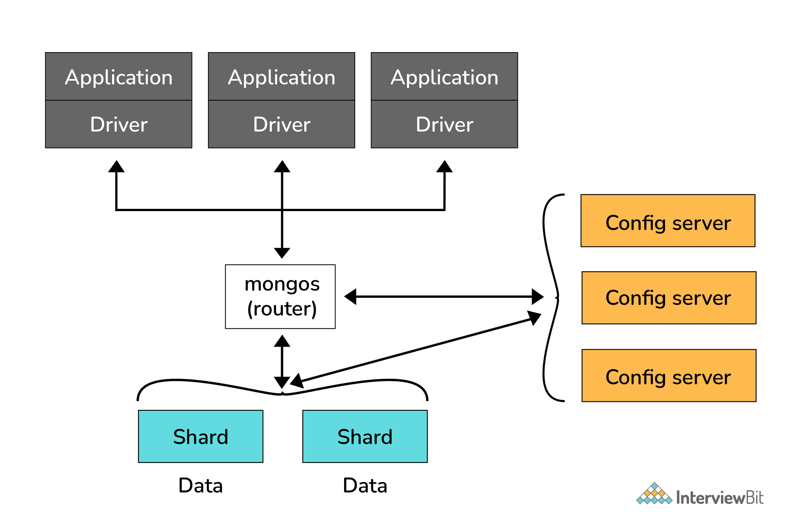
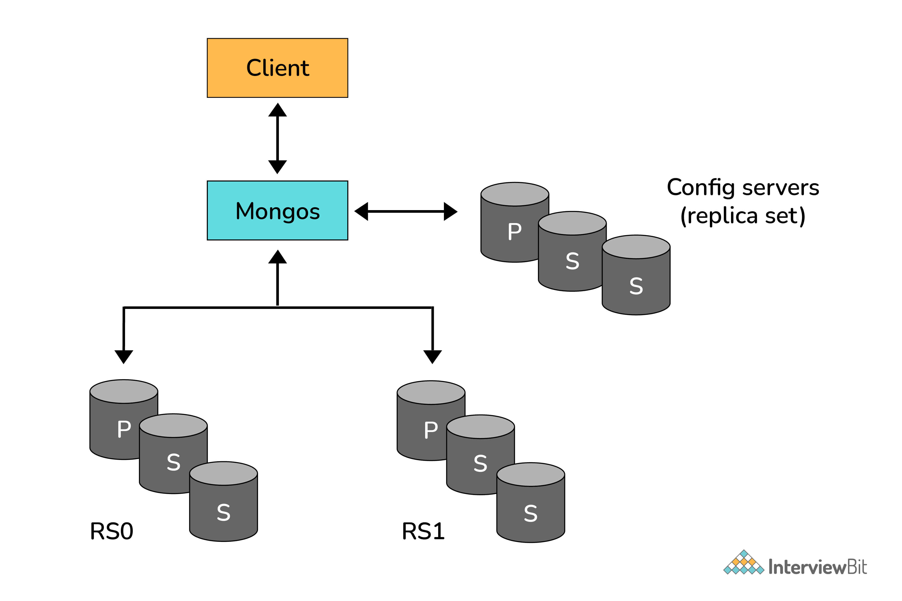
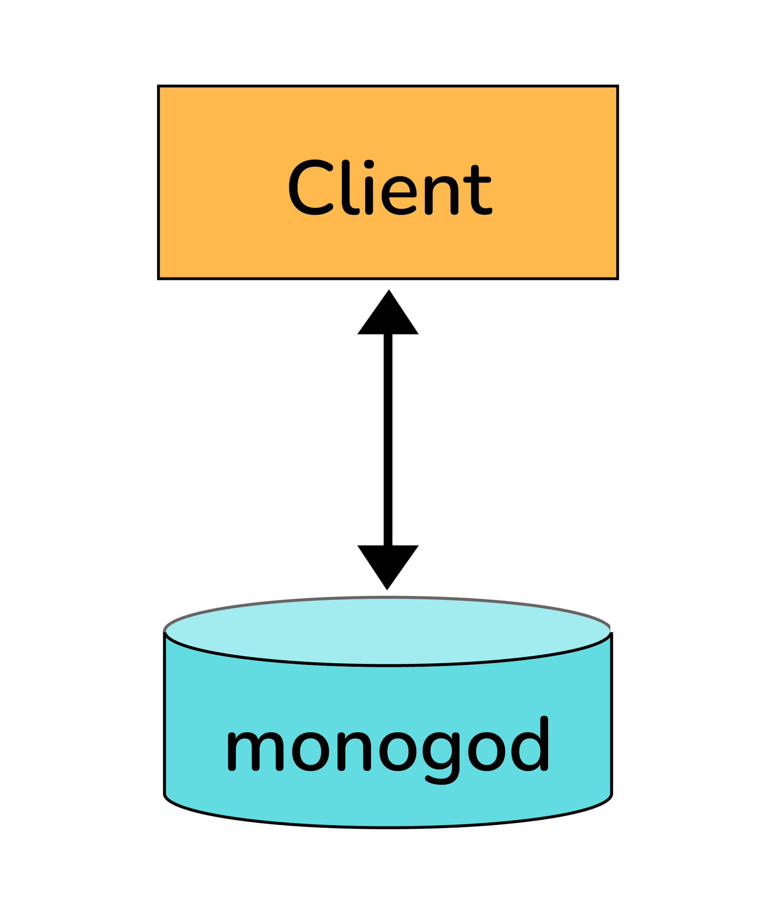
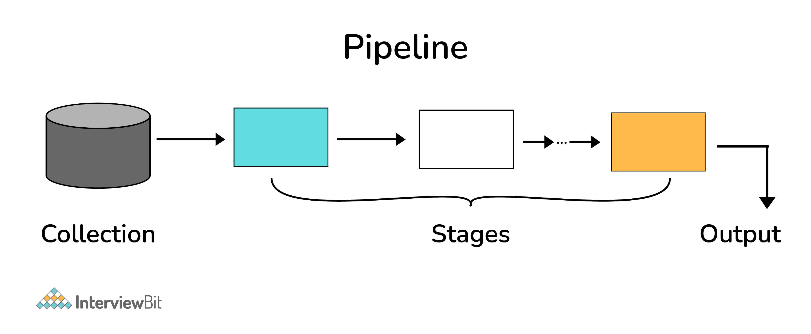
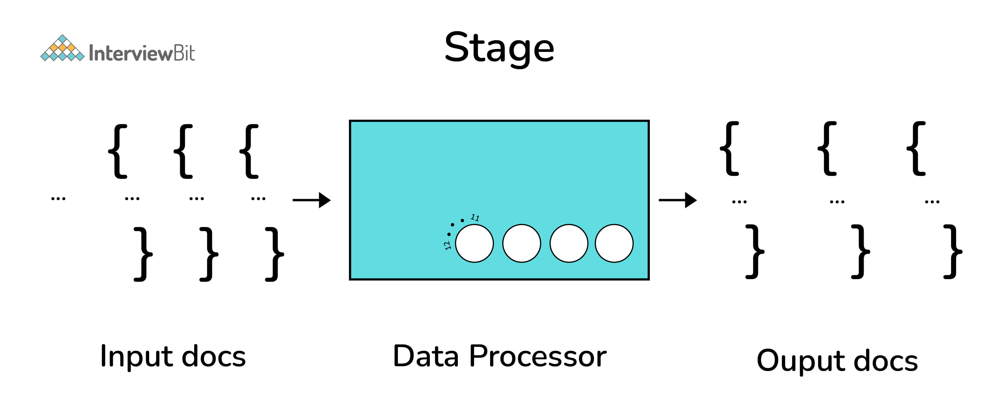
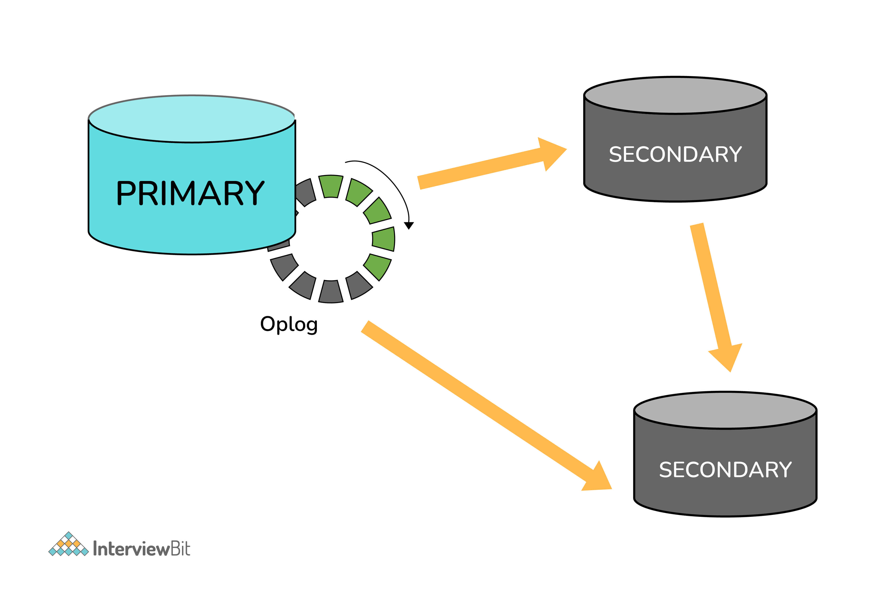

# Câu hỏi phỏng vấn MongoDB


Khi xử lý dữ liệu có hai kiểu dữ liệu mà ta có thể gặp là:
- Dữ liệu có cấu trúc
- Dữ liệu phi cấu trúc

Dữ liệu cấu trúc thường được lưu trữ dạng bảng trong khi dữ liệu phi cấu trúc thì không. Để quản lý các tập hợp dữ liệu phi cấu trúc như log, dữ liệu IoT, big data,.... Các cơ sở dữ liệu NoSQL được sử dụng.

## MongoDB là gì?
- MongoDB là cơ sở dữ liệu NoSQL mã nguồn mở được viết bằng C++. Nó sử dụng tài liệu dạng JSON để lưu trữ dữ liệu.
- Nó là một cơ sở dữ liệu hướng tài liệu, cung cấp khả năng mở rộng dễ dàng, đa nền tảng.
- MongoDB hoạt động dựa trên khái niệm Collection và Document.
- Nó kết hợp khả năng mở rộng quy mô với các tính năng như chỉ mục thứ cấp, truy vấn phạm vi, sắp xếp, tổng hợp và chỉ mục không gian địa lý.
- MongoDB được phát triển bởi MongoDB Inc. và được cấp phép theo Server Side Public License (SSPL).

## Mục lục

[1. Lợi ích của MongoDB?](#1-lợi-ích-của-mongodb)

[2. Document trong MongoDB là gì?](#2-document-trong-mongodb-là-gì)

[3. Collection trong MongoDB là gì?](#3-collection-trong-mongodb-là-gì)

[4. Cơ sở dữ liệu trong MongoDB](#4-cơ-sở-dữ-liệu-trong-mongodb)

[5. MongoDB Shell là gì?](#5-mongodb-shell-là-gì)

[6. Scale-Out xảy ra như thế nào trong MongoDB?](#6-scale-out-xảy-ra-như-thế-nào-trong-mongodb)

[7. Các tính năng của MongoDB?](#7-các-tính-năng-của-mongodb)

[8. Làm sao để thêm dữ liệu trong MongoDB?](#8-làm-sao-để-thêm-dữ-liệu-trong-mongodb)

[9. Làm thế nào để cập nhật một document?](#9-làm-thế-nào-để-cập-nhật-một-document)

[10. Cách xoá một document?](#10-cách-xoá-một-document)

[11. Làm sao để truy vấn trong MongoDB?](#11-làm-sao-để-truy-vấn-trong-mongodb)

[12. Các kiểu dữ liệu trong MongoDB?](#12-các-kiểu-dữ-liệu-trong-mongodb)

[13. Khi nào sử dụng MongoDB?](#13-khi-nào-sử-dụng-mongodb)

[14. Giải thích về indexing trong MongoDB?](#14-giải-thích-về-indexing-trong-mongodb)

[15. Chỉ mục địa lý (Geospatial Indexes) trong MongoDB?](#15-chỉ-mục-địa-lý-geospatial-indexes-trong-mongodb)

[16. Giải thích về quá trình sharding?](#16-giải-thích-về-quá-trình-sharding)

[17. Giải thích về SET trong MongoDB?](#17-giải-thích-về-set-trong-mongodb)

[18. Transaction trong MongoDB?](#18-transaction-trong-mongodb)

[19. MongoDB Charts là gì?](#19-mongodb-charts-là-gì)

[20. Aggregation trong MongoDB là gì?](#20-aggregation-trong-mongodb-là-gì)

[21. Giải thích về khái niệm pipeline trong MongoDB?](#21-giải-thích-về-khái-niệm-pipeline-trong-mongodb)

[22. Replica Set trong MongoDB là gì?](#22-replica-set-trong-mongodb-là-gì)

[23. Giải thích về kiến trúc Replication trong MongoDB?](#23-giải-thích-về-kiến-trúc-replication-trong-mongodb)

[24. Một số tiện ích để sao lưu và khôi phục trong MongoDB là gì?](#24-một-số-tiện-ích-để-sao-lưu-và-khôi-phục-trong-mongodb-là-gì)

## Câu hỏi phỏng vấn MongoDB cho Fresher

### 1. Lợi ích của MongoDB?

* Hiệu suất cao
* Tính sẵn sàng cao – Nhân rộng
* Khả năng mở rộng cao – Sharding
* Năng động – Không có lược đồ cứng nhắc.
* Linh hoạt – thêm / xóa trường có ít hoặc không ảnh hưởng đến ứng dụng
* Dữ liệu không đồng nhất
* Không joins
* Phân phối được
* Biểu diễn dữ liệu trong JSON hoặc BSON
* Hỗ trợ không gian địa lý (Geospatial)
* Tích hợp dễ dàng với BigData Hadoop

### 2. Document trong MongoDB là gì?

Một document trong MongoDB là một tập hợp key/value. Nó được biểu diễn bằng map, hash, hoặc dictionary. Trong JavaScript, document được biểu diễn dưới dạng các đối tượng:

```js
{"greeting": "Hello world!"}
```

Các document phức tạp sẽ chứa nhiều cặp key/value:

```js
{
    "welcome": "Hello world!", 
    "views": 3
}
```

### 3. Collection trong MongoDB là gì?

Collection là một nhóm document. Nếu một document trong MongoDB tương tự như một hàng trong SQL, thì một collection sẽ tương tự như một bảng.

Các document trong cùng một collection có thể khác nhau,... do tính chất **lược đồ dữ liệu động**.

Ví dụ:

```js
{"greeting" : "Hello world!", "views": 3}
{"signoff": "Good bye"}
```

### 4. Cơ sở dữ liệu trong MongoDB

Tập hợp các collection nằm trong cơ sở dữ liệu. MongoDB có thể có nhiều cơ sở dữ liệu, mỗi cơ sở dữ liệu chứa nhiều collection.

Một số tên cơ sở dữ liệu dành riêng như sau:
- *admin*
- *local*
- *config*

### 5. MongoDB Shell là gì?

Nó là một JavaScript shell cho phép tương tác với một phiên bản MongoDB từ dòng lệnh. Nhờ đó, người ta có thể thực hiện các chức năng quản trị, kiểm tra một phiên bản hoặc sử dụng MongoDB.

Để bắt đầu shell, ta chạy lệnh mongo:

```shell
$ mongod
$ mongo
MongoDB shell version: 4.2.0
connecting to: test
>
```

Shell là một trình thông dịch JavaScript đầy đủ tính năng, có khả năng chạy các chương trình JavaScript tùy ý. Hãy xem cách phép toán cơ bản hoạt động:

```shell
> x = 100;
200
> x / 5;
20
```

### 6. Scale-Out xảy ra như thế nào trong MongoDB?

Để scale out trong MongoDB, ta thực hiện Sharding.

Sharding là một phương pháp để lưu trữ dữ liệu (storage) của cơ sở dữ liệu trên nhiều máy chủ. MongoDB sử dụng sharding để hỗ trợ việc phân tán một lượng dữ liệu trên nhiều máy chủ, ở đây có thể là các tập collection trong DB điều này giúp cho việc truy cập nhanh hơn, giảm tải việc quá tải ổ cứng cho một vài máy chủ và giúp hệ thống dễ dàng mở rộng khi có nhu cầu hơn.

Mongodb Sharded Cluster bao gồm các thành phần chính như sau:
- **Shards**: Là nơi chứa dữ liệu, được phân tán bởi nhiều máy chủ theo cơ chế "replica set".
- **Query routers - Mongos**: Là nơi điều hướng việc client truy cập chính xác dữ liệu vào shard nào, mỗi hệ thống Sharding có thể có nhiều query router.
- **Config servers**: Là nơi chưa các metadata (nôm na là các thông số kỹ thuật) của hệ thống Sharding, nó chứa một bản đồ dữ liệu của việc thiết lập các Shards. Query routers dùng các metadata này xác định được chính xác việc truy vấn vào Shards nào trên hệ thống. Mỗi hệ thống Sharding có chính xác là 3 file Config servers.



### 7. Các tính năng của MongoDB? 

- **Indexing** hỗ trợ chỉ mục thứ cấp và cung cấp tính năng đánh chỉ mục duy nhất, đa hợp, không gian địa lý và toàn văn bản.
- **Aggregation** cung cấp framework aggregation dựa trên khái niệm xử lý dữ liệu trong pipelines.
- **Special collection và index types**: nó hỗ trợ time-to-live collection cho dữ liệu sẽ hết hạn vào một thời điểm nhất định.
- **File storage** cung cấp giao thức đơn giản cho lưu trữ file và thông tin file.
- **Sharing** là quá trình chia sẽ dữ liệu trên nhiều máy.

### 8. Làm sao để thêm dữ liệu trong MongoDB?

Phương thức thêm dữ liệu cơ bản trong MongoDB là "insert". Để thêm một document ta dùng `insertOne`:

```
> db.books.insertOne({"title": "Start With Why"})
```

Để thêm nhiều document vào một collection, ta có thể dùng `insertMany`, phương thức này cho phép chuyển một mảng document vào cơ sở dữ liệu.

### 9. Làm thế nào để cập nhật một document?

Sau khi document được lưu trữ trong cơ sở dữ liệu, nó có thể được cập nhật bằng một trong các phương pháp sau: `updateOne`, `updateMany` và `replaceOne`. 

`updateOne` và `updateMany` mỗi cái lấy một document lọc làm tham số đầu tiên và một document chỉnh sửa làm tham số thứ hai. `replaceOne` cũng lấy một bộ lọc làm tham số đầu nhưng với tham số thức hai, `replaceOne` sẽ mong đợi tài liệu thay thế phù hợp với filter.

```js
{
   "_id" : ObjectId("4b2b9f67a1f631733d917a7a"),
   "name" : "alice",
   "friends" : 24,
   "enemies" : 2
}
```

### 10. Cách xoá một document?

Xoá trong MongoDB được hỗ trợ bằng `deleteOne` và `deleteMany`. Cả hai phương thức này đều nhận vào một bộ lọc document làm tham số đầu tiên. Bộ lọc chỉ định một tập hợp các tiêu chí phù hợp với việc xoá document.

```
> db.books.deleteOne({"_id" : 3})
```

### 11. Làm sao để truy vấn trong MongoDB?

Phương thức `find` được dùng để thực hiện truy vấn trong MongoDB. Truy vấn trả về một tập con document trong một collection, có thể là không có document nào cũng có thể là toàn bộ. Document được trả về được xác định bởi tham số đầu tiên cần tìm là tiêu chí truy vấn document.

```
> db.users.find({"age" : 24})
```

### 12. Các kiểu dữ liệu trong MongoDB? 

MongoDB hỗ trợ nhiều kiểu dữ liệu dưới dạng giá trị trong document. Các document trong MongoDB tương tự như các đối tượng trong JavaScript. Cùng với bản chất key/value thiết yếu của JSON, MongoDB bổ sung hỗ trợ cho một số kiểu dữ liệu bổ sung. Các kiểu dữ liệu phổ biến trong MongoDB là:

- Null

```js
{"x" : null}
```

- Boolean

```js
{"x" : true}
```

- Number

```js
{"x" : 4}
```

- String

```js
{"x" : "foobar"}
```

- Date

```js
{"x" : new Date()}
```

- Regular expression

```js
{"x" : /foobar/i}
```

- Array

```js
{"x" : ["a", "b", "c"]}
```

- Embedded document

```js
{"x" : {"foo" : "bar"}}
```

- Object ID

```js
{"x" : ObjectId()}
```

- Binary Data là một chuỗi các byte tùy ý.

- Code
{"x" : function() { /* ... */ }}

### 13. Khi nào sử dụng MongoDB?

Bạn nên sử dụng MongoDB khi bạn đang xây dựng các ứng dụng internet và doanh nghiệp cần phát triển nhanh chóng và mở rộng quy mô một cách gọn gàng. MongoDB phổ biến với các nhà dev đang xây dựng các ứng dụng có khả năng mở rộng bằng cách sử dụng các phương pháp agile.

MongoDB là một lựa chọn tuyệt vời nếu bạn cần:
- Hỗ trợ phát triển lặp đi lặp lại nhanh chóng.
- Mở rộng quy mô đến mức cao của lưu lượng đọc và ghi - MongoDB hỗ trợ mở rộng quy mô theo chiều ngang thông qua Sharding, phân phối dữ liệu trên một số máy và tạo điều kiện cho các hoạt động thông lượng cao với bộ dữ liệu lớn.
- Quy mô kho dữ liệu của bạn có một kích thước lớn.
- Phát triển loại hình triển khai khi doanh nghiệp thay đổi.
- Lưu trữ, quản lý và tìm kiếm dữ liệu với các văn bản, không gian địa lý hoặc chuỗi thời gian.

## Câu hỏi phỏng vấn MongoDB cho Experienced

### 14. Giải thích về indexing trong Mongodb?

Chỉ mục (Index) hỗ trợ việc phân giải các truy vấn hiệu quả hơn. Nếu không có chỉ mục, MongoDB phải quét qua mọi Document của một Collection để chọn các Document mà kết nối với lệnh truy vấn. Việc quét này có thể không hiệu quả và yêu cầu MongoDB xử lý một số lượng lớn dữ liệu.

Chỉ mục (Index) là các cấu trúc dữ liệu đặc biệt, lưu giữ một phần nhỏ của tập hợp dữ liệu, giúp việc độc collection một cách dễ dàng hơn. Chỉ mục lưu giữ giá trị của một trường cụ thể hoặc tập hợp các trường, được sắp xếp bởi giá trị của trường như đã được xác định trong chỉ mục.

Để tạo chỉ mục, có thể dùng phương thức `createIndex`. Ví dụ:

```
> db.users.find({"username": "user101"}).explain("executionStats")
```

Ở đây, chế độ `executionStats` giúp ta hiểu tác dụng của việc sử dụng một chỉ mục để đáp ứng các truy vấn. 

### 15. Chỉ mục địa lý (Geospatial Indexes) trong MongoDB?

MongoDB có hai loại chỉ mục đia lý là: **2d** và **2dsphere**.

Chỉ mục 2dsphere làm việc với các hình cầu mô phỏng bề mặt trái đất dựa trên hệ toạ độ WGS-84. Hệ toạ độ này mô hình hoá bề mặt trái đất như một hình cầu phẳng. Do đó, ác phép tính khoảng cách sử dụng chỉ mục 2dsphere, sẽ tính đến hình dạng của trái đất và cung cấp cách xử lý chính xác hơn về khoảng cách giữa hai thành phố.

Ví dụ: Tính toán khoảng cách giữa hai thành phố

- Sử dụng chỉ mục 2d cho các điểm lưu trữ trên mặt phẳng hai chiều:
```js
{
    "name" : "New York City",
    "loc" : {
        "type" : "Point",
        "coordinates" : [50, 2]
    }
}
```

- 2dsphere cho phép bạn chỉ định các điểm, đường thẳng, đa giác ở dạng GeoJSON. Một điểm được biểu diễn bởi một mảng hai phần tử[kinh độ, vĩ độ]:

```js
{
    "name" : "Hudson River",
    "loc" : {
        "type" : "LineString",
        "coordinates" : [[0,1], [0,2], [1,2]]
    }
}
```

### 16. Giải thích về quá trình sharding?

Sharding là quá trình chia nhỏ dữ liệu giữa các máy. Đôi khi người ta cũng sử dụng thuật ngữ "partitioning" để mô tả khái niệm này. Ta có thể lưu trữ nhiều dữ liệu hơn và xử lý nhiều tải hơn mà không yêu cầu cấu hình máy mạnh hơn, bằng cách đặt một tập con dữ liệu trên mỗi máy.

Trong hình bên dưới, RS0 và RS1 là shards. Sharding trong MongoDB cho ta tạo một cụm gồm nhiều máy (shards) và chia các tập hợp trên đó. Đặt các tập con dữ liệu vào mỗi shard. Nó cho phép ứng dụng của bạn phát triển vượt ngoài giới hạn của một server độc lập.





### 17. Giải thích về SET trong MongoDB?

Nếu giá trị của trường không tồn tại, thiết lập `$set` giá trị có thể hữu ích cho cập nhật lược đồ hay thêm khoá người dùng định nghĩa.

```js
> db.users.findOne()
{
   "_id" : ObjectId("4b253b067525f35f94b60a31"),
   "name" : "alice",
   "age" : 23,
   "sex" : "female",
   "location" : "India"
}
```

Để thêm trường vào ta có thể dừng `$set`:

```
> db.users.updateOne({"_id" : 
ObjectId("4b253b067525f35f94b60a31")},
... {"$set" : {"favorite book" : "Start with Why"}})
```

### 18. Transaction trong MongoDB?

Transaction là một đơn vị xử lý logic trong cơ sở dữ liệu bao gồm một hoặc nhiều thao tác cơ sở dữ liệu, có thể là thao tác đọc hoặc ghi. Transaction cung cấp một tính năng hữu ích trong MongoDB để đảm bảo tính nhất quán.

MongoDB cung cấp 2 API cho sử dụng transaction là:
- **Core API**: tương tực với cú pháp của cơ sở dữ liệu quan hệ (start_transaction  và commit_transaction)
- **Call-back API**: Đây là cách tiếp cận được khuyến nghị để sử dụng các transaction. Nó bắt đầu một transaction, thực hiện các hoạt động được chỉ định và commit (hoặc hủy bỏ do lỗi). Nó cũng tự động kết hợp logic xử lý lỗi cho "TransientTransactionError" và "UnknownTransactionCommitResult".

### 19. MongoDB Charts là gì?

MongoDB Charts là một công cụ để tạo các minh họa trực quan cho dữ liệu MongoDB của bạn. Trực quan hóa dữ liệu là một thành phần quan trọng để cung cấp sự hiểu biết rõ ràng về dữ liệu của bạn, làm nổi bật mối tương quan giữa các biến và giúp bạn dễ dàng phân biệt các mẫu và xu hướng trong bộ dữ liệu của mình. Biểu đồ MongoDB giúp cho việc truyền tải dữ liệu của bạn trở nên đơn giản hơn bằng cách cung cấp các công cụ có sẵn để dễ dàng chia sẻ và cộng tác trên các hình ảnh trực quan.

Có hai cách triển khai MongoDB Charts là:

* MongoDB Charts PaaS
* MongoDB Charts Server

### 20. Aggregation trong MongoDB là gì?

Aggregation là một framework tổng hợp dữ liệu của MongoDB. Aggregation được xây dựng dựa trên mô hình xử lý dữ liệu dưới dạng pipeline. 

Aggregation pipeline bao gồm nhiều giai đoạn. Trong mỗi giai đoạn, chúng ta sử dụng một aggregation operator để biến đổi dữ liệu của các input document. Các output document của giai đoạn phía trước sẽ là input document của giai đoạn ngay sau. Các aggregation operator có thể được sử dụng nhiều lần trong pipeline, ngoại trừ `$out`, `$merge`, và `$geoNear`.



### 21. Giải thích về khái niệm pipeline trong MongoDB?

Một giai đoạn riêng lẻ của một aggregation pipeline là một đơn vị xử lý dữ liệu. Nó nhận từng dòng document đầu vào, xử lý từng document một và tạo ra từng dòng document đầu ra (xem hình bên dưới).



### 22. Replica Set trong MongoDB là gì?

Để giữ các bản sao dữ liệu giống hệt nhau trên nhiều server, ta sử dụng tính năng replication (sao chép). Sử dụng replication sẽ giữ cho ứng dụng của bạn chạy và dữ liệu của bạn an toàn, ngay cả khi có điều gì đó xảy ra với một hoặc nhiều server.

Replication như vậy có thể được tạo bởi một replica set với MongoDB. Replica set  là một nhóm các tiến trình của Mongodb duy trì cùng một bộ dữ liệu. Các replica set cung cấp tính dự phòng và tính sẵn sàng cao và là cơ sở để triển khai nhập xuất dữ liệu khi cần thiết.

### 23. Giải thích về kiến trúc Replication trong MongoDB?



- Một replica set chỉ có duy nhất một primary. Primary sẽ nhận các yêu cầu ghi. Primary ghi các thay đổi của nó vào oplog.
- Các secondary sẽ có chung data set với primary, các yêu cầu đọc có thể scale trên primary và tất cả các secondary. Một replica set có thể có tối đa là 50 member.
- Các member luôn giữ duy trì kết nối, trong trường hợp một member chết thì các member khác sẽ tự động được chuyển đổi dự phòng. Đây là một điểm khác biệt so với mysql.

### 24. Một số tiện ích để sao lưu và khôi phục trong MongoDB là gì?

Mongo shell không bao gồm các chức năng xuất, nhập, sao lưu hoặc khôi phục. Tuy nhiên, MongoDB đã tạo ra các phương thức để thực hiện điều này, do đó không cần đến việc viết script hoặc GUI phức tạp. Ở đây, một số script tiện ích được cung cấp có thể được sử dụng để lấy dữ liệu vào hoặc ra cơ sở dữ liệu hàng loạt. Các script tiện ích này là:
- mongoimport
- mongoexport
- mongodump
- mongorestore