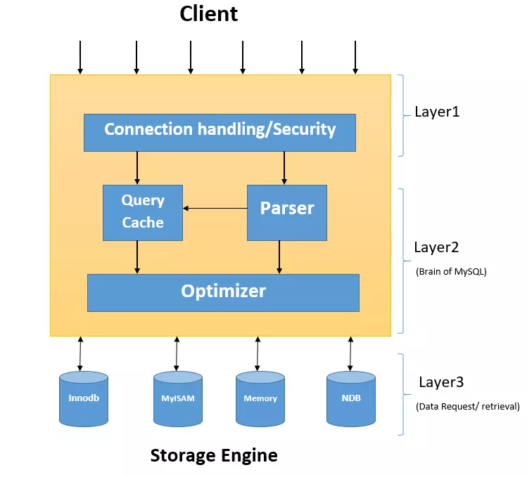
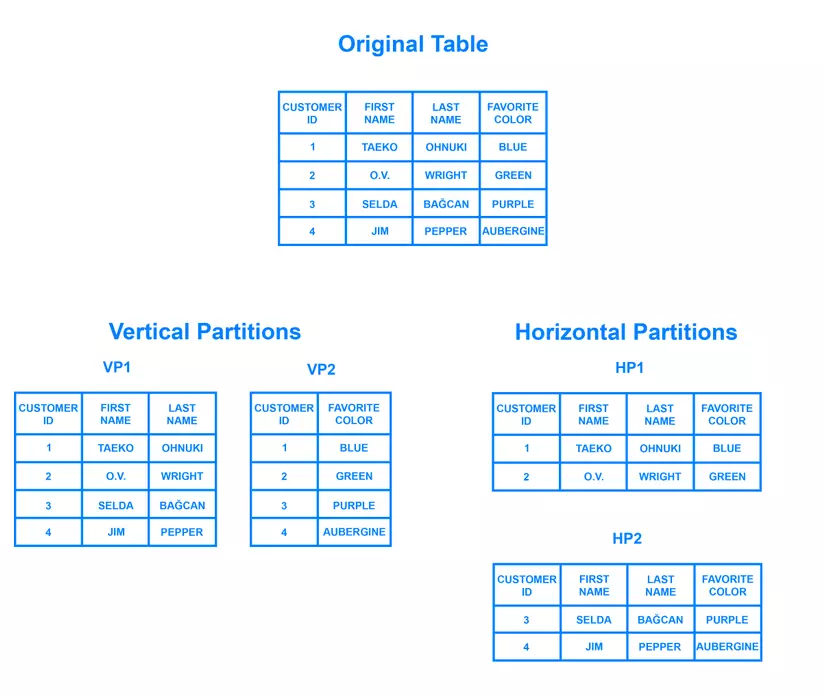

# Câu hỏi phỏng vấn MySQL


## MySQL là gì?

MySQL là hệ quản trị cơ sở dữ liệu quan hệ (RDBMS) mã nguồn mở, chạy nhanh, tin cậy và dễ sử dụng. MySQL dựa trên chuẩn SQL để biên dịch trên nhiều nền tảng, nó là hệ quản trị cơ sở dữ liệu SQL đa luồng và đa người dùng.

Dữ liệu trong cơ sở dữ liệu MySQL được lưu dưới dạng bảng. Một bảng là một tập hợp dữ liệu có quan hệ, trong bảng bao gồm cột và hàng.

MySQL có client độc lập cho phép người dùng tương tác trực tiếp với cơ sở dữ liệu MySQL bằng SQL, nhưng cũng có thể triển khai các ứng dụng sử dụng ngôn ngữ khác.

Hiện tại MySQL là cơ sở dữ liệu phổ biến nhất thế giới.

## Mục lục

[1. MySQL là gì?](#1-mysql-l%C3%A0-g%C3%AC)

[2. Ưu điểm của MySQL?](#2-%C6%B0u-%C4%91i%E1%BB%83m-c%E1%BB%A7a-mysql)

[3. Bạn hiểu "cơ sở dữ liệu" là gì?](#3-b%E1%BA%A1n-hi%E1%BB%83u-%22c%C6%A1-s%E1%BB%9F-d%E1%BB%AF-li%E1%BB%87u%22-l%C3%A0-g%C3%AC)

[4. Chuẩn SQL là gì?](#4-chu%E1%BA%A9n-sql-l%C3%A0-g%C3%AC)

[5. Một cơ sở dữ liệu MySQL bao gồm những gì?](#5-m%E1%BB%99t-c%C6%A1-s%E1%BB%9F-d%E1%BB%AF-li%E1%BB%87u-mysql-bao-g%E1%BB%93m-nh%E1%BB%AFng-g%C3%AC)

[6. Làm thế nào để tương tác với MySQL?](#6-l%C3%A0m-th%E1%BA%BF-n%C3%A0o-%C4%91%E1%BB%83-t%C6%B0%C6%A1ng-t%C3%A1c-v%E1%BB%9Bi-mysql)

[7. Truy vấn MySQL là gì?](#7-truy-v%E1%BA%A5n-mysql-l%C3%A0-g%C3%AC)

[8. Các lệnh phổ biến trong MySQL?](#8-c%C3%A1c-l%E1%BB%87nh-ph%E1%BB%95-bi%E1%BA%BFn-trong-mysql)

[9. Cách tạo cơ sở dữ liệu trong MySQL?](#9-c%C3%A1ch-t%E1%BA%A1o-c%C6%A1-s%E1%BB%9F-d%E1%BB%AF-li%E1%BB%87u-trong-mysql)

[10. Cách tạo bảng trong MySQL?](#10-c%C3%A1ch-t%E1%BA%A1o-b%E1%BA%A3ng-trong-mysql)

[11. Cách chèn dữ liệu vào MySQL?](#11-c%C3%A1ch-ch%C3%A8n-d%E1%BB%AF-li%E1%BB%87u-v%C3%A0o-mysql)

[12. Xoá cột trong MySQL?](#12-xo%C3%A1-c%E1%BB%99t-trong-mysql)

[13. Đánh chỉ mục trong MySQL?](#13-%C4%91%C3%A1nh-ch%E1%BB%89-m%E1%BB%A5c-trong-mysql)

[14. Xoá dữ liệu trong bảng MySQL?](#14-xo%C3%A1-d%E1%BB%AF-li%E1%BB%87u-trong-b%E1%BA%A3ng-mysql)

[15. Cách để xem cơ sở dữ liệu trong MySQL?](#15-c%C3%A1ch-%C4%91%E1%BB%83-xem-c%C6%A1-s%E1%BB%9F-d%E1%BB%AF-li%E1%BB%87u-trong-mysql)

[16. Các kiểu số trong MySQL?](#16-c%C3%A1c-ki%E1%BB%83u-s%E1%BB%91-trong-mysql)

[17. Các kiểu chuỗi trong MySQL?](#17-c%C3%A1c-ki%E1%BB%83u-chu%E1%BB%97i-trong-mysql)

[18. Kiểu dữ liệu thời gian là gì?](#18-ki%E1%BB%83u-d%E1%BB%AF-li%E1%BB%87u-th%E1%BB%9Di-gian-l%C3%A0-g%C3%AC)

[19. BLOB trong MySQL là gì?](#19-blob-trong-mysql-l%C3%A0-g%C3%AC)

[20. Cách thêm người dùng vào MySQL?](#20-c%C3%A1ch-th%C3%AAm-ng%C6%B0%E1%BB%9Di-d%C3%B9ng-v%C3%A0o-mysql)

[21. View trong MySQL là gì?](#21-view-trong-mysql-l%C3%A0-g%C3%AC)

[22. Tạo và thực thi view trong MySQL?](#22-t%E1%BA%A1o-v%C3%A0-th%E1%BB%B1c-thi-view-trong-mysql)

[23. MySQL Trigger là gì?](#23-mysql-trigger-l%C3%A0-g%C3%AC)

[24. Có bao nhiêu Trigger khả dụng trong MySQL?](#24-c%C3%B3-bao-nhi%C3%AAu-trigger-kh%E1%BA%A3-d%E1%BB%A5ng-trong-mysql)

[25. MySQL Server là gì?](#25-mysql-server-l%C3%A0-g%C3%AC)

[26. MySQL Client là gì?](#26-mysql-client-l%C3%A0-g%C3%AC)

[27. Các kiểu quan hệ trong MySQL?](#27-c%C3%A1c-ki%E1%BB%83u-quan-h%E1%BB%87-trong-mysql)

[28. Giải thích kiến trúc của MySQL?](#28-gi%E1%BA%A3i-th%C3%ADch-ki%E1%BA%BFn-tr%C3%BAc-c%E1%BB%A7a-mysql)

[29. Mở rộng trong MySQL?](#29-m%E1%BB%9F-r%E1%BB%99ng-trong-mysql)

[30. Sharding trong MySQL?](#30-sharding-trong-mysql)

[31. Transaction Storage Engines trong MySQL là gì?](#31-transaction-storage-engines-trong-mysql-l%C3%A0-g%C3%AC)

## Câu hỏi phỏng vấn MySQL cho Fresher

### 1. MySQL là gì?

MySQL là hệ quản trị cơ sở dữ liệu mã nguồn mở lớn nhất thế giới, đặc biết được dùng rất nhiều cho các dự án, ứng dụng, website trên internet.

### 2. Ưu điểm của MySQL?

- **Dễ sử dụng:** MySQL là cơ sở dữ liệu tốc độ cao, ổn định, dễ sử dụng và hoạt động trên nhiều hệ điều hành cung cấp một hệ thống lớn các hàm tiện ích rất mạnh.
- **Độ bảo mật cao:**  MySQL rất thích hợp cho các ứng dụng có truy cập CSDL trên Internet khi sở hữu nhiều nhiều tính năng bảo mật thậm chí là ở cấp cao.
- **Đa tính năng:** MySQL hỗ trợ rất nhiều chức năng SQL được mong chờ từ một hệ quản trị cơ sở dữ liệu quan hệ cả trực tiếp lẫn gián tiếp.
- **Khả năng mở rộng và mạnh mẽ:** MySQL có thể xử lý rất nhiều dữ liệu và hơn thế nữa nó có thể được mở rộng nếu cần thiết.
- **Nhanh chóng:** Việc đưa ra một số tiêu chuẩn cho phép MySQL để làm việc rất hiệu quả và tiết kiệm chi phí, do đó nó làm tăng tốc độ thực thi.

### 3. Bạn hiểu "cơ sở dữ liệu" là gì?

Cơ sở dữ liệu là hệ thống bao gồm rất nhiều thông tin, dữ liệu được xây dựng theo một cấu trúc nhất định nhằm đáp ứng nhu cầu khai thác, sử dụng của nhiều người hay chạy nhiều chương trình ứng dụng cùng một lúc.

Khi áp dụng hình thức lưu trữ này, nó sẽ giúp khắc phục được những điểm yếu của việc lưu file thông thường trên máy tính. Các thông tin lưu trữ sẽ đảm bảo được nhất quán, hạn chế tình trạng trùng lặp thông tin.

### 4. Chuẩn SQL là gì?

Chuẩn SQL (Structured Query Language) là ngôn ngữ sử dụng cho các RDBMS bên cạnh MySQL như Oracle, Microsoft SQL Server. Có thể coi SQL là ngôn ngữ chung mà bất cứ hệ thống cơ sở dữ liệu quan hệ (RDBMS) nào cũng phải đáp ứng.

### 5. Một cơ sở dữ liệu MySQL bao gồm những gì?

Một cơ sở dữ liệu MySQL bao gồm một hay nhiều bảng, mỗi bảng gồm cột và dòng. Trong đó cột là các thuộc tính dữ liệu còn hàng là các bản ghi dữ liệu.

### 6. Làm thế nào để tương tác với MySQL?

Có 3 cách để tương tác với MySQL:
- dùng lệnh trực tiếp
- qua web interface
- qua ngôn ngữ lập trình

### 7. Truy vấn MySQL là gì?

Một truy vấn là một yêu cầu hay câu hỏi cụ thể. Nó đòi hỏi cơ sở dữ liệu phải trả về một hay nhiều bảng ghi cụ thể.

### 8. Các lệnh phổ biến trong MySQL?

| Command | Action |
|---------|--------|
| ALTER | Chỉnh sửa bảng hay cơ sở dữ liệu |
| BACKUP | Phục hồi bảng |
| CREATE | Tạo cơ sở dữ liệu |
| DELETE | Xoá hàm của bảng |
| DESCRIBE | Mô tả cột của bảng |
| DROP | Xoá bảng hay cơ sở dữ liệu |
| EXIT | Thoát |
| GRANT | Đổi quyền người dùng |
| HELP | Hiển thị bảng trợ giúp |
| INSERT | Thêm dữ liệu |
| LOCK | Khoá bảng |
| QUIT | Giống EXIT |
| RENAME | Đổi tên bảng |
| SHOW | Liệt kê chi tiết đối tượng |
| SOURCE | Thực thi một file |
| STATUS | Hiển thị trạng thái hiện tại |
| TRUNCATE | Làm trống bảng |
| UNLOCK | Mở khoá bảng |
| UPDATE | Cập nhật bảng ghi đã tồn tại |
| USE | Sử dụng cơ sở dữ liệu | 

### 9. Cách tạo cơ sở dữ liệu trong MySQL?

```sql
CREATE DATABASE books;
```

### 10. Cách tạo bảng trong MySQL?

```sql
CREATE TABLE history (
    author VARCHAR(128),
    title VARCHAR(128),
    type VARCHAR(16),
    year CHAR(4)
) ENGINE InnoDB;
```

### 11. Cách chèn dữ liệu vào MySQL?

Lệnh INSERT INTO dùng cho chèn bảng ghi mới vào bảng MySQL:

```sql
INSERT INTO table_name (column1, column2, column3,...)
VALUES (value1, value2, value3,...)
```

Nếu bạn muốn thêm dữ liệu cho tất cả cột trong bảng, bạn không cần chỉ định tên cột trong truy vấn SQL. Tuy nhiên, trật tự của giá trị sẽ tương ứng với thứ tự cột của bảng.

```sql
INSERT INTO table_name 
VALUES (value1, value2, value3,...)
```

### 12. Xoá cột trong MySQL?

```sql
ALTER TABLE classics DROP pages;
```

### 13. Đánh chỉ mục trong MySQL?

Trong MySQL, có nhiều kiểu chỉ mục khác nhau như regular index, fulltext index hay primary key. Các chỉ mục giúp ta tìm kiếm nhanh hơn. Chỉ mục gia tăng hiệu suất bằng cách đánh thứ tự dữ liệu trên đĩa, nhờ đó mà nó tìm kiếm kết quả nhanh hơn, hoặc nói cho SQL engine biết vị trí cần tìm dữ liệu.

Ví dụ: 

```sql
ALTER TABLE history ADD INDEX(author(10));
ALTER TABLE history ADD INDEX(title(10));
ALTER TABLE history ADD INDEX(category(5));
ALTER TABLE history ADD INDEX(year);
DESCRIBE history;
```

### 14. Xoá dữ liệu trong bảng MySQL?

```sql
DELETE FROM table_name
WHERE column_name = value_name
```

### 15. Cách để xem cơ sở dữ liệu trong MySQL?

```sql
mysql> SHOW DATABASES;  
```

### 16. Các kiểu số trong MySQL?

| Type | Ý nghĩa |
|------|---------|
| TINYINIT | Số nguyên rất nhỏ |
| SMALLINT | Số nguyên nhỏ |
| MEDIUMINT | Số nguyên cỡ vừa |
| INT | Số nguyên tiêu chuẩn |
| BIGINT | Số nguyên lớn |
| DECIMAL | Số thập phân |
| FLOAT | Số dấu phẩy động chính xác đơn |
| DOUBLE | Số dấu phẩy động chính xác kép|
| BIT | trường bit |

### 17. Các kiểu chuỗi trong MySQL?

| Type | Ý nghĩa |
|------|---------|
| CHAR | chuỗi (ký tự) với độ dài cố định |
| VARCHAR | chuỗi với độ dài biến |
| BINARY | chuỗi nhị phân độ dài cố định |
| VARBINARY | chuỗi nhị phân độ dài biến |
| TINYBLOB | BLOB (đối tượng nhị phân lớn) rất nhỏ |
| BLOB | Blob nhỏ |
| MEDIUMBLOB | Blob trung bình |
| LONGBLOB | Blob lớn |
| TINYTEXT | Chuỗi rất ngắn |
| TEXT | Chuỗi ngắn|
| MEDIUMTEXT | Chuỗi trung bình |
| LONGTEXT | Chuỗi dài |
| ENUM | Mỗi giá trị cột được gán, một thành viên enum |
| SET | Một tập hợp, mỗi cột giá trị được gán 0 hoặc nhiều tập hợp thành viên |
| NULL | NULL trong SQL là thuật ngữ được sử dụng để biểu thị một giá trị bị thiếu. Giá trị NULL trong bảng là giá trị trong trường có vẻ như là trống. Giá trị này khác với giá trị 0 hoặc một trường có chứa khoảng trắng. |

### 18. Kiểu dữ liệu thời gian là gì?

| 
| Type | Ý nghĩa |
|------|---------|
| DATE | Giá trị ngày, theo định dang "YYYY-MM-DD" |
| TIME | Giá trị giờ, theo định dang "hh:mm:ss" |
| DATETIMET | Giá trị ngày giờ, theo định dang "YYYY-MM-DD hh:mm:ss" |
| TIMESTAMP | Giá trị thười gian, theo định dang "YYYY-MM-DD hh:mm:ss" |
| YEAR | Giá trị năm, theo định dang "YYYY" hoặc "YY" |

Ví dụ: Để lấy bảng ghi từ Order có ngày là "2018-11-11":

```sql
SELECT * FROM Orders WHERE OrderDate='2018-11-11'
```

### 19. BLOB trong MySQL là gì?

BLOB là một đối tượng nhị phân lớn (Binary Large OBject) có thể chứa một lượng lớn dữ liệu. Có bốn loại BLOB, TINYBLOB, BLOB, MEDIUMBLOB, và LONGBLOB. Những chỉ khác nhau về độ dài tối đa của các giá trị mà chúng có thể giữ.

BLOB được dùng cho lưu giữ một biến có dữ liệu rất lớn. Bạn có thể lưu trữ cả quyển tiểu thuyết trong BLOB nếu cần.

### 20. Cách thêm người dùng vào MySQL?

Bạn có thể thêm người dùng bằng cách dùng lệnh CREATE và chỉ định định danh.

```sql
CREATE USER 'testuser' IDENTIFIED BY "sample password";
```

## Câu hỏi phỏng vấn MySQL cho Experienced

### 21. View trong MySQL là gì?

Trong MySQL, một view bao gồm một tập hợp hàng được trả về nếu một truy vấn được thực thi. Nó còn gọi là một "bảng ảo". View giúp việc truy xuất dễ dàng hơn thông qua tên alias.

Các ưu điểm của view:
- Đơn giản
- Bảo mật
- Dễ bảo trì

### 22. Tạo và thực thi view trong MySQL?

Tạo một view được thực hiện thông qua lệnh CREATE VIEW. Ví dụ:

```sql
CREATE
   [OR REPLACE]
   [ALGORITHM = {MERGE | TEMPTABLE | UNDEFINED }]
   [DEFINER = { user | CURRENT_USER }]
   [SQL SECURITY { DEFINER | INVOKER }]
   VIEW view_name [(column_list)]
   AS select_statement
   [WITH [CASCADED | LOCAL] CHECK OPTION]
```

### 23. MySQL Trigger là gì?

Trigger là trình kích hoạt, sẽ được kích hoạt khi có một tác động nào đó vào nó.

Trong MySQL, Trigger có nghĩa là một đoạn code SQL xử lý một chức năng nào đó, nó hoạt động ngầm và được chạy khi một trong các tác động như chèn, sửa đó hay xoá dữ liệu trong bảng.

Trigger có nhiều mục đích, bao gồm:
- Kiểm tra dữ liệu
- Đồng bộ hoá dữ liệu
- Đảm bảo các mối quan hệ giữa các bảng

### 24. Có bao nhiêu Trigger khả dụng trong MySQL?

Có 6 Trigger được cho phép trong cơ sở dữ liệu MySQL:
- Trước khi chèn
- Sau khi chèn
- Trước khi sửa
- Sau khi sửa
- Trước khi xoá
- Sau khi xoá

### 25. MySQL Server là gì?

MySQL Server là máy tính hay một hệ các máy tính cài đặt phần mềm MySQL dành cho server để giúp bạn lưu trữ dữ liệu trên đó, để máy khách có thể truy cập vào quản lý. Dữ liệu này được đặt trong các bảng, và các bảng có mối liên hệ với nhau. MySQL server nhanh, an toàn, đáng tin cậy. Phần mềm MySQL cũng miễn phí và được phát triển, phân phối và hỗ trợ bởi Oracle Corporation.

### 26. MySQL Client là gì?

Là các chương trình MySQL khả dụng để giao tiếp với server. Dành cho mục đích quản trị, các phần quan trong được liệt kê dưới đây:

• **mysql** — Một chương trình tương tác cho phép bạn gửi các câu lệnh SQL đến server và xem kết quả. Bạn cũng có thể sử dụng mysql để thực thi các script(file chứa câu lệnh SQL).

• **mysqladmin** — Một chương trình quản trị để thực hiện các tác vụ như tắt server, kiểm tra cấu hình hoặc theo dõi trạng thái của nó nếu nó có vẻ không hoạt động bình thường.

• **mysqldump** — Một công cụ để sao lưu cơ sở dữ liệu của bạn hoặc sao chép cơ sở dữ liệu sang một máy chủ khác.

• **mysqlcheck & myisamchk** — Các chương trình giúp bạn thực hiện kiểm tra, phân tích và tối ưu hóa bảng, cũng như sửa chữa nếu bảng bị hỏng. mysqlcheck hoạt động với các bảng MyISAM và ở một mức độ nào đó với các bảng cho các công cụ lưu trữ khác. myisamchk chỉ được sử dụng với các bảng MyISAM.

### 27. Các kiểu quan hệ trong MySQL?

Có 3 kiểu quan hệ trong MySQL

- One-to-One: là mối quan hệ giữa hai bảng trong đó mỗi bản ghi trong một bảng được liên kết với tối đa một bản ghi trong bảng kia.
- One-to-Many: là mối quan hệ được sử dụng phổ biến nhất trong đó một bản ghi trong bảng được liên kết với nhiều bản ghi trong bảng khác.
- Many-to-Many: được sử dụng trong các trường hợp khi cần có nhiều thực thể ở cả hai bên để tạo mối quan hệ.

### 28. Giải thích kiến trúc của MySQL?



Như bạn có thể thấy trên hình, kiến trúc logic của MySQL gồm 3 layers chính.

- Layer trên cùng chỉ ra các services mà MySQL cung cấp cho các hệ thống mạng client/server bao gồm xử lí kết nối, xác thực, bảo mật.
- Layer ở giữa, là trung tâm xử lí của MySQL bao gồm việc phân tích câu truy vấn, tối ưu hóa, caching và các hàm sẵn có trong MySQL.
- Layer dưới cùng bao gồm storage engine chịu trách nhiệm cho với lưu trữ và lấy ra dữ liệu. Các storage engine phổ biến hiện nay của MySQL là InnoDB và MyISAM

### 29. Mở rộng trong MySQL?

Trong MySQL, khả năng mở rộng thực ra là khả năng xử lý tải và sẽ hữu ích khi nghĩ về tải từ một số góc độ khác nhau như:

* Số lượng dữ liệu
* Số lượng người dùng
* Hoạt động người dùng
* Kích thước của các bộ dữ liệu liên quan

### 30. Sharding trong MySQL?

harding là một mẫu kiến trúc cơ sở dữ liệu liên quan đến phân vùng ngang - thực tế tách một hàng bảng Bảng thành nhiều bảng khác nhau, được gọi là partitions. Mỗi partitions có cùng schema và cột, nhưng cũng có các hàng hoàn toàn khác nhau. Tương tự, dữ liệu được giữ trong mỗi partitions là duy nhất và độc lập với dữ liệu được giữ trong các partitions khác.

Có thể hữu ích khi so sánh suy nghĩ về phân vùng ngang theo cách nó liên quan đến phân vùng dọc. Trong một bảng được phân vùng theo chiều dọc, toàn bộ các cột được tách ra và đưa vào các bảng mới, riêng biệt. Dữ liệu được giữ trong một phân vùng dọc độc lập với dữ liệu trong tất cả các phân vùng khác và mỗi dữ liệu chứa cả các hàng và cột riêng biệt. Sơ đồ sau minh họa cách bảng có thể được phân vùng theo cả chiều ngang và chiều dọc



### 31. Transaction Storage Engines trong MySQL là gì?

Để có thể sử dụng transaction cơ sở của MySQL, bạn phải sử dụng storage engine InnoDB của MySQL. Đây là Storage Engine mặc định trong MySQL 5.7. InnoDB là một Storage Engine transaction-safe (tuân thủ ACID) cho MySQL có các commit, rollback và khả năng khôi phục lỗi để bảo vệ dữ liệu người dùng. Row-level locking của InnoDB và kiểu nonlocking read của Oracle-style làm tăng sự đồng thời và hiệu suất của nhiều người dùng. InnoDB lưu trữ dữ liệu người dùng trong các clustered indexes để giảm I/O cho các truy vấn thông thường dựa trên các primary key. Để duy trì tính toàn vẹn của dữ liệu, InnoDB cũng hỗ trợ các ràng buộc toàn vẹn Foreign Key.

