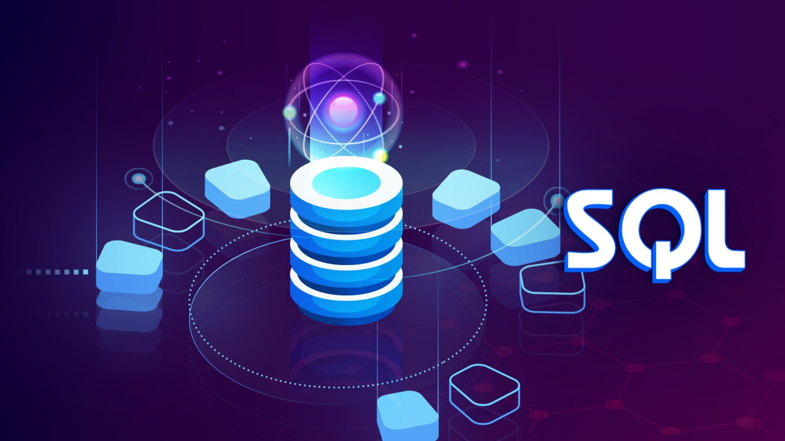
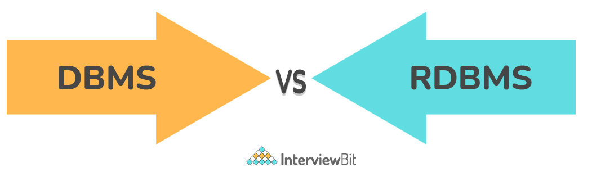
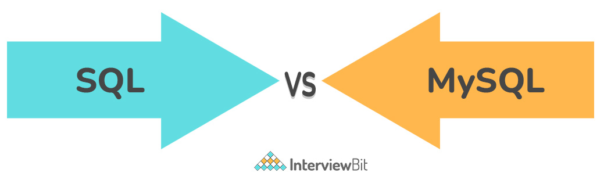
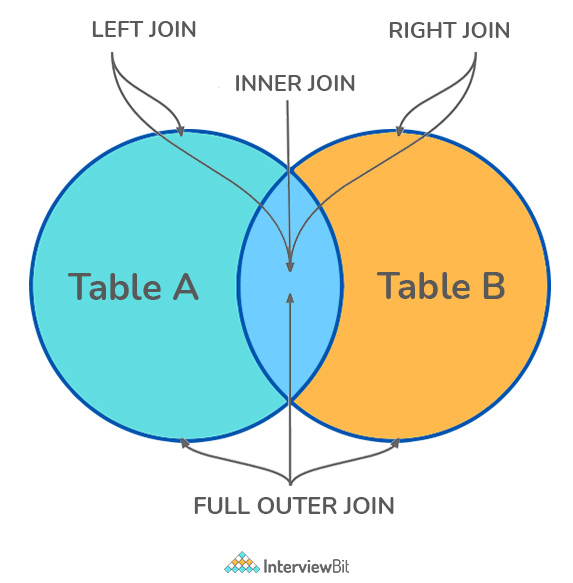
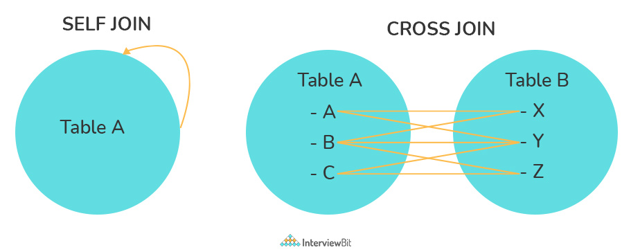
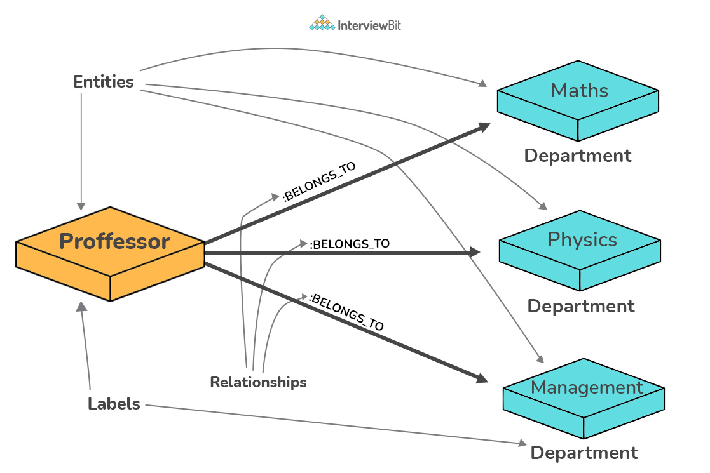
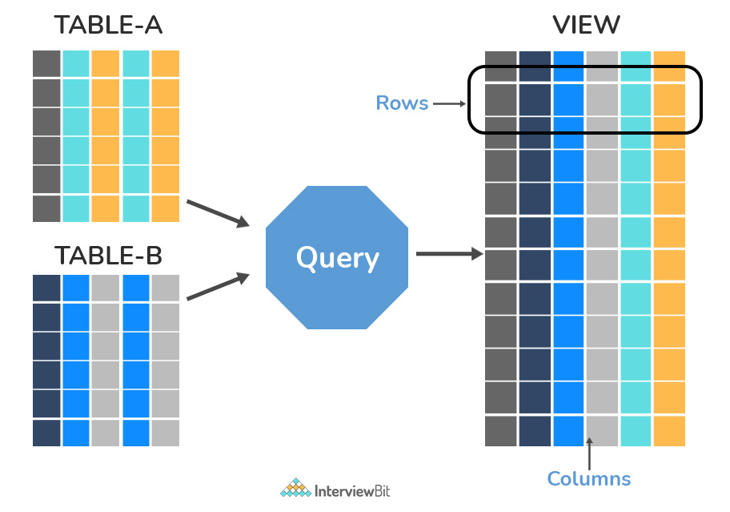
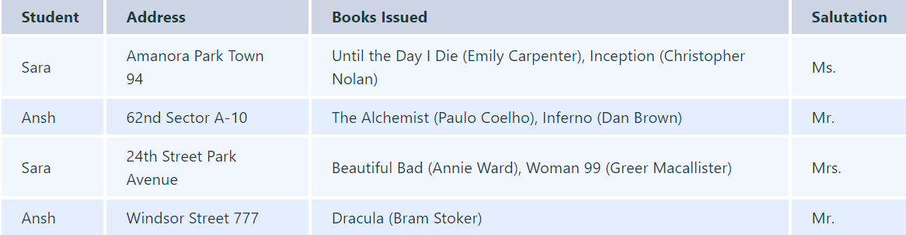
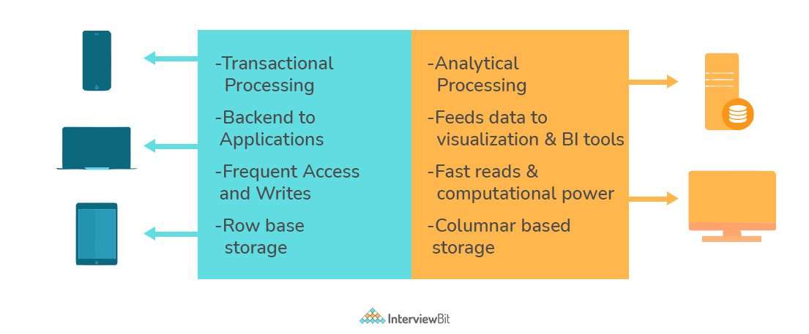
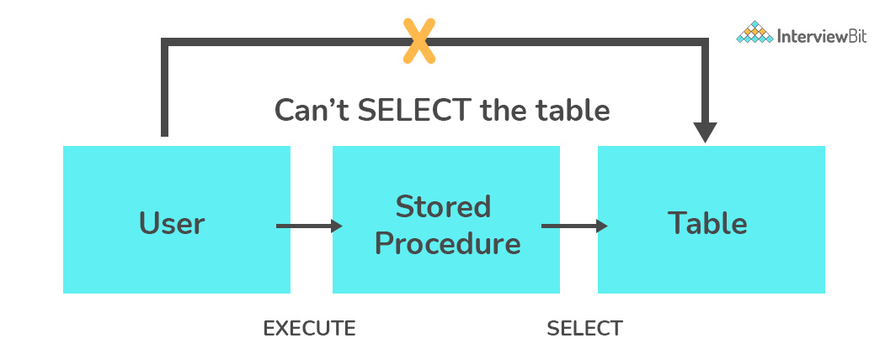

# Câu hỏi phỏng vấn SQL



## SQL là gì

SQL là gì? SQL là viết tắt của Structured Query Language, nghĩa là ngôn ngữ truy vấn dữ liệu. Có thể coi ngôn ngữ SQL là ngôn ngữ chung mà bất cứ hệ thống cơ sở dữ liệu quan hệ (RDBMS) nào cũng phải đáp ứng, điển hình như: Oracle Database, SQL Server, MySQL…

Bất kì công ty nào lớn cũng cần xây dựng một hệ thống để lưu trữ cơ sở dữ liệu. Mọi thứ trong cơ sở dữ liệu này sẽ được quy ra thành nhiều bảng, có mối quan hệ với nhau. SQL giúp quản lý hiệu quả và truy vấn thông tin nhanh hơn, giúp bảo trì thông tin dễ dàng hơn.

## Mục lục

[1. Cơ sở dữ liệu là gì?](#1-cơ-sở-dữ-liệu-là-gì)

[2. DBMS là gì?](#2-dbms-là-gì)

[3. RDBMS là gì? Nó khác với DBMS như thế nào](#3-rdbms-là-gì-nó-khác-với-dbms-như-thế-nào)

[4. SQL là gì?](#4-sql-là-gì)

[5. Sự khác biệt giữa SQL và MySQL?](#5-sự-khác-biệt-giữa-sql-và-mysql)

[6. Bảng và trường là gì?](#6-bảng-và-trường-là-gì)

[7. Ràng buộc trong SQL?](#7-ràng-buộc-trong-sql)

[8. Khoá chính là gì?](#8-khoá-chính-là-gì)

[9. Ràng buộc UNIQUE là gì?](#9-ràng-buộc-unique-là-gì)

[10. Khoá ngoại là gì?](#10-khoá-ngoại-là-gì)

[11. JOIN là gì? Liệt kê các kiểu JOIN?](#11-join-là-gì-liệt-kê-các-kiểu-join)

[12. Self-Join là gì?](#12-self-join-là-gì)

[13. Cross-Join là gì?](#13-cross-join-là-gì)

[14. Đánh chỉ mục là gì? Giải thích các kiểu chỉ mục khác nhau?](#14-đánh-chỉ-mục-là-gì-giải-thích-các-kiểu-chỉ-mục-khác-nhau)

[15. Toàn vẹn dữ liệu là gì?](#15-toàn-vẹn-dữ-liệu-là-gì)

[16. Truy vấn là gì?](#16-truy-vấn-là-gì)

[17. Truy vấn con là gì? Các kiểu truy vấn con?](#17-truy-vấn-con-là-gì-các-kiểu-truy-vấn-con)

[18. Lệnh SELECT là gì?](#18-lệnh-select-là-gì)

[19. Các mệnh đề phổ biến được dùng với SELECT trong SQL?](#19-các-mệnh-đề-phổ-biến-được-dùng-với-select-trong-sql)

[20. Các lệnh UNION, MINUS và INTERSECT là gì?](#20-các-lệnh-union-minus-và-intersect-là-gì)

[21. Con trỏ là gì? Cách dùng con trỏ?](#21-con-trỏ-là-gì-cách-dùng-con-trỏ)

[22. Thực thể và quan hệ là gì?](#22-thực-thể-và-quan-hệ-là-gì)

[23. Các kiểu quan hệ trong SQL?](#23-các-kiểu-quan-hệ-trong-sql)

[24. Alias trong SQL là gì?](#24-alias-trong-sql-là-gì)

[25. View là gì?](#25-view-là-gì)

[26. Normalization là gì?](#26-normalization-là-gì)

[27. Denormalization là gì?](#27-denormalization-là-gì)

[28. Các dạng chuẩn hoá?](#28-các-dạng-chuẩn-hoá)

[29. Lệnh TRUNCATE, DELETe và DROP là gì?](#29-lệnh-truncate-delete-và-drop-là-gì)

[30. Sự khác biệt giữa lệnh DELETE và TRUNCATE là gì?](#30-sự-khác-biệt-giữa-lệnh-delete-và-truncate-là-gì)

[31. Sự khác biệt giữa lệnh DROP và TRUNCATE là gì?](#31-sự-khác-biệt-giữa-lệnh-drop-và-truncate-là-gì)

[32. Các hàm Aggregate và Scalar là gì?](#32-các-hàm-aggregate-và-scalar-là-gì)

[33. Hàm người dùng định nghĩa là gì?](#33-hàm-người-dùng-định-nghĩa-là-gì)

[34. OLTP là gì?](#34-oltp-là-gì)

[35. Sự khác biệt giữa OLTP và OLAP?](#35-sự-khác-biệt-giữa-oltp-và-olap)

[36. Collation là gì?](#36-collation-là-gì)

[37. Stored Procedure là gì?](#37-stored-procedure-là-gì)

[38. Stored Procedure đệ quy là gì?](#38-stored-procedure-đệ-quy-là-gì)

[39. Làm thế nào để tạo một bảng trống có cấu trúc giống hệt một bảng khác?](#39-làm-thế-nào-để-tạo-một-bảng-trống-có-cấu-trúc-giống-hệt-một-bảng-khác)

[40. Pattern Matching trong SQL?](#40-pattern-matching-trong-sql)

## Câu hỏi phỏng vấn SQL

### 1. Cơ sở dữ liệu là gì?

Cơ sở dữ liệu là một tập hợp dữ liệu có tổ chức, được lưu trữ và truy xuất từ một hệ thống máy tính cục bộ hoặc từ xa. Cơ sở dữ liệu có thể rất lớn và phức tạp, những cơ sở dữ liệu như vậy được phát triển bằng cách sử dụng các phương pháp thiết kế và mô hình hóa cố định.

### 2. DBMS là gì?

DBMS là viết tắt của Database Management System. DBMS là một phần mềm hệ thống chịu tránh nhiệm tạo, truy xuất, chỉnh sửa và quản lý cơ sở dữ liệu. Nó đảm bảo rằng dữ liệu của ta sẽ được tổ chức nhất quán, và dễ dàng truy cập bằng cách dùng interface giữa cơ sở dữ liệu và người dùng hay phần mềm ứng dụng.

### 3. RDBMS là gì? Nó khác với DBMS như thế nào

RDBMS là viết tắt của Relational Database Management System. Điểm khác biệt của nó với DBMS là RDBMS lưu trữ dữ liệu ở dạng bảng, và các mối quan hệ được xác định là các trường chung giữa các bảng này. Các RDBMS phổ biến nhất hiện này có thể kể đến: MySQL, Oracle, PostgreSQL, Microsoft SQL Server,...



### 4. SQL là gì?

SQL là viết tắt của Structured Query Language. Nó là ngôn ngữ chuẩn cho các RDBMS. Nó đặc biệt hữu ích trong việc tổ chức dữ liệu bao gồm các thực thế và các mối quan hệ giữa các thực thế khác nhau của dữ liệu.

### 5. Sự khác biệt giữa SQL và MySQL?

SQL như đã nói ở trên là ngôn ngữ chuẩn cho truy vấn và quản lý cơ sở dữ liệu. Còn MySQL là một RDBMS giống như Postgres hay Oracle, được dùng để quản lý cơ sở dữ liệu SQL.



### 6. Bảng và trường là gì?

Bảng là một tập hợp dữ liệu có tổ chức được lưu trữ dưới dạng hàng và cột. Các cột có thể được phân loại thành hàng dọc và hàng ngang. Các cột trong bảng được gọi là trường trong khi các hàng có thể được gọi là bản ghi.

### 7. Ràng buộc trong SQL?

Các ràng buộc được sử dụng để chỉ định các quy tắc liên quan đến dữ liệu trong bảng. Nó có thể được áp dụng cho một hoặc nhiều trường trong bảng SQL, khi bắt đầu tạo bảng hoặc sau khi tạo bằng lệnh `ALTER TABLE`. Các ràng buộc là:

- **NOT NULL** - Không được thêm giá trị `NULL` vào một cột.
- **CHECK** - Xác minh rằng tất cả các giá trị trong một trường thỏa mãn một điều kiện.
- **DEFAULT** - Tự động gán giá trị mặc định nếu không có giá trị nào được chỉ định cho trường.
- **UNIQUE** - Đảm bảo các giá trị được chèn vào trường là duy nhất trong bảng.
- **INDEX** - Đánh chỉ mục một trường, giúp truy xuất nhanh hơn.
- **PRIMARY KEY** - Định danh duy nhất cho từng bản ghi trong bảng.
- **FOREIGN KEY** - Đảm bảo tính toàn vẹn tham chiếu cho một bản ghi trong bảng khác.

## 8. Khoá chính là gì?

Ràng buộc `PRIMARY KEY` là định danh duy nhất cho mỗi hàng trong bảng. Nó phải chứa các giá trị `UNIQUE` và có ràng buộc `NOT NULL` ngầm.

Một bảng trong SQL bị hạn chế nghiêm ngặt chỉ có một khóa chính, bao gồm một hoặc nhiều trường (cột).

```sql
CREATE TABLE Students (   /* Create table with a single field as primary key */
   ID INT NOT NULL
   Name VARCHAR(255)
   PRIMARY KEY (ID)
);

CREATE TABLE Students (   /* Create table with multiple fields as primary key */
   ID INT NOT NULL
   LastName VARCHAR(255)
   FirstName VARCHAR(255) NOT NULL,
   CONSTRAINT PK_Student
   PRIMARY KEY (ID, FirstName)
);

ALTER TABLE Students   /* Set a column as primary key */
ADD PRIMARY KEY (ID);
ALTER TABLE Students   /* Set multiple columns as primary key */
ADD CONSTRAINT PK_Student   /*Naming a Primary Key*/
PRIMARY KEY (ID, FirstName);
```

### 9. Ràng buộc UNIQUE là gì?

Ràng buộc `UNIQUE` đảm bảo rằng tất cả các giá trị trong một cột là khác nhau. Điều này cung cấp tính duy nhất cho (các) cột và giúp xác định từng hàng duy nhất. Không giống như khóa chính, có thể có nhiều ràng buộc `UNIQUE` được xác định trên mỗi bảng. Cú pháp code cho `UNIQUE` khá giống với cú pháp của `PRIMARY KEY` và có thể được sử dụng thay thế cho nhau.

```sql
CREATE TABLE Students (   /* Create table with a single field as unique */
   ID INT NOT NULL UNIQUE
   Name VARCHAR(255)
);

CREATE TABLE Students (   /* Create table with multiple fields as unique */
   ID INT NOT NULL
   LastName VARCHAR(255)
   FirstName VARCHAR(255) NOT NULL
   CONSTRAINT PK_Student
   UNIQUE (ID, FirstName)
);

ALTER TABLE Students   /* Set a column as unique */
ADD UNIQUE (ID);
ALTER TABLE Students   /* Set multiple columns as unique */
ADD CONSTRAINT PK_Student   /* Naming a unique constraint */
UNIQUE (ID, FirstName);
```

### 10. Khoá ngoại là gì?

`FOREIGN KEY` bao gồm một hoặc một tập hợp các trường trong bảng tham chiếu đến `PRIMARY KEY` trong một bảng khác. Ràng buộc khóa ngoại đảm bảo tính toàn vẹn tham chiếu trong mối quan hệ giữa hai bảng.

Bảng có ràng buộc khóa ngoại được gắn nhãn là bảng con và bảng chứa khóa chính được gắn nhãn là bảng tham chiếu hoặc bảng cha.

```sql
CREATE TABLE Students (   /* Create table with foreign key - Way 1 */
   ID INT NOT NULL
   Name VARCHAR(255)
   LibraryID INT
   PRIMARY KEY (ID)
   FOREIGN KEY (Library_ID) REFERENCES Library(LibraryID)
);

CREATE TABLE Students (   /* Create table with foreign key - Way 2 */
   ID INT NOT NULL PRIMARY KEY
   Name VARCHAR(255)
   LibraryID INT FOREIGN KEY (Library_ID) REFERENCES Library(LibraryID)
);

ALTER TABLE Students   /* Add a new foreign key */
ADD FOREIGN KEY (LibraryID)
REFERENCES Library (LibraryID);
```

### 11. JOIN là gì? Liệt kê các kiểu JOIN?

Mệnh đề SQL Join được sử dụng để kết hợp các bản ghi (hàng) từ hai hoặc nhiều bảng trong cơ sở dữ liệu SQL dựa trên một cột có liên quan giữa hai bảng.



Có 4 kiểu JOIN trong SQL:

- **INNER JOIN**: truy xuất các bảng ghi có giá trị phù hợp giữa hai bảng liên quan đến join. Đấy là kiểu join được sử dụng rộng rãi cho truy vấn.

```sql
SELECT *
FROM Table_A
JOIN Table_B;
SELECT *
FROM Table_A
INNER JOIN Table_B;
```

- **LEFT (OUTER) JOIN**: Truy xuất tất cả các bản ghi/hàng từ bên trái và các bản ghi/hàng phù hợp từ bảng bên phải.

```sql
SELECT *
FROM Table_A A
LEFT JOIN Table_B B
ON A.col = B.col;
```

- **RIGHT (OUTER) JOIN**: Truy xuất tất cả các bản ghi/hàng từ bên phải và các bản ghi/hàng phù hợp từ bảng bên trái.

```sql
SELECT *
FROM Table_A A
RIGHT JOIN Table_B B
ON A.col = B.col;
```

- **FULL (OUTER) JOIN**: Truy xuất tất cả các bản ghi có sự phù hợp trong bảng bên trái hoặc bên phải.

```sql
SELECT *
FROM Table_A A
FULL JOIN Table_B B
ON A.col = B.col;
```

### 12. Self-Join là gì?

Self JOIN à một trường hợp join thông thường trong đó một bảng được liên kết với chính nó dựa trên một số mối quan hệ giữa (các) cột của chính nó. Self-Join  sử dụng mệnh đề INNER JOIN hoặc LEFT JOIN và tên bí danh bảng để gán các tên khác nhau cho bảng trong truy vấn. 

```sql
SELECT A.emp_id AS "Emp_ID",A.emp_name AS "Employee",
B.emp_id AS "Sup_ID",B.emp_name AS "Supervisor"
FROM employee A, employee B
WHERE A.emp_sup = B.emp_id;
```

### 13. Cross-Join là gì?

Cross-Join có thể được định nghĩa là một tích descartes của hai bảng trong phép join. Bảng sau khi join có số hàng là tích descartes số hàng của hai bảng. Nếu mệnh đề WHERE được sử dụng trong cross-join thì truy vấn sẽ hoạt động giống như một INNER JOIN. 

```sql
SELECT stu.name, sub.subject 
FROM students AS stu
CROSS JOIN subjects AS sub;
```



### 14. Đánh chỉ mục là gì? Giải thích các kiểu chỉ mục khác nhau?

Chỉ mục trong cơ sở dữ liệu là một dạng cấu trúc dữ liệu cung cấp chức năng tìm kiếm dữ liệu nhanh trong cột hay bảng. Nó tăng tốc độ chi truy cập dữ liệu từ cơ sở dữ liệu với chi phí bổ sung ghi và bộ nhớ để duy trì cấu trúc dữ liệu chỉ mục. 

```sql
CREATE INDEX index_name   /* Create Index */
ON table_name (column_1, column_2);
DROP INDEX index_name;   /* Drop Index */
```

Các kiểu chỉ mục có thể được tạo cho các mục đích khác nhau:

- **Unique/Non-Unique Index**: chỉ mục duy nhất là chỉ mục giúp duy trì tính toàn vẹn của dữ liệu bằng cách đảm bảo rằng không có hai hàng dữ liệu nào trong bảng có giá trị khoá giống nhau. Khi một chỉ mục duy nhất đã được xác định cho một bảng, tính duy nhất được thực thi bất cứ khi nào khoá được thêm vào hay thay đổi chỉ mục.

```sql
CREATE UNIQUE INDEX myIndex
ON students (enroll_no);
```

Ngược lại các chỉ mục không phải là duy nhất không được dùng để ràng bụooc các bảng mà chúng được liên kết với nhau. Các chỉ mục này được dùng để cải thiện hiệu suất truy vấn bằng cách duy trì thứ tự được sắp xếp của các giá trị dữ liệu được sắp xếp thường xuyên.

- **Clustered/Non-Clustered Index**: 

Clustered Index lưu trữ và sắp xếp dữ liệu vật lý trong bảng dựa trên các giá trị khóa của chúng. Các cột khóa này được chỉ định trong định nghĩa index. Mỗi bảng chỉ có duy nhất một Clusterd Index vì bản thân các dòng dữ liệu được lưu trữ và sắp xếp theo thứ tự vật lý dựa trên các cột trong loại Index này.

Non-Clustered có một cấu trúc tách biệt với dữ liệu hàng trong bảng. Mỗi một index loại này chứa các giá trị của các cột khóa trong khai báo của index, và mỗi một bản ghi giá trị của key trong index này chứa một con trỏ tới dòng dữ liệu tương ứng của nó trong bảng.

### 15. Toàn vẹn dữ liệu là gì?

Toàn vẹn dữ liệu (data integrity) là sự dảm bảo tính nhất quán và chính xác của dữ liệu trong toàn bộ vòng đời của chúng. Nó là một khía cạnh quan trọng trong thiết kế, triển khai và sử dụng bất kỳ hệ thống nào lưu trữ, xử lý hoặc truy xuất dữ liệu. Nó cũng xác định các ràng buộc toàn vẹn để thực thi các quy tắc nghiệp vụ trên dữ liệu khi nó được nhập vào ứng dụng hoặc cơ sở dữ liệu. 

### 16. Truy vấn là gì?

Truy vấn là một yêu cầu về dữ liệu hay thông tin từ một bảng hay là kết hợp nhiều bảng trong cơ sở dữ liệu. Một truy vấn có thể là truy vấn chọn lựa hoặc truy vấn hành động.

```sql
SELECT fname, lname    /* select query */
FROM myDb.students
WHERE student_id = 1;
```
```sql
UPDATE myDB.students    /* action query */
SET fname = 'Captain', lname = 'America'
WHERE student_id = 1;
```

### 17. Truy vấn con là gì? Các kiểu truy vấn con?

Truy vấn con (còn được gọi truy vấn phụ hay truy vấn lồng nhau) là một truy vấn bên trong truy vấn SQL khác và được nhúng bên trong mệnh đề WHERE. Một truy vấn con được sử dụng để trả về dữ liệu mà sẽ được sử dụng trong truy vấn chính như là một điều kiện để thu hẹp dữ liệu được thu nhận. Ví dụ, ta cần lấy thông tin liên hệ của học sinh đã tham gia vào học môn toán:

```sql
SELECT name, email, mob, address
FROM myDb.contacts
WHERE roll_no IN (
   SELECT roll_no
   FROM myDb.students
   WHERE subject = 'Maths');
```

Có hai loại truy vấn con là: **tương quan** và **không tương quan**:

- Một truy vấn con không tương quan là truy vấn con độc lập với truy vấn bên ngoài. Truy vấn con không tương quan được thi hành thi hành đầu tiên và một lần duy nhất cho toàn bộ câu lệnh. Kết quả của truy vấn con được điền vào truy vấn bên ngoài, và cuối cùng thi hành truy vấn bên ngoài.
- Một truy vấn con tương quan không độc lập với truy vấn bên ngoài. Một truy vấn con tương quan là một truy vấn con sử dụng các giá trị từ truy vấn bên ngoài trong mệnh đề WHERE của nó

### 18. Lệnh SELECT là gì?

SELECT là hoạt động trong SQL dùng để lấy dữ liệu từ bảng. Dữ liệu trả về được lưu vào bảng kết quả, được gọi là *result-set*.

```sql
SELECT * FROM myDB.students;
```

### 19. Các mệnh đề phổ biến được dùng với SELECT trong SQL?

Các mệnh đề thường được dùng với SELECT có thể kể đến:

- **WHERE** dùng để chỉ định bản ghi cần lấy dựa trên một điều kiện cụ thể.
- **ORDER BY** dùng để sắp xếp bảng ghi theo một thứ tự tăng dần hay giảm dần của một vài trường.

```sql
SELECT *
FROM myDB.students
WHERE graduation_year = 2019
ORDER BY studentID DESC;
```

- **GROUP BY** dùng để nhóm các bản ghi có dữ liệu giống hệt nhau có thể được dùng cho kết hợp hay tổng hợp để tạo kết quả tóm tắt từ cơ sở dữ liệu.
- **HAVING** dùng để lọc các bản ghi kết hợp với mệnh đề GROUP BY. Nó khác với WHERE ở cho WHERE không thể lọc cảc bản ghi đã tổng hợp.

```sql
SELECT COUNT(studentId), country
FROM myDB.students
WHERE country != "INDIA"
GROUP BY country
HAVING COUNT(studentID) > 5;
```

### 20. Các lệnh UNION, MINUS và INTERSECT là gì?

- Toán tử **UNION** kết hợp và trả về tập kết quả được truy xuất bởi hai hoặc nhiều câu lệnh SELECT.
- Toán tử **MINUS** trong SQL được sử dụng để loại bỏ các bản sao khỏi tập kết quả thu được bởi truy vấn SELECT thứ hai khỏi tập kết quả thu được bởi truy vấn SELECT đầu tiên và sau đó trả về kết quả đã lọc từ truy vấn đầu tiên.
- Mệnh đề **INTERSECT** trong SQL kết hợp tập kết quả được tìm nạp bởi hai câu lệnh SELECT trong đó các bản ghi từ một khớp với nhau và sau đó trả về giao điểm này của các tập kết quả.

Một số điều kiện nhất định cần phải được đáp ứng trước khi thực hiện một trong các câu lệnh trên trong SQL

- Mỗi câu lệnh SELECT trong mệnh đề phải có cùng số cột
- Các cột cũng phải có kiểu dữ liệu tương tự
- Các cột trong mỗi câu lệnh SELECT nhất thiết phải có cùng thứ tự

```sql
SELECT name FROM Students   /* Fetch the union of queries */
UNION
SELECT name FROM Contacts;
SELECT name FROM Students   /* Fetch the union of queries with duplicates*/
UNION ALL
SELECT name FROM Contacts;
```
```sql
SELECT name FROM Students   /* Fetch names from students */
MINUS     /* that aren't present in contacts */
SELECT name FROM Contacts;
```
```sql
SELECT name FROM Students   /* Fetch names from students */
INTERSECT    /* that are present in contacts as well */
SELECT name FROM Contacts;
```

### 21. Con trỏ là gì? Cách dùng con trỏ?

Con trỏ cơ sở dữ liệu là một cấu trúc điều khiển cho phép duyệt các bảng ghi trong cơ sở dữ liệu. Ngoài ra, con trỏ còn tạo điều kiện thuận lợi cho việc xử lý sau khi duyệt, chẳng hạn như truy xuất, thêm và xóa các bản ghi cơ sở dữ liệu. Chúng có thể được xem như một con trỏ đến một hàng trong một tập hợp các hàng.

#### Làm việc với con trỏ SQL:

1. **DECLARE**, khai báo con trỏ sau bất kỳ khai báo biến nào. Khai báo con trỏ phải luôn được liên kết với lệnh SELECT.
2. Mở con trỏ cho khởi tạo tập kết quả. Lệnh **OPEN** phải được gọi trước khi lấy dữ liệu hàng từ tập kết quả.
3. Lệnh **FETCH** để truy xuất và chuyến đến hàng tiếp theo trong tập kết quả.
4. Gọi lệnh **CLOSE** để tắt con trỏ.
5. Cuối cùng, dùng câu lệnh **DEALLOCATE** để xoá định nghĩa con trỏ và giải phóng tài nguyên.

```sql
DECLARE @name VARCHAR(50)   /* Declare All Required Variables */
DECLARE db_cursor CURSOR FOR   /* Declare Cursor Name*/
SELECT name
FROM myDB.students
WHERE parent_name IN ('Sara', 'Ansh')
OPEN db_cursor   /* Open cursor and Fetch data into @name */ 
FETCH next
FROM db_cursor
INTO @name
CLOSE db_cursor   /* Close the cursor and deallocate the resources */
DEALLOCATE db_cursor
```

### 22. Thực thể và quan hệ là gì?

**Entity (thực thể):** Một thực thể có thể là một đối tượng trong thế giới thực, hữu hình hoặc vô hình, có thể dễ dàng xác định được. Ví dụ, trong cơ sở dữ liệu trường đại học, sinh viên, giáo sư, phòng ban và dự án có thể được coi là thực thể. Mỗi thực thể có một số thuộc tính liên quan cung cấp cho nó một định danh.

**Relationships (quan hệ):** Mối quan hệ hoặc liên kết giữa các thực thể có liên quan gì đó với nhau. Ví dụ - Bảng của nhân viên trong cơ sở dữ liệu của công ty có thể được liên kết với bảng lương trong cùng một cơ sở dữ liệu.



### 23. Các kiểu quan hệ trong SQL?

- **One-to-One**: là mối quan hệ giữa hai bảng trong đó mỗi bản ghi trong một bảng được liên kết với tối đa một bản ghi trong bảng kia.
- **One-to-Many**: là mối quan hệ được sử dụng phổ biến nhất trong đó một bản ghi trong bảng được liên kết với nhiều bản ghi trong bảng khác.
- **Many-to-Many**: được sử dụng trong các trường hợp khi cần có nhiều thực thể ở cả hai bên để tạo mối quan hệ.
- **Self-Referencing Relationships**: được dùng khi một bảng cần tạo mối quan hệ với chính nó.

### 24. Alias trong SQL là gì?

Alias (bí danh) là một tính năng của SQL được hầu hết các RDBMS hỗ trợ. Nó là tên tạm thời được gán cho bảng hoặc cột, để phục vụ cho một truy vấn SQL cụ thể. Ngoài ra, bí danh có thể được sử dụng như một kỹ thuật xáo trộn để bảo mật tên thật của các trường cơ sở dữ liệu. Bí danh bảng còn được gọi là tên tương quan.

Alias được biểu diễn bởi từ khoá AS, nhưng một số trường hợp có thể tạo tên bí danh mà không cần dùng nó. ví dụ:

```sql
SELECT A.emp_name AS "Employee"  /* Alias using AS keyword */
B.emp_name AS "Supervisor"
FROM employee A, employee B   /* Alias without AS keyword */
WHERE A.emp_sup = B.emp_id;
```

### 25. View là gì?

View là một bảng ảo dựa trên tập kết quả từ câu lệnh SQL. Một view bao gồm hàng và cột như một bảng thực. Các trường trong view là các trường từ một hay nhiều bảng thực ở cơ sở dữ liệu.



### 26. Normalization là gì?

Chuẩn hóa (normalization) là để giúp cho việc tổ chức dữ liệu trong cơ sở dữ liệu một cách hiệu quả. Có hai mục đích chính để chuẩn hóa dữ liệu:

- Giảm lượng dữ liệu dư thừa (ví dụ như lưu trữ cùng một dữ liệu trong 1 bảng)
- Đảm bảo độc lập dữ liệu (dữ liệu liên quan đặt trong cùng 1 bảng) 

Cả 2 mục đích trên đều giúp giảm thiểu không gian sử dụng trong cơ sở dữ liệu và đảm bảo dữ liệu được lưu trữ một cách logic.

### 27. Denormalization là gì?

Denormalization là quá trình ngược lại với normalization, trong đó lược đồ dữ đã chuẩn hoá bị chuyển đổi thành một lược đồ có thông tin dư thừa. Hiệu suất được cải thiện bằng cách sử dụng bộ dự phòng và giữ cho dữ liệu dự phòng nhất quán.

### 28. Các dạng chuẩn hoá?

Dạng chuẩn hoá được dùng cho loại bỏ hay làm giảm sự dư thừa trong bảng cơ sở dữ liệu. Các dạng chuẩn hoá là:

**Dạng chuẩn hoá thứ nhất:** Một bảng (quan hệ) được gọi là ở dạng chuẩn 1NF nếu và chỉ nếu toàn bộ các miền giá trị của các cột có mặt trong bảng (quan hệ) đều chỉ chứa các giá trị nguyên tố.

Nếu một quan hệ có chứa một thuộc tính tổng hợp hoặc nhiều giá trị, nó sẽ vi phạm dạng chuẩn thứ nhất. Chúng ta hãy xem bảng `student` sau đây. Mỗi học sinh trong bảng, có tên, địa chỉ của mình và những cuốn sách mà họ mượn từ thư viện công cộng.

<div align="center">
Students Table


</div>

Ta có thể thấy trường `Books Issued` có nhiều một giá trị bảng ghi, và nó vi phạm dạng chuẩn hoá thứ nhất. Để giải quyết vấn đề này ta tách biệt các bản ghi trên mỗi book issued.

<div align="center">
Students Table (1st Normal Form)

.png)
</div>

**Dạng chuẩn hoá thứ hai:**

Một quan hệ là dạng chuẩn hoá thứ hai nếu nó thoả mãn điều kiện của dạng chuẩn hoá thứ nhất và các thuộc tính không khoá phải phụ thuộc hàm đầy đủ vào khoá chính.

**Ví dụ 1:** Ta có thể thấy, bảng Students ở dạng 1NF có một khoá ở dạng [Student, Address] có thể xác định duy nhất tất cả các bản ghi trong bảng. Trường `Book Isued` (thuộc tính non-prime) phụ thuộc một phần vào trường `Student`. Do đó bảng không thuộc 2NF. Để chuyển nó thành dạng 2NF, chúng ta sẽ phân chia bảng thành hai bảng trong khi chỉ định thuộc tính PRIMARY KEY mới để xác định các bản ghi riêng lẻ trong bảng Students. FOREIGN KEY sẽ được đặt trên bảng khác để đảm bảo tính toàn vẹn của tham chiếu.

<div align="center">
Students Table (2nd Normal Form)

.png)
</div>

<div align="center">
Books Table (2nd Normal Form)

.png)
</div>

**Ví dụ 2:** xem xét các phụ thuộc sau trong quan hệ R(W, X, Y, Z)

```text
WX -> Y    [W và X cùng quyết định Y] 
XY -> Z    [X và Y cùng quyết định Z] 
```

Ở đây, WX là khoá tiềm năng duy nhất và không có phụ thuộc vào phần nào, tức là bất kỳ tập con thích hợp nào của WX cũng không xác định thuộc tính non-prime trong mối quan hệ.

**Dạng chuẩn hoá thứ 3:**

Một quan hệ là dạng chuẩn hoá thứ ba nếu nó thoả mãn điều kiện của dạng chuẩn hoá thứ hai và các thuộc tính không khoá phải phụ thuộc trực tiếp vào khoá chính.

**Ví dụ:** Xem xét bảng Student ở trên. Ta có thể thấy, bảng Student ở dạng 2NF có một khoá đơn `Student_ID` (PRIMARY KEY) có thể định danh duy nhất bản ghi trong bảng. Trường `Salutation` (thuộc tính non-prime), lại phụ thuộc vào trường `Student` nhiều hơn khoá chính. Do đó, bảng không phải dạng 3NF. Để chuyển nó về 3NF, ta sẽ tách bảng lần nữa thành hai phần trong khi chỉ định FOREIGN KEY mới cho định danh salutations với từng bản ghi trong bảng Student. PRIMARY KEY sẽ được đặt trên bảng Salutation để định danh cho từng bản ghi.

<div align="center">
Students Table (3rd Normal Form)

.png)
</div>

<div align="center">
Books Table (3rd Normal Form)

.png)
</div>


<div align="center">
Salutations Table (3rd Normal Form)

.png)
</div>

### 29. Lệnh TRUNCATE, DELETe và DROP là gì?

Lệnh DELETE để xoá hàng trong bảng.

```sql
DELETE FROM Candidates
WHERE CandidateId > 1000;
```

Lệnh TRUNCATe để xoá tất cả hàng trong bảng và giải phóng không gian của bảng.

```sql
TRUNCATE TABLE Candidates;
```

Lệnh DROP để xoá một đối tượng từ cơ sở dữ liệu. Nếu xoá một bảng tất cả các hàng và cấu trúc của bảng đó sẽ bị xoá khỏi cơ sở dữ liệu.

```sql
DROP TABLE Candidates;
```

### 30. Sự khác biệt giữa lệnh DELETE và TRUNCATE là gì?

Lệnh **TRUNCATE** được sử dụng để xóa tất cả các hàng khỏi bảng và giải phóng không gian chứa bảng.

Lệnh **DELETE** chỉ xóa các hàng khỏi bảng dựa trên điều kiện được đưa ra trong mệnh đề WHERE hoặc xóa tất cả các hàng khỏi bảng nếu không có điều kiện nào được chỉ định. Nhưng nó không giải phóng không gian chứa bảng.

### 31. Sự khác biệt giữa lệnh DROP và TRUNCATE là gì?

Nếu một bảng bị DROP, tất cả những thứ liên quan đến các bảng đó cũng bị loại bỏ. Điều này bao gồm - các mối quan hệ được xác định trên bảng với các bảng khác, kiểm tra tính toàn vẹn và các ràng buộc, quyền truy cập và các trợ cấp khác mà bảng có. Để tạo và sử dụng lại bảng ở dạng ban đầu, tất cả các quan hệ, kiểm tra, ràng buộc, đặc quyền và quan hệ này cần phải được xác định lại. Tuy nhiên, nếu một bảng bị TRUNCATe, không có vấn đề nào ở trên tồn tại và bảng vẫn giữ được cấu trúc ban đầu của nó.

### 32. Các hàm Aggregate và Scalar là gì?

Một hàm Aggregate (tổng hợp) thực hiện các hoạt động trên một tập hợp các giá trị để trả về giá trị duy nhât. Hàm tổng hợp thường được sử dụng với mệnh đề GROUP BY và HAVING của câu lệnh SELECT. Sau đây là các hàm tổng hợp SQL được sử dụng rộng rãi:

- **AVG()** - Tính giá trị trung bình của tập hợp giá trị..
- **COUNT()** - Đếm số lượng bảng ghi trong bảng cụ thể hay view.
- **MIN()** - Tính giá trị nhỏ nhất của tập hợp giá trị.
- **MAX()** - Tính giá trị lớn nhất của tập hợp giá trị.
- **SUM()** - Tính tổng giá trị của tập hợp giá trị.
- **FIRST()** - Lấy phần tử đầu tiên trong tập hợp giá trị.
- **LAST()** - Lấy phần tử cuối cùng trong tập hợp giá trị.

*Lưu ý*: Tất cả hàm tổng hợp trên đều bỏ qua giá trị NULL ngoại trừ COUNT.

Một hàm Scalar (vô hướng) trả về giá trị duy nhất dựa trên giá trị đầu vào. Các hàm scalar phổ biến.

- **LEN()** - Tính toán độ dài của trường (cột) được cho.
- **UCASE()** - Chuyển đổi tập hợp giá trị chuỗi sang ký tự in hoa.
- **LCASE()** - Chuyển đổi tập hợp giá trị chuỗi sang ký tự in thường.
- **MID()** - Trích xuất chuỗi con từ tập giá trị chuỗi trong bảng.
- **CONCAT()** - Nối hai hay nhiều chuỗi.
- **RAND()** - Tạo một tập hợp ngẫu nhiên các số có độ dài nhất định.
- **ROUND()** - Làm tròn số cho một trường số.
- **NOW()** - Trả về ngày giờ hiện tại.
- **FORMAT()** - Đặt định dạng để hiển thị một tập hợp các giá trị.

### 33. Hàm người dùng định nghĩa là gì?

Các hàm do người dùng định nghĩa trong SQL giống như các hàm trong bất kỳ ngôn ngữ lập trình nào khác. Nó nhận các tham số, thực hiện các phép tính phức tạp và trả về một giá trị. Chúng được viết để sử dụng logic lặp đi lặp lại bất cứ khi nào được yêu cầu. Có hai loại hàm do người dùng định nghĩa trong SQL:
- Scalar Function: Như đã giải thích ở trên, hàm scalar do người dùng định nghĩa trả về một giá trị scalar.
- Table-Valued Function: trả về một giá trị dạng bảng.
   + **Inline**: trả về một bảng dựa trên câu lệnh SELECT duy nhất.
   + **Multi-statement**: trả về một tập kết quả dạng bảng, nhiều câu lệnh SELECT có thể dùng trong thân hàm.

### 34. OLTP là gì?

OLTP là viết tắt của Online Transaction Processing, là một lớp ứng dụng phần mềm có khả năng hỗ trợ các chương trình hướng giao dịch. Một thuộc tính thiết yếu của hệ thống OLTP là khả năng duy trì tính đồng thời của nó. Để tránh các điểm lỗi đơn lẻ, hệ thống OLTP thường được phân tán. Các hệ thống này thường được thiết kế cho một số lượng lớn người dùng thực hiện các giao dịch ngắn hạn. Các truy vấn cơ sở dữ liệu thường đơn giản, yêu cầu thời gian phản hồi nhỏ hơn giây và trả về tương đối ít bản ghi. Dưới đây là cái nhìn rõ về hoạt động của hệ thống OLTP.


### 35. Sự khác biệt giữa OLTP và OLAP?

- **OLTP** là viết tắt của Online Transaction Processing, là một loại ứng dụng phần mềm có khả năng hỗ trợ các chương trình hướng giao dịch. Một thuộc tính quan trọng của hệ thống OLTP là khả năng duy trì tính đồng thời của nó. Hệ thống OLTP thường tuân theo một kiến trúc phi tập trung để tránh các điểm lỗi đơn lẻ. Các hệ thống này thường được thiết kế cho một lượng lớn người dùng thực hiện các giao dịch ngắn hạn. Các truy vấn liên quan đến cơ sở dữ liệu như vậy thường đơn giản, cần thời gian phản hồi nhanh và trả về tương đối ít bản ghi. Số lượng giao dịch mỗi giây đóng vai trò như một thước đo hiệu quả cho các hệ thống như vậy.
- **OLAP** là viết tắt của Online Analytical Processing, một loại chương trình phần mềm được đặc trưng bởi tần suất giao dịch trực tuyến tương đối thấp. Các truy vấn thường quá phức tạp và liên quan đến nhiều tập hợp. Đối với hệ thống OLAP, thước đo hiệu quả phụ thuộc nhiều vào thời gian phản hồi. Các hệ thống như vậy được sử dụng rộng rãi để khai thác dữ liệu hoặc duy trì dữ liệu lịch sử, tổng hợp, thường là trong các lược đồ đa chiều.



### 36. Collation là gì?

Collation - đối chiếu - đề cập đến một tập hợp các quy tắc xác định cách dữ liệu được sắp xếp và so sánh. Các quy tắc xác định chuỗi ký tự chính xác được sử dụng để sắp xếp dữ liệu ký tự. Nó kết hợp các tùy chọn để chỉ định độ phân biệt chữ hoa chữ thường, dấu trọng âm, kiểu ký tự kana và độ rộng ký tự. Dưới đây là các loại collation khác nhau:

- **Case sensitivity**: A và a là khác nhau.
- **Accent sensitivity**: a và á là khác nhau.
- **Kana sensitivity**: Các ký tự kana của Nhật Bản như Hiragana và Katakana là khác nhau.
- **Width sensitivity**: Cùng một ký tự được biểu thị bằng byte đơn (half-width) và byte kép (full-width) là khác nhau.

### 37. Stored Procedure là gì?

Stored procedure là một chương trình con có sẵn cho các ứng dụng truy cập vào hệ thống quản lý cơ sở dữ liệu quan hệ (RDBMS). Một stored procedure cung cấp một lớp bảo mật quan trọng giữa user và database. Những người dùng cuối không thể thực thi được một số tác vụ quan trọng trong database, bằng cách cung cấp các stored procedure, người dùng cuối có thể thoải moái sử dụng để thực thi các tác vụ này mà không cần quan tâm bên dưới đang làm gì. 

```sql
DELIMITER $$
CREATE PROCEDURE FetchAllStudents()
BEGIN
SELECT *  FROM myDB.students;
END $$
DELIMITER ;
```



### 38. Stored Procedure đệ quy là gì?

Một stored procedure tự gọi chính nó cho đến khi tới giới hạn gọi là stored procedure đệ quy. Hàm đệ quy này giúp người lập trình triển khai cùng một bộ code nhiều lần khi được yêu cầu. Một số ngôn ngữ lập trình SQL giới hạn độ sâu đệ quy để ngăn một vòng lặp vô hạn các lệnh gọi procedure gây ra stack overflow, điều này làm chậm hệ thống và có thể dẫn đến sự cố hệ thống.

```sql
DELIMITER $$     /* Set a new delimiter => $$ */
CREATE PROCEDURE calctotal( /* Create the procedure */
   IN number INT,   /* Set Input and Ouput variables */
   OUT total INT
) BEGIN
DECLARE score INT DEFAULT NULL;   /* Set the default value => "score" */
SELECT awards FROM achievements   /* Update "score" via SELECT query */
WHERE id = number INTO score;
IF score IS NULL THEN SET total = 0;   /* Termination condition */
ELSE
CALL calctotal(number+1);   /* Recursive call */
SET total = total + score;   /* Action after recursion */
END IF;
END $$     /* End of procedure */
DELIMITER ;
```

### 39. Làm thế nào để tạo một bảng trống có cấu trúc giống hệt một bảng khác?

Việc tạo các bảng trống có cùng cấu trúc có thể được thực hiện một cách thông minh bằng cách tìm nạp các bản ghi của một bảng vào một bảng mới bằng cách sử dụng toán tử INTO trong khi sửa mệnh đề WHERE là sai đối với tất cả các bản ghi. Do đó, SQL tạo bảng mới với cấu trúc trùng lặp để chấp nhận các bản ghi đã tìm nạp nhưng vì không có bản ghi nào được tìm nạp do mệnh đề WHERE đang hoạt động nên không có gì được chèn vào bảng mới.

```sql
SELECT * INTO Students_copy
FROM Students WHERE 1 = 2;
```

### 40. Pattern Matching trong SQL?

SQL pattern matching cung cấp mẫu tìm kiếm dữ liệu nếu bạn không có manh mối nào về từ cần tìm. Loại truy vấn SQL này sử dụng các ký tự đại diện để khớp với một mẫu chuỗi, thay vì viết từ chính xác. Toán tử LIKE được sử dụng cùng với SQL Wildcards để tìm nạp thông tin cần thiết. 

**Sử dụng % cho tìm kiếm đơn giản**

Ký tự đại diện% khớp với nhiều ký tự thuộc bất kỳ loại nào và có thể được sử dụng để xác định ký tự đại diện cả trước và sau mẫu. Tìm kiếm một sinh viên trong cơ sở dữ liệu của bạn với tên bắt đầu bằng chữ K:

```sql
SELECT *
FROM students
WHERE first_name LIKE 'K%'
```

**Sử dụng từ khoá NOT**

Sử dụng từ khóa NOT để chọn các bản ghi không khớp với mẫu. Truy vấn này trả về tất cả các sinh viên có tên không bắt đầu bằng K.

```sql
SELECT *
FROM students
WHERE first_name NOT LIKE 'K%'
```

**Sử dụng % hai lần**

Tìm kiếm bất kỳ sinh viên nào trong cơ sở dữ liệu có K trong tên.

```sql
SELECT *
FROM students
WHERE first_name LIKE '%K%'
```

**Sử dụng _ để chỉ định vị trí cụ thể**

Ký tự đại diện _ khớp chính xác với một ký tự thuộc bất kỳ loại nào. Nó có thể được sử dụng cùng với% ký tự đại diện. Truy vấn này tìm nạp tất cả học sinh có chữ cái K ở vị trí thứ ba trong tên của họ.

```sql
SELECT *
FROM students
WHERE first_name LIKE '__K%'
```

**Chỉ định độ dài cụ thể**

Ký tự đại diện _ đóng một vai trò quan trọng như một giới hạn khi nó khớp chính xác với một ký tự. Nó giới hạn độ dài và vị trí của các kết quả phù hợp. Ví dụ 

```sql
SELECT *   /* Matches first names with three or more letters */
FROM students
WHERE first_name LIKE '___%'

SELECT *   /* Matches first names with exactly four characters */
FROM students
WHERE first_name LIKE '____'
```