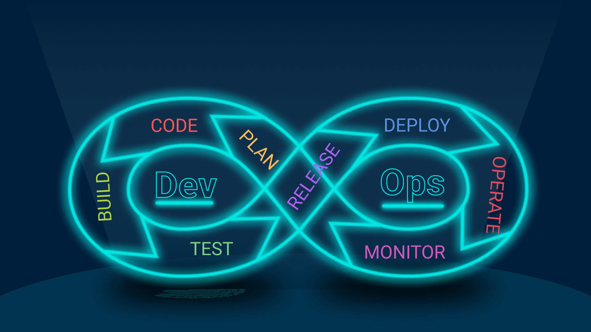
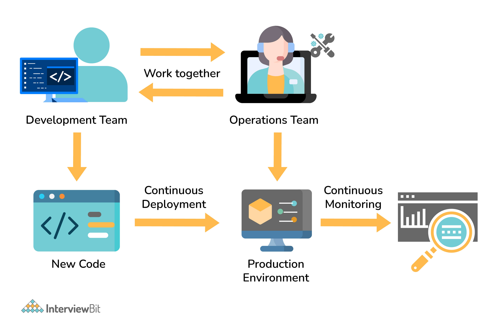
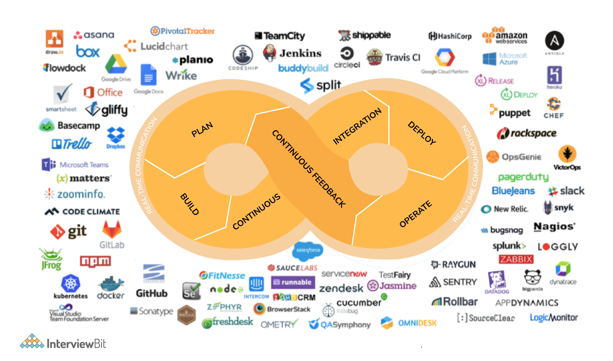
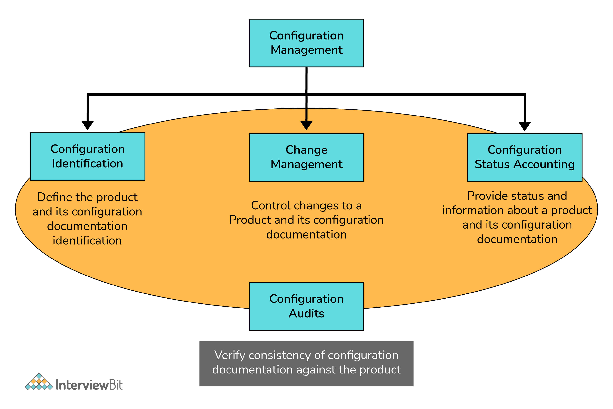
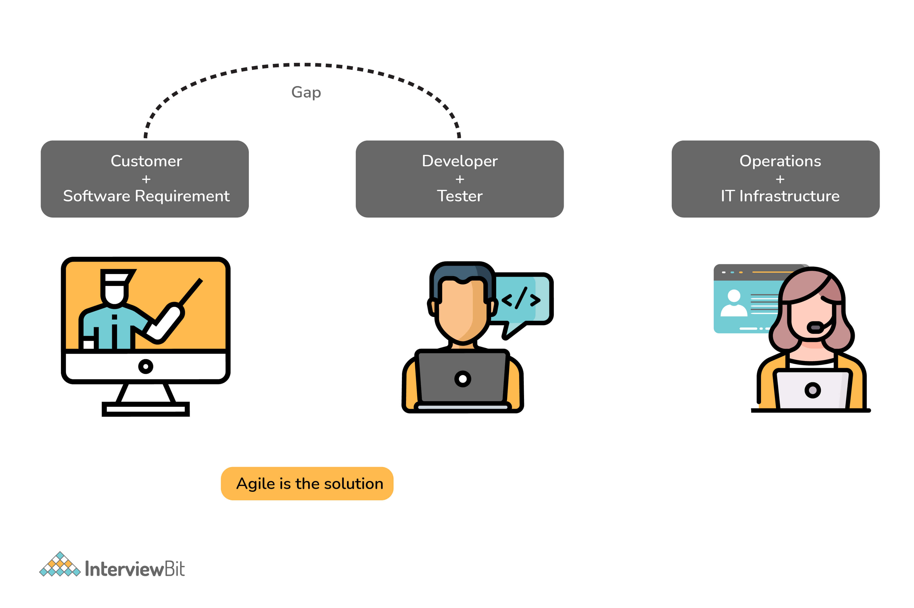
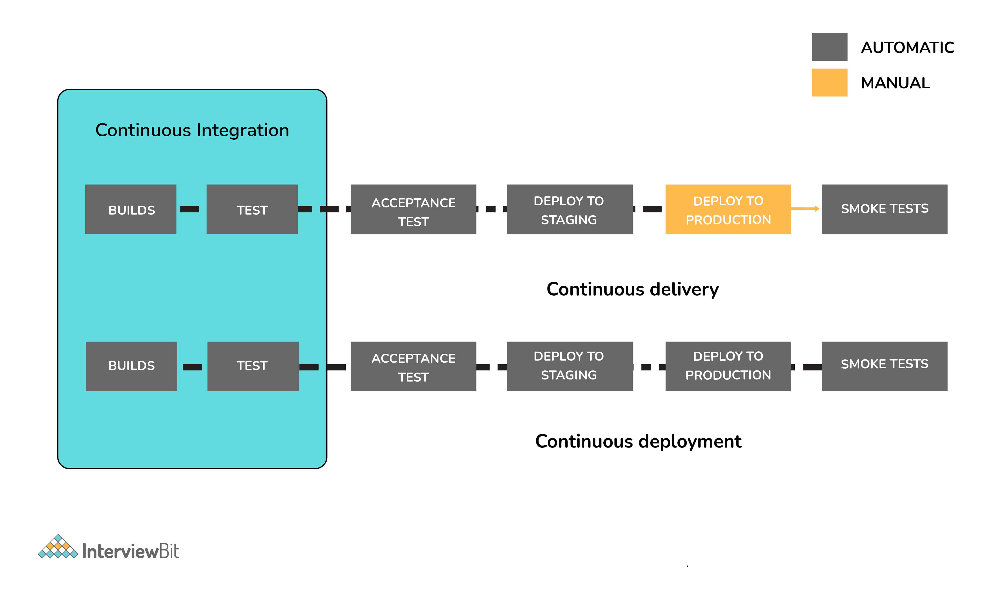
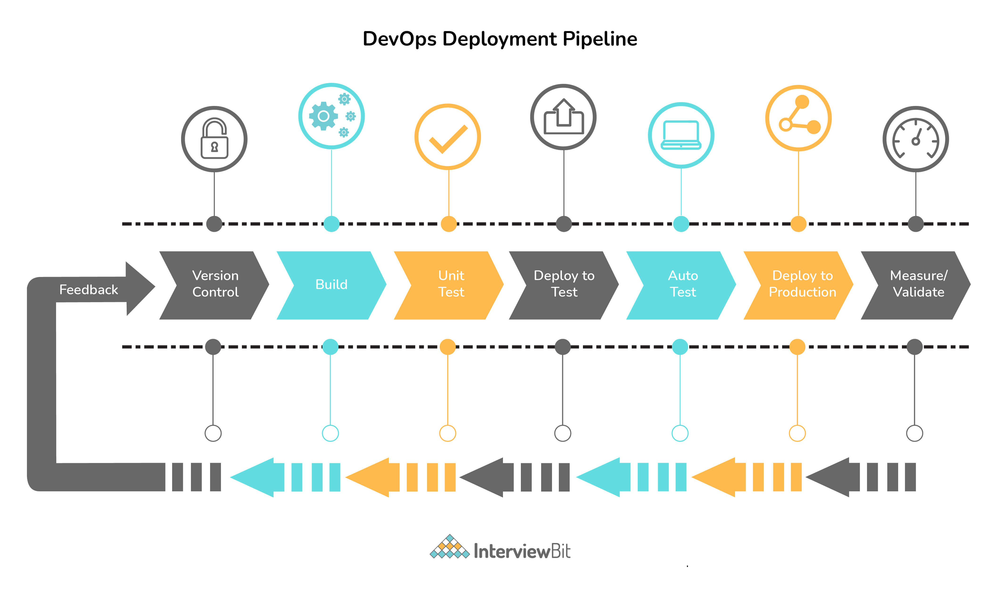
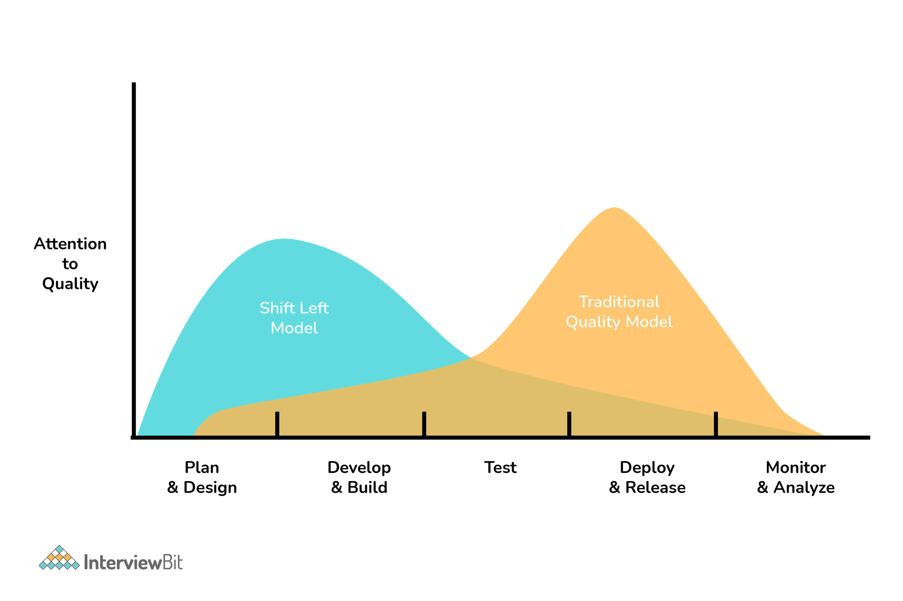
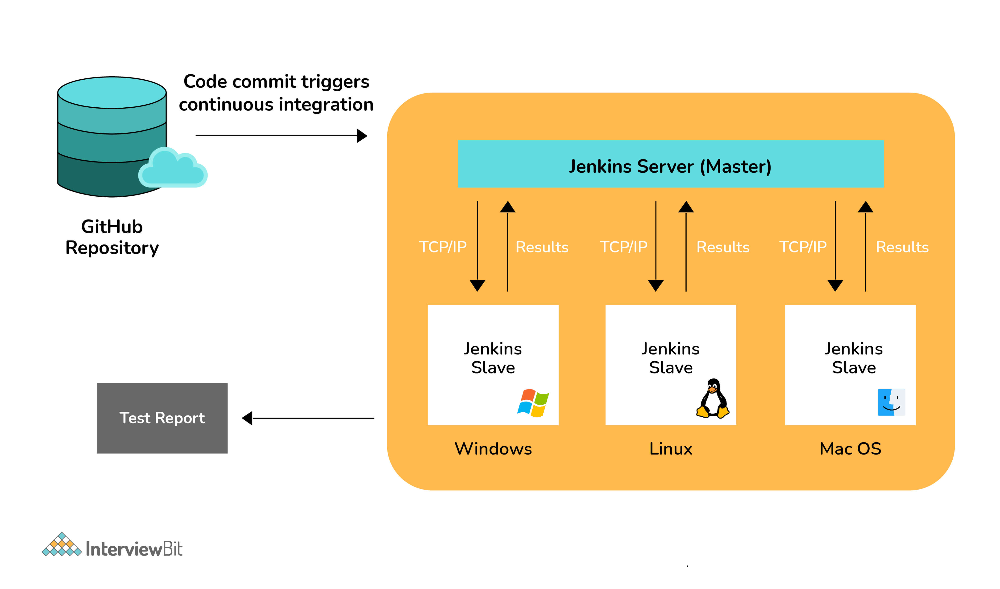
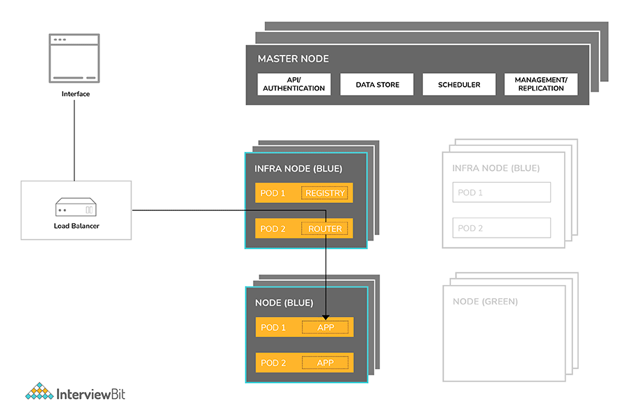

# Câu hỏi phỏng vấn DevOps



## DevOps là gì?

DevOps được ghép bởi 2 từ tiếng anh Development (Dev) và Operations (Ops). Nghĩa là có sự kết hợp giữa kỹ sư phát triển phần mềm với bộ phận  Operator để  rút ngắn quá trình phát triển sản phẩm. 

DevOps thực chất không phải là một công cụ hỗ trợ làm việc mà chính là sự tổng hợp của các nguyên lý, thực tiễn, quy trình cùng các công cụ và mang lại sự tự động hóa trong lập trình, chuyển giao phần mềm. 



## Công cụ DevOps

DevOps là một phương pháp nhằm tăng năng suất và chất lượng của quá trình phát triển sản phẩm. Các công cụ chính được sử dụng trong phương pháp này là:
- Version Control System. Vd.: git.
- Continuous Integration. Vd.: Jenkins
- Continuous Testing. Vd.: Selenium
- Configuration Management & Deployment. Vd.:Puppet, Chef, Ansible
- Continuous Monitoring. Vd.: Nagios
- Containerization. Vd.: Docker



Các tổ chức đã áp dụng phương pháp này được báo cáo là đã hoàn thành gần hàng nghìn lần triển khai chỉ trong một ngày, do đó cung cấp độ tin cậy, độ ổn định và bảo mật cao hơn cùng với sự hài lòng của khách hàng.

## Mục lục

[1. Kỹ sư DevOps là gì?](#1-k%E1%BB%B9-s%C6%B0-devops-l%C3%A0-g%C3%AC)

[2. Tại sao cần DevOps?](#2-t%E1%BA%A1i-sao-c%E1%BA%A7n-devops)

[3. SSH là gì?](#3-ssh-l%C3%A0-g%C3%AC)

[4. Quản lý cấu hình là gì?](#4-qu%E1%BA%A3n-l%C3%BD-c%E1%BA%A5u-h%C3%ACnh-l%C3%A0-g%C3%AC)

[5. Tầm quan trọng của quản lý cấu hình trong DevOps?](#5-t%E1%BA%A7m-quan-tr%E1%BB%8Dng-c%E1%BB%A7a-qu%E1%BA%A3n-l%C3%BD-c%E1%BA%A5u-h%C3%ACnh-trong-devops)

[6. CAMS là gì?](#6-cams-l%C3%A0-g%C3%AC)

[7. Tích hợp liên tục là gì?](#7-t%C3%ADch-h%E1%BB%A3p-li%C3%AAn-t%E1%BB%A5c-l%C3%A0-g%C3%AC)

[8. Tại sao lại cần tích hợp liên tục?](#8-t%E1%BA%A1i-sao-l%E1%BA%A1i-c%E1%BA%A7n-t%C3%ADch-h%E1%BB%A3p-li%C3%AAn-t%E1%BB%A5c)

[9. Kiểm tra liên tục là gì?](#9-ki%E1%BB%83m-tra-li%C3%AAn-t%E1%BB%A5c-l%C3%A0-g%C3%AC)

[10. Các yếu tố quan trọng của DevOps KPI?](#10-c%C3%A1c-y%E1%BA%BFu-t%E1%BB%91-quan-tr%E1%BB%8Dng-c%E1%BB%A7a-devops-kpi)

[11. Các giai đoạn trong DevOps?](#11-c%C3%A1c-giai-%C4%91o%E1%BA%A1n-trong-devops)

[12. DevOps khác với Agile như thế nào?](#12-devops-kh%C3%A1c-v%E1%BB%9Bi-agile-nh%C6%B0-th%E1%BA%BF-n%C3%A0o)

[13. Sự khác biệt giữa Continuous Deployment và Continuous Delivery?](#13-s%E1%BB%B1-kh%C3%A1c-bi%E1%BB%87t-gi%E1%BB%AFa-continuous-deployment-v%C3%A0-continuous-delivery)

[14. Vài lầm tưởng về DevOps?](#14-v%C3%A0i-l%E1%BA%A7m-t%C6%B0%E1%BB%9Fng-v%E1%BB%81-devops)

[15. Memcached là gì?](#15-memcached-l%C3%A0-g%C3%AC)

[16. Các chiến lược branching khác nhau dùng trong VCS?](#16-c%C3%A1c-chi%E1%BA%BFn-l%C6%B0%E1%BB%A3c-branching-kh%C3%A1c-nhau-d%C3%B9ng-trong-vcs)

[17. Các KPI dùng để đánh giá DevOps?](#17-c%C3%A1c-kpi-d%C3%B9ng-%C4%91%E1%BB%83-%C4%91%C3%A1nh-gi%C3%A1-devops)

[18. CBD trong DevOps là gì?](#18-cbd-trong-devops-l%C3%A0-g%C3%AC)

[19. Resilience Testing là gì?](#19-resilience-testing-l%C3%A0-g%C3%AC)

[20. Phân biệt continous testing và automation testing?](#20-ph%C3%A2n-bi%E1%BB%87t-continous-testing-v%C3%A0-automation-testing)

[21. DevOps pipeline là gì?](#21-devops-pipeline-l%C3%A0-g%C3%AC)

[22. Cách Ansible hoạt động trong DevOps?](#22-c%C3%A1ch-ansible-ho%E1%BA%A1t-%C4%91%E1%BB%99ng-trong-devops)

[23. Cách Ansible hoạt động?](#23-c%C3%A1ch-ansible-ho%E1%BA%A1t-%C4%91%E1%BB%99ng)

[24. Cách AWS làm việc với DevOps?](#24-c%C3%A1ch-aws-l%C3%A0m-vi%E1%BB%87c-v%E1%BB%9Bi-devops)

[25. Cách chuẩn bị để phát triển một dự án sử dụng phương pháp DevOps có thể là gì?](#25-c%C3%A1ch-chu%E1%BA%A9n-b%E1%BB%8B-%C4%91%E1%BB%83-ph%C3%A1t-tri%E1%BB%83n-m%E1%BB%99t-d%E1%BB%B1-%C3%A1n-s%E1%BB%AD-d%E1%BB%A5ng-ph%C6%B0%C6%A1ng-ph%C3%A1p-devops-c%C3%B3-th%E1%BB%83-l%C3%A0-g%C3%AC)

[26. Giải thích khái niệm "Shift left to reduce failure" trong DevOps?](#26-gi%E1%BA%A3i-th%C3%ADch-kh%C3%A1i-ni%E1%BB%87m-%22shift-left-to-reduce-failure%22-trong-devops)

[27. Cuộc họp Post Mortem là gì trong DevOps?](#27-cu%E1%BB%99c-h%E1%BB%8Dp-post-mortem-l%C3%A0-g%C3%AC-trong-devops)

[28. Khái niệm đằng sau lệnh sudo trong Linux?](#28-kh%C3%A1i-ni%E1%BB%87m-%C4%91%E1%BA%B1ng-sau-l%E1%BB%87nh-sudo-trong-linux)

[29. Giải thích kiến trúc Jenkins?](#29-gi%E1%BA%A3i-th%C3%ADch-ki%E1%BA%BFn-tr%C3%BAc-jenkins)

[30. Giải thích khái niệm "infrastructure as code" (IaC)?"](#30-gi%E1%BA%A3i-th%C3%ADch-kh%C3%A1i-ni%E1%BB%87m-%22infrastructure-as-code%22-iac%22)

[31. Lập trình theo cặp là gì?](#31-l%E1%BA%ADp-tr%C3%ACnh-theo-c%E1%BA%B7p-l%C3%A0-g%C3%AC)

[32. Blue/Green Deployment Pattern?](#32-bluegreen-deployment-pattern)

[33. Hiệu ứng Dogpile là gì?](#33-hi%E1%BB%87u-%E1%BB%A9ng-dogpile-l%C3%A0-g%C3%AC)

[34. Các bước cần thực hiện để cấu hình git repo để nó chạy quá trình kiểm tra code trước khi thực hiện bất kỳ commit nào?](#34-c%C3%A1c-b%C6%B0%E1%BB%9Bc-c%E1%BA%A7n-th%E1%BB%B1c-hi%E1%BB%87n-%C4%91%E1%BB%83-c%E1%BA%A5u-h%C3%ACnh-git-repo-%C4%91%E1%BB%83-n%C3%B3-ch%E1%BA%A1y-qu%C3%A1-tr%C3%ACnh-ki%E1%BB%83m-tra-code-tr%C6%B0%E1%BB%9Bc-khi-th%E1%BB%B1c-hi%E1%BB%87n-b%E1%BA%A5t-k%E1%BB%B3-commit-n%C3%A0o)

[35. Làm thế nào có thể đảm bảo một script chạy mỗi khi repo nhận được các commit mới thông qua git push?](#35-l%C3%A0m-th%E1%BA%BF-n%C3%A0o-c%C3%B3-th%E1%BB%83-%C4%91%E1%BA%A3m-b%E1%BA%A3o-m%E1%BB%99t-script-ch%E1%BA%A1y-m%E1%BB%97i-khi-repo-nh%E1%BA%ADn-%C4%91%C6%B0%E1%BB%A3c-c%C3%A1c-commit-m%E1%BB%9Bi-th%C3%B4ng-qua-git-push)

## Câu hỏi phỏng vấn DevOps cho Fresher

### 1. Kỹ sư DevOps là gì?

Kỹ sư DevOps làm việc với lập trình viên và nhân viên IT để giám sát việc phát hành code. Họ có thể xuất phát là các lập trình viên, quan tâm đến việc triển khai và vận hành mạng. Hoặc họ là các sysadmin (quản trị hệ thống) có niềm đam mê viết script và coding, chuyển sang mảng phát triển nơi họ có thể cải thiện việc lập kế hoạch kiểm thử và triển khai. Đôi lúc, người làm DevOps là developer hay sysadmin kiêm nhiệm luôn trọng trách của một DevOps trong khi vẫn tiếp tục với vai trò chính của mình.

Kỹ sư DevOps là người hiểu rõ về chu kỳ phát triển phần mềm (Software Development Life Cycle – SDLC). Họ cũng là người hiểu toàn diện về các công cụ tự động hóa khác nhau được dùng trong CI/CD pipelines.

### 2. Tại sao cần DevOps?

DevOps cho phép các nhóm phát triển nhanh để thực hiện tích hợp liên tục (Continuous Integration) và phân phối liên tục (Continuous Delivery). Điều này giúp họ đưa sản phẩm ra thị trường nhanh hơn.

Các lý do quan trọng khác là:

- **Khả năng dự đoán (Predictability):** DevOps có thể dự đoán những rủi ro có thể gặp phải và giúp giảm đáng kể tỷ lệ thất bại của các phiên bản mới.
- **Tự khôi phục (Reproducibility):** Bạn có thể khôi phục ứng dụng của mình về phiên bản cũ hơn bất cứ lúc nào.
- **Khả năng duy trì(Maintainability):** Việc khôi phục có thể được thực hiện dễ dàng nếu phiên bản mới gặp sự cố hoặc hệ thống hiện tại không khả dụng.
Thời gian triển khai (Time to market): DevOps giảm thời gian triển khai lên production 50% bằng cách hợp lý hóa quy trình phân phối phần mềm.
- **Chất lượng cao hơn (Greater Quality):** DevOps giúp nhóm cải thiện chất lượng phát triển ứng dụng.
- **Giảm rủi ro (Reduced Risk):** DevOps bao gồm kiểm tra bảo mật trong vòng đời phân phối phần mềm. Nó giúp giảm rủi ro bảo mật trong suốt vòng đời phần mềm.
- **Khả năng phục hồi (Resiliency):** Trạng thái hoạt động của hệ thống phần mềm ổn định hơn và an toàn hơn, và khi có bất cứ sự cố nào xảy ra, hệ thống có thể tự phục hồi.
- **Hiệu quả chi phí (Cost Efficiency):** DevOps cung cấp hiệu quả chi phí trong quy trình phát triển phần mềm, đây luôn là điều mà công ty trong lĩnh vực Internet mong đợi.
- **Chia các code base lớn thành các phần nhỏ (Breaks larger code base into small pieces):** DevOps dựa trên các phương pháp lập trình nhanh. Do đó, nó cho phép một code base lớn được chia thành các khối nhỏ hơn và dễ quản lý hơn.

### 3. SSH là gì?

SSH, hoặc được gọi là Secure Shell, là một giao thức điều khiển từ xa cho phép người dùng kiểm soát và chỉnh sửa server từ xa qua Internet. Dịch vụ được tạo ra nhằm thay thế cho trình Telnet vốn không có mã hóa và sử dụng kỹ thuật cryptographic để đảm bảo tất cả giao tiếp gửi tới và gửi từ server từ xa diễn ra trong tình trạng mã hóa. Nó cung cấp thuật toán để chứng thực người dùng từ xa, chuyển input từ client tới host, và gửi kết quả trả về tới client.

### 4. Quản lý cấu hình là gì?

Quản lý cấu hình (Configuration management - CM) về cơ bản là một hoạt động xử lý các thay đổi hệ thống để không mất đi tính toàn vẹn của nó trong một khoảng thời gian. Điều này liên quan đến các chính sách, kỹ thuật, thủ tục và công cụ nhất định để đánh giá các đề xuất thay đổi, quản lý và theo dõi tiến trình của chúng cùng với việc duy trì tài liệu thích hợp cho cùng một đề xuất.

CM giúp đưa ra các định hướng quản lý và kỹ thuật để thiết kế và phát triển việc tăng giá trị sản phẩm.



### 5. Tầm quan trọng của quản lý cấu hình trong DevOps?

CM giúp nhóm tự đóng hoá các công việc nhàm chán và tốn thời gian, qua đó nâng cao hiệu suất và năng lực tổ chức.

Nó cũng giúp mang lại tính nhất quán và cải thiện quy trình phát triển sản phẩm bằng cách sử dụng các phương tiện thiết kế tinh giản, tài liệu mở rộng, kiểm soát và thực hiện thay đổi trong các giai đoạn/phát hành khác nhau của dự án.

### 6. CAMS là gì?

CAMS là viết tắt của Culture, Automation, Measurement và Sharing. Nó biểu diễn các yếu tố cốt lõi của DevOps.

### 7. Tích hợp liên tục là gì?

Tích hợp liên tục (CI) là phương pháp phát triển phần mềm đòi hỏi các thành viên trong nhóm tích hợp công việc thường xuyên. Mỗi ngày, các thành viên đều phải theo dõi và phát triển công việc của họ ít nhất một lần. Việc này sẽ được một nhóm khác kiểm tra tự động, nhóm này sẽ tiến hành kiểm thử truy hồi để phát hiện lỗi nhanh nhất có thể. Cả nhóm thấy rằng phương pháp tiếp cận này giúp giảm bớt vấn đề về tích hợp hơn và cho phép phát triển phần mềm gắn kết nhanh hơn. 

.jpg)

Dựa vào hình trên, ta có cái nhìn tổng thể về quy trình CI:
- Các nhà phát triển thường xuyên kiểm tra code trong không gian làm việc cục bộ của họ và làm việc trên các tính năng họ được giao.
- Sau khi hoàn tất công việc, code được commit và push lên repository chung từ xa được xử lý bằng cách sử dụng các công cụ kiểm soát phiên bản hiệu quả như git.
- CI Server theo dõi các thay đổi được thực hiện đối với repository chung và nó pull các thay đổi ngay khi phát hiện ra chúng.
- Sau đó, CI Server sẽ kích hoạt việc build code và chạy các kiểm thử đơn vị và kiểm tra tích hợp nếu được thiết lập.
- Nhóm được thông báo về kết quả build. Trong trường hợp không thành công, nhóm phải làm việc để khắc phục sự cố càng sớm càng tốt và sau đó quá trình lặp lại.

### 8. Tại sao lại cần tích hợp liên tục?

Bằng cách kết hợp Tích hợp liên tục cho cả quá trình phát triển và thử nghiệm, người ta nhận thấy rằng chất lượng phần mềm đã được cải thiện và thời gian cung cấp các tính năng của phần mềm đã giảm đáng kể.

Điều này cũng cho phép nhóm phát triển phát hiện và sửa lỗi ở giai đoạn ban đầu vì mỗi commit đối với repository chung được build tự động và chạy dựa trên các trường hợp kiểm thử đơn vị và kiểm tra tích hợp.

### 9. Kiểm tra liên tục là gì?

Kiểm tra liên tục (Continuous Testing - CT) là giai đoạn DevOps bao gồm quá trình chạy các trường hợp kiểm thử tự động như một phần của quy trình phân phối phần mềm tự động với mục đích duy nhất là nhận được phản hồi ngay lập tức về chất lượng và xác nhận các rủi ro nghiệp vụ liên quan đến việc build tự động code của các nhà phát triển.

Giai đoạn này sẽ giúp nhóm kiểm tra liên tục từng bản build (ngay sau khi code được push), do đó tạo cơ hội cho các nhóm phát triển nhận được phản hồi tức thì về công việc của họ và đảm bảo rằng những vấn đề này không đến trong các giai đoạn sau của Chu trình SDLC.

Thực hiện điều này sẽ tăng tốc đáng kể quy trình làm việc, vì các nhà phát triển bỏ qua được các bước can thiệp thủ cộng để build lại dự án và chạy các trường hợp kiểm thử tự động mỗi khi thay đổi được thực hiện.

### 10. Các yếu tố quan trọng của DevOps KPI?

- Giảm thời gian trung bình cần thiết để hồi phục sau sự cố.
- Tăng tần suất triển khai khi việc triển khai diễn ra.
- Giảm tỷ lệ triển khai không thành công.

### 11. Các giai đoạn trong DevOps?

Có 6 giai đoạn chính trong DevOps:

#### Planning:

Đây là giai đoạn đầu tiên của vòng đời DevOps bao gồm sự hiểu biết thấu đáo về dự án để cuối cùng phát triển sản phẩm tốt nhất. Khi được thực hiện đúng cách, giai đoạn này cung cấp các đầu vào khác nhau cần thiết cho các giai đoạn development và operating. Giai đoạn này cũng giúp tổ chức đạt được sự rõ ràng về quá trình phát triển và quản lý dự án.

Công cụ: Google Apps, Asana, Microsoft Team,...

#### Development:

Giai đoạn planning được theo sau bởi giai đoạn Development, trong đó dự án được xây dựng bằng cách phát triển cơ sở hạ tầng hệ thống, phát triển các tính năng bằng cách viết code, sau đó xác định các trường hợp test và quy trình tự động hóa. Các nhà phát triển lưu trữ code của họ trong một trình quản lý code được gọi là repository từ xa, hỗ trợ cộng tác nhóm bằng cách cho phép xem, sửa đổi và tạo phiên bản của code.

Công cụ như git, IDE như Eclipse, VS Code và các công nghệ sử dụng có thể là Java, Nodejs,...

#### Continuous Integration (CI):

Giai đoạn này là trung tâm của toàn bộ vòng đời DevOps. Đó là một thực tiễn phát triển phần mềm, trong đó các developer yêu cầu cam kết thay đổi code nguồn thường xuyên hơn. Việc này có thể diễn ra hàng ngày hoặc hàng tuần. Sau đó, mọi commit được build và điều này cho phép phát hiện sớm các vấn đề nếu chúng có mặt. Code xây dựng không chỉ liên quan đến việc biên dịch, mà nó còn bao gồm kiểm thử đơn vị, kiểm tra tích hợp, xem xét mã và đóng gói.

Code hỗ trợ chức năng mới liên tục được tích hợp với code hiện có. Do đó, có sự phát triển không ngừng của phần mềm. Code cập nhật cần được tích hợp liên tục và thông suốt với hệ thống để phản ánh các thay đổi tới người dùng cuối.

Công cụ như Jenkins, CircleCI,...

#### Deployment:

DevOps hỗ trợ quá trình tự động hóa triển khai bằng cách sử dụng các công cụ và script có mục tiêu cuối cùng là tự động hóa quy trình bằng cách kích hoạt tính năng. Tại đây, các dịch vụ đám mây có thể được sử dụng như một phương tiện hỗ trợ nâng cấp từ quản lý cơ sở hạ tầng hữu hạn lên quản lý tối ưu hóa chi phí với tiềm năng tài nguyên vô hạn.

Công cụ như Microsoft Azure, Amazon Web Services, Heroku,..

#### Operations:

Giai đoạn này thường xảy ra trong suốt vòng đời của sản phẩm/phần mềm do những thay đổi của cơ sở hạ tầng động. Điều này cung cấp cho nhóm các cơ hội để tăng tính khả dụng, khả năng mở rộng và chuyển đổi hiệu quả của sản phẩm.

Công cụ như Loggly, BlueJeans, Appdynamics,...

#### Monitoring:

Là một giai đoạn liên quan đến tất cả các yếu tố hoạt động của toàn bộ quy trình DevOps, nơi thông tin quan trọng về việc sử dụng phần mềm được ghi lại và xử lý cẩn thận để tìm ra xu hướng và xác định các khu vực có vấn đề. Thông thường, việc giám sát được tích hợp trong khả năng hoạt động của ứng dụng phần mềm.

Công cụ như Nagios, Splunk,...

### 12. DevOps khác với Agile như thế nào?



| |	Agile | DevOps |
|-|-|-|
| Định nghĩa | Agile đề cập đến một cách tiếp cận lặp đi lặp lại, tập trung vào sự cộng tác, phản hồi của khách hàng và các bản phát hành nhỏ, nhanh chóng. | DevOps được coi là một thực tế đưa các nhóm phát triển và nhóm hoạt động lại gần nhau. |
| Mục đích | Agile giúp quản lý các dự án phức tạp. | Mô hình chính của DevOps là quản lý các quy trình kỹ thuật từ đầu đến cuối. |
| Công việc	| Mô hình agile tập trung vào những thay đổi liên tục. | DevOps tập trung vào kiểm thử và phân phối liên tục. |
| Thực hiện	| Agile có thể được thực hiện dựa trên những chiến lược có sẵn như sprint, safe and scrum. | Mục tiêu chính của DevOps là tập trung vào cộng tác, vì vậy nó không có bất kỳ framework được chấp nhận phổ biến nào. |
| Kỹ năng team | Phát triển nhanh, nhấn mạnh đào tạo tất cả các thành viên trong nhóm để có kỹ năng đồng đều. | DevOps chia và dàn trải kỹ năng giữa các nhóm phát triển và vận hành.
| Team size	| Nhóm nhỏ là cốt lõi của Agile.Khi nhóm nhỏ hơn, số người càng ít thì họ càng di chuyển nhanh hơn. | Kích thước nhóm tương đối lớn. |
| Thời lượng | Quá trình agile được quản lý theo đơn vị "sprints".Thời gian này ít hơn một tháng cho mỗi giai đoạn. | DevOps tập trung vào thời giạn release những bản phát hành chính thức. Mục tiêu là bàn giao code sản phẩm hang ngày, hàng giờ. |
| Phản hồi | Phản hồi được đưa ra bởi khách hàng. | Phản hồi đến từ nhóm nội bộ. |
| Mục tiêu | Phát triển phần mềm. | Giải pháp kinh doanh đầu cuối và giao hàng nhanh. |
| Nguyên tắc Shift-Left | Tận dụng shift-left. 'Shift Left' có nghĩa là thay đổi từ phải sang trái bắt nguồn từ 'Giai đoạn Kiểm thử' hoặc rõ hơn là liên quan đến Kiểm thử ở mọi giai đoạn và kiểm thử liên tục trong suốt quá trình phát triển phần mềm . Hỗ trợ việc tạo thành các nhóm Scrum Agile, bao gồm các QA có các vai trò khác nhau. | Tận dụng cả hai, cả trái và phải (shift left và shift right). |
| Nhấn mạnh	| Agile nhấn mạnh vào phương pháp phát triển phần mềm để phát triển phần mềm. Khi phần mềm được phát triển và phát hành, team agile sẽ không quan tâm điều gì xảy ra với nó. | DevOps là tất cả về việc lấy phần mềm đã sẵn sàng để phát hành và triển khai nó một cách đáng tin cậy và an toàn. |
| Chức năng xuyên suốt | Bất kỳ thành viên nhóm nào cũng có thể làm những gì cần thiết cho tiến độ của dự án. Ngoài ra, khi mỗi thành viên trong nhóm có thể thực hiện mọi công việc, nó làm tăng sự hiểu biết và liên kết giữa chúng.| Trong DevOps, các nhóm phát triển và các nhóm hoạt động riêng biệt. Vì vậy, giao tiếp khá phức tạp. |
| Giao tiếp	| Scrum là phương pháp phổ biến nhất để triển khai phát triển phần mềm Agile. Cuộc họp scrum hàng ngày được thực hiện. | Giao tiếp trong DevOps liên quan đến thông số kỹ thuật và tài liệu thiết kế. Điều quan trọng là nhóm hoạt động phải hiểu đầy đủ về việc phát hành phần mềm và các hệ thống phần cứng / mạng để chạy quá trình triển khai. |
| Tài liệu | Phương pháp Agile ưu tiên cho hệ thống có tài liệu hoàn chỉnh. Tuy nhiên, nó có thể sẽ không tốt khi bạn đang cố gắng chuyển mọi thứ sang một nhóm khác để triển khai.	| Trong DevOps, tài liệu quy trình là quan trọng nhất vì nó sẽ được gửi cho nhóm hoạt động để triển khai. Tự động khắc phục, giảm thiểu tác động của việc tài liệu mô tả thiếu.Tuy nhiên, trong sự phát triển của phần mềm phức tạp, thật khó để chuyển tất cả các kiến thức cần thiết. |
| Tự động hóa | Agile không nhấn mạnh vào tự động hóa. Mặc dù nó hỗ trợ. | Tự động hóa là mục tiêu chính của DevOps. Nó hoạt động trên nguyên tắc để tối đa hóa hiệu quả khi triển khai phần mềm. |
| Mục tiêu | Nó giải quyết khoảng cách giữa nhu cầu của khách hàng và các nhóm phát triển và thử nghiệm. | Nó giải quyết khoảng cách giữa phát triển, kiểm thử và Ops.|
| Tiêu điểm | Nó tập trung vào sự sẵn sàng chức năng và phi chức năng. | Nó tập trung nhiều hơn vào sự sẵn sàng hoạt động và kinh doanh. |
| Tầm quan trọng | Agile tập trung vào quá trình phát triển phần mềm. | Phát triển, kiểm thử và thực hiện tất cả đều quan trọng không kém. |
| Tốc độ so với rủi ro | Các nhóm sử dụng Agile hỗ trợ thay đổi nhanh chóng và cấu trúc ứng dụng mạnh mẽ. | Trong phương pháp DevOps, các team phải đảm bảo rằng những thay đổi được thực hiện cho kiến trúc không tạo ra rủi ro cho toàn bộ dự án. |
| Chất lượng | Agile sản xuất các bộ ứng dụng tốt hơn với các yêu cầu mong muốn. Nó có thể dễ dàng thích ứng theo những thay đổi được thực hiện về thời gian, trong suốt cuộc đời dự án. | DevOps, cùng với tự động và gỡ lỗi sớm, góp phần tạo ra chất lượng tốt hơn. Các nhà phát triển cần tuân theo các phương pháp tốt nhất về Mã hóa và Kiến trúc để duy trì các tiêu chuẩn chất lượng. |
| Công cụ được sử dụng | JIRA, Bugzilla, Kanboard là một số công cụ Agile phổ biến. | Puppet, Chef, TeamCity OpenStack, AWS là các công cụ DevOps phổ biến. |
| Thách thức | Phương pháp nhanh nhẹn cần các đội làm việc hiệu quả hơn, rất khó để phù hợp với mọi thời gian. | Quá trình DevOps cần phải phát triển, thử nghiệm và môi trường sản xuất để sắp xếp công việc. |
| Lợi thế | Agile cung cấp chu kỳ phát triển ngắn hơn và phát hiện khiếm khuyết được cải thiện.	| DevOps hỗ trợ chu kỳ phát hành của Agile. |

### 13. Sự khác biệt giữa Continuous Deployment và Continuous Delivery?

| Continuous Deployment | Continuous Delivery |
|-|-|
| Việc triển khai đến môi trường production hoàn toàn tự động và không cần sự can thiệp của thủ công. | Trong quá trình này, cần một số can thiệp thủ công với sự chấp thuận của người quản lý để triển khai tới môi trường production. |
| Tại đây, ứng dụng được chạy bằng cách làm theo bộ hướng dẫn tự động và không cần phê duyệt. | Ở đây, hoạt động của ứng dụng phụ thuộc vào quyết định của nhóm. |



### 14. Vài lầm tưởng về DevOps?

- DevOps là một tiến trình không phải văn hoá.
- DevOps là Agile.
- Nên có một nhóm DevOps riêng.
- DevOps giải quyết mọi vấn đề.
- DevOps cũng như các nhà phát triển chạy môi trường production.
- DevOps tuân theo quản lý theo hướng phát triển.
- DevOps không tập trung nhiều vào phát triển.
- Vì chúng tôi là một tổ chức độc đáo, chúng tôi không theo số đông và do đó chúng tôi sẽ không triển khai DevOps.
- Chúng tôi không có tập hợp người phù hợp, do đó chúng tôi không thể triển khai văn hóa DevOps. 

### 15. Memcached là gì?

Hiểu đơn giản Memcached là một ứng dụng Linux, tuy nhiên do Memcached là mã nguồn mở nên chúng đã được các nhà lập trình phát triển cho nền tảng Windows sử dụng. Hệ thống này có các ưu điểm nổi trội thu hút rất nhiều người sử dụng phổ biến hiện nay, cụ thể như:

- Memcached là một cache, nó là một dịch vụ độc lập hoàn toàn như MySQL.
- Memcached cung cấp cho người dùng khả năng lưu trữ đối tượng bất kỳ vào bên trong bộ nhớ RAM.
- Memcached là một NoSQL được thiết kế với hiệu năng làm việc rất cao. Chúng hoạt động theo phương thức distrubuted memory object caching.
- Memcached được tích hợp có tác dụng giảm tải cơ sở dữ liệu (database) cho ứng dụng, website và tối ưu tốc độ website của người dùng.

##### Ưu điểm của Memcached

- Ở mức nhỏ, mọi người thường sử dụng Memcached để làm nơi lưu trữ dữ liệu dùng để chia sẻ và thường là lưu session. Điều này vô cùng tiện lợi trong các kiểu loadbalancing đơn giản như là: nginx hay pound. Lúc này các bạn không phải quá lo lắng tới vấn đề persistence session.
- Ở mức độ lớn hơn một chút, mọi người sử dụng Memcached để giảm thiểu read từ db cho các dữ liệu ít thay đổi và cần phải tính toán nhiều. Chúng còn được dùng để xử lý query phức tạp và tiêu tốn tài nguyên.
- Ở mức độ cao hơn nữa, người ta thường sử dụng Memcached để shard db (chia nhỏ db theo row tức là theo chiều ngang). Tuy nhiên hiệu năng làm việc của nó vẫn còn gây tranh cãi khi so sánh với việc partition db.
- Hơn nữa, các thể của Memcached còn được cài đặt trên cả hệ điều hành Windows và Linux.

##### Hạn chế của Memcached

Memcached không có cơ chế thẩm định mức độ chính xác của thông tin dữ liệu lưu trong nó. Điều này có thể thấy được cấu trúc hệ thống không có bất cứ sự liên hệ nào với db mà nằm hoàn toàn độc lập.

Muốn sử dụng hệ thống này thì phải thuê máy chủ và cài Memcached vào máy chủ.

Chưa đồng bộ tự động với cơ sở dữ liệu khi database thay đổi. Cụ thể như việc Database có dữ liệu là A và Memcached cũng có dữ liệu như vậy. Lúc này database sẽ đổi sang giá trị B nhưng Memcached vẫn là A.

Viết trực tiếp vào memcached, sau một thời gian nó sẽ chuyên vào db gặp khá nhiều nguy hiểm, điển hình như việc không kịp viết từ memcached vào db mà server memcached đã tèo. Do đó không nên sử dụng memcached cho các dữ liệu mang tính cốt lõi

### 16. Các chiến lược branching khác nhau dùng trong VCS?

Branching là một khái niệm quan trong trong các VCS (version control system) như git. Một vài kiểu branching phổ biến là:

#### Feature branching

- Kiểu branching này đảm bảo các tính năng riêng biệt của dự án được duy trì trong branch,
- Sau khi các tính năng được xác minh đầy đủ, branch sẽ được merge (hợp) vào branch chính.

#### Task branching

- Ở đây, mỗi tác vụ được duy trì trong branch của nó với khoá tác vụ là tên branch.
- Đặt tên branch là tên tác vụ giúp dễ dàng xác định tác vụ nào đang được đề cập trong branch nào.

#### Release branching

- Kiểu branch này được thực hiện sau khi một tập tính năng dành cho một bản phát hành hoàn thành, chúng có thể nhan bản thành một branch gọi là release branch. Bất kỳ tính năng nào khác sẽ không được thêm vào branch này.
- Chỉ các bản sửa lỗi, tài liệu và các hoạt động liên quan được thực hiện trong một release branch.
- Khi mọi thứ đã sẵn sàng, các bản phát hành sẽ được merge vào branch chính và được đánh thẻ (tag) với số phiên bản phát hành.
- Những thay đổi này cũng cần được đẩy vào develop branch vốn sẽ tiến triển với sự phát triển tính năng mới.

### 17. Các KPI dùng để đánh giá DevOps?

KPI là viết tắt của Key Performance Indicators, tạm dịch là các chỉ số hiệu suất chính. Một vài KPI phổ biến để đánh giá độ thành công của DevOps:

- Sử dụng ứng dụng, hiệu suất và lưu lượng truy cập
- Tỷ lệ phần trăm vượt qua trường hợp thử nghiệm tự động.
- Độ khả dụng ứng dụng
- Thay đổi yêu cầu kích cỡ
- Vé khách hàng
- Tần suất và thời gian triển khai thành công
- Tỷ lệ lỗi/không đạt
- Triển khai không thành công
- Thời gian phát hiện (MTTD)
- Thời gian chờ khôi phục (MTTR)

### 18. CBD trong DevOps là gì?

CBD là viết tắt của Component-Based Development. Đó là một cách độc đáo để tiếp cận phát triển sản phẩm. Tại đây, các nhà phát triển tiếp tục tìm kiếm các thành phần code được xác định rõ ràng, đã được kiểm tra và xác minh, đồng thời giúp nhà phát triển phát triển lại từ đầu.


### 19. Resilience Testing là gì?

Resilience Testing là một quy trình phần mềm kiểm tra hành vi của ứng dụng trong các tình huống hỗn loạn và không kiểm soát được. Nó cũng đảm bảo rằng dữ liệu và chức năng không bị mất sau khi gặp sự cố.

### 20. Phân biệt continous testing và automation testing?

| Continuous Testing | Automation Testing |
|-|-|
| Đây là quá trình thực hiện tất cả các trường hợp kiểm thử tự động và được thực hiện như một phần của quá trình phân phối. | Đây là một quá trình thay thế kiểm thử thủ công bằng cách giúp các nhà phát triển tạo các trường hợp kiểm thử có thể chạy nhiều lần mà không cần can thiệp thủ công. |
| Quá trình này tập trung vào các rủi ro nghiệp vụ liên quan đến việc phát hành phần mềm càng sớm càng tốt. | Quá trình này giúp nhà phát triển biết liệu các tính năng mà họ đã phát triển có không có lỗi hay không bằng cách lấy tập hợp các điểm đạt/không đạt làm tài liệu tham khảo. |

### 21. DevOps pipeline là gì?

Nói chung, pipeline là một tập hợp các tác vụ/quy trình tự động được xác định và tuân theo bởi nhóm kỹ sư phần mềm. DevOps pipeline là một pipeline cho phép các kỹ sư DevOps và nhà phát triển phần mềm biên dịch, xây dựng và triển khai code phần mềm một cách hiệu quả và đáng tin cậy cho môi trường sản xuất một cách dễ dàng.



Luồng hoạt động như sau:
- Nhà phát triển làm việc để hoàn thành một chức năng.
- Nhà phát triển triển khai code của mình vào môi trường thử nghiệm.
- Người kiểm tra làm việc để xác thực tính năng. Nhóm kinh doanh cũng có thể can thiệp và cung cấp phản hồi.
- Các nhà phát triển làm việc trên test và phản hồi kinh doanh theo cách cộng tác liên tục.
- Sau đó, code được phát hành cho production và được xác thực lại.

### 22. Cách Ansible hoạt động trong DevOps?

Nó là một công cụ DevOps tự động mã nguồn mở giúp hiện đại hoá quá trình phát triển và triển khai của ứng dụng theo cách nhanh hơn. Nó phổ biến nhờ sự đơn giản trong việc hiểu, áp dụng và sử dụng nó, nó giúp mọi người trên toàn cầu làm việc theo cách cộng tác.

| Ansible | Developers | Operations | QA | Client/Business |
|-|-|-|-|-|
| Challenges | Các nhà phát triển có xu hướng tập trung nhiều thời gian vào việc tạo công cụ hơn là cung cấp kết quả | Nhóm vận hành sẽ yêu cầu công nghệ đồng nhất có thể được sử dụng bởi các nhóm kỹ năng khác nhau một cách dễ dàng | Nhóm Đảm bảo chất lượng sẽ yêu cầu theo dõi những gì đã được thay đổi trong tính năng và khi nào nó được thay đổi | Khách hàng lo lắng về việc đưa sản phẩm ra thị trường càng sớm càng tốt |
| Need | Các nhà phát triển cần phản hồi các tính năng/lỗi mới và mở rộng quy mô nỗ lực dựa trên nhu cầu | Nhóm vận hành cần một công cụ quản lý trung tâm để giám sát các hệ thống khác nhau và khối lượng công việc của nó | Nhóm QA cần tập trung vào việc giảm thiểu rủi ro do lỗi của con người càng nhiều càng tốt đối với sản phẩm không có lỗi | Khách hàng cần tạo lợi thế cạnh tranh cho sản phẩm của mình trên thị trường |
| Ansible giúp gì | Giúp các nhà phát triển phát hiện ra lỗi ở giai đoạn sớm hơn và hỗ trợ họ triển khai nhanh hơn một cách đáng tin cậy | Giúp nhóm Vận hành giảm thiểu nỗ lực của họ trong việc che giấu nhân viên CNTT và giảm thời gian triển khai. Ngoài ra, Ansible hỗ trợ họ thực hiện các bản vá tự động | Giúp nhóm QA thiết lập các trường hợp thử nghiệm tự động không phân biệt môi trường để đạt được kết quả chính xác và đáng tin cậy hơn. Giúp xác định các đường cơ sở bảo mật giống hệt nhau và giúp họ giảm bớt gánh nặng của việc tuân theo các tài liệu truyền thống | Giúp nhóm Kinh doanh đảm bảo nhóm CNTT đang đi đúng hướng. Đồng thời giúp họ tối ưu hóa thời gian dành cho việc lập chiến lược và đổi mới dự án. Giúp các nhóm cộng tác một cách hiệu quả |

### 23. Cách Ansible hoạt động?

Ansible có hai loại server:
- Máy điều khiển
- Nút

Để điều này hoạt động, Ansible được cài đặt trên máy điều khiển bằng cách sử dụng các nút được quản lý bằng cách sử dụng SSH. Vị trí của các nút sẽ được chỉ định và cấu hình trong kho của máy điều khiển.

Ansible không yêu cầu bất kỳ cài đặt nào trên các máy chủ nút từ xa do bản chất của nó là không có tác nhân. Do đó, không cần thực hiện quy trình nền nào trong khi quản lý bất kỳ nút nào từ xa.

Ansible có thể quản lý nhiều nút từ một hệ thống điều khiển duy nhất khi tôi sử dụng Ansible Playbooks thông qua kết nối SSH. Playbook có định dạng YAML và có khả năng thực hiện nhiều tác vụ.

### 24. Cách AWS làm việc với DevOps?

AWS là viết tắt Amazon Web Services và là nhà cung cấp dịch vụ đám mây phổ biến nhất. AWS giúp DevOps như sau:
- **Tài nguyên linh hoạt:** AWS cung cấp tài nguyên linh hoạt sẵn sàng để sử dụng.
- **Mở rộng quy mô:** Hàng nghìn máy có thể được triển khai trên AWS bằng cách sử dụng sức mạnh tính toán và lưu trữ không giới hạn.
- **Tự động hóa:** Rất nhiều tác vụ có thể được tự động hóa bằng cách sử dụng các dịch vụ khác nhau do AWS cung cấp.
- **Bảo mật:** AWS an toàn và sử dụng các tùy chọn bảo mật khác nhau được cung cấp dưới tên gọi Quản lý danh tính và truy cập (IAM), việc triển khai và xây dựng ứng dụng có thể được bảo mật.

### 25. Cách chuẩn bị để phát triển một dự án sử dụng phương pháp DevOps có thể là gì?

Dự án có thể được phát triển theo các giai đoạn dưới đây bằng cách sử dụng DevOps:

- **Giai đoạn 1: Lập kế hoạch:** Lập kế hoạch và đưa ra lộ trình bằng cách thực hiện đánh giá kỹ lưỡng các quy trình đã có để xác định các lĩnh vực cần cải tiến và các điểm hạn chế.
- **Giai đoạn 2: PoC:** Đưa ra một bằng chứng về PoC (proof of concept) chỉ để có ý tưởng về những phức tạp liên quan. Sau khi PoC được phê duyệt, công việc triển khai thực tế của dự án sẽ bắt đầu.
- **Giai đoạn 3: Theo dõi DevOps:** Khi dự án đã sẵn sàng để triển khai, có thể theo sau quá trình văn hóa DevOps thực tế bằng cách sử dụng các giai đoạn của nó như kiểm soát phiên bản, tích hợp liên tục, thử nghiệm liên tục, triển khai liên tục, phân phối liên tục và giám sát liên tục.

## Câu hỏi phỏng vấn DevOps cho Experienced

### 26. Giải thích khái niệm "Shift left to reduce failure" trong DevOps?

Để hiểu khái niệm này, trước tiên ta phải hiểu các vòng tròn SDLC truyền thống hoạt động. Bao gồm hai bên chính:
- Bên trái của vòng tròn bao gồm các giai đoạn planning, design và development.
- Bên phải của vòng tròn bao gồm stress testing, production staging và user acceptance.

Trong DevOps, dịch chuyển sang trái đơn giản là thực hiện nhiều tác vụ diễn ra ở cuối quá trình phát triển ứng dụng sang các giai đoạn phát triển ứng dụng càng sớm càng tốt. Từ biểu đồ dưới đây, chúng ta có thể thấy rằng nếu các hoạt động dịch sang trái được thực hiện, khả năng xảy ra lỗi trong giai đoạn sau của quá trình phát triển ứng dụng sẽ giảm đi đáng kể vì nó đã được xác định và giải quyết trong các giai đoạn trước đó.



Các cách phổ biến thực hiện dịch trái trong DevOps:
- Làm việc cùng với nhóm phát triển trong khi tạo quá trình triển khai và tự động hoá kiểm thử. Đây là bước đầu tiên để thực hiện dịch trái. Bởi vì hầu hết các lỗi tìm thấy trong môi trường production không được tìm thấy sớm, những lỗi này có thể liên kết trực tiếp với:
    - Các quy trình triển khai khác nhau được nhóm phát triển sử dụng trong khi phát triển các tính năng của chúng.
    - Quy trình triển khai production đôi khi có xu hướng khác với quy trình phát triển. Có thể có sự khác biệt trong công cụ và đôi khi quá trình này cũng có thể là thủ công.
- Cả nhóm phát triển và nhóm vận hành đều được kỳ vọng sẽ nắm quyền sở hữu để phát triển và duy trì các quy trình tiêu chuẩn để triển khai bằng cách sử dụng các khả năng của đám mây và pattern. Điều này giúp tạo niềm tin rằng việc triển khai production sẽ thành công.
- Sử dụng các pattern để tránh sự mâu thuẫn mức cấu hình trong các môi trường khác nhau đang được sử dụng. Điều này sẽ yêu cầu nhóm nhà phát triển và nhóm vận hành hợp tác và làm việc để phát triển một quy trình tiêu chuẩn hướng dẫn các nhà phát triển kiểm tra ứng dụng của họ trong môi trường phát triển giống như cách họ kiểm tra trong môi trường sản xuất.

### 27. Cuộc họp Post Mortem là gì trong DevOps?

Các cuộc họp Post Mortem là những cuộc họp được sắp xếp để thảo luận nếu có một số vấn đề xảy ra trong khi triển khai phương pháp DevOps. Khi cuộc họp này được tiến hành, nhóm dự kiến sẽ đi đến các bước cần thực hiện để tránh thất bại trong tương lai. 


### 28. Khái niệm đằng sau lệnh sudo trong Linux?

Sudo là viết tắt của `superuser do` trong đó superuser là root của Linx. Nó là chương trình cho hệ thống Linux/Unix cho phép người dùng chạy chương trình với những đặc quyền bảo mật của người dùng khác trong hệ điều hành. 

### 29. Giải thích kiến trúc Jenkins?

Jenkins tuân theo kiến trúc master-slave. Master pull code gần nhất từ github repo bất cứ khi nao có một commit từ code. Master yêu cầu slave thực hiện hành động như build, test, run và tạo báo cáo test case. Hoạt động này được phân tán trên tất cả slave theo cùng một cách thức.

Jenkins còn dùng cho nhiều slave bởi vì có thể có khả năng yêu cầu các test case khác nhau chạy trên các mỗi trường khác nhau sau khi thực hiện commit code.



### 30. Giải thích khái niệm "infrastructure as code" (IaC)?"

Infrastructive as Code, tạm dịch là cơ sở hạ tầng dưới dạng code, dựa trên việc cơ sở hạ tầng có thể nhận thức giống như bất kỳ code nào, thế nên còn gọi nó là "cơ sở hạ tầng có thể lập trình". Nó cung cấp các phương tiện để xác định và quản lý cơ sở hạ tầng CNTT bằng cách dùng file cấu hình.

Khái niệm này trở nên nổi tiếng vì những hạn chế liên quan đến cách quản lý cơ sở hạ tầng truyền thống. Theo truyền thống, cơ sở hạ tầng được quản lý theo cách thủ công và những người chuyên dụng phải thiết lập các máy chủ một cách vật lý. Sau khi bước này được thực hiện, ứng dụng sẽ được triển khai. Cấu hình và thiết lập thủ công thường xuyên xảy ra lỗi do con người và sự không nhất quán.

Điều này cũng làm tăng chi phí thuê và quản lý nhiều người, từ kỹ sư mạng đến kỹ thuật viên phần cứng để quản lý các tác vụ cơ sở hạ tầng. Vấn đề chính đối với cách tiếp cận truyền thống là giảm khả năng mở rộng và tính khả dụng của ứng dụng, điều này ảnh hưởng đến tốc độ xử lý yêu cầu. Việc cấu hình thủ công cũng tốn nhiều thời gian và trong trường hợp ứng dụng có lượng người dùng sử dụng tăng đột biến, các quản trị viên sẽ cố gắng hết sức để giữ cho hệ thống luôn sẵn sàng chịu tải lớn. Điều này sẽ ảnh hưởng đến tính khả dụng của ứng dụng.

IaC giải quyết tất cả vấn đề trên. Nó có hai cách để triển khai:
- Cách tiếp cận mệnh lệnh: Cách tiếp cận này "đưa ra các mệnh lệnh" và xác định một chuỗi các hướng dẫn có thể giúp hệ thống đạt được đầu ra cuối cùng.
- Cách tiếp cận so sánh: Cách tiếp cận này "công bố" kết quả mong muốn trước tiên dựa trên cơ sở hạ tầng được xây dựng để đạt được kết quả cuối cùng.

### 31. Lập trình theo cặp là gì?

Lập trình theo cặp là một kỹ thuật thực tế trong đó hai lập trình viên làm việc trên cùng một hệ thống, cùng một thiết kế và cùng một code. Họ tuân theo các quy tắc của "Lập trình cực đoan". Ở đây, một lập trình viên được gọi là "driver" trong khi người kia đóng vai trò là "observer" liên tục theo dõi tiến độ dự án để xác định bất kỳ vấn đề nào khác. 

### 32. Blue/Green Deployment Pattern?

Blue-green pattern là một kiểu triển khai liên tục, là một pattern phát hành ứng dụng tập trung vào việc chuyển lưu lượng người dùng từ phiên bản phần mềm/dịch vụ đang hoạt động trước đó sang bản phát hành mới gần nhất - cả hai phiên bản đều chạy trên môi trường production.

Môi trường blue (xanh lam) biểu thị phiên bản cũ của ứng dụng trong khi môi trường green (xanh lá) là phiên bản mới nhất.

Lưu lượng của production sẽ chuyển dần từ môi trường blue sang green và một khi nó được chuyển hoàn toàn, môi trường blue sẽ được giữ lại trong trường hợp cần thiết.



Trong pattern này, nhóm phải đảm bảo hai môi trường production giống hệt nhau những chỉ một trong chúng là LIVE tạo một thời điểm nhất định. Vì môi trường blue ổn định hơn, nên nó thường là LIVE.

### 33. Hiệu ứng Dogpile là gì?

Hiệu ứng Dogpile được dùng để chỉ sự kiện xảy ra khi cache đã hết hạn, và trang web phải chịu nhiều yêu cầu từ client tại cùng một thời điểm. Hiệu ứng này có thể phòng tránh bằng cách sử dụng khoá semaphore. Trong hệ thống này, khi giá trị hết hạn, tiến trình bắt đầu sẽ có được khoá và bắt đầu sinh giá trị mới.

### 34. Các bước cần thực hiện để cấu hình git repo để nó chạy quá trình kiểm tra code trước khi thực hiện bất kỳ commit nào?

Sanity testing còn gọi là smoke testing là một quy trình được sử dụng để xác định xem có hợp lý để tiến hành thử nghiệm hay không.

Git repo cung cấp một hook gọi là pre-commit, được kích hoạt ngay khi một commit xảy ra. Một script đơn giản có thể dùng hook này để viết smoke test.

Script có thể sử dụng các công cụ khác như linters và thực hiện smoke testing về những commit trong repo.

```shell
#!/bin/sh
files=$(git diff –cached –name-only –diff-filter=ACM | grep '.py$')
if [ -z files ]; then
exit 0
fi
unfmtd=$(pyfmt -l $files)
if [ -z unfmtd ]; then
exit 0
fi
echo "Some .py files are not properly fmt'd"
exit 1
```

Đoạn script trên kiểm tra bất kỳ file .py nào sẽ được commit có đúng định dạng hay không bằng cách sử dụng công cụ *pyfmt*. Nếu các file không được định dạng đúng, thì script sẽ ngăn thay đổi được commit với repo bằng lệnh thoát với status 1.

### 35. Làm thế nào có thể đảm bảo một script chạy mỗi khi repo nhận được các commit mới thông qua git push?

Có ba cách thiết lập script trên repo đích để được thực thi tùy thuộc vào thời điểm script phải được kích hoạt chính xác. Những phương tiện này được gọi là hook và chúng có ba loại:
- **Pre-receive hook:** Hook này gọi trước khi tham chiếu được cập nhật khi commit đang được push. Hook này hữu ích trong việc đảm bảo các script liên quan đến việc thực thi các chính sách phát triển được chạy.
- **Update hook:** Hook này kích hoạt khi script chạy trước bất kỳ cập nhật nào thực sự được thực hiện. Hook này được gọi một lần cho mọi commit đã được push vào repo.
- **Post-receive hook:** Hook này giúp kích hoạt script sau khi các cập nhật hoặc thay đổi đã được repo đích chấp nhận. Hook này lý tưởng để định cấu hình các script triển khai, mọi script dựa trên tích hợp liên tục hoặc quy trình thông báo qua email cho nhóm, ...