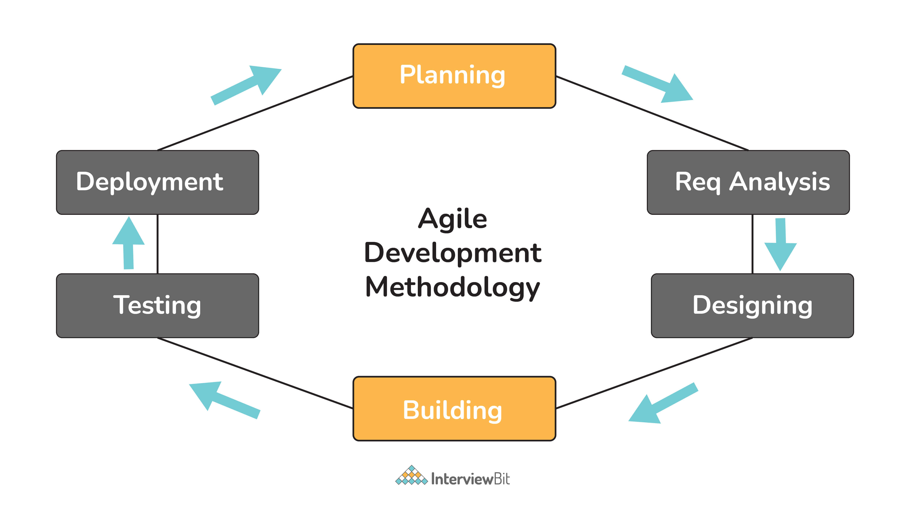
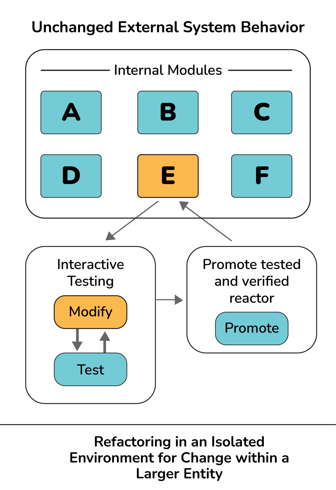
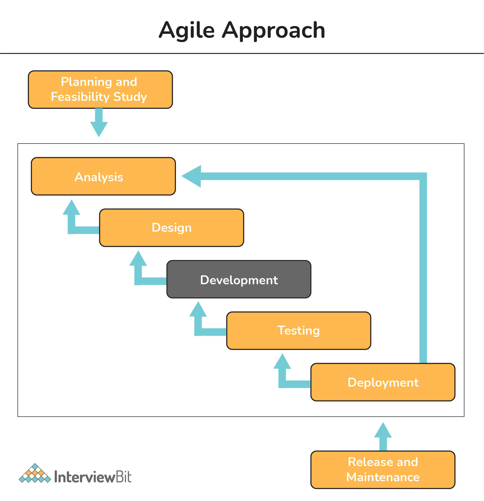

# Câu hỏi phỏng vấn Agile

Phương pháp Agile, đúng như tên gọi, là một tập hợp các phương thức và cách thực hiện trong phát triển phần mềm và quản lí dự án mà ở đó lấy khách hàng làm trung tâm trong một chu kỳ phát triển ngắn gọi là *nước rút* (sprints). Đây là một cách tiếp cận lặp đi lặp lại với mỗi lần lặp lại có được thiết kế đặc biệt để chia nhỏ qia dễ quản lý để có thể phân phối trong một khoảng thời gian cụ thể.

Phương pháp Agile đáp ứng các yêu cầu thay đổi theo thời gian và khuyến khích phản hồi liên tục từ người dùng. Đây là cách tiếp cận phổ biến nhất bởi vì trong quá trình này, khách hàng cũng tham gia để họ có thể nhận được thông tin cập nhật về sản phẩm của mình và cũng đảm bảo liệu chúng có đáp ứng yêu cầu của họ hay không. 

## Câu hỏi phỏng vấn cho Fresher

### 1. Các kiểu trong phương pháp Agile

Các loại phương pháp hoặc framework Agile khác nhau được sử dụng rộng rãi trên thế giới để phát triển phần mềm và dự án được liệt kê dưới đây:

- **Scrum**: được dùng cho thiết lập các giả định, kiểm tra chúng, phản ánh trải nghiệm và cũng có thể thực hiện các điều chỉnh. Nó phuộc nhiều vào phản hồi, tự quản lý, các team nhỏ và công việc được chia ra thành các sprints. Nó dựa trên phát triển từng phần.
- **FDD (Phát triển theo hướng tính năng)**: Nó thường liên quan đến việc tạo các mô hình phần mềm hai tuần một lần và cũng cần phát triển và thiết kế cho mỗi và mọi tính năng của mô hình. Về cơ bản, nó là một quá trình phát triển phần mềm lặp đi lặp lại và gia tăng nhẹ với mục đích chính là cung cấp phần mềm ổn định và hoạt động đúng thời hạn.
- **Lean Software Development:** Về cơ bản, nó là một cách giảm thiểu lãng phí và tối đa hóa giá trị. Nó tập trung hơn vào hiệu quả của quy trình để đạt được kết quả tối ưu về giá trị khách hàng. Nó hoàn toàn dựa trên hai nguyên tắc chỉ đạo, đó là tôn trọng con người và cải tiến liên tục.
- **XP (Extreme Programming):** Mục đích chính của nó là tạo ra phần mềm chất lượng cao hơn và chất lượng cuộc sống cao hơn cho nhóm phát triển. Nó được coi là có rủi ro thấp, linh hoạt và là một cách để phát triển phần mềm và đảm bảo rằng khách hàng nhận được những gì họ yêu cầu. Theo phương pháp luận này, phần mềm được thử nghiệm ngay từ ngày đầu tiên, thu thập thông tin phản hồi để cải thiện quá trình phát triển.
- **DSDM (Phương pháp Phát triển Phần mềm Động):** Nó thường tập trung vào toàn bộ vòng đời của dự án và mục đích chính là đảm bảo quản trị tốt làm nền tảng cho việc quản lý dự án. Nó hướng đến người dùng và tin rằng các sửa đổi đối với dự án luôn được mong đợi. Nó cũng cung cấp một lộ trình đầy đủ để cung cấp sản phẩm đúng thời hạn và trong phạm vi ngân sách.
- **ASD (Phát triển hệ thống thích ứng):** Nó thể hiện ý tưởng rằng các dự án phải luôn ở trạng thái thích ứng liên tục và có chu kỳ gồm ba chuỗi lặp lại, tức là suy đoán, cộng tác và học hỏi.
- **Crystal Methodology:** Nó chủ yếu tập trung vào các cá nhân và sự tương tác của họ hơn là các quá trình. Nó được coi là một trong những cách tiếp cận nhẹ và linh hoạt nhất để phát triển phần mềm. Nó là một nhóm các phương pháp linh hoạt bao gồm các biến thể khác nhau như pha lê trong, vàng pha lê, cam pha lê và đỏ pha lê.
- **Kanban:** Các dự án Kanban thường được quản lý thông qua một bảng hoặc bảng (Kanban Board). Bảng Kanban này là một công cụ giúp các thành viên trong nhóm theo dõi quy trình làm việc để đo lường tiến độ của nó và bao gồm tất cả thông tin cần thiết để thực hiện trên sản phẩm ở mỗi giai đoạn cùng với lộ trình hoàn thành của nó. Mục đích chính của nó là tính linh hoạt trong quản lý nhiệm vụ, cải tiến liên tục và nâng cao quy trình làm việc.

### 2. Ưu nhược điểm của quy trình Agile 

#### Ưu điểm

- Thích ứng tốt với các yêu cầu thay đổi
- Trò chuyện trực tiếp với các thành viên trong nhóm và khách hàng
- Tập trung vào sự xuất sắc về kỹ thuật và thiết kế tốt
- Phát triển nhanh và liên tục
- Cho phép cộng tác và tương tác giữa khách hàng và nhóm dự án
- Đảm bảo và thúc đẩy sự hài lòng của khách hàng
- Phản hồi nhanh hơn từ khách hàng hoặc người dùng cuối
- Nhận dạng nhanh chóng và loại bỏ các lỗi được tìm thấy trong mã
- Phân chia dự án nhanh thành các lần chạy nước rút hoặc lặp lại, tức là các giai đoạn ngắn và có thể lặp lại thường dài từ 1 đến 4 tuần
- Giao sản phẩm nhanh chóng
- Dễ dàng quản lý với tính linh hoạt hơn
- Mục tiêu cuối cùng có thể không xác định: Agile có lợi cho các dự án mà mục tiêu không được xác định và khi dự án tiến triển, mục tiêu trở nên rõ ràng hơn

#### Nhược điểm

- Thiếu tài liệu chính thức và thiết kế
- Khó ước tính nhu cầu tài nguyên và nỗ lực
- Không tốt cho các dự án phát triển nhỏ
- Tốn kém so với các phương pháp phát triển khác
- Yêu cầu nhiều thời gian và năng lượng hơn từ mọi người
- Rủi ro của dự án lâu dài
- Khó mở rộng các dự án lớn
- Khó khăn trong việc kiểm tra và thi công thử nghiệm.

### 3. Giải thích về Agile Testing ? Các nguyên tắc trong Agile Testing ?

Agile testing, đúng như tên gọi là quá trình kiểm thử phần mềm nơi phần mềm được kiểm tra để phát hiện ra lỗi hay bất cứ vấn đề nào khác. Nó được xem như là phần quan trọng nhất của quá trình phát triển vì nó cho phép tester và dev làm việc cùng nhau như một nhóm để từ đó cải thiện hiệu suất tổng thể. Nó còn giúp đảm bảo cung cấp thành công các sản phẩm chất lượng cao. Kiểm thử thường được thực hiện để tester xác định và sớm giải quyết các vấn đề tại mọi thời điểm trong quá trình phát triển.

#### Các nguyên tắc của Agile Testing

Có 8 nguyên tắc chính:
- **Continuous Testing**: kiểm thử nên được tiến hành liên tục bởi team Agile để đảm bảo quá trình phát triển liên tục.
- **Continuous Feedback**: quy trình này khuyến khích lấy phản hồi từ khách hàng để đảm bảo rằng sản phẩm đáp ứng các yêu cầu của khách hàng.
- **Team Work or Collective Work**: không chỉ tester mà dev cũng có thể thực hiện kiểm thử phần mềm.
- **Clean code**: chất lượng của phần mềm được duy trì khi nhóm kiểm thử phần mềm đảm bảo rằng code đã clean, đơn giản và chặt chẽ. Tất cả các lỗi và khuyết điểm được tìm thấy trong giai đoạn thử nghiệm đều được team Agile khắc phục nhanh chóng trong cùng một lần lặp.
- **Less Documentation**: quá trình này thường liên quan đến việc sử dụng checklist có thể tái sử dụng thay vì các tài liệu dài dòng. 
- **Test-Driven**: trong các phương pháp thông thường khác, kiểm thử chỉ được thực hiện sau khi hoàn thành nhưng trong agile, kiểm thử được thực hiện trong quá trình thực hiện để các lỗi hoặc bất kỳ vấn đề nào có thể bị loại bỏ đúng thời hạn.
- **Customer Satisfaction**: trong quá trình kiểm thử, tiến độ phát triển được hiển thị cho khách hàng để họ có thể xem và cập nhật các yêu cầu của mình. Điều này được thực hiện để đảm bảo sự hài lòng của khách hàng. 

### 4. Những phẩm chất mà Agile Tester cần phải có ?

Có một số phẩm chất mà một Agile Tester nên có. Một số trong số đó được liệt kê dưới đây:

- Thái độ tích cực và khả năng giải quyết vấn đề.
- Tập trung vào mục tiêu.
- Kỹ năng giao tiếp tuyệt vời.
- Hiểu và đáp ứng các yêu cầu của khách hàng.
- Kiến thức cơ bản về quy trình Agile và các nguyên tắc của nó.
- Tư duy phản biện và sáng tạo.
- Chia sẻ ý tưởng một cách hiệu quả.
- Lập kế hoạch và ưu tiên công việc trên cơ sở các yêu cầu.
- Bắt kịp với sự thay đổi.

### 5. Tái cấu trúc có nghĩa là gì ? 

Tái cấu trúc cơ bản là hoạt động liên quán đến thay đổi hoặc chỉnh sửa cấu trúc bên trong phần mềm mà không ảnh hưởng đến các hành vi hay chức năng bên ngoài của nó. Trong đó, các dev thực hiện một số thay đổi code để nâng cấp và cải thiện cấu trúc bên trong phần mềm. Một trong những kỹ thuật tái cấu trúc phổ biến nhất trong Agile là Red-Green. Quá trình tái cấu trúc làm cho code dễ đọc, dễ hiểu và clean hơn. Thói quen tái cấu trúc liên tục giúp việc mở rộng và bảo trì code dễ dàng hơn. 

### 6. Khác biệt giữa sprint backlog và product backlog ?

- **Sprint Backlog**: nó thường thuộc sở hữu bởi team dev. Nó chỉ chứa những tính năng và yêu cầu liên quan đến sprint cụ thể mà thôi. Nó được coi là một tập hợp con của product backlog. Nó được tổng hợp tất cả mọi thứ cần phải làm để hoàn thành một sprint cụ thể. Nó chỉ bao gồm các hạng mục có thể được hoàn thành trong mỗi lần sprint. Nó chỉ dành riêng cho mục tiêu sprint trong một sprint cụ thể.
- **Product Backlog**: nó thường thuộc sở hữu của chủ dự án. Nó chứa mọi tính năng cũng như các yêu cầu của sản phẩm. Nó được tổng hơp tất cả mọi thứ phải được thực hiện để hoàn thành toàn bộ quá trình. Nó chia nhỏ mọi mục thành một loạt các bước. Nó cụ thể hơn cho mục tiêu cuối cùng của sản phẩm. 

### 7. Spike và Zero Sprint trong Agile là gì?

**Spike**: thường được tạo ra để giải quyết các vấn đề kỹ thuật và thiết kế trong dự án.

**Zero Sprint**: thường đề cập đến bước đầu tiên hoặc bước chuẩn bị cho bước đầu tiên. Nó bao gồm tất cả hoạt động như thiết lập mỗi trường, chuẩn bị backlog,...

### 8. Sự khác biệt giữa phương pháp Agile và phương pháp Truyền thống trong Phát triển phần mềm là gì?

**Phát triển phần mềm truyền thống**: Đây là một cách tiếp cận tuyến tính được sử dụng để thiết kế phần mềm đơn giản. Trong phương pháp này, tất cả các giai đoạn của quá trình thường xảy ra theo trình tự. Nó phù hợp hơn cho các dự án mà khả năng thay đổi không đáng kể theo thời gian.

**Phát triển phần mềm Agile**: Đây là một cách tiếp cận lặp đi lặp lại được sử dụng để thiết kế phần mềm phức tạp. Trong phương pháp này, các nhóm dự án được phép linh hoạt hơn và đảm bảo rằng nhóm cuối cùng hoàn thành các yêu cầu của khách hàng. Nó phát triển các sản phẩm lấy khách hàng làm trung tâm và cung cấp trong thời gian ngắn hơn.

| Agile Software Development | Traditional Software Development |
|----------------------------|----------------------------------|
| Cách tiếp cận này tập trung hơn vào làm việc nhóm, tính linh hoạt, sự hợp tác của khách hàng và các tính năng. | Cách tiếp cận này tập trung hơn vào việc lập kế hoạch trước và coi trọng các yếu tố như chi phí, phạm vi và thời gian. |
| Kiểm thử thường được thực hiện song song với hoạt động phát triển. | Kiểm tra thường được thực hiện vào cuối hoạt động phát triển. |
| Kiểm thử được thực hiện trên các tính năng nhỏ | Kiểm thử được thực hiện trên toàn bộ ứng dụng. |
| Nó liên hệ đến các bên liên quan khác nhau bao gồm cả khách hàng trong quá trình phát triển. | Nó không liên hệ đến tất cả các bên liên quan trong quá trình phát triển. |
| Tester và dev làm việc cùng nhau để đạt được mục tiêu. | Tester và dev làm việc riêng rẽ. |
| Cộng tác với khách hàng từng bước trong suốt quá trình. | Chỉ cộng tác với khách hàng ở giai đoạn yêu cầu. |
| Các quy trình Agile tập trung hơn và linh hoạt hơn so với các quy trình truyền thống. | Kém linh hoạt hơn so với quy trình Agile. |
| Phù hợp cho các dự án lớn và phức tạp. | Phù hợp cho các dự án nhỏ và đơn giản. |

### 9. Bạn hiểu thuật ngữ “vận tốc” trong Agile nghĩa là gì?

Về cơ bản, vận tốc là một đơn vị đo lường để tính toán mức độ công việc mà một team dev agile có thể hoàn thành trong một lần sprint và lượng thời gian cần thiết để hoàn thành một dự án. Nó được sử dụng rộng rãi như một công cụ hiệu chuẩn giúp các nhóm phát triển tạo ra các mốc thời gian chính xác và hiệu quả. Nó cũng được sử dụng để xác định các vấn đề và tính toán các cải tiến xảy ra theo thời gian.

### 10. Daily Stand-Up nghĩa là gì ?

Cuộc họp độc lập hàng ngày là cuộc họp hàng ngày giữa tất cả các thành viên của nhóm agile. Mục đích chính của nó là để biết tiến độ và hiệu suất hiện tại của mọi thành viên trong nhóm làm việc trên các nhiệm vụ Scrum. Các cuộc họp diễn ra chủ yếu vào buổi sáng và thường có sự tham gia của chủ sở hữu sản phẩm, nhà phát triển và các chuyên gia về quy trình.

Cuộc họp này thường diễn ra vì những lý do sau:

- Để biết những gì đã được thực hiện ngày hôm qua và kế hoạch cho ngày hôm nay là gì.
- Để hiểu rõ hơn về các mục tiêu.
- Để đảm bảo rằng mọi thành viên trong nhóm đều làm việc hướng tới cùng một mục tiêu.
- Tập trung các vấn đề của các thành viên trong nhóm để các vấn đề có thể được giải quyết nhanh chóng.
- Để giúp mọi người cập nhật thông tin và giúp nhóm luôn có tổ chức.

### 11. Phát triển tăng dần và lặp lại

* **Iterative Development**: cơ bản là quá trình phát triển phần mềm nơi phần mềm được phát triển theo chu kỳ (sprint và release) được lặp đi lặp lại đến khi sản phẩm cuối cùng hoàn thiện. Trên cơ sở phản hồi của khách hàng hay người dùng, sản phẩm lại được phát triển theo chu kỳ hoặc sprint và release, tức là thêm chức năng mới theo cách lặp đi lặp lại. 

* **Incremental Development**: nó là quá trình phát triển phần mềm nơi công việc phát triển được chia thành từng phần nhỏ. Ở đó, phần mềm được phát triển và phân phối theo từng phần và mỗi phần có một bộ chức năng hoàn chỉnh. Các phần nhỏ hoặc lớn đều được code và thử nghiệm đầy đủ. Sau khi thử nghiệm từng phần, tất cả chúng đều được tích hợp để hoạt động như một tổng thể. 

### 12. Lộ trình sản phẩm là gì ?

Đúng như tên gọi, nó là một công cụ mạnh mẽ mô tả cách mà sản phẩm phát triển theo thời gian. Nó là một cái nhìn tổng thể các tính năng của phần mềm để tạo ra sản phẩm. Nó chỉ ra cách phát triển từng phần, mục tiêu sản phẩm cần đạt, các vấn đề cần giải quyết,... Một lộ trình sản phẩm được sở hữu bởi người quản lý. Nó còn khuyến khích team dev làm việc cùng nhau để đạt được mục tiêu cho cung cấp sản phẩm thành công. 

### 13.Các công cụ quản lý dự án khác nhau được sử dụng phổ biến trong Agile là gì ?

Các công cụ quản lý dự án được dùng trong Agile:

- Icescrum 
- Rally Software 
- Agilent 
- Version One 
- Agilo 
- X-planner 