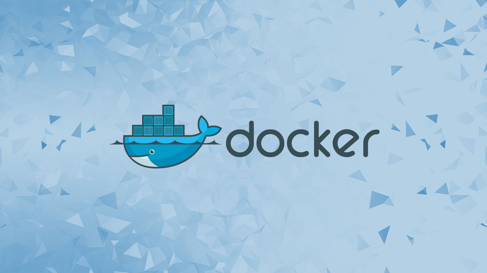
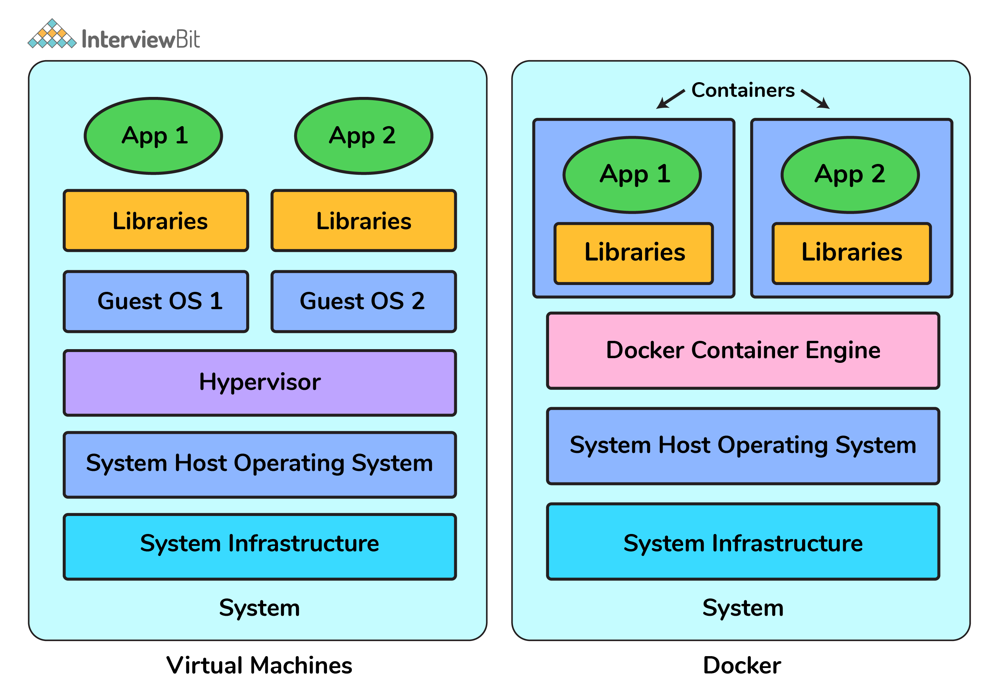
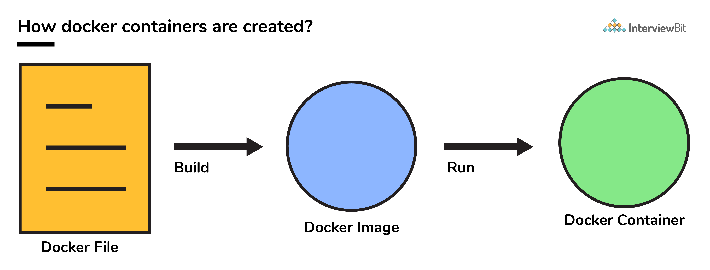
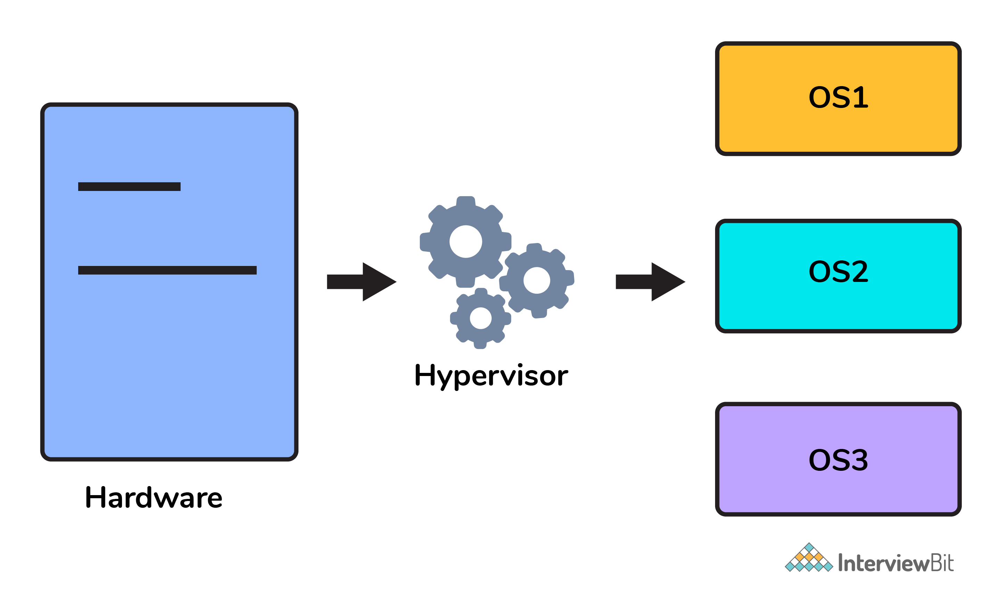
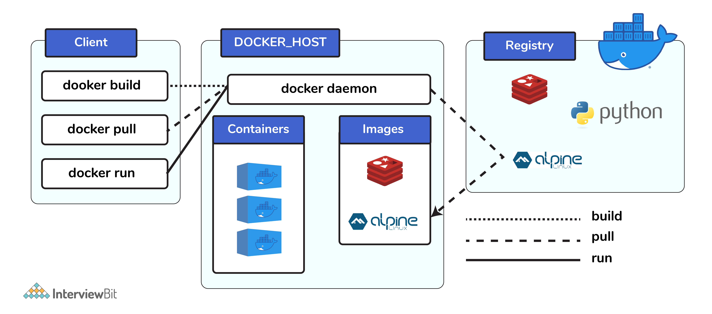
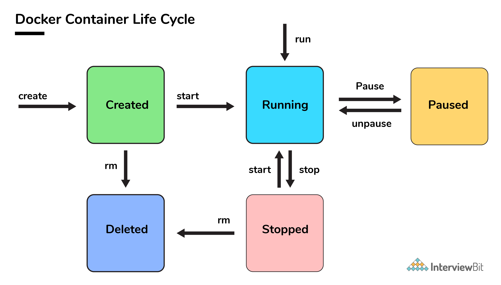

# Câu hỏi phỏng vấn Docker



## Giới thiệu Docker

Docker là một nền tảng mã nguồn mở rất phổ biến và mạnh mẽ được sử dụng để xây dựng, triển khai và chạy các ứng dụng. Docker cho phép bạn tách ứng dụng/phần mềm khỏi cơ sở hạ tầng bên dưới.

## Container là gì?

Container là một đơn vị tiêu chuẩn của phần mềm đi kèm với các phần phụ thuộc để các ứng dụng có thể được triển khai nhanh chóng và đáng tin cậy trên các nền tảng tính toán khác nhau.

Docker có thể được hình dung như một con tàu lớn (docker) chở những thùng sản phẩm (container) khổng lồ.

Docker container không yêu cầu cài đặt một hệ điều hành riêng biệt. Docker chỉ dựa vào hoặc sử dụng các tài nguyên của nhân và chức năng của nó để phân bổ chúng cho CPU và bộ nhớ, nó dựa vào chức năng của nhân và sử dụng cách ly tài nguyên cho CPU và bộ nhớ, đồng thời các namespace riêng biệt để tách biệt chế độ xem của ứng dụng đối với OS (hệ điều hành ).



## Tại sao học Docker

Phát triển ứng dụng không chỉ đơn thuần là viết code! Chúng liên quan đến rất nhiều việc hậu trường như sử dụng nhiều framework và kiến ​​trúc cho mọi giai đoạn trong vòng đời của nó, điều này làm cho quá trình trở nên phức tạp và đầy thử thách. Sử dụng bản chất của container hóa giúp các nhà phát triển đơn giản hóa và tăng tốc hiệu quả quy trình làm việc của ứng dụng, đồng thời cho phép họ tự do phát triển bằng cách sử dụng lựa chọn công nghệ và môi trường phát triển của riêng họ.

- Tất cả những khía cạnh này tạo thành phần cốt lõi của DevOps, điều này càng trở nên quan trọng hơn đối với bất kỳ nhà phát triển nào cũng cần biết những điều này để cải thiện năng suất, thúc đẩy sự phát triển nhanh chóng cùng với việc ghi nhớ các yếu tố về khả năng mở rộng ứng dụng và quản lý tài nguyên hiệu quả hơn.
- Hãy tưởng tượng container như một hộp rất nhẹ được cài đặt sẵn với tất cả các package, phần phụ thuộc, phần mềm theo yêu cầu của ứng dụng của bạn, chỉ cần triển khai production với những thay đổi cấu hình tối thiểu.
- Rất nhiều tổ chức như PayPal, Spotify, Uber, v.v. sử dụng Docker để đơn giản hóa các hoạt động và đưa cơ sở hạ tầng và bảo mật đến gần hơn để tạo ra các ứng dụng an toàn hơn.
- Mang tính di động, Container có thể được triển khai trên nhiều nền tảng như máy ảo, nền tảng Kubernetes, v.v. theo yêu cầu của quy mô hoặc nền tảng mong muốn.

## Mục lục

[1. Giải thích về container trong Docker?](#1-gi%E1%BA%A3i-th%C3%ADch-v%E1%BB%81-container-trong-docker)

[2. Docker image là gì?](#2-docker-image-l%C3%A0-g%C3%AC)

[3. DockerFile là gì?](#3-dockerfile-l%C3%A0-g%C3%AC)

[4. Chức năng của hypervisor là gì?](#4-ch%E1%BB%A9c-n%C4%83ng-c%E1%BB%A7a-hypervisor-l%C3%A0-g%C3%AC)

[5. Docker compose là gì?](#5-docker-compose-l%C3%A0-g%C3%AC)

[6. Docker namespace là gì?](#6-docker-namespace-l%C3%A0-g%C3%AC)

[7. Cách hiển thị trạng thái của tất cả docker container bằng dòng lệnh?](#7-c%C3%A1ch-hi%E1%BB%83n-th%E1%BB%8B-tr%E1%BA%A1ng-th%C3%A1i-c%E1%BB%A7a-t%E1%BA%A5t-c%E1%BA%A3-docker-container-b%E1%BA%B1ng-d%C3%B2ng-l%E1%BB%87nh)

[8. Dữ liệu được lưu trữ trong container sẽ bị mất trong những trường hợp nào?](#8-d%E1%BB%AF-li%E1%BB%87u-%C4%91%C6%B0%E1%BB%A3c-l%C6%B0u-tr%E1%BB%AF-trong-container-s%E1%BA%BD-b%E1%BB%8B-m%E1%BA%A5t-trong-nh%E1%BB%AFng-tr%C6%B0%E1%BB%9Dng-h%E1%BB%A3p-n%C3%A0o)

[9. Docker image registry?](#9-docker-image-registry)

[10. Các thành phần trong Docker?](#10-c%C3%A1c-th%C3%A0nh-ph%E1%BA%A7n-trong-docker)

[11. Docker Hub là gì?](#11-docker-hub-l%C3%A0-g%C3%AC)

[12. Lệnh để export một docket image như một archive?](#12-l%E1%BB%87nh-%C4%91%E1%BB%83-export-m%E1%BB%99t-docket-image-nh%C6%B0-m%E1%BB%99t-archive)

[13. Lệnh để import một Docker image đến một Docker host khác?](#13-l%E1%BB%87nh-%C4%91%E1%BB%83-import-m%E1%BB%99t-docker-image-%C4%91%E1%BA%BFn-m%E1%BB%99t-docker-host-kh%C3%A1c)

[14. Có thể xoá container bị tạm dừng khỏi Docker không?](#14-c%C3%B3-th%E1%BB%83-xo%C3%A1-container-b%E1%BB%8B-t%E1%BA%A1m-d%E1%BB%ABng-kh%E1%BB%8Fi-docker-kh%C3%B4ng)

[15. Lệnh kiểm tra phiên bản Docker client và server?](#15-l%E1%BB%87nh-ki%E1%BB%83m-tra-phi%C3%AAn-b%E1%BA%A3n-docker-client-v%C3%A0-server)

[16. Sự khác biệt giữa ảo hoá (virtualization) và containerization?](#16-s%E1%BB%B1-kh%C3%A1c-bi%E1%BB%87t-gi%E1%BB%AFa-%E1%BA%A3o-ho%C3%A1-virtualization-v%C3%A0-containerization)

[17. Sự khác biệt giữa lớp COPY và ADD trong Dockerfile?](#17-s%E1%BB%B1-kh%C3%A1c-bi%E1%BB%87t-gi%E1%BB%AFa-l%E1%BB%9Bp-copy-v%C3%A0-add-trong-dockerfile)

[18. Container có thể tự khởi động lại?](#18-container-c%C3%B3-th%E1%BB%83-t%E1%BB%B1-kh%E1%BB%9Fi-%C4%91%E1%BB%99ng-l%E1%BA%A1i)

[19. Sự khác biệt giữa Docker Image và Layer?](#19-s%E1%BB%B1-kh%C3%A1c-bi%E1%BB%87t-gi%E1%BB%AFa-docker-image-v%C3%A0-layer)

[20. Mục đích của tham số volume trong lệnh chạy docker là gì?](#20-m%E1%BB%A5c-%C4%91%C3%ADch-c%E1%BB%A7a-tham-s%E1%BB%91-volume-trong-l%E1%BB%87nh-ch%E1%BA%A1y-docker-l%C3%A0-g%C3%AC)

[21. Docker volume được lưu ở đâu trong docker?](#21-docker-volume-%C4%91%C6%B0%E1%BB%A3c-l%C6%B0u-%E1%BB%9F-%C4%91%C3%A2u-trong-docker)

[22. Lệnh docker info là gì?](#22-l%E1%BB%87nh-docker-info-l%C3%A0-g%C3%AC)

[23. Ý nghĩa của các lệnh up, run và start của docker compose?](#23-%C3%BD-ngh%C4%A9a-c%E1%BB%A7a-c%C3%A1c-l%E1%BB%87nh-up-run-v%C3%A0-start-c%E1%BB%A7a-docker-compose)

[24. Các yêu cầu cơ bản để Docker chạy trên mọi hệ thống?](#24-c%C3%A1c-y%C3%AAu-c%E1%BA%A7u-c%C6%A1-b%E1%BA%A3n-%C4%91%E1%BB%83-docker-ch%E1%BA%A1y-tr%C3%AAn-m%E1%BB%8Di-h%E1%BB%87-th%E1%BB%91ng)

[25. Cách đăng nhập vào docker registry?](#25-c%C3%A1ch-%C4%91%C4%83ng-nh%E1%BA%ADp-v%C3%A0o-docker-registry)

[26. Các instructions phổ biến trong Dockerfile?](#26-c%C3%A1c-instructions-ph%E1%BB%95-bi%E1%BA%BFn-trong-dockerfile)

[27. Sự khác biệt giữa Daemon Logging và Container Logging?](#27-s%E1%BB%B1-kh%C3%A1c-bi%E1%BB%87t-gi%E1%BB%AFa-daemon-logging-v%C3%A0-container-logging)

[28. Cách thiết lập giao tiếp giữa docker host và linux host?](#28-c%C3%A1ch-thi%E1%BA%BFt-l%E1%BA%ADp-giao-ti%E1%BA%BFp-gi%E1%BB%AFa-docker-host-v%C3%A0-linux-host)

[29. Cách xoá một container?](#29-c%C3%A1ch-xo%C3%A1-m%E1%BB%99t-container)

[30. Sự khác biệt giữa CMD và ENTRYPOINT?](#30-s%E1%BB%B1-kh%C3%A1c-bi%E1%BB%87t-gi%E1%BB%AFa-cmd-v%C3%A0-entrypoint)

[31. Có thể dùng JSON thay cho YAML khi phát triển docker-compose trong Docker không?](#31-c%C3%B3-th%E1%BB%83-d%C3%B9ng-json-thay-cho-yaml-khi-ph%C3%A1t-tri%E1%BB%83n-docker-compose-trong-docker-kh%C3%B4ng)

[32. Bạn có thể chạy bao nhiêu container trong docker và các yếu tố ảnh hưởng đến giới hạn này là gì?](#32-b%E1%BA%A1n-c%C3%B3-th%E1%BB%83-ch%E1%BA%A1y-bao-nhi%C3%AAu-container-trong-docker-v%C3%A0-c%C3%A1c-y%E1%BA%BFu-t%E1%BB%91-%E1%BA%A3nh-h%C6%B0%E1%BB%9Fng-%C4%91%E1%BA%BFn-gi%E1%BB%9Bi-h%E1%BA%A1n-n%C3%A0y-l%C3%A0-g%C3%AC)

[33. Vòng đời của container trong Docker?](#33-v%C3%B2ng-%C4%91%E1%BB%9Di-c%E1%BB%A7a-container-trong-docker)

[34. Làm thế nào để sử dụng docker cho nhiều môi trường ứng dụng?](#34-l%C3%A0m-th%E1%BA%BF-n%C3%A0o-%C4%91%E1%BB%83-s%E1%BB%AD-d%E1%BB%A5ng-docker-cho-nhi%E1%BB%81u-m%C3%B4i-tr%C6%B0%E1%BB%9Dng-%E1%BB%A9ng-d%E1%BB%A5ng)

[35. Làm sao đảm bảo container1 chạy trước container2 trong khi dùng docker compose?](#35-l%C3%A0m-sao-%C4%91%E1%BA%A3m-b%E1%BA%A3o-container1-ch%E1%BA%A1y-tr%C6%B0%E1%BB%9Bc-container2-trong-khi-d%C3%B9ng-docker-compose)

## Câu hỏi phỏng vấn Docker cho Fresher

### 1. Giải thích về container trong Docker?

- Nói một cách đơn giản nhất, container bao gồm các ứng dụng và tất cả các phụ thuộc của chúng.
- Chúng chia sẻ nhân và tài nguyên hệ thống với các container khác và chạy như các hệ thống biệt lập trong hệ điều hành chủ.
- Mục đích chính của container là loại bỏ sự phụ thuộc vào cơ sở hạ tầng trong khi triển khai và chạy các ứng dụng. Điều này có nghĩa là bất kỳ ứng dụng được chứa trong container nào cũng có thể chạy trên bất kỳ nền tảng nào bất kể cơ sở hạ tầng đang được sử dụng bên dưới.
- Về mặt kỹ thuật, chúng chỉ là các phiên bản runtime của docker image.

### 2. Docker image là gì?

Chúng là các gói thực thi (được đóng gói với code ứng dụng và phần phụ thuộc, gói phần mềm, v.v.) nhằm mục đích tạo container. Docker image có thể được triển khai cho bất kỳ môi trường docker nào và các container có thể được xoay ở đó để chạy ứng dụng.

### 3. DockerFile là gì?

Nó là một file văn bản có tất cả các lệnh cần được chạy để xây dựng một image nhất định.



### 4. Chức năng của hypervisor là gì?

Hypervisor là một phần mềm giúp cho quá trình ảo hóa diễn ra vì nó đôi khi được gọi là Virtual Machine Monitor. Điều này phân chia tài nguyên của hệ thống máy chủ và phân bổ chúng cho từng môi trường khách được cài đặt.



Điều này có nghĩa là nhiều hệ điều hành có thể được cài đặt trên một hệ thống máy chủ duy nhất. Hypervisor có 2 loại:

1. Native Hypervisor: Loại này còn được gọi là Bare-metal Hypervisor và chạy trực tiếp trên hệ thống máy chủ bên dưới, điều này cũng đảm bảo quyền truy cập trực tiếp vào phần cứng máy chủ, đó là lý do tại sao nó không yêu cầu hệ điều hành cơ bản.
2. Hosted Hypervisor: Loại này sử dụng hệ điều hành máy chủ cơ bản đã được cài đặt hệ điều hành hiện có.

### 5. Docker compose là gì?

Nó là một file YAML bao gồm tất cả các chi tiết liên quan đến các dịch vụ, mạng và khối lượng khác nhau cần thiết để thiết lập ứng dụng dựa trên Docker. Vì vậy, docker-compose được sử dụng để tạo nhiều container, lưu trữ chúng và thiết lập giao tiếp giữa chúng. Với mục đích giao tiếp giữa các container, các cổng được tiếp xúc bởi từng container.

### 6. Docker namespace là gì?

Namespace về cơ bản là một tính năng của Linux đảm bảo phân vùng tài nguyên hệ điều hành theo cách loại trừ lẫn nhau. Điều này hình thành khái niệm cốt lõi đằng sau quá trình container hóa khi namespace giới thiệu một lớp cách ly giữa các container. Trong docker, namespace đảm bảo rằng các container có thể di động và chúng không ảnh hưởng đến máy chủ bên dưới. Ví dụ về các loại namespace hiện đang được Docker hỗ trợ - PID, Mount, User, Network, IPC.

### 7. Cách hiển thị trạng thái của tất cả docker container bằng dòng lệnh?

```
docker ps -a
```

### 8. Dữ liệu được lưu trữ trong container sẽ bị mất trong những trường hợp nào?

Dữ liệu của container vẫn ở trong đó cho đế khi bạn xóa container.

### 9. Docker image registry?

Theo thuật ngữ đơn giản, Docker image registry là một khu vực lưu trữ các docker image. Thay vì chuyển đổi các ứng dụng thành container mỗi lần, một nhà phát triển có thể sử dụng trực tiếp các iamge được lưu trữ trong registry.
Docker image registry có thể là công khai hoặc riêng tư và DockerHub là tổ chức đăng ký công khai phổ biến và nổi tiếng nhất hiện có.

### 10. Các thành phần trong Docker?

Có 3 thành phần Docker là:

* **Docker Client:** Thành phần này sẽ thực hiện hành động "build" và "run" nhằm mục đích mở ra giao tiếp với docket host.
* **Docker Host:** Thành phần này gồm daemon chính của docker, các host container và image của chúng. Daemon thiết lập một kết nối đến docker registry.
* **Docker Registry:** Thành phần này lưu trữ docker image. Nó có thể là công khai hoặc riêng tư. Các registry công khai nổi tiếng là Docker Hub và Docker Cloud.



### 11. Docker Hub là gì?

- Là một nền tảng đám mây được cung cấp bởi Docker cho phép lưu trữ công khai image của Docker đồng thời cho phép tìm kiếm và chia sẻ với người khác.

- Image có thể được đẩy lên Docker Hub bằng câu lệnh `docker push`.

### 12. Lệnh để export một docket image như một archive?

Cú pháp đó là:

```
docker save -o <exported_name>.tar <container-name>
```

### 13. Lệnh để import một Docker image đến một Docker host khác?

```
docker load -i <export_image_name>.tar
```

### 14. Có thể xoá container bị tạm dừng khỏi Docker không?

Không thể! Container phải bị dừng trạng thái trước khi ta có thể xoá chúng.

### 15. Lệnh kiểm tra phiên bản Docker client và server?

Để kiểm tra tất cả không tin phiên bản client và server là:

```
docker version
```

Để lấy chỉ phiên bản server, ta có thể chạy:

```
docker version --format '{{.Server.Version}}'
```

### 16. Sự khác biệt giữa ảo hoá (virtualization) và containerization?

| virtualization | containerization |
|-|-|
| Nó giúp chạy nhiều hệ điều hành trên phần cứng của một server vật lý | Nó giúp triển khai nhiều ứng dụng trên cùng hệ điều hành trên một máy ảo hoặc server |
| Hypervisors cung cấp các máy ảo tổng thể cho hệ điều hành khách | Container đảm bảo cung cấp môi trường/không gian người dùng biệt lập để chạy các ứng dụng. Mọi thay đổi được thực hiện trong container không phản ánh trên server hoặc các container khác của cùng server |
| Các máy ảo này tạo thành một phần trừu tượng của lớp phần cứng hệ thống, điều này có nghĩa là mỗi máy ảo trên host hoạt động giống như một máy vật lý | Container tạo thành sự trừu tượng của lớp ứng dụng có nghĩa là mỗi container tạo thành một ứng dụng khác nhau |

### 17. Sự khác biệt giữa lớp COPY và ADD trong Dockerfile?

Cả hai có chức năng giống nhau, nhưng `COPY` được ưa thích hơn vì mức độ minh bạch cao hơn `ADD`.

`COPY` cung cấp các hỗ trợ cơ bản cho sao chép file cục bộ trong khi `ADD` cung cấp tính năng bổ sung như URL từ xa và hỗ trợ xuất `tar`.

### 18. Container có thể tự khởi động lại?

Có, chỉ có thể thực hiện được khi đang sử dụng một số chính sách do docker xác định trong khi sử dụng lệnh `run` của docker. Sau đây là các chính sách hiện có:
1. **Off**: container sẽ không được khởi động lại trong trường hợp nó bị dừng hoặc bị lỗi.
2. **Un-failure**: Ở đây, container chỉ khởi động lại khi nó gặp lỗi không liên quan đến người dùng.
3. **Unless-stop**: Sử dụng chính sách này, đảm bảo rằng container chỉ có thể khởi động lại khi người dùng thực hiện lệnh để dừng nó.
4. **Always**: Bất kể lỗi hay dừng, container luôn được khởi động lại trong loại chính sách này.

Các chính sách này có thể dùng như sau:

```
docker run -dit — restart [restart-policy-value] [container_name]
```

### 19. Sự khác biệt giữa Docker Image và Layer?

Image: được xây dựng từ một loạt các lớp instruction. Một image tương ứng với container và được sử dụng để vận hành nhanh chóng do cơ chế lưu vào bộ nhớ đệm của mỗi bước.

Layer: Mỗi layer tương ứng với một instruction của image của Dockerfile. Nói đơn giản hơn layer còn là image nhưng nó là image của instruction.

Ví dụ:

```
FROM ubuntu:18.04 
COPY . /myapp 
RUN make /myapp 
CMD python /myapp/app.py 
```

Quan trọng hơn, mỗi layer là một tập khác cảu layer trước đó.

Kết quả xây dựng file docker này là một image. Trong khi instruction hiện tại trong file thêm layer vào image.

### 20. Mục đích của tham số volume trong lệnh chạy docker là gì?

Cú pháp của lệnh chạy docker sử dụng volumn là: `docker run -v host_path:docker_path <container_name>`.

Tham số volume được dùng cho đồng bộ hoá một thư mục trong container với bất kỳ thư mục host nào. Ví dụ: `docker run -v /data/app:usr/src/app myapp`. Lệnh trên gắn thứ mục `/data/app` trong host vào thư mục `usr/src/app`. Ta có thể đồng bộ container với file dữ liệu từ host mà không cần khởi động lại.

Điều này đảm bảo rằng ngay cả khi container bị xóa, dữ liệu của container vẫn tồn tại trong vị trí host lưu trữ được ánh xạ theo volume, làm cho nó trở thành cách dễ dàng nhất để lưu trữ dữ liệu container.

### 21. Docker volume được lưu ở đâu trong docker?

Volume được tạo và quản lý bởi Docker và không thể truy cập bằng thực thể khác docker. Nó được lưu trữ trong hệ thống file host Docker ở `/var/lib/docker/volumes/`.

### 22. Lệnh docker info là gì?

Lệnh lấy thông tin chi tiết về Docker được cài đặt trên hệ thống host. Thông tin có thể giống như số lượng container hoặc image và chúng đang chạy ở trạng thái nào và các thông số kỹ thuật phần cứng như tổng bộ nhớ được cấp phát, tốc độ của bộ xử lý, phiên bản kernel,...

### 23. Ý nghĩa của các lệnh up, run và start của docker compose?

- Sử dụng lệnh `up` để duy trì docker-compose (lý tưởng là mọi lúc), chúng ta có thể khởi động hoặc khởi động lại tất cả các mạng, dịch vụ và driver được liên kết với ứng dụng được chỉ định trong file docker-compos.yml. Bây giờ, nếu chúng ta đang chạy docker-compose ở chế độ "attached" thì tất cả log từ các container sẽ có thể truy cập được đối với chúng ta. Trong trường hợp docker-compose được chạy ở chế độ "detached", thì khi các container được khởi động, nó sẽ thoát ra và không hiển thị log nào.
- Sử dụng lệnh `run`, docker-compose có thể chạy các tác vụ một lần hoặc đột xuất dựa trên các yêu cầu nghiệp vụ. Ở đây, tên dịch vụ phải được cung cấp và docker chỉ bắt đầu dịch vụ cụ thể đó và cả các dịch vụ khác mà dịch vụ đích phụ thuộc (nếu có).
  - Lệnh này hữu ích để kiểm tra container và cũng thực hiện các tác vụ như thêm hoặc xóa dữ liệu vào container,...
- Sử dụng lệnh `start`, chỉ những container đó mới có thể được khởi động lại đã được tạo và sau đó dừng lại. Điều này không hữu ích cho việc tạo các container mới của riêng nó.

### 24. Các yêu cầu cơ bản để Docker chạy trên mọi hệ thống?

Docker có thể chạy trên cả nền tảng Linux và Windows.

- Đối với nền tảng Windows, ít nhất docker cần có Windows 10 64bit với bộ nhớ RAM 2GB. Đối với các phiên bản thấp hơn, có thể cài đặt docker bằng cách sử dụng toolbox trợ giúp. Docker có thể được tải xuống từ trang web https://docs.docker.com/docker-for-windows/.
- Đối với nền tảng Linux, Docker có thể chạy trên nhiều phiên bản Linux khác nhau như Ubuntu> = 12.04, Fedora> = 19, RHEL> = 6.5, CentOS> = 6, v.v.

### 25. Cách đăng nhập vào docker registry?

Sử dụng lệnh `docker login`  để đăng nhập vào kho lưu trữ đám mây của riêng họ có thể được nhập và truy cập.

### 26. Các instructions phổ biến trong Dockerfile?

- **FROM:** dùng cho thiết lập image cơ sở cho instruction sắp tới. File docker được xem là hợp lệ nếu nó bắt đầu bằng FROM.
- **LABEL:** dùng cho tổ chức image dựa trên dự án, module hoặc license. Nó còn giúp tự động hoá như một cặp key-value cụ thể trong khi xác định label mà sau này có thể được truy cập và xử lý theo chương trình.
- **RUN:** dùng cho thực thi instruction theo sau nó trên top image hiện tại trong lớp mới. Lưu ý: mỗi lần thực thi lệnh RUN, chúng ta thêm các lớp trên image và sử dụng lớp đó cho các bước tiếp theo.
- **CMD:** dùng cho cung cấp giá trị mặc định của container thực thi. Trong trường hợp nhiều lệnh CMD, lệnh cuối cùng sẽ được xem xét.

### 27. Sự khác biệt giữa Daemon Logging và Container Logging?

Trong Docker, logging được hỗ trợ ở hai level là level Daemon và level Container.

- **Daemon**: gồm 4 kiểu level:
  + Debug có tất cả dữ liệu xuất hiện trong quá trình thực thi của tiến trình daemon.
  + Info quan tâm tất cả thông tin cùng với lỗi trong suốt quá trị thực thi tiến trình daemon.
  + Error gồm các lỗi xảy ra trong quá trình thực thi tiến trình daemon.
  + Fatal chức lỗi fatal trong quá trình thực thi tiến trình daemon.
- **Container:**
  - Level container có thể thực hiện logging bằng lệnh: `sudo docker run –it <container_name> /bin/bash`.
  - Để kiểm tra log của level container ta có thể thực hiện: `sudo docker logs <container_id>`.

### 28. Cách thiết lập giao tiếp giữa docker host và linux host?

Điều này có thể được thực hiện bởi mạng bằng cách xác định "ipconfig" trên docker host. Lệnh này đảm bảo rằng một adapter ethernet được tạo miễn là docker có mặt trong host.

### 29. Cách xoá một container?

Ta có hai bước xoá container:
1. `docker stop <container_id>`
2. `docker rm <container_id>`

### 30. Sự khác biệt giữa CMD và ENTRYPOINT?

- Lệnh CMD cung cấp các giá trị mặc định có thể thực thi cho một container đang thực thi. Trong trường hợp file thực thi phải được bỏ qua thì việc sử dụng lệnh ENTRYPOINT cùng với định dạng mảng JSON phải được kết hợp.
- ENTRYPOINT chỉ định rằng lệnh bên trong nó sẽ luôn được chạy khi container khởi động. Lệnh này cung cấp một tùy chọn để cấu hình các tham số và các file thực thi. Nếu DockerFile không có lệnh này, thì nó sẽ vẫn được kế thừa từ image cơ sở được đề cập trong lệnh FROM.
  - ENTRYPOINT được sử dụng phổ biến nhất là `/bin/sh` hoặc `/bin/bash` cho hầu hết các image cơ sở.

Thực tế, tất cả Dockerfile nên có ít nhất một trong hai lệnh.

## Câu hỏi phỏng vấn Docker cho Experienced

### 31. Có thể dùng JSON thay cho YAML khi phát triển docker-compose trong Docker không?

Có thể. Ta có thể chạy docker-compose trong json, như

```shell
docker-compose -f docker-compose.json up
```

### 32. Bạn có thể chạy bao nhiêu container trong docker và các yếu tố ảnh hưởng đến giới hạn này là gì?

Không có giới hạn xác định rõ ràng về số lượng container có thể chạy trong docker. Nhưng tất cả phụ thuộc vào những hạn chế - cụ thể hơn là những hạn chế về phần cứng. Kích thước của ứng dụng và tài nguyên CPU có sẵn là 2 yếu tố quan trọng ảnh hưởng đến giới hạn này. Trong trường hợp ứng dụng của bạn không quá lớn và bạn có tài nguyên CPU dồi dào, thì chúng ta có thể chạy một số lượng lớn các container.

### 33. Vòng đời của container trong Docker?

Các giai đoạn khác nhau của docker container từ khi bắt đầu tạo cho đến khi kết thúc được gọi là vòng đời của docker container.

Các giai đoạn quan trọng nhất là:
- **Created:** Đây là trạng thái mà container vừa được tạo mới nhưng chưa bắt đầu.
- **Running:** Trong trạng thái này, container sẽ chạy với tất cả các quy trình liên quan của nó.
- **Paused:**  Trạng thái này xảy ra khi container đang chạy bị tạm dừng.
- **Stopped:** Trạng thái này xảy ra khi container đang chạy đã bị dừng.
- **Deleted:** Trong trường hợp này, container ở trạng thái chết.



### 34. Làm thế nào để sử dụng docker cho nhiều môi trường ứng dụng?

- Tính năng docker-compose của docker sẽ hỗ trợ bạn tại đây. Trong file docker-compose, chúng ta có thể xác định nhiều dịch vụ, mạng và container cùng với ánh xạ volume một cách rõ ràng và sau đó chúng ta chỉ cần gọi lệnh `docker-compose up`.

- Khi có nhiều môi trường tham gia - đó có thể là máy chủ dev, staging, uat hoặc production, chúng ta muốn xác định các quy trình và phụ thuộc dành riêng cho server chủ để chạy ứng dụng. Trong trường hợp này, chúng ta có thể tiếp tục tạo file docker-compose theo môi trường cụ thể có tên là `docker-compos. {environment}.yml` và sau đó dựa trên môi trường, chúng ta có thể thiết lập và chạy ứng dụng.

### 35. Làm sao đảm bảo container1 chạy trước container2 trong khi dùng docker compose?

Docker-compose không đợi bất kỳ container nào "sẵn sảng" trước khi đến container kế tiếp. Để thực thi như vậy, ta có thể sử dụng:

- Bạn có thể sử dụng “depend_on” đã được thêm vào phiên bản 2 của docker-compose khi được hiển thị trong file docker-compose.yml mẫu bên dưới:

```
version: "2.4"
services:
 backend:
   build: .
   depends_on:
     - db
 db:
   image: postgres
```

