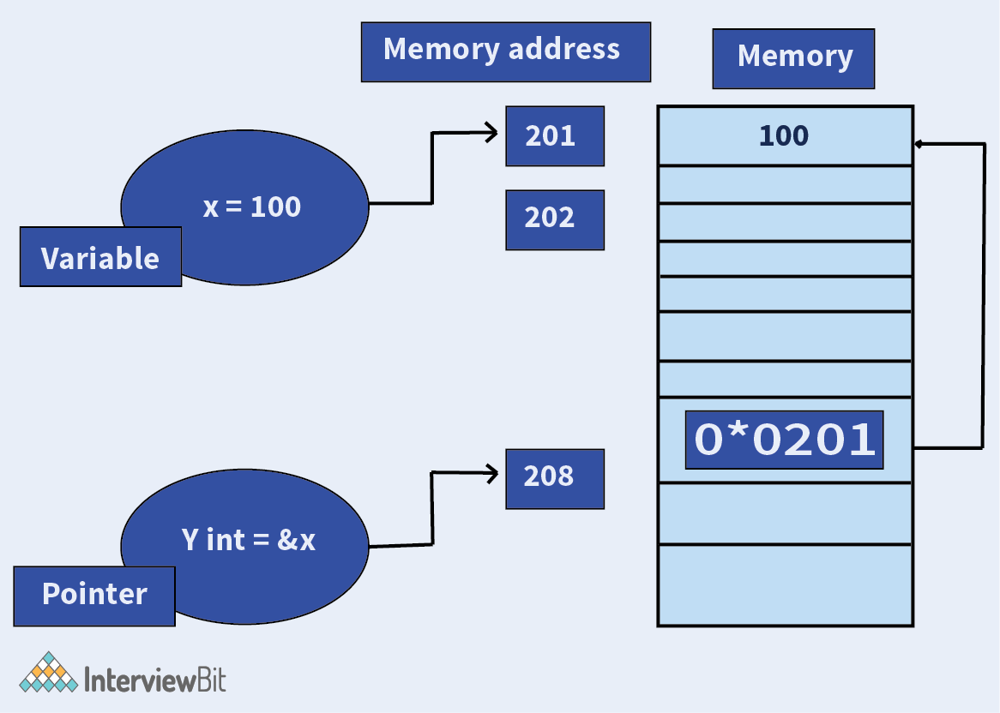
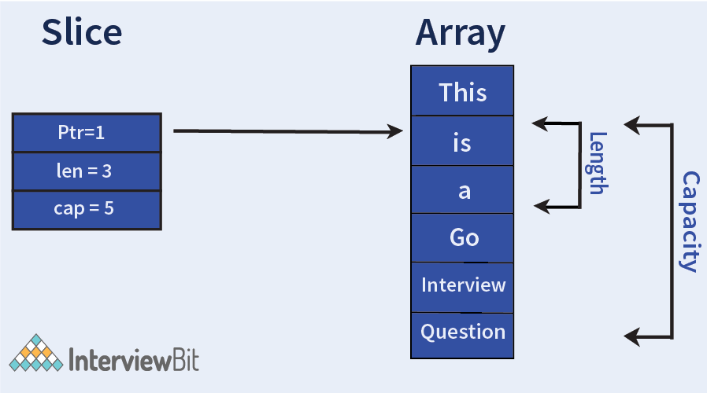
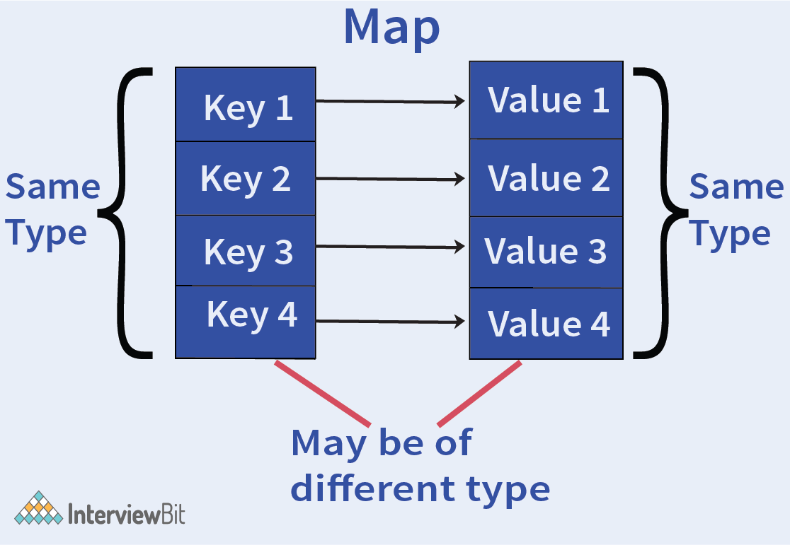

# Câu hỏi phỏng vấn Golang


## Golang là gì

Golang còn gọi là Go là một trong những ngôn ngữ trẻ nhất được phát hành vào năm 2012 bởi Google, cụ thể là bởi Robert Griesemer, Rob Pike và Ken Thompson. Người ta nói rằng Golang được sinh ra vì thất vọng với sự kém cỏi của các ngôn ngữ lập trình hiện tại.

Go là một ngôn ngữ lập trình mã nguồn mở cấp cao được phát triển chủ yếu quan tâm đến hiệu quả của code mà không ảnh hưởng đến tính đơn giản, đồng thời có thời gian biên dịch nhanh hơn để giúp phát triển các ứng dụng phần mềm với tốc độ nhanh hơn. Các công ty như Google, Apple, Uber đang sử dụng Golang do ưu điểm của nó là ít thời gian học hơn, phát triển code nhanh hơn, cải thiện hiệu quả thời gian chạy, giảm lỗi, đồng thời, chiến lược thu gom rác, v.v. 

## Câu hỏi phỏng vấn Golang cho Fresher

### 1. Golang là gì?

- Go là một ngôn ngữ lập trình đa năng, cấp cao, static typing và mạnh mẽ bằng cách cung cấp hỗ trợ cho việc thu gom rác và lập trình đồng thời.
- Trong Go, các chương trình được xây dựng bằng cách sử dụng các package (gói) giúp quản lý các phần dependencies (phụ thuộc) một cách hiệu quả. Nó cũng sử dụng mô hình compile-link để tạo các file nhị phân thực thi từ mã nguồn. 
- Go là một ngôn ngữ đơn giản với cấu trúc cú pháp thanh lịch và dễ hiểu. Nó có một tập hợp có sẵn các thư viện tiêu chuẩn mạnh mẽ giúp các nhà phát triển giải quyết vấn đề mà không cần đến các package của bên thứ ba. 
- Go có hỗ trợ first-class cho concurrency có khả năng sử dụng kiến trúc bộ xử lý đa lõi theo lợi thế của nhà phát triển và sử dụng bộ nhớ hiệu quả. Điều này giúp các ứng dụng mở rộng quy mô theo cách đơn giản hơn.

### 2. Tại sao nên học Golang?

Go tuân theo nguyên tắc phát huy tác dụng tối đa với nỗ lực tối thiểu. Mọi tính năng và cú pháp của Go đều được phát triển để giúp các lập trình viên dễ dàng sử dụng. Sau đây là những ưu điểm của Go:

#### Tiện ích
Không phải tự nhiên là Golang lại được so sánh với nhiều loại ngôn ngữ lập trình đến thế. Nó thậm chí còn không thua kém những loại ngôn ngữ kịch bản như Python nhờ khả năng đáp ứng vô vàn những nhu cầu lập trình thường thấy.

Ngôn ngữ Golang sở hữu một tính năng nổi bật và độc quyền mang tên goroutines. Goroutines tồn tại như một công cụ tích cực giúp giải quyết rất nhiều vấn đề còn tồn tại. Nó có thời gian khởi động nhanh hơn threads thông thường. Công cụ này cũng sở hữu đa kênh và có khả năng cho phép sự giao tiếp giữa các kênh này. Ngoài ra, goroutines còn có mutex locking, một tính năng cho phép khóa lại các cấu trúc dữ liệu để việc đọc và ghi nhớ không xảy ra xung đột.

#### Tốc độ
Tốc độ nhị phân của ngôn ngữ Golang đương nhiên sẽ có thể chậm hơn C++. Tuy nhiên hiệu suất làm việc giữa chúng lại không có chênh lệch nhiều. Và Golang cũng nhanh hơn các ngôn ngữ phổ biến khác như Java, Python hay Ruby… Vì thế đây được coi như một điểm cộng của Golang.

#### Linh hoạt
Không cần có sự xuất hiện bắt buộc của external dependencies, các tệp dữ liệu executable được tạo bằng toolchain của Golang vẫn có thể tự hoạt động một cách trơn tru. Toolchain của Go cho phép hỗ trợ rất nhiều hệ điều hành cũng như các loại phần cứng khác nhau và cũng được dùng như một công cụ biên dịch hệ nhị phân qua các nền tảng.

#### Tương thích
Một trong những điều kiện cần thiết ở một ngôn ngữ lập trình là sự tương thích của nó đối với những hệ thống khác nhau. Ngôn ngữ Golang có thể liên kết với thư viện C bên ngoài lẫn hệ thống native bên trong. Các liên kết được thực hiện có khả năng bổ trợ cho hiệu suất của nhau. Từ đó rút gọn thời gian phát triển phần mềm.

#### Hỗ trợ
Golang được liên kết với rất nhiều bên thứ ba khác nhau. Từ đó mang đến cho người dùng những trải nghiệm mới lạ và độc đáo. Ba nền tảng lớn nhất mà Go có cơ hội góp mặt là Linux, MacOS và Windows. Việc Toolchain của Go luôn có sẵn trong thư viện của những hệ điều hành này giúp cho những newbie triển khai chương trình Golang lần đầu tiên không còn gặp khó khăn nữa. Go cũng tích cực hỗ trợ cho các môi trường phát triển được sử dụng nhiều như Microsoft Visual Studio Code và Komodo IDE của ActiveState.

### 3. Golang package là gì?

Go Package (gọi tắt là `pkg`) là một đường dẫn đến workspace của Go bao gồm file nguồn hoặc các package khác của nó. Tất cả các phần code từ biến đến hàm được viết trong file nguồn sẽ được lưu trong package được liên kết. Tất cả file nguồn nên nằm trong một package.

Như ảnh bên dưới, ta có thể thấy Go Package được biểu diễn như một các hộp nơi chứa tất cả file nguồn Go hoặc mở rộng `.go`. Ta cũng có thể lưu package Go trong một package khác.


Package được khai báo ở đầu file với cú pháp

```go
package <package_name>
```

Và được import theo cú pháp

```go
import <package_name>
```

### 4. Golang là case sensitive hay insensitive?

Go là ngôn ngữ case-sensitive.

### 5. Go Pointer là gì?

Con trỏ (pointer) trong Go là các biến giữ địa chỉ của biến khác. Con trỏ hỗ trợ hai toán tử là:
- Toán tử `*`: còn được gọi là toán tử tham chiếu được dùng để truy cập giá trị trong địa chỉ được lưu trữ bởi con trỏ.
- Toán tử `&`: còn được gọi là toán tử địa chỉ được dùng để trả về địa chỉ của biến được lưu trữ bởi con trỏ.

Điều này được minh họa trong sơ đồ dưới đây. Ở đây, chúng ta có một biến `x` được gán cho `100`. Chúng ta lưu trữ `x` trong địa chỉ bộ nhớ `0x0201`. Bây giờ, khi chúng ta tạo một con trỏ tên `Y` cho biến `x`, chúng ta gán giá trị là `&x` để lưu trữ địa chỉ của biến `x`. Biến con trỏ được lưu trong địa chỉ `0x0208`. Bây giờ để lấy giá trị được lưu trong địa chỉ được lưu trong con trỏ, chúng ta chỉ cần viết `int z: = * Y`.



Con trỏ được dùng cho các mục đích sau:
- Cho phép hàm thay đổi trực tiếp giá trị tham số được truyền cho nó. 
- Để tăng hiệu suất trong các trường hợp cạnh khi có cấu trúc dữ liệu lớn. Sử dụng con trỏ giúp sao chép dữ liệu lớn một cách hiệu quả.
- Giúp biểu thị sự thiếu giá trị. Ví dụ: trong khi giải nén dữ liệu JSON vào một struct, sẽ rất hữu ích khi biết nếu khóa có hay không có thì khóa hiện diện với giá trị 0.

### 6. Chuỗi ký tự trong Golang?

Chuỗi ký tự là những biến lưu trữ các hằng chuỗi có thể là một ký tự đơn lẻ hoặc có thể là kết quả của việc nối một chuỗi ký tự. Go cung cấp hai loại chuỗi ký tự:
- Chuỗi ký tự thuần: Ở đây giá trị của chuỗi không bị gián đoạn giữa các dấu backqoute(`).

```go
`interview`
```

- Chuỗi ký tự thông dịch: ở đây các chuỗi ký tự được đặt trong dấu hoặc kép, giá trị có thể xuống dòng.

```go
"Interviewbit
Website"
```

### 7. Cú pháp vòng lặp for trong Golang?

Cú pháp vòng lặp for như sau:

```go
for [condition |  ( init; condition; increment ) | Range]  
{  
   statement(s);  
   //more statements
}
```

Trong đó:

- Bước `init` thực thi đầu tiên. Điều này chỉ được thực hiện một lần khi bắt đầu vòng lặp. Nhằm mục đích khai báo và khởi tạo các biến điều khiển vòng lặp. Trường này là tùy chọn nếu chúng ta đã khởi tạo các biến điều khiển vòng lặp trước đó. Ngay cả khi chúng ta không làm gì ở đây, dấu chấm phẩy vẫn cần phải hiện diện.
- Bước `condition` là để đánh giá. Nếu `condition` thoả mãn, thân vòng lặp sẽ được thực thi. Nếu `condition` không thoả mãn, vòng lặp sẽ dùng lại. Sau khi thân vòng lặp thực thi nếu điều kiện vẫn thoả mãn nó sẽ thực thi lệnh `increment` để cập nhật biến điều kiển vòng lặp. Quá trình này được tiếp tục đến khi nào `condition` trở thành false.
- Nếu `Range` được đề cập, vòng lặp sẽ thực thi với từng mục trong Range.

Ví dụ:

```go
package main

import "fmt"

func main() {
   // For loop to print numbers from 1 to 5
   for j := 1; j <= 5; j++ {
      fmt.Println(j)
   }

}
```

Kết quả:

```
1
2
3
4
5
```

### 8. Phạm vi biến trong Go?

Phạm vi biến được định nghĩa là một phần của chương trình mà biến có thể được truy cập. Mọi biến đều được xác định phạm vi tĩnh (có nghĩa là phạm vi biến có thể được xác định tại thời điểm biên dịch) trong Go có nghĩa là phạm vi được khai báo tại thời điểm biên dịch chính nó. Có hai phạm vi trong cờ vây, đó là:

- Biến cục bộ: Được khai bao trong một hàm hay khối chỉ được truy cập trong các hàm/khối đó.
- Biến toàn cục: Được khai báo bên ngoài hàm hay khối được truy cập trên toàn bộ file.

### 9. Goroutine là gì?

Goroutines là các hàm hoặc phương thức chạy đồng thời với các hàm/ phương thức khác. Goroutines có thể được coi là những luồng gọn nhẹ. Chi phí tạo một Goroutine tương đối thấp so với một luồng. Do vậy, những ứng dụng Go có hàng ngàn Goroutines chạy đồng thời là điều hết sức bình thường. Goroutines được quản lý bởi Go Runtime. 

Ta có thể bắt đầu một goroutines bắt cách chỉ định từ khoá `go` trước khi gọi hàm. Hàm sau đó sẽ được gọi và chạy như một goroutine.

```go
package main
import (
   "fmt"
   "time"
)
func main() {
   go sampleRoutine()
   fmt.Println("Started Main")
   time.Sleep(1 * time.Second)
   fmt.Println("Finished Main")
}

func sampleRoutine() {
   fmt.Println("Inside Sample Goroutine")
}
```

Trong đoạn code trên, ta thấy hàm `sampleRoutine()` được gọi bởi từ khoá `go` ở phía trước. Khi một hàm được gọi là một goroutine, nó sẽ trả về ngay lập tức dòng kế tiếp trong chương trình đó là lý do tại sao "Started Main" sẽ in đầu tiên, và goroutine sẽ được lên lịch và chạy đồng thời trong nền. Câu lệnh `sleep` đảm bảo rằng goroutine sẽ hoàn thành trước hàm main.

Kết quả chương trình:

```
Started Main
Inside Sample Goroutine
Finished Main
```

### 10. Có thể trả về nhiều giá trị từ một hàm trong Go?

Có, bằng cách phân tách các giá trị bằng dấu phẩy trong câu lênh return và gán nó cho nhiều biến như ví dụ bên dưới:

```go
package main
import (
	"fmt"
)

func reverseValues(a,b string)(string, string){
    return b,a    //notice how multiple values are returned
}

func main(){
    val1,val2:= reverseValues("interview","question")    // notice how multiple values are assigned
    fmt.Println(val1, val2)
}
```

Ở ví dụ trên, ta có hàm `reverseValues` đơn giản là đảo ngược trật tự input. Trong 
main, ta gọi hàm `reverseValues` và giá trị trả về đượC gán cho `val1` và `val2`.

Kết quả:

```
question interview
```

### 11. Có thể khai báo nhiều biến khác kiểu trong cùng một dòng không?

```go
var a,b,c= 9, 7.1, "interviewbit"
```

Có, ở trên ta gán kiểu integer, float và chuỗi cho ba biến trong cùng một dòng.

### 12. Slice trong Go là gì?

Slice là kiểu dữ liệu mô tả dãy các đối tượng cùng kiểu dữ liệu như mảng nhưng không cố định chiều dài như mảng. Slice được khai báo là `[]<kiểu dữ liệu>` nên nó như là mảng không xác định chiều dài. Thực ra mỗi khi khai báo 1 biến kiểu slice, Go sẽ tạo 1 mảng để chứa dữ liệu cho nó.

Một biến kiểu slice gồm 3 thành phần: 

- Con trỏ tham chiếu đến mảng chứa các phần tử của slice.
- Chiều dài (số phần tử).
- Sức chứa (số phần tử tối đa, là chiều dài mảng chứa các phần tử). 

Ví dụ

```go
package main
 
import "fmt"
 
func main() {
 
   // Creating an array
   arr := [6]string{"This","is", "a","Go","interview","question"}

   // Print array
   fmt.Println("Original Array:", arr)

   // Create a slice
   slicedArr := arr[1:4]

   // Display slice
   fmt.Println("Sliced Array:", slicedArr)

   // Length of slice calculated using len()
   fmt.Println("Length of the slice: %d", len(slicedArr))

   // Capacity of slice calculated using cap()
   fmt.Println("Capacity of the slice: %d", cap(slicedArr))
}
```

Ở đây ta sử dụng slice để tìm 3 phần tử tính từ phần tử thứ 2 trong mảng gốc. Sau đó ta tìm độ dài và sức chứa của slice.

Kết quả:

```
Original Array: [This is a Go interview question ]
Sliced Array: [is a Go]
Length of the slice: 3
The capacity of the slice: 5
```



### 13. Go Interface là gì?

Go interface là một tập hợp các phương thức đặc trưng xác định. Nó là kiểu tuỳ chọn cho phép nhận các giá trị có triển khai các phương thức này. Các interface là trừu tượng, đó là lý do ta không thể tạo đối tượng của nó. Nhưng ta có thể tạo biến interface sau đó gán cho một giá trị cụ thể mà các phương thức interface yêu cầu. Interface có thể hoạt động như:
1. Tập hợp phương thức đặc trưng
2. Kiểu tuỳ chọn

Chúng được tạo bằng từ khoá `type` theo sau tên của interface và cuối cùng là từ khoá `interface`. Cú pháp:

```go
type name_of_interface interface {
   // Method signatures
}
```

Interface cũng thúc đẩy tính trừu tượng. Trong Go, ta có thể dùng interface để tạo các trừu tượng chung có thể được sử dụng bằng nhiều kiểu bằng cách xác định các khai báo phương thức tương thích với interface.

```go
package main
 
import "fmt"
 
// "Triangle" data type
type Triangle struct {
	base, height float32
}
 
// "Square" data type
type Square struct {
	length float32
}
 
// "Rectangle" data type
type Rectangle struct {
	length, breadth float32
}
 
// To calculate area of triangle
func (triangle Triangle) Area() float32 {
	return 0.5 * triangle.base * triangle.height
}
 
// To calculate area of square
func (square Square) Area() float32 {
	return square.length * square.length
}
 
// To calculate area of rectangle
func (rect Rectangle) Area() float32 {
	return rect.length * rect.breadth
}
 
// Area interface for achieving abstraction
type Area interface {
	Area() float32
}
 
func main() {
	// Declare and assign values to varaibles
	triangleObject := Triangle{base: 20, height: 10}
	squareobject := Square{length: 25}
	rectObject := Rectangle{length: 15, breadth: 20}
 
	// Define a variable of type interface
	var shapeObject Area
 
	// Assign to "Triangle" type variable to the Area interface
	shapeObject = triangleObject
	fmt.Println("Triangle Area = ", shapeObject.Area())
 
	// Assign to "Square" type variable to the Area interface
	shapeObject = squareobject
	fmt.Println("Square Area = ", shapeObject.Area())
 
	// Assign to "Rectangle" type variable to the Area interface
	shapeObject = rectObject
	fmt.Println("Rectangle Area = ", shapeObject.Area())
}
```

Trong ví dụ trên, ta có 3 kiểu hình dạng là triangle, square và rectangle. Ta cũng khai báo hàm `Area()` để tính toán diện tích của các hình dựa trên input được truyền. Ta cũng khai báo interface tên `Area` để xác định phương thức đặt trưng `Area()`. Trong hàm main, ta tạo đối tương gán đối tượng với interface và tính diện tích theo phương thức được khai báo trong interface. Do đó, ta không cần biết cụ thể về hàm được gọi. Phương thức interface sẽ giải quyết vấn đề này khi xem xét kiểu đối tượng. Điều này gọi là trừu tượng.

```
Triangle Area =  100
Square Area =  625
Rectangle Area =  300
```

### 14. Golang có nhanh hơn các ngôn ngữ lập trình khác?

Golang nhanh hơn các ngôn ngữ lập trình khác vì mô hình đồng thời và quản lý bộ nhớ đơn giản và hiệu quả. Quá trình biên dịch mã máy diễn ra rất nhanh và hiệu quả. Ngoài ra, các phần phụ thuộc được liên kết với một tệp nhị phân duy nhất, do đó loại bỏ các phần phụ thuộc vào máy chủ.

### 15. Cách kiểm tra key trong Go map?

Map nói chung là một tập hợp các phần tử theo cặp key-value. Một key đề cập đến một value. Map cung cấp truy cập nhanh hơn với độ phức tạp O(1) đối với các giá trị nếu biết key. Một map được biểu diễn như hình bên dưới.



Mỗi lần giá trị được lưu trữ trong cặp key-value trong map, ta có thể truy xuất đến đối tượng bằng cách dùng `map_name[key_name]` và ta có thể kiểm tra key có tồn tại không bằng cách thực hiện như sau:

```go
if val, isExists := map_obj["foo"]; isExists {
   //do steps needed here
}
```

Từ đoạn code trên, chúng ta có thể thấy rằng hai biến đang được khởi tạo. Biến `val` sẽ nhận giá trị tương ứng với khóa "foo" từ map. Nếu không có giá trị nào, ta sẽ nhận được "giá trị không" và biến khác `isExists` sẽ nhận giá trị bool là true nếu khóa "foo" có trong map, ngược lại thì là false. Sau đó, điều kiện `isExists` được kiểm tra, nếu giá trị là true, thì phần thân của if sẽ được thực thi.

### 16. Go Channel là gì?

Go channel là một phương tiện sử dụng goroutines giao tiếp các giá trị dữ liệu với nhau. Nó là một kỹ thuật cho phép truyền dữ liệu đến các goroutines khác. Một channel có thể truyền dữ liệu cùng kiểu. Việc truyền dữ liệu trong channel là hai chiều có nghĩa là các goroutines có thể sử dụng cùng một channel để gửi hoặc nhận dữ liệu như thể hiện trong hình ảnh bên dưới:


Một channel có thể tạo với từ khoá `chan`:

```go
var channel_name chan Type
```

Nó cũng có thể tạo bằng hàm `make()`:

```go
channel_name:= make(chan Type)
```

Để gửi dữ liệu tới channel, ta có thể dùng toán tử `<-`:

```go
channel_name <- element
```

Để nhận dữ liệu ta có thể dùng cú pháp:

```go
channel_name <- element
```

## Câu hỏi phỏng vấn Golang cho Experienced

### 17. Giải thích đoạn code bên dưới?

```go
type DemoStruct struct {
   Val int
}
//A.
func demo_func() DemoStruct {
   return DemoStruct{Val: 1}
}
//B.
func demo_func() *DemoStruct {
   return &DemoStruct{}
}
//C.
func demo_func(s *DemoStruct) {
   s.Val = 1
}
```

A - Vì hàm có kiểu trả về là struct, nên hàm sẽ trả về bản sao của struct với giá trị là 1.
B - Vì hàm trả về `*DemoStruct`, là một tham chiếu đến struct, nó trả về con trỏ đến giá trị struct được tạo trong hàm.
C - Vì hàm mong đợi đối tượng struct hiện có là một tham số trong hàm, và ta đặt giá trị cho thuộc tính của nó, khi kết thúc quá trình thực hiện, giá trị của biến `Val` của đối tượng struct được đặt thành 1.

### 18. Định dạng chuỗi mà không in nó?

Ta có thể dùng hàm Sprintf như sau:

```go
return fmt.Sprintf ("Size: %d MB.", 50)
```

Hàm định dạng `fmt.Sprintf` mà không in nó ra.

### 19. Type Assertion trong Go là gì?

Type assertion nhận giá trị interface và truy xuất giá trị của kiểu dữ liệu được chỉ định rõ ràng. Cú pháp:

```go
t := i.(T)
```

Ở đây, câu lệnh khẳng định rằng giá trị interface `i` có kiểu cụ thể là `T` và gán giá trị của kiểu `T` cho biến `t`. Trong trường hợp không có kiểu cụ thể `T`, thì câu lệnh sẽ dẫn đến panic.

Để kiểm tra, nếu một interface có kiểu cụ thể, chúng ta có thể thực hiện bằng cách sử dụng hai giá trị được trả về bởi xác nhận kiểu. Một giá trị là giá trị cơ bản và giá trị kia là giá trị bool cho biết xác nhận đã hoàn thành hay chưa. Cú pháp sẽ là:

```go
t, isSuccess := i.(T)
```

Ở đây, nếu giá trị interface `i` có `T`, thì giá trị cơ bản sẽ được gán cho `t` và giá trị `isSuccess` trở thành true. Ngược lại, câu lệnh `isSuccess` sẽ false và giá trị của t sẽ có giá trị 0 tương ứng với kiểu T. Điều này đảm bảo không có panic nếu khẳng định không thành công.

### 20. Kiểm tra kiểu của biến khi đang chạy?

Trong Go, chúng ta có thể sử dụng một kiểu switch đặc biệt để kiểm tra kiểu biến khi đang chạy. Câu lệnh switch này được gọi là **type switch**.

Hãy xem xét đoạn code sau, nơi chúng ta đang kiểm tra kiểu của biến v và thực hiện một số thao tác.

```go
switch v := param.(type) { 
default:
   fmt.Printf("Unexpected type %T", v)
case uint64:
   fmt.Println("Integer type")
case string:
   fmt.Println("String type")
}
```

Trong đoạn code trên, chúng ta đang kiểm tra kiểu của biến v, nếu kiểu của biến là uint64, thì đoạn code sẽ in ""Integer type". Nếu kiểu của biến là một chuỗi, cpde sẽ in ra "String type". Nếu kiểu không khớp, default sẽ được thực thi và nó chạy các câu lệnh trong khối default.

### 21. Có nên sử dụng biến toàn cục trong các chương trình triển khai goroutines?

Việc sử dụng các biến toàn cục trong goroutines không được khuyến khích vì nó có thể được nhiều goroutines truy cập và sửa đổi đồng thời. Điều này có thể dẫn đến kết quả ngoài dự tính.

### 22. Cách sử dụng một empty struct?

Empty struct được dùng khi ta muốn tiết kiệm bộ nhớ. Điều này là do chúng không sử dụng bất kỳ bộ nhớ nào cho các giá trị. Cú pháp là:

```go
a := struct{}{}
```

Kích thước của empty struct là 0 khi sử dụng `println(unsafe.Sizeof(a))`.

Lợi ích của empty struct là cho các nhà phát triển thấy rằng chúng không có bất kỳ giá trị nào. Mục đích là thông tin thuần tuý. Một số ví dụ trong đó empty struct rất hữu ích như sau: 

- **Khi triển khai tập dữ liệu:** ta có thể dùng empty struct để triển khai một tập dữ liệu.

```go
map_obj := make(map[string]struct{})
for _, value := range []string{"interviewbit", "golang", "questions"} {
   map_obj[value] = struct{}{}
}
fmt.Println(map_obj)
```

Kết quả:

```
map[interviewbit:{} golang:{} questions:{}]
```