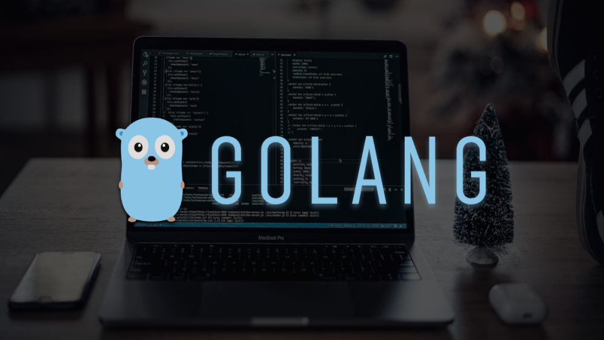
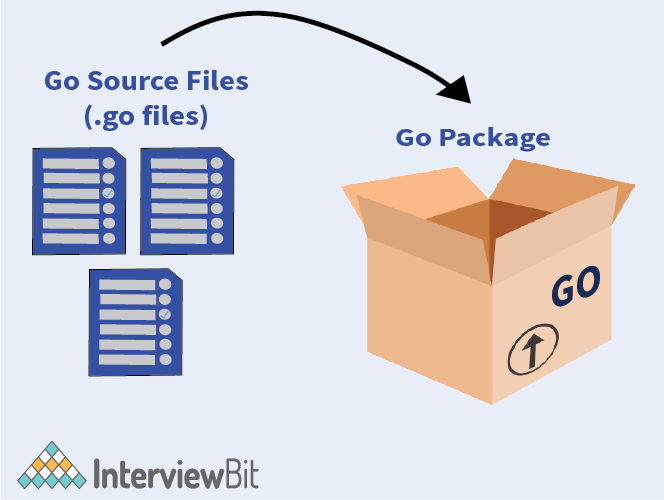

# Câu hỏi phỏng vấn Golang



## Golang là gì

Golang còn gọi là Go là một trong những ngôn ngữ trẻ nhất được phát hành vào năm 2012 bởi Google, cụ thể là bởi Robert Griesemer, Rob Pike và Ken Thompson. Người ta nói rằng Golang được sinh ra vì thất vọng với sự kém cỏi của các ngôn ngữ lập trình hiện tại.

Go là một ngôn ngữ lập trình mã nguồn mở cấp cao được phát triển chủ yếu quan tâm đến hiệu quả của code mà không ảnh hưởng đến tính đơn giản, đồng thời có thời gian biên dịch nhanh hơn để giúp phát triển các ứng dụng phần mềm với tốc độ nhanh hơn. Các công ty như Google, Apple, Uber đang sử dụng Golang do ưu điểm của nó là ít thời gian học hơn, phát triển code nhanh hơn, cải thiện hiệu quả thời gian chạy, giảm lỗi, đồng thời, chiến lược thu gom rác, v.v. 

## Câu hỏi phỏng vấn Golang cho Fresher

### 1. Golang là gì?

- Go là một ngôn ngữ lập trình đa năng, cấp cao, static typing và mạnh mẽ bằng cách cung cấp hỗ trợ cho việc thu gom rác và lập trình đồng thời.
- Trong Go, các chương trình được xây dựng bằng cách sử dụng các package (gói) giúp quản lý các phần dependencies (phụ thuộc) một cách hiệu quả. Nó cũng sử dụng mô hình compile-link để tạo các file nhị phân thực thi từ mã nguồn. 
- Go là một ngôn ngữ đơn giản với cấu trúc cú pháp thanh lịch và dễ hiểu. Nó có một bộ sưu tập tích hợp các thư viện tiêu chuẩn mạnh mẽ giúp các nhà phát triển giải quyết vấn đề mà không cần đến các package của bên thứ ba. 
- Go có hỗ trợ first-class cho concurrency có khả năng sử dụng kiến trúc bộ xử lý đa lõi theo lợi thế của nhà phát triển và sử dụng bộ nhớ hiệu quả. Điều này giúp các ứng dụng mở rộng quy mô theo cách đơn giản hơn.

### 2. Tại sao nên học Golang?

Go tuân theo nguyên tắc phát huy tác dụng tối đa với nỗ lực tối thiểu. Mọi tính năng và cú pháp của Go đều được phát triển để giúp các lập trình viên dễ dàng sử dụng. Sau đây là những ưu điểm của Go:

#### Tiện ích
Không phải tự nhiên là Golang lại được so sánh với nhiều loại ngôn ngữ lập trình đến thế. Nó thậm chí còn không thua kém những loại ngôn ngữ kịch bản như Python nhờ khả năng đáp ứng vô vàn những nhu cầu lập trình thường thấy.

Ngôn ngữ Golang sở hữu một tính năng nổi bật và độc quyền mang tên goroutines. Goroutines tồn tại như một công cụ tích cực giúp giải quyết rất nhiều vấn đề còn tồn tại. Nó có thời gian khởi động nhanh hơn threads thông thường. Công cụ này cũng sở hữu đa kênh và có khả năng cho phép sự giao tiếp giữa các kênh này. Ngoài ra, goroutines còn có mutex locking, một tính năng cho phép khóa lại các cấu trúc dữ liệu để việc đọc và ghi nhớ không xảy ra xung đột.

#### Tốc độ
Tốc độ nhị phân của ngôn ngữ Golang đương nhiên sẽ có thể chậm hơn C++. Tuy nhiên hiệu suất làm việc giữa chúng lại không có chênh lệch nhiều. Và Golang cũng nhanh hơn các ngôn ngữ phổ biến khác như Java, Python hay Ruby… Vì thế đây được coi như một điểm cộng của Golang.

#### Linh hoạt
Không cần có sự xuất hiện bắt buộc của external dependencies, các tệp dữ liệu executable được tạo bằng toolchain của Golang vẫn có thể tự hoạt động một cách trơn tru. Toolchain của Go cho phép hỗ trợ rất nhiều hệ điều hành cũng như các loại phần cứng khác nhau và cũng được dùng như một công cụ biên dịch hệ nhị phân qua các nền tảng.

#### Tương thích
Một trong những điều kiện cần thiết ở một ngôn ngữ lập trình là sự tương thích của nó đối với những hệ thống khác nhau. Ngôn ngữ Golang có thể liên kết với thư viện C bên ngoài lẫn hệ thống native bên trong. Các liên kết được thực hiện có khả năng bổ trợ cho hiệu suất của nhau. Từ đó rút gọn thời gian phát triển phần mềm.

#### Hỗ trợ
Golang được liên kết với rất nhiều bên thứ ba khác nhau. Từ đó mang đến cho người dùng những trải nghiệm mới lạ và độc đáo. Ba nền tảng lớn nhất mà Go có cơ hội góp mặt là Linux, MacOS và Windows. Việc Toolchain của Go luôn có sẵn trong thư viện của những hệ điều hành này giúp cho những newbie triển khai chương trình Golang lần đầu tiên không còn gặp khó khăn nữa. Go cũng tích cực hỗ trợ cho các môi trường phát triển được sử dụng nhiều như Microsoft Visual Studio Code và Komodo IDE của ActiveState.

### 3. Golang package là gì?

Go Package (gọi tắt là `pkg`) là một đường dẫn đến workspace của Go bao gồm file nguồn hoặc các package khác của nó. Tất cả các phần code từ biến đến hàm được viết trong file nguồn sẽ được lưu trong package được liên kết. Tất cả file nguồn nên nằm trong một package.

Như ảnh bên dưới, ta có thể thấy Go Package được biểu diễn như một các hộp nơi chứa tất cả file nguồn Go hoặc mở rộng `.go`. Ta cũng có thể lưu package Go trong một package khác.



Package được khai báo ở đầu file với cú pháp

```go
package <package_name>
```

Và được import theo cú pháp

```go
import <package_name>
```

### 4. Golang là case sensitive hay insensitive?

Go là ngôn ngữ case-sensitive.

### 5. Go Pointer là gì?

