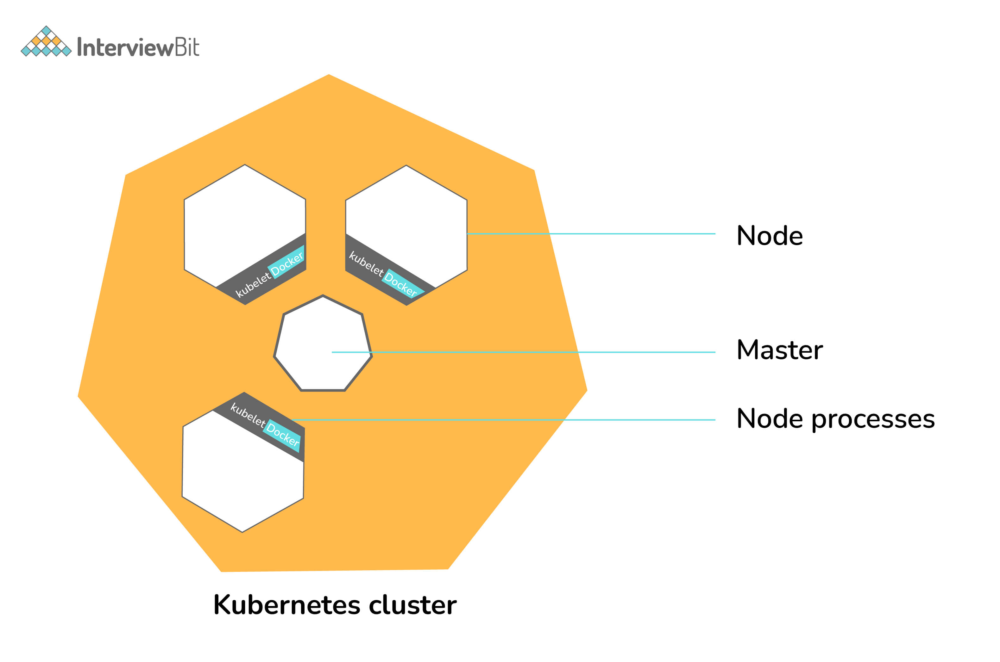
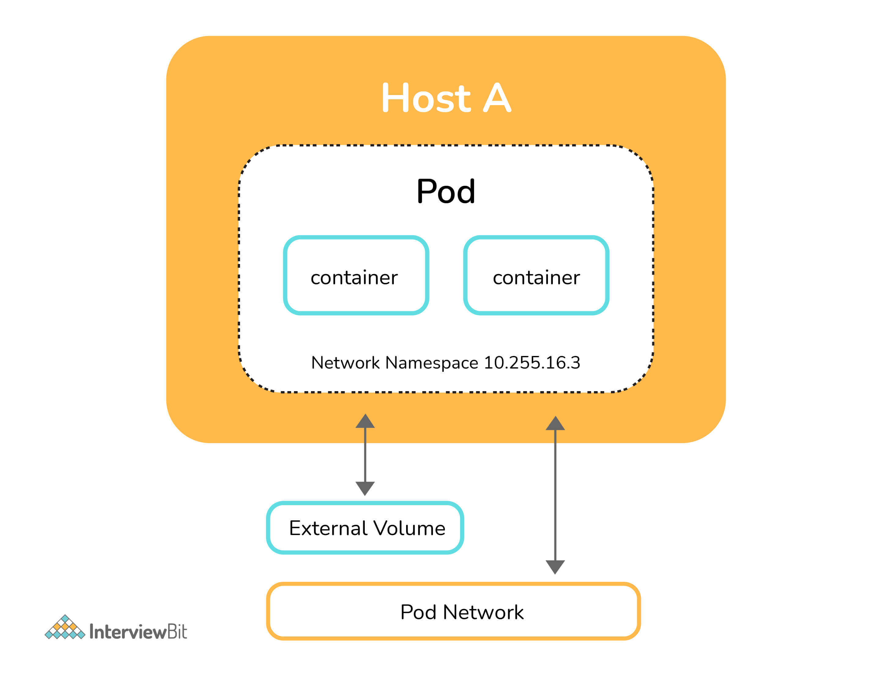
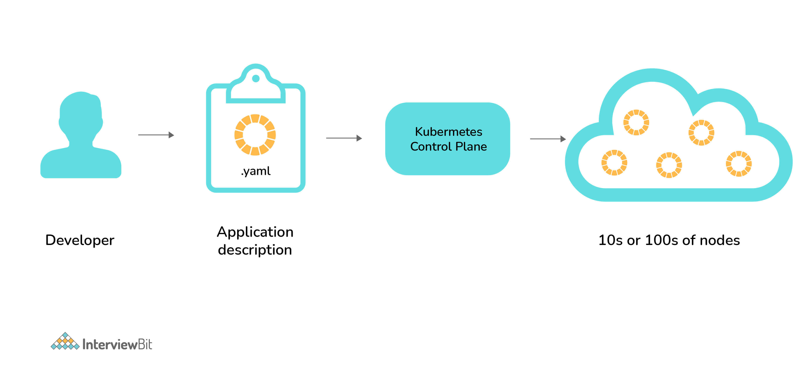
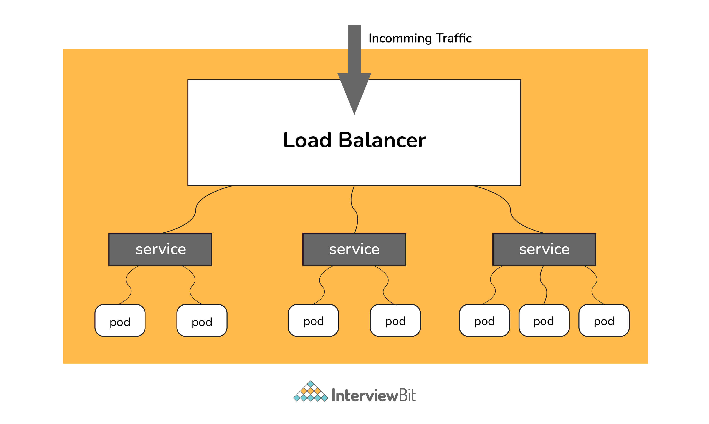

# Câu hỏi phỏng vấn Kubernetes


## Kubernetes là gì?

Kubernetes là công nghệ phân phối mã nguồn mở giúp ta lên lịch và thực thi container ứng dụng trên nhiều cụm. Kubernetes bao gồm hai kiểu tài nguyên:

**Master** => Điều phối tất cả các hoạt động trong cụm, ví dụ, => lập lịch ứng dụng, duy trì trạng thái của ứng dụng, mở rộng ứng dụng và phát hành ra các bản cập nhật mới

**Node** => Một nút là một phiên bản của hệ điều hành đóng vai trò là một worker trong cụm Kubernetes.

Ngoài ra, Node có hai thành phần:

- Kubelet => Tác nhân quản lý và giao tiếp với master
- Tool (Docker/container) => Công cụ để chạy các hoạt động container



Nó được thiết kế dựa trên cơ sở là một tập hợp các container được kết hợp lỏng lẻo, tập trung vào việc triển khai, duy trì và mở rộng khối lượng công việc. Hoạt động như một động cơ để giải quyết trạng thái bằng cách hội tụ trạng thái thực tế và trạng thái mong muốn của hệ thống (tự phục hồi). Ẩn khỏi phần cứng bên dưới của các nút và cung cấp giao diện thống nhất cho khối lượng công việc được triển khai và sử dụng nhóm tài nguyên (phần cứng) được chia sẻ để đơn giản hóa việc triển khai.

Pod là đơn vị nhỏ nhất của các đối tượng có thể được triển khai trên Kubernetes, Kubernetes đóng gói một hoặc nhiều container vào một cấu trúc cấp cao hơn được gọi là pod.

**POD** luôn chạy trên một nút nhưng chúng chia sẻ một số tài nguyên có thể là volume chung, IP duy nhất của cụm, thông tin về cách chạy từng container. Tất cả các container chứa trong pod sẽ được lập lịch trên một nút tương đương.

Các Service là cách thống nhất để truy cập khối lượng công việc trên các nhóm, Control plane là cốt lõi của Kubernetes, là một máy chủ API cho phép bạn truy vấn, thao tác trạng thái của một đối tượng trong Kubernetes.



Hình ảnh sau đây mô tả luồng công việc của Kubernetes từ cấp độ cao, trong đó file YAML dùng để mô tả ứng dụng, còn được gọi là file cấu hình hoặc thông số kỹ thuật để có thể triển khai các ứng dụng được đóng gói dưới dạng pod trong cụm hoặc nút.



## Mục lục

[1. Làm thế nào để thực hiện bảo trì trên nút K8?](#1-l%C3%A0m-th%E1%BA%BF-n%C3%A0o-%C4%91%E1%BB%83-th%E1%BB%B1c-hi%E1%BB%87n-b%E1%BA%A3o-tr%C3%AC-tr%C3%AAn-n%C3%BAt-k8)

[2. Làm cách nào để kiểm soát việc sử dụng tài nguyên của POD?](#2-l%C3%A0m-c%C3%A1ch-n%C3%A0o-%C4%91%E1%BB%83-ki%E1%BB%83m-so%C3%A1t-vi%E1%BB%87c-s%E1%BB%AD-d%E1%BB%A5ng-t%C3%A0i-nguy%C3%AAn-c%E1%BB%A7a-pod)

[3. Các dịch vụ K8 khác nhau chạy trên một nút?](#3-c%C3%A1c-d%E1%BB%8Bch-v%E1%BB%A5-k8-kh%C3%A1c-nhau-ch%E1%BA%A1y-tr%C3%AAn-m%E1%BB%99t-n%C3%BAt)

[4. PBD là gì?](#4-pbd-l%C3%A0-g%C3%AC)

[5. Init container là gì?](#5-init-container-l%C3%A0-g%C3%AC)

[6. Vai trò của cân bằng tải trong Kubernetes?](#6-vai-tr%C3%B2-c%E1%BB%A7a-c%C3%A2n-b%E1%BA%B1ng-t%E1%BA%A3i-trong-kubernetes)

[7. Các điều cần biết để bảo mật Kubernetes?](#7-c%C3%A1c-%C4%91i%E1%BB%81u-c%E1%BA%A7n-bi%E1%BA%BFt-%C4%91%E1%BB%83-b%E1%BA%A3o-m%E1%BA%ADt-kubernetes)

[8. Cách giám sát cụm Kubernetes?](#8-c%C3%A1ch-gi%C3%A1m-s%C3%A1t-c%E1%BB%A5m-kubernetes)

[9. Lấy logs trung tâm của POD?](#9-l%E1%BA%A5y-logs-trung-t%C3%A2m-c%E1%BB%A7a-pod)

[10. Làm thế nào để biến dịch vụ trong spec bên dưới thành dịch vụ bên ngoài?](#10-l%C3%A0m-th%E1%BA%BF-n%C3%A0o-%C4%91%E1%BB%83-bi%E1%BA%BFn-d%E1%BB%8Bch-v%E1%BB%A5-trong-spec-b%C3%AAn-d%C6%B0%E1%BB%9Bi-th%C3%A0nh-d%E1%BB%8Bch-v%E1%BB%A5-b%C3%AAn-ngo%C3%A0i)

[11. Hoàn thành file thông số cấu hình sau để làm cho nó Ingress?](#11-ho%C3%A0n-th%C3%A0nh-file-th%C3%B4ng-s%E1%BB%91-c%E1%BA%A5u-h%C3%ACnh-sau-%C4%91%E1%BB%83-l%C3%A0m-cho-n%C3%B3-ingress)

[12. Cấu hình TLS với Ingress?](#12-c%E1%BA%A5u-h%C3%ACnh-tls-v%E1%BB%9Bi-ingress)

[13. Có vấn đề gì khi dùng namespace mặc định?](#13-c%C3%B3-v%E1%BA%A5n-%C4%91%E1%BB%81-g%C3%AC-khi-d%C3%B9ng-namespace-m%E1%BA%B7c-%C4%91%E1%BB%8Bnh)

[14. Cho biết dịch vụ và namespace trong file sau?](#14-cho-bi%E1%BA%BFt-d%E1%BB%8Bch-v%E1%BB%A5-v%C3%A0-namespace-trong-file-sau)

[15. Operator là gì?](#15-operator-l%C3%A0-g%C3%AC)

[16. Tại sao lại cần Operator?](#16-t%E1%BA%A1i-sao-l%E1%BA%A1i-c%E1%BA%A7n-operator)

[17. GKE là gì?](#17-gke-l%C3%A0-g%C3%AC)

[18. Ingress Default Backend là gì?](#18-ingress-default-backend-l%C3%A0-g%C3%AC)

[19. Cách để chạy Kubernetes cục bộ?](#19-c%C3%A1ch-%C4%91%E1%BB%83-ch%E1%BA%A1y-kubernetes-c%E1%BB%A5c-b%E1%BB%99)

[20. Cân bằng tải với Kubernetes?](#20-c%C3%A2n-b%E1%BA%B1ng-t%E1%BA%A3i-v%E1%BB%9Bi-kubernetes)

[22. Sự khác biệt giữa Docker Swarm và Kubernetes?](#22-s%E1%BB%B1-kh%C3%A1c-bi%E1%BB%87t-gi%E1%BB%AFa-docker-swarm-v%C3%A0-kubernetes)

[23. Cách khắc phục sự cố nếu POD không lên lịch?](#23-c%C3%A1ch-kh%E1%BA%AFc-ph%E1%BB%A5c-s%E1%BB%B1-c%E1%BB%91-n%E1%BA%BFu-pod-kh%C3%B4ng-l%C3%AAn-l%E1%BB%8Bch)

[24. Cách chạy POD trên một nút cụ thể?](#24-c%C3%A1ch-ch%E1%BA%A1y-pod-tr%C3%AAn-m%E1%BB%99t-n%C3%BAt-c%E1%BB%A5-th%E1%BB%83)

[25. Các cách khác nhau để cung cấp kết nối mạng bên ngoài cho K8 là gì?](#25-c%C3%A1c-c%C3%A1ch-kh%C3%A1c-nhau-%C4%91%E1%BB%83-cung-c%E1%BA%A5p-k%E1%BA%BFt-n%E1%BB%91i-m%E1%BA%A1ng-b%C3%AAn-ngo%C3%A0i-cho-k8-l%C3%A0-g%C3%AC)

[26. Làm thế nào chúng ta có thể chuyển tiếp cổng '8080 (container) -> 8080 (service) -> 8080 (ingress) -> 80 (browser) và nó có thể được thực hiện như thế nào?](#26-l%C3%A0m-th%E1%BA%BF-n%C3%A0o-ch%C3%BAng-ta-c%C3%B3-th%E1%BB%83-chuy%E1%BB%83n-ti%E1%BA%BFp-c%E1%BB%95ng-8080-container---8080-service---8080-ingress---80-browser-v%C3%A0-n%C3%B3-c%C3%B3-th%E1%BB%83-%C4%91%C6%B0%E1%BB%A3c-th%E1%BB%B1c-hi%E1%BB%87n-nh%C6%B0-th%E1%BA%BF-n%C3%A0o)

## Câu hỏi phỏng vấn Kubernetes cho Fresher

### 1. Làm thế nào để thực hiện bảo trì trên nút K8?

Bất cứ khi nào có sẵn các bản vá bảo mật, quản trị viên Kubernetes phải thực hiện nhiệm vụ bảo trì để áp dụng bản vá bảo mật cho container đang chạy nhằm ngăn nó khỏi lỗ hổng bảo mật, đây thường là một phần không thể tránh khỏi trong quản trị. Hai lệnh sau rất hữu ích để thoát nút K8s một cách an toàn.

```
kubectl cordon
kubectl drain –ignore-daemon set
```

Lệnh đầu tiên chuyển node sang chế độ bảo trì hoặc làm cho node không khả dụng, tiếp theo là lệnh `kubectl drain` sẽ loại bỏ pod khỏi node. Sau khi lệnh thoát thành công, bạn có thể thực hiện bảo trì.

Lưu ý nếu bạn muốn thực hiện bảo trì trên một pod đơn, có thể dùng hai lệnh sau:

- `kubectl get nodes`: hiển thị tất cả node
- `kubectl drain <node name>`: thoát một node cụ thể

### 2. Làm cách nào để kiểm soát việc sử dụng tài nguyên của POD?

Ta có thể dùng limit và request:

- **Request:** Số lượng tài nguyên đang được yêu cầu cho một container. Nếu một container vượt quá yêu cầu tài nguyên của nó, nó sẽ được điều chỉnh trở lại.
- **Limit:** Giới hạn trên đối với các tài nguyên mà một container duy nhất có thể sử dụng. Nếu nó cố gắng vượt quá giới hạn được xác định trước này, nó có thể bị chấm dứt nếu K8 quyết định rằng một container khác cần những tài nguyên này. Nếu bạn nhạy cảm với việc khởi động lại pod, bạn nên đặt tổng tất cả các giới hạn tài nguyên container nhỏ hơn hoặc bằng tổng dung lượng tài nguyên cho cụm của bạn.

Ví dụ:

```
apiVersion: v1
kind: Pod
metadata:
 name: demo
spec:
 containers:
 - name: example1
 image:example/example1
 resources:
   requests:
     memory: "_Mi"
     cpu: "_m"
   limits:
     memory: "_Mi"
     cpu: "_m"
```

### 3. Các dịch vụ K8 khác nhau chạy trên một nút?

Cụm K8 bao gồm hai kiểu nút là executor node và dịch vụ master.

**Executor node:**

- Kube-proxy: dịch vụ này có trách nhiệm giao tiếp của pods trong cụm và đến bên ngoài mạng, nó chạy trên mọi nút. Dịch vụ này chịu trách nhiệm duy trì giao thức mạng khi pod của bạn thiết lập một giao tiếp mạng.

- kubelet: Mỗi nút chạy một dịch vụ kubelet để cập nhật nút đang chạy tương ứng với file cấu hình (YAML hay JSON).

*Lưu ý*: dịch vụ kubelet chỉ dành cho các container được tạo bởi Kubernetes.

**Dịch vụ master**

- Kube-apiserver: Dịch vụ master API hành động như một entry point đến cụm K8.
- Kube-scheduler: Lập lịch POD theo các tài nguyên có sẵn trên các executor node.
- Kube-controller-manager: là một vòng điều khiển theo dõi trạng thái được chia sẻ của cụm thông qua apiserver và thực hiện các thay đổi cố gắng di chuyển trạng thái hiện tại sang trạng thái ổn định mong muốn.

### 4. PBD là gì?

Quản trị viên Kubernetes có thể tạo một loại triển khai: PodDisruptBudget (PBD) để ứng dụng có tính khả dụng cao, nó đảm bảo rằng số lượng tối thiểu các pods đang chạy được thừa nhận như đã đề cập trong thuộc tính `minAvailable`. Điều này rất hữu ích khi thực hiện thoát, nơi thoát sẽ tạm dừng cho đến khi PDB được thừa nhận để đảm bảo tính sẵn sàng cao (High Availability) của ứng dụng. Spec sau đây cũng hiển thị minAvailable là 2 ngụ ý số lượng tối thiểu của một pods có sẵn (ngay cả sau cuộc bầu cử).

```
apiVersion: policy/v1beta1
kind: PodDisruptionBudget
metadata:
 name: zk-pdb
spec:
 minAvailable: 2
 selector:
   matchLabels:
     app: zookeeper
```

### 5. Init container là gì?

Init Containers là các container chạy trước khi container chính chạy với ứng dụng được container hóa của bạn. Chúng thường chứa các script thiết lập chuẩn bị môi trường cho ứng dụng được chứa trong container của bạn. Init Containers cũng đảm bảo môi trường máy chủ rộng hơn đã sẵn sàng để ứng dụng của bạn bắt đầu chạy.

### 6. Vai trò của cân bằng tải trong Kubernetes?

Load balancer (cân bằng tải) là một cách để phân phối lưu lượng trên nhiều server, nó hữu ích cho việc đảm bảo ứng dụng luôn khả dụng với người dùng.



Trong Kubernetes, như hình trên tất cả lưu lượng truy cập đến một địa chỉ IP đơn trên bộ cân bằng tải, để lộ dịch vụ của bạn với internet bên ngoài, nó định tuyến các lưu lượng truy cập đến một pod (thông qua dịch vụ) cụ thể bằng thuật toán Round-Robin. Ngay cả khi bất kỳ pod nào gặp sự cố, cân bằng tải cũng được thông báo để không chuyển lưu lượng truy cập đến nút không khả dụng đó. Do đó, bộ cân bằng tải trong Kubernetes chịu trách nhiệm phân phối một tập hợp các tác vụ (lưu lượng) đến các nhóm.

### 7. Các điều cần biết để bảo mật Kubernetes?

Mặc định, POD có thể giao tiếp với bất kỳ POD nào khác, ta có thể thiết lập chính sách mạng để giới hạn các giao tiếp đó.
- RBAC (Role-based access control) để thu hẹp các quyền.
- Dùng namespace để thiết lập ranh giới bảo mật.
- Thiết lập chính sách điều khiển quản trị để tránh chạy các container đặc quyền.
- Bật logging kiểm tra.

### 8. Cách giám sát cụm Kubernetes?

Prometheus dùng cho giám sát Kubernetes. Hệ sinh thái Prometheus bao gồm các thành phần sau:
- Server chính Prometheus nơi scrape và lưu trữ dữ liệu thời gian
- Thư viện client cho các lệnh code ứng dụng.
- Cổng push cho hỗ trợ công việc ngắn hạn.
- Exporter đặc biệt cho dịch vụ như StatsD, HAProxy, Graphite,...
- Quản lý cảnh báo để xử lý cảnh báo trên các công cụ hỗ trợ khác nhau.

### 9. Lấy logs trung tâm của POD?

Kiến trúc này phụ thuộc vào ứng dụng và nhiều yếu tố khác. Sau đây là các mẫu logging phổ biến

- Node level logging agent.
- Streaming sidecar container.
- Sidecar container với logging agent.
- Xuất trực tiếp logs từ ứng dụng.

Trong quá trình thiết lập, journalbeat và filebeat đang chạy dưới dạng daemonset. Các logs được thu thập bởi những thứ này được chuyển sang kafka, cuối cùng được chuyển vào ngăn xếp ELK.

Điều tương tự cũng có thể thực hiện được bằng cách sử dụng ngăn xếp EFK và fluentd-bit.

### 10. Làm thế nào để biến dịch vụ trong spec bên dưới thành dịch vụ bên ngoài?

```
spec:
  selector:
    app: some-app
  ports:
    - protocol: UDP
      port: 8080
      targetPort: 8080
```

Thêm LoadBalancer và nodePort như bên dưới:

```
spec:
 selector:
   app: some-app
 type: LoadBalancer
 ports:
   - protocol: UDP
     port: 8080
     targetPort: 8080
     nodePort: 32412
```

### 11. Hoàn thành file thông số cấu hình sau để làm cho nó Ingress?

```
metadata:
  name: someapp-ingress
spec:
```

Thực hiện:

```
apiVersion: networking.k8s.io/v1
kind: Ingress
metadata:
 name: someapp-ingress
spec:
 rules:
 - host: my.host
   http:
     paths:
     - backend:
         serviceName: someapp-internal-service
         servicePort: 8080
```

### 12. Cấu hình TLS với Ingress?

Thêm tls và secretName:

```
spec:
 tls:
 - hosts:
   - some_app.com
   secretName: someapp-secret-tls
```

### 13. Có vấn đề gì khi dùng namespace mặc định?

Chỉ sử dụng namespace mặc định, sẽ trở nên khó khăn theo thời gian để có được cái nhìn tổng quan về tất cả các ứng dụng bạn có thể quản lý trong cụm của mình. Namespace giúp dễ dàng tổ chức các ứng dụng thành các nhóm có ý nghĩa, chẳng hạn như namespace của tất cả các ứng dụng giám sát và namespace cho tất cả các ứng dụng bảo mật, v.v.

Namespace cũng có thể hữu ích để quản lý môi trường Blue/Green trong đó mỗi namespace có thể bao gồm một phiên bản ứng dụng khác nhau và cũng chia sẻ tài nguyên trong namespace khác (namespace như logging, giám sát, v.v.).

Một trường hợp sử dụng khác cho namespace là một cụm có nhiều nhóm. Khi nhiều đội sử dụng cùng một cụm, họ có thể dẫm chân lên nhau. Ví dụ: nếu họ kết thúc việc tạo một ứng dụng có cùng tên, điều đó có nghĩa là một trong các nhóm sẽ ghi đè ứng dụng của nhóm kia vì không thể có hai ứng dụng trong Kubernetes có cùng tên (trong cùng một namespace).

### 14. Cho biết dịch vụ và namespace trong file sau?

```
apiVersion: v1
kind: ConfigMap
metadata:
  name: some-configmap
data:
  some_url: silicon.chip
```

Trả lời - Dịch vụ là "silicon", namespace là "chip".

### 15. Operator là gì?

"Các operator là mở rộng phần mềm cho K8s sử dụng các tài nguyên tùy chỉnh để quản lý các ứng dụng và các thành phần của chúng. Các operator tuân theo các nguyên tắc Kubernetes, đặc biệt là vòng điều khiển."

### 16. Tại sao lại cần Operator?

Quá trình quản lý các ứng dụng trong Kubernetes không đơn giản như quản lý các ứng dụng không trạng thái, trong đó việc đạt được trạng thái mong muốn và nâng cấp đều được xử lý theo cùng một cách cho mọi bản sao. Trong các ứng dụng trạng thái, việc nâng cấp mỗi bản sao có thể yêu cầu xử lý khác nhau do tính chất trạng thái của ứng dụng, mỗi bản sao có thể ở một trạng thái khác nhau. Do đó, chúng tôi thường cần một operator để quản lý các ứng dụng trạng thái. Operator Kubernetes phải hỗ trợ việc này.

Điều này cũng sẽ giúp tự động hóa quy trình tiêu chuẩn trên nhiều cụm Kubernetes

### 17. GKE là gì?

GKE là Google Kubernetes Engine dùng cho quản lý và điều phối container Docker. Với sự trợ giúp của Google Public Cloud, ta còn có thể điều phối trên cụm container.

### 18. Ingress Default Backend là gì?

Nó chỉ định những gì cần làm với một yêu cầu đến cụm Kubernetes không được ánh xạ tới bất kỳ backend nào, tức là phải làm gì khi không có quy tắc nào được xác định cho yêu cầu HTTP đến. Nếu backend mặc định không được xác định, bạn nên xác định nó để người dùng vẫn thấy một số loại thông báo thay vì một lỗi không rõ ràng.

## Câu hỏi phỏng vấn Kubernetes cho Experienced

### 19. Cách để chạy Kubernetes cục bộ?

Kubernetes có thể được thiết lập cục bộ bằng cách sử dụng công cụ Minikube. Nó chạy một nhóm nút đơn trong một máy ảo trên máy tính. Do đó, nó cung cấp một cách hoàn hảo cho người dùng vừa mới học Kubernetes.

### 20. Cân bằng tải với Kubernetes?

Cân bằng tải là một trong những cách phổ biến và tiêu chuẩn để hiển thị các dịch vụ. Có hai loại cân bằng tải trong K8s và chúng là:

- **Internal load balancer** - Loại cân bằng này tự động cân bằng tải và phân bổ các pod với tải đến cần thiết.
- **External load balancer** - Loại cân bằng này hướng lưu lượng truy cập từ các tải bên ngoài đến các pod backend.

### 21. File cấu hình triển khai bên dưới nghĩa là gì?

```
spec:
  containers:
    - name: USER_PASSWORD
      valueFrom:
        secretKeyRef:
          name: some-secret
          key: password
```

*Giải thích*

Biến môi trường USER_PASSWORD sẽ lưu giá trị từ khoá mật khẩu được gọi trong "some-secret". Nói cách khác bạn tham chiếu một giá trị từ một Kubernetes Secret.

### 22. Sự khác biệt giữa Docker Swarm và Kubernetes?

- Quy trình cài đặt của K8s rất phức tạp nhưng nếu nó được cài đặt một lần thì cụm này rất mạnh mẽ. Mặt khác, quá trình cài đặt Docker Swarm rất đơn giản nhưng cụm không mạnh mẽ chút nào.
- Kubernetes có thể xử lý quy mô tự động nhưng Docker Swarm không thể xử lý tự động mở rộng các nhóm dựa trên tải đến.
- Kubernetes là một Framework đầy đủ. Vì nó duy trì trạng thái cụm ổn định hơn nên tự động thay đổi tỷ lệ không nhanh như Docker Swarm.

### 23. Cách khắc phục sự cố nếu POD không lên lịch?

Trong bộ lập lịch của K8 chịu trách nhiệm tạo các pod vào các nút. Có nhiều yếu tố có thể dẫn đến POD không thể khởi động. Phổ biến nhất là hết tài nguyên, hãy sử dụng các lệnh như `kubectl description <POD> -n <Namespace>` để xem lý do tại sao POD không được khởi động. Ngoài ra, hãy theo dõi kubectl để nhận các sự kiện để xem tất cả các sự kiện đến từ cụm.

### 24. Cách chạy POD trên một nút cụ thể?

Các cách khác nhau để làm điều đó:
- **nodeName**: chỉ định tên của nút trong cấu hình thông số POD, nó sẽ cố chạy POD trên nút đã chỉ định.
- **nodeSelector**: Gán một nhãn cụ thể cho nút có tài nguyên đặc biệt và sử dụng cùng một nhãn trong thông số POD để POD sẽ chỉ chạy trên nút đó.
- **nodeaffinities**: `WhileSchedulingIgnoredDuringExecution`, `favouriteDuringSchedulingIgnoredDuringExecution` là các yêu cầu cứng và mềm để chạy POD trên các nút cụ thể. Điều này sẽ thay thế nodeSelector trong tương lai. Nó phụ thuộc vào các nhãn nút.

### 25. Các cách khác nhau để cung cấp kết nối mạng bên ngoài cho K8 là gì?

Theo mặc định, POD sẽ có thể kết nối với mạng bên ngoài nhưng ngược lại, chúng ta cần thực hiện một số thay đổi. Các tùy chọn sau có sẵn để kết nối với POD từ thế giới bên ngoài.
- Nodeport (hiển thị cổng trên mỗi nút cho giao tiếp với chúng)
- Load balancers (Lớp L4 của giao thức TCP/IP)
- Ingress (Lớp L7 của giao thức TCP/IP)

Một phương thức khác là dùng kube-proxy để hiển thị dịch vụ với IP cụm trên cổng hệ thống cục bộ.

```
$ kubectl proxy --port=8080 
```

### 26. Làm thế nào chúng ta có thể chuyển tiếp cổng '8080 (container) -> 8080 (service) -> 8080 (ingress) -> 80 (browser) và nó có thể được thực hiện như thế nào?

Ingress đang để lộ cổng 80 ra bên ngoài để trình duyệt truy cập và kết nối với dịch vụ lắng nghe trên 8080. Theo mặc định, ingress sẽ lắng nghe trên cổng 80. "Ingress controller" là một nhóm nhận lưu lượng truy cập bên ngoài và xử lý quá trình ingress và được định cấu hình bởi tài nguyên ingress. Vì vậy, bạn cần phải cấu hình ingress selector và nếu không có 'ingress controller selector' được đề cập thì không có bộ ingress controller nào sẽ quản lý quá trình ingress.

Config ingress có thể như sau:

```
host: abc.org
http:
paths:
backend:
serviceName: abc-service
servicePort: 8080
Then the service will look like
kind: Service
apiVersion: v1
metadata:
name: abc-service
spec:
ports:
protocol: TCP
port: 8080 # port to which the service listens to
targetPort: 8080
```