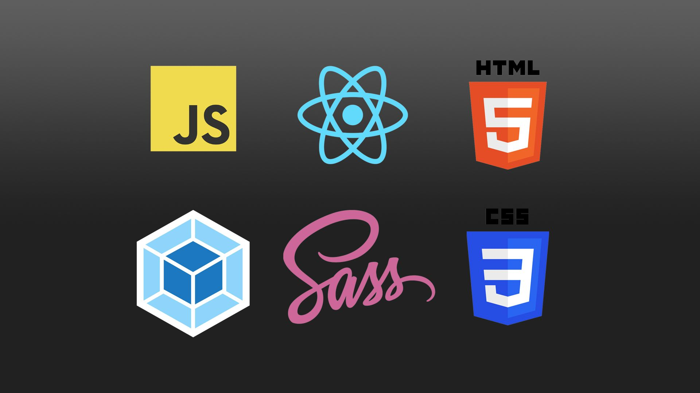

# Câu hỏi phỏng vấn Frontend

Front End (còn được biết đến như client-side) là tất cả những gì liên quan đến điều mà người dùng nhìn thấy mỗi khi truy cập vào một trang web, bao gồm phạm trù thiết kế và các ngôn ngữ như HTML hay CSS.

Người dùng tương tác trực tiếp với nhiều khía cạnh thuộc front-end như: nhận biết vị trí đặt để của logo, màu sắc chủ đạo, tìm kiếm và đọc thông tin, sử dụng các button và tính năng trên web… Mục đích cuối cùng của Front End là nhằm mang lại một giao diện bắt mắt, giúp người dùng dễ dàng thao tác và sử dụng.

## Câu hỏi phỏng vấn về Frontend

- [**HTML**](./html): 63 câu hỏi phỏng vấn HTML.
- [**CSS**](./CSS): 54 câu hỏi phỏng vấn CSS.
- [**JavaScript**](./javascript): 30 câu hỏi phỏng vấn JavaScript.
- [**ES6**](./es6): 39 câu hỏi phỏng vấn ES6.
- [**TypeScript**](./typescript): 50 câu hỏi phỏng vấn TypeScript.
- [**React**](./react): 41 câu hỏi phỏng vấn ReactJS.