# Câu hỏi phỏng vấn CSS


## CSS là gì?

CSS là chữ viết tắt của Cascading Style Sheets, nó là một ngôn ngữ được sử dụng để tìm và định dạng lại các phần tử được tạo ra bởi các ngôn ngữ đánh dấu (HTML). Nói ngắn gọn hơn là ngôn ngữ tạo phong cách cho trang web. Bạn có thể hiểu đơn giản rằng, nếu HTML đóng vai trò định dạng các phần tử trên website như việc tạo ra các đoạn văn bản, các tiêu đề, bảng,…thì CSS sẽ giúp chúng ta có thể thêm style vào các phần tử HTML đó như đổi bố cục, màu sắc trang, đổi màu chữ, font chữ, thay đổi cấu trúc…

CSS được phát triển bởi W3C (World Wide Web Consortium) vào năm 1996, vì HTML không được thiết kế để gắn thẻ để giúp định dạng trang web.

Phương thức hoạt động của CSS là nó sẽ tìm dựa vào các selector, selector có thể là tên một thẻ HTML, tên một ID, class hay nhiều kiểu khác. Sau đó là nó sẽ áp dụng các thuộc tính cần thay đổi lên vùng chọn đó.

CSS3 là bản nâng cấp mới nhất của CSS với mục đích mở rộng "CSS2.1" . CSS3 mang đến nhiều tính năng mới như bo tròn góc, tạo độ bóng, gradient, transitions hay animations cũng như các bố cục mới như multiple-column, flexbox hay grid layout.

## Mục lục

[1. Mô hình hộp trong CSS là gì? Thuộc tính CSS nào là một phần của nó?](#1-m%C3%B4-h%C3%ACnh-h%E1%BB%99p-trong-css-l%C3%A0-g%C3%AC-thu%E1%BB%99c-t%C3%ADnh-css-n%C3%A0o-l%C3%A0-m%E1%BB%99t-ph%E1%BA%A7n-c%E1%BB%A7a-n%C3%B3)

[2. Ưu điểm của CSS?](#2-%C6%B0u-%C4%91i%E1%BB%83m-c%E1%BB%A7a-css)

[3. Hạn chế của CSS?](#3-h%E1%BA%A1n-ch%E1%BA%BF-c%E1%BB%A7a-css)

[4. Làm thế nào để đưa CSS vào trang web?](#4-l%C3%A0m-th%E1%BA%BF-n%C3%A0o-%C4%91%E1%BB%83-%C4%91%C6%B0a-css-v%C3%A0o-trang-web)

[5. Các loại selector khác nhau trong CSS?](#5-c%C3%A1c-lo%E1%BA%A1i-selector-kh%C3%A1c-nhau-trong-css)

[6. CSS Preprocessor là gì? SASS vs LESS vs Stylus?](#6-css-preprocessor-l%C3%A0-g%C3%AC-sass-vs-less-vs-stylus)

[7. VH/VM trong CSS là gì?](#7-vhvm-trong-css-l%C3%A0-g%C3%AC)

[8. Sự khác biệt giữa reset và normalize CSS?](#8-s%E1%BB%B1-kh%C3%A1c-bi%E1%BB%87t-gi%E1%BB%AFa-reset-v%C3%A0-normalize-css)

[9. Sự khác biệt giữa inline, block và inline-block?](#9-s%E1%BB%B1-kh%C3%A1c-bi%E1%BB%87t-gi%E1%BB%AFa-inline-block-v%C3%A0-inline-block)

[10. Việc kiểm tra trang web trên các trình duyệt khác nhau có quan trọng không?](#10-vi%E1%BB%87c-ki%E1%BB%83m-tra-trang-web-tr%C3%AAn-c%C3%A1c-tr%C3%ACnh-duy%E1%BB%87t-kh%C3%A1c-nhau-c%C3%B3-quan-tr%E1%BB%8Dng-kh%C3%B4ng)

[11. Phần tử Pseudo và các lớp Pseudo là gì?](#11-ph%E1%BA%A7n-t%E1%BB%AD-pseudo-v%C3%A0-c%C3%A1c-l%E1%BB%9Bp-pseudo-l%C3%A0-g%C3%AC)

[12. Làm thế nào để chỉ định các đơn vị trong CSS? Những cách khác nhau để làm điều đó là gì?](#12-l%C3%A0m-th%E1%BA%BF-n%C3%A0o-%C4%91%E1%BB%83-ch%E1%BB%89-%C4%91%E1%BB%8Bnh-c%C3%A1c-%C4%91%C6%A1n-v%E1%BB%8B-trong-css-nh%E1%BB%AFng-c%C3%A1ch-kh%C3%A1c-nhau-%C4%91%E1%BB%83-l%C3%A0m-%C4%91i%E1%BB%81u-%C4%91%C3%B3-l%C3%A0-g%C3%AC)

[13. Liệu margin-top hoặc margin-bottom có ảnh hưởng đến các phần tử inline không?](#13-li%E1%BB%87u-margin-top-ho%E1%BA%B7c-margin-bottom-c%C3%B3-%E1%BA%A3nh-h%C6%B0%E1%BB%9Fng-%C4%91%E1%BA%BFn-c%C3%A1c-ph%E1%BA%A7n-t%E1%BB%AD-inline-kh%C3%B4ng)

[14. Thuộc tính nào được sử dụng để thay đổi dạng phông chữ?](#14-thu%E1%BB%99c-t%C3%ADnh-n%C3%A0o-%C4%91%C6%B0%E1%BB%A3c-s%E1%BB%AD-d%E1%BB%A5ng-%C4%91%E1%BB%83-thay-%C4%91%E1%BB%95i-d%E1%BA%A1ng-ph%C3%B4ng-ch%E1%BB%AF)

[15. Sự khác biệt giữa adaptive design và responsive design?](#15-s%E1%BB%B1-kh%C3%A1c-bi%E1%BB%87t-gi%E1%BB%AFa-adaptive-design-v%C3%A0-responsive-design)

[16. Làm thế nào để các CSS Selector ứng với các phần tử của trình duyệt?](#16-l%C3%A0m-th%E1%BA%BF-n%C3%A0o-%C4%91%E1%BB%83-c%C3%A1c-css-selector-%E1%BB%A9ng-v%E1%BB%9Bi-c%C3%A1c-ph%E1%BA%A7n-t%E1%BB%AD-c%E1%BB%A7a-tr%C3%ACnh-duy%E1%BB%87t)

[17. Border-box khác với content-box như thế nào?](#17-border-box-kh%C3%A1c-v%E1%BB%9Bi-content-box-nh%C6%B0-th%E1%BA%BF-n%C3%A0o)

[18. Opacity được quy định như thế nào trong CSS3?](#18-opacity-%C4%91%C6%B0%E1%BB%A3c-quy-%C4%91%E1%BB%8Bnh-nh%C6%B0-th%E1%BA%BF-n%C3%A0o-trong-css3)

[19. Tại sao chúng ta nên sử dụng thuộc tính float trong CSS?](#19-t%E1%BA%A1i-sao-ch%C3%BAng-ta-n%C3%AAn-s%E1%BB%AD-d%E1%BB%A5ng-thu%E1%BB%99c-t%C3%ADnh-float-trong-css)

[20. z-index là gì? Nó hoạt động như thế nào?](#20-z-index-l%C3%A0-g%C3%AC-n%C3%B3-ho%E1%BA%A1t-%C4%91%E1%BB%99ng-nh%C6%B0-th%E1%BA%BF-n%C3%A0o)

[21. Các CSS selector sau đây có nghĩa là gì?](#21-c%C3%A1c-css-selector-sau-%C4%91%C3%A2y-c%C3%B3-ngh%C4%A9a-l%C3%A0-g%C3%AC)

[22. Thuộc tính flexbox là gì?](#22-thu%E1%BB%99c-t%C3%ADnh-flexbox-l%C3%A0-g%C3%AC)

[23. Xếp tầng trong CSS là gì?](#23-x%E1%BA%BFp-t%E1%BA%A7ng-trong-css-l%C3%A0-g%C3%AC)

[24. Giải thích thuộc tính position CSS?](#24-gi%E1%BA%A3i-th%C3%ADch-thu%E1%BB%99c-t%C3%ADnh-position-css)

[25. Khi nào thì xảy ra DOM reflow?](#25-khi-n%C3%A0o-th%C3%AC-x%E1%BA%A3y-ra-dom-reflow)

[26. Sự khác biệt giữa các thuộc tính Box Sizing?](#26-s%E1%BB%B1-kh%C3%A1c-bi%E1%BB%87t-gi%E1%BB%AFa-c%C3%A1c-thu%E1%BB%99c-t%C3%ADnh-box-sizing)

[27. Làm sao để căn giữa một div trong một div khác?](#27-l%C3%A0m-sao-%C4%91%E1%BB%83-c%C4%83n-gi%E1%BB%AFa-m%E1%BB%99t-div-trong-m%E1%BB%99t-div-kh%C3%A1c)

[28. Kể tên bốn loại thuộc tính @media?](#28-k%E1%BB%83-t%C3%AAn-b%E1%BB%91n-lo%E1%BA%A1i-thu%E1%BB%99c-t%C3%ADnh-media)

[29. Hệ thống grid là gì?](#29-h%E1%BB%87-th%E1%BB%91ng-grid-l%C3%A0-g%C3%AC)

[30. Các cách để ẩn phần tử với CSS?](#30-c%C3%A1c-c%C3%A1ch-%C4%91%E1%BB%83-%E1%BA%A9n-ph%E1%BA%A7n-t%E1%BB%AD-v%E1%BB%9Bi-css)

[31. :root pseudo-class đề cập tới cái gì?](#31-root-pseudo-class-%C4%91%E1%BB%81-c%E1%BA%ADp-t%E1%BB%9Bi-c%C3%A1i-g%C3%AC)

[32. Chiến lược mobile-first là gì?](#32-chi%E1%BA%BFn-l%C6%B0%E1%BB%A3c-mobile-first-l%C3%A0-g%C3%AC)

[33. Làm thế nào để khôi phục giá trị mặc định của thuộc tính?](#33-l%C3%A0m-th%E1%BA%BF-n%C3%A0o-%C4%91%E1%BB%83-kh%C3%B4i-ph%E1%BB%A5c-gi%C3%A1-tr%E1%BB%8B-m%E1%BA%B7c-%C4%91%E1%BB%8Bnh-c%E1%BB%A7a-thu%E1%BB%99c-t%C3%ADnh)

[34. Sự khác biệt giữa CSS grid và flexbox?](#34-s%E1%BB%B1-kh%C3%A1c-bi%E1%BB%87t-gi%E1%BB%AFa-css-grid-v%C3%A0-flexbox)

[35. Calc dùng để làm gì?](#35-calc-d%C3%B9ng-%C4%91%E1%BB%83-l%C3%A0m-g%C3%AC)

[36. Tuỳ chỉnh thuộc tính biến trong CSS?](#36-tu%E1%BB%B3-ch%E1%BB%89nh-thu%E1%BB%99c-t%C3%ADnh-bi%E1%BA%BFn-trong-css)

[37. Sự khác biệt của biến CSS và biến preprocessor (SASS, LESS, Stylus)?](#37-s%E1%BB%B1-kh%C3%A1c-bi%E1%BB%87t-c%E1%BB%A7a-bi%E1%BA%BFn-css-v%C3%A0-bi%E1%BA%BFn-preprocessor-sass-less-stylus)

[38. `* { box-sizing: border-box }` là gì?](#38---box-sizing-border-box--l%C3%A0-g%C3%AC)

[39. !important trong CSS là gì?](#39-important-trong-css-l%C3%A0-g%C3%AC)

[40. Tính đặc hiệu trong CSS?](#40-t%C3%ADnh-%C4%91%E1%BA%B7c-hi%E1%BB%87u-trong-css)

[41. Progressive rendering là gì?](#41-progressive-rendering-l%C3%A0-g%C3%AC)

[42. Lợi thế của dùng translate() thay vì position absolute?](#42-l%E1%BB%A3i-th%E1%BA%BF-c%E1%BB%A7a-d%C3%B9ng-translate-thay-v%C3%AC-position-absolute)

[43. Style nào sẽ được tải và áp dụng trước trong code sau?](#43-style-n%C3%A0o-s%E1%BA%BD-%C4%91%C6%B0%E1%BB%A3c-t%E1%BA%A3i-v%C3%A0-%C3%A1p-d%E1%BB%A5ng-tr%C6%B0%E1%BB%9Bc-trong-code-sau)

[44. Làm sao để biết trình duyệt có hỗ trợ một tính năng nhất định không?](#44-l%C3%A0m-sao-%C4%91%E1%BB%83-bi%E1%BA%BFt-tr%C3%ACnh-duy%E1%BB%87t-c%C3%B3-h%E1%BB%97-tr%E1%BB%A3-m%E1%BB%99t-t%C3%ADnh-n%C4%83ng-nh%E1%BA%A5t-%C4%91%E1%BB%8Bnh-kh%C3%B4ng)

[45. Cách position absolute hoạt động?](#45-c%C3%A1ch-position-absolute-ho%E1%BA%A1t-%C4%91%E1%BB%99ng)

[46. Các thuộc tính của overflow trong CSS?](#46-c%C3%A1c-thu%E1%BB%99c-t%C3%ADnh-c%E1%BB%A7a-overflow-trong-css)

[47. Bạn có thể căn chỉnh nội dung của thẻ `<p>` nằm ngay trung tâm của thẻ `<div>`?](#47-b%E1%BA%A1n-c%C3%B3-th%E1%BB%83-c%C4%83n-ch%E1%BB%89nh-n%E1%BB%99i-dung-c%E1%BB%A7a-th%E1%BA%BB-p-n%E1%BA%B1m-ngay-trung-t%C3%A2m-c%E1%BB%A7a-th%E1%BA%BB-div)

[48. Margin khác Padding như thế nào?](#48-margin-kh%C3%A1c-padding-nh%C6%B0-th%E1%BA%BF-n%C3%A0o)

[49. Cách để tự động đánh số giá trị heading của section và category?](#49-c%C3%A1ch-%C4%91%E1%BB%83-t%E1%BB%B1-%C4%91%E1%BB%99ng-%C4%91%C3%A1nh-s%E1%BB%91-gi%C3%A1-tr%E1%BB%8B-heading-c%E1%BB%A7a-section-v%C3%A0-category)

[50. Sự khác biệt giữa nth-child() và nth-of-type()?](#50-s%E1%BB%B1-kh%C3%A1c-bi%E1%BB%87t-gi%E1%BB%AFa-nth-child-v%C3%A0-nth-of-type)

[51. CSS Sprite là gì?](#51-css-sprite-l%C3%A0-g%C3%AC)

[52. Tweening trong CSS?](#52-tweening-trong-css)

[53. DOM là gì và cách nó liên kết với CSS?](#53-dom-l%C3%A0-g%C3%AC-v%C3%A0-c%C3%A1ch-n%C3%B3-li%C3%AAn-k%E1%BA%BFt-v%E1%BB%9Bi-css)

[54. Chi tiết cách CSS hoạt động?](#54-chi-ti%E1%BA%BFt-c%C3%A1ch-css-ho%E1%BA%A1t-%C4%91%E1%BB%99ng)

## Câu hỏi phỏng vấn CSS cho Fresher
### 1. Mô hình hộp trong CSS là gì? Thuộc tính CSS nào là một phần của nó?

Các phần tử trong HTML có thể được coi là những chiếc hộp. Trong CSS, thuật ngữ "mô hình hộp" được dùng để nói về việc thiết kế, xây dựng bố cục.

Về cơ bản mô hình hộp CSS là một chiếc hộp bao xung quanh phần tử HTML, gồm margin, border, padding và nội dung bên trong. Hình ảnh dưới đây cho thấy vị trí và mối liên hệ giữa các thành phần này.

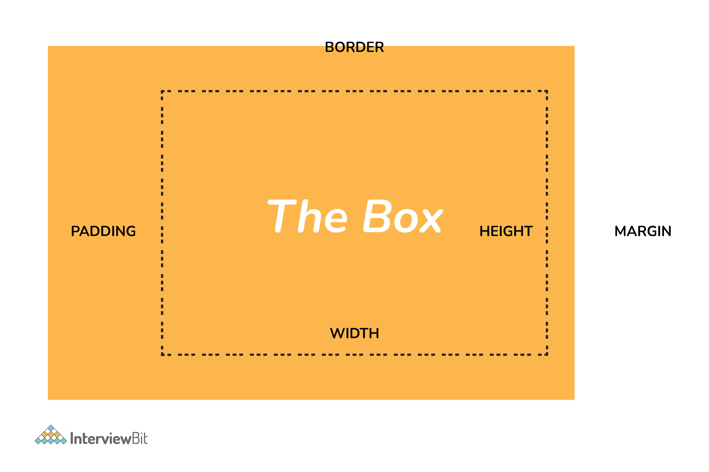

* **Content** - nội dung trong hộp, nơi hiển thị văn bản và hình ảnh.
* **Padding** - phần khoảng trắng xung quanh nội dung.
* **Border** - đường viền xung quanh nội dung và padding.
* **Margin** - phần lề bên ngoài đường viền.

### 2. Ưu điểm của CSS?

+ Tiết kiệm thời gian, công sức trong việc code web/xây dựng giao diện; kiểm soát dễ dàng các lỗi không đáng có trên web
+ CSS cung cấp nhiều thuộc tính cụ thể hơn HTML giúp tạo ra nhiều style khác nhau và có thể áp dụng được cho nhiều loại web.
+ CSS giúp tốc độ tải trang web nhanh chóng hơn, dễ dàng bảo trì, tương thích với các thiết bị di động.
+ CSS thiết lập nhiều kiểu chữ khác nhau giúp website của bạn trở nên khác biệt hơn; tự động sắp xếp chữ khi chèn hình ảnh (thuộc tính shape-outsite); đặt nội dung theo các chiều khác nhau/ thay đổi chế độ viết theo mong muốn của mình (thuộc tính write-mode); có thể tạo chữ lớn ở đầu dòng (thuộc tính first-letter)…

### 3. Hạn chế của CSS?

#### CSS hoạt động khác biệt cho từng trình duyệt

Với những thay đổi ban đầu của CSS trên một website rất dễ dàng. Tuy nhiên, khi thay đổi đã được thực hiện đòi hỏi chúng ta phải xác nhận được tính tương thích khi CSS hiển thị hiệu ứng thay đổi tương tự cho từng trình duyệt. Điều này xuất hiện do CSS sẽ hoạt động khác biệt cho từng trình duyệt cụ thể.

#### Khá khó khăn cho người mới
Ngôn ngữ lập trình phát triển đa dạng và vô cùng phúc tạp, đặc biệt là khó khăn với những người mới bắt đầu. Bởi thế, với nhiều cấp độ của CSS thì việc tìm hiểu, có thể nắm bắt để sử dụng càng trở nên khó khăn hơn.

#### Định dạng của web có khả năng gặp rủi ro
CSS là hệ thống dựa trên văn bản mở nên việc truy cập khá dễ dàng. Điều này khiến định dạng toàn bộ của web hoàn toàn có thể chịu tổn thương, gặp gián đoạn khi có hành động, hoặc tai nạn nào xảy ra với tệp. Lúc này nó sẽ yêu cầu truy cập đọc hoặc ghi vào web dự định để có thể ghi đè lên được các thay đổi.

### 4. Làm thế nào để đưa CSS vào trang web?

Có nhiều cách để thêm CSS vào trang web.

#### Dẫn link từ file bên ngoài

```html
<link rel="stylesheet" type="text/css" href="mystyles.css" />
```

#### Nhúng với thẻ `<style>`

```html
<style type="text/css">

/*Add style rules here*/

</style>
```

#### Thêm trực tiếp vào phần tử HTML nhờ thuộc tính `style`

```html
<h2 style="color:red;background:black">Inline Style</h2>
```

### 5. Các loại selector khác nhau trong CSS?

CSS Selector giống như là đường đẫn, chỉ định để cho CSS biết bạn đang muốn điều chỉnh, tạo kiểu cho phần tử HTML nào vậy.

**Universal Selector:** hoạt động như một ký tự đại diện cho tất cả phần tử trong trang. Trong ví dụ này, các style được cung cấp sẽ được áp dụng cho tất cả các phần tử trên trang.

```css
* {
    color: "green";
    font-size: 20px;
    line-height: 25px;
}
```

**Element Type Selector:** selector loại này ứng với một hoặc nhiều phần tử HTML cùng tên. Trong ví dụ này, các style được cung cấp sẽ được áp dụng cho tất cả các phần tử ul trên trang.

```css
ul {
    line-style: none;
    border: solid 1px #ccc;
}
```

**ID Selector:** selector này ứng với bất kỳ phần tử HTML nào có thuộc tính ID có cùng giá trị với giá trị của selector. Trong ví dụ này, các style được cung cấp sẽ được áp dụng cho tất cả các phần tử có ID trùng trên trang.

```css
#container {
    width: 960px;
    margin: 0 auto;
}
```

```html
<div id="container"></div>
```

**Class Selector:** tương tự như ID Selector nhưng thay vì ứng với ID thì nó ứng với thuộc tính class. Trong ví dụ này, các style được cung cấp sẽ áp dụng cho tất cả phần tử có cùng tên lớp.

```css
.box {
    padding: 10px;
    margin: 10px;
    width: 240px;
}
```

```html
<div class="box"></div>
```

**Descendant Combinator:** giúp bạn kết hợp hai hoặc nhiều selector để có thể chỉ định phần tử cụ thể.

```css
#container .box {
	float: left;
	padding-bottom: 15px;
} 
```

```html
<div id="container">
	<div class="box"></div>
	
	<div class="box-2"></div>
</div>

<div class="box"></div>
```

Khối khai báo này sẽ áp dụng cho tất cả các phần tử có lớp `box` nằm bên trong phần tử có ID là `container`. Cần lưu ý rằng phần tử `.box` không nhất thiết phải là phần tử con, nó có thể có một phần tử khác bao bọc `.box` và các style vẫn sẽ áp dụng.

**Child Combinator:** selector sử dụng bộ child combinator tương tự như descendant combinator, ngoại trừ việc nó chỉ nhắm đến các phần tử con.

```css
#container> .box {
	float: left;
	padding-bottom: 15px;
}
```

```html
<div id="container">
	<div class="box"></div>
	
	<div>
		<div class="box"></div>
	</div>
</div>
```

Selector sẽ ứng với tất cả phần tử có lớp `box` và là phần tử con của phần tử có id là `container`. Điều đó có nghĩa là các phần tử lớp `box` không phải là phần tử con của `container` sẽ không được áp dụng.

**General Sibling Combinator:** selector này so với các phần tử có quan hệ anh chị em với phần tử tương ứng.

```css
h2 ~ p {
	margin-bottom: 20px;
}
```

```html
<h2>Title</h2>
<p>Paragraph example.</p>
<p>Paragraph example.</p>
<p>Paragraph example.</p>
<div class="box">
	<p>Paragraph example.</p>
</div>
```

Trong ví dụ này, tất cả các phần tử văn bản (`<p>`) sẽ được áp dụng style với các quy tắc đã chỉ định, nhưng chỉ khi chúng là anh chị em của các phần tử `<h2>`. Có thể có các phần tử khác ở giữa `<h2>` và `<p>` và các style sẽ vẫn áp dụng.

**Adjacent Sibling Combinator:**: selector sử dụng ký tự `+` và gần giống với General Sibling Combinator. Sự khác biệt là phần tử được nhắm phải là anh chị ruột thịt chứ không phải enh chị em chung chung.

```css
p + p {
	text-indent: 1.Sem;
	margin-bottom: 0;
}
```
```html
<h2>Title</h2>
<p>Paragraph example.</p>
<p>Paragraph example.</p>
<p>Paragraph example.</p>

<div class=”box”>
	<p>Paragraph example.</p>
	<p>Paragraph example.</p>
</div>
```

Ví dụ trên sẽ chỉ áp dụng các style được chỉ định cho các phần tử văn bản ngay sau các phần tử văn bản khác. Điều này có nghĩa là phần tử văn bản đầu tiên trên một trang sẽ không nhận được các style này. Ngoài ra, nếu một phần tử khác xuất hiện giữa hai đoạn văn, thì đoạn thứ hai của cả hai sẽ không được áp dụng style.

**Attribute Selector:** nhắm đến các phần tử dựa trên sự xuất hiện và giá trị của thuộc tính HTML. Được khai báo bằng dấu ngoặc vuông.

```css
input [type=”text”] {
	background-color: #444;
	width: 200px;
}
```
```html
<input type="text">
```

### 6. CSS Preprocessor là gì? SASS vs LESS vs Stylus?

CSS Preprocessor là các phiên bản mở rộng của ngôn ngữ CSS (ngôn ngữ tiền xử lý CSS) được viết xử lý trước sau đó sẽ biên dịch ra các đoạn mã CSS thông thường. Nhiệm vụ của các CSS Preprocessor là giúp bạn logic hóa và cấu trúc các đoạn mã CSS, từ đó đưa CSS trở nên gần hơn với 1 ngôn ngữ lập trình. Bạn có thể viết CSS theo thứ tự rõ ràng, quản lý các biến đã được định nghĩa sẵn, có thể tự động nén tập tin CSS lại để bạn tiết kiệm dung lượng. Hiện tại có thể có rất nhiều CSS Preprocessor nhưng có phỗ biến nhất trong số đó là SASS, LESS và Stylus.

#### SASS

Là viết tắt của Syntactically Awesome Style Sheets. SASS có thể được viết theo hai cú pháp là SASS và SCSS.

- SASS dựa trên thụt lề còn SCSS (Sassy CSS) thì không.
- SASS sử dụng phần mở rộng .sass trong khi SCSS sử dụng phần mở rộng .scss.
- SASS không sử dụng dấu ngoặc nhọn hoặc dấu chấm phẩy. SCSS sử dụng nó, giống như CSS.

Cú pháp SASS

```css
$font-color: #fff 
$bg-color: #00f

#box
	color: $font-color
	background: $bg-color
```

Cú pháp SCSS

```css
$font-color: #fff;
$bg-color: #00f;

#box{
	color: $font-color;
	background: $bg-color;
}
```

#### LESS

Là viết tắt của Leaner Stylesheets. LESS có thể được thêm dễ dàng vào bất kỳ dự án javascript nào bằng cách sử dụng NPM hoặc file less.js. Nó sử dụng phần mở rộng `.less`.

Cú pháp LESS giống như SCSS với một số ngoại lệ. LESS sử dụng @ để xác định các biến.

```css
@font-color: #fff;
@bg-color: #00f

#box{
	color: @font-color;
	background: @bg-color;
}
```

#### Stylus

Stylus cung cấp rất nhiều tính linh hoạt trong việc viết cú pháp, hỗ trợ CSS thuần cũng như cho phép bỏ qua dấu ngoặc, dấu hai chấm và dấu chấm phẩy. Nó không sử dụng @ hoặc $ để xác định các biến.

```css
/* STYLUS SYNTAX WRITTEN LIKE NATIVE CSS */
font-color= #fff;
bg-color = #00f;

#box {
	color: font-color;
	background: bg-color;
}

/* OR */

/* STYLUS SYNTAX WITHOUT CURLY BRACES */
font-color= #fff;
bg-color = #00f;

#box
	color: font-color;
	background: bg-color;
```

### 7. VH/VM trong CSS là gì?

Đây là một đơn vị CSS được sử dụng để đo chiều cao và chiều rộng theo tỷ lệ phần trăm đối với viewport. Nó được sử dụng chủ yếu trong các kỹ thuật thiết kế reponsive. Số đo VH bằng 1/100 chiều cao của viewport. Nếu chiều cao của trình duyệt là 1000px, thì 1vh bằng 10px. Tương tự, nếu chiều rộng là 1000px, thì 1 vw bằng 10px.

### 8. Sự khác biệt giữa reset và normalize CSS?

**Reset CSS:** nhằm mục đích xoá tất cả thiết lập style mặc định từ trình duyệt. Ví dụ như margin, padding, font-size của tất cả phần tử đó được reset lại giống nhau.

**Normalize CSS:** nhằm mục đích làm cho các style mặc định nhất quán trên trình duyệt. Nó cũng sửa các lỗi phổ biến trên trình duyệt.

### 9. Sự khác biệt giữa inline, block và inline-block?

**Block**: Các phần tử block luôn bắt đầu trên một dòng mới. Chúng cũng sẽ chiếm không gian trên toàn bộ hàng hay chiều rộng. Danh sách các phần tử block là `<div>`, `<p>`.

**Inline**: Các phần tử inline không bắt đầu trên dòng mới, mà nó xuất hiện cùng dòng với các thẻ bên cạnh chúng. Ví dụ các phần tử inline là `<span>`, `<strong>` và ``.

**Inline Block**: Các phần tử inline-block tương tự inline, ngoại trừ chúng có thể có phần padding và margin và đặt các giá trị height và width.

### 10. Việc kiểm tra trang web trên các trình duyệt khác nhau có quan trọng không?

Điều quan trọng nhất là kiểm tra một trang web trong các trình duyệt khác nhau khi bạn thiết kế lần đầu tiên hoặc khi thực hiện các thay đổi lớn. Tuy nhiên, điều quan trọng là phải lặp lại các kiểm tra này theo định kỳ, vì các trình duyệt thường xuyên có các bản cập nhật và thay đổi.

### 11. Phần tử Pseudo và các lớp Pseudo là gì?

**Phần tử pseudo** cho phép ta tạo các mục thường không tồn tại trong DOM.

- ::before
- ::after
- ::first-letter
- ::first-line
- ::selection

Trong ví dụ bên dưới, màu sẽ xuất hiện ở dòng đầu tiên trong đoạn văn

```css
p::first-line {
	color: #ffOOOO;
	font-variant: small-caps;
}
```

**Lớp pseudo**  chọn các phần tử thông thường nhưng trong các điều kiện nhất định như khi người dùng di chuột qua liên kết.

- :link
- :visited
- :hover
- :active
- :focus

Trong ví dụ này, màu xuất hiện khi bạn di chuyển chuột qua thẻ liên kết.

```css
/* mouse over link */
a:hover {
	color: #FFOOFF;
}
```

### 12. Làm thế nào để chỉ định các đơn vị trong CSS? Những cách khác nhau để làm điều đó là gì?

Có nhiều cách khác nhau để chỉ định các đơn vị trong CSS như `px`, `em`, `pt`, phần trăm (`%`). 

- Pixel (px) cung cấp khả năng kiểm soát chi tiết và duy trì căn chỉnh vì 1 hoặc nhiều px được đảm bảo sự sắc nét. px không phân tầng.

- em duy trì kích thước tương đối. Bạn có thể có phông chữ reponse. Em, sẽ xếp tầng 1em bằng kích thước phông chữ hiện tại của phần tử hoặc mặc định của trình duyệt. Nếu bạn để font-size thành 16px thì 1em = 16px. Thực tế phổ biến là đặt kích thước phông chữ nội dung mặc định thành 62,5% (bằng 10px).

- pt (điểm) thường được sử dụng trong in ấn. 1pt = 1/72 inch và nó là một đơn vị có kích thước cố định.

- % (phần trăm) đặt kích thước phông chữ so với kích thước phông của nội dung. Do đó, bạn phải đặt kích thước phông chữ của phần nội dung thành kích thước hợp lý.

### 13. Liệu margin-top hoặc margin-bottom có ảnh hưởng đến các phần tử inline không?

Không, nó không ảnh hưởng đến các phần tử inline. Các phần tử inline ở cùng dòng với nội dung của trang.

### 14. Thuộc tính nào được sử dụng để thay đổi dạng phông chữ?

Chúng ta có thể sử dụng thuộc tính `font-family` để thực hiện được điều này. Thuộc tính font-family được sử dụng để chỉ định phông chữ nào cần được áp dụng trên phần tử DOM. Nó có thể chứa một số tên phông chữ như một phần của cơ chế “dự phòng” trong trường hợp trình duyệt không hỗ trợ phông chữ. Ví dụ, chúng ta có thể sử dụng:

```css
p {
    font-family: "Times New Roman", Times, serif;
}
```

Trong đoạn code trên, ta đang áp dụng thuộc tính font-family cho phần tử đoạn văn.

- Nó yêu cầu trình duyệt tìm kiếm phông chữ "Times New Roman" và áp dụng nó.
- Nếu phông chữ "Times New Roman" không được cài đặt hoặc hỗ trợ, thì nó sẽ yêu cầu trình duyệt sử dụng phông chữ Times.
- Nếu cả "Times New Roman" và "Times" đều không được hỗ trợ, thì nó sẽ yêu cầu trình duyệt sử dụng bất kỳ phông chữ chung nào được hỗ trợ thuộc serif.

Nếu bạn không muốn `font-face` của phần tử văn bản là phông chữ Times New Roman/ Times/serif và bạn muốn sử dụng phông chữ Arial/Helvetica/sans-serif, thì ta có thể cập nhật thuộc tính CSS của phần tử văn bản như:

```css
p {
    font-family: Arial, Helvetica, sans-serif;
}
```

### 15. Sự khác biệt giữa adaptive design và responsive design?

| Adaptive Design | Responsive Design |
|-----------------|-------------------|
| Tập trung vào thiết kế trang web dựa trên nhiều kích thước bố cục cố định | Tập trung vào việc hiển trị nội dung trên cơ sở không gian trình duyệt có sẵn |
| Khi một trang web được phát triển bằng cách sử dụng thiết kế adaptive được mở trên trình duyệt máy tính để bàn, trước tiên không gian có sẵn sẽ được phát hiện và sau đó bố cục có kích thước phù hợp nhất sẽ được chọn và sử dụng để hiển thị nội dung. Thay đổi kích thước của cửa sổ trình duyệt không ảnh hưởng đến thiết kế | Khi một trang web được phát triển bằng cách sử dụng thiết kế responsive được mở trên trình duyệt trên máy tính để bàn và khi ta thay đổi kích thước cửa sổ trình duyệt, nội dung của trang web được sắp xếp động và tối ưu để phù hợp với cửa sổ |
| Thông thường, các thiết kế adaptive sử dụng sáu chiều rộng màn hình tiêu chuẩn - 320px, 480px, 760px, 960px, 1200px, 1600 . Các kích thước này được phát hiện và các bố cục thích hợp được tải | Thiết kế này sử dụng các truy vấn CSS để thay đổi kiểu tùy thuộc vào thuộc tính thiết bị mục tiêu để thích ứng với các màn hình khác nhau |
| Đầu tiên phải mất rất nhiều thời gian và nỗ lực để xem xét các lựa chọn và thực tế của người dùng cuối, sau đó thiết kế các giải pháp thích ứng tốt nhất có thể cho họ | Nói chung, thiết kế responsive cần ít công việc hơn để xây dựng và thiết kế các trang web linh hoạt có thể chứa nội dung từ màn hình tùy thuộc vào kích thước màn hình |
| Cung cấp nhiều quyền kiểm soát thiết kế để phát triển các trang web cho các màn hình cụ thể | Không có nhiều quyền kiểm soát thiết kế được cung cấp ở đây |

### 16. Làm thế nào để các CSS Selector ứng với các phần tử của trình duyệt?

Thứ tự của các selector phù hợp đi từ phải sang trái của biểu thức selector. Các phần tử trong DOM được trình duyệt lọc dựa trên các khóa selector và sau đó được chuyển đến các phần tử mẹ để xác định các kết quả phù hợp. Tốc độ xác định các phần tử phụ thuộc vào độ dài của chuỗi các selector. Hãy xem xét một ví dụ:

```css
p span{ 
    color: black;
}
```

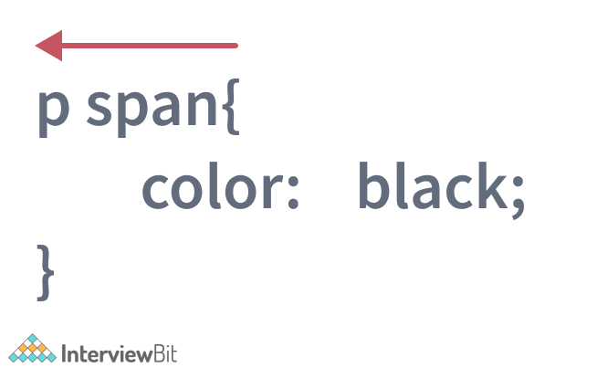

Ở đây, trước tiên trình duyệt tìm tất cả các phần tử `span` trong DOM và sau đó nó chuyển đến từng phần tử cha của nó để kiểm tra xem chúng có phải là phần tử của đoạn `p` hay không.

Sau khi trình duyệt tìm thấy tất cả các thẻ `span` phù hợp có các phần tử `p` là cha và áp dụng màu đen cho nội dung, quá trình so sánh sẽ bị dừng lại.

### 17. Border-box khác với content-box như thế nào?

`content-box` là thuộc tính xác định giá trị mặc định cho kích thước hộp. Thuộc tính width và height chỉ bao gồm nội dung bằng cách loại trừ border và padding. Hãy xem xét một ví dụ như sau:

```css
div{
    width:300px;
    height:200px;
    padding:15px;
    border: 5px solid grey;
    margin:30px;
    -moz-box-sizing:content-box;
    -webkit-box-sizing:content-box;
    box-sizing:content-box;
}
```

Ở đây, kích thước hộp cho phần tử div được cung cấp dưới dạng `content-box`. Điều đó có nghĩa là height và width được xem xét cho nội dung div sẽ loại trừ padding và border. Chúng ta sẽ nhận được đầy đủ các thông số chiều cao và chiều rộng được chỉ định cho nội dung như trong hình bên dưới.

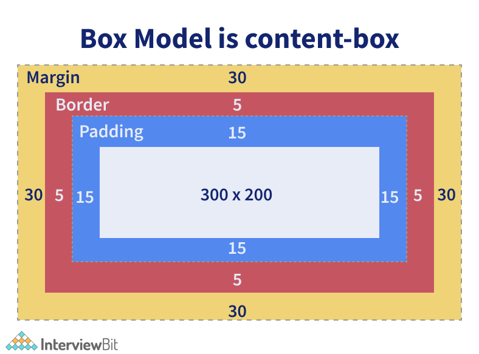

`border-box` là thuộc tính bao gồm nội dung và padding, border trong thuộc tính height và width. Hãy xem ví dụ sau:

```css
div{
    width:300px;
    height:200px;
    padding:15px;
    border: 5px solid grey;
    margin:30px;
    -moz-box-sizing:border-box;
    -webkit-box-sizing:border-box;
    box-sizing:border-box;
}
```

Ở đây, kích thước hộp cho phần tử div được cung cấp dưới dạng `border-box`. Điều đó có nghĩa là height và width được xem xét cho nội dung div cũng sẽ bao gồm phần border và padding. Điều này có nghĩa là chiều cao thực của nội dung div sẽ là:

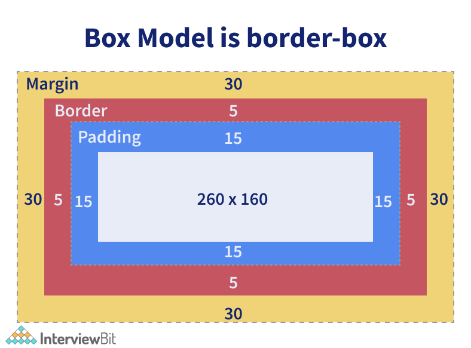

### 18. Opacity được quy định như thế nào trong CSS3?

Opacity ám chỉ mức độ nội dung trong suốt hoặc không trong suốt. Chúng ta có thể sử dụng thuộc tính có tên opacity nhận các giá trị từ 0 đến 1. 0 chỉ định rằng phần tử là hoàn toàn trong suốt, trong khi 1 có nghĩa là phần tử hoàn toàn không trong suốt. Chúng ta có thể sử dụng thuộc tính opacity như sau:

```css
div { 
    opacity: 0.6;
}
```

Trong ví dụ trên, độ mờ 60% được áp dụng cho phần div. Thuộc tính opacity không được trình duyệt internet explorer hỗ trợ. Để làm cho nó hoạt động ở đó, chúng ta cần sử dụng thuộc tính filter là polyfill như ví dụ bên dưới.

```css
div { 
    opacity: 0.6;
    filter: alpha(opacity=60);
}
```

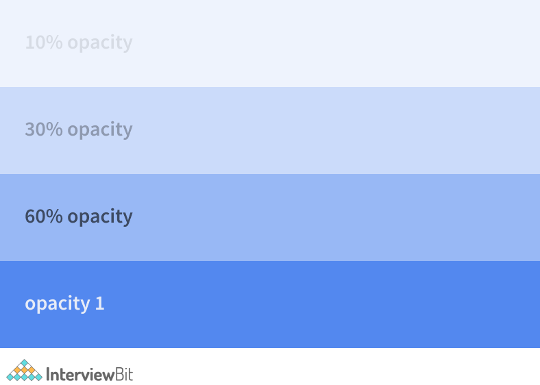

### 19. Tại sao chúng ta nên sử dụng thuộc tính float trong CSS?

Thuộc tính float được sử dụng để định vị các phần tử HTML theo chiều ngang về phía bên trái hoặc bên phải của container. Ví dụ,

```css
float-demo {
	float: right;
}
```

Ở đây, phần tử mà lớp được áp dụng đảm bảo rằng phần tử được định vị ở bên phải của container. Nếu bạn chỉ định giá trị của float ở bên trái, thì phần tử sẽ được đặt ở bên trái của container.

### 20. z-index là gì? Nó hoạt động như thế nào?

z-index được sử dụng để chỉ định cách xếp chồng theo chiều sâu của các phần tử chồng lên nhau xảy ra tại thời điểm định vị nó. Nó chỉ định thứ tự ngăn xếp theo chiều sâu của các phần tử được định vị giúp xác định cách hiển thị các phần tử diễn ra như thế nào trong trường hợp chồng chéo.

Giá trị mặc định của thuộc tính này là 0 và có thể là số dương hoặc số âm. Ngoài 0, các giá trị của z-index có thể là:

- Auto: Thứ tự ngăn xếp bằng với phần tử cha.
- Number: Có thể là dương hoặc âm. Nó xác định thứ tự ngăn xếp.
- Initial: Giá trị mặc định là 0.
- Inherit: Kế thừa giá trị từ phần tử cha.

Các phần tử có giá trị z-index nhỏ hơn được xếp chồng thấp hơn các phần tử có z-index cao hơn.

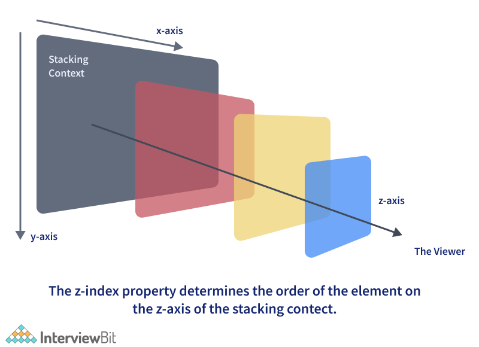

Từ hình trên, chúng ta có thể thấy rằng khi giá trị của z-index tăng dọc theo trục z, thứ tự xếp chồng sẽ hướng về phía trên cùng của các phần tử khác dọc theo trục tung.

### 21. Các CSS selector sau đây có nghĩa là gì?

* div, p
* div p
* div ~ p
* div + p
* div > p

Ý nghĩa của chúng như sau:

* `div, p`: Selector này ngụ ý chọn tất cả các phần tử div và tất cả các phần tử p.

```html
<h1>Heading 1</h1>
<div>
	Division 1
	<p> paragraph 1</p> <!-- Will be selected -->
</div>
<p> paragraph 2</p> 
<p> paragraph 3</p> 
<div>
	Division 2
</div>
<span> Span 1 </span>
```

Ở đây, tất cả các phần tử div và phần tử p sẽ được trình duyệt chọn bất kể cha mẹ của chúng hay chúng được đặt ở đâu. Các thẻ còn lại như h1 và span bị bỏ qua.

* `div p`: Selector cho biết chọn tất cả các phần tử p nằm bên trong các phần tử div. Hãy xem xét một ví dụ dưới đây:

```html
<h1>Heading 1</h1>
<div>
    Division 1
    <p> paragraph 1</p> <!-- Will be selected -->
    <div>
        <p> Inner Div Paragraph </p> <!-- Will be selected -->
    </div>
</div>
<p> paragraph 2</p>
<p> paragraph 3</p>
<div>
    Division 2
</div>
<span> Span 1 </span>
```

Ở dây, `<p> paragraph 1</p>` và `<p> Inner Div Paragraph </p>` sẽ được chọn bởi trình duyệt và thuộc tính được áp dụng. Phần còn lại sẽ không được chọn.

* `div ~ p`: Selector này chọn tất cả các phần tử p có phần tử div đứng trước ở bất kỳ đâu.

```html
<h1>Heading 1</h1>
<div>
   Division 1
   <p> paragraph 1</p>
</div>
<p> paragraph 2</p> <!-- Will be selected -->
<p> paragraph 3</p> <!-- Will be selected -->
<div>
   Division 2
</div>
<span> Span 1 </span>
```

Ở đây, các phần tử của paragraph 2 và paragraph 3 sẽ được chọn như được đánh dấu trong đoạn code trên.

* `div + p`: Selector nàychọn tất cả các phần tử p được đặt ngay sau phần tử div.

```html
<h1>Heading 1</h1>
<div>
	Division 1
	<p> paragraph 1</p>
</div>
<p> paragraph 2</p> <!-- Will be selected -->
<p> paragraph 3</p> 
<div>
	Division 2
</div>
<span> Span 1 </span>
```

Trong trường hợp này, chúng ta có phần tử paragraph 2 ngay sau thẻ div. Do đó, chỉ phần tử đó sẽ được chọn.

* `div > p`: Selector này chọn tất cả các phần tử p có div là cha trực tiếp. Trong cùng một ví dụ dưới đây:

```html
<h1>Heading 1</h1>
<div>
	Division 1
	<p> paragraph 1</p> <!-- Will be selected -->
</div>
<p> paragraph 2</p> 
<p> paragraph 3</p> 
<div>
	Division 2
</div>
<span> Span 1 </span>
```

Chỉ `<p> paragraph 1</p>` được chọn trong trường hợp này vì nó có div là cha trực tiếp.

### 22. Thuộc tính flexbox là gì?

Flexbox Layout (hay còn gọi là Flexible Box) là một kiểu bố cục trang có khả năng tự cân đối kích thước, thay đổi chiều rộng/chiều cao và thứ tự phần tử bên trong để phù hợp với tất cả các loại thiết bị hiển thị và kích thước màn hình.

Với bố cục thông thường, bạn cần phải thiết lập kích thước của phần tử, thiết lập hiển thị dạng block hay inline, cho nó float, còn với Flexbox bạn chỉ cần thiết lập phần hiển thị theo chiều ngang hay chiều dọc, lúc đó các phần tử bên trong có thể hiển thị theo ý muốn.

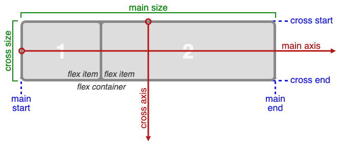

Các thuộc tính flexbox:
- **flex-direction**: Thuộc tính này giúp xác định hướng container sẽ xếp chồng các mục cho linh hoạt. Các giá trị của thuộc tính này có thể là:
	+ row: xếp các mục theo chiều ngang từ trái sang phải trong flex container.
	+ column: xếp các mục theo chiều dọc từ trước ra sau trong flex container.
	+ row-reverse: xếp các mục theo chiều ngang từ phải sang trái trong flex container.
	+ column-reverse: xếp các mục theo chiều dọc từ sau ra trước trong flex container.
- **flex-wrap**: Thuộc tính này chỉ định các mục flex nên được bọc hay không. Giá trị có thể là:
	+ wrap: mục flex nên được bọc.
	+ nowrap: giá trị mặc định này là mục không được bọc.
	+ wrap-reverse: chỉ định này cho biết mục sẽ được bọc nếu cần nhưng theo thứ tự ngược.
- **flex-flow**: thuộc tính này thiết lập cả flex-direction và flex-wrap trong một dòng.
- **justify-content**: dùng cho căn chỉnh mục. Các giá trị có thể:
	+ center: có nghĩa là các mục hiện ở trung tâm của container.
	+ flex-start: đây là giá trị mặc định, sẽ được căn chỉnh từ điểm bắt đầu container.
	+ flex-end: các mục sẽ được căn chỉnh từ điểm cuối của container.
	+ space-around: các mục sẽ được căn chỉnh với khoảng trắng giữa, trước và xung quanh các mục.
	+ space-between: các mục sẽ được căn chỉnh với khoảng trắng giữa các mục.
- **align-items**: sử dụng cho căn chỉnh mục flex.
- **align-content**: sử dụng cho căn chỉnh dòng flex.

### 23. Xếp tầng trong CSS là gì?

Cascanding hay xếp tầng, đề cập đến quá trình xem xét các khai báo kiểu và xác định trọng lượng hoặc tầm quan trọng của các quy tắc tạo kiểu giúp trình duyệt chọn quy tắc nào phải được áp dụng trong thời gian xung đột. Xung đột ở đây đề cập đến nhiều quy tắc có thể áp dụng cho một phần tử HTML cụ thể. Trong những trường hợp như vậy, chúng ta cần cho trình duyệt biết phong cách nào cần được áp dụng cho phần tử. Điều này được thực hiện bằng cách xếp tầng danh sách các phần tử khai báo kiểu.

Ví dụ:

```css
p {
    color:white;
}
```

và chúng ta cũng có khai báo sau bên dưới nó hoặc trong một biểu định kiểu khác đã được liên kết với trang:

```css
p {
    color:black;
}
```

Ỏ đây, chúng ta có xung đột về thuộc tính màu cho các phần tử của đoạn văn. Trình duyệt chỉ cần phân tầng để xác định đâu là kiểu mới nhất và cụ thể nhất và áp dụng kiểu đó. Vì ta có `color:black;` như một khai báo cụ thể nhất, màu đen được áp dụng cho các phần tử của đoạn văn. Bây giờ nếu bạn muốn đảm bảo màu trắng được áp dụng cho đoạn văn, chúng ta có thể xác định trọng số cho kiểu đó bằng cách thêm `!important` như hình dưới đây:

```css
p {
    color:white !important;
}
```

`!important` đảm bảo rằng thuộc tính có trọng lượng tối đa khi có các thuộc tính xung đột khác.

## Câu hỏi phỏng vấn CSS cho Experienced

### 24. Giải thích thuộc tính position CSS?

- **static**: vị trí mặc định/tĩnh của phần tử và bạn đặt đâu phần tử sẽ nằm ở đó.
- **relative**: vị trí của phần tử sẽ tương đối so với vị trí tĩnh bạn đặt và khoản không gian xung quanh phần tử sẽ được giữ nguyên.
- **fixed**: vị trí sẽ nằm cố định một chỗ, dù bạn có làm gì, phần tử vẫn nằm cố định 1 vị trí trên màn hình.
- **absolute**: vị trí của phần tử sẽ được xác định từ padding của phần tử cha.
- **sticky**: vị trí của phần tử sẽ được định vị khi người dùng sử dụng thanh scroll.

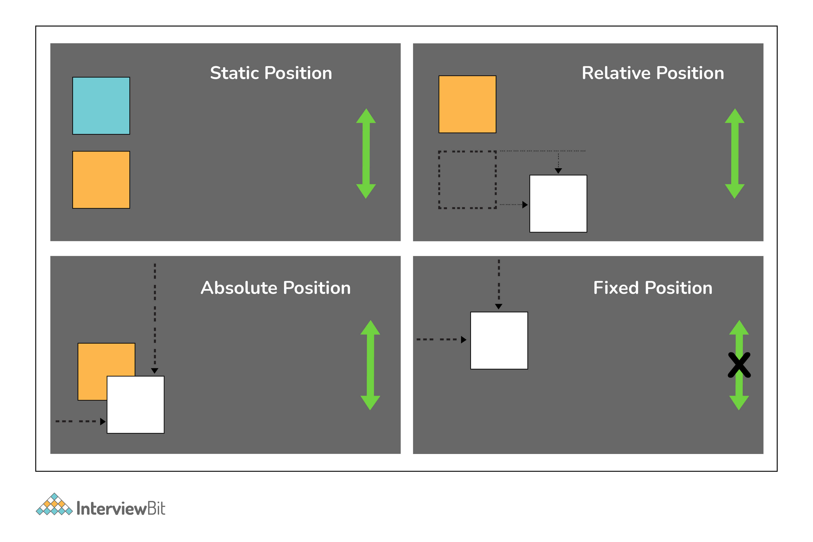

### 25. Khi nào thì xảy ra DOM reflow?

Reflow là tên của quá trình mà trình duyệt web tính toán lại vị trí và hình dạng của các phần tử trong document, nhằm mục đích hiển thị lại một phần hoặc toàn bộ document.

Reflow xảy ra khi:

- Chèn, xóa hoặc cập nhật một phần tử trong DOM.
- Sửa đổi nội dung trên trang, ví dụ: văn bản trong hộp nhập liệu.
- Di chuyển một phần tử DOM.
- Tạo hoạt ảnh cho một phần tử DOM.
- Thực hiện các phép đo một phần tử như `offsetHeight` hoặc `getComputedStyle`.
- Thay đổi kiểu CSS.

### 26. Sự khác biệt giữa các thuộc tính Box Sizing?

Thuộc tính CSS box-sizing quy định cách tính tổng chiều rộng và chiều cao của một phần tử.
- **Context-box:** Giá trị chiều rộng và chiều cao mặc định chỉ áp dụng cho nội dung của phần tử. Padding và border nằm ở bên ngoài hộp.
- **Padding-box:** Giá trị chiều rộng và chiều cao mặc định chỉ áp dụng cho nội dung của phần tử và padding của nó. Border nằm ở bên ngoài hộp. Hiện tại chỉ có Firefox hỗ trợ padding-box.
- **Border-box:**  Giá trị chiều rộng và chiều cao áp dụng cho nội dung, padding và border. 

### 27. Làm sao để căn giữa một div trong một div khác?

Ta có :

```html
<div class="cn"><div class="inner">your content</div></div>
```

- Căn giữa với Table

```css
.cn {
	display: table-cell;
	width: 500px;
	height: 500px;
	vertical-align: middle;
	text-align: center;
}

.inner {
	display: inline-block;
	width: 200px; height: 200px;
}
```

- Căn giữa với Transform

```css
.cn {
	position: relative;
	width: 500px;
	height: 500px;
}

.inner {
	position: absolute;
	top: 50%; left: 50%;
	transform: translate(-50%,-50%);
	width: 200px;
	height: 200px;
}
```

- Căn giữa với Flexbox

```css
.cn {
	display: flex;
	justify-content: center;
	align-items: center;
}
```

- Căn giữa với Grid

```html
<div class="wrap_grid">
	<div id="container">vertical aligned text<br />some more text here
	</div>
</div>
```

```css
.wrap-grid {
	display: grid;
	place-content: center;
}
```

### 28. Kể tên bốn loại thuộc tính @media?

1. All -> Thuộc tính mặc định dùng cho tất cả thiết bị.
2. Screen -> sử dụng màn hình máy tính, điện thoại.
3. Print -> Sử dụng cho máy in.
4. Speech -> Sử dụng cho màn hình người đọc.

### 29. Hệ thống grid là gì?

CSS Grid layout là một hệ thống layout 2 chiều (x,y) được dùng trong thiết kế UI. Theo định nghĩa từ Mozilla, grid (lưới) là một tổ hợp của những đường ngang và dọc cắt nhau – một nhóm xác định các cột và nhóm kia xác định các hàng. Các phần tử có thể được đặt lên grid, dựa vào các đường hàng và cột này.

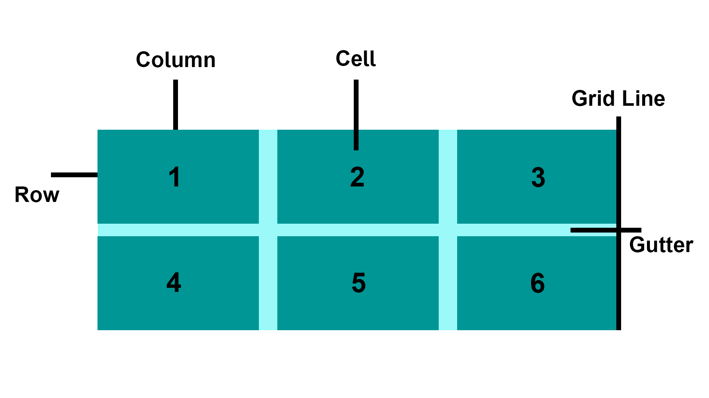

- Grid Item: Phần container bao gồm các grid items.
- Grid Line: Đường thẳng theo chiều dọc và ngang để xây dựng cấu trúc grid.
- Grid Cell: Đơn vị nhỏ nhất trong grid. Nó là không gian giữa các hàng và cột.
- Rows: Là đường nằm ngang trong grid.
- Columns: Là đường nằm dọc trong grid.
- Gutter: Là độ rộng không gian của hàng hay cột trong grid.

### 30. Các cách để ẩn phần tử với CSS?

- Sử dụng thuộc tính `display: none`. Phần tử sẽ không xuất hiện trong DOM. 
- Sử dụng thuộc tính `visibility: hidden`, phần tử có xuất hiện trong DOM, nhưng không hiển thị trên màn hình cho người dùng.
- Sử dụng thuộc tính `position: absolute`. Khả dụng bên ngoài màn hình.

### 31. :root pseudo-class đề cập tới cái gì?

:root selector cho phép bạn chỉ đến phần tử "cha" cao nhất trong DOM, hoặc cây document. Nó được xác định trong tài liệu đặc tả CSS Selectors Level 3.

### 32. Chiến lược mobile-first là gì?

Để reponsive một trang web có nghĩa là các phần tử sẽ thay đổi kích thước hoặc chức năng tuỳ theo kích thước màn hình của thiết bị, thường là thay đổi chiều rộng (width), thông qua các truy vấn media CSS, chẳng hạn như làm nhỏ kích thước phông chữ trên các thiết bị nhỏ hơn.

```css
@media (min-width: 601px) {
  .my-class {
    font-size: 24px;
  }
}
@media (max-width: 600px) {
  .my-class {
    font-size: 12px;
  }
}
```

Chiến lược mobile-first là một reponsive mà ta nên xác định các style trên thiết bị di động và chỉ thay đổi quy tắc cho các thiết bị khác sau. Ví dụ như:

```css
.my-class {
  font-size: 12px;
}

@media (min-width: 600px) {
  .my-class {
    font-size: 24px;
  }
}
```

Chiến lược mobile-first có hai ưu điểm:
- Nó hoạt động hiệu quả hơn trên thiết bị di động, vì tất cả các quy tắc áp dụng cho chúng không cần phải được xác thực dựa trên bất kỳ truy vấn `media` nào.
- Nó buộc phải viết code rõ ràng hơn liên quan đến các quy tắc CSS reponsive.

Ví dụ

```html
<!DOCTYPE html>
<html>
  <head>
  <meta name="viewport" content="width=device-width, initial-scale=1.0">
  <title>CSS Media Query</title>
  <style>
    body {
        background-color: lightgreen;
    }

    @media only screen and (max-width: 800px) {
        body {
            background-color: rgb(233, 50, 18);
        }
    }
  </style>
  </head>
<body>
    <h1>Resize the browser window</h1>
    <h2>When the width of this document is 800px or less, the background-color is "green", 
      otherwise it is "Red".</h2>
</body>
</html>
```

### 33. Làm thế nào để khôi phục giá trị mặc định của thuộc tính?

Từ khoá `initial` có thể được dùng để khôi phục giá trị mặc định.

### 34. Sự khác biệt giữa CSS grid và flexbox?

1. CSS Grid là hệ thống dựng layout 2 chiều, có nghĩa là chúng ta có thể xử lý theo cột và hàng, không giống như Flexbox là hệ thống layout 1 chiều. ( xử lý theo 1 cột hoặc 1 hàng ).

2. Điểm khác biệt cốt lõi giữa CSS Grid và Flexbox đó là: CSS Grid tiếp cận theo hướng bố cục (layout) dung còn Flexbox tiếp cận theo hướng nội dung. Nếu bạn biết được rõ trước nội dung mình cần trình bày hãy dùng CSS Flexbox ngược lại thì chọn CSS Grid.

3. Flexbox phù hợp với các website có bố cục đơn giản, CSS Grid phù hợp với website có bố cục phức tạp hơn.

4. Nếu bạn chỉ cần dựng layout theo 1 hàng hoặc 1 cột thì Flexbox sẽ phù hợp hơn. Ngược lại, nếu bạn muốn xác định grid và điều chỉnh nội dung theo 2 chiều - CSS Grid sẽ là lựa chọn của bạn.

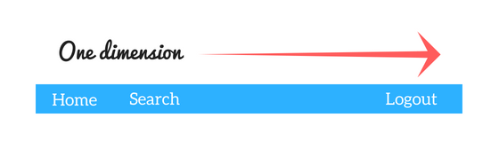


Ví dụ

```html
<!DOCTYPE html>
<html>
  <head>
    <title>Grid vs Flexbox Layout</title>
  </head>
  <style>
    /* Grid layout */
    .row {
        display: grid;
        grid-template-columns: auto auto auto;
        background-color: #2196f3;
        padding: 5px;
    }

    .col-item {
        background-color: rgba(255, 255, 255, 0.8);
        border: 1px solid rgba(0, 0, 0, 0.8);
        padding: 10px;
        font-size: 30px;
        text-align: center;
    }

    /* Flexbox layout */
    .wrapper {
        border: 2px solid #f76707;
        border-radius: 5px;
        background-color: #fff4e6;
    }

    .wrapper > div {
        border: 2px solid #ffa94d;
        border-radius: 5px;
        background-color: #ffd8a8;
        padding: 1em;
        color: #d9480f;
    }

    .wrapper {
        display: flex;
        width: 500px;
        flex-wrap: wrap;
    }

    .wrapper > div {
        flex: 1 1 150px;
    }
  </style>
  <body>
    <p><h1>Grid Layout Example<hr/></h1></p>
    <div class="row">
        <div class="col-item">Column - 1</div>
        <div class="col-item">Column - 2</div>
        <div class="col-item">Column - 3</div>
        <div class="col-item">Column - 1</div>
        <div class="col-item">Column - 2</div>
        <div class="col-item">Column - 3</div>
        <div class="col-item">Column - 1</div>
        <div class="col-item">Column - 2</div>
        <div class="col-item">Column - 3</div>
    </div>

    <p><h1><br/>Flexbox Layout Example<hr/></h1></p>
    <div class="wrapper">
        <div>One</div>
        <div>Two</div>
        <div>Three</div>
        <div>Four</div>
        <div>Five</div>
    </div>
  </body>
</html>
```

### 35. Calc dùng để làm gì?

Trong CSS3, hàm `calc()` cho phép ta thực hiện các phép tiến trên giá trị thuộc tính. Thay vì khai báo trực tiếp, với **width** là giá trị tĩnh ta có thể dùng `calc()` để chỉ định giá trị **width** bằng các phép tính trên các giá trị số.

```css
.foo {
	width: calc(100px + 50px)
}
```

### 36. Tuỳ chỉnh thuộc tính biến trong CSS?

Tuỳ chỉnh thuộc tính (thỉnh thoảng đề cập đến biến CSS) được định nghĩa bởi người dùng bao gồm giá trị cụ thể để sử dụng nhiều lần trong document. Giá trị là một tập hợp sử dụng ký hiệu **--**. Và giá trị được truy cập bằng hàm `var()`.

```css
:root {
	--main-bg-color: brown
}

.one {
	color: white;
	background-color· var (--main-bg-color);
	margin: l0px,
	width: 50px,
	height: 5Opx;
	display: inline-block;
}
```

### 37. Sự khác biệt của biến CSS và biến preprocessor (SASS, LESS, Stylus)?

- Biến CSS có thể dùng mà không cần preprocessor. Đồng thời, tất cả trình duyệt đều hỗ trợ biến CSS.
- Biến CSS có tác động nối tiếp. Còn preprocessor không cần.
- Biến CSS có thể truy cập và quản lý trong JavaScript

### 38. `* { box-sizing: border-box }` là gì?

- Nó điều chỉnh tất cả phần tử có bao gồm padding, border trong không gian phần tử cho tính toàn chiều dài và chiều rộng.
- Trong `box-sizing: border-box`, chiều cao phần tử được tính toán với: height + padding dọc + độ dài border dọc. Còn chiều dài là width + padding ngang + độ dài border ngang.

### 39. !important trong CSS là gì?

Các style có từ khoá important sẽ được ưu tiên cao nhất và ghi đè lên các thuộc tính bị trùng.

```css
p {
 	color: red !important;
}
#thing {
 	color: green;
} 
<p id="thing">Will be RED.</p>
```

### 40. Tính đặc hiệu trong CSS?

Tính đặc hiệu hay độ ưu tiên (specificity) là cách mà trình duyệt quyết định sẽ áp dụng thuộc tính css nào với một phần tử khi có nhiều quy tắc css cùng trỏ đến phần tử đó. 

Inline style sẽ được ưu tiên so với ID rồi đến giá trị lớp (pseudo-class hoặc attribute selector), universal selector **(*)** sẽ không có độ ưu tiên. ID Selector có độ ưu tiên cao hơn attribute selector.

### 41. Progressive rendering là gì?

Progressive rendering là một kỹ thuật sử dụng để cải thiện hiệu suất trang web (cụ thể là cải thiện thời gian tải web) để render nội dung cho hiển thị nhanh nhất có thể.

Ta có thể triển khai progressive rendering bằng cách lazy loading với hình ảnh. Ta sử dụng Intersection Observer API cho lazy load ảnh. API giúp đơn giản hoá việc phát hiện một phần tử đi vào viewport và thực hiện hành động khi phần tử đó thực hiện hành động. Khi image vào viewport, ta mới bắt đầu tải ảnh. 

Ví dụ:

```html

```

```js
document.addEventListener("DOMContentLoaded", function() {
	var lazyImages = [].slice.call(document.querySelectorAll("img.lazy"));

	if ("IntersectionObserver" in window) {
		let lazyImageObserver = new IntersectionObserver(function(entries, observer) {
			entries.forEach(function(entry) {
				if (entry.isIntersecting) {
				let lazyImage = entry.target;
				lazyImage.src = lazyImage.dataset.src;
				lazyImage.srcset = lazyImage.dataset.srcset;
				lazyImage.classList.remove("lazy");
				lazyImageObserver.unobserve(lazyImage);
				}
			});
		});

		lazyImages.forEach(function(lazyImage) {
			lazyImageObserver.observe(lazyImage);
		});
	} else {
		// Possibly fall back to event handlers here
	}
});
```

### 42. Lợi thế của dùng translate() thay vì position absolute?

Translate() không làm cho trình duyệt kích hoạt vẽ lại layout, mà chỉ thực hiện soạn thảo. Còn position: absolute làm trình duyệt phải vẽ lại các luồng DOM. Thế nền `translate()` đem về hiệu suất tốt hơn.

### 43. Style nào sẽ được tải và áp dụng trước trong code sau?

```html
<head>
	<link href="style1.css" rel=" stylesheet">
	<link href="style2.css" rel="stylesheet">
</head>
```

Style1.css sẽ được áp dụng trước vì CSS thực hiện theo thứ tự xuất hiện trong HTML.

### 44. Làm sao để biết trình duyệt có hỗ trợ một tính năng nhất định không?

Sử dụng `@supports` trong CSS để biết trình duyệt có hỗ trợ tính năng hay không.

```css
@supports (display: grid) {
	div {
		display: grid;
	}
}
```

### 45. Cách position absolute hoạt động?

Absolute là một cơ chế định vị mạnh mẽ cho phép người dùng đặt bất kỳ phần tử ở đâu vào một vị trí chính xác. Thuộc tính CSS như `right`, `left`, `top`, `bottom` sẽ xác định vị trí chính xác cần đặt phần tử. Trong absolute cần xem xét các điểm sau:
- Các phần tử được áp dụng absolute sẽ bị xoá khỏi luồng thông thường của HTML document.
- Bố cục HTML sẽ không tạo bất kỳ không gian nào cho các phần tử này trong bố cục trang.
- Các phần tử sẽ được định vị relative với phần tử cha (tổ tiên) gần nhất. Nếu không có phần tử cha nào nó sẽ được đặt tương ứng với container ban đầu.
- Vị trí cuối cùng của phần tử được xác định dựa trên các giá trị `top`, `left`, `right` và `bottom` được cung cấp.

### 46. Các thuộc tính của overflow trong CSS?

Thuộc tính overflow trong CSS dùng để xử lý khi kích thước nội dụng vượt qua kích thước container.

Cú pháp:

```css
overflow: visible|hidden|scroll|auto|initial|inherit;
```

Các thuộc tính:
- visible: phần nội dung tràn sẽ được hiển thị bên ngoài box phần tử.
- hidden: phần nội dung tràn bị ẩn đi.
- scroll: phần nội dung tràn được cắt, những sẽ được hiển thị khi scroll xuống.
- auto: tương tự như scroll
- initial: thiết lập giá trị mặc định
- inherit: kế thừa thuộc tính của phần tử cha
- overflow-x: chỉ định đỉnh trái/phải của nội dung nếu nội dung tràn khỏi phạm vi của nó.
- overflow-y: chỉ định đỉnh trên/dưới của nội dung nếu nội dung tràn khỏi phạm vi của nó.

Ví dụ:

```html
<!DOCTYPE html>
<html>
	<head>
		<title>CSS Overflow Property</title>
		<style>
		div {
			background-color: #eee;
			width: 200px;
			height: 100px;
			border: 1px dotted black;
			overflow: scroll;
			padding: 10px;
		}
		</style>
	</head>
	<body>
		<h2>CSS Overflow Property</h2>
		<p>Setting the overflow value to scroll, the overflow is clipped and a scrollbar
			is added to scroll inside the box.
		</p>

		<div>You can use the overflow property when you want to have better control of 
			the layout. The overflow property specifies what happens if content overflows 
			an element's box.
		</div>
	</body>
</html>
```

### 47. Bạn có thể căn chỉnh nội dung của thẻ `<p>` nằm ngay trung tâm của thẻ `<div>`?

Ta có thể dùng thuộc tính `text-align: center` bên trong div cha, để căn chỉnh nội dung nằm ngay trung tâm theo chiều ngang. Nhưng không ngay trung tâm chiều dọc. Để chỉnh nó theo chiều dọc ta cần làm gán position của phần tử cha là `relative` và ở phần tử con là `absolute`. Các phần tử con có giá trị `top`, `bottom`, `left`, `right` là 0 để nó nằm ở giữa theo chiều dọc. Sau đó ta thiết lập margin là auto. Nó giả sử cả phần tử con và cha sẽ có giá trị height và width.

Xem như ta có height và width của phần tử div là 20% kích cỡ màn hình. Ta có height văn bản là 1.2em và width là 20%. Nếu muốn chỉnh văn bản nằm ở trung tâm div ta làm như sau:

```css
div {
    position : relative;  // Make position relative
    height : 20%;
    width : 20%;
    text-align : center; //Align to center horizontally
}
p {
    position : absolute; // Make position absolute
    top:0;                // Give values of top, bottom,left, right to 0
    bottom:0;
    left:0;
    right:0;
    margin : auto;        // Set margin as auto
    height : 1.2 em;
    width : 20%;
}
```

### 48. Margin khác Padding như thế nào?

Thuộc tính margin được dùng để tạo không gian xung quanh phần tử. Ta có thể tạo không gian được xác định ở bên ngoài border. Ta có các thuộc tính sau cho margin:

* margin-top
* margin-right
* margin-bottom
* margin-left

Các giá trị mà thuộc tính có thể có:

* auto – Trình duyệt tự động tính toán margin khi ta sử dụng.
* length – Giá trị có thể là `px`, `pt`, `cm`, `em`,... các giá trị có thể âm hoặc dương.
* % - Ta cũng có thể cung cấp giá trị phần trăm cho margin
* inherit - sử dụng giá trị từ phần tử cha.

Thuộc tính padding dùng cho tạo không gian xung quanh nội dung phần tử và bên trong border. Padding có các thuộc tính con sau:

* padding-top
* padding-right
* padding-bottom
* padding-left

Lưu ý: padding không có giá trị âm.

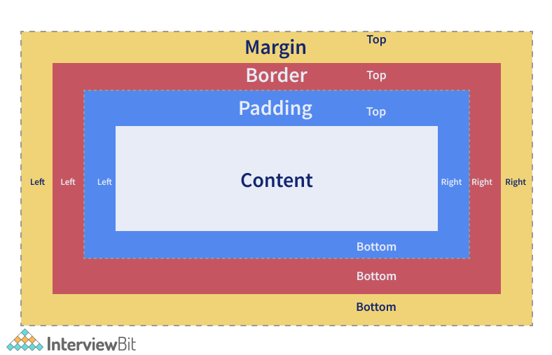

### 49. Cách để tự động đánh số giá trị heading của section và category?

Ta có thể dùng khái niệm CSS counter (bộ đếm). Điều này cho phép chúng ta điều chỉnh hình thức của nội dung dựa trên vị trí trong document. Để sử dụng nó, trước tiên chúng ta cần khởi tạo giá trị của thuộc tính `counter-reset`, giá trị này là 0 theo mặc định. Thuộc tính tương tự cũng được sử dụng để thay đổi giá trị thành bất kỳ số nào mà chúng ta cần. Sau khi khởi tạo, giá trị của bộ đếm có thể tăng hoặc giảm bằng cách sử dụng thuộc tính `counter-increment`. Tên của bộ đếm không được là các từ khóa CSS như `none`, `initial`, `inherit`, v.v. Nếu các từ khóa CSS được sử dụng, thì khai báo sẽ bị bỏ qua.

Ví dụ:

```css
body {
  	counter-reset: header;   /* define counter named 'header' whose initial value is 0 by default */
}

h2::before {
	counter-increment: header;   /* The value of header counter by 1.*/
	content: "Header " counter(header) ": ";  /* To display word Header and the value of the counter with colon before it.*/
}
```

### 50. Sự khác biệt giữa nth-child() và nth-of-type()?

Cả hai đều là pseudo-classes.

`nth-child()` được dùng để so khớp các phần tử dựa trên số đại diện cho vị trí của một phần tử dựa trên các phần tử anh chị em.

Ví dụ, trong đoạn code dưới đây, ta cung cấp `nth-child(4)` thì phần tử con thứ 4 sẽ được chọn bất kể loại. 

```css
.example:nth-child(4) {   
    background: black; 
}
```

```html
<div class="example">
	<p>This is a paragraph.</p>
	<p>This is a paragraph.</p>
	<p>This is a paragraph.</p>
	<div>This is a div.</div> <!-- 4th Element to select and apply style-->
	<div>This is a div.</div> 
	<p>This is a paragraph.</p>
	<p>This is a paragraph.</p>
	<div>This is a div.</div>
</div>
```

`nth-of-type()` cũng tương tự nhưng chỉ so khớp với các phần tử anh chị em cùng loại. Số để xác định trong `nth-of-type()` có thể là một hàm hoặc từ khoá như odd hay even.

Ví dụ: nếu ta cấp `p:nth-of-type(even)` thì các thẻ `<p>` và số thứ tự chẵn được áp dụng. 

```css
.example p:nth-of-type(even) { 
    background: black; 
}
```

```html
<div class="example">
	<p>This is a paragraph.</p> 
	<p>This is a paragraph.</p> <!-- Select this and apply style-->
	<p>This is a paragraph.</p> 
	<div>This is a div.</div>
	<div>This is a div.</div> 
	<p>This is a paragraph.</p> <!-- Select this and apply style-->
	<p>This is a paragraph.</p> 
	<div>This is a div.</div>
	<p>This is a paragraph.</p> <!-- Select this and apply style-->
	<div>This is a div.</div>
</div>
```

### 51. CSS Sprite là gì?

CSS Sprite dùng cho kết hợp nhiều hình ảnh thành một hình ảnh lớn. Nó thường dùng cho biểu diễn icons. Các ưu điểm của nó là:

- Giảm số lượng yêu cầu HTTP để lấy nhiều ảnh vì nó cho phép chỉ gửi một yêu cầu.
- Nó giúp tải trước các nội dung giúp hiển thị các icon hoặc hình ảnh khi di chuột và các pseudo-state khác.
- Khi có nhiều hình ảnh, trình duyệt sẽ thực hiện các lệnh gọi riêng biệt để lấy hình ảnh cho từng hình ảnh đó.

Sử dụng sprites, các hình ảnh được kết hợp thành một và chúng ta chỉ cần gọi hình ảnh đó bằng một lệnh gọi.

Hãy xem xét một ví dụ trong đó ứng dụng của chúng ta yêu cầu 3 hình ảnh như hình dưới đây (Không có Section Sprites). Nếu chúng ta đang cố gắng tải các hình ảnh một cách độc lập, chúng ta cần 3 yêu cầu HTTP khác nhau để lấy dữ liệu. Nhưng nếu chúng ta có CSS Sprites trong đó cả 3 hình ảnh được kết hợp thành 1 được phân tách bằng một số khoảng trắng, thì chúng ta chỉ yêu cầu 1 HTTP Request.

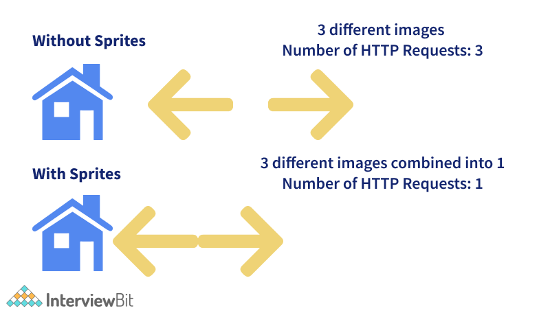

```html
<!DOCTYPE html>
<html>
	<head>
		<style>
			#home-icon {
				left: 0px;
				width: 46px;
				background: url('spriteFile.gif') 0 0;
			}

			#prev-icon {
				left: 63px;
				width: 43px;
				background: url('spriteFile.gif') -47px 0;
			}

			#next-icon {
				left: 129px;
				width: 43px;
				background: url('spriteFile.gif') -91px 0;
			}
		</style>
	</head>
	<body>

		    <!-- To display home icon here -->
		    <!-- To display next icon icon here -->
		    <!-- To display previous icon icon here -->

	</body>
</html>
```

Trong đoạn code trên, chúng ta đang cố gắng truy cập từng phần tử - `home`, `previous` và `next` - từ file sprite bằng cách sử dụng thuộc tính left, width. Hình ảnh được hiển thị trong phần img nhờ thuộc tính `background`. Lưu ý rằng nguồn của hình ảnh (thuộc tính `src` của thẻ img) chỉ là một file là `spriteFile.gif` và tùy thuộc vào các quy tắc được chỉ định trong id selector, hình ảnh được tải tương ứng.

### 52. Tweening trong CSS?

Tweening là quá trình lấp đầy khoảng trống giữa các chuỗi khóa, tức là giữa các keyframes đã được tạo. Keyframes là những frame đại diện cho điểm bắt đầu và điểm kết thúc của hành động hoạt ảnh. Tweening liên quan đến việc tạo keyframe giữa hai hình ảnh để tạo ấn tượng rằng hình ảnh đầu tiên đã di chuyển mượt mà sang hình ảnh thứ hai. Với mục đích này, chúng ta sử dụng các thuộc tính như transforms - matrix, translate, scale, rotate,...

Trong đoạn code bên dưới, ta tạo frame trung gian của các phần tử `<p>` để chuyển từ đầu đến phía bên trái của trình duyệt.

```css
p {
	animation-duration: 2s;
	animation-name: slidethrough;
}

@keyframes slidethrough {
	from {
		margin-left: 100%;
		width: 300%; 
	}

	to {
		margin-left: 0%;
		width: 100%;
	}
}
```

Ở đây, phần tử đoạn văn chỉ định rằng quá trình hoạt ảnh sẽ mất 2 giây để thực hiện từ đầu đến cuối. Điều này được thực hiện bằng cách sử dụng thuộc tính `animation-duration`. Tên hoạt ảnh của `@keyframes` được xác định bằng cách sử dụng thuộc tính `animation-name`. Keyframe trung gian được xác định bằng cách sử dụng quy tắc `@keyframes`. 

Trong ví dụ, chúng ta chỉ có 2 keyframe. Keyframe đầu tiên bắt đầu ở `0%` và chạy cho đến lề trái `100%`, là cạnh ngoài cùng bên phải của phần tử container. Keyframe thứ hai bắt đầu ở `100%` trong đó lề trái được đặt là `0%` và chiều rộng được đặt là `100%`, kết quả là kết thúc hoạt ảnh nghiêng về phía bên trái của container.

### 53. DOM là gì và cách nó liên kết với CSS?

DOM (Document Object Model) là một interface lập trình cho HTML và XML. Nó xác định cấu trsuc của document và cách mà document được hiển thị và quản lý. Document này cho phép javascript truy cập và quản lý phần tử và style của web. Mô hình được xây dựng theo cấu trúc cây đối tượng và xác định:
- Các phần tử HTML là đối tượng
- Thuộc tính của tất cả phần tử HTML
- Phương thức truy cập đến tất cả phần tử HTML
- Sự kiện với tất cả phần tử HTML

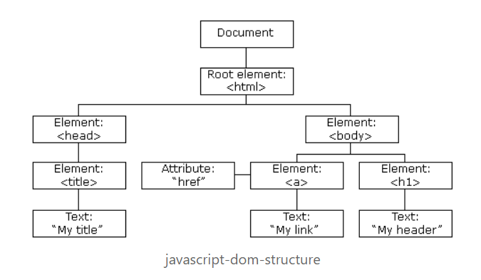

#### DOM Document

Là chủ sở hữu tất cả đối tượng trong web. Nếu bạn muốn truy cập đến bất kỳ phần tử nào đều phải bắt đầu với document. Nó còn chứa các thuộc tính và phương thức quan trọng cho truy cập và chỉnh sửa trang web.

#### Tìm kiếm phần tử HTML

| Phương thức | Mô tả |
|-|-|
| getElementById() | Dùng để lấy các phần tử đơn theo id |
| getElementsByClassName() | Dùng để lấy mảng phần tử theo tên lớp |
| getElementsByTagName() | Dùng để lấy phần tử đơn theo tên tag |
| querySelector()| Trả về phần tử đầu tiến ứng với một Selector cụ thể. Nó có thể lấy theo id, lớp, tag hay bất cứ selector nào hợp lệ trong CSS |
| querySelectorAll() | Giống với querySelector() ngoại trừ việc nó trả về tất cả phần tử phù hợp với CSS Selector |

#### Thay đổi phần tử HTML

Thuộc tính innerHTML có thể dùng cho thay đổi nội dung của phần tử HTML. Trong ví dụ này ta lấy phần tử với id của header và thiết lập nội dung trong nó là "Hello World"

```js
// Example: Using text
document.getElementById("#header").innerHTML = "Hello World!";

// Example: Using text with tag
document.getElementsByTagName("div").innerHTML = "<h1>Hello World!</h1>"
```

##### Thay đổi giá trị thuộc tính

Ta cũng có thể thay đổi giá trị thuộc tính như sau:

```js
document.getElementsByTag("img").src = "image.jpg";
```

##### Thay đổi style

Để đổi style cho một phần tử HTML ta cần thay đổi thuộc tính style của phần tử. Ta có thể viết như sau:

```js
document.getElementsByTag("h1").style.borderBottom = "solid 3px #000";
```

##### Thêm và xoá phần tử

**Thêm phần tử**: tạo một phần tử div sử dụng phương thức `createElement()`  để lấy tên tag như tham số và lưu nó vào biến. Sau đó ta thêm nội dung và chèn nó vào DOM

```js
var div = document.createElement("div");

var newContent = document.createTextNode("Hello World!"); 
div.appendChild(newContent);
document.body.insertBefore(div, currentDiv);
```

Ở đây ta dùng phương thức `createTextNode()` để lấy một chuỗi làm tham số sau đó chèn phần tử div mới trước một div đã tồn tại trong document.

**Xoá phần tử**: dùng phương thức `removeChild()`

```js
var elem = document.querySelector('#header');
elem.parentNode.removeChild(elem);
```

**Thay thế phần tử**

```js
var div = document.querySelector('#div');
var newDiv = document.createElement('div');

newDiv.innerHTML = "Hello World2";
div.parentNode.replaceChild(newDiv, div);
```

Ở đây ta dùng phương thức `replaceChild()` nhận tham số thứ nhất là phần tử mới và tham số thứ hai là phần tử cần thay thế.

#### Viết trức tiếp vào HTML output string

Ta có thể viết biểu thức HTML và JS trức tiếp vào HTML output stream bằng cách phương thức `write()`. Phương thức `write()` có thế nhận nhiều tham số sẽ xuất hiện trong document theo thứ tự của chúng.

```js
// HTML Content
document.write("<h1>Hello World!</h1><p>This is a paragraph!</p>");

// date object
document.write(Date());
```

#### Xử lý sự kiện

HTML DOM cho phép JavaScript phản ứng với sự kiện HTML, ví dụ tải trang, nhập trường input, click chuột,...

**Gán sự kiện**

```js
document.getElementById("btn").onclick = changeText();
```

**Lắng nghe sự kiện**

```js
document.getElementById("btn").addEventListener('click', runEvent);
```

#### Quan hệ giữa các nút

Các nút(node) trong DOM có hệ phân cấp quan hệ với các nút khác. Điều này có nghĩa là nút được cấu trúc như cây. Ta sử dụng thuật ngữ nút cha, nút anh và nút con để mô tả mối quan hệ giữa chúng.

Nút cao nhất được gọi là root và không có cha. Root trong HTML thường là thẻ `<tag>` vì nó không có thẻ nào trên nó.

Để di chuyển giữa các nút, ta có thể dùng các thuộc tính:

- parentNode
- childNodes
- firstChild
- lastChild
- nextSibling

Ví dụ:

```js
var parent = document.getElementById("heading").parentNode
```

### 54. Chi tiết cách CSS hoạt động?

Ngôn ngữ CSS được thiết kế để sử dụng cùng với ngôn ngữ "đánh dấu" như HTML. CSS xác định cách các phần tử HTML được định dạng - kiểm soát bố cục, màu sắc, phông chữ của chúng, ... Khi trình duyệt hiển thị một document, nó phải kết hợp nội dung của document với thông tin style của nó. Nó xử lý document theo một số giai đoạn, mà chúng ta đã liệt kê bên dưới.

1. Trình duyệt tải HTML (ví dụ: nhận nó từ mạng).
2. Nó chuyển đổi HTML thành DOM.
3. Sau đó, trình duyệt sẽ tìm nạp hầu hết các tài nguyên được liên kết với tài liệu HTML, chẳng hạn như hình ảnh và video được nhúng và CSS được liên kết.
4. Trình duyệt phân tích cú pháp CSS đã nạp và sắp xếp các quy tắc khác nhau theo kiểu selector của chúng thành các "nhóm" khác nhau, ví dụ: phần tử, lớp, ID, ... Dựa trên các selector mà nó tìm thấy, nó sẽ tìm ra các quy tắc nên được áp dụng cho các nút nào trong DOM và đính kèm kiểu cho chúng theo yêu cầu (bước trung gian này được gọi là cây render).
5. Cây render được bố trí trong cấu trúc mà nó sẽ xuất hiện sau khi các quy tắc đã được áp dụng cho nó.
6. Hiển thị trực quan của trang được hiển thị trên màn hình.

Sơ đồ sau đây cũng cung cấp một cái nhìn đơn giản về quy trình:

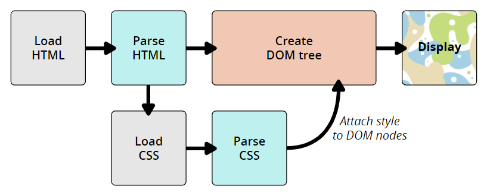

#### DOM và CSSOM

DOM có cấu trúc giống như cây. Mỗi phần tử, thuộc tính và đoạn văn bản trong ngôn ngữ đánh dấu sẽ trở thành một nút DOM trong cấu trúc cây. Các nút được xác định bởi mối quan hệ của chúng với các nút DOM khác. Một số phần tử là nút cha của các nút con và các nút con có anh chị em. Trình duyệt trải qua một quá trình bao gồm conversion, tokenization, lexing và parsing, cuối cùng tạo nên DOM và CSSOM.

- **Conversion**: Đọc các byte raw của HTML và CSS trên đĩa hoặc mạng.
- **Tokenization**: Chia nhỏ đầu vào thành nhiều đoạn (ví dụ: thẻ bắt đầu, thẻ kết thúc, tên thuộc tính, giá trị thuộc tính), loại bỏ các ký tự không liên quan như khoảng trắng và ngắt dòng.
- **Lexing**: Giống như tokenizer, nhưng nó cũng xác định loại của mỗi mã thông báo (một số, một chuỗi ký tự hay một toán tử bình đẳng).
- **Parsing**: Lấy dòng mã thông báo từ lexer, diễn giải mã thông báo bằng cách sử dụng một ngữ pháp cụ thể và biến nó thành một cây cú pháp trừu tượng.

Ví dụ:

```html
<p>
  Let's use:
  <span>Cascading</span>
  <span>Style</span>
  <span>Sheets</span>
</p>
```

Trong DOM, nút tương ứng với phần tử `<p>` là cha. Các con của nó là nút text và 3 nút tương ứng là phần tử `<span>`. Quan hệ phân cấp của nó như sau:

```
P
├─ "Let's use:"
├─ SPAN
|  └─ "Cascading"
├─ SPAN
|  └─ "Style"
└─ SPAN
   └─ "Sheets"
```

Áp dụng CSS vào DOM:

```css
span {
  border: 1px solid black;
  background-color: lime;
}
```

Khi cả hai cấu trúc cây được tạo, công cụ render sau đó sẽ gắn các cấu trúc dữ liệu vào cái được gọi là cây render như một phần của quá trình bố trí. Cây render là một biểu diễn trực quan của document cho phép vẽ nội dung của trang theo đúng thứ tự của chúng.

Cây render xây dựng theo thứ tự sau:

- Bắt đầu từ gốc của cây DOM, đi qua từng nút hiển thị.
- Bỏ qua các nút không hiển thị.
- Đối với mỗi nút hiển thị, hãy tìm các quy tắc CSSOM phù hợp và áp dụng chúng.
- Phát ra các nút hiển thị với nội dung và kiểu tính toán của chúng.
- Cuối cùng, xuất một cây render chứa cả thông tin nội dung và style của tất cả nội dung hiển thị trên màn hình.