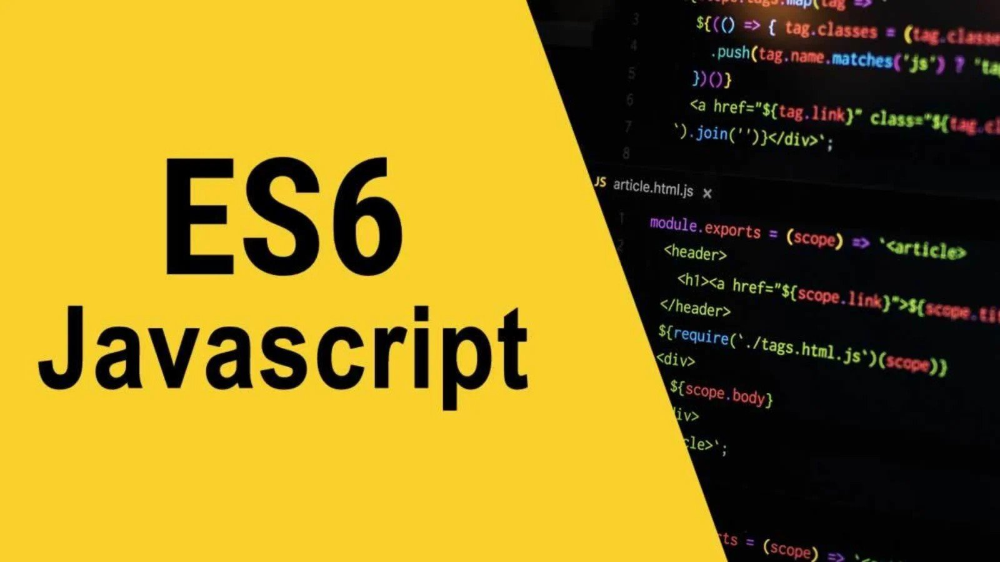

# Câu hỏi phỏng vấn ES6


## ES6 là gì?

ECMAScript, hay ES6, đã được xuất bản vào tháng 6 năm 2015. Sau đó nó được đổi tên thành ECMAScript 2015. Các trình duyệt web hỗ trợ đầy đủ cho ngôn ngữ vẫn chưa hoàn thành, mặc dù việc hỗ trợ cho các phần chính đã được tiến hành. Các trình duyệt web chính hỗ trợ một số tính năng của ES6. Tuy nhiên, có thể sử dụng phần mềm được gọi là trình chuyển đổi để chuyển đổi code ES6 thành ES5, vì ES5 được hỗ trợ tốt hơn trên hầu hết các trình duyệt.

## Mục lục

[1. Các tính năng nổi bật của ES6?](#1-c%C3%A1c-t%C3%ADnh-n%C4%83ng-n%E1%BB%95i-b%E1%BA%ADt-c%E1%BB%A7a-es6)

[2. Hỗ trợ hướng đối tượng trong ES6 như thế nào?](#2-h%E1%BB%97-tr%E1%BB%A3-h%C6%B0%E1%BB%9Bng-%C4%91%E1%BB%91i-t%C6%B0%E1%BB%A3ng-trong-es6-nh%C6%B0-th%E1%BA%BF-n%C3%A0o)

[3. Sự khác biệt giữa ES5 và ES6?](#3-s%E1%BB%B1-kh%C3%A1c-bi%E1%BB%87t-gi%E1%BB%AFa-es5-v%C3%A0-es6)

[4. Sự khác biệt giữa let và const?](#4-s%E1%BB%B1-kh%C3%A1c-bi%E1%BB%87t-gi%E1%BB%AFa-let-v%C3%A0-const)

[5. Thảo luận về hàm arrow?](#5-th%E1%BA%A3o-lu%E1%BA%ADn-v%E1%BB%81-h%C3%A0m-arrow)

[6. Khi nào không nên dùng hàm arrow?](#6-khi-n%C3%A0o-kh%C3%B4ng-n%C3%AAn-d%C3%B9ng-h%C3%A0m-arrow)

[7. Hàm generator là gì?](#7-h%C3%A0m-generator-l%C3%A0-g%C3%AC)

[8. Toán tử spread trong ES6?](#8-to%C3%A1n-t%E1%BB%AD-spread-trong-es6)

[9. Giải thích về destructuring trong ES6?](#9-gi%E1%BA%A3i-th%C3%ADch-v%E1%BB%81-destructuring-trong-es6)

[10. Promise trong ES6 là gì?](#10-promise-trong-es6-l%C3%A0-g%C3%AC)

[11. Giải thích về Rest parameter trong ES6?](#11-gi%E1%BA%A3i-th%C3%ADch-v%E1%BB%81-rest-parameter-trong-es6)

[12. Thảo luận về template literal trong ES6?](#12-th%E1%BA%A3o-lu%E1%BA%ADn-v%E1%BB%81-template-literal-trong-es6)

[13. Ưu điểm của class trong ES6?](#13-%C6%B0u-%C4%91i%E1%BB%83m-c%E1%BB%A7a-class-trong-es6)

[14. Cách tạo class trong ES6](#14-c%C3%A1ch-t%E1%BA%A1o-class-trong-es6)

[15. Biểu thức lớp là gì?](#15-bi%E1%BB%83u-th%E1%BB%A9c-l%E1%BB%9Bp-l%C3%A0-g%C3%AC)

[16. Tham số mặc định là gì?](#16-tham-s%E1%BB%91-m%E1%BA%B7c-%C4%91%E1%BB%8Bnh-l%C3%A0-g%C3%AC)

[17. Bạn hiểu gì về IIFE?](#17-b%E1%BA%A1n-hi%E1%BB%83u-g%C3%AC-v%E1%BB%81-iife)

[18. Các trạng thái của Promise trong ES6?](#18-c%C3%A1c-tr%E1%BA%A1ng-th%C3%A1i-c%E1%BB%A7a-promise-trong-es6)

[19. Export Default và Name Export trong ES6?](#19-export-default-v%C3%A0-name-export-trong-es6)

[20. Từ khoá nào dùng cho kế thừa trong ES6?](#20-t%E1%BB%AB-kho%C3%A1-n%C3%A0o-d%C3%B9ng-cho-k%E1%BA%BF-th%E1%BB%ABa-trong-es6)

[21. Bubbling và Capturing là gì?](#21-bubbling-v%C3%A0-capturing-l%C3%A0-g%C3%AC)

[22. Sự khác biệt giữa for...of và for..in?](#22-s%E1%BB%B1-kh%C3%A1c-bi%E1%BB%87t-gi%E1%BB%AFa-forof-v%C3%A0-forin)

[23. Symbol trong ES6 là gì?](#23-symbol-trong-es6-l%C3%A0-g%C3%AC)

[24. Babel là gì?](#24-babel-l%C3%A0-g%C3%AC)

[25. Tên các phương thức mảng có trong ES6](#25-t%C3%AAn-c%C3%A1c-ph%C6%B0%C6%A1ng-th%E1%BB%A9c-m%E1%BA%A3ng-c%C3%B3-trong-es6)

[26. Tên các hàm chuỗi có trong ES6?](#26-t%C3%AAn-c%C3%A1c-h%C3%A0m-chu%E1%BB%97i-c%C3%B3-trong-es6)

[27. So sánh code ES5 và ES6 cho tạo và tách đối tượng?](#27-so-s%C3%A1nh-code-es5-v%C3%A0-es6-cho-t%E1%BA%A1o-v%C3%A0-t%C3%A1ch-%C4%91%E1%BB%91i-t%C6%B0%E1%BB%A3ng)

[28. Hoán vị với Destrucuring Assignment?](#28-ho%C3%A1n-v%E1%BB%8B-v%E1%BB%9Bi-destrucuring-assignment)

[29. Kết quả của toán tử spread ở code bên dưới?](#29-k%E1%BA%BFt-qu%E1%BA%A3-c%E1%BB%A7a-to%C3%A1n-t%E1%BB%AD-spread-%E1%BB%9F-code-b%C3%AAn-d%C6%B0%E1%BB%9Bi)

[30. Prototype Design Pattern với ES6?](#30-prototype-design-pattern-v%E1%BB%9Bi-es6)

[31. WeakMap trong ES6 là gì? Nó khác Map như thế nào?](#31-weakmap-trong-es6-l%C3%A0-g%C3%AC-n%C3%B3-kh%C3%A1c-map-nh%C6%B0-th%E1%BA%BF-n%C3%A0o)

[32. Lợi thế của hàm khởi tạo với cú pháp arrow?](#32-l%E1%BB%A3i-th%E1%BA%BF-c%E1%BB%A7a-h%C3%A0m-kh%E1%BB%9Fi-t%E1%BA%A1o-v%E1%BB%9Bi-c%C3%BA-ph%C3%A1p-arrow)

[33. Temporal Dead Zone là gì?](#33-temporal-dead-zone-l%C3%A0-g%C3%AC)

[34. Sự khác biệt giữa Set và WeakSet trong ES6?](#34-s%E1%BB%B1-kh%C3%A1c-bi%E1%BB%87t-gi%E1%BB%AFa-set-v%C3%A0-weakset-trong-es6)

[35. Proxy trong ES6 là gì?](#35-proxy-trong-es6-l%C3%A0-g%C3%AC)

[36. Sự khác biệt giữa const và Object.freeze()?](#36-s%E1%BB%B1-kh%C3%A1c-bi%E1%BB%87t-gi%E1%BB%AFa-const-v%C3%A0-objectfreeze)

[37. Tại sao đoạn code này không hoạt động như một IIFE? Điều gì cần được sửa đổi để nó được phân loại là IIFE?](#37-t%E1%BA%A1i-sao-%C4%91o%E1%BA%A1n-code-n%C3%A0y-kh%C3%B4ng-ho%E1%BA%A1t-%C4%91%E1%BB%99ng-nh%C6%B0-m%E1%BB%99t-iife-%C4%91i%E1%BB%81u-g%C3%AC-c%E1%BA%A7n-%C4%91%C6%B0%E1%BB%A3c-s%E1%BB%ADa-%C4%91%E1%BB%95i-%C4%91%E1%BB%83-n%C3%B3-%C4%91%C6%B0%E1%BB%A3c-ph%C3%A2n-lo%E1%BA%A1i-l%C3%A0-iife)

[38. Giải thích về Internationalization và Localization?](#38-gi%E1%BA%A3i-th%C3%ADch-v%E1%BB%81-internationalization-v%C3%A0-localization)

[39. Webpack là gì?](#39-webpack-l%C3%A0-g%C3%AC)

## Câu hỏi phỏng vấn ES6 dành cho Fresher

### 1. Các tính năng nổi bật của ES6

* Hỗ trợ các biến hằng
* Block scope hỗ trợ cho tất cả biến, hằng, và hàm
* Giới thiệu hàm arrow
* Xử lý tham số mở rộng
* Tham số mặc định
* Các ký tự mở rộng và mẫu
* Promise
* Class
* Module
* Tập hợp
* Hỗ trợ map/set

### 2. Hỗ trợ hướng đối tượng trong ES6 như thế nào?

- **Classes** có thể tạo lớp trong ES6. Về cơ bản, hàm lớp xây dựng một khuôn mẫu mà từ đó ta có thể tạo các đối tượng. Khi tạo một thực thế mới của lớp, phương thức constructor sẽ được gọi.

- **Methods** phương thức tĩnh có thể được tìm thấy trong các lớp. Một phương thức tĩnh không giống như một đối tượng mà nó là một hàm được liên kết với lớp. Một phương thức tĩnh không thể được gọi từ một thực thể của lớp.

Ta hãy xem qua getter và setter nhé.
Đóng gói là một khái niệm căn bản trong OOP. Dữ liệu (thuộc tính) sẽ không được truy cập trực tiếp từ bên ngoài, đây là một khía cạnh quan trọng của đóng gói. Một getter (truy cập) hay setter (chỉnh sửa) là những phương thức của thực thể đã xác định để truy cập hay chỉnh sửa một thuộc tính.

- **Tính kế thừa**, các lớp cũng có thể kế thừa từ nhau. Lớp cha là lớp kế thừa và con là lớp được kế thừa từ lớp cha.

### 3. Sự khác biệt giữa ES5 và ES6

| ES5 | ES6 |
|-----|-----|
| Là chuẩn thứ 5 của ECMAScript được giới thiệu năm 2009 | Là chuẩn thứ 6 của ECMAScript được giới thiệu năm 2015 |
| Kiểu dữ liệu nguyên thuỷ là string, boolean, number, null và undefined | Giới thiệu thêm kiểu symbol |
| Chỉ có thể khai báo biến với var | Có thể dùng var, và hai cách khai báo biến mới là let và const |
| Sử dụng function để khai báo hàm | Giới thiệu thêm hàm arrow |
| for cho vòng lặp | Giới thiệu thêm for...of |

### 4. Sự khác biệt giữa let và const? 

Cả let và const đều có block scope. Nếu bạn sử dụng các từ khóa này để khai báo một biến, biến đó sẽ chỉ tồn tại trong block trong cùng bao quanh chúng. Nếu bạn khai báo một biến với let bên trong một block (ví dụ: nếu một điều kiện hoặc một vòng lặp for), thì nó chỉ có thể được truy cập trong block đó.

Các biến được khai báo với từ khóa let có thể thay đổi, có nghĩa là giá trị của chúng có thể được thay đổi. Nó tương tự như từ khóa var, nhưng với lợi ích bổ sung là block scope. Các biến được khai báo với từ khóa const là block scope và bất biến. Khi các biến được khai báo với từ khóa const, giá trị của chúng không thể được sửa đổi hoặc gán lại.

### 5. Thảo luận về hàm arrow

Trong ES6, hàm arrow là một cú pháp mới cho khai báo hàm. hàm arrow bao gồm tham số theo sau mũi tên (=>) và thân hàm.

```js
const function_name = (arg_1, arg_2, arg_3, ...) => {  
    //body of the function  
}
```

Các điều cần nhớ:
- Nó tiết kiệm kích cỡ code.
- Với hàm một dòng, lênh return là không bắt buộc.
- Ràng buộc ngữ cảnh.
- Với hàm một tham số, dấu ngoặc đơn là không bắt buộc.
- Không hoạt động với `new`.

### 6. Khi nào không nên dùng hàm arrow?

Không nên sử dụng hàm arrow cho các trường hợp dưới đây:

#### Function Hoisting, Named Functions:

Một hàm arrow là ẩn danh, ta khong thể dùng chúng khi muốn hoisting hay khi cần dùng khi dùng named function (hàm có chỉ định rõ kiểu dữ liệu của tham số đầu vào)

#### Phương thức đối tượng:

```js
var a = {
    b: 7,
    func: () => {
        this.b--;
    }
}
```

Giá trị của b không giảm khi bạn gọi `a.func`. Vì nó không được liên kết đến bất cứ cái gì và sẽ kế thừa giá trị từ scope cha của nó.

#### Callback function với ngữ cảnh động

```js
var btn = document.gêtlementById('clickMe');
btn.addEventListener('click', () => {
    this.classList.toggle('on');
});
```

Ta sẽ nhận về lỗi `TypeError` khi click button. Vì sự thực là nó được liên kết đến scope cha thay vì button.

#### this/aguments:

Vì hàm arrow không có `this` của nó và nó phụ thuộc vào ngữ cảnh bên ngoài nên ta cũng không thể dùng chúng trong trường hợp ta cần dùng `this` trong hàm.

### 7. Hàm generator là gì?

Là tính năng mới được giới thiệu trong ES6. Hàm Generator trả về một đối tượng sau khi tạo nhiều giá trị theo thời gian. Ta có thể lặp qua đối tượng và trích xuất từng giá trị từ hàm một. Một hàm trả về một đối tượng được lặp đi lặp lại gọi là hàm generator. Trong ES6, cú pháp cho nó là `fuction*` cùng từ khoá `yield` bên trong nó.

```js
function *Numbers() {
    let num = 1;
    while(true) {
        yield num++;
    }
}
  
var gen = Numbers();
 
// Loop to print the first
// 5 Generated numbers
for (var i = 0; i < 5; i++) {
 
    // Generate the next number
    document.write(gen.next().value);
 
    // New Line
    document.write("<br>");
}
```

Kết quả:

```
1
2
3
4
5
```

Giá trị yield trở thành giá trị kế tiếp trong chuỗi tuần tự mỗi lần yield được gọi. Ngoài ra, hàm generator tính toán kết quả output của chúng theo yêu cầu, cho phép chúng biểu diễn một cách hiệu quả các chuỗi tuần tự dài hơn thậm chí là vô hạn.

### 8. Toán tử spread trong ES6?

Toán tử spread có cú pháp giống với rest parameters tuy nhiên cả hai có ý nghĩa khác nhau. Rest parameters được sử dụng khi khai báo hàm, ngược lại toán tử spread được sử dụng trong các câu lệnh, biểu thức hoặc khi gọi hàm.

ES6 cung cấp một toán tử mới gọi là toán tử spread bao gồm ba dấu chấm (...). Spread cho phép bạn trải ra các phần tử của một đối tượng có thể lặp lại chẳng hạn như một array, map hoặc set.

```js
let arr1 = [4, 5, 6];  
    
let arr2 = [1, 2, 3, ...arr1, 7, 8, 9, 10];  
    
console.log(arr2);
```

Kết quả:

```
[ 1 2 3 4 5 6 7 8 9 10 ]
```

### 9. Giải thích về destructuring trong ES6?

Destructuring được giới thiệu trong ES6 là một cách để trích xuất dữ liệu từ mảng hay đối tượng thành các biến duy nhất. Ta có thể tạo các đoạn nhỏ hơn từ đối tượng hay mảng bằng phương thức này. Ví dụ:

```js
let greeting = ["Good", "Morning"];
let [g1, g2] = greeting;
console.log(g1, g2);
```

Kết quả:

```
Good Morning
```

### 10. Promise trong ES6 là gì?

Lập trình bất đồng bộ là khái niệm quan trọng trong JavaScript. Các tiến trình chạy độc lập với luồng chính trong lập trình bất đồng bộ. Promise là cách tiếp cận tiện lợi để xử lý lập trình bất đồng bộ trong ES6. Callback được dùng để chủ yếu trong bất đồng bộ trước khi ES6 giới thiệu về Promise.

Tuy nhiên, vì callback dễ gây ra callback hell, nên hướng giải quyết cho nó là dùng promise thay thế.

**Callback hell**

```js
f1(function(x){
    f2(x, function(y){
        f3(y, function(z){ 
            ...
        });
    });
}); 
```

**Cú pháp Promise**

```js
const promise = new Promise((resolve,reject) => {....}); 
```

Ví dụ:

```js
const myPromise = new Promise((resolve, reject) => {
    if (Math.random() > 0) {
        resolve('Hello, I am positive number!');
    }
    reject(new Error('I failed some times'));
})
```

### 11. Giải thích về Rest parameter trong ES6?

Rest Parameters dịch theo tiếng Anh chuyên ngành công nghệ thông tin có nghĩa là tham số còn lại, điều này có nghĩa là bạn có thể khai báo một hàm với số lượng tham số không xác định, đây là một tính năng mới trong ES6 khiến Javascript ngày càng trở nên mạnh mẽ hơn.

```js
function display(...args) {  
    let ans = 0;  
    for (let i of args) {  
        ans *= i;  
    }  
    console.log("Product = "+ans);  
}  
    
display(4, 2, 3);
```

Kết quả:

```
Product = 24
```

### 12. Thảo luận về template literal trong ES6?

Temaplate Literals là một cú pháp mới dùng để khai báo biến, được thêm vào trong phiên bản ES6. Khi sử dụng cú pháp này các bạn có thể:
- Khai báo biến nhiều dòng một cách hết sức đơn giản. (Nếu bạn sử dụng cách truyền thống thì sẽ không thể nào khai báo được một biến mà có sử dụng ký tự xuống dòng, nhưng với template thì có thể).
- Binding biến vào trong template một cách dễ dàng.

Ký tự `` dùng để mở và đóng template literal. Ký hiệu dollar và dấu ngoặc nhọn "${}" được dùng để đặt một biến vào template literal.

```js
let s1 = "Good";  
  
let s2 = "Day";  
   
let s = `${s1} ${s2}`;  
console.log(s);
```

Kết quả:

```
Good Day
```

### 13. Ưu điểm của class trong ES6?

Các ưu điểm của class ở ES6:
- Cú pháp đơn giản và ít lỗi hơn.
- Khi xây dựng một hệ phân cấp kế thừa, ES6 kết hợp cú pháp cũ và mới, làm giảm lỗi và đơn giản hoá các quy trình.
- Class trong ES6 ngăn chặn lỗi do toán tử `new`. Nếu một đối tượng không hợp lệ khởi tạo, class sẽ loại trừ vấn đề này bằng cách để constructor trả về lỗi.
- Class còn gọi một phương thức từ prototype. Với cú pháp ES6, nó dễ dùng hơn các phiên bản trước.

### 14. Cách tạo class trong ES6?

Từ khoá `class` dùng cho tạo lớp trong ES6. Ta có thể dùng biểu thức lớp hoặc khai báo lớp để tạo. Chỉ có hàm và contrustor là được cho phép trong lớp. Các thành phần này gọi chung là thuộc tính dữ liệu của lớp.

Constructor trong lớp có trách nhiệm cấp phát bộ nhớ cho đối tượng của lớp. Hàm của lớp chịu trách nhiệm thực hiện các hành động trên đối tượng.

Cú pháp ở ES5

```js
var varName = new className {
    // something
}
```

Cú pháp ở ES6

```js
class className {
    // Something
}
```

### 15. Biểu thức lớp là gì?

Trong ES6, một cách khác để khai báo lớp là dùng biểu thức lớp. Giống như một biểu thức hàm, có thể có tên hoặc không. Nếu có tên, tên đó là duy nhất trong thân lớp. 

```js
var Product = class {
    constructor (num1, num2) {
    this.num1 = num1;
    this.num2 = num2;
    }
    multiplication() {
    return this.num1 * this.num2;
    }
}
console.log(new Product(5,8).multiplication());
// expected output: 40
```

Cú pháp của một biểu thức lớp tương tự như cú pháp của một câu lệnh lớp (khai báo). Mặt khác, các biểu thức lớp cho phép bạn bỏ qua tên lớp ("định danh ràng buộc"), điều này không thể thực hiện được với các câu lệnh lớp. Ngoài ra, không giống như khai báo lớp, biểu thức lớp cho phép bạn khai báo lại các lớp mà không gây ra bất kỳ lỗi kiểu nào. Nó không bắt buộc phải sử dụng thuộc tính constructor. Loại lớp được tạo bằng từ khóa này sẽ luôn là "function".

### 16. Tham số mặc định là gì?

Nếu không có giá trị nào được truyền cho tham số, ta có thể dùng tham số mặc định để thiết lập giá trị mặc định cho tham số.

```js
var display = (x , y = 2) => {  
    console.log(x + " " + y);  
}  
display(1);
```

Kết quả:

```
1 2
```

### 17. Bạn hiểu gì về IIFE?

IIFE là hàm JavaScript chạy ngay khi được khai báo. Nó được chia thành hai phần chính là:
- Phần đầu tiên là một hàm ẩn danh lexical scope, được bao bọc bởi `()`.
- Phần thứ hai là dấu ngoặc `()` dùng để chạy hàm ngay sau khi khai báo.

```js
(function () {    
   console.log("Good Day");     
})();
```

### 18. Các trạng thái của Promise trong ES6?

Khi được khởi tạo thì Promise có một trong ba trạng thái sau:

- **Fulfilled**: hành động xử lý xong và thành công
- **Rejected**: hành động xử lý xong và thất bại
- **Pending**: hành động đang chờ xử lý hoặc bị từ chối

Trong đó hai trạng thái **Reject** và **Fulfilled** ta gọi là **Settled**, tức là đã xử lý xong.

### 19. Export Default và Name Export trong ES6?

Với sự hỗ trợ của lệnh import, export bây giờ khi ta cần xuất các hàm, đối tượng, và biến đến module JavaScript khác ta có hai cách sau:

- **Named Export** dùng khi export nhiều giá trị cùng lúc. Tên của module được import phải trùng với tên module export.

```js
 //file rectangle.js
function perimeter(x, y) {
    return 2 * (x + y);
}
function area(x, y) {
    return x * y;
}
export { perimeter, area };
  
   
//while importing the functions in test.js
import { perimeter, area } from './rectangle;
console.log(perimeter(4, 6)) //20
console.log(area(4, 6)) //24
```

- **Default Export** dùng khi export một module thành export mặc định. Một hàm, lớp, đối tượng hay bất cứ thứ gì cũng có thể dùng cho default export. Trong default export, tên có thể tuỳ ý miễn sao đúng file.

```js
// file module.js
var a = 6; 
export default a;
  
// test.js
// while importing a in test.js
import b from './module'; 
console.log(b);        
// output will be 6
```

- **Dùng cả hai**, trong cùng một file ta có thể dùng cả hai cách.

```js
 //index.js
var a = 3;
const b = 8;
function show() {
    return "This is a default export."
}
function product(a , b) {
    return a * b;
}
export { show as default, a, b, product };
```

```js
//test.js file
import any_other_name, { a, b, product} from './index.js';
console.log(any_other_name()); //This is a default export.
console.log(a); //3
```

### 20. Từ khoá nào dùng cho kế thừa trong ES6?

Từ khoá `extends` dùng cho triển khai kế thừa trong ES6.

```js
class Classroom {
    constructor(students) {
        this.students = students;
    }
    room() {
        console.log('This class has  ' + this.students + ' students');
    }
}
 
class sectionA extends Classroom {
    constructor(students) {
        super(students);
    }
    sec() {
        console.log('section A');
    }
}
  
let secA = new sectionA(40);
 
secA.room();
secA.sec();
```

### 21. Bubbling và Capturing là gì?

Khi một sự kiện xảy ra trong DOM, nó sẽ diễn ra hoàn toàn trên một phần tử. Sự kiện nổi lên (bubble) phần tử cha, hay tổ tiên của nó cho đến khi nó tới giai đoạn Bubbling. Trong khi đó, sự kiện bắt đầu từ ngoài window đến khi phần tử nhận sự kiện thì là giai đoạn Capturing.

### 22. Sự khác biệt giữa for...of và for..in?

- **for in** chạy trên các tên thuộc tính có thể liệt kê của một đối tượng.
- **for of** lấy một đối tượng cụ thể và lặp qua dữ liệu mà nó tạo ra.

Cả lệnh `for..of` và `for..in` đều lặp lại qua các danh sách, nhưng kết quả chúng trả về là khác nhau: `for..in` trả về danh sách các khóa trên đối tượng đang được lặp lại, trong khi `for..of` trả về danh sách các giá trị của thuộc tính của đối tượng.

```js
let arr = [3, 4, 5];

for (let i in arr) {
   console.log(i); // "0", "1", "2",
}

for (let i of arr) {
   console.log(i); // "3", "4", "5"
}
```

### 23. Symbol trong ES6 là gì?

Trong ES6 xuất hiện thêm một kiểu dữ liệu đó là Symbol, đây là kiểu dữ liệu nguyên thuỷ, nó sẽ tạo ra các ký tự duy nhất (unique) và không trả về một chuỗi mà nó chỉ là một dạng đối tượng, vì vậy bạn sẽ không thể thấy được giá trị thực của nó.

Symbol được sinh ra dùng để xử lý cho bài toán mang tính duy nhất (unique), mỗi khi bạn tạo một đối tượng Symboy thì đối tượng đó sẽ không bao giờ trùng lặp với một đối tượng khác. Cú pháp khởi tạo của Symbol.

```js
let symbol = Symbol();
```

### 24. Babel là gì?

Babel là một công cụ chuyển đổi mã lệnh JavaScript hay JavaScript transpiler, được dùng với mục đích chuyển đổi mã lệnh JavaScript được viết dựa trên tiêu chuẩn ECMAScript phiên bản mới về phiên bản cũ hơn trước đó.

Babel đảm bảo code của các lập trình viên luôn được biên dịch thành phiên bản tương thích các trình duyệt khác nhau mà không lo bị lỗi.

"Chuẩn ECMAScript được ra đời để hạn chế sự khác biệt giữa các "ngôn ngữ" JavaScript khác nhau được định nghĩa bởi các trình duyệt khác nhau".

Ví dụ, arrow function được giới thiệu ở ES6 sẽ được chuyển đổi về các function truyền thống. Nó cũng có thể chuyển đổi các cú pháp JS không chuẩn như JSX. Babel có thể tự động chèn các core-js cho các môi trường javascript không khả dụng. Ví dụ như phương thức `Array.from` hay Promise chỉ khả dụng trong ES6+, nhưng nó vẫn có thể sử dụng ở các phiên bản trước nhờ core-js.

### 25. Tên các phương thức mảng có trong ES6?

| Phương thức | Mô tả |
|-------------|-------|
| Array.from() | Tạo một đối tượng `Array` mới, được sao chép từ một đối tượng giống mảng hoặc có thể lặp lại |
| Array.of() | Tạo một đối tượng `Array` mới từ một lượng biến đối số, bất kể số lượng hoặc kiểu của đối số |
| Array.prototype.copyWithin() | Sao chép một chuỗi tuần tự phần tử mảng bên trong mảng |
| Array.prototype.find() | Trả về phần tử trong mảng, nếu một phần tử trong mảng hàm kiểm trả hoặc trả về `undefined` nếu ngược lại |
| Array.prototype.findIndex() | Trả về chỉ mục trong mảng, nếu một phần tử trong mảng thoả mãn hàm kiểm tra hoặc `-1` nếu ngược lại |
| Array.prototype.entries() | Trả về một lần lặp mảng bao gồm cặp key/value cho từng chỉ mục trong mảng |
| Array.prototype.keys() | Trả về lần lặp mảng mới bao gồm khoá cho từng chỉ mục trong mảng |
| Array.prototype.values() | Trả về đối tượng lặp bao gồm giá trị cho từng chỉ mục trong mảng |
| Array.prototype.fill() | Thay đổi tất cả phần tử với giá trị tĩnh, mặc định bắt đầu từ `0` và kết thúc ở cuối mảng.

### 26. Tên các hàm chuỗi có trong ES6?

| Phương thức | Mô tả |
|-------------|-------|
| startsWith | Nó xác định xem một chuỗi có bắt đầu bằng các ký tự của một chuỗi đã cho hay không |
| endsWith | Nó xác định xem một chuỗi có kết thúc bằng các ký tự của một chuỗi đã cho hay không |
| includes | Nó sẽ trả về true nếu đối số có trong chuỗi |
| repeat | Nó tạo và trả về một chuỗi mới chứa số lượng bản sao nhất định của chuỗi mà phương thức này được gọi, được nối với nhau |

### 27. So sánh code ES5 và ES6 cho tạo và tách đối tượng?

**Tạo đối tượng** 

- ES5

```js
// ES5 code
var
    x = 1, y = 2, z = 3;
    ob = {
        x : a,
        y : b,
        z : z
    };

// ob.x = 1, ob.y = 2, ob.z = 3
```

- ES6

```js
// ES6 code
const
    x = 1, y = 2, z = 3;
    ob = {
        x
        y
        z
    };

// ob.x = 1, ob.y = 2, ob.z = 3
```

**Phân tích đối tượng**

- ES5

```js
// ES5 code
var
    ob = getObject(),
    a = ob.a,
    b = ob.b,
    c = ob.c;
```

- ES6

```js
// ES6 code
const { a , b , c } = getObject();
```

### 28. Hoán vị với Destrucuring Assignment?

```js
var a = 1, b = 2;

[a, b] = [b, a];
console.log(a); // 2
console.log(b); // 1
```

### 29. Kết quả của toán tử spread ở code bên dưới?

```js
[...'apple']
```

Kết quả: [`a`, `p`, `p`, `l`, `e`]

Giải thích: Một chuỗi là một kiểu có thể lặp, và như mảng toán tử spread chuyển đổi từng ký tự thành một phần tử. Kết quả mỗi ký tự của chuỗi trở thành một phần tử mảng.

## Câu hỏi phỏng vấn ES6 dành cho Experienced

### 30. Prototype Design Pattern với ES6?

Prototype Pattern tạo ra các đối tượng mới, nhưng thay vì trả về các đối tượng chưa được khởi tạo, nó trả về các đối tượng có giá trị được sao chép từ một đối tượng prototype - hoặc sample. Nó còn được gọi là Properties Pattern.

Việc khởi tạo các đối tượng nghiệp vụ với các giá trị phù hợp với cài đặt mặc định của cơ sở dữ liệu là một ví dụ về công dụng của Prototype Pattern. Các giá trị mặc định từ đối tượng prototype được sao chép thành một đối tượng nghiệp vụ mới được tạo.

Mẫu Prototype hiếm khi được sử dụng trong các ngôn ngữ truyền thống, nhưng JavaScript, sử dụng nó trong việc tạo ra các đối tượng và prototype mới.

### 31. WeakMap trong ES6 là gì? Nó khác Map như thế nào?

WeakMap là một tập hợp các key/value, gần giống như Map. Key của WeakMap phải là đối tượng, trong khi value có thể là bất kỳ thứ gì. Các tham chiếu đối tượng đến key được tổ chức rất yếu, có nghĩa là nếu không có tham chiếu nào khác đến đối tượng, nó sẽ bị bộ dọn rác dọn dẹp. WeakMap, không giống như Map, cho phép bộ gọn rác hoàn thành nhiệm vụ của nó. Mảng key sẽ bảo toàn các tham chiếu đến đối tượng key trong map được xây dựng thủ công, cấm chúng bị dọn dẹp. Các tham chiếu đến đối tượng key trong WeakMap được tổ chức "yếu", có nghĩa là chúng không cản trở việc dọn rác nếu không có tham chiếu nào khác đến đối tượng. API Map và API WeakMap là giống nhau.

### 32. Lợi thế của hàm khởi tạo với cú pháp arrow?

Lợi ích của việc dùng hàm arrow như phương thức trong constructor là giá trị của **this** là tập hợp ở thời điểm hàm tạo và không thể thay đổi trong tương lai. Kết quả, bất cứ khi nào constructor dùng cho tạo đối tượng mới, **this** đề cập đến đối tượng này.

```js
const Shape = function(shapeName) {
    this.shapeName = shapeName;
    this.showName1 = function() { console.log(this.shapeName); };
    this.showName2 = () => { console.log(this.shapeName); };
};

const circle = new Shape('Circle');
const square = new Shape('Square');

circle.showName1(); // Circle
circle.showName2(); // Square

// The regular function can have its 'this' value changed, but the arrow function cannot
circle.showName1.call(square); // Square (because "this" is now the square object)
circle.showName2.call(square); // Circle

circle.showName1.apply(square); // Square (because 'this' is now the square object)
circle.showName2.apply(square); // Circle

circle.showName1.bind(square)(); // Square (because 'this' is now the square object)
circle.showName2.bind(square)(); // Circle

var showNameFromPic1 = circle.showName1;
sayNameFromPic1(); // undefined (because 'this' is now the pic object)

var showNameFromPic2 = circle.showName2;
showNameFromPic2(); // Circle
```

Điểm chính ở đây là đối với một hàm bình thường, **this** có thể được sửa đổi, nhưng đối với một hàm arrow, ngữ cảnh luôn giống nhau. Bạn sẽ không phải lo lắng về việc thay đổi ngữ cảnh nếu bạn chuyển hàm arrow sang các khu vực khác trong ứng dụng của mình.

### 33. Temporal Dead Zone là gì?

Variable Hoisting không áp dụng cho phép ràng buộc trong ES6, do đó, cho phép các khai báo không đưa lên đầu ngữ cảnh thực thi hiện tại. Một ReferenceError được ném ra nếu biến trong block được tham chiếu trước khi nó được khởi tạo (không giống như một biến được khai báo bằng var, sẽ chỉ sở hữu giá trị không xác định). Từ đầu block cho đến khi quá trình khởi tạo được thực hiện, biến nằm trong "Temporal Dead Zone".

```js
console.log(a); // undefined
console.log(b); // causes ReferenceError: aLet is not defined
var a = 1;
let b = 2;
```

### 34. Sự khác biệt giữa Set và WeakSet trong ES6?

**Set:** bằng cách dùng lớp `Set()`, người dùng có thể định nghĩa một đối tượng có thể lặp lai không đồng nhất giống như mảng. Đối tượng này sẽ bao gồm các giá trị riêng biệt, các phần tử không nên chỉ khác biệt theo giá trị mà còn theo kiểu. tức là "2" và 2 sẽ được coi là khác nhau.

```js
var set1= new Set([0, 1, 2]);

set1.add(3); // 0, 1, 2, 3
set1.add(2); // 0, 1, 2, 3
set1.add({x:1, y:2}); // 0, 1, 2, {x:1, y:2}
set1.add("Good"); // 0, 1, 2, {x:1, y:2}, 'Good'
 
set1.has("Hello"); // false
set1.has("Good");  // true
set1.delete("Good"); // 'Good' deleted
set1.has("Good"); // false
 
set1.size; // 4
set1.clear(); // Set Cleared
```

**WeakSet():** là một tập hợp tương tự Set vì nó giữ lại các giá trị duy nhất, nhưng nó chỉ có thể chứa các đối tượng. Nếu một đối tượng trong WeakSet của bạn không còn biến tham chiếu nào khác, nó sẽ tự động bị xóa

```js
var weakSet1 = new WeakSet([{x:1}]);
var ob1 = {o:1};
var ob2 = {o:2};

weakSet1.has(ob1); //false
weakSet1.add(ob1); 
weakSet1.add(ob2); 
weakSet1.has(ob2); // true
delete ob1; // you can't delete objects in this way. Use scope to execute this.
myWeakSet.has(ob1); // false, because you deleted ob1, so WeakSet releases it automatically
myWeakSet.delete(ob2); // ob2 deleted from the set
myWeakSet.add(1); // ERROR, no primitive value
```

| Set | WeakSet |
|-----|---------|
| Bao gồm nhiều kiểu giá trị | Chỉ chứa kiểu đối tượng |
| Dùng `.size` để tìm số lượng phần tử | Dùng `.length` để tìm số lượng phần tử |
| `.forEach()` khả dụng cho vòng lặp | `.forEach` không khả dụng cho vòng lặp |
| Không tự huỷ | Một đối tượng phần tử sẽ được bị bộ thu gom rác dọn dẹp nếu nó không còn tham chiếu nào khác |

### 35. Proxy trong ES6 là gì?

Các đối tượng proxy được sử dụng để tùy chỉnh hành vi cho các hoạt động cơ bản như tra cứu thuộc tính, gán, liệt kê, gọi hàm, ...

Chúng ta cần xác định ba thuật ngữ quan trọng:
- **handler** - đối tượng giữ cho cho trap
- **trap** - phương thức cho phép bạn truy cập một thuộc tính
- **target** - đối tượng được ảo hoá bởi proxy

```js
const handle = {
    get: function(ob, prp) {
        return prp in ob ?
        ob[prp] :
        37;
    }
};

const x = new Proxy({}, handle);
x.a = 2;
x.b = undefined;

console.log(x.a, x.b); 
//  2, undefined

console.log('c' in x, x.c); 
//  false, 37
```

Proxy có rất nhiều ứng dụng trong thế giới thực.
- Xác thực.
- Sửa chữa giá trị.
- Tiện ích mở rộng cho tra cứu thuộc tính.
- Truy cập thuộc tính đang được theo dõi.
- Tham chiếu có thể được gọi.
- Triển khai DOM trong javascript.

### 36. Sự khác biệt giữa const và Object.freeze()?

Const là một thuộc tính áp dụng cho các ràng buộc ("biến"). Nó tạo ra một ràng buộc bất biến, có nghĩa là bạn không thể thay đổi giá trị của nó.

```js
const a = {
    b: "apple"
};

let c = {
    d: "mango"
};

a = c; // ERROR "a" is read-only
```

**Object.freeze()** là một hàm hoạt động với các giá trị, chủ yếu là các giá trị đối tượng. Nó làm cho một đối tượng trở nên bất biến, nghĩa là không thể thay đổi các thuộc tính của nó.

**freeze()** trả về cùng một đối tượng đã được cung cấp cho nó dưới dạng một tham số. Nó không tạo ra một bản sao freeze. Nếu tham số của phương thức này không phải là một đối tượng (một nguyên thủy) trong ES5, một TypeError sẽ xảy ra. Một đối số không phải đối tượng trong ES6 sẽ được xử lý như thể nó là một đối tượng thông thường được đóng băng và sẽ được trả về.

```js
let a = {
    b: "apple"
};
let c = {
    d: "mango"
};
Object.freeze(a);
a.b = "kiwi"; //TypeError: Cannot assign to read only property 'name' of object
console.log(a);
```

### 37. Tại sao đoạn code này không hoạt động như một IIFE? Điều gì cần được sửa đổi để nó được phân loại là IIFE?

```js
function f(){ }();
```

Trình phân tích cú pháp JavaScript thông dịch hàm `f(){}();` như hàm `f(){}` và `();` trong đó cái trước là khai báo hàm trong khi cái sau (một cặp dấu ngoặc đơn) là nỗ lực thực thi một hàm mà không chỉ định tên, dẫn đến **Uncaught SyntaxError: Unexpected token**

`(function f(){})()` và `(function f(){}())` là hai cách để sửa lỗi liên quan đến việc thêm nhiều dấu ngoặc hơn. Các hàm này không khả dụng trong phạm vi toàn cục và bạn thậm chí có thể bỏ qua tên của chúng nếu bạn không cần tham chiếu đến chúng trong nội dung.

Bạn cũng có thể sử dụng toán tử void: `void function f(){}();` Tuy nhiên, có một điểm hạn chế trong chiến lược này. Bởi vì đánh giá của một biểu thức nhất định luôn không được xác định, bạn không thể sử dụng hàm IIFE nếu nó trả về bất kỳ thứ gì. Hãy xem xét tình huống sau:

```js
 // Don't add JS syntax to this code block to prevent Prettier from formatting it.
const f = void
function b() {
    return 'f';
}();

console.log(f); // undefined
```

### 38. Giải thích về Internationalization và Localization?

Đây là các API chuẩn JavaScript hỗ trợ các hoạt động như đối chiếu, định dạng số, định dạng tiền tệ và định dạng ngày và giờ.

* **Đối chiếu:** Đây là một phương pháp để tìm kiếm và sắp xếp các chuỗi trong một tập hợp. Nó có một đối số ngôn ngữ và nhận biết được Unicode.
* **Định dạng số:** Các dấu phân cách được bản địa hóa và nhóm chữ số có thể được sử dụng để định dạng số. Định dạng kiểu, hệ thống số, phần trăm và độ chính xác nằm trong số các mục khác.
* **Định dạng tiền tệ:** Các ký hiệu tiền tệ, dấu phân tách bản địa hóa và nhóm chữ số là những cách phổ biến nhất để định dạng số.
* **Định dạng ngày và giờ:** Các dấu phân cách và thứ tự được bản địa hóa được sử dụng để định dạng. Định dạng có thể ngắn hoặc dài và có thể bao gồm các đặc điểm khác như vị trí và múi giờ.

### 39. Webpack là gì?

Webpack là một công cụ để gói các file javascript để sử dụng trong các trình duyệt. Webpack phân tích ứng dụng và tạo các gói bằng cách tạo một biểu đồ phụ thuộc ánh xạ từng module của dự án được yêu cầu. Nó cho phép bạn thực thi môi trường được host bởi Babel. Webpack có lợi thế là kết hợp nhiều module và gói vào một file JavaScript duy nhất. Nó bao gồm một máy chủ nhà dev, hỗ trợ cập nhật code và quản lý assets.

Ví dụ

folder_name/index.js

```js
import bar from './func.js";
func();
```

folder_name/func.js
```js
export default function func() {
    // body of the function
}
```

webpack.config.js

```js
const path = require('path');

module.exports = {
    entry: './folder_name/index.js',
    output: {
        path: path.resolve(__dirname, 'dict'),
        filename: 'bundle.js',
    },
};
```

page.html

```html
<!DOCTYPE html>
<html>
    <head>
        <meta charset="utf-8" />
        ...
    </head>
    <body>
        ...
        <script src="dict/bundle.js"></script>
    </body>
</html>
```