# Câu hỏi phỏng vấn HTML


Trước khi bắt đầu với loạt câu hỏi phỏng vấn HTML, ta sẽ nói về HTML.

HTML là viết tắt của HyperText Markup Language. Nó là ngôn ngữ định dạng tiêu chuẩn cho phát triển trang web được phát hành vào năm 1993. HTML là ngôn ngữ thông dịch trên trình duyệt, nó nói cho trình duyệt biết hiển thị cái gì và hiển thị như thế nào.

HTML là ngôn ngữ quan trọng cho bất cứ ai muốn học về phát triển web. HTML độc lập là không đủ với các nhà phát triển web vì nó chỉ xác định cấu trúc dữ liệu được hiển thị trên trình duyệt cho trang web, để làm cho trang web đẹp và linh động hơn, ta cần dùng CSS và JavaScript đi cùng.

Phiên bản mới nhất của HTML là HTML5. Trong nó có hai thành phần chính là thẻ (tag) và thuộc tính (attributes). Ảnh dưới mô tả cơ bản về cấu trúc HTML.

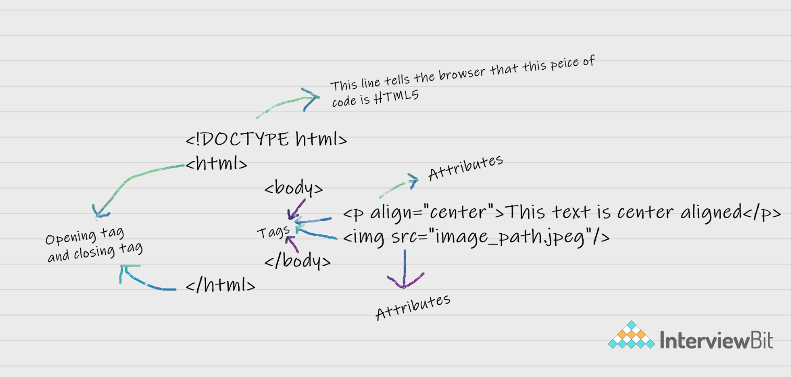

## Mục lục

[1. Thẻ HTML và phần tử là một?](#1-thẻ-html-và-phần-tử-là-một)

[2. Thẻ và thuộc tính trong HTML là gì?](#2-thẻ-và-thuộc-tính-trong-html-là-gì)

[3. Phần tử void trong HTML là gì?](#3-phần-tử-void-trong-html-là-gì)

[4. Ưu điểm của khoảng trắng?](#4-ưu-điểm-của-khoảng-trắng)

[5. HTML Entities là gì?](#5-html-entities-là-gì)

[6. Các kiểu danh sách trong HTML?](#6-c%C3%A1c-ki%E1%BB%83u-danh-s%C3%A1ch-trong-html)

[7. Thuộc tính class trong HTML là gì?](#7-thu%E1%BB%99c-t%C3%ADnh-class-trong-html-l%C3%A0-g%C3%AC)

[8. Sự khác nhau của thuộc tính id và class trong phần HTML?](#8-s%E1%BB%B1-kh%C3%A1c-nhau-c%E1%BB%A7a-thu%E1%BB%99c-t%C3%ADnh-id-v%C3%A0-class-trong-ph%E1%BA%A7n-t%E1%BB%AD-html)

[9. multipart/form-data là gì?](#9-multipartform-data-l%C3%A0-g%C3%AC)

[10. Mô tả cấu trúc của HTML?](#10-m%C3%B4-t%E1%BA%A3-c%E1%BA%A5u-tr%C3%BAc-c%E1%BB%A7a-html)

[11. Cách để tối ưu tải tài nguyên website?](#11-c%C3%A1ch-%C4%91%E1%BB%83-t%E1%BB%91i-%C6%B0u-t%E1%BA%A3i-t%C3%A0i-nguy%C3%AAn-website)

[12. Thẻ định dạng khác nhau trong HTML](#12-th%E1%BA%BB-%C4%91%E1%BB%8Bnh-d%E1%BA%A1ng-kh%C3%A1c-nhau-trong-html)

[13. Các thể loại Doctypes khả dụng](#13-c%C3%A1c-th%E1%BB%83-lo%E1%BA%A1i-doctypes-kh%E1%BA%A3-d%E1%BB%A5ng)

[14. Hãy giải thích cách hiển thị tập ký tự đang được sử dụng trong HTML?](#14-h%C3%A3y-gi%E1%BA%A3i-th%C3%ADch-c%C3%A1ch-hi%E1%BB%83n-th%E1%BB%8B-t%E1%BA%ADp-k%C3%BD-t%E1%BB%B1-%C4%91ang-%C4%91%C6%B0%E1%BB%A3c-s%E1%BB%AD-d%E1%BB%A5ng-trong-html)

[15. Sự khác nhau giữa thẻ `<strong>` và `<b>`, thẻ `<em>` và `<i>`?](#15-s%E1%BB%B1-kh%C3%A1c-nhau-gi%E1%BB%AFa-th%E1%BA%BB-strong-v%C3%A0-b-th%E1%BA%BB-em-v%C3%A0-i)

[16. Đặc trưng của thẻ `<head>` và `<body>` trong HTML?](#16-%C4%91%E1%BA%B7c-tr%C6%B0ng-c%E1%BB%A7a-th%E1%BA%BB-head-v%C3%A0-body-trong-html)

[17. Chúng ta có thể hiển thị một trang bên trong một trang web hoặc lồng các trang web vào nhau có được không?](#17-ch%C3%BAng-ta-c%C3%B3-th%E1%BB%83-hi%E1%BB%83n-th%E1%BB%8B-m%E1%BB%99t-trang-b%C3%AAn-trong-m%E1%BB%99t-trang-web-ho%E1%BA%B7c-l%E1%BB%93ng-c%C3%A1c-trang-web-v%C3%A0o-nhau-c%C3%B3-%C4%91%C6%B0%E1%BB%A3c-kh%C3%B4ng)

[18. Cell Padding khác với Cell Spacing như thế nào?](#18-cell-padding-kh%C3%A1c-v%E1%BB%9Bi-cell-spacing-nh%C6%B0-th%E1%BA%BF-n%C3%A0o)

[19. Làm thế nào chúng ta có thể ghép hai hoặc nhiều hàng hoặc nhiều cột thành một hàng hoặc cột duy nhất trong một bảng HTML?](#19-l%C3%A0m-th%E1%BA%BF-n%C3%A0o-ch%C3%BAng-ta-c%C3%B3-th%E1%BB%83-gh%C3%A9p-hai-ho%E1%BA%B7c-nhi%E1%BB%81u-h%C3%A0ng-ho%E1%BA%B7c-nhi%E1%BB%81u-c%E1%BB%99t-th%C3%A0nh-m%E1%BB%99t-h%C3%A0ng-ho%E1%BA%B7c-c%E1%BB%99t-duy-nh%E1%BA%A5t-trong-m%E1%BB%99t-b%E1%BA%A3ng-html)

[20. Có thể thay đổi một phần tử inline thành một phần tử block không?](#20-c%C3%B3-th%E1%BB%83-thay-%C4%91%E1%BB%95i-m%E1%BB%99t-ph%E1%BA%A7n-t%E1%BB%AD-inline-th%C3%A0nh-m%E1%BB%99t-ph%E1%BA%A7n-t%E1%BB%AD-block-kh%C3%B4ng)

[21. Chúng ta có thể định vị một phần tử HTML bằng bao nhiêu cách?](#21-ch%C3%BAng-ta-c%C3%B3-th%E1%BB%83-%C4%91%E1%BB%8Bnh-v%E1%BB%8B-m%E1%BB%99t-ph%E1%BA%A7n-t%E1%BB%AD-html-b%E1%BA%B1ng-bao-nhi%C3%AAu-c%C3%A1ch)

[22. Có bao nhiêu cách để hiển thị phần tử HTML?](#22-c%C3%B3-bao-nhi%C3%AAu-c%C3%A1ch-%C4%91%E1%BB%83-hi%E1%BB%83n-th%E1%BB%8B-ph%E1%BA%A7n-t%E1%BB%AD-html)

[23. Sự khác biệt giữa `dislay: none` và `visibility: hidden`?](#23-s%E1%BB%B1-kh%C3%A1c-bi%E1%BB%87t-gi%E1%BB%AFa-dislay-none-v%C3%A0-visibility-hidden)

[24. Làm sao để chỉ định liên kết trong HTML và giải thích thuộc tính `target`?](#24-l%C3%A0m-sao-%C4%91%E1%BB%83-ch%E1%BB%89-%C4%91%E1%BB%8Bnh-li%C3%AAn-k%E1%BA%BFt-trong-html-v%C3%A0-gi%E1%BA%A3i-th%C3%ADch-thu%E1%BB%99c-t%C3%ADnh-target)

[25. Có bao nhiêu cách để dùng CSS cùng với HTML?](#25-c%C3%B3-bao-nhi%C3%AAu-c%C3%A1ch-%C4%91%E1%BB%83-d%C3%B9ng-css-c%C3%B9ng-v%E1%BB%9Bi-html)

[26. Sự khác biệt giữa thẻ `<link>` và thẻ `<a>`?](#26-s%E1%BB%B1-kh%C3%A1c-bi%E1%BB%87t-gi%E1%BB%AFa-th%E1%BA%BB-link-v%C3%A0-th%E1%BA%BB-a)

[27. Cách để thêm code javascript vào HTML?](#27-c%C3%A1ch-%C4%91%E1%BB%83-th%C3%AAm-code-javascript-v%C3%A0o-html)

[28. Thẻ script dùng ở head hay body?](#28-th%E1%BA%BB-script-d%C3%B9ng-%E1%BB%9F-head-hay-body)

[29. Form là gì và cách tạo form trong HTML?](#29-form-l%C3%A0-g%C3%AC-v%C3%A0-c%C3%A1ch-t%E1%BA%A1o-form-trong-html)

[30. Xử lý sự kiện trong HTML?](#30-x%E1%BB%AD-l%C3%BD-s%E1%BB%B1-ki%E1%BB%87n-trong-html)

[31. Các ưu điểm của HTML5 so với các phiên bản trước?](#31-c%C3%A1c-%C6%B0u-%C4%91i%E1%BB%83m-c%E1%BB%A7a-html5-so-v%E1%BB%9Bi-c%C3%A1c-phi%C3%AAn-b%E1%BA%A3n-tr%C6%B0%E1%BB%9Bc)

[32. Cách để thêm nhạc và video vào web?](#32-c%C3%A1ch-%C4%91%E1%BB%83-th%C3%AAm-nh%E1%BA%A1c-v%C3%A0-video-v%C3%A0o-web)

[33. Phần tử inline và block trong HTML5?](#33-ph%E1%BA%A7n-t%E1%BB%AD-inline-v%C3%A0-block-trong-html5)

[34. Sự khác biệt giữa thẻ img và thẻ figure?](#34-s%E1%BB%B1-kh%C3%A1c-bi%E1%BB%87t-gi%E1%BB%AFa-th%E1%BA%BB-img-v%C3%A0-th%E1%BA%BB-figure)

[35. Làm thế nào để chỉ định metadata trong HTML5?](#35-l%C3%A0m-th%E1%BA%BF-n%C3%A0o-%C4%91%E1%BB%83-ch%E1%BB%89-%C4%91%E1%BB%8Bnh-metadata-trong-html5)

[36. Thẻ `<datalist>` và thẻ `<select>` là giống nhau?](#36-th%E1%BA%BB-datalist-v%C3%A0-th%E1%BA%BB-select-l%C3%A0-gi%E1%BB%91ng-nhau)

[37. Image Map là gì?](#37-image-map-l%C3%A0-g%C3%AC)

[38. Phần tử Sematic là gì?](#38-ph%E1%BA%A7n-t%E1%BB%AD-sematic-l%C3%A0-g%C3%AC)

[39. Sự khác biệt giữa thẻ `<meter>` và thẻ `<process>`?](#39-s%E1%BB%B1-kh%C3%A1c-bi%E1%BB%87t-gi%E1%BB%AFa-th%E1%BA%BB-meter-v%C3%A0-th%E1%BA%BB-process)

[40. Có thể kéo và thả trong HTML5 không?](#40-c%C3%B3-th%E1%BB%83-k%C3%A9o-v%C3%A0-th%E1%BA%A3-trong-html5-kh%C3%B4ng)

[41. Sự khác biệt giữa phần tử SVG và Canvas trong HTML5?](#41-s%E1%BB%B1-kh%C3%A1c-bi%E1%BB%87t-gi%E1%BB%AFa-ph%E1%BA%A7n-t%E1%BB%AD-svg-v%C3%A0-canvas-trong-html5)

[42. Các kiểu file audio có thể dùng trong HTML5?](#42-c%C3%A1c-ki%E1%BB%83u-file-audio-c%C3%B3-th%E1%BB%83-d%C3%B9ng-trong-html5)

[43. Thông số kỹ thuật trong HTML5 là gì?](#43-th%C3%B4ng-s%E1%BB%91-k%E1%BB%B9-thu%E1%BA%ADt-trong-html5-l%C3%A0-g%C3%AC)

[44. Các khái niệm về web storage trong HTML5?](#44-c%C3%A1c-kh%C3%A1i-ni%E1%BB%87m-v%E1%BB%81-web-storage-trong-html5)

[45. Microdata là gì?](#45-microdata-l%C3%A0-g%C3%AC)

[46. Thẻ nào được dùng để biểu diễn kết quả tính toán?](#46-th%E1%BA%BB-n%C3%A0o-%C4%91%C6%B0%E1%BB%A3c-d%C3%B9ng-%C4%91%E1%BB%83-bi%E1%BB%83u-di%E1%BB%85n-k%E1%BA%BFt-qu%E1%BA%A3-t%C3%ADnh-to%C3%A1n)

[47. Mối quan hệ giữa thẻ `<h1>` và `<header>` trong HTML5?](#47-m%E1%BB%91i-quan-h%E1%BB%87-gi%E1%BB%AFa-th%E1%BA%BB-h1-v%C3%A0-header-trong-html5)

[48. Giải thích về đồ hoạ trong HTML5?](#48-gi%E1%BA%A3i-th%C3%ADch-v%E1%BB%81-%C4%91%E1%BB%93-ho%E1%BA%A1-trong-html5)

[49. Các kiểu input mới trong HTML5 trong form?](#49-c%C3%A1c-ki%E1%BB%83u-input-m%E1%BB%9Bi-trong-html5-trong-form)

[50. Các thẻ mới cho phần tử media trong HTML5?](#50-c%C3%A1c-th%E1%BA%BB-m%E1%BB%9Bi-cho-ph%E1%BA%A7n-t%E1%BB%AD-media-trong-html5)

[51. Tại sao bạn nghĩ rằng việc bổ sung chức năng kéo và thả trong HTML5 là quan trọng? Bạn sẽ làm thế nào để tạo một hình ảnh có thể kéo được trong HTML5?](#51-t%E1%BA%A1i-sao-b%E1%BA%A1n-ngh%C4%A9-r%E1%BA%B1ng-vi%E1%BB%87c-b%E1%BB%95-sung-ch%E1%BB%A9c-n%C4%83ng-k%C3%A9o-v%C3%A0-th%E1%BA%A3-trong-html5-l%C3%A0-quan-tr%E1%BB%8Dng-b%E1%BA%A1n-s%E1%BA%BD-l%C3%A0m-th%E1%BA%BF-n%C3%A0o-%C4%91%E1%BB%83-t%E1%BA%A1o-m%E1%BB%99t-h%C3%ACnh-%E1%BA%A3nh-c%C3%B3-th%E1%BB%83-k%C3%A9o-%C4%91%C6%B0%E1%BB%A3c-trong-html5)

[52. Tại sao ta cần phần tử MathML trong HTML5?](#52-t%E1%BA%A1i-sao-ta-c%E1%BA%A7n-ph%E1%BA%A7n-t%E1%BB%AD-mathml-trong-html5)

[53. Server-sent events trong HTML5 là gì?](#53-server-sent-events-trong-html5-l%C3%A0-g%C3%AC)

[54. Web workers là gì?](#54-web-workers-l%C3%A0-g%C3%AC)

[55. Việc sử dụng thuộc tính novalidate cho thẻ form trong HTML5 để làm gì?](#55-vi%E1%BB%87c-s%E1%BB%AD-d%E1%BB%A5ng-thu%E1%BB%99c-t%C3%ADnh-novalidate-cho-th%E1%BA%BB-form-trong-html5-%C4%91%E1%BB%83-l%C3%A0m-g%C3%AC)

[56. Vector và Raster trong ảnh là gì?](#56-vector-v%C3%A0-raster-trong-%E1%BA%A3nh-l%C3%A0-g%C3%AC)

[57. Làm thế nào để hỗ trợ SVG trên trình duyệt cũ?](#57-l%C3%A0m-th%E1%BA%BF-n%C3%A0o-%C4%91%E1%BB%83-h%E1%BB%97-tr%E1%BB%A3-svg-tr%C3%AAn-tr%C3%ACnh-duy%E1%BB%87t-c%C5%A9)

[59. File manifest trong HTML5 là gì?](#59-file-manifest-trong-html5-l%C3%A0-g%C3%AC)

[60. API định vị địa lý trong HTML5?](#60-api-%C4%91%E1%BB%8Bnh-v%E1%BB%8B-%C4%91%E1%BB%8Ba-l%C3%BD-trong-html5)

[61. Viết code minh hoạ API định vị địa lý?](#61-vi%E1%BA%BFt-code-minh-ho%E1%BA%A1-api-%C4%91%E1%BB%8Bnh-v%E1%BB%8B-%C4%91%E1%BB%8Ba-l%C3%BD)

[62. Giải thích về Web Component?](#62-gi%E1%BA%A3i-th%C3%ADch-v%E1%BB%81-web-component)

## Câu hỏi phỏng vấn cho Fresher

### 1. Thẻ HTML và phần tử là một?

Không. Phần tử (element) HTML được xác định bằng cách bắt đầu thẻ, bao gồm tất cả nội dung cho đến khi đóng thẻ. Ví dụ, `<h1>Heading</h1>` là một phần tử HTML, còn tag chỉ là `<h1>` và `</h1>`.

### 2. Thẻ và thuộc tính trong HTML là gì?

Thẻ là thành phần quan trọng trong HTML xác định cách nội dung sẽ được định dạng, trong khi thuộc tính đi cùng với thẻ HTML để xác định đặc trưng của phần tử HTML. Ví dụ: `<p align="center">HTML Question</p>`, thì `algin` là thuộc tính để xác định đoạn văn bản sẽ hiển thị ở giữa.

### 3. Phần tử void trong HTML là gì?

Trong HTML sẽ có các phần tử không cần thẻ đóng. Ví dụ: `<br />`, ``, `<hr />`,...

### 4. Ưu điểm của khoảng trắng?

Trong HTML, một chuỗi ký tự khoảng trắng được coi là một ký tự khoảng trắng. Vì trình duyệt thu gọn nhiều khoảng trắng thành một ký tự khoảng trắng duy nhất và điều này giúp dev thụt lề các dòng văn bản mà không phải lo lắng về nhiều khoảng trắng và duy trì tính dễ đọc và dễ hiểu của code HTML.

### 5. HTML Entities là gì?

Trong HTML một vài ký tự dành riêng như `<`, `>`, `/`,... Để sử dụng các ký tự trong trang web, ta cần dùng các ký tự đặc biệt gọi là HTML entities. Dưới đây là một số ánh xạ giữa ký tự dành riêng và ký tự entities tương ứng sẽ được sử dụng. 

| Character | Entity Name | Entity Number |
|-----------|-------------|---------------|
| <         | `&lt;`        | `&#60;`         |
| >         | `&gt;`        | `&#62;`         |
| &         | `&amp;`        | `&#38;`         |

### 6. Các kiểu danh sách trong HTML?

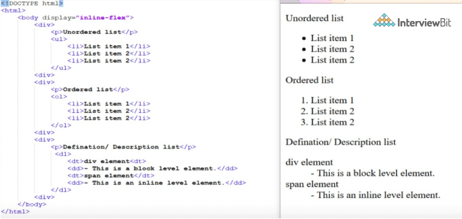

### 7. Thuộc tính `class` trong HTML là gì?

Thuộc tính class được sử dụng để chỉ định tên lớp cho một phần tử HTML. Nhiều phần tử trong HTML có thể có cùng giá trị lớp. Ngoài ra, nó chủ yếu được sử dụng để liên kết các style được viết trong CSS.

### 8. Sự khác nhau của thuộc tính `id` và `class` trong phần tử HTML?

Nhiều phần tử trong HTML có thể có cùng giá trị lớp, trong khi giá trị thuộc tính id của một phần tử này không thể được liên kết với phần tử HTML khác.

### 9. multipart/form-data là gì?

`multipart/form-data` là một trong những giá trị của thuộc tính `enctype`. Nó được sử dụng để gửi dữ liệu file cho phía server xử lý. Các giá trị hợp lệ khác của thuộc tính `enctype` là `text/plain` and `application/x-www-form-urlencoded`.

### 10. Mô tả cấu trúc của HTML

Mỗi trang web đều có các thành phần khác nhau để hiển thị nội dung dự định và một giao diện người dùng cụ thể. Tuy nhiên, có một số kiểu mẫu được chấp nhận trên toàn cầu để cấu trúc trang web, chẳng hạn như:

- **`<header>`**: Lưu trữ thông tin bắt đầu về trang web.
- **`<footer>`**: Biểu diễn phần cuối cùng của trang.
- **`<nav>`**: Menu điều hướng của trang HTML.
- **`<article>`**: Nó là một tập hợp thông tin.
- **`<section>`**: Nó được sử dụng bên trong `article` để xác định cấu trúc cơ bản của một trang.
- **`<aside>`**: Nội dung menu dọc của trang.

### 11. Cách để tối ưu tải tài nguyên website?

Để tối ưu thời gian tải web ta cần tối ưu việc tải các tài nguyên:

- **CDN hosting** - CDN hoặc mạng phân phối nội dung là các server được phân phối theo địa lý để giúp giảm độ trễ.
- **File compression** - Đây là một phương pháp giúp giảm kích thước của nội dung để giảm việc truyền dữ liệu.
- **File concatenation** - làm giảm số lượng cuộc gọi HTTP.
- **Minify scripts** - làm giảm kích thước tổng thể của file js và CSS
- **Parallel downloads** - Lưu trữ nội dung trong nhiều miền phụ để vượt qua giới hạn tải xuống là 6 nội dung trên mỗi miền của tất cả các trình duyệt hiện nay. Điều này có thể được cấu hình nhưng hầu hết người dùng thông thường không bao giờ sửa đổi các cài đặt này.
- **Lazy Loading** - Thay vì tải tất cả các nội dung cùng một lúc, các nội dung không quan trọng chỉ được tải trên khi cần thiết.

### 12. Thẻ định dạng khác nhau trong HTML

HTML có các thẻ định dạng khác nhau:

* `<b>` - in đậm văn bản
* `<i>` - in nghiêng văn bản
* `<em>` - làm cho văn bản nghiêng nhưng có thêm tầm quan trọng về ngữ nghĩa
* `<big>` - tăng kích cỡ chữ lên một đơn vị 
* `<small>`- giảm kích cỡ chữ lên một đơn vị 
* `<sub>` - biến văn bản thành chỉ số dưới
* `<sup>` - biến văn bản thành chỉ số trên
* `<del>` - hiển thị dưới dạng văn bản gạch bỏ
* `<strong>` - đánh dấu văn bản là quan trọng
* `<mark>` - highlights văn bản
* `<ins>` - hiển thị dưới dạng văn bản đã thêm

### 13. Các thể loại Doctypes khả dụng 

Có ba thể loại Doctypes khả dung:

- Strict Doctype 
- Transitional Doctype
- Frameset Doctype

### 14. Hãy giải thích cách hiển thị tập ký tự đang được sử dụng trong HTML?

Tập ký tự được xác định bởi thẻ `<meta>` trong phần tử `<head>`

```html
<!DOCTYPE html>
<html>
    <head>
        <meta charset="UTF-8">
        ...
        ...
    </head>
    ...
</html>
```

### 15. Sự khác nhau giữa thẻ `<strong>` và `<b>`, thẻ `<em>` và `<i>`?

Hiệu ứng trên trang web bình thường của các thẻ `<strong>`, `<b>` và `<em>`, `<i>` là như nhau. Thẻ `<b>` và `<i>` là viết tắt của chữ in đậm và chữ nghiêng. Hai thẻ này chỉ áp dụng font chữ và thẻ in đậm `<b>`, chỉ thêm mực vào chữ, các thẻ này không nói lên điều gì về văn bản.

Trong khi đó, các thẻ `<strong>` và `<em>` thể hiện rằng đoạn văn bản có tầm quan trọng cao và nhấn mạnh hơn so với phần còn lại của văn bản. Các thẻ này có ý nghĩa ngữ nghĩa.

### 16. Đặc trưng của thẻ `<head>` và `<body>` trong HTML?

Thẻ `<head>` cung cấp thông tin về tài liệu. Nó phải luôn được đặt trong thẻ `<html>`. Thẻ này chứa siêu dữ liệu (metadata) về trang web và các thẻ nằm trong thẻ head như` <link>`, `<meta>`, `<style>`, `<script>` v.v. không được hiển thị trên trang web. Ngoài ra, chỉ có thể có 1 thẻ `<head>` trong toàn bộ tài liệu html và sẽ luôn ở trước thẻ `<body>`.

Thẻ `<body>` xác định phần nội dung của tài liệu HTML. Nó phải luôn được đặt trong thẻ `<html>`. Tất cả nội dung cần được hiển thị trên trang web như hình ảnh, văn bản, âm thanh, video, nội dung, sử dụng các phần tử như `<p>`, ``, `<audio>`, `<heading>`, `<video>`, `<div>`, v.v ... sẽ luôn nằm trong thẻ `<body>`. Ngoài ra, chỉ có 1 phần tử body trong tài liệu HTML và sẽ luôn ở sau thẻ `<head>`.

### 17. Chúng ta có thể hiển thị một trang bên trong một trang web hoặc lồng các trang web vào nhau có được không?

Có, chúng tôi có thể hiển thị một trang web bên trong một trang web HTML khác. HTML cung cấp thẻ `<iframe>` để có thể thực hiện chức năng này.

```html
<iframe src="url of the web page to embed" />
```

### 18. Cell Padding khác với Cell Spacing như thế nào?

Cell Spacing là khoảng trống giữa hai ô liên tiếp. Trong khi, Cell Padding là khoảng trống giữa văn bản/nội dung của ô và cạnh/đường viền của ô. Xem hình bên dưới.

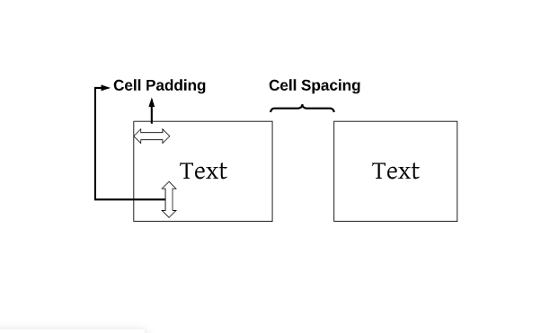

### 19. Làm thế nào chúng ta có thể ghép hai hoặc nhiều hàng hoặc nhiều cột thành một hàng hoặc cột duy nhất trong một bảng HTML?

HTML cung cấp hai thuộc tính cho bảng là `rowspan` và `colspan` để tạo một ô kéo dài tới nhiều hàng và cột tương ứng.

### 20. Có thể thay đổi một phần tử inline thành một phần tử block không?

Có, có thể sử dụng thuộc tính `display` với giá trị của nó là `block`, để thay đổi phần tử inline thành phần tử block.

### 21. Chúng ta có thể định vị một phần tử HTML bằng bao nhiêu cách?

Có 6 giá trị thuộc tính có thể dùng cho định vị phần tử HTML

- **static**: phần tử sẽ xuất hiện ở vị trí mặc định dựa theo thứ tự khai báo, ta không thể sử dụng các thuộc tính `top`, `right`, `bottom`, `left` để thiết lập lại vị trí cho phần tử.
- **absolute**: dùng để thiết lập vị trí cho một phần tử dựa theo vị trí của phần tử cha nằm gần với nó nhất, nếu không có phần tử cha nào được thiết lập thuộc tính `position` với một trong ba giá trị (relative, fixed, absolute) thì vị trí của phần tử sẽ được xác định dựa theo khung trang web.
- **fixed**: dùng để thiết lập phần tử nằm tại một vị trí cố định trên màn hình trình duyệt mặc cho người dùng có scroll trang lên xuống hay trái phải.
- **relative**: cũng gần giống với phương thức định vị static, đó chính là phần tử sẽ xuất hiện ở vị trí mặc định dựa theo thứ tự khai báo. Tuy nhiên, đối với phương thức định vị relative thì chúng ta có thể sử dụng các thuộc tính top, right, bottom, left để thiết lập lại vị trí cho phần tử.
- **initial**: Reset giá trị thuộc tính về giá trị mặc định.
- **inherit**: Kế thừa giá trị từ phần tử cha.

### 22. Có bao nhiêu cách để hiển thị phần tử HTML?

1. **inline**: ta có thể hiển thị bất kỳ phần tử dạng block nào thành dạng inline. Giá trị thuộc tính `height` và `width` sẽ không ảnh hưởng.
2. **block**: ta có thể hiển thị bất kỳ phần tử dạng inline nào thành dạng block.
3. **inline-block**: Thuộc tính này tương tự như inline, ngoại trừ việc hiển thị dưới dạng inline-block, chúng ta có thể định dạng phần tử bằng cách sử dụng các giá trị `height` và `width`.
4. **flex**: hiển thị phần tử container một cách linh hoạt. Nó theo sau thuộc tính `flexbox`.
5. **inline-flex**: hiển thị container như một phần tử inline trong khi nội dung của nó vẫn tuân theo thuộc tính `flexbox`.
6. **grid**: hiển thị nội dung phần tử như một grid container.
7. **none**: Using this property we can hide the HTML element.

Một vài kiểu hiển thị khác nhưng ít khi dùng là:

* table
* inline-table
* table-cell
* table-column
* table-row
* inline-grid
* list-item
* inherit
* initial
* table-caption

### 23. Sự khác biệt giữa `dislay: none` và `visibility: hidden`?

Khi sử dụng thuộc tính `visibility: hidden` cho một phần tử HTML thì phần tử đó sẽ bị ẩn khỏi trang web nhưng vẫn chiếm không gian. Trong khi đó, nếu sử dụng thuộc tính `display: none` cho một phần tử HTML thì phần tử đó sẽ bị ẩn và không chiếm bất kỳ không gian nào trên trang web.

### 24. Làm sao để chỉ định liên kết trong HTML và giải thích thuộc tính `target`?

HTML cung cấp thẻ `<a>` để chỉ định liên kết trên web. Thuộc tính `href` được dùng để chỉ định liên kết và thuộc tính `target` được dùng để chỉ định cách mở liên kết. Thuộc tính `target` có các giá trị sau:

* **_self**: là giá trị mặc định. Mở liên kết cùng tab hay cửa sổ với trang web.
* **_blank**: mở ở tab mới.
* **_parent**: mở ở frame cha.
* **_top**: mở ở toàn cửa sổ.

### 25. Có bao nhiêu cách để dùng CSS cùng với HTML?

Có 3 cách là:
- **Inline:** sử dụng thuộc tính `style` trong phần tử HTML.
- **Internal:** sử dụng thẻ `<style>` trong thẻ `<head>`. 
- **External:** sử dụng thẻ `<link>` trong thẻ `<head>` để liên kết đến file CSS vào code HTML. 

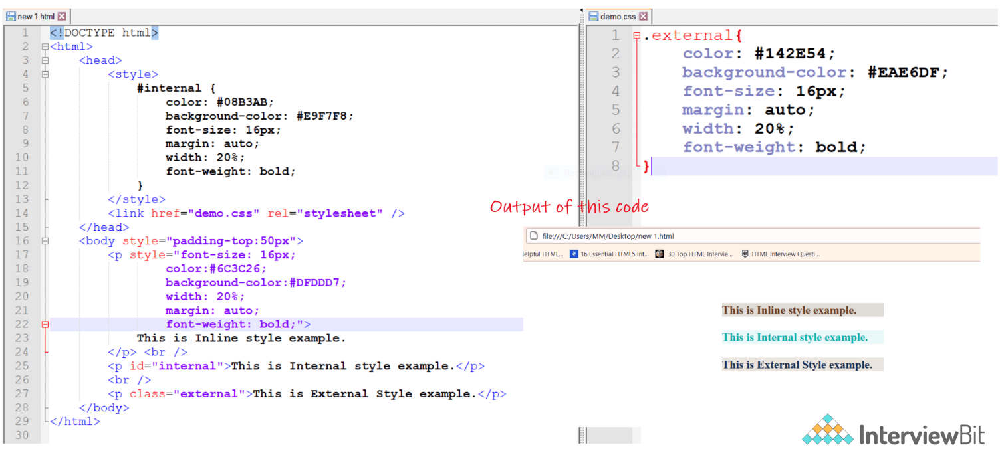

### 26. Sự khác biệt giữa thẻ `<link>` và thẻ `<a>`?

Thẻ `<a>` được dùng để mở liên kết đến trang web khác hay một phần nào đó ở web hiện tại nên nó có thể click vào. Trong khi thẻ `<link>` xác định một liên kết đến một nguồn tài nguyên bên ngoài, nó không thể click.

### 27. Cách để thêm code javascript vào HTML?

HTML cung cấp thẻ `<script>` để chạy code javascript cho trang web thêm sinh động.

```html
<!DOCTYPE html>
<html>
    <body>
        <h1>
            <span>This is a demo for </span>
            <u><span id="demo"></span></u>
        </h1>
    <script>
        document.getElementById("demo").innerHTML = "script Tag"
    </script>
    </body>
</html>
```

### 28. Thẻ script dùng ở head hay body?

Nếu các script chứa các hàm event-trigger hoặc thư viện jquery thì nên đặt ở head. Nếu script viết nội dung hoặc không nằm trong hàm thì nên đặt ở cuối body. Nói tóm lại có 3 điểm cần nhớ sau:
- Đặt thư viện hoặc sự kiện script ở head.
- Đặt script thông thường ở head cho đến khi có vấn đề gì đó về hiệu suất.
- Đặt script hiển thị nội dung ở cuối body.

### 29. Form là gì và cách tạo form trong HTML?

Form được dùng cho người dùng nhập thông tin. HTML cung cấp thẻ `<form>` cho tạo form. Để lấy thông tin từ người dùng ta có thể dùng thẻ `<input>` trong form để lưu lại dữ liệu người dùng và gửi về server xử lý. Thẻ input hỗ trợ các kiểu khác nhau như button, checkbox, number, text, password,...

```html
<form action="/submit_data.php">
   <label>Enter your name: </label>
   <input type="text" name="name" /> 
   <label>Enter Mobile number </label>
   <input type="number" name="mobile_no"/>
   <input type="submit" value="Submit">
</form>
```

### 30. Xử lý sự kiện trong HTML?

HTML cho phép thực hiện kích hoạt sự kiện trong trình duyệt sử dụng javascript hoặc JQuery. Có rất nhiều sự kiện như `onClick`, `onDrag`, `onChange`, v.v. 

```html
<!DOCTYPE html>
<html>
    <body style="padding-top:50px">
        <h3 id="event_demo">0</h3>
        <input type="button" onclick="myFunction()" value="Click Me" />
        <input type="reset" onclick="reset()" value="Reset" />
    </body>
    
    <script>
        function myFunction() {
            var value = document.getElementById("event_demo").innerHTML
            value = parseInt(value) + 1;
            document.getElementById("event_demo").innerHTML = value;
        }
        function reset() {
            document.getElementById("event_demo").innerHTML = 0;
        }
    </script>
</html>
```

### 31. Các ưu điểm của HTML5 so với các phiên bản trước?

- Hỗ trợ đa phương tiện.
- Nó có khả năng lưu trữ dữ liệu ngoại tuyến bằng cách sử dụng cơ sở dữ liệu SQL và bộ đệm ứng dụng.
- Javascript có thể được chạy ở chế độ nền.
- HTML5 cũng cho phép người dùng vẽ nhiều hình dạng khác nhau như hình chữ nhật, hình tròn, hình tam giác, v.v.
- Bao gồm các thẻ Sematic mới và các thẻ điều khiển biểu form.

### 32. Cách để thêm nhạc và video vào web?

HTML5 cung cấp hai thẻ là `<audio>` và `<video>` để ta thêm nhạc và video trực tiếp vào web.

### 33. Phần tử inline và block trong HTML5?

| Inline | Block |
|--------|-------|
| Các phần tử inline chỉ chiếm không gian cần thiết cho nội dung và không bắt đầu một dòng mới | Các phần tử block bắt đầu trên một dòng mới và chiếm toàn bộ chiều rộng của trang có sẵn |
| `<span>`, `<a>`, `<strong>`, ``, `<button>`, `<em>`, `<select>`, `<abbr>`, `<label>`, `<sub>`, `<cite>`, `<abbr>`, `<script>`, `<label>`, `<i>`, `<input>`, `<output>`, `<q>,` ... | `<div>`, `<p>`, `<header>`, `<footer>`, `<h1>`...`<h6>`, `<form>`, `<table>`, `<canvas>`, `<video>`, `<blockquote>`, `<pre>`, `<ul>`, `<ol>`, `<figcaption>`, `<figure>`, `<hr>`, `<article>`, `<section>` ... |

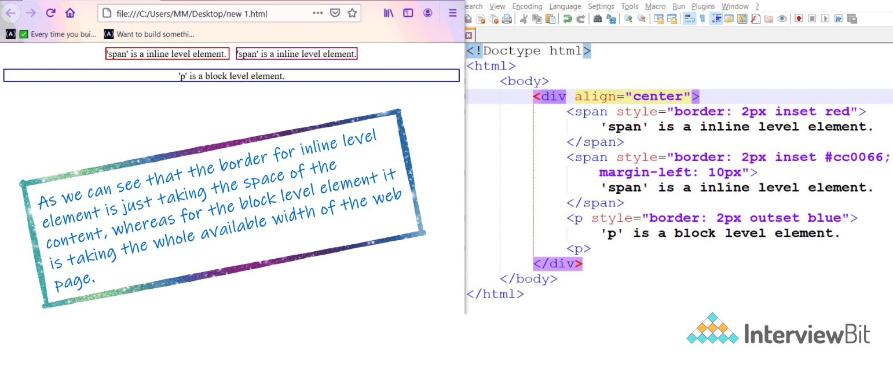

### 34. Sự khác biệt giữa thẻ img và thẻ figure?

Thẻ `<figure>` chỉ định nội dung như ảnh, sơ đồ, code snippets,... Thẻ `<figure>` được dùng để tổ chức các nội dung như ảnh, tiêu đề ảnh trong khi thẻ `` dùng để nhúng một ảnh vào tài liệu HTML5.

### 35. Làm thế nào để chỉ định metadata trong HTML5?

Để chỉ định, ta có thể sử dụng thẻ `<meta>` (là một thẻ void, tức là nó không có thẻ đóng). Một số thuộc tính được sử dụng với thẻ meta là name, content, http-equiv, v.v. Hình ảnh dưới đây cho biết cách chỉ định metadata.

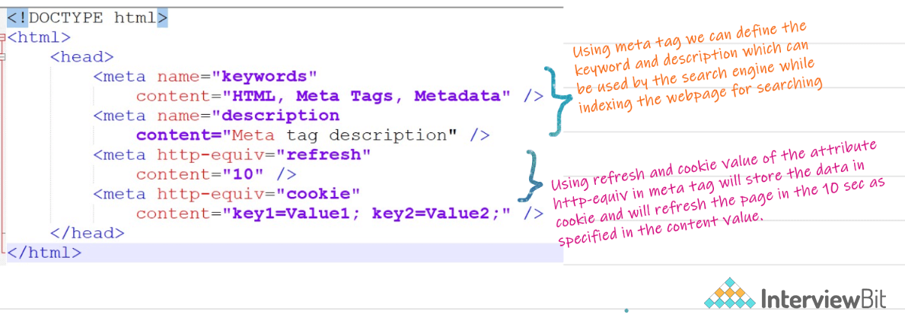

### 36. Thẻ `<datalist>` và thẻ `<select>` là giống nhau?

Không. Thẻ `<datalist>` và thẻ `<select>` là khác nhau. Trong thẻ `<select>`, người dùng sẽ chọn từ một danh sách tuỳ chọn (options), trong khi `<datalist>` được sử dụng để cung cấp chức năng "autocomplete" cho các phần tử `<input>`, người dùng sẽ thấy một danh sách thả xuống các tùy chọn trước khi họ nhập dữ liệu.

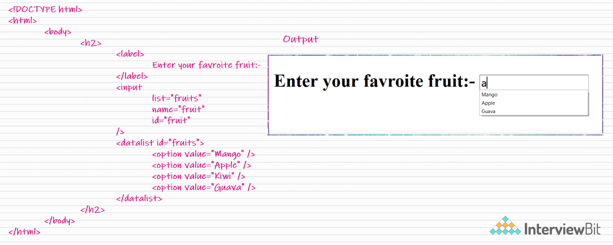

### 37. Image Map là gì?

Bản đồ ảnh (image map) có thể tạm hiểu là một loại hình ảnh đặc biệt, trên tấm hình sẽ có các vùng được xác định, mỗi vùng đó được gán với một cái liên kết.

```html

<map  name=”workspace”>
    <area shape=”rect”  coords=”34, 44, 270, 350” ,  href=”xyz.html” />
    <area shape=”rect”  coords=”10, 120, 250, 360” ,  href=”xyz.html” />
</map>
```

### 38. Phần tử Sematic là gì?

Phần tử semantic mô tả ý nghĩa cụ thể đối với trình duyệt và nhà phát triển. Các phần tử như `<form>`, `<table>`, `<article>`, `<figure>`, ... là phần tử semantic.

### 39. Sự khác biệt giữa thẻ `<meter>` và thẻ `<process>`?

Thẻ `<progress>` được sử dụng khi ta muốn hiển thị tiến độ hoàn thành của một nhiệm vụ, trong khi thẻ `<meter>` xác định một phép đo vô hướng trong một phạm vi biết trước hoặc một giá trị phân số.

### 40. Có thể kéo và thả trong HTML5 không?

Có, trong HTML5, chúng ta có thể kéo và thả một phần tử. Điều này có thể thực hiện bằng cách sử dụng các sự kiện liên quan đến kéo và thả được sử dụng với phần tử mà chúng ta muốn kéo và thả.

### 41. Sự khác biệt giữa phần tử SVG và Canvas trong HTML5?

| SVG | Canvas |
|-----|--------|
| SVG là dựa trên vector, để tạo hình dạng | Dựa trên Raster, tức là bao gồm pixel |
| Hoạt động tốt hơn với surface lớn | Hoạt động tốt hơn với surface nhỏ |
| Có thể chỉnh sửa với script và css | Chỉ có thể chỉnh sửa với script |
| Khả năng mở rộng cao. Có thể in ở độ phân giải cao. | Khả năng mở rộng thấp |

### 42. Các kiểu file audio có thể dùng trong HTML5?

HTML5 hỗ trợ các định dạng audio như sau:
1. Mp3
2. Wav
3. Ogg

### 43. Thông số kỹ thuật trong HTML5 là gì?

Thông số kỹ thuật trong HTML5 nhằm mục đích là:
- Giới thiệu thẻ phần tử mới để cấu trúc trang tốt hơn.
- Hình thành một tiêu chuẩn hành vi trên nhiều trình duyệt và hỗ trợ cho các thiết bị và nền tảng khác nhau.
- Tương thích ngược với các trang web HTML phiên bản cũ hơn.
- Giới thiệu các phần tử tương tác cơ bản mà không phụ thuộc vào các plugin, chẳng hạn như thẻ `<video>` thay vì plugin flash.

### 44. Các khái niệm về web storage trong HTML5?

Web storage này giúp lưu trữ một số dữ liệu tĩnh trong bộ local storage của trình duyệt để hạn chế việc tìm nạp dữ liệu từ máy chủ quá thường xuyên. Có giới hạn kích thước dựa trên các trình duyệt khác nhau. Điều này giúp giảm thời gian tải và trải nghiệm người dùng mượt mà. Có hai loại web storage được sử dụng để lưu trữ dữ liệu cục bộ trong HTML5:
* **Local Storage** - giúp dữ liệu được lưu trữ ngay cả khi người dùng đóng trình duyệt. Nó được lưu trữ cho từng ứng dựng web trên các trình duyệt khác nhau.
* **Session Storage** - chỉ lưu trữ trong phiên làm việc. Nếu người dùng đóng trình duyệt nó sẽ bị xoá.

### 45. Microdata là gì?

Microdata là một phương thức đơn giản để phân loại các nội dung trong website. Microdata hiểu một cách đơn giản là để thêm dữ liệu có cấu trúc vào website. Microdata nó định nghĩa thuộc tính, có thể đặt vào trong HTML để cho biết trang web đó viết về mục đích gì.

```html
<div itemscope itemtype="http://schema.org/SoftwareApplication">
    <span itemprop="name">Interviewbit Games</span> -
    REQUIRES <span itemprop="operatingSystem">ANDROID</span><br>
    <link itemprop="applicationCategory" href="http://schema.org/GameApplication"/>
    <div itemprop="aggregateRating" itemscope itemtype="http://schema.org/AggregateRating">
        RATING:
        <span itemprop="ratingValue">4.6</span> (
        <span itemprop="ratingCount">8864</span> ratings )
    </div>
    <div itemprop="offers" itemscope itemtype="http://schema.org/Offer">
    Price: Rs.<span itemprop="price">1.00</span>
        <meta itemprop="priceCurrency" content="INR" />
    </div>
</div>
```

* **itemid** – Thuộc tính này là bộ nhận diện global cho item
* **itemprop** – Thuộc tính này định nghĩa một thuộc tính của item
* **itemref** – Thuộc tính này cung cấp một danh sách các phần tử bổ sung để tìm các cặp tên-giá trị của item.
* **itemscope** – Được sử dụng để tạo một item. Thuộc tính này là một thuộc tính logic mà nói rằng có Microdata trên trang này, và đây là nơi nó bắt đầu.
* **itemtype** – Thuộc tính này là một URL hợp lệ mà định nghĩa item và cung cấp ngữ cảnh cho các thuộc tính.

Ví dụ về microdata bởi Google:

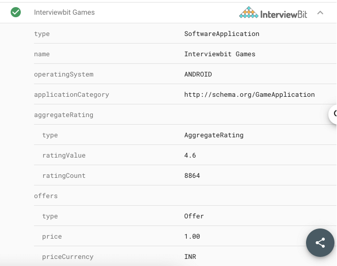

### 46. Thẻ nào được dùng để biểu diễn kết quả tính toán? 

Thẻ `<output>` được dùng để biểu diễn kết quả tính toán. Nó có các thuộc tính sau:
- **for** - Nó xác định mối quan hệ giữa các phần tử được sử dụng trong tính toán và kết quả.
- **form** - được sử dụng để xác định hình thức mà phần tử đầu ra thuộc về.
- **name** - Tên của phần tử output

```html
<form oninput = "result.value=parseInt(n1.value)+parseInt(n2.value)">
    <input type = "number" name = "n1" value = "1" /> +
    <input type = "number" name = "n2" value = "2" /><br />
    The output is: <output name = "result"></output>
</form>
```

Kết quả trông như:

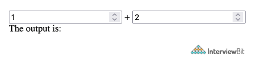

### 47. Mối quan hệ giữa thẻ `<h1>` và `<header>` trong HTML5?

Trong HTML5 thẻ `<header>` chỉ định phần tiêu đề của trang web. Không giống như các phiên bản trước có một phần tử `<h1>` cho toàn bộ trang web, bây giờ đây chỉ có header cho một phần như `<article>` hoặc `<section>`. Theo đặc tả HTML5, mỗi phần tử `<header>` phải có ít nhất một thẻ `<h1>`.

### 48. Giải thích về đồ hoạ trong HTML5?

HTML 5 hỗ trợ hai loại đồ hoạ:

- **Canvas:** Nó giống như vẽ trên một tờ giấy trắng hoặc một trang web trống. Ta có thể thêm các thiết kế đồ họa khác nhau trên các trang web với các phương pháp có sẵn để vẽ các hình dạng hình học khác nhau.

```html
<!DOCTYPE HTML>
<html>
    <head>
    </head>
    <body>
        <canvas width="300" height="100" style="border:2px solid;"></canvas>  
    </body>
</html>
```

- **SVG:** Scalable Vector Graphics được sử dụng hầu hết cho các sơ đồ hoặc biểu tượng. Nó tuân theo định dạng XML.

```html
<!DOCTYPE html>
<html>
    <body>
    <svg width="400" height="110">
        <rect width="300" height="100" style="fill:#FFF;stroke-width:2;stroke:#000" />
    </svg>
    </body>
</html>
```

Cả hai ví dụ trên đều tạo output này, chúng là hai cách tiếp cận khác nhau do HTML5 cung cấp để triển khai đồ hoạ trên trang web.


### 49. Các kiểu input mới trong HTML5 trong form?

- Date - Chọn ngày bằng cách dùng `type="date"`
- Week - Chọn tuần bằng cách dùng `type="week"`
- Time - Chọn thời gian bằng cách dùng `type="time"`
- Month - Chọn tháng bằng cách dùng `type="month"`
- Datetime - Kết hợp ngày và thời gian dùng `type="datetime"`
- Datetime-local - Kết hợp ngày và thời gian và chặn timezone,dùng `type="datetime"`
- Color - Chấp nhận nhiều màu dùng `type="color"`
- Email - Chấp nhận một hay nhiều email dùng `type="email"` 
- Number - Chấp nhận một giá trị số với các kiểm tra bổ sung như min và max, sử dụng `type="number"`
- Search - Cho phép truy vấn tìm kiếm văn bản dùng `type="search"`
- Tel - Cho phép các số điện thoại khác nhau dùng `type="tel"`
- Placeholder - Để hiển thị một gợi ý ngắn trước khi nhập giá trị bằng cách sử dụng `type="placeholder"`
- Range - Chấp nhận giá trị số trong một phạm vi cụ thể dùng `type="range"`
- Url - Chập nhận địa chỉ trang web dùng `type="url"`

```html
<form>  
    <div>
        <label>Date:</label>
        <input type="date" id="date" />
        <br>
        <label>Week:</label>
        <input type="week" id="week" />
        <br>
        <label>Month:</label>
        <input type="month" id="month" />
        <br>
        <label>Time:</label>
        <input type="time" id="time" />
        <br>
        <label>Datetime:</label>
        <input type="datetime" id="datetime" />
        <br>
        <label>Datetime Local:</label>
        <input type="datetime-local" id="datetime-local" />
        <br>
        <label>Color:</label>
        <input type="color" id="color"/>
        <br>
        <label>Email:</label>
        <input type="email" id="email" placeholder="email address" />
        <br>
        <label>Number:</label>
        <input type="number" id="number" />
        <br>
        <label>Search:</label>
        <input type="search" id="search" />
        <br>
        <label>Phone:</label>
        <input type="tel" id="phone" placeholder="Phone Number" pattern="\d{10}$" />
        <br>
        <label>Range:</label>
        <input type="range" id="range" />
        <br>
        <label>URL:</label>
        <input type="url" id="url"/>
    </div>  
</form>
```

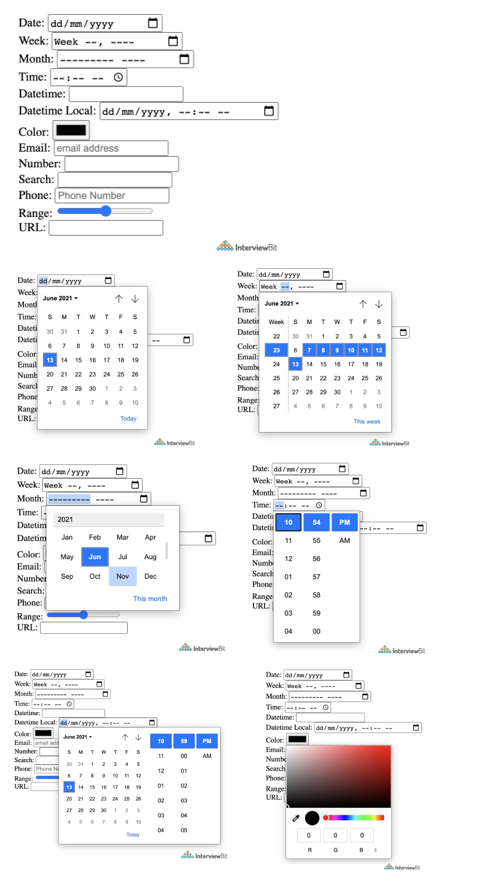

### 50. Các thẻ mới cho phần tử media trong HTML5?

* `<audio>`: dùng cho các file âm thanh, nhạc, nhúng nội dung audio mà không cần plugin.
* `<video>`: dùng cho nhúng nội dung video.
* `<source>`: dùng cho nhiều tài nguyên media như video, audio,...
* `<embed>`: dùng cho nội dung nhúng hay ứng dụng mở rộng.
* `track`: tiêu đề con cho video hay audio

```html
<label>
       Video:
</label>
<video width="320" height="240" controls>
    <source src="video.mp4" type="video/mp4">
    <track src="subtitles.vtt" kind="subtitles" srclang="en" label="English">
</video>
<br>
<label>
    Embed:
</label>
<embed type="video/webm" src="https://www.youtube.com/embed/MpoE6s2psCw" width="400" height="300">
<br>
<label>
    Audio:
</label>
<audio controls>
    <source src="audio.mp3" type="audio/mpeg">
</audio>
```

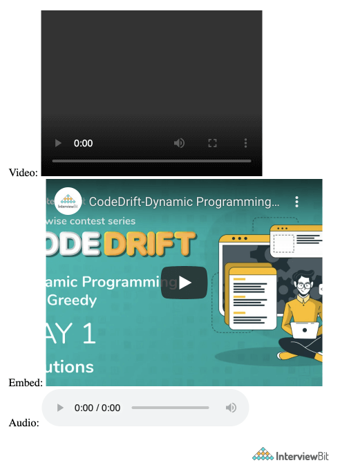

### 51. Tại sao bạn nghĩ rằng việc bổ sung chức năng kéo và thả trong HTML5 là quan trọng? Bạn sẽ làm thế nào để tạo một hình ảnh có thể kéo được trong HTML5?

Chức năng kéo và thả là một cách rất trực quan để chọn các file cục bộ. Điều này tương tự như việc hầu hết các hệ điều hành có chức năng sao chép, nó giúp cho người dùng làm việc dễ dàng. Trước khi có API kéo và thả, điều này chỉ có thể thực được bằng cách viết lập trình Javascript phức tạp hoặc các thư viện bên ngoài như jQuery.

Để bật chức năng này, có một thuộc tính có thể kéo trong thẻ `` và cần đặt thuộc tính **ondrop** và **ondragover** thành một event-handler có sẵn trong script.

```html
<!DOCTYPE HTML>
<html>
    <head>
    <script>
        function allowDrop(ev) {
            ev.preventDefault();
        }
        function drop(ev) {
            ...
        }
    </script>
    </head>
    <body>
        ...
        <div id="div1" ondrop="drop(event)" ondragover="allowDrop(event)" style="border: 1px solid #aaaaaa; width:350px; height: 70px;"></div>
        <br>
        
            ...
    </body>
</html>
```

### 52. Tại sao ta cần phần tử MathML trong HTML5?

MathML là viết tắt của Mathematical Markup Language. Nó dùng cho hiển thị các biểu thức hàm số toán học trên web. Với thẻ `<math>`:

```html
<!DOCTYPE HTML>
<html>
    <head>
    </head>
    <body>
        <math>
            <mrow>
                <mrow>
                <msup>
                    <mi> a </mi>
                    <mn> 2 </mn>
                </msup>
                <mo> + </mo>
                <msup>
                    <mi> b </mi>
                    <mn> 2 </mn>
                </msup>
                <mo> + </mo>
                <mn> 2 </mn>
                <mn> a </mn>
                <mn> b </mn>
                </mrow>
                <mo> = </mo>
                <mn> 0 </mn>
            </mrow>
        </math>
    </body>
</html>
```

Kết quả là phương trình a2 + b2 +2ab = 0

### 53. Server-sent events trong HTML5 là gì? 

Server-Sent Events (SSE) hay còn được biết đến với tên gọi Event Source là một Web Api cho phép kết nối thời gian thực giữa server và client (browser). SSE tạo ra kết nối một chiều từ server đến client sử dụng giao thức HTTP truyền thống với định nghĩa dữ liệu đơn giản cho phía server (event stream format) và API gọn nhẹ phía client.

So với phương pháp polling từ client lên server để kiểm tra dữ liệu thì SSE hiệu quả hơn rất nhiều do client chỉ cần tạo kết nối HTTP lên server một lần, và server giữ kết nối đó để liên tục gửi data cho client.

WebSockets thì phức tạp và hoành tráng hơn hẳn SSE. Tuy nhiên WebSockets là kết nối hai chiều mà đôi khi ta lại không cần chiều từ client lên server. Ngoài ra WebSockets là một giao thức hoàn toàn khác và đòi hỏi server phải hỗ trợ.

Để dùng SSE, phần tử `<eventsource>` được dùng. Thuộc tính `src` dùng để chỉ định URL của server gửi luồng dữ liệu cho các sự kiện.

```html
<eventsource src = "/cgi-bin/myfile.cgi" />
```

### 54. Web workers là gì?

Được thêm vào để mang lại khả năng thực thi song song và bất đồng bộ. Nó chạy nền để thực hiện các tác vụ tính toán tốn kém mà trang web không có khả năng đáp ứng. Nó thực hiện bằng cách tạo một luồng riêng cho các tác vụ như vậy. 
Có 3 loại worker chính:
- **Dedicated Workers**: là worker được dùng bởi một script duy nhất
- **Shared Workers** là những worker được dùng bởi nhiều script chạy trong các cửa sổ, iframe khác nhau,...
- **Service workers** những worker này hoạt động như một proxy server giữa ứng dụng web, trình duyệt và mạng. Chủ yếu được dùng để thông báo và đồng bộ hoá API.

```html
<p>Count numbers: <output id="result"></output></p>
<button onclick="startWorker()">Start Worker</button>
<button onclick="stopWorker()">Stop Worker</button>
<script>
var w;
function startWorker() {
    if(typeof(Worker) !== "undefined") {
        if(typeof(w) == "undefined") {
            w = new Worker("demo_workers.js");
        }
        w.onmessage = function(event) {
            document.getElementById("result").innerHTML = event.data;
        };
    }
}
function stopWorker() {
    w.terminate();
    w = undefined;
}
</script>
```

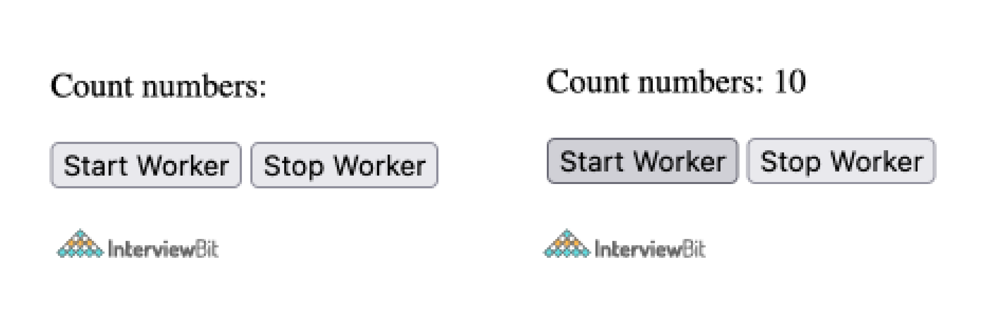

### 55. Việc sử dụng thuộc tính novalidate cho thẻ form trong HTML5 để làm gì?

Giá trị của nó là kiểu boolean cho biết liệu dữ liệu đang được form gửi có được xác thực trước hay không. Nếu nó là false, các form có thể được gửi mà không cần xác thực.

```html
<form action = "" method = "get" novalidate>
        Name:<br><input type="name" name="sname"><br>
       Doubt:<br><input type="number" name="doubt"><br>
        <input type="submit" value="Submit">
</form>
```

### 56. Vector và Raster trong ảnh là gì?

**Rasters**: xác định thứ tự của pixel trong grid với màu sắc chính xác của pixel đó. File định dạng raster như png, jpg, ...

**Vector**: xác định thuật toán với hình dạng và đường đi xác định để kết xuất ảnh trên màn hình. Vd như svg

### 57. Làm thế nào để hỗ trợ SVG trên trình duyệt cũ?

Để hỗ trợ các trình duyệt cũ thay vì xác định tài nguyên của svg trong thuộc tính *src* của thẻ ``, thì nên xác định nó trong thuộc tính *srcset* và trong *src*, file png dự phòng phải được xác định.

```html

```

### 58. Progressive rendering là gì?

Progressive Rendering là một kỹ thuật render tuần tự các phần của trang web trong server và streaming đến client từng phần thay vì đợi render toàn bộ trang.

Nó ngụ ý rằng một tài quan trọng được tạo trên server, bạn có thể stream đến client mà không cần đợi những thứ không quan trọng hiển thị. Nó kết hợp cả SSR và CSR.

#### Server-side rendering (SSR)

Server side rendering hay SSR là cách thông thường cho việc render trang web ở trình duyệt. Như các bước mô tả bên dưới cách truyền thống để rendering nội dung web như các bước dưới đây :

1. Người dùng gửi một yêu cầu tới website( Thông thường thông qua trình duyeejt)
2. Phía server kiểm tra và chuẩn bị nội dung HTML sau khi đã đi qua một lượt các script có trong trang web
3. Các đoạn HTML đã được biên dịch được gửi tới trình duyệt của người dùng cho việc render.
4. Trình duyệt tải về HTML và làm các trang có thể nhìn thấy với người dùng
5. Trình duyệt sau đó tải về Javasciprt(JS) và tiến hành thực thi JS, nó làm cho trang web có thể tương tác

#### Client-side rendering 

Client side rendering là một cách tiếp cận khác về việc làm thế nào một trang web được xử lí để hiển thị trên trình duyệt. Ở CSR, gánh nặng về việc biên dịch nội dung, sinh ra HTML được chuyển tới phía trình duyệt người dùng.

Cách tiếp cận này được tiếp sức mạnh từ các framework Javascript và các thư viện. Luồng chính của một trang web render trong trường hợp Client-side rendering như sau:

1. Người dùng gửi request tới webiste
2. Thay vì một server, một con CDN có thể được sử dụng để gửi HTML, CSS và các file hỗ trợ cho người dùng.
3. Trình duyệt tải HTML và JS trong khi nhìn thấy một biểu tượng loading
4. Sau khi trình duyệt lấy JS về, nó sẽ tạo các yêu cầu API thông qua Ajax và lấy về các nội dung động và xử lí chúng để render ra nội dung cuối cùng.
5. Sau khi server phản hồi, nội dung cuối cùng sẽ được render sử dụng quá trình xử lí DOM trên trình duyệt người dùng.

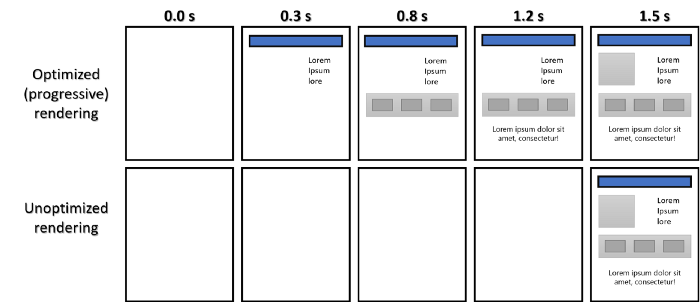

### 59. File manifest trong HTML5 là gì?

File manifest được sử dụng để liệt kê các tài nguyên có thể được lưu vào bộ nhớ đệm. Trình duyệt sử dụng thông tin này để làm cho trang web tải nhanh hơn lần đầu tiên. Có 3 phần trong mainfest:

* CACHE Manifest - File cần lưu vào bộ đệm
* Network - File không bao giờ lưu vào bộ đệm, cần kết nối mạng.
* Fallback - File dự phòng trong trường hợp trang không tiếp cận được.

```text
CACHE MANIFEST
# 2012-06-16 v1.0.0
/style.css
/logo.gif
/main.js
NETWORK:
login.php
FALLBACK:
/html/ /offline.html
```

```html
<!DOCTYPE HTML>
<html manifest="tutorial.appcache">
...
...
</html>
```

### 60. API định vị địa lý trong HTML5?

API định vị địa lý được sử dụng để chia sẻ vị trí thực của máy khách với các trang web. Điều này giúp cung cấp nội dung dựa trên ngôn ngữ và trải nghiệm độc đáo cho người dùng, dựa trên vị trí của họ. Nó hoạt động với một thuộc tính mới của đối tượng điều hướng toàn cầu và hầu hết các trình duyệt hiện đại đều hỗ trợ điều này.

```js
var geolocation = navigator.geolocation;
```

### 61. Viết code minh hoạ API định vị địa lý?

```html
<!DOCTYPE html>
<html>
    <body>
        <p>Click "try it" button to get your coordinates.</p>
        <button onclick="getLocation()">Try It</button>
        <p id="demo"></p>
        <script>
            var x = document.getElementById("demo");
            
            function getLocation() {
                if (navigator.geolocation) {
                    navigator.geolocation.getCurrentPosition(showPosition);
                } else { 
                    x.innerHTML = "Geolocation functionality is not supported by this browser.";
                }
            }
                
            function showPosition(position) {
                x.innerHTML = "Latitude: " + position.coords.latitude + 
                "<br>Longitude: " + position.coords.longitude;
            }
        </script>
    </body>
</html>
```

Ví dụ trên yêu cầu người dùng cho phép truy cập dữ liệu vị trí thông qua API định vị địa lý và sau khi nhấp vào nút, tọa độ của vị trí thực của client sẽ được hiển thị.

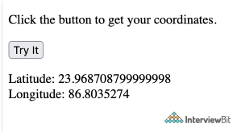

### 62. Giải thích về Web Component?

Chúng được sử dụng để tạo các phần tử tùy chỉnh có thể sử dụng lại, nó rất khó thực hiện trong HTML truyền thống. Nó bao gồm ba công nghệ:

**Custom elements** - Đây là các API JavaScript giúp xác định các phần tử tùy chỉnh và hành vi của chúng.
Shadow DOM -Đây là các API JavaScript gắn cây shadow DOM được đóng gói vào một phần tử để giữ các tính năng của phần tử đó riêng tư và không bị ảnh hưởng bởi các phần khác.

```html
<!DOCTYPE html>
<html>
    <head>
        <meta charset="utf-8">
        <title>composed and composedPath demo</title>
        <script src="main.js" defer></script>
    </head>
    <body>
        <h1><code>composed</code> and <code>composedPath</code> demo</h1>
        <open-shadow text="I have an open shadow root"></open-shadow>
        <closed-shadow text="I have a closed shadow root"></closed-shadow>
    </body>
</html>
```

```js
customElements.define('open-shadow',
    class extends HTMLElement {
        constructor() {
            super();
            const pElem = document.createElement('p');
            pElem.textContent = this.getAttribute('text');
            const shadowRoot = this.attachShadow({mode: 'open'});
            shadowRoot.appendChild(pElem);
        }
    }
);
customElements.define('closed-shadow',
    class extends HTMLElement {
        constructor() {
            super();
            const pElem = document.createElement('p');
            pElem.textContent = this.getAttribute('text');
            const shadowRoot = this.attachShadow({mode: 'closed'});
            shadowRoot.appendChild(pElem);
        }
    }
);
document.querySelector('html').addEventListener('click', e => {
    console.log(e.composed);
    console.log(e.composedPath());
});
```

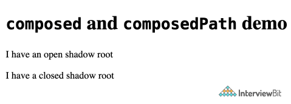

Ở đây 2 phần tử tùy chỉnh được xác định là `<open-shadow>` và `<closed-shadow>` lấy nội dung văn bản của chúng và chèn chúng vào DOM bóng như nội dung của phần tử `<p>`.

- **HTML Template** Các template đánh dấu được viết bằng các phần tử `<template>` và `<slot>` có thể được sử dụng lại nhiều lần làm cơ sở cho cấu trúc của phần tử tùy chỉnh. 

```html
<!DOCTYPE html>
<html>
    <head>
        <meta charset="utf-8">
        <title>Simple template</title>
        <script src="main.js"></script>
    </head>
    <body>
        <h1>Simple template</h1>
        <template id="my-paragraph">
            <style>
            p {
                color: white;
                background-color: #666;
                padding: 5px;
            }
            </style>
            <p><slot name="my-text">My default text</slot></p>
        </template>
        <my-paragraph>
            <span slot="my-text">Let's have some different text!</span>
        </my-paragraph>
        <my-paragraph>
            <ul slot="my-text">
                <li>Let's have some different text!</li>
                <li>In a list!</li>
            </ul>
        </my-paragraph>
    </body>
</html>
```

```js
customElements.define('my-paragraph',
    class extends HTMLElement {
        constructor() {
            super();
            const template = document.getElementById('my-paragraph');
            const templateContent = template.content;
            this.attachShadow({mode: 'open'}).appendChild(
                templateContent.cloneNode(true)
            );
        }
    }
);
const slottedSpan = document.querySelector('my-paragraph span');
console.log(slottedSpan.assignedSlot);
console.log(slottedSpan.slot);
```

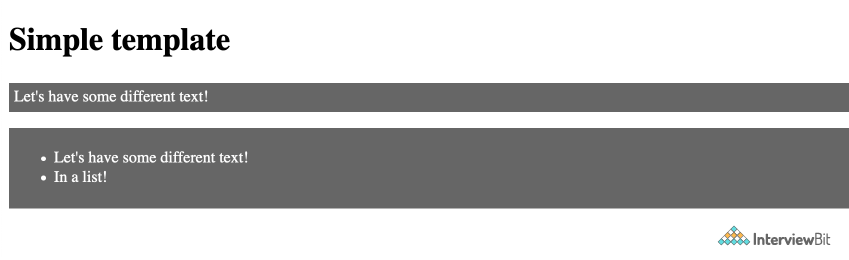