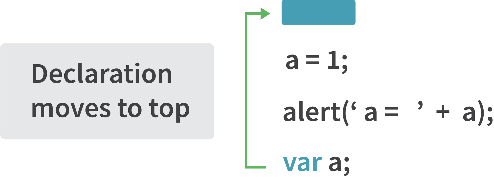
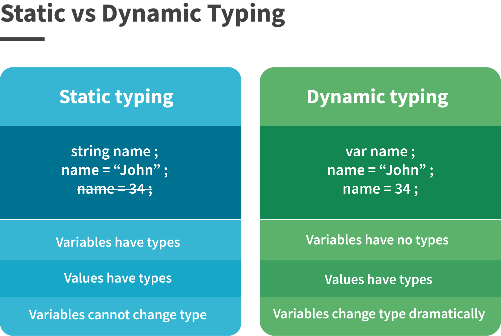
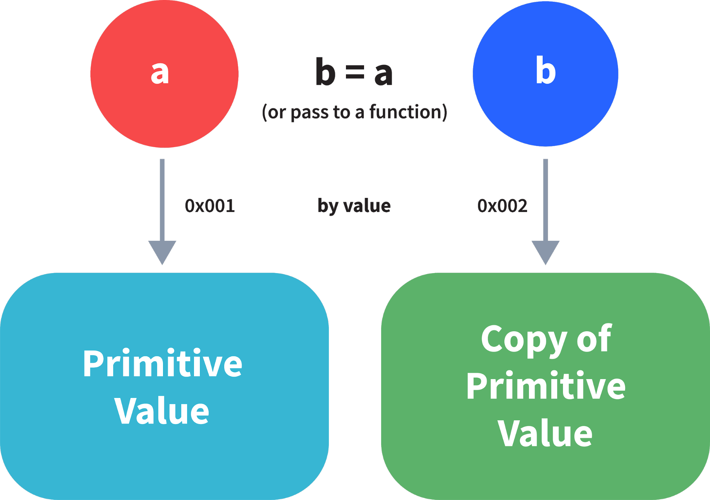
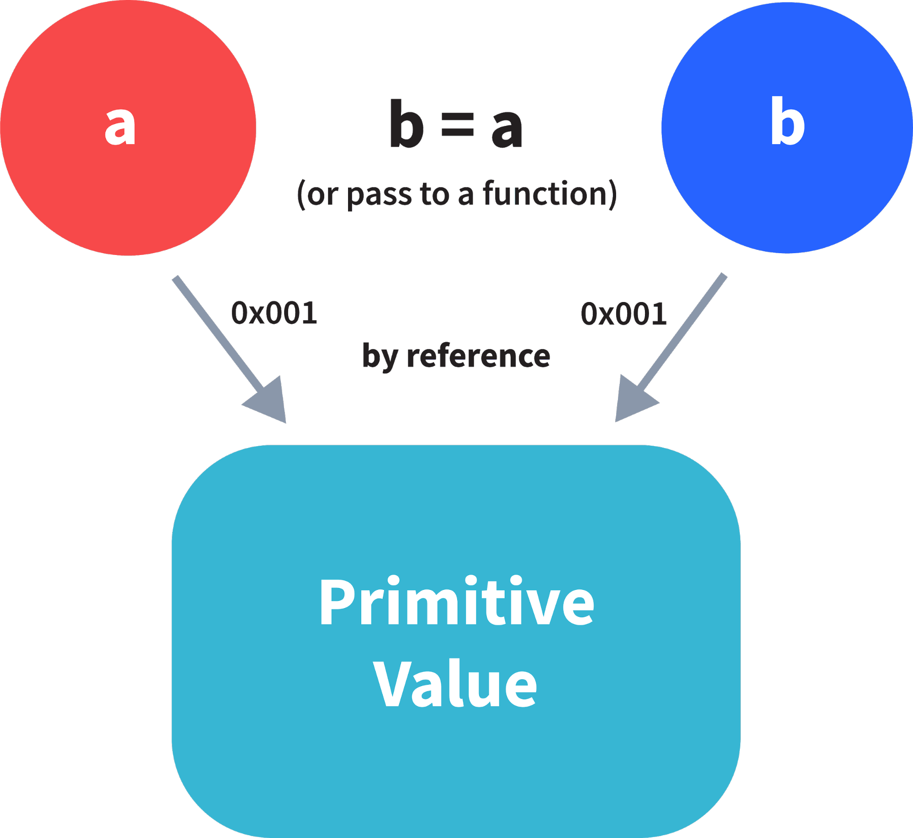
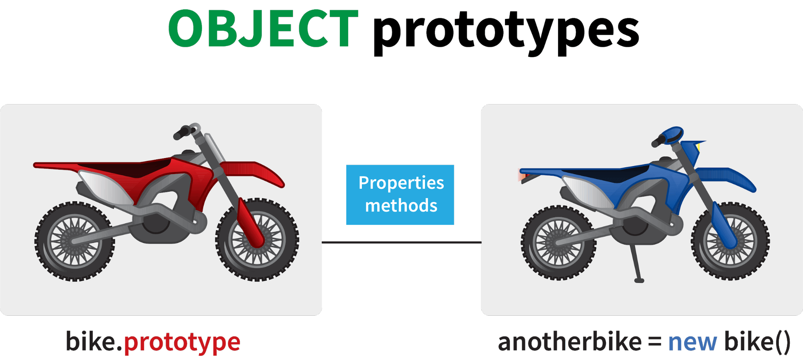
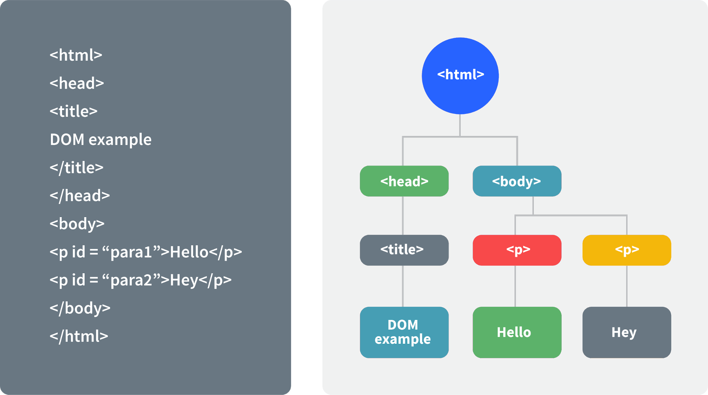
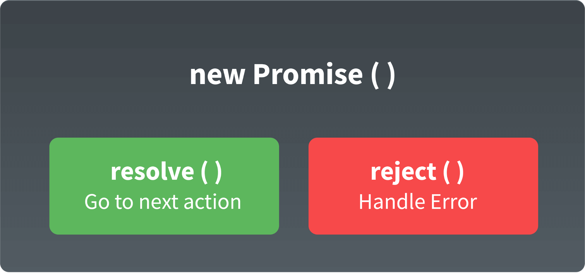
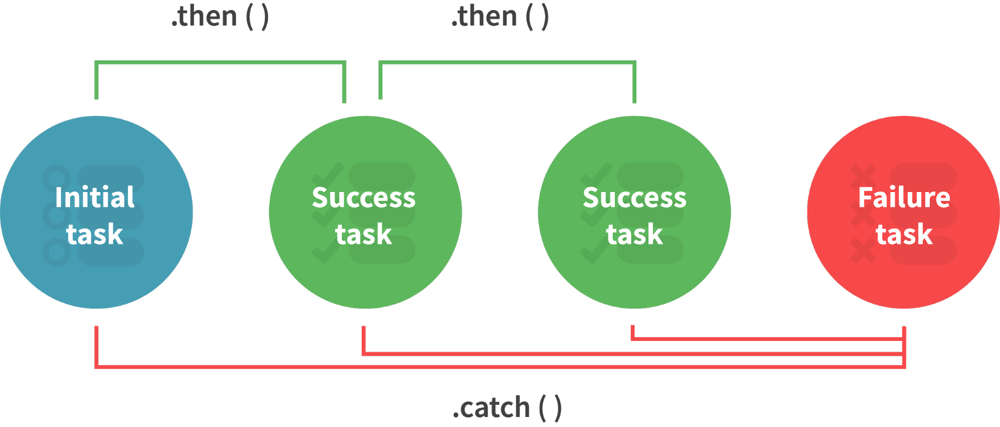

# Câu hỏi phỏng vấn JavaScript


Được phát triển bởi Brendan Eich vào năm 1995, JavaScript là một trong những ngôn ngữ lập trình phổ biến nhất với các web developer.

Nó được tạo ra cho phát triển các trang web động. Một chương trình JS được gọi là script, nó có thể được đính kèm vời bất kỳ trang web HTML nào. Các script sẽ tự động chạy khi trang được tải.

Ở hiện tại JavaScript cũng có thể chạy được trên cả server hay bất kỳ thiết bị nào có JavaScript Engine.

Dưới đây là các câu hỏi phỏng vấn JavaScript thường gặp.

[Câu hỏi coding](./CODING.md)

## Mục lục

[1. Sự khác biệt giữa các kiểu dữ liệu trong JavaScript?](#1-sự-khác-biệt-giữa-các-kiểu-dữ-liệu-trong-javascript)

[2. Giải thích về Hoisting trong Javascript?](#2-giải-thích-về-hoisting-trong-javascript)

[3. Sự khác biệt giữa toán tử "==" và "===" là như thế nào?](#3-sự-khác-biệt-giữa-toán-tử--và--là-như-thế-nào)

[4. Giải thích về ép kiểu ngầm trong JavaScript?](#4-giải-thích-về-ép-kiểu-ngầm-trong-javascript)

[5. JavaScript là ngôn ngữ kiểu tĩnh hay kiểu động?](#5-javascript-là-ngôn-ngữ-kiểu-tĩnh-hay-kiểu-động)

[6. Thuộc tính NaN trong JavaScript là gì?](#6-thuộc-tính-nan-trong-javascript-là-gì)

[7. Giải thích về phép gán quá giá trị và phép gán qua tham chiếu?](#7-giải-thích-về-phép-gán-quá-giá-trị-và-phép-gán-qua-tham-chiếu)

[8. IIFE là gì trong JavaScript?](#8-iife-là-gì-trong-javascript)

[9. Giải thích về HOC(Higher Order Functions) trong JavaScript?](#9-giải-thích-về-hochigher-order-functions-trong-javascript)

[10. Giải thích về "this"?](#10-giải-thích-về-this)

[11. Giải thích về phương thức call(), aplly() và bind()?](#11-giải-thích-về-phương-thức-call-aplly-và-bind)

[12. Currying trong JavaScript là gì?](#12-currying-trong-javascript-là-gì)

[13. Giải thích về Scope và Scope Chain?](#13-giải-thích-về-scope-và-scope-chain)

[14. Giải thích về Closures trong JavaScript?](#14-giải-thích-về-closures-trong-javascript)

[15. Prototype là gì?](#15-prototype-là-gì)

[16. Callback là gì?](#16-callback-là-gì)

[17. Memoization là gì?](#17-memoization-là-gì)

[18. Đệ quy là gì?](#18-đệ-quy-là-gì)

[19. Hàm khởi tạo trong JavaScript](#19-hàm-khởi-tạo-trong-javascript)

[20. DOM là gì?](#20-dom-là-gì)

[21. Hàm arrow là gì?](#21-hàm-arrow-là-gì)

[22. Sự khác biết của biến dùng var, let và const](#22-sự-khác-biết-của-biến-dùng-var-let-và-const)

[23. Tham số còn lại và toán tử spread là gì?](#23-tham-số-còn-lại-và-toán-tử-spread-là-gì)

[24 Sử dụng Promise trong JavaScript](#24-sử-dụng-promise-trong-javascript)

[25. Lớp trong JavaScript?](#25-lớp-trong-javascript)

[26. Hàm generator là gì?](#26-hàm-generator-là-gì)

[27. Giải thích WeakSet trong JavaScript](#27-giải-thích-weakset-trong-javascript)

[28. Giải thích WeakMap trong JavaScript](#28-giải-thích-weakmap-trong-javascript)

[29. Cấu trúc đối tượng là gì?](#29-cấu-trúc-đối-tượng-là-gì)

[30. Temporal Dead Zone là gì?](#30-temporal-dead-zone-là-gì)

## Câu hỏi dành cho Fresher

### 1. Sự khác biệt giữa các kiểu dữ liệu trong JavaScript?

Trong JavaScript các kiểu dữ liệu được chia làm hai loại là kiểu nguyên thuỷ và đối tượng. Để biết kiểu dữ liệu của các biến JavaScript, ta có thể sử dụng **typeof**.

**Kiểu nguyên thuỷ**

***String*** - biểu diễn một mảng ký tự hay một chuỗi. Kiểu chuỗi trong javascript có thể sử dụng một cặp dấu ngoặc kép hoặc dấu ngoặc kép đơn.

```js
 var str = "Vivek Singh Bisht"; //sử dụng dấu ngoặc kép
 var str2 = 'John Doe'; // sử dụng dấu ngoặc đơn
```

***Number*** - biểu diễn cả số nguyên và số thực.

```js
var x = 3; // số nguyên
var y = 3.6; // số thực
```

***BigInt*** - kiểu dữ liệu này được sử dụng để lưu trữ các số vượt quá giới hạn của kiểu dữ liệu Number. Nó có thể lưu trữ các số nguyên lớn và được biểu diễn bằng cách thêm “n” vào một chữ số nguyên.

```js
var bigInteger =  234567890123456789012345678901234567890;
```

***Boolean*** - kiểu luận lý, có hai giá trị là *true* và *false*. Thường được dùng với điều kiện.

```js
var a = 2;
var b =  3;
var c =  2;
(a == b) // trả về false
(a == c) // trả về true
```

***undefined*** - khi giá trị của một biến là không xác định.

```js
var x; // giá trị của x là undefined
var y = undefined; // ta cũng có thể gán một biến là undefined
```

***null*** - biểu diễn giá trị null. Vì JavaScript là case-sensitive, null sẽ không giống với` Null`, `NULL`, hoặc bất kỳ biến thể khác.

```js
var z = null;
```

***Symbol*** - mới được giới thiệu trong ES6. Nó lưu trữ các giá trị duy nhất và ẩn danh.

```js
var symbol1 = Symbol('symbol');
```

Sử dụng `typeof` để tìm kiểu nguyên thuỷ:

```js
typeof "John Doe" // Returns "string"
typeof 3.14 // Returns "number"
typeof true // Returns "boolean"
typeof 234567890123456789012345678901234567890n // Returns bigint
typeof undefined // Returns "undefined"
typeof null // Returns "object" (đặc trưng của JavaScript)
typeof Symbol('symbol') // Returns Symbol
```

Trong JavaScript nếu dữ liệu không phải là kiểu nguyên thuỷ thì tất cả đều là object.

**Object** dùng để lưu trữ tập hợp dữ liệu

```js
// Tập hợp dữ liệu dạng key-value 

var obj1 = {
   x:  43,
   y:  "Hello world!",
   z: function(){
      return this.x;
   }
}
      
// Tập hợp dữ liệu dạng danh sách
      
var array1 = [5, "Hello", true, 4.1];  
```

### 2. Giải thích về Hoisting trong Javascript?

Hoisting là một hành vi mặc định trong Javascript, nó sẽ chuyển tất cả khai báo biến và hàm lên trên cùng.



Điều này có nghĩa là bất kể hàm và biến được khai báo ở đâu, chúng cũng sẽ đuọc chuyển lên đầu scope. Scope có thể là toàn cục hoặc cục bộ.

Ví dụ 1:

```js
hoistedVariable = 3;
console.log(hoistedVariable);
// output là 3 vì biến được khởi tạo trước khi khai báo.
var hoistedVariable;
```

Ví dụ 2:

```js
hoistedFunction();  
// Outputs " Hello world! " kể cả khi hàm được khai báo sau khi gọi.

function hoistedFunction(){ 
  console.log(" Hello world! ");
}
```

Ví dụ 3:

```js
// Hoisting takes place in the local scope as well
function doSomething(){
  x = 33;
  console.log(x);
  var x;
}
```

*Lưu ý*: Khai báo biến được hoisting chứ phép gán biến thì không.

```js
var x;
console.log(x); // Output sẽ trả về "undefined" vì phép gán không được hoisting
x = 23;
```

*Lưu ý*: Để tránh hoisting bạn có thể dùng "use strict"

```js
"use strict";
x = 23; // Báo lỗi x  chưa được khai báo
var x; 
```

### 3. Sự khác biệt giữa toán tử "==" và "===" là như thế nào?

Cả hai đều dùng để so sánh, nhưng "==" có thể dùng với bất kỳ kiểu dữ liệu nào còn "===" chỉ dành cho cùng kiểu.

Ví dụ:

```js
var x = 2;
var y = "2";
(x == y)  // Trả về true vì cả hai cùng giá trị

(x === y) // Trả về false vì typeof x là "number" còn typeof y là "string
```

### 4. Giải thích về ép kiểu ngầm trong JavaScript?

Ép kiểu ngầm trong javascript là sự chuyển đổi tự động của giá trị từ kiểu dữ liệu này sang kiểu khác. Nó xảy ra khi thực hiện một biểu thức với các kiểu dữ liệu khác nhau.

**Ép kiểu String**

Ép kiểu string xảy ra khi dùng toán tử `+`. Một số cộng với một chuỗi, kiểu số sẽ bị ép thành kiểu chuỗi.

Ví dụ:

```js
var x = 3;
var y = "3";
x + y // Returns "33" 
```

```js
var x = 24;
var y = "Hello";
x + y   // Returns "24Hello";
```

Để hiểu về hai ví dụ khi ta cộng một số vào chuỗi, thì khi JavaScript thấy biểu thức `x+y` với hai kiểu khác nhau (một số và một chuỗi), nó chuyển đổi kiểu số thành chuỗi để thực hiện hành động. Sau khi chuyển đổi, cả hai biến đều là kiểu chuỗi, thao tác `+` lúc này sẽ thành phép nối chuỗi kết quả là ra chuỗi "33" và "24Hello".

Ngược lại, khi thực hiện phép toán `-`, thì chuỗi lại bị ép kiểu ngầm thành số. Ví dụ:

```js
var x = 3;
Var y = "3";
x - y    //Returns 0 since the variable y (string type) is converted to a number type
```

**Ép kiểu Boolean**

Ép kiểu boolean xảy ra khi sử dụng các toán tử logic, lệnh if hay kiểm tra vòng lặp. Để hiểu về ép kiểu logic, ta cần hiểu về giá trị *truthy* và *falsy*.

Giá trị *truthy* là cái sẽ được ép kiểu thành **true**. Còn *falsy* sẽ được ép kiểu thành **false**.

Tất cả các giá trị ngoại trừ `0`, `0n`, `-0`, `""`, `null`, `undefined`, và `NaN` thì đều là truthy.

Câu lệnh If:

```js
var x = 0;
var y = 23;
        
if(x) { console.log(x) }   // The code inside this block will not run since the value of x is 0(Falsy)  
        
if(y) { console.log(y) }    // The code inside this block will run since the value of y is 23 (Truthy)
```

Toán tử Logic:

Toán tử logic trong javascript không giống các ngôn ngữ lập trình khác, **nó không trả về true hay false, mà nó trả về một toán hạng**.

OR ( || ) - Nếu giá trị đầu tiên là truthy, giá trị đầu tiên sẽ được trả về, ngược lại thì nó trả về giá trị thứ hai.

AND ( && ) - Nếu hai giá trị đều là truthy, giá trị thứ hai sẽ được trả về. Nếu giá trị đầu là falsy sẽ trả về giá trị đầu hoặc giá trị hai là falsy sẽ trả về giá trị hai.

Ví dụ:

```js
var x = 220;
var y = "Hello";
var z = undefined;
        
x | | y    // Returns 220 since the first value is truthy
        
x | | z   // Returns 220 since the first value is truthy
        
x && y    // Returns "Hello" since both the values are truthy
        
y && z   // Returns undefined since the second value is falsy
        
if( x && y ){ 
  console.log("Code runs" ); // This block runs because x && y returns "Hello" (Truthy)
}   
        
if( x || z ){
  console.log("Code runs");  // This block runs because x || y returns 220(Truthy)
}
```

**Ép kiểu dấu bằng**

Xảy ra khi thực hiện phép "==". Nhớ lại thì phép **"==" được dùng để so sánh hai giá trị khác kiểu**.

Thực tế khi sử dụng "==" một ép kiểu ngầm đã xảy ra, chuyển đổi tất cả toán hạng về cùng kiểu và so sánh chúng.

Ví dụ:

```js
var a = 12;
var b = "12";
a == b // Returns true because both 'a' and 'b' are converted to the same type and then compared. Hence the operands are equal.
```

Ép kiểu ngầm không xảy ra khi dùng "===". 

```js
var a = 226;
var b = "226";

a === b // Returns false because coercion does not take place and the  operands are of different types. Hence they are not equal.
```

### 5. JavaScript là ngôn ngữ kiểu tĩnh hay kiểu động?

JavaScript là ngôn ngữ kiểu động. Trong ngôn ngữ kiểu động, kiểu dữ liệu của biến được kiểm tra trong khi đang chạy chương trình ngược lại với kiểu tĩnh, nơi kiểu dữ liệu của biến được kiểm tra khi biên dịch.



Vì Javascript là ngôn ngữ kiểu động, nên một biến có thể giữ bất kỳ kiểu dữ liệu nào. Ví dụ:

```js
var a = 23;
var a = "Hello World!";
```

### 6. Thuộc tính NaN trong JavaScript là gì?

Thuộc tính NaN biểu diễn một giá trị **Not-a-Number**. Nó biểu thị một giá trị không phải là số.

`typeof` của NaN trả về `Number`. Muốn kiểm tra một giá trị có phải NaN không, có thể dùng hàm `isNaN()`.

Ví dụ:

```js
isNaN("Hello")  // Returns true
isNaN(345)   // Returns false
isNaN('1')  // Returns false, since '1' is converted to Number type which results in 0 ( a number) 
isNaN(true) // Returns false, since true converted to Number type results in 1 ( a number)
isNaN(false) // Returns false
isNaN(undefined) // Returns true
```

### 7. Giải thích về phép gán quá giá trị và phép gán qua tham chiếu?

Trong JavaScript, kiểu dữ liệu nguyên thuỷ được gán với giá trị, còn kiểu đối tượng được gán bằng tham chiếu.

Trước tiên, ta cần hiểu về điều gì xảy ra khi ta tạo một biến và gán giá trị cho nó.

```js
var x = 2;
```

Trong ví dụ trên, ta tạo một biến `x` và gán nó giá trị là "2". Phép "=" chỉ định một vài không gian trong bộ nhớ, để lưu trữ giá trị là "2" và trả về vị trí được chỉ định trong bộ nhớ. Do đó, biến `x` ở trên trỏ đến vị trí trong bộ nhớ thay vì trỏ trực tiếp đến giá trị 2.

Phép gán thực hiện hành vi khác nhau khi làm việc với kiểu nguyên thuỷ và kiểu đối tượng.

**Phép gán với kiểu nguyên thuỷ**



```js
var y = 234;
var z = y;
```

Ở ví dụ này, dòng đầu phép gán giá trị cho `y` là kiểu nguyên thuỷ, sau đó ở dòng thứ hai, giá trị của `y` được gán cho `z`. Phép gán chỉ định một vùng không gian mới trong bộ nhớ và trả về địa chỉ của nó. Do đó, biến `z` không chỉ đến vị trí của biến `y` thay vào đó nó chỉ đến vùng không gian mới trong bộ nhớ.

```js
var y = #8454; // y pointing to address of the value 234

var z = y; 
        
var z = #5411; // z pointing to a completely new address of the value 234
        
// Changing the value of y
y = 23;
console.log(z);  // Returns 234, since z points to a new address in the memory so changes in y will not effect z
```

Từ ví dụ trên, ta có thể thấy rằng các kiểu dữ liệu nguyên thủy khi được truyền cho một biến khác sẽ được truyền theo giá trị. Thay vì chỉ gán cùng một địa chỉ cho một biến khác, giá trị sẽ được gán và không gian bộ nhớ mới được tạo ra.

**Phép gán với kiểu đối tượng**



```js
var obj = { name: "Vivek", surname: "Bisht" };

var obj2 = obj;
```

Trong ví dụ trên, phép gán truyền trực tiếp vị trí của biến `obj` đến biến `obj2`. Nói cách khác, tham chiếu của biến `obj` được chuyển cho biến `obj2`.

```js
var obj = #8711;  // obj pointing to address of { name: "Vivek", surname: "Bisht" }

var obj2 = obj;
        
var obj2 = #8711; // obj2 pointing to the same address 
        
        
// changing the value of obj1
        
obj1.name = "Akki";
        
console.log(obj2);
        
// Returns {name:"Akki", surname:"Bisht"} since both the variables are pointing to the same address.
```

Từ ví dụ trên, ta có thể thấy rằng trong khi truyền các kiểu dữ liệu đối tượng, phép gán trực tiếp truyền địa chỉ (tham chiếu).

Do đó, các kiểu dữ liệu đối tượng luôn được truyền bằng tham chiếu.

### 8. IIFE là gì trong JavaScript?

Immediately Invoked Function (IIFE) là một hàm được chạy ngay sau khi nó được định nghĩa.

Cú pháp của IIFE:

```js
(function(){ 
  // Do something;
})();
```

Để hiểu về IIFE, trước hết cần hiểu về hai dấu ngoặc đơn được thêm vào để tạo IIFE.

Dấu ngoặc đơn đầu tiên:

```js
(function (){
   //Do something;
})
```

Khi thực thi code javascript, bất cứ khi nào trình biên dịch bắt gặp từ "function" nó cũng sẽ cho rằng ta đang khai báo một function. Do đó, nếu ta không dùng dấu ngoặc đơn, trình biên dịch sẽ báo lỗi vì nó nghĩa ta đang khái báo một function và theo cú pháp thì các function buộc phải có tên.

Để tránh lỗi ta thêm dấu ngoặc đơn vào để trình biên dịch biết đây không phải là khai báo function mà là một biểu thức function.

Dấu ngoặc đơn thứ hai:

```js
(function (){
  //Do something;
})();
```

Từ định nghĩa IIFE, ta biết rằng code sẽ chạy ngay sai khi khai báo. Một function chỉ chạy khi nó được gọi. Nếu ta không gọi, thì chúng ta chỉ nhận về được khai báo hàm.

Do đó để gọi function ta sử dụng dấu ngoặc đơn thứ hai.

### 9. Giải thích về HOC(Higher Order Functions) trong JavaScript?

Các hàm hoạt động trên các hàm khác bằng cách sử dụng chúng làm tham số hoặc kết quả trả về thì được gọi là Higher Order Functions - HOC. Ví dụ:

```js
function higherOrder(fn) {
  fn();
}
     
higherOrder(function() { console.log("Hello world") }); 
```

```js
function higherOrder2() {
  return function() {
    return "Do something";
  }
}
        
var x = higherOrder2();
x()   // Returns "Do something"
```

### 10. Giải thích về "this"?

Từ khoá "this" trong javascript tham chiếu đến một đối tượng có thuộc tính là một hàm.

Giá trị của "this" phụ thuộc vào đối tượng đang gọi hàm.

Giả sử ta có code sau:

```js
function doSomething() {
  console.log(this);
}
        
doSomething();
```

Như vậy theo định nghĩa, this tham chiếu đến một đối tượng có hàm là thuộc tính. Vậy trong đoạn code trên hàm là thuộc tính của đối tượng nào?

Vì hàm được gọi từ ngữ cảnh tổng thể, nên **hàm sẽ là thuộc tính của đối tượng toàn cục**. Do đó, nếu ta chạy đoạn code trên trình duyệt kết quả sẽ là **window object**.

Ví dụ 2:

```js
var obj = {
    name:  "vivek",
    getName: function(){
    console.log(this.name);
  }
}
        
obj.getName();
```

Trong đoạn code này, hàm `getName` là thuộc tính của `obj`. Do đó, **this** sẽ tham chiếu đến đối tượng `obj`, và output sẽ là "vivek".

Ví dụ 3:

```js
var obj = {
    name:  "vivek",
    getName: function(){
    console.log(this.name);
  }
        
}
        
var getName = obj.getName;
        
var obj2 = {name:"akshay", getName };
obj2.getName();
```

Output sẽ là "akshay". Mặc dù hàm `getName` được khai báo trong đối tượng `obj`, nhưng ở thời điểm gọi thì `getName()` lại là thuộc tính của `obj2`, do đó "this" sẽ tham chiếu đến `obj2`. 

Cách ngớ ngẩn để hiểu "this" là, bất cứ khi nào hàm được gọi, hãy kiểm tra đối tượng trước dấu chấm. Giá trị của this sẽ luôn là đối tượng trước dấu chấm.

Nếu không có đối tượng nào như ở ví dụ 1, giá trị sẽ là đối tượng toàn cục.

Ví dụ 4:

```js
var obj1 = {
    address : "Mumbai,India",
    getAddress: function(){
    console.log(this.address); 
  }
}
       
var getAddress = obj1.getAddress;
var obj2 = {name:"akshay"};
obj2.getAddress();   
```

Kết quả sẽ là lỗi, vì từ khóa this tham chiếu đến đối tượng `obj2`, nhưng `obj2` không có thuộc tính “address” ‘, do đó hàm `getAddress` sẽ xảy ra lỗi.

### 11. Giải thích về phương thức call(), aplly() và bind()?

#### call()

Đó là một phương thức được xác định trước trong javascript.

Phương thức này gọi một phương thức (hàm) bằng cách chỉ định đối tượng sở hữu.

Ví dụ 1:

```js
function sayHello(){
  return "Hello " + this.name;
}
        
var obj = {name: "Sandy"};
        
sayHello.call(obj);
        
// Returns "Hello Sandy"
```

Phương thức call() cho phép một đối tượng sử dụng phương thức của đối tượng khác

Ví dụ 2:

```js
var person = {
  age: 23,
  getAge: function(){
    return this.age;
  }
}
        
var person2 = {age:  54};
person.getAge.call(person2);
        
// Returns 54  
```

call() chấp nhận tham số:

```js
function saySomething(message){
  return this.name + " is " + message;
}
        
var person4 = {name:  "John"};
        
saySomething.call(person4, "awesome");
// Returns "John is awesome"   
```

#### apply()

Tương tự như phương thức call(). Nhưng khác ở điểm **phương thức call() nhận các tham số riêng biệt, trong khi apply() nhận tham số là một mảng**.

```js
function saySomething(message){
  return this.name + " is " + message;
}
        
var person4 = {name:  "John"};
        
saySomething.apply(person4, ["awesome"]);
```

#### bind()

Phương thức này trả về một hàm mới, trong đó giá trị của "this" sẽ được liên kết với đối tượng sở hữu, được cung cấp dưới dạng một tham số.

Ví dụ:

```js
var bikeDetails = {
    displayDetails: function(registrationNumber,brandName){
    return this.name+ " , "+ "bike details: "+ registrationNumber + " , " + brandName;
  }
}
        
var person1 = {name:  "Vivek"};
        
var detailsOfPerson1 = bikeDetails.displayDetails.bind(person1, "TS0122", "Bullet");
        
// Binds the displayDetails function to the person1 object
        
        
detailsOfPerson1();
// Returns Vivek, bike details: TS0452, Thunderbird
```

### 12. Currying trong JavaScript là gì?

Currying là một kỹ thuật nâng cao để biến đổi một hàm với n tham số, thành n hàm với một tham số duy nhất.

Ví dụ:

```js
function add (a) {
  return function(b){
    return a + b;
  }
}

add(3)(4)
```

Trong ví dụ trên, ta có hàm `f(a,b)` sau khi currying ta đã biến đổi nó thành `f(a)(b)`.

Bằng cách sử dụng kỹ thuật currying, chúng ta không thay đổi chức năng của một hàm, mà chỉ thay đổi cách nó được gọi.

```js
function multiply(a,b){
  return a*b;
}

function currying(fn){
  return function(a){
    return function(b){
      return fn(a,b);
    }
  }
}

var curriedMultiply = currying(multiply);

multiply(4, 3); // Returns 12

curriedMultiply(4)(3); // Also returns 12
```

Như ta có thể thấy trong đoạn code trên, chúng ta đã chuyển đổi hàm `multiply(a, b)` thành một hàm `curriedMultiply`, nhận một tham số tại một thời điểm.

### 13. Giải thích về Scope và Scope Chain?

Scope trong JS, xác định khả năng truy cập của các biến, hàm ở các phần khác nhau trong một đoạn code.

Nói chung, Scope cho biết phạm vi mà biến và hàm của ta có thể hay không thể truy cập. Có 3 loại scope trong JS:

- Global Scope
- Local hay Function Scope
- Block Scope

#### Global Scope

Các biến hoặc hàm được khai báo trong namespace global đều có global scope, có nghĩa là tất cả các biến và hàm có global scope có thể được truy cập từ bất kỳ đâu bên trong code.

```js
var globalVariable = "Hello world";

function sendMessage(){
  return globalVariable; // can access globalVariable since it's written in global space
}

function sendMessage2(){
  return sendMessage(); // Can access sendMessage function since it's written in global space
}

sendMessage2();  // Returns “Hello world”
```

#### Function Scope

Bất kỳ biến hoặc hàm nào được khai báo bên trong một hàm đều có function scope, có nghĩa là tất cả các biến và hàm được khai báo bên trong một hàm, có thể được truy cập từ bất cứ đâu bên trong hàm chứ không phải bên ngoài nó.

```js
function awesomeFunction(){
  var a = 2;

  var multiplyBy2 = function(){
    console.log(a*2); // Can access variable "a" since a and multiplyBy2 both are written inside the same function
  }
}
console.log(a); // Throws reference error since a is written in local scope and cannot be accessed outside

multiplyBy2(); // Throws reference error since multiplyBy2 is written in local scope
```

#### Block Scope

Block Scope liên quan đến các biến được khai báo bằng let và const. Các biến được khai báo với var không có block scope.

Block scope cho chúng ta biết rằng bất kỳ biến nào được khai báo bên trong một khối `{}`, chỉ có thể được truy cập bên trong khối đó và không thể được truy cập bên ngoài khối đó.

```js
{
  let x = 45;
}

console.log(x); // Gives reference error since x cannot be accessed outside of the block

for(let i=0; i<2; i++){
  // do something
}

console.log(i); // Gives reference error since i cannot be accessed outside of the for loop block
```

#### Scope Chain

JavaScript Engine cũng sử dụng scope để tìm biến. Ví dụ:

```js
var y = 24;

function favFunction(){
  var x = 667;
  var anotherFavFunction = function(){
    console.log(x); // Does not find x inside anotherFavFunction, so looks for variable inside favFunction, outputs 667
  }

  var yetAnotherFavFunction = function(){
    console.log(y); // Does not find y inside yetAnotherFavFunction, so looks for variable inside favFunction and does not find it, so looks for variable in global scope, finds it and outputs 24
  }

  anotherFavFunction();
  yetAnotherFavFunction();
}


favFunction();
```

Như bạn có thể thấy trong đoạn code trên, nếu javascript engine không tìm thấy biến trong function scope, nó sẽ cố gắng kiểm tra biến ở phạm vi bên ngoài. Nếu biến không tồn tại trong phạm vi bên ngoài, nó sẽ cố gắng tìm biến trong global scope.

Nếu biến cũng không được tìm thấy trong không gian chung, thì lỗi tham chiếu sẽ được đưa ra.

### 14. Giải thích về Closures trong JavaScript?

Closures là khả năng của một hàm ghi nhớ các biến và hàm được khai báo bên ngoài phạm vi của nó.

```js
var Person = function(pName){
  var name = pName;

  this.getName = function(){
    return name;
  }
}

var person = new Person("Neelesh");
console.log(person.getName());
```

Hiểu closure qua ví dụ sau:

```js
function randomFunc(){
  var obj1 = {name:"Vivian", age:45};

  return function(){
    console.log(obj1.name + " is "+ "awesome"); // Has access to obj1 even when the randomFunc function is executed

  }
}

var initialiseClosure = randomFunc(); // Returns a function

initialiseClosure(); 
```

Trong đoạn code trên:

Hàm `randomFunc()` được thực thi và trả về một hàm khi ta thực hiện phép gán:

```js
var initialiseClosure = randomFunc();
```

Hàm được trả về được thực thi khi ta gọi `initialiseClosure`:

```js
initialiseClosure();
```

Kết quả sẽ là "Vivian is awesome" điều này xảy ra là do closure.

Khi hàm `randomFunc()` chạy, nó sẽ thấy rằng hàm trả về đang sử dụng biến `obj1` bên trong nó: 

```js
console.log(obj1.name + " is "+ "awesome");
```

Do đó, `randomFunc()`, thay vì hủy giá trị của `obj1` sau khi thực thi, sẽ lưu giá trị lại vào trong bộ nhớ để tham khảo thêm. Đây là lý do tại sao hàm trả về có thể sử dụng biến được khai báo bên ngoài phạm vi ngay cả sau khi hàm đã được thực thi.

**Khả năng này của một hàm nhằm lưu trữ một biến để tham khảo thêm ngay cả sau khi nó được thực thi, được gọi là Closure.**

### 15. Prototype là gì?

Tất cả các đối tượng javascript đều kế thừa các thuộc tính từ một **prototype**.

Ví dụ:

Đối tượng Date kế thừa các thuộc tính từ prototype Date.

Đối tượng Math kế thừa các thuộc tính từ prototype Math.

Đối tượng Array kế thừa các thuộc tính từ prototype Array.

Trên đầu chuỗi là `Object.prototype`. Mọi prototype đều kế thừa các thuộc tính và phương thức từ `Object.prototype`.

Prototype là một bản thiết kế của một đối tượng. Prototype cho phép chúng ta sử dụng các thuộc tính và phương thức trên một đối tượng ngay cả khi các thuộc tính và phương thức không tồn tại trên đối tượng hiện tại.



Ví dụ:

```js
var arr = [];
arr.push(2);

console.log(arr); // Outputs [2]
```

Trong đoạn code trên, có thể thấy ta chưa xác định bất kỳ thuộc tính hoặc phương thức nào được gọi là push trên mảng `arr` nhưng javascript engine không đưa ra lỗi.

Lý do là việc sử dụng các prototype. Như đã thảo luận trước đây, các đối tượng Array kế thừa các thuộc tính từ prototype Array.

Javascript engine thấy rằng phương thức `push` không tồn tại trên đối tượng mảng hiện tại, do đó nó tìm kiếm phương thức push bên trong prototype Array và nó tìm thấy phương thức.

Bất cứ khi nào thuộc tính hoặc phương thức không được tìm thấy trên đối tượng hiện tại, javascript engine sẽ luôn tìm kiếm trong prototype của nó và nếu nó vẫn không tồn tại, nó sẽ tìm bên trong prototype của prototype, v.v.

### 16. Callback là gì?

Callback là một hàm sẽ được thực thi sau khi một hàm khác được thực thi.

Trong javascript, các hàm được coi như là **first-class citizens**, chúng có thể được sử dụng như một tham số của một hàm khác, có thể được trả về bởi một hàm khác và có thể được sử dụng như một thuộc tính của một đối tượng.

Các hàm được sử dụng làm tham số cho một hàm khác được gọi là hàm callback.

Ví dụ:

```js
function divideByHalf(sum){
  console.log(Math.floor(sum / 2));
}

function multiplyBy2(sum){
  console.log(sum * 2);
}

function operationOnSum(num1,num2,operation){
  var sum = num1 + num2;
  operation(sum);
}

operationOnSum(3, 3, divideByHalf); // Outputs 3

operationOnSum(5, 5, multiplyBy2); // Outputs 20
```

Trong đoạn code trên, ta đang thực hiện các phép toán cộng hai số.

Hàm `operationOnSum` nhận 3 tham số, `num1`, `num2` và `operator` sẽ được thực hiện trên tổng của chúng (callback).

Cả hai hàm `splitByHalf` và `MultiBy2` đều được sử dụng làm hàm callback trong đoạn code trên.

Các hàm callback này chỉ được thực thi sau khi thực thi hàm `operationOnSum`.

Do đó, callback là một hàm sẽ được thực thi sau khi một hàm khác được thực thi.

### 17. Memoization là gì?

Memoization là một dạng bộ nhớ đệm trong đó giá trị trả về của một hàm được lưu vào bộ đệm dựa trên các tham số của nó. Nếu tham số của hàm đó không được thay đổi, phiên bản được lưu trong bộ nhớ cache của hàm sẽ được trả về.

Chúng ta có thể hiểu memoization, bằng cách chuyển đổi một hàm đơn giản thành một hàm được ghi nhớ:

```js
function addTo256(num){
  return num + 256;
}

addTo256(20); // Returns 276
addTo256(40); // Returns 296
addTo256(20); // Returns 276
```

Trong đoạn code trên, chúng ta đã viết một hàm thêm tham số vào 256 và trả về nó.

Khi gọi lại hàm `addTo256` với cùng một tham số (“20” trong trường hợp trên), ta đang tính toán lại kết quả cho cùng một tham số.

Tính toán kết quả với cùng một tham số không phải là vấn đề lớn trong trường hợp trên, nhưng hãy tưởng tượng nếu hàm thực hiện một số công việc nặng nhọc, thì việc tính toán kết quả lặp đi lặp lại với cùng một tham số sẽ dẫn đến lãng phí thời gian.

Đây là lúc memoization xuất hiện, bằng cách sử dụng memoization, chúng ta có thể lưu trữ (bộ nhớ đệm) các kết quả được tính toán dựa trên các tham số. Nếu cùng một tham số được sử dụng lại trong khi gọi hàm, thay vì tính toán kết quả, chúng tôi trực tiếp trả về giá trị đã lưu trữ (đã lưu trong bộ nhớ cache).

Hãy chuyển đổi hàm `addTo256` ở trên, thành một hàm được ghi nhớ:

```js
function memoizedAddTo256(){
  var cache = {};

  return function(num){
    if(num in cache){
      console.log("cached value");
      return cache[num]

    }
    else{
      cache[num] = num + 256;
      return cache[num];
    }
  }
}

var memoizedFunc = memoizedAddTo256();

memoizedFunc(20); // Normal return
memoizedFunc(20); // Cached return
```

Trong đoạn code trên, nếu ta chạy hàm `memoizedFunc` với cùng một tham số, thay vì tính toán lại kết quả, nó sẽ trả về kết quả được lưu trong bộ nhớ cache.

*Lưu ý* Mặc dù sử dụng memoization tiết kiệm thời gian, nhưng nó dẫn đến tiêu thụ bộ nhớ lớn hơn vì ta đang lưu trữ tất cả các kết quả được tính toán.

### 18. Đệ quy là gì?

Đệ quy là một kỹ thuật lặp đi lặp lại một hoạt động bằng cách tự gọi hàm lặp đi lặp lại cho đến khi nó đi đến kết quả.

```js
function add(number) {
  if (number <= 0) {
    return 0;
  } else {
    return number + add(number - 1);
  }
}

add(3) => 3 + add(2)
          3 + 2 + add(1)
          3 + 2 + 1 + add(0)
          3 + 2 + 1 + 0 = 6  
```

Ví dụ về một hàm đệ quy:

Hàm sau đây tính tổng của tất cả các phần tử trong một mảng bằng cách sử dụng đệ quy:

```js
function computeSum(arr){
  if(arr.length === 1){
    return arr[0];
  }
  else{
    return arr.pop() + computeSum(arr);
  }
}

computeSum([7, 8, 9, 99]); // Returns 123
```

### 19. Hàm khởi tạo trong JavaScript

Các hàm khởi tạo được sử dụng để tạo các đối tượng trong javascript.

Khi nào chúng ta sử dụng các hàm khởi tạo?

Nếu chúng ta muốn tạo nhiều đối tượng có các thuộc tính và phương thức giống nhau, các hàm khởi tạo được sử dụng.

*Lưu ý* - Tên của một hàm khởi tạo phải luôn được viết bằng Ký hiệu Pascal: mọi từ phải bắt đầu bằng một chữ cái viết hoa.

Ví dụ:

```js
function Person(name,age,gender){
  this.name = name;
  this.age = age;
  this.gender = gender;
}


var person1 = new Person("Vivek", 76, "male");
console.log(person1);

var person2 = new Person("Courtney", 34, "female");
console.log(person2);
```

Trong đoạn code trên, ta đã tạo một hàm khởi tạo có tên là Person.

Bất cứ khi nào chúng ta muốn tạo một đối tượng mới kiểu Person,

Chúng tôi cần tạo nó bằng cách sử dụng từ khóa mới:

```js
var person3 = new Person("Lilly", 17, "female");
```

Dòng code trên sẽ tạo một đối tượng mới kiểu Person.

Các hàm khởi tạo cho phép chúng ta nhóm các đối tượng tương tự nhau.

### 20. DOM là gì?

DOM là viết tắt của Document Object Model.

DOM là interface lập trình của tài liệu XML và HTML.

Khi trình duyệt cố gắng hiển thị một tài liệu HTML, nó sẽ tạo một đối tượng dựa trên tài liệu HTML được gọi là DOM. Sử dụng DOM này, chúng ta có thể thao tác hoặc thay đổi các phần tử khác nhau bên trong tài liệu HTML.

Ví dụ về cách code HTML được chuyển đổi thành DOM:



## Câu hỏi dành cho Experiencer

### 21. Hàm arrow là gì?

Arrow function được giới thiệu từ phiên bản ES6 của javascript.

Nó cung cấp một cú pháp mới và ngắn hơn cho khai báo hàm. Hàm arrow có thể xử dụng như là một biểu thức hàm. Ta sẽ so sánh khai báo hàm thông thường với hàm arrow.

```js
// Traditional Function Expression
var add = function(a,b){
  return a + b;
}

// Arrow Function Expression
var arrowAdd = (a,b) => a + b;
```

Hàm arrow khai báo mà không cần từ khoá `function`. Nếu nó chỉ trả về một biểu thức hàm thì ta không cần sử dụng từ khoá `return` như trong ví dụ trên. Ngoài ra, đối với các hàm chỉ có một dòng, có thể bỏ qua dấu ngoặc nhọn `{}`.

```js
// Traditional function expression
var multiplyBy2 = function(num){
  return num * 2;
}
// Arrow function expression
var arrowMultiplyBy2 = num => num * 2;
```

Nếu hàm chỉ nhận một tham số, ta có thể bỏ dấu ngoặc đơn xung quanh nó như ví dụ trên.

```js
var obj1 = {
  valueOfThis: function(){
    return this;
  }
}
var obj2 = {
  valueOfThis: ()=>{
    return this;
  }
}

obj1.valueOfThis(); // Will return the object obj1
obj2.valueOfThis(); // Will return window/global object
```

Sự khác biệt lớn nhất giữa nhất giữa hàm truyền thống với arrow, là ở từ khoá **this**.

Như định nghĩa, từ khoá this tham chiếu đến đối tượng chứa hàm được gọi.

Như bạn có thể thấy, `obj1.valueOfThis()` trả về `obj1`, vì từ khoá `this` tham chiếu đến đối tượng chứa hàm đang gọi.

Còn ở hàm arrow, không có ràng buộc nào của từ khóa this.

Từ khoá this trong hàm arrow, không tham chiếu đến đối tượng đang gọi nó. Nó kế thừa giá trị của nó từ phạm vi cha là `window object` trong trường hợp này. 

Do đó, trong đoạn code trên, `obj2.valueOfThis()` trả về window object.

### 22. Sự khác biết của biến dùng var, let và const

Từ phiên bản ES6, từ khoá let và const được thêm vào cho khai báo biến.

| keyword | const | let | var |
|---------|-------|-----|-----|
|global scope | no | no | yes |
|function scope | yes | yes | yes |
|block scope | yes | yes | no |
|can be reassigned | no | yes | yes | 

Ta thử xem các ví dụ:

```js
var variable1 = 23;

let variable2 = 89;

function catchValues(){
  console.log(variable1);
  console.log(variable2);

// Both the variables can be accessed anywhere since they are declared in the global scope
}

window.variable1; // Returns the value 23

window.variable2; // Returns undefined   
```

Các biến được khai báo với từ khóa `let` trong global scope sẽ hoạt động giống như biến được khai báo với từ khóa `var` trong global scope.

Các biến được khai báo trong global scope với từ khóa var và let có thể được truy cập từ bất kỳ đâu trong code.

Nhưng, có một sự khác biệt!

Các biến được khai báo với từ khóa var trong global scope được thêm vào đối tượng window/global. Do đó, chúng có thể được truy cập bằng `window.variableName`.

Trong khi đó, các biến được khai báo với từ khóa let không được thêm vào đối tượng toàn cục, do đó, việc cố gắng truy cập các biến đó bằng cách sử dụng `window.variableName` sẽ dẫn đến lỗi.

**var và let ở function scope**

```js
function varVsLetFunction(){
  let awesomeCar1 = "Audi";
  var awesomeCar2 = "Mercedes";
}

console.log(awesomeCar1); // Throws an error
console.log(awesomeCar2); // Throws an error
```

Các biến được khai báo trong function scope bằng cách sử dụng `var` và `let` hoạt động hoàn toàn giống nhau, nghĩa là chúng không thể được truy cập từ bên ngoài phạm vi.

```js
{
  var variable3 = [1, 2, 3, 4];
}

console.log(variable3); // Outputs [1,2,3,4]

{
  let variable4 = [6, 55, -1, 2];
}

console.log(variable4); // Throws error

for(let i = 0; i < 2; i++){
  //Do something
}

console.log(i); // Throws error

for(var j = 0; j < 2; i++){
  // Do something
}

console.log(j) // Outputs 2
```

Trong javascript, một khối có nghĩa là code được viết bên trong dấu ngoặc nhọn `{}`.

Các biến được khai báo với từ khóa var không có block scope. Nó có nghĩa là một biến được khai báo trong block scope `{}` với từ khóa var cũng giống như khai báo biến trong global scope.

Các biến được khai báo với từ khóa let bên trong block scope không thể được truy cập từ bên ngoài khối.

#### const

Các biến với từ khóa const hoạt động chính xác như một biến được khai báo với từ khóa let chỉ có một điểm khác biệt, bất kỳ biến nào được khai báo với từ khóa const đều là hằng số, tức là không thể được gán lại.

```js
const x = {name:"Vivek"};

x = {address: "India"}; // Throws an error

x.name = "Nikhil"; // No error is thrown

const y = 23;

y = 44; // Throws an error
```

Trong đoạn code trên, mặc dù chúng ta có thể thay đổi giá trị của một thuộc tính bên trong biến được khai báo với từ khóa const, nhưng chúng ta không thể gán lại hoàn toàn chính biến đó.

### 23. Tham số còn lại và toán tử spread là gì?

Cả hai đều được giới thiệu ở phiên bản ES6

#### Tham số còn lại (...)

Nó cung cấp một cách cải tiến để xử lý các tham số của một hàm.

Sử dụng cú pháp *tham số còn lại*, chúng ta có thể tạo ra hàm có thể nhận một số đối số thay đổi.

Bất kỳ số lượng đối số nào sẽ được chuyển đổi thành một mảng bằng cách sử dụng *tham số còn lại*.

Nó cũng giúp giải nén tất cả hoặc một số phần của các tham số.

*Tham số còn lại* có thể được sử dụng bằng cách áp dụng ba dấu chấm (...) trước các tham số.

```js
function extractingArgs(...args){
  return args[1];
}

// extractingArgs(8,9,1); // Returns 9

function addAllArgs(...args){
  let sumOfArgs = 0;
  let i = 0;
  while(i < args.length){
    sumOfArgs += args[i];
    i++;
  }
  return sumOfArgs;
}

addAllArgs(6, 5, 7, 99); // Returns 117
addAllArgs(1, 3, 4); // Returns 8
```

*Lưu ý* Tham số còn lại nên được dùng như là tham số cuối cùng của hàm

```js
// Incorrect way to use rest parameter
function randomFunc(a,...args,c){
//Do something
}

// Correct way to use rest parameter
function randomFunc2(a,b,...args){
//Do something
}
```

#### Toán tử spread (...)

Mặc dù cú pháp của toán tử spread hoàn toàn giống với tham số còn lại, nhưng toán tử spread được sử dụng để trải ra các phần tử của một đối tượng có thể lặp lại. Toán tử spread được sử dụng trong các câu lệnh, biểu thức hoặc khi gọi hàm.

```js
function addFourNumbers(num1,num2,num3,num4){
  return num1 + num2 + num3 + num4;
}

let fourNumbers = [5, 6, 7, 8];


addFourNumbers(...fourNumbers);
// Spreads [5,6,7,8] as 5,6,7,8

let array1 = [3, 4, 5, 6];
let clonedArray1 = [...array1];
// Spreads the array into 3,4,5,6
console.log(clonedArray1); // Outputs [3,4,5,6]


let obj1 = {x:'Hello', y:'Bye'};
let clonedObj1 = {...obj1}; // Spreads and clones obj1
console.log(obj1);

let obj2 = {z:'Yes', a:'No'};
let mergedObj = {...obj1, ...obj2}; // Spreads both the objects and merges it
console.log(mergedObj);
// Outputs {x:'Hello', y:'Bye',z:'Yes',a:'No'};
```

*Lưu ý* sự khác biệt giữa tham số còn lại và toán tử spread.
- Tham số còn lại được dùng để nhận một lượng tham số có thể thay đổi và chuyển nó thành mảng, trong khi toán tử spread lấy một mảng/đối tượng và trải nó.
- Tham số còn lại dùng cho khai báo hàm còn toán tử spread dùng cho gọi hàm

### 24 Sử dụng Promise trong JavaScript

**Promise dùng cho xử lý bất đồng bộ trong JavaScript**

Trước promise, callback được dùng cho các thao tác bất đồng bộ. Nhưng callback có giới hạn của nó, nếu sử dụng quá nhiều callback code sẽ trở nên khó quản lý.

Đối tượng promise có 4 trạng thái:

- **Pending**: trạng thái bắt đầu, biểu diễn promise không phải là fulfilled, cũng không phải là rejected mà đang ở trạng thái pending.
- **Fulfilled**: trạng thái này có nghĩa là thao tác bất đồng bộ đã hoàn tất.
- **Rejected**: trạng này này có nghĩa là thao tác đã thất bại vì một vài lý do nào đó.
- **Settked**: trạng thái này thể hiện promise đã rejected hoặc fulfilled.

Một promise được tạo bằng cách sử dụng phương thức khởi tạo Promise, hàm này nhận một hàm callback với hai tham số, `resolve` và `reject` tương ứng.



- **resolve** hàm được gọi, khi thao tác bất đồng bộ thực hiện thành công.
- **reject** hàm được gọi, khi thao tác thất bại bởi một vài lỗi nào đó.

Ví dụ:

Promise được dùng cho các thao tác bất đồng bộ như yêu cầu của server, để dễ hiểu ta lấy ví dụ với một phép toán để tính tổng của ba phần tử.

```js
function sumOfThreeElements(...elements){
  return new Promise((resolve,reject)=>{
    if(elements.length > 3 ){
      reject("Only three elements or less are allowed");
    }
    else{
      let sum = 0;
      let i = 0;
      while(i < elements.length){
        sum += elements[i];
        i++;
      }
      resolve("Sum has been calculated: "+sum);
    }
  })
}
```

Trong đoạn code trên, ta đang tính tổng của ba phần tử, nếu độ dài của mảng phần tử lớn hơn 3, thì promise sẽ bị rejected, ngược lại thì promise sẽ được resolved và tổng được trả về.

Chúng ta có thể sử dụng bất kỳ promise nào bằng cách gắn các phương thức `then()` và `catch()` vào đối tượng sử dụng.



- **then()** phương này được truy cập khi kết quả của promise là *fulfilled*.
- **catch()** phương này được truy cập khi kết quả của promise là *rejected*.

Ví dụ:

```js
sumOfThreeElements(4, 5, 6)
.then(result=> console.log(result))
.catch(error=> console.log(error));
// In the code above, the promise is fulfilled so the then() method gets executed

sumOfThreeElements(7, 0, 33, 41)
.then(result => console.log(result))
.catch(error=> console.log(error));
// In the code above, the promise is rejected hence the catch() method gets executed
```

### 25. Lớp trong JavaScript?

Được thêm vào ở phiên bản ES6, các lớp không là gì ngoài các cú pháp tuyệt vời cho các hàm khởi tạo.

Chúng cung cấp một cách mới để khai báo các hàm khởi tạo trong javascript.

Dưới đây là các ví dụ về cách các lớp được khai báo và sử dụng:

```js
// Before ES6 version, using constructor functions
function Student(name,rollNumber,grade,section){
  this.name = name;
  this.rollNumber = rollNumber;
  this.grade = grade;
  this.section = section;
}

// Way to add methods to a constructor function
Student.prototype.getDetails = function(){
  return 'Name: ${this.name}, Roll no: ${this.rollNumber}, Grade: ${this.grade}, Section:${this.section}';
}


let student1 = new Student("Vivek", 354, "6th", "A");
student1.getDetails();
// Returns Name: Vivek, Roll no:354, Grade: 6th, Section:A

// ES6 version classes
class Student{
  constructor(name,rollNumber,grade,section){
    this.name = name;
    this.rollNumber = rollNumber;
    this.grade = grade;
    this.section = section;
  }

  // Methods can be directly added inside the class
  getDetails(){
    return 'Name: ${this.name}, Roll no: ${this.rollNumber}, Grade:${this.grade}, Section:${this.section}';
  }
}

let student2 = new Student("Garry", 673, "7th", "C");
student2.getDetails();
// Returns Name: Garry, Roll no:673, Grade: 7th, Section:C
```

Các điều cần nhớ về lớp:
- Không như function, các lớp không được hoisting. Chúng cần khai báo trước khi sử dụng.
- Một lớp có thể kế thừa thuộc tính và phương thức từ lớp khác bằng từ khoá `extends`.
- Tất cả cú pháp trong lớp phải theo tuần thủ chế độ strict (`use strict`). Lỗi sẽ xuất hiện nếu các quy tắc trong chế độ strict không được tuân thủ. 

### 26. Hàm generator là gì?

Được giới thiệu ở phiên bản ES6, generator function là một lớp đặc biệt của hàm.

**Chúng có thể được dừng lại giữa chừng và sau đó tiếp tục từ nơi nó đã dừng lại.**

Hàm generator được khai báo với từ khoá **function ***:

```js
function* genFunc(){
  // Perform operation
}
```

Trong các hàm thông thường, ta sử dụng `return` để trả về giá trị, và ngay sau khi khi lệnh `return` được thực thi, việc thực thi hàm sẽ dừng lại.

```js
function normalFunc(){
  return 22;
  console.log(2); // This line of code does not get executed
}
```

Còn với các hàm generator, khi được gọi nó sẽ không thực thi code thay vào đó nó trả về một đối tượng **generator**. Đối tượng generator này xử lý việc thực thi:

```js
function* genFunc(){
  yield 3;
  yield 4;
}
genFunc(); // Returns Object [Generator] {}
```

Đối tượng generator bao gồm một phương thức được gọi là `next()`, phương thức này khi được gọi sẽ thực thi code cho đến câu lệnh `yield` gần nhất và trả về giá trị `yield`.

Ví dụ: nếu ta chạy phương thức `next()` trên đoạn code trên:

```js
genFunc().next(); // Returns {value: 3, done:false}
```

Như ta có thể thấy phương thức `next()` trả về một đối tượng bao gồm thuộc tính `value` và `done`.

- Thuộc tính value đại diện cho giá trị thu được.
- Thuộc tính done cho ta biết code của hàm đã hoàn thành hay chưa. (Trả về true nếu kết thúc).

Các hàm generator được sử dụng để trả về các vòng lặp. Hãy xem một ví dụ trong đó một vòng lặp được trả về:

```js
function* iteratorFunc() {
  let count = 0;
  for (let i = 0; i < 2; i++) {
      count++;
      yield i;
  }
  return count;
}

let iterator = iteratorFunc();
console.log(iterator.next()); // {value:0,done:false}
console.log(iterator.next()); // {value:1,done:false}
console.log(iterator.next()); // {value:2,done:true}
```

Như bạn có thể thấy trong đoạn code trên, dòng cuối cùng trả về `done: true`, vì code này đạt đến cuối hàm.

### 27. Giải thích WeakSet trong JavaScript

Trong Javascript, Set là tập hợp các phần tử đơn nhất và có thứ tự.

Giống như Set, WeakSet cũng là tập hợp các phần tử đơn nhất và có thứ tự. Nhưng có vài điểm khác:
- Weakset chỉ chứa các đối tượng và không có loại nào khác.
- Một đối tượng bên trong weakset có tham chiếu yếu. Điều này có nghĩa là, nếu đối tượng bên trong weakset không có tham chiếu, nó sẽ được bộ dọn dẹp thu gom.
- Không giống như Set, WeakSet chỉ có ba phương thức, add(), delete() và has().

```js
const newSet = new Set([4, 5, 6, 7]);
console.log(newSet);// Outputs Set {4,5,6,7}

const newSet2 = new WeakSet([3, 4, 5]); //Throws an error


let obj1 = {message:"Hello world"};
const newSet3 = new WeakSet([obj1]);
console.log(newSet3.has(obj1)); // true
```

### 28. Giải thích về WeakMap trong JavaScript

Trong JS, Map được dùng để lưu các cặp key-value. Các cặp key-value có thể là kiểu nguyên thuỷ hoặc đối tượng.

WeakMap gần giống Map với vài điểm khác biệt:
- Key và value trong weakmap phải là kiểu đối tượng.
- Nếu không có tham chiếu đến đối tượng, đối tượng sẽ bị dọn dep.

```js
const map1 = new Map();
map1.set('Value', 1);

const map2 = new WeakMap();
map2.set('Value', 2.3); // Throws an error

let obj = {name:"Vivek"};
const map3 = new WeakMap();
map3.set(obj, {age:23});
```

### 29. Cấu trúc đối tượng là gì?

Cấu trúc đối tượng là một cách mới để trích xuất các phần tử từ một đối tượng hoặc một mảng.

Trước ES6:

```js
const classDetails = {
  strength: 78,
  benches: 39,
  blackBoard:1
}

const classStrength = classDetails.strength;
const classBenches = classDetails.benches;
const classBlackBoard = classDetails.blackBoard;
```

Ví dụ tương tự sử dụng cấu trúc đối tượng:

```js
const classDetails = {
  strength: 78,
  benches: 39,
  blackBoard:1
}

const {strength:classStrength, benches:classBenches,blackBoard:classBlackBoard} = classDetails;

console.log(classStrength); // Outputs 78
console.log(classBenches); // Outputs 39
console.log(classBlackBoard); // Outputs 1
```

Như mọi người có thể thấy, bằng cách sử dụng cấu trúc đối tượng, ta đã trích xuất tất cả các phần tử bên trong một đối tượng trong một dòng code.

Nếu chúng ta muốn biến mới của mình có cùng tên với thuộc tính của một đối tượng, chúng ta có thể bỏ dấu hai chấm:

```js
const {strength:strength} = classDetails;
// The above line of code can be written as:
const {strength} = classDetails;
```

#### Cấu trúc mảng:

Trước ES6:

```js
const arr = [1, 2, 3, 4];
const first = arr[0];
const second = arr[1];
const third = arr[2];
const fourth = arr[3];
```

Sau có ES6:

```js
const arr = [1, 2, 3, 4];
const [first,second,third,fourth] = arr;

console.log(first); // Outputs 1
console.log(second); // Outputs 2
console.log(third); // Outputs 3
console.log(fourth); // Outputs 4
```

### 30. Temporal Dead Zone là gì?

Temporal Dead Zone là hành vi xảy ra với khai báo biến sử dụng **let** hoặc **const**.

Nó là hành vi xảy ra khi ta truy cập một biến trước khi khởi tạo.

Ví dụ:

```js
x = 23; // Gives reference error

let x;


function anotherRandomFunc(){
  message = "Hello"; // Throws a reference error

  let message;
}
anotherRandomFunc();
```

Trong đoạn code trên, cả trong global scope và function scope, ta đang cố gắng truy cập các biến chưa được khai báo. Đây được gọi là Temporal Dead Zone.