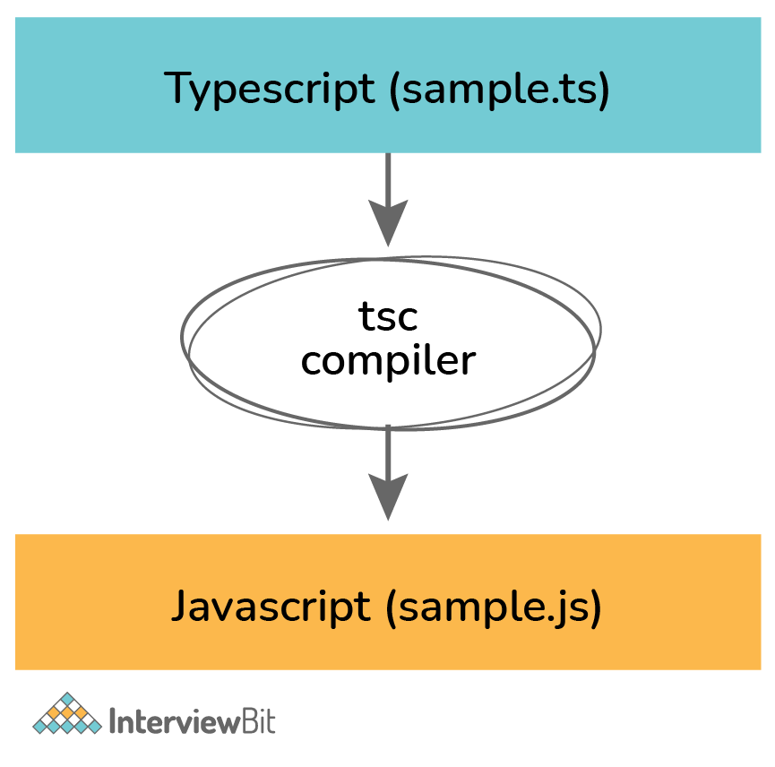
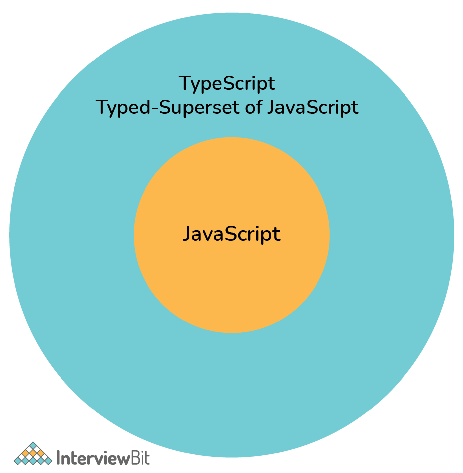
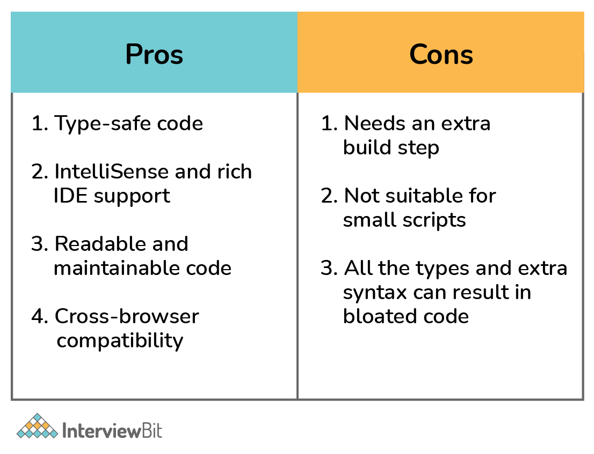
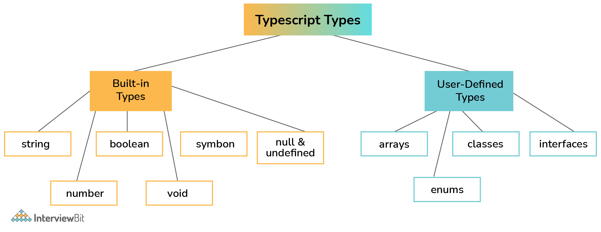

# Câu hỏi phỏng vấn TypeScript


TypeScript là một dự án mã nguồn mở được phát triển bởi Microsoft, nó có thể được coi là một phiên bản nâng cao của Javascript bởi việc bổ sung tùy chọn kiểu tĩnh và lớp hướng đối tượng mà điều này không có ở Javascript. Nó có thể chạy ở bất cứ trình duyệt, hệ điều hành hay nền tảng nào. Mọi thứ dùng được code JavaScript thì cũng dùng được TypeScript. 

## Tại sao lại dùng TypeScript?

- **Dễ phát triển dự án lớn:** Với việc sử dụng các kỹ thuật mới nhất và lập trình hướng đối tượng nên TypeScript giúp chúng ta phát triển các dự án lớn một cách dễ dàng.
- **Nhiều Framework lựa chọn:** Hiện nay các Javascript Framework đã dần khuyến khích nên sử dụng TypeScript để phát triển, ví dụ như Angular và NestJs.
- **Hỗ trợ các tính năng của Javascript phiên bản mới nhất:** TypeScript luôn đảm bảo việc sử dụng đầy đủ các kỹ thuật mới nhất của Javascript, ví dụ như version hiện tại là ECMAScript 2015 (ES6).
- **Là mã nguồn mở:** TypeScript là một mã nguồn mở nên bạn hoàn toàn có thể sử dụng mà không mất phí, bên cạnh đó còn được cộng đồng hỗ trợ.
- **TypeScript là JavaScript:** Bản chất của TypeScript là biên dịch tạo ra các đoạn mã javascript nên ban có thê chạy bất kì ở đâu miễn ở đó có hỗ trợ biên dịch Javascript. Ngoài ra bạn có thể sử dụng trộn lẫn cú pháp của Javascript vào bên trong TypeScript, điều này giúp các lập trình viên tiếp cận TypeScript dễ dàng hơn.



TypeScript sử dụng file mở rộng `.ts`, tương tự với `.js` ở file JavaScript. Ở đây là chương trình cộng hai số trong TypeScript.

```ts
function add(a: number, b: number): number {
    const sum = a + b;
    return sum;
}
```

Khi ta biên dịch file TypeScript với lệnh `tsc`, trình biên dịch TypeScript tạo file JavaScript tương ứng. 

```js
function add(a, b) {
    const sum = a + b;
    return sum;
}
```



TypeScript có tất cả tính năng của JavaScript đồng thời bổ sung thêm các tính năng static typing, interface, class, modules và generics. TypeScript hoàn toàn là một công cụ compile-time. Khi biên dịch, chương trình sẽ chỉ còn là JavaScript đơn giản. TypeScript là một ngôn ngữ để phát triển quy mô ứng dụng JavaScript.



## Mục lục

[1. Các kiểu nguyên thuỷ trong TypeScript?](#1-c%C3%A1c-ki%E1%BB%83u-nguy%C3%AAn-thu%E1%BB%B7-trong-typescript)

[2. Giải thích cách mảng làm việc trong TypeScript?](#2-gi%E1%BA%A3i-th%C3%ADch-c%C3%A1ch-m%E1%BA%A3ng-l%C3%A0m-vi%E1%BB%87c-trong-typescript)

[3. Kiểu any là gì?](#3-ki%E1%BB%83u-any-l%C3%A0-g%C3%AC)

[4. Kiểu void là gì?](#4-ki%E1%BB%83u-void-l%C3%A0-g%C3%AC)

[5. Kiểu unknown là gì?](#5-ki%E1%BB%83u-unknown-l%C3%A0-g%C3%AC)

[6. Các cách khai báo biến trong TypeScript?](#6-c%C3%A1c-c%C3%A1ch-khai-b%C3%A1o-bi%E1%BA%BFn-trong-typescript)

[7. Cung cấp cú pháp cho hàm với chú thích kiểu?](#7-cung-c%E1%BA%A5p-c%C3%BA-ph%C3%A1p-cho-h%C3%A0m-v%E1%BB%9Bi-ch%C3%BA-th%C3%ADch-ki%E1%BB%83u)

[8. Cách tạo đối tượng trong TypeScript?](#8-c%C3%A1ch-t%E1%BA%A1o-%C4%91%E1%BB%91i-t%C6%B0%E1%BB%A3ng-trong-typescript)

[9. Tuỳ chọn thuộc tính trong TypeScript?](#9-tu%E1%BB%B3-ch%E1%BB%8Dn-thu%E1%BB%99c-t%C3%ADnh-trong-typescript)

[10. Giải thích khái niệm null trong TypeScript?](#10-gi%E1%BA%A3i-th%C3%ADch-kh%C3%A1i-ni%E1%BB%87m-null-trong-typescript)

[11. undefined trong TypeScript là gì?](#11-undefined-trong-typescript-l%C3%A0-g%C3%AC)

[12. Giải thích kiểu never trong TypeScript?](#12-gi%E1%BA%A3i-th%C3%ADch-ki%E1%BB%83u-never-trong-typescript)

[13. Cách enum hoạt động trong TypeScript?](#13-c%C3%A1ch-enum-ho%E1%BA%A1t-%C4%91%E1%BB%99ng-trong-typescript)

[14. Toán tử typeof trong TypeScript là gì?](#14-to%C3%A1n-t%E1%BB%AD-typeof-trong-typescript-l%C3%A0-g%C3%AC)

[15. Tham số còn lại trong TypeScript?](#15-tham-s%E1%BB%91-c%C3%B2n-l%E1%BA%A1i-trong-typescript)

[16. Tham số destructuring là gì?](#16-tham-s%E1%BB%91-destructuring-l%C3%A0-g%C3%AC)

[17. Giải thích về cú pháp class trong TypeScript?](#17-gi%E1%BA%A3i-th%C3%ADch-v%E1%BB%81-c%C3%BA-ph%C3%A1p-class-trong-typescript)

[18. Giải thích cú pháp arrow function trong TypeScript?](#18-gi%E1%BA%A3i-th%C3%ADch-c%C3%BA-ph%C3%A1p-arrow-function-trong-typescript)

[19. Tham số tuỳ chọn trong TypeScript?](#19-tham-s%E1%BB%91-tu%E1%BB%B3-ch%E1%BB%8Dn-trong-typescript)

[20. Mục đích của file tsconfig.json?](#20-m%E1%BB%A5c-%C4%91%C3%ADch-c%E1%BB%A7a-file-tsconfigjson)

[21. Liệt kê các kiểu vòng lặp trong TypeScript?](#21-li%E1%BB%87t-k%C3%AA-c%C3%A1c-ki%E1%BB%83u-v%C3%B2ng-l%E1%BA%B7p-trong-typescript)

[22. Giải thích về kiểu symbol trong TypeScript?](#22-gi%E1%BA%A3i-th%C3%ADch-v%E1%BB%81-ki%E1%BB%83u-symbol-trong-typescript)

[23. Chuỗi tuỳ chọn trong TypeScript hoạt động thế nào?](#23-chu%E1%BB%97i-tu%E1%BB%B3-ch%E1%BB%8Dn-trong-typescript-ho%E1%BA%A1t-%C4%91%E1%BB%99ng-th%E1%BA%BF-n%C3%A0o)

[24. Nạp chồng hàm trong TypeScript?](#24-n%E1%BA%A1p-ch%E1%BB%93ng-h%C3%A0m-trong-typescript)

[25. Tự suy kiểu là gì?](#25-t%E1%BB%B1-suy-ki%E1%BB%83u-l%C3%A0-g%C3%AC)

[26. Contextual Typing là gì?](#26-contextual-typing-l%C3%A0-g%C3%AC)

[27. noImplicitAny là gì?](#27-noimplicitany-l%C3%A0-g%C3%AC)

[28. Interface là gì?](#28-interface-l%C3%A0-g%C3%AC)

[29. Các quyền truy cập trong TypeScript?](#29-c%C3%A1c-quy%E1%BB%81n-truy-c%E1%BA%ADp-trong-typescript)

[30. TypeScript có hỗ trợ static class không?](#30-typescript-c%C3%B3-h%E1%BB%97-tr%E1%BB%A3-static-class-kh%C3%B4ng)

[31. Lớp trừu tượng là gì?](#31-l%E1%BB%9Bp-tr%E1%BB%ABu-t%C6%B0%E1%BB%A3ng-l%C3%A0-g%C3%AC)

[32. Hàm ẩn danh là gì?](#32-h%C3%A0m-%E1%BA%A9n-danh-l%C3%A0-g%C3%AC)

[33. Kiểu union trong TypeScript?](#33-ki%E1%BB%83u-union-trong-typescript)

[34. Kiểu intersection là gì?](#34-ki%E1%BB%83u-intersection-l%C3%A0-g%C3%AC)

[35. Alias là gì?](#35-alias-l%C3%A0-g%C3%AC)

[36. Kiểu tuple trong TypeScript?](#36-ki%E1%BB%83u-tuple-trong-typescript)

[37. Giải thích cách hoạt động tuple destructuring trong TypeScript?](#37-gi%E1%BA%A3i-th%C3%ADch-c%C3%A1ch-ho%E1%BA%A1t-%C4%91%E1%BB%99ng-tuple-destructuring-trong-typescript)

[38. Xác nhận kiểu trong TypeScript là gì?](#38-x%C3%A1c-nh%E1%BA%ADn-ki%E1%BB%83u-trong-typescript-l%C3%A0-g%C3%AC)

[39. Cách để ép kiểm tra null trong TypeScript?](#39-c%C3%A1ch-%C4%91%E1%BB%83-%C3%A9p-ki%E1%BB%83m-tra-null-trong-typescript)

[40. Cách làm cho thuộc tính đối tượng bất biến trong TypeScript?](#40-c%C3%A1ch-l%C3%A0m-cho-thu%E1%BB%99c-t%C3%ADnh-%C4%91%E1%BB%91i-t%C6%B0%E1%BB%A3ng-b%E1%BA%A5t-bi%E1%BA%BFn-trong-typescript)

[41. File khai báo kiểu là gì?](#41-file-khai-b%C3%A1o-ki%E1%BB%83u-l%C3%A0-g%C3%AC)

[42. Các chỉ thị ba dấu gạch chéo là gì?](#42-c%C3%A1c-ch%E1%BB%89-th%E1%BB%8B-ba-d%E1%BA%A5u-g%E1%BA%A1ch-ch%C3%A9o-l%C3%A0-g%C3%AC)

[43. Giải thích toán tử in?](#43-gi%E1%BA%A3i-th%C3%ADch-to%C3%A1n-t%E1%BB%AD-in)

[44. Giải thích từ khoá implement trong TypeScript?](#44-gi%E1%BA%A3i-th%C3%ADch-t%E1%BB%AB-kho%C3%A1-implement-trong-typescript)

[45. Các kiểu chuỗi ký tự là gì?](#45-c%C3%A1c-ki%E1%BB%83u-chu%E1%BB%97i-k%C3%BD-t%E1%BB%B1-l%C3%A0-g%C3%AC)

[46. Các template literal là gì?](#46-c%C3%A1c-template-literal-l%C3%A0-g%C3%AC)

[47. Kế thừa trong TypeScript?](#47-k%E1%BA%BF-th%E1%BB%ABa-trong-typescript)

[48. Kiểu điều kiện là gì?](#48-ki%E1%BB%83u-%C4%91i%E1%BB%81u-ki%E1%BB%87n-l%C3%A0-g%C3%AC)

[49. Kiểu hàm trong TypeScript?](#49-ki%E1%BB%83u-h%C3%A0m-trong-typescript)

[50. Liệt kê một số kiểu tiện ích được cung cấp bởi TypeScript và giải thích cách sử dụng của chúng?](#50-li%E1%BB%87t-k%C3%AA-m%E1%BB%99t-s%E1%BB%91-ki%E1%BB%83u-ti%E1%BB%87n-%C3%ADch-%C4%91%C6%B0%E1%BB%A3c-cung-c%E1%BA%A5p-b%E1%BB%9Fi-typescript-v%C3%A0-gi%E1%BA%A3i-th%C3%ADch-c%C3%A1ch-s%E1%BB%AD-d%E1%BB%A5ng-c%E1%BB%A7a-ch%C3%BAng)

## Câu hỏi phỏng vấn TypeScript cho Freshers

### 1. Các kiểu nguyên thuỷ trong TypeScript?

Trong TypeScript có loại kiểu dữ liệu là kiểu có sẵn (built-in) và kiểu người dùng định nghĩa (user-defined).

* Built-in:
    - string
    - number
    - boolean
    - void
    - symbol
    - null & undefined
* User-defined:
    - arrays
    - enums
    - classes
    - interfaces



### 2. Giải thích cách mảng làm việc trong TypeScript?

Ta sử dụng mảng cho lưu trữ các giá trị cùng kiểu. Mảng là tập hợp giá trị có thứ tự và được đánh chỉ mục. Phần tử đầu tiên có chỉ mục là 0, kế tiếp là 1, ....

Cú pháp khai báo và khởi tạo mảng trong TypeScript:

```ts
let values: number[] = [];
values[0] = 10;
values[1] = 20;
values[2] = 30;
```

Ta có thể tạo mảng với cú pháp đơn giản hơn:

```ts
let values: number[] = [15, 20, 25, 30];
```

Hoặc là dùng từ khoá Array:

```ts
let values: Array<number> = [15, 20, 25, 30];
```

### 3. Kiểu any là gì?

Khi bạn muốn lưu một biến mà không biết trước kiểu của biến đó. Ví dụ, giá trị từ lệnh gọi API hoặc đầu vào người dùng. Kiểu `any` cho phép gán bất kỳ giá trị nào cho biến.

```ts
let person: any = "Foo";
```

Ví dụ:

```ts
// json may come from a third-party API
const employeeData: string = `{"name": "John Doe", "salary": 60000}`;

// parse JSON to build employee object
const employee: any = JSON.parse(employeeData);

console.log(employee.name);
console.log(employee.salary);
```

### 4. Kiểu void là gì?

Void cho biết sự vắng mặt của kiểu với biến. Nó hoạt động như đối lập với bất kỳ kiểu nào. Nó hữu ích cho các hàm không trả về giá trị.

```ts
function notify(): void {
    alert("The user has been notified.");
}
```

### 5. Kiểu unknown là gì?

Kiểu unknown là kiểu đối chứng với kiểu any. Bạn có thể gán cho kiểu unknown với bất cứ thứ gì , nhưng không thể gán bất kỳ thứ gì bằng kiểu unknown (có thể khi ta thu hẹp kiểu dựa trên luồng điều khiển). Bạn không thể thực hiện bất kỳ thao tác nào trên một biến thuộc kiểu unknown mà không xác định trước loại cụ thể của biến đó.

Hãy xem xét ví dụ sau. Chúng ta tạo biến unknown `foo` và gán giá trị chuỗi cho nó. Nếu chúng ta cố gắng gán biến unknown vào một biến chuỗi `bar`, trình biên dịch sẽ báo lỗi.

```ts
let foo: unknown = "Akshay";
let bar: string = foo; // Type 'unknown' is not assignable to type 'string'.(2322)
```

Bạn có thể thu hẹp một biến của một kiểu unknown thành một kiểu gì đó cụ thể bằng cách thực hiện kiểm tra kiểu hoặc kiểm tra so sánh hoặc sử dụng bảo vệ kiểu. Ví dụ: chúng ta có thể loại bỏ lỗi trên bằng cách

```ts
let foo: unknown = "Akshay";
let bar: string = foo as string;
```

### 6. Các cách khai báo biến trong TypeScript?

**var** khai báo một biến cục bộ hoặc toàn cục. Bạn có thể thiết lập giá trị khi khai báo. Các hành vi và phạm vi của nó tương tự với ở JavaScript. Ví dụ:

```ts
var foo = "bar";
```

**let** khai báo biến cục bộ. Tương tự var, bạn có thể thiết lập giá trị biến khi khai báo. Ví dụ:

```ts
let a = 5;

if (true) {
    let a = 10;
    console.log(a);  // 10
}
console.log(a);  // 5
```

**const** khai báo hằng cục bộ không thể thay đổi sau khi khởi tạo.

```ts
const a = 5;

if (true) {
    a = 10; // Error: Cannot assign to 'a' because it is a constant.(2588)
} 
```

### 7. Cung cấp cú pháp cho hàm với chú thích kiểu?

Hàm là các khối code để thực hiện một code cụ thể. Các hàm có thể tùy ý nhận một hoặc nhiều tham số, xử lý chúng và tùy chọn trả về một giá trị. Trong TypeScript hàm cần có chú thích kiểu là kiểu giá trị trả về của hàm.

```ts
function greet(name: string): string {
  return `Hello, ${name}`;
}

let greeting = greet("Anders");
console.log(greeting);  // "Hello, Anders"
```

### 8. Cách tạo đối tượng trong TypeScript?

Đối tượng là một tập hợp key/value. Key là duy nhất. Nó gần tương đồng với mảng nên còn gọi là mảng liên kết. Tuy nhiên, mảng sử dụng key/chỉ mục là giá trị số, trong khi đối tượng cho phép bất kỳ kiểu dữ liệu nào là key.

Trong TypeScript, kiểu đối tượng đề cập đến bất kỳ thuộc tính nào. Nó có thể định nghĩa danh sách thuộc tính và kiểu của nó. Ví dụ:

```ts
let pt: { x: number; y: number } = {
  x: 10,
  y: 20
};
```

### 9. Tuỳ chọn thuộc tính trong TypeScript?

Một đối tượng có thể có thuộc tính tuỳ chọn (có hoặc không có) bằng cách thêm `?` sau tên thuộc tính.

```ts
let pt: { x: number; y: number; z?: number } = {
  x: 10,
  y: 20
};
console.log(pt);
```

Trong ví dụ trên, thuộc tính `z` là tuỳ chọn, trình biên dịch không bắt buộc ta cung cấp khi khởi tạo đối tượng.

### 10. Giải thích khái niệm null trong TypeScript?

Trong lập trình, giá trị null cho biết không có giá trị. Một biến null không trỏ đến bất kỳ đối tượng nào. Do đó, bạn không thể truy cập bất kỳ thuộc tính nào trên biến hoặc gọi một phương thức trên đó.

Trong TypeScript, giá trị null được chỉ định bằng từ khoá `null`. Ví dụ

```ts
function greet(name: string | null) {
    if (name === null) {
        console.log("Name is not provided");
    } else {
        console.log("Good morning, " + name.toUpperCase());
    }
}

var foo = null;
greet(foo); // "Name is not provided"

foo = "Anders";
greet(foo);  // "Good morning, ANDERS"
```

### 11. undefined trong TypeScript là gì?

Khi một biến được khai báo mà không tạo giá trị, nó sẽ được gán giá trị undefined. 

```ts
console.log(null == null); // true
console.log(undefined == undefined); // true
console.log(null == undefined); // true, with type-conversion
console.log(null === undefined); // false, without type-conversion
console.log(0 == undefined); // false
console.log('' == undefined); // false
console.log(false == undefined); // false
```

### 12. Giải thích kiểu never trong TypeScript?

Kiểu never trong TypeScript là một kiểu không chứa giá trị. Do đó, bạn không thể gán bất kỳ giá trị nào cho biến có kiểu never.

```ts
function error(message: string): never {
    throw new Error(message);
}
```

Câu hỏi đặt ra là tại sao cần kiểu `never` khi ta đã có `void`. Vì cả hai khá giống nhau, nhưng thực sự chúng lại là đại diện cho hai khái niệm khác nhau.

Một hàm không trả về một giá trị nào ngầm hiểu là giá trị undefined trong JavaScript. Do đó, khi ta dùng `void` với một hàm thực tế nó vẫn nhận về kiểu undefined. Để đảm bảo hàm không nhận bất cứ giá trị nào, kiểu `never` được dùng cho những trường hợp như vậy.

```ts
const test = (arg): void => {
    console.log(arg)
}

console.log(test('test'))

// "test"
// undefined
```

### 13. Cách enum hoạt động trong TypeScript?

Enums cho phép chúng ta tạo các hằng số được đặt tên. Đây là một cách đơn giản để đặt tên thân thiện hơn cho các giá trị hằng số. Một enum được định nghĩa bởi từ khóa enum, theo sau là tên và các thành viên của nó.

Ví dụ:

```ts
enum Team {
    Alpha,
    Beta,
    Gamma,
    Delta
}

let t: Team = Team.Delta;
```

Mặc định, enum bắt đầu đánh số từ 0. Bạn có thể ghi đè lên giá trị mặc định bằng cách gán giá trị cho các thành viên của nó. Ví dụ:

```ts
enum Author {
  Anders = "Anders",
  Hejlsberg = "Hejlsberg"
};
```

### 14. Toán tử typeof trong TypeScript là gì?

Tương tự JavaScript, đây là toán tử trả về kiểu dữ liệu của toán hạng.

```ts
console.log(typeof 10);  // "number"

console.log(typeof 'foo');  // "string"

console.log(typeof false);  // "boolean"

console.log(typeof bar);  // "undefined"
```

### 15. Tham số còn lại trong TypeScript?

Tham số còn lại (`...`) cho phép một hàm nhận một lượng không giới hạn tham số như là một mảng. 

```ts
function add(...values: number[]) {
    let sum = 0;
    values.forEach(val => sum += val);
    
    return sum;
}

const sum = add(5, 10, 15, 20);
console.log(sum);  // 50
```

### 16. Tham số destructuring là gì?

Tham số destructuring cho phép một hàm tách một đối tượng được cung cấp dưới dạng đối số thành một hoặc nhiều biến cục bộ.

```ts
function multiply({ a, b, c }: { a: number; b: number; c: number }) {
    console.log(a * b * c);
}

multiply({ a: 1, b: 2, c: 3 });
```

Bạn có thể tối ưu code trên bằng cách dùng interface hoặc type:

```ts
type ABC = { a: number; b: number; c: number };

function multiply({ a, b, c }: ABC) {
    console.log(a * b * c);
}

multiply({ a: 1, b: 2, c: 3 });
```

### 17. Giải thích về cú pháp class trong TypeScript?

TypeScript hỗ trợ lớp đầy đủ. Cú pháp TypeScript cho khai báo lớp tương tự JavaScript, với hỗ trợ khai báo kiểu cho các thuộc tính của nó.

Ví dụ lớp Employee:

```ts
class Employee {
    name: string;
    salary: number;

    constructor(name: string, salary: number) {
        this.name = name;
        this.salary = salary;
    }
    promote() : void {
        this.salary += 10000;
    }
}
```

Ta có thể tạo đối tượng cho lớp bằng cách dùng từ khoá `new`

```ts
// Create a new employee
let john = new Employee("John", 60000);

console.log(john.salary);  // 60000
john.promote();
console.log(john.salary);  // 70000
```

### 18. Giải thích cú pháp arrow function trong TypeScript?

Arrow function cung cấp cú pháp ngắn và thuận tiện hơn cho khai báo hàm. Nó còn được gọi là lambdas ở một số ngôn ngữ lập trình khác.

Cú pháp khai báo hàm thông thường:

```ts
function add(x: number, y: number): number {
    let sum = x + y;
    return sum;
}
```

Sử dụng arrow function:

```ts
let add = (x: number, y: number): number => {
    let sum = x + y;
    return sum;
}
```

Bạn có thể đơn giản cú pháp hơn nữa bằng cách lược bỏ câu lệnh `return`. Nó được cho phép khi thân hàm chỉ có duy nhất một câu lệnh, ví dụ:

```ts
let add = (x: number, y: number): number => x + y; 
```

Arrow function thường được dùng cho các hàm callback trong TypeScript. Xem đoạn code bên dưới một vòng lặp qua một mảng số để lọc và trả về các bội của 5.

```ts
let numbers = [3, 5, 9, 15, 34, 35];

let fiveMultiples = numbers.filter(num => (num % 5) == 0);

console.log(fiveMultiples);  // [5, 15, 35]
```

### 19. Tham số tuỳ chọn trong TypeScript?

Một hàm có thể có một hay nhiều tham số tuỳ chọn bằng cách thêm dấu `?` sau nó. Ví dụ:

```ts
function greet(name: string, greeting?: string) {
    if (!greeting)
        greeting = "Hello";

    console.log(`${greeting}, ${name}`);
}

greet("John", "Hi");  // Hi, John
greet("Mary", "Hola");  // Hola, Mary
greet("Jane");  // Hello, Jane
```

### 20. Mục đích của file tsconfig.json?

Một file tsconfig.json trong một thư mục đánh dấu thư mục đó là thư mục gốc của một dự án TypeScript. Nó cung cấp các tùy chọn trình biên dịch để biên dịch dự án.

```ts
{
    "compilerOptions": {
        "module": "system",
        "noImplicitAny": true,
        "removeComments": true,
        "outFile": "../../built/local/tsc.js",
        "sourceMap": true
    },
    "include": ["src/**/*"],
    "exclude": ["node_modules", "**/*.spec.ts"]
}
```

## Câu hỏi phỏng vấn TypeScript cho Experienced

### 21. Liệt kê các kiểu vòng lặp trong TypeScript?

TypeScript cung cấp 3 cách lặp qua tập hợp như sau:

- Vòng lặp **for**

```ts
let values = [10, "foo", true];

for(let i=0; i<values.length; i++) {
    console.log(values[i]);  // 10, "foo", true
}
```

- Hàm **forEach**

```ts
let values = [10, "foo", true];
values.forEach(val => {
    console.log(val);  // 10, "foo", true
})
```

- Câu lệnh **for..of**

```ts
let values = [10, "foo", true];
for (let val of values) {
    console.log(val); // 10, "foo", true
}
```

### 22. Giải thích về kiểu symbol trong TypeScript?

Symbol được giới thiệu ở ES6 và được hỗ trợ trong TypeScript. Tương tự như `number` hay `string`, `symbol` là một kiểu nguyên thuỷ. Được sử dụng để tạo thuộc tính duy nhất cho đối tượng.

Bạn có thể tạo giá trị symbol bằng hàm khởi tạo `Symbol()`, thường dùng một khoá chuỗi:

```ts
let foo = Symbol();
let bar = Symbol("bar");
```

Một khoá ký tự của symbol là duy nhất và bất biến.

```ts
let foo = Symbol("foo");
let newFoo = Symbol("foo");

let areEqual = foo === newFoo;
console.log(areEqual);  // false, symbols are unique
```

### 23. Chuỗi tuỳ chọn trong TypeScript hoạt động thế nào?

Chuỗi tuỳ chọn cho phép bạn truy cập thuộc tính và gọi phương thức trên một đối tượng dạng chuỗi. 

TypeScript dừng ngay lập tức các biểu thức nếu nó trả về giá trị `null` hay `undefined`.

Ví dụ, một biểu thức dài như sau:

```ts
let x = foo === null || foo === undefined ? undefined : foo.bar.baz();
```

có thể đơn giản thành:

```ts
let x = foo?.bar.baz();
```

### 24. Nạp chồng hàm trong TypeScript?

Nạp chồng hàm cho phép ta khai báo nhiều hàm cùng tên, nhưng số lượng tham số cho từng hàm phải khác nhau.

Ví dụ bên dưới khai báo hai hàm nạp chồng cho `builđate`. Hàm nạp chồng đầu tiên nhận về tham số kiểu *number*, trong khi tham số thứ hai nhận về 3 tham số kiểu *number*. 

```ts
function buildDate(timestamp: number): Date;
function buildDate(m: number, d: number, y: number): Date;
```

### 25. Tự suy kiểu là gì?

TypeScript có thể tự suy kiểu của biến nếu bạn không cung cấp kiểu cụ thể. Điều này gọi là tự suy kiểu. Nó thường dùng khi các biến hoặc tham số được khởi tạo khi khai báo.

Ví dụ, đoạn code dưới đây TypeScript sẽ mặc định biến `foo` là kiểu string

```ts
let foo = "this is a string";
console.log(typeof foo);  // "string"
```

### 26. Contextual Typing là gì?

Khi trình biên dịch TypeScript sử dụng vị trí (hoặc ngữ cảnh) của một biến để suy ra kiểu của nó, nó được gọi là nhập theo ngữ cảnh (Contextual Typing).

Trong ví dụ sau, TypeScript sử dụng thông tin kiểu hàm `window.onmousedown` để suy ra kiểu của biểu thức hàm ở phía bên phải của phép gán. Điều này cho phép nó suy ra kiểu của tham số `e`, tham số này có thuộc tính button nhưng không có thuộc tính có tên `foo`.

```ts
window.onmousedown = function (e) {
    console.log(e.button); //<- OK
    console.log(e.foo); //<- Error!
};
```

### 27. noImplicitAny là gì?

Thông thường, nếu ta không cung cấp kiểu cho biến, TypeScript sẽ giả sử rằng đó là kiểu any. Ví dụ, đoạn code sau, tham số `s` sẽ được xem như là kiểu any. Nó hoạt động cùng với chuỗi được truyền:

```ts
function parse(s) {
    console.log(s.split(' '));
}
parse("Hello world");  // ["Hello", "world"]
```

Tuy nhiên, code sẽ sinh lỗi ngay khi ta truyền một số hoặc kiểu khác chuỗi vào phương thức `split()`. Ví dụ:

```ts
function parse(s) {
    console.log(s.split(' '));  // [ERR]: s.split is not a function
}
parse(10); 
```

**noImplicitAny** là một trình biên dịch tuỳ chọn mà bạn thiết lập trong file tsconfig.json. Nó ép trình biên dịch TypeScript báo lỗi bất cứ khi nào nó đưa ra một biến kiểu any. Điều này ngăn việc vô tình tạo các lỗi tương tự:

```ts
// Parameter 's' implicitly has an 'any' type.(7006)
function parse(s) {
    console.log(s.split(' '));  // [ERR]: s.split is not a function
}
```

### 28. Interface là gì?

Interface trong typescript cho phép bạn định nghĩ thuộc tính và phương thức là gì mà đối tượng cần để được triển khai (implement). Nếu đối tượng tuân thủ đúng khuôn mẫu interface thì đối tượng đã triển khai interface ấy sẽ được thi hành đúng. Nếu interface không được thi hành đúng thì typescript sẽ phát sinh lỗi ngay lập tức.

```ts
interface Employee {
    name: string;
    salary: number;
}

function process(employee: Employee) {
    console.log(`${employee.name}'s salary = ${employee.salary}`);
}

let john: Employee = {
    name: "John Doe",
    salary: 150000
}

process(john);  // "John Doe's salary = 150000"
```

### 29. Các quyền truy cập trong TypeScript?

TypeScript cung cấp ba từ khoá cho điều khiển truy cập thành viên của lớp, như thuộc tính hay phương thức:

- **public**: có thể truy cập ở bất cứ đâu kể cả bên ngoài lớp. Tất cả lớp thành viên mặc định là public.
- **protected**: là thành viên chỉ có thể truy cập bởi lớp con của lớp chứa thành viện đó. Bên ngoài không thể truy cập vào các thành viên protected.
- **private**: chỉ có thể truy cập bên trong lớp đó.

### 30. TypeScript có hỗ trợ static class không?

TypeScript không có hỗ trợ static class, không giống như các ngôn ngữ lập trình hướng đối tượng như C# hay Java.

Các ngôn ngữ này cần các static class vì tất cả code, tức là dữ liệu và các hàm, cần phải nằm trong một lớp và không thể tồn tại độc lập. Các static class cung cấp một cách để cho phép các hàm này mà không cần liên kết chúng với bất kỳ đối tượng nào.

Trong TypeScript, bạn có thể tạo bất kỳ dữ liệu và nào nào dưới dạng các đối tượng đơn giản mà không cần tạo một lớp chứa. Do đó, TypeScript không cần các static class. Một lớp singleton chỉ là một đối tượng đơn giản trong TypeScript

### 31. Lớp trừu tượng là gì?

Các lớp trừu tượng tương tự như các interface ở chỗ chúng chỉ định một hợp đồng cho các đối tượng và bạn không thể khởi tạo chúng trực tiếp. Tuy nhiên, không giống như các interface, một lớp trừu tượng có thể cung cấp các chi tiết triển khai cho một hoặc nhiều thành viên của nó.

Một lớp trừu tượng đánh dấu một hoặc nhiều thành viên của nó là trừu tượng. Bất kỳ lớp nào kế thừa một lớp trừu tượng phải cung cấp một triển khai cho các thành viên trừu tượng của lớp cha.

Đây là một ví dụ về một lớp trừu tượng `Writer` với hai hàm thành viên. Phương thức `write()` được đánh dấu là trừu tượng, trong khi phương thức `welcome()` là triển khai. Cả hai lớp `FictionWriter` và `RomanceWriter` kế thừa từ `Writer` phải cung cấp triển khai cụ thể của chúng cho phương thức `write`.

```ts
abstract class Writer {
    abstract write(): void;

    greet(): void {
        console.log("Hello, there. I am a writer.");
    }
}

class FictionWriter extends Writer {
    write(): void {
        console.log("Writing a fiction.");
    }
}

class RomanceWriter extends Writer {
    write(): void {
        console.log("Writing a romance novel.");
    }
}

const john = new FictionWriter();
john.greet();  // "Hello, there. I am a writer."
john.write();  // "Writing a fiction."

const mary = new RomanceWriter();
mary.greet();  // "Hello, there. I am a writer."
mary.write();  // "Writing a romance novel."
```

### 32. Hàm ẩn danh là gì?

Một hàm ẩn danh là một hàm không có tên. Các hàm ẩn danh thường được sử dụng như các hàm callback, tức là chúng được chuyển cho các hàm khác, chỉ được gọi bởi hàm khác vào thời điểm sau đó. Ví dụ,

```ts
setTimeout(function () {
  console.log('Run after 2 seconds')
}, 2000);
```

Bạn có thể gọi một hàm ẩn danh ngay sau khi nó được tạo. Nó được gọi là IIFE, ví dụ:

```ts
(function() {
  console.log('Invoked immediately after creation');
})();
```

### 33. Kiểu union trong TypeScript?

Kiểu union là một kiểu cấu trúc đặc biệt trong TypeScript biểu thị một giá trị có thể có nhiều kiểu. Phân tách bằng ký hiệu `|`.

Hãy xem xét ví dụ sau đây trong đó biến `value` thuộc kiểu union bao gồm chuỗi và số. Value được khởi tạo thành chuỗi "Foo". Bởi vì nó chỉ có thể là một chuỗi hoặc một số, ta có thể thay đổi nó thành một số sau đó và trình biên dịch TypeScript không phàn nàn.

```ts
let value: string | number = "Foo";
value = 10;  // Okay
```

Tuy nhiên, nếu ta gán cho nó một giá trị thuộc kiểu không được bao gồm trong kiểu union, nó sẽ báo lỗi:

```ts
value = true;  // Type 'boolean' is not assignable to type 'string | number'.(2322)
```

### 34. Kiểu intersection là gì?

Kiểu intersection cho phép bạn kết hợp các thành viên của hai hoặc nhiều kiểu bằng cách sử dụng toán tử `&`. Điều này cho phép bạn kết hợp các kiểu hiện có để có được một kiểu duy nhất với tất cả các tính năng bạn cần.

Ví dụ: Ta tạo kiểu `Supervisor` mới từ thành viên của kiểu `Employee` và `Manager`:

```ts
interface Employee {
    work: () => string;
}

interface Manager {
    manage: () => string;
}

type Supervisor = Employee & Manager;

// john can both work and manage
let john: Supervisor;
```

### 35. Alias là gì?

Alias (tên bí danh) cung cấp một tên mới cho kiểu hiện có. Nó không cung cấp kiểu mới mà cung cấp tên mới đề cập đến kiểu đó.

Ví dụ: bạn có đặt bí danh cho kiểu union đế tránh nhập tất cả kiểu ở mọi nơi mà giá trị đó đang sử dụng.

```ts
type alphanumeric = string | number;
let value: alphanumeric = "";
value = 10;
```

### 36. Kiểu tuple trong TypeScript?

Tuple là kiểu đặc biệt trong TypeScript. Chúng tương tự như mảng có một số phần tử cố định với một kiểu đã biết. Tuy nhiên, các kiểu không cần phải giống nhau.

```ts
// Declare a tuple type and initialize it
let values: [string, number] = ["Foo", 15];

// Type 'boolean' is not assignable to type 'string'.(2322)
// Type 'string' is not assignable to type 'number'.(2322)
let wrongValues: [string, number] = [true, "hello"]; // Error
```

Ở TypeScript 3.0, một tuple có thể chỉ định một hoặc nhiều kiểu tuỳ chọn sử dụng ? như bên dưới:

```ts
let values: [string, number, boolean?] = ["Foo", 15];
```

### 37. Giải thích cách hoạt động tuple destructuring trong TypeScript?

Bạn có thể destructuring phần tử tuple bằng cách dùng toán tử (=). Các biến destructuring nhận kiểu của phần tử tuple tương ứng.

```ts
let employeeRecord: [string, number] = ["John Doe", 50000];
let [emp_name, emp_salary] = employeeRecord;
console.log(`Name: ${emp_name}`);  // "Name: John Doe"
console.log(`Salary: ${emp_salary}`);  // "Salary: 50000"
```

Sau destructuring, bạn không thể gán giá trị kiểu khác cho biến bị destructuring. Ví dụ:

```ts
emp_name = true;  // Type 'boolean' is not assignable to type 'string'.(2322)
```

### 38. Xác nhận kiểu trong TypeScript là gì?

Đôi khi, bạn với tư cách là một lập trình viên có thể biết nhiều hơn về kiểu của một biến mà TypeScript có thể suy luận. Thông thường, điều này xảy ra khi bạn biết kiểu đối tượng cụ thể hơn kiểu hiện tại của nó. Trong những trường hợp như vậy, bạn có thể yêu cầu trình biên dịch TypeScript không suy ra kiểu của biến bằng cách sử dụng xác nhận kiểu.

TypeScript cung cấp hai cú pháp cho xác nhận kiểu:

- Dùng `as`

```ts
let value: unknown = "Foo";
let len: number = (value as string).length;
```

- Dùng `<>`

```ts
let value: unknown = "Foo";
let len: number = (<string>value).length;
```

### 39. Cách để ép kiểm tra null trong TypeScript?

Con trỏ null là một trong những nguyên nhân phổ biến dẫn đến lỗi "Error runtime unexpected" trong lập trình. TypeScript giúp bạn tránh chúng ở một mức độ cao bằng cách thực thị kiểm tra null nghiêm ngặt (strict null checks).

Ta có thể thực hiện theo hai cách:
- cung cấp cờ --strictNullChecks trong trình biên dịch TypeScript.
- thiết lập thuộc tính strictNullChecks là true trong cấu hình tsconfig.json. 

Khi cờ là false, TypeScript bỏ qua các giá trị null và undefined trong code. Khi nó là true, null và undefined có các kiểu riêng biệt. Trình biên dịch throw một lỗi nếu bạn cố gắng sử dụng chúng ở những nơi mà một giá trị cụ thể được mong đợi.

### 40. Cách làm cho thuộc tính đối tượng bất biến trong TypeScript?

Bạn có thể làm cho thuộc tính đối tượng là bất biến bằng cách dùng từ khoá `readonly`.

```ts
interface Coordinate {
    readonly x: number;
    readonly y: number;
}
```

Khi bạn đánh dấu một thuộc tính là readonly, nó chỉ có thể được đặt khi bạn khởi tạo đối tượng. Khi đối tượng được tạo, bạn không thể thay đổi nó.

```ts
let c: Coordinate = { x: 5, y: 15 };
c.x = 20; // Cannot assign to 'x' because it is a read-only property.(2540)
```

### 41. File khai báo kiểu là gì?

Một dự án TypeScript điển hình tham chiếu đến các thư viện TypeScript của bên thứ ba khác như jQuery để thực hiện các tác vụ thông thường. Có thông tin kiểu cho file thư viện giúp bạn mã hóa bằng cách cung cấp thông tin chi tiết về kiểu, đặc trưng phương thức, ... và cung cấp IntelliSense.

File khai báo kiểu là file văn bản kết thúc bằng phần mở rộng `.d.ts` cung cấp cách khai báo sự tồn tại của một số kiểu hoặc giá trị mà không thực sự cung cấp triển khai cho các giá trị đó. Nó chứa các khai báo kiểu nhưng không có bất kỳ code nguồn nào. Nó không tạo ra file `.js` sau khi biên dịch.

### 42. Các chỉ thị ba dấu gạch chéo là gì?

Chỉ thị ba dấu gạch chéo là các chú thích một dòng chứa một thẻ XML. TypeScript sử dụng thẻ XML này làm chỉ thị trình biên dịch.

Bạn chỉ có thể đặt ba dấu gạch chéo ở đầu file. Chỉ các comment đơn hoặc nhiều dòng mới có thể xuất hiện trước ba dấu gạch chéo. TypeScript coi chúng như những comment thông thường nếu nó xuất hiện ở giữa một khối code, sau một câu lệnh.

Công dụng chính của chỉ thị ba dấu gạch chéo là bao gồm các file khác trong quá trình biên dịch. Ví dụ: lệnh sau đây hướng dẫn trình biên dịch bao gồm một file được chỉ định bởi đường dẫn trong file TypeScript có chứa.

```ts
/// <đường dẫn tham chiếu = "..." />
```

Lệnh ba dấu gạch chéo cũng sắp xếp đầu ra khi sử dụng --out hoặc --outFile. Các file đầu ra được tạo ra vị trí file đầu ra theo thứ tự giống như các file đầu vào.

### 43. Giải thích toán tử in?

Toán tử in được sử dụng để tìm xem một thuộc tính có nằm trong đối tượng được chỉ định hay không. Nó trả về true nếu thuộc tính thuộc về đối tượng. Nếu không, nó trả về false.

```ts
const car = { make: 'Hyundai', model: 'Elantra', year: 2017 };
console.log('model' in car);  // true
console.log('test' in car);  // false
```

### 44. Giải thích từ khoá implement trong TypeScript?

Một implement được dùng để kiểm tra một lớp có thoả mãn hợp đồng được chỉ định bởi một interface hay không. 

```ts
interface Runnable {
    run(): void;
}

class Job implements Runnable {
    run() {
        console.log("running the scheduled job!");
    }
}

// Class 'Task' incorrectly implements interface 'Runnable'.
// Property 'run' is missing in type 'Task' but required in type 'Runnable'.(2420)
class Task implements Runnable {
    perform() {
        console.log("pong!");
    }
}
```

Một lớp có thể triển khai nhiều hơn một interface. Trong trường hợp này, lớp phải chỉ định tất cả các hợp đồng của các giao diện đó.

### 45. Các kiểu chuỗi ký tự là gì?

Trong TypeScript, bạn có thể chỉ định một chuỗi hay số cụ thể như một kiểu. 

```ts
let foo: "bar" = "bar";

// OK
foo = "bar";

// Error: Type '"baz"' is not assignable to type '"bar"'.(2322)
foo = "baz";
```

Nhưng với kiểu chuỗi ký tự thì không hữu ích lắm. Tuy nhiên bạn có thể kết hợp chúng thành union. Điều này cho phép bạn chỉ định tất cả các giá trị chuỗi mà một biến có thể nhận, lần lượt hoạt động giống như enums. Điều này có thể hữu ích cho các tham số hàm.

```ts
function greet(name: string, greeting: "hi" | "hello" | "hola") {
// ...
}

greet("John", "hello");

// Error: Argument of type '"Howdy?"' is not assignable to parameter of type '"hi" | "hello" | "hola"'.(2345)
greet("Mary", "Howdy?");
```

### 46. Các template literal là gì?

Tính năng được lấy từ ES6, trong TypeScript bạn có thể chèn giá trị của một biến vào chuỗi bằng cách sử dụng cú pháp `${}`, và chuỗi được bọc trong dấu "``".

```ts
type Point = "GraphPoint";

// type Shape = "Grid GraphPoint"
type Shape = `Grid ${Point}`;
```

Ta có thể mở rộng chúng union. Nó giúp tạo một tập tất cả các chuỗi có thể mà một thành viên union có thể thể biểu diễn.

```ts
type Color = "green" | "yellow";
type Quantity = "five" | "six";

// type ItemTwo = "five item" | "six item" | "green item" | "yellow item"
type ItemOne = `${Quantity | Color} item`; 
```

### 47. Kế thừa trong TypeScript?

Tính kế thừa cho phép một lớp kế thừa một lớp khác, sử dụng lại và sửa đổi hành vi được định nghĩa trong lớp đó. Lớp kế thừa một lớp khác được gọi là lớp dẫn xuất và lớp nhận được kế thừa được gọi là lớp cơ sở.

Trong TypeScript, một lớp chỉ có thể kế thừa từ một lớp. TypeScript sử dụng từ khóa `extend` để xác định mối quan hệ giữa lớp cơ sở và các lớp dẫn xuất.

```ts
class Rectangle {
    length: number;
    breadth: number

    constructor(length: number, breadth: number) {
        this.length = length;
        this.breadth = breadth
    }

    area(): number {
        return this.length * this.breadth;
    }
}

class Square extends Rectangle {
    constructor(side: number) {
        super(side, side);
    }

    volume() {
        return "Square doesn't have a volume!"
    }
}

const sq = new Square(10);

console.log(sq.area());  // 100
console.log(sq.volume());  // "Square doesn't have a volume!"
```

Trong ví dụ trên, vì lớp `Square` kế thừa chức năng từ `Rectangle`, chúng ta có thể tạo một biểu diễn của hình vuông và gọi cả hai phương thức `area()` và `volume()`.

### 48. Kiểu điều kiện là gì?

Kiểu có điều kiện cho phép bạn chọn một trong hai kiểu có thể dựa trên một điều kiện. Điều kiện được thể hiện dưới dạng một bài kiểm tra mối quan hệ kiểu.

```ts
C extends B ? TypeX : TypeY
```

Ở đâu, nếu kiểu C kế thừa từ B, giá trị của kiểu trên là TypeX, ngược lại thì là TypeY.

### 49. Kiểu hàm trong TypeScript?

Hàm là một kiểu toàn cục trong TypeScript. Nó có các thuộc tính như bind, call và apply, cùng với các thuộc tính khác có trên tất cả các giá trị hàm.

```ts
function perform(fn: Function) {
    fn(10);
}
```

Bạn có thể gọi một giá trị của kiểu hàm, và trả về một giá trị any.

### 50. Liệt kê một số kiểu tiện ích được cung cấp bởi TypeScript và giải thích cách sử dụng của chúng?

TypeScript cung cấp nhiều kiểu tiện ích khác nhau giúp cho việc chuyển đổi kiểu thông thường trở nên dễ dàng. Các loại tiện ích này có sẵn trên toàn cục. Dưới đây là một số kiểu tiện ích thiết yếu có trong TypeScript.

| Kiểu tiện ích | Mô tả |
|-|-|
| Partial<Type> | Tạo một kiểu với tất cả các thuộc tính của Type được đặt thành tùy chọn |
| Required<Type> | Tạo một kiểu bao gồm tất cả các thuộc tính của Type được đặt thành bắt buộc |
| Readonly<Type> | Tạo một kiểu với tất cả các thuộc tính của Type được đặt thành readonly |
| Record<Keys, Type> | Tạo một kiểu đối tượng với các khóa thuộc tính là kiểu Keys và giá trị là Type |