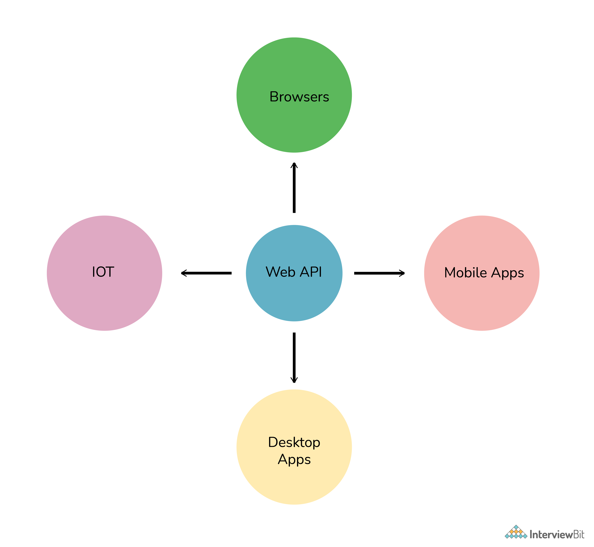
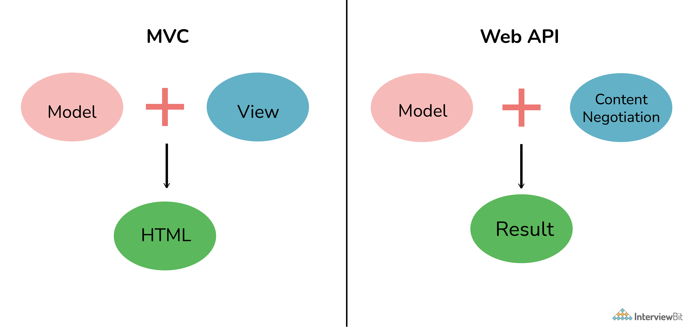
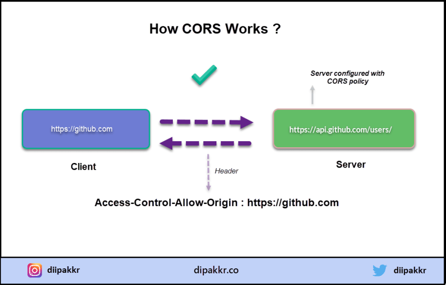

# Câu hỏi phỏng vấn Web API


## Giới thiệu Web API

- Ngày 7 tháng 2, 2000: Web API được giới thiệu lần đầu tiên cùng với Salesforce. Công ty Salesforce chunhs thức sử dụng API tại hội nghị IDG Demo 2000.
- Ngày 20 tháng 11, 2000: eBay ra mắt eBay API của họ với eBay Developers Program.
- Ngày 16 tháng 7, 2002: Amazon ra mắt dịch vụ web Amazon.con cho phép lập trình viên triển khai nội dung và tính năng của amazon.com vào trang web của họ.

Web API đầu được giới thiệu sớm bởi các trang thương mại điện tử trên Internet. theo thời gian nó ngày càng ngày phổ biến và được sử dụng rộng rãi bởi nhiều tổ chức, doanh nghiệp trên thế giới.

## Mục lục

[1. Tại sao Web API quan trọng?](#1-t%E1%BA%A1i-sao-web-api-quan-tr%E1%BB%8Dng)

[2. Chính xác thì Web API là gì?](#2-ch%C3%ADnh-x%C3%A1c-th%C3%AC-web-api-l%C3%A0-g%C3%AC)

[3. Kiểu trả về được hỗ trợ trong Web API?](#3-ki%E1%BB%83u-tr%E1%BA%A3-v%E1%BB%81-%C4%91%C6%B0%E1%BB%A3c-h%E1%BB%97-tr%E1%BB%A3-trong-web-api)

[4. Sự khác biệt giữa WCF và Web API?](#4-s%E1%BB%B1-kh%C3%A1c-bi%E1%BB%87t-gi%E1%BB%AFa-wcf-v%C3%A0-web-api)

[5. Web API tốt hơn WCF ở điểm nào?](#5-web-api-t%E1%BB%91t-h%C6%A1n-wcf-%E1%BB%9F-%C4%91i%E1%BB%83m-n%C3%A0o)

[6. Sự khác biệt giữa REST API và RESTful API?](#6-s%E1%BB%B1-kh%C3%A1c-bi%E1%BB%87t-gi%E1%BB%AFa-rest-api-v%C3%A0-restful-api)

[7. Ưu điểm của sử dụng REST trong Web API?](#7-%C6%B0u-%C4%91i%E1%BB%83m-c%E1%BB%A7a-s%E1%BB%AD-d%E1%BB%A5ng-rest-trong-web-api)

[8. Sự khác biệt giữa REST và SOAP?](#8-s%E1%BB%B1-kh%C3%A1c-bi%E1%BB%87t-gi%E1%BB%AFa-rest-v%C3%A0-soap)

[9. Giao thức hỗ trợ Web API?](#9-giao-th%E1%BB%A9c-h%E1%BB%97-tr%E1%BB%A3-web-api)

[10. XML và JSON là gì?](#10-xml-v%C3%A0-json-l%C3%A0-g%C3%AC)

[11. Đối tượng sử dụng Web API?](#11-%C4%91%E1%BB%91i-t%C6%B0%E1%BB%A3ng-s%E1%BB%AD-d%E1%BB%A5ng-web-api)

[12. Web API và MVC có gì khác?](#12-web-api-v%C3%A0-mvc-c%C3%B3-g%C3%AC-kh%C3%A1c)

[13. CORS là gì?](#13-cors-l%C3%A0-g%C3%AC)

## Câu hỏi phỏng vấn Web API

### 1. Tại sao Web API quan trọng?

Web API được xem như một dịch vụ cơ bản cung cấp thông tin hoặc dữ liệu từ server. Nó quan trọng vì những lý do sau:

- Nó được dùng để cung cấp interface cho web hay ứng dụng để có thể truy cập dữ liệu.
- Nó còn được dùng cho truy cập hay lưu trữ dữ liệu vào cơ sở dữ liệu.
- Nó hỗ trợ nhiều định dạng dữ liệu khác nhau như XML, JSON,...
- Nó phù hợp với nhiều kiểu trình duyệt và thiết bị
- Nó sử dụng băng thông thấp do đó phù hợp với các thiết bị giới hạn băng thông như smartphone,...
- Từ góc nhìn doanh nghiệp, Web API ứng dụng tốt hơn cho UX/UI, tăng lưu lượng truy cập và tạo sự thu hút cho sản phẩm hay dịch vụ công ty.


### 2. Chính xác thì Web API là gì?

Web API (Application Programming Interfce), là một API dùng cho truy cập xuyên qua web với giao thức HTTP. Nó được xem là nền tảng tốt nhất để cho phép các dịch vụ khác truy cập dữ liệu hay dịch vụ của server. Nó có thể được xây dựng bằng các công nghệ khác nhau như Nodejs, Java, ASP.NET,...



Web API được dùng:
- Nó chứa các lớp bổ sung giúp chuẩn hóa thông tin liên lạc một cách đơn giản và cung cấp các tùy chọn khác nhau về cách định dạng đầu vào và đầu ra.
- Nếu muốn tạo các dịch vụ hướng tài nguyên, thì các dịch vụ Web API được coi là tốt nhất.
- Hỗ trợ phát triển cả RESTful và SOAP.

### 3. Kiểu trả về được hỗ trợ trong Web API?

Nó không có bất kỳ kiểu dữ liệu cụ thể nào. Nó có thể trả về bất kỳ loại dữ liệu nào tùy thuộc vào yêu cầu nghiệp vụ. Có nhiều phương thức HTTP như GET, POST, PUT, v.v., có thể trả về dữ liệu ở các định dạng khác nhau tùy thuộc vào trường hợp sử dụng.

### 4. Sự khác biệt giữa WCF và Web API?

**WCF (Windows Communication Foundation):** là một framework dùng cho phát triển SOAP (Service-oriented applications). Framework này dùng cho phát triển, cấu hình và triển khai dịch vụ mạng phân phối.

**Web API:** là API cho cả trình duyệt web và web server. 

| Web API | WCF |
|-|-|
| Dùng cho phát triển cả SOAP và RESTful | Chỉ dùng cho phát triển SOAP |
| Hỗ trợ các tính năng MVC như routing, binding,.. | Không hỗ trợ MVC |
| Chỉ dùng giao thức HTTP | Dùng nhiều giao thức HTTP, UDP,.. |
| Là tốt nhất cho phát triển dịch vụ RESTful | Hỗ trợ giới hạn các dịch vụ RESTful |
| Hỗ trợ định dạng UTF-8 | Hỗ trợ văn bản, mã hoá nhị phân, MTOM (Message Transmission Optimization Mechanism) |
| Dùng cho tiết lộ thông tin, dữ liệu với trình duyệt hay thiết bị di động | Dùng cho tạo các dịch vụ sử dụng kênh truyền tải nhanh như TCP, UDP,... |

### 5. Web API tốt hơn WCF ở điểm nào?

- Web API cung cấp đầy đủ các tính năng của HTTP như URI, header, caching, versioning,...
- Web API dùng các định dạng văn bản khác nhau như XML vì nó nhanh hơn các dịch vụ.
- Web API hỗ trợ tính năng MVC.
- Web API cung cấp khả năng mở rộng tốt hơn.
- Web API sử dụng chuẩn bảo mật như xác thực token để cung cấp khả năng bảo mật dịch vụ.
- Người ta không phải xác định hoặc giải thích bất kỳ cài đặt cấu hình bổ sung nào cho các thiết bị khác nhau trong API Web.

### 6. Sự khác biệt giữa REST API và RESTful API?

| REST API | RESTful API |
|-|-|
| Là mẫu kiến trúc sử dụng trong dịch vụ web | Được dùng cho triển khai REST |
| Định dạng dữ liệu dựa vào HTTP | Định dạng dữ liệu JSON, HTTP và văn bản |
| LÀm việc của URL dựa vào request/respone | Làm việc của RESTful dựa vào ứng dụng REST |
| Nó thân thiện hơn với người dùng và có khả năng thích ứng cao với tất cả các doanh nghiệp kinh doanh và CNTT | Nó quá linh hoạt |
| Nó yêu cầu phát triển API cho phép tương tác giữa client và server | Nó chỉ đơn giản tuân theo cơ sở hạ tầng REST cung cấp khả năng tương tác giữa các hệ thống khác nhau trên toàn mạng |

### 7. Ưu điểm của sử dụng REST trong Web API?

- Nó cho phép truyền ít dữ liệu hơn giữa máy khách và máy chủ.
- Nó rất dễ sử dụng và nhẹ.
- Nó cung cấp tính linh hoạt hơn.
- Nó cũng xử lý và kiểm soát nhiều loại cuộc gọi khác nhau, trả về nhiều định dạng dữ liệu khác nhau.
- Nó được coi là tốt nhất để sử dụng nó trong các ứng dụng dành cho thiết bị di động vì nó truyền ít dữ liệu giữa máy khách và máy chủ hơn.
- Nó sử dụng các lệnh gọi HTTP đơn giản để giao tiếp giữa các máy thay vì sử dụng các tùy chọn phức tạp hơn như CORBA, COM +, SOAP hoặc RPC.

### 8. Sự khác biệt giữa REST và SOAP?

**REST (Representational State Transfer):** mô tả một phong cách cấu trúc hệ thống mạng. Nó không yêu cầu băng thông rộng khi bạn gửi yêu cầu đến server. Nó chứa các thông điệp định dạng JSON. Ví dụ

```js
{"city":"Mumbai","state":"Maharashtra"}
```

**SOAP (Simple Object Access Protocol):** Nó là một giao thức đơn giản và nhẹ thường được sử dụng để trao đổi thông tin có cấu trúc và được đánh máy trên Web. Nó hoạt động chủ yếu với HTTP và RPC. Giao thức này chủ yếu được sử dụng cho các ứng dụng B2B mà người ta có thể xác định hợp đồng dữ liệu với nó. Thông điệp SOAP có nội dung nặng hơn và do đó sử dụng băng thông lớn hơn.

```xml
<?xml version="1.0"?>
<SOAP-ENV:Envelope xmlns:SOAP-ENV="http://www.w3.org/2001/12/soap-envelope" SOAP-ENV:encodingStyle=" http://www.w3.org/2001/12/soap-encoding">
    <soap:Body>
        <Demo.guru99WebService xmlns="http://tempuri.org/">   
            <EmployeeID>int</EmployeeID>   
        </Demo.guru99WebService> 
    </soap:Body>
</SOAP-ENV:Envelope>
```

| SOAP | REST |
|-|-|
| Một giao thức gửi nhận thông điệp có định dạng XML | Một loại kiến trúc bao gồm các quy tắc để thao tác với server |
| Sử dụng WSDL để giao tiếp giữa máy chủ và máy khách | Sử dụng XML hoặc JSON để gửi nhận dữ liệu |
| Gọi các dịch vụ thông qua phương thức RPC | Gọi các dịch vụ qua đường dẫn URL |
| Kết quả trả về không dễ đọc | Kết quả trả về dễ đọc vì đơn giản chỉ là text XML hoặc JSON |
| Có thể truyền qua nhiều giao thức khác nhau như HTTP, SMTP, FTP,…	| Chỉ có thể truyền qua HTTP |
| JS có thể dùng để gọi SOAP, nhưng rất khó để làm | Quá đơn giản nếu dùng JS |
| Hiệu suất không tốt bằng REST | Hiệu suất tốt hơn SOAP, tốn ít tài nguyên CPU hơn, code ngắn gọn hơn |

### 9. Giao thức hỗ trợ Web API?

Web API chỉ hỗ trợ giao thức HTTP

### 10. XML và JSON là gì?

**XML (Extensible Markup Language):**

- Được thiết kế đặc biệt để lưu trữ và truyền tải dữ liệu.
- Giống như HTML nhưng linh hoạt hơn cho phép người dùng tự tạo thẻ.
- Dùng cho biểu diễn thông tin có cấu trúc như dữ liệu, tài liệu, cấu hình,...

**JSON (JavaScript Object Notation):**

- Là định dạng nhẹ được thiết kế để lưu trữ và truyền tải dữ liệu.
- Là chuẩn định dạng văn bản dùng cho biểu diễn cấu trúc dữ liệu dựa trên đối tượng JavaScript.
- Nó nhanh và dễ sử dụng.

### 11. Đối tượng sử dụng Web API?

Một loạt các ứng dụng client như trình duyệt, thiết bị di động, iPhone, ..., sử dụng web API. Nó cũng dùng cùng với các ứng dụng native yêu cầu dịch vụ web nhưng không hỗ trợ SOAP. Nó cũng có thể được sử dụng bởi bất kỳ ứng dụng client nào hỗ trợ các hành động HTTP như GET, DELETE, POST, PUT.

### 12. Web API và MVC có gì khác?

MVC (Model-View-Controller) là mô hình thiết kế ứng dụng bao gồm 3 phần chính là model, view và controller. Nó cho phép người viết code xác định các thành phần khác nhau của ứng dụng và cập nhật chúng dễ dàng hơn. Nó chủ yếu được sử dụng để phát triển mô hình giao diện người dùng. Mục đích chính của nó là hiển thị các mẫu trong cấu trúc để giữ cho màn hình và dữ liệu được tách biệt cho phép cả hai thay đổi mà không ảnh hưởng đến những người khác.

| MVC | Web API |
|-|-|
| Dùng cho xây dựng ứng dụng web dựa trên dữ liệu và view | Dùng cho xây dựng dịch vụ HTTP chỉ dựa trên dịch vụ |
| Trả về dữ liệu dạng JSON |Trả về các định dạng dữ liệu khác nhau XML, JSON |
| Hỗ trợ tự lưu trữ | Không hỗ trợ tự lưu trữ |
| Không hỗ trợ dịch vụ RESTful | Hỗ trợ dịch vụ RESTful |
| Trả về view (HTML) | Trả về phản hồi HTTP |



### 13. CORS là gì?

CORS (Cross-Origin Resource Sharing) là một kĩ thuật được sinh ra để làm cho việc tương tác giữa client và server được dễ dàng hơn, nó cho phép JavaScript ở một trang web có thể tạo yêu cầu HTTP lên một REST API được host ở một domain khác.

Trong trường hợp đơn giản nhất, phía client (ứng dụng web đạng chạy ở trình duyệt đó) sẽ tạo yêu cầu GET, POST, PUT, HEAD,... để yêu cầu server làm một việc gì đó. Những yêu cầu này sẽ được đính kèm một header tên là `Origin` để chỉ định origin của client code (giá trị của header này chính là domain của trang web).

Server sẽ xem xét `Origin` để biết được nguồn này có phải là nguồn hợp lệ hay không. Nếu hợp lệ, server sẽ trả về response kèm với header `Access-Control-Allow-Origin`. Header này sẽ cho biết xem client có phải là nguồn hợp lệ để trình duyệt tiếp tục thực hiện quá trình yêu cầu.

Trong trường hợp thông thường, `Access-Control-Allow-Origin` sẽ có giá trị giống như `Origin`, một số trường hợp giá trị của `Access-Control-Allow-Origin` sẽ nhìn giống giống như Regex hay chỉ đơn giản là `*`, tuy nhiên thì cách dùng `*` thường được coi là không an toàn, ngoại trừ trường hợp API của bạn được public hoàn toàn và ai cũng có thể truy cập được.

Và như thế, nếu không có header `Access-Control-Allow-Origin` hoặc giá trị của nó không hợp lệ thì trình duyệt sẽ từ chối chúng ta.

