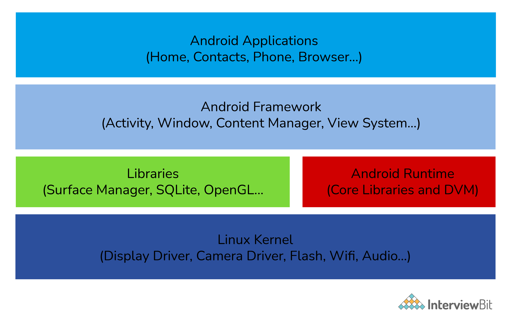
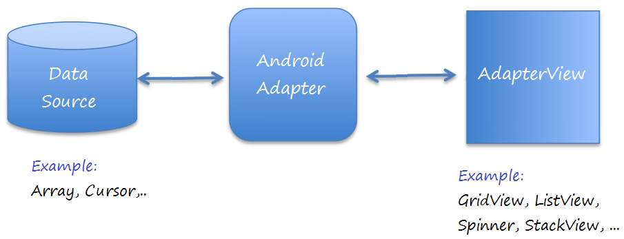
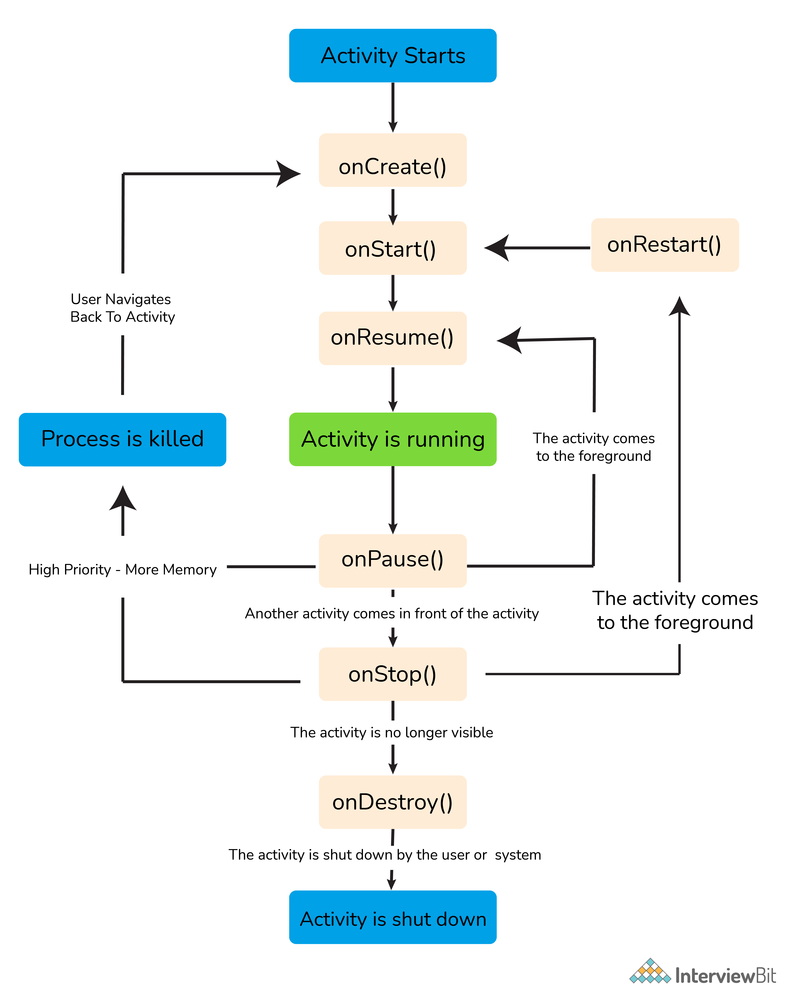
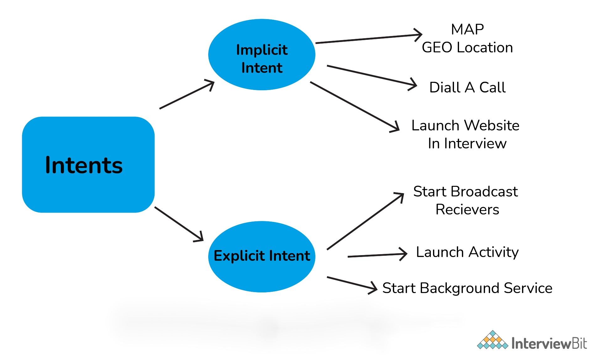
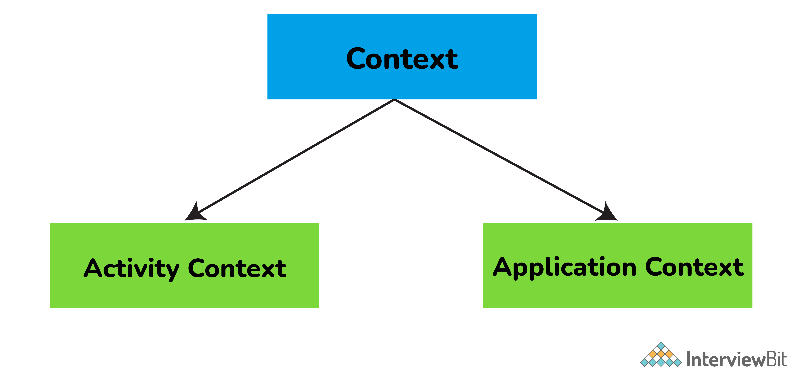

# Câu hỏi phỏng vấn Android


## Android là gì?

Android là một hệ điều hành dựa trên nền tảng Linux được thiết kế dành cho các thiết bị di động có màn hình cảm ứng như điện thoại thông minh và máy tính bảng. Ban đầu, Android được phát triển bởi Android Inc. với sự hỗ trợ tài chính từ Google và sau này được chính Google mua lại vào năm 2005.

Android có mã nguồn mở và Google phát hành mã nguồn theo Giấy phép Apache. Chính mã nguồn mở cùng với một giấy phép không có nhiều ràng buộc đã cho phép các nhà phát triển thiết bị, mạng di động và các lập trình viên nhiệt huyết được điều chỉnh và phân phối Android một cách tự do. Ngoài ra, Android còn có một cộng đồng lập trình viên đông đảo chuyên viết các ứng dụng để mở rộng chức năng của thiết bị, bằng ngôn ngữ lập trình Java. Tháng 10 năm 2012, có khoảng 700.000 ứng dụng trên Android, và số lượt tải ứng dụng từ Google Play, cửa hàng ứng dụng chính của Android, ước tính khoảng 25 tỷ lượt.

## Ưu điểm của Android

- Mã nguồn mở: việc phát triển và phân phối ứng dụng miễn phí.
- Nền tảng độc lập: nền tảng Android (Android Studio và Android SDK) là độc lập. Ứng dụng có thể phát triển trên bất kỳ hệ điều hành nào với Android Stduio và Android SDK.
- Hiệu suất máy ảo cao: Android sử dụng một máy ảo được tối ưu hóa cao, tức là DVM (Dalvik Virtual Machine) cho các thiết bị di động. Thay thế DVM, máy ảo ART (Android RunTime) được giới thiệu để thực thi các ứng dụng Android từ phiên bản Android lollipop 5.0 (API 21).
- Hỗ trợ nhiều công nghệ: hỗ trợ camera, giọng nói, bluetooth, wifi,...
- Hàng triệu ứng dụng khả dụng: Hàng triệu ứng dụng Android có sẵn mà bạn có thể cài đặt trên thiết bị từ cửa hàng Google Play cũng như từ các cửa hàng thay thế khác.

## Nhược điểm của Android
- Ứng dụng giả: Có hàng ngàn ứng dụng fake trên thị trường, để đánh cắp dữ liệu của bạn khi cài đặt.
- Tiến trình chạy nền:
    + Trong phiên bản Android cũ hơn, hầu hết các ứng dụng luôn chạy ở chế độ nền. Từ phiên bản Android 8.0, các ứng dụng chạy nền giờ đây bị giới hạn về mức độ tự do mà chúng có thể truy cập các dịch vụ nền.
    + Vì một số ứng dụng chạy nền, chúng tiêu thụ pin di động và pin thiết bị của bạn nhanh chóng.
- Kết nối dữ liệu kém: Android có một số lượng lớn các tiến trình chạy nền liên tục và điều này dẫn đến việc sử dụng quá nhiều dữ liệu và tốc độ internet kém. Đôi khi nó có thể rất khó chịu.
- Vấn đề tương thích: Có rất nhiều loại thiết bị Android có sẵn trên thị trường với kích thước và kích thước màn hình khác nhau, nhưng quan trọng hơn là hệ điều hành Android khác nhau. Một ứng dụng chạy trơn tru trên một phiên bản hệ điều hành Android có thể gặp sự cố trên một hệ điều hành Android khác.

## Mục lục

[1. Android là gì?](#1-android-l%C3%A0-g%C3%AC)

[2. Kiến trúc của Android?](#2-ki%E1%BA%BFn-tr%C3%BAc-c%E1%BB%A7a-android)

[3. Các ngôn ngữ sử dụng cho Android?](#3-c%C3%A1c-ng%C3%B4n-ng%E1%BB%AF-s%E1%BB%AD-d%E1%BB%A5ng-cho-android)

[4. Một activity là gì?](#4-m%E1%BB%99t-activity-l%C3%A0-g%C3%AC)

[5. Service trong Android là gì?](#5-service-trong-android-l%C3%A0-g%C3%AC)

[6. Phân biệt Activity và Service?](#6-ph%C3%A2n-bi%E1%BB%87t-activity-v%C3%A0-service)

[7. Google Android SDK là gì?](#7-google-android-sdk-l%C3%A0-g%C3%AC)

[8. Cách dùng bundle trong Android?](#8-c%C3%A1ch-d%C3%B9ng-bundle-trong-android)

[9. Adapter trong Android là gì?](#9-adapter-trong-android-l%C3%A0-g%C3%AC)

[10. AAPT là gì?](#10-aapt-l%C3%A0-g%C3%AC)

[11. Điểm phát sóng Wi-Fi di động là gì?](#11-%C4%91i%E1%BB%83m-ph%C3%A1t-s%C3%B3ng-wi-fi-di-%C4%91%E1%BB%99ng-l%C3%A0-g%C3%AC)

[12. ADB là gì?](#12-adb-l%C3%A0-g%C3%AC)

[13. DDMS là gì?](#13-ddms-l%C3%A0-g%C3%AC)

[14. AIDL là gì?](#14-aidl-l%C3%A0-g%C3%AC)

[15. Vòng đời của Android Activity?](#15-v%C3%B2ng-%C4%91%E1%BB%9Di-c%E1%BB%A7a-android-activity)

[16. Cảm biến trong Android?](#16-c%E1%BA%A3m-bi%E1%BA%BFn-trong-android)

[17. Các loại dialog trong Android?](#17-c%C3%A1c-lo%E1%BA%A1i-dialog-trong-android)

[18. File AndroidManifest.xml là gì?](#18-file-androidmanifestxml-l%C3%A0-g%C3%AC)

[19. Intent là gì?](#19-intent-l%C3%A0-g%C3%AC)

[20. Sự khác biệt giữa lớp, file và activity trong Android?](#20-s%E1%BB%B1-kh%C3%A1c-bi%E1%BB%87t-gi%E1%BB%AFa-l%E1%BB%9Bp-file-v%C3%A0-activity-trong-android)

[21. Toast là gì?](#21-toast-l%C3%A0-g%C3%AC)

[22. Context là gì?](#22-context-l%C3%A0-g%C3%AC)

[23. Sự khác biệt giữa Implicit và Explicit Intent?](#23-s%E1%BB%B1-kh%C3%A1c-bi%E1%BB%87t-gi%E1%BB%AFa-implicit-v%C3%A0-explicit-intent)

[24. ANR trong Android là gì?](#24-anr-trong-android-l%C3%A0-g%C3%AC)

[25. Các vấn đề kỹ thuật cần làm khi ứng dụng thường xuyên gặp sự cố?](#25-c%C3%A1c-v%E1%BA%A5n-%C4%91%E1%BB%81-k%E1%BB%B9-thu%E1%BA%ADt-c%E1%BA%A7n-l%C3%A0m-khi-%E1%BB%A9ng-d%E1%BB%A5ng-th%C6%B0%E1%BB%9Dng-xuy%C3%AAn-g%E1%BA%B7p-s%E1%BB%B1-c%E1%BB%91)

[26. Giải thích các chế độ khởi chạy khác nhau trong Android?](#26-gi%E1%BA%A3i-th%C3%ADch-c%C3%A1c-ch%E1%BA%BF-%C4%91%E1%BB%99-kh%E1%BB%9Fi-ch%E1%BA%A1y-kh%C3%A1c-nhau-trong-android)

[27. Container trong Android?](#27-container-trong-android)

[28. Vai trò của Dalvik trong phát triển Android?](#28-vai-tr%C3%B2-c%E1%BB%A7a-dalvik-trong-ph%C3%A1t-tri%E1%BB%83n-android)

[29. Broadcast receivers là gì?](#29-broadcast-receivers-l%C3%A0-g%C3%AC)

[30. Giải thích cấu trúc thư mục khi tạo ứng dụng Android?](#30-gi%E1%BA%A3i-th%C3%ADch-c%E1%BA%A5u-tr%C3%BAc-th%C6%B0-m%E1%BB%A5c-khi-t%E1%BA%A1o-%E1%BB%A9ng-d%E1%BB%A5ng-android)

[31. Sự khác biệt giữa Serializable và Parcelable?](#31-s%E1%BB%B1-kh%C3%A1c-bi%E1%BB%87t-gi%E1%BB%AFa-serializable-v%C3%A0-parcelable)

[32. Cơ sở dữ liệu nào được sử dụng trong Android?](#32-c%C6%A1-s%E1%BB%9F-d%E1%BB%AF-li%E1%BB%87u-n%C3%A0o-%C4%91%C6%B0%E1%BB%A3c-s%E1%BB%AD-d%E1%BB%A5ng-trong-android)

[33. Sự khác biệt giữa Service và Thread?](#33-s%E1%BB%B1-kh%C3%A1c-bi%E1%BB%87t-gi%E1%BB%AFa-service-v%C3%A0-thread)

[34. Content Provider là gì?](#34-content-provider-l%C3%A0-g%C3%AC)

[35. Ý nghĩa của file .dex?](#35-%C3%BD-ngh%C4%A9a-c%E1%BB%A7a-file-dex)

[36. Sự khác biệt giữa compileSdkVersion và targetSdkVersion?](#36-s%E1%BB%B1-kh%C3%A1c-bi%E1%BB%87t-gi%E1%BB%AFa-compilesdkversion-v%C3%A0-targetsdkversion)

[37. Các lớp Java liên quan đến cảm biến trong Android?](#37-c%C3%A1c-l%E1%BB%9Bp-java-li%C3%AAn-quan-%C4%91%E1%BA%BFn-c%E1%BA%A3m-bi%E1%BA%BFn-trong-android)

[38. JobScheduler là gì?](#38-jobscheduler-l%C3%A0-g%C3%AC)

## Câu hỏi phỏng vấn Android cho Fresher 

### 1. Android là gì?

Android là một hệ điều hành nguồn mở được sử dụng trên các thiết bị di động, như điện thoại di động và máy tính bảng. Ứng dụng Android thực thi trong tiến trình  của nó và của Dalvik Virtual Machine (DVM) hoặc Android RunTime (ART).

### 2. Kiến trúc của Android?

Kiến trúc của Android gồm các tầng khác nhau trong Android Stack. Nó bao gồm hệ điều hành, middleware và ứng dụng. Mỗi tầng trong kiến trúc Android cung cấp các dịch vụ khác nhau cho tầng ngay trên nó. 

5 tầng trong Android:

* **Linux Kernel** - Nó chịu trách nhiệm về trình điều khiển thiết bị, quản lý thiết bị, quản lý bộ nhớ, quản lý nguồn và truy cập tài nguyên.
* **Libraries** - là tập hợp các bộ thư viện mã nguồn mở như WebKit, thư viện libc, thư viện cho mở phát nhạc hay video, cơ sở dữ liệu SQLite cho chia sẻ dữ liệu và bộ nhớ ứng dụng, thư viện SSL cho bảo mật internet.
* **Android Runtime** - đây là thư viện lõi cùng với DVM (Dalvik Virtual Machine) hoặc ART(Android RunTime) giúp chạy ứng dụng Android. DVM được tối ưu hoá cho các thiết bị di đông, nó cung cấp hiệu suất nhanh và tiêu tốn ít bộ nhớ hơn. Thay thế DVM, ARM được giới thiệu để thực thi các ứng dụng Android từ phiên bản Android lollipop 5.0 (API 21). 
* **Android Framework** - nó bao gồm Android APIs như  UI (User Interface), nguồn tài nguyên, tài nguyên, nhà cung cấp nội dung (dữ liệu), vị trí, điện thoại và trình quản lý package. Nó cung cấp các giao diện và lớp để phát triển các ứng dụng Android. 
* **Android Applications** - Các ứng dụng như trang chủ, trò chơi, danh bạ, cài đặt, trình duyệt, v.v. sử dụng Android Framework, để sử dụng Android runtime và libraries.



### 3. Các ngôn ngữ sử dụng cho Android?

Các ngôn ngữ lập trình phổ biến dùng cho phát triển ứng dụng Android là:
1. **Java**: Được phát hành năm 1995 bởi Sun Microsystems, Java là ngôn ngữ then chốt của Android. Bộ công cụ phát triển phần mềm Android SDK (Software Development Kit) sử dụng Java như ngôn ngữ nền tảng cho các ứng dụng Android. Khá là dễ dàng để sử dụng Java, đặc biệt là trong Android Studio IDE dùng phát triển các ứng dụng dành cho Android.
2. **Koltin**: Kotlin được phát triển để giải quyết một vài vấn đề tồn tại trong Java. Theo đa số những người ủng hộ việc sử dụng Kotlin, thì syntax của nó đơn giản và gọn hơn, vì thế rất ít xảy ra việc dòng code rườm rà, dài dòng. Điều này có tác dụng giúp cho người viết tập trung trong việc giải quyết các vấn đề hơn là cố để xoay sở với những câu lệnh dài dòng phức tạp. Bên cạnh đó, bạn còn có thể kết hợp Kotlin và Java cùng nhau ở trong cùng một dự án, khai thác hết thế mạnh của cả 2 ngôn ngữ.
3. **C#:** C# là ngôn ngữ lập trình rất nổi tiếng của Microsoft. Với sự hỗ trợ của framework Xamarin, bạn có thể xây dựng ứng dụng Android bằng C#. Xamarin là một framework đa nền tảng, cho phép bạn phát phiển ứng dụng iOS, Android, Windows.
4. **C++:** C++ là ngôn ngữ lập trình mạnh trong việc xây dựng các ứng dụng di động dành riêng cho android và cho windows. đây là ngôn ngữ dành cho lập trình cấp thấp và cũng là ngôn ngữ được các nhà phát triển ứng dụng trên thiết bị di động.
5. **Python**: Python dù không được hệ điều hành Android hỗ trợ những vẫn được sử dụng trong việc tạo ra các apps trên python rồi chuyển thành apk để chạy trên thiết bị android.

Bên cạnh đó bạn cũng có thể dùng các framework như Flutter (ngôn ngữ Dart) hay React Native (ngôn ngữ JavaScript) để lập trình với Android.

### 4. Một activity là gì?

Activity trong Android là một màn hình đơn để biểu diễn GUI (Graphical User Interface) cho người dùng có thể tương tác và thực hiện một số hành động.

Ví dụ: trang bắt đầu của Facebook là nơi để nhập email/số điện thoại và mật khẩu để đăng nhập, nó là một activity.

### 5. Service trong Android là gì?

Service là một thành phần ứng dụng chạy ở chế độ nền có thể thực hiện các hoạt động lâu dài, nó không cung cấp một giao diện người dùng. Một service có thể chạy liên tục trong nền ngay cả khi ứng dụng bị đóng hay người dùng chuyển sang ứng dụng khác.

### 6. Phân biệt Activity và Service?

Activity có thể bị dừng hoặc kết thúc bất cứ khi nào bởi người dùng. Ngược lại, service được thiết kế để chạy ngầm, nên chúng có thể hoạt động độc lập.

Phần lớn các service chạy liên tục không quan tâm có hay không có activity nào đang thực hiện không.

| Activity | Service |
|-|-|
| Được thiết kế để chạy ở trền nền | Được thiết kế để chạy nền, nhưng cũng có thể chạy ở trên nền | 
| Cần sử dụng giao diện người dùng | Không nhất thiết phải dùng giao diện người dùng |
| Phụ thuộc | Độc lập |

### 7. Google Android SDK là gì?

Google Android SDK là một bộ công cụ được các nhà phát triển sử dụng để viết ứng dụng trên các thiết bị hỗ trợ Android. Các công cụ trong Android SDK bao gồm:

- Android Emulator - Trình giả lập Android là ứng dụng phần mềm mô phỏng thiết bị Android trên máy tính để bạn có thể kiểm tra ứng dụng trên nhiều loại thiết bị và các cấp Android API mà không cần từng thiết bị vật lý.
- DDMS (Dalvik Debug Monitoring Services) - Đây là một công cụ debug từ bộ phát triển phần mềm Android (SDK), cung cấp các dịch vụ như tạo thông báo, giả mạo cuộc gọi, chụp ảnh màn hình, v.v.
- ADB (Android Debug Bridge) - Đây là một công cụ dòng lệnh được sử dụng để cho phép và kiểm soát giao tiếp với phiên bản giả lập.
- AAPT (Android Asset Packaging Tool) - Đây là một công cụ xây dựng cung cấp cho các nhà phát triển khả năng xem, tạo và cập nhật các kho lưu trữ tương thích với ZIP (zip, jar và apk).

### 8. Cách dùng bundle trong Android?

Các bundle được sử dụng để chuyển dữ liệu cần thiết giữa các activity khác nhau của Android. Chúng giống như HashMap có thể nhận các kiểu dữ liệu thông thường. Đoạn code dưới đây hiển thị cách chuyển một phần dữ liệu bằng cách sử dụng bundle:

```java
Bundle b=new Bundle();
b.putString("Email","abc@xyz.com");
i.putExtras(b); // where i is intent
```

### 9. Adapter trong Android là gì?

Một adapter trong Android giống như một cây cầu giữa AdapterView và dữ liệu cơ bản cho view. Adapter giữ dữ liệu và gửi nó cho AdapterView, view có thể lấy dữ liệu từ AdapterView và hiển thị dữ liệu cho các view khác như SpinnerView, ListView, GridView,...



### 10. AAPT là gì?

AAPT là viết tắt của Android Asset Packaging Tool. Đây là một công cụ xây dựng cung cấp cho các nhà phát triển khả năng xem, tạo và cập nhật các kho lưu trữ tương thích với ZIP (zip, jar và apk). Nó phân tích cú pháp, lập chỉ mục và biên dịch các tài nguyên thành định dạng nhị phân được tối ưu hóa cho nền tảng Android.

### 11. Điểm phát sóng Wi-Fi di động là gì?

Điểm truy cập Wi-Fi di động cho phép bạn chia sẻ kết nối Internet di động của mình với các thiết bị không dây khác. Ví dụ: sử dụng điện thoại Android làm điểm phát sóng Wi-Fi, bạn có thể sử dụng máy tính xách tay của mình để kết nối internet bằng điểm truy cập đó.

### 12. ADB là gì?

ADB (Android Debug Bridge) là một công cụ dòng lệnh được sử dụng để cho phép và kiểm soát giao tiếp với một phiên bản giả lập. Nó cung cấp tính năng cho các nhà phát triển thực thi các lệnh shell từ xa để chạy các ứng dụng trên trình giả lập.

### 13. DDMS là gì?

DDMS (Dalvik Debug Monitor Server) là công cụ gỡ lỗi trên nền tảng Android. Nó cung cấp các tính năng như:
- Chụp ảnh màn hình
- Theo dõi lưu lượng mạng
- Cuộc gọi giả mạo SMS
- Giả mạo dữ liệu vị trí
- Logcat
- Thông tin thread và heap

### 14. AIDL là gì?

AIDL - Android Interface Definition Language là một cách cho phép bạn có thể định nghĩa một cách mà cả client và server (1 ứng dụng đóng vai trò là server cho các ứng dụng khác đóng vai trò là client có thể truy cập tới) có thể giao tiếng với nhau thông qua Interprocess communication (IPC). Thông thường, trong Android một process (tiến trình) không thể trực tiếp truy cập vào bộ nhớ của một tiến trình khác. Vì vậy để có thể các tiến trình có thể giao tiếp với nhau, chúng cần phân tách các đối tượng thành dạng nguyên thủy (primitive) mà hệ thống có thể hiểu được.

Các kiểu dữ liệu được hỗ trợ trong AIDL là:

- String
- List
- Map
- CharSequence
- Kiểu dữ liệu Java (int, long, char, and boolean)

### 15. Vòng đời của Android Activity?

- `onCreate()`: được gọi khi activity được tạo. Nó được dùng để tạo view và dữ liệu từ bundles.
- `onStart()`: được gọi khi activity được hiển thị với người dùng. Nó có thể thành công bằng `onResume()` nếu activity xuất hiện trên nền hoặc `onStop()` bị ẩn.
- `onResume()`: nó được gọi khi activity được chạy để tương tác với người dùng.
- `onPause()`: nó được gọi khi activity được chạy trong nền nhưng chưa dừng hoàn toàn.
- `onStop()`: được gọi khi activity không còn hiển thị với người dùng.
- `onDestroy()`: được gọi khi một activity bị huỷ hay kết thúc.
- `onRestart()`: được gọi khi một activity đã dừng, nhằm mục đích khởi động lại nó.



### 16. Cảm biến trong Android?

Các thiết bị sử dụng hệ điều hành Android có một bộ sưu tập các cảm biến tích hợp bên trong, chúng đo các thông số nhất định như chuyển động, định hướng và nhiều thông số khác thông qua độ chính xác cao của chúng. Các cảm biến có thể là cả phần cứng và phần mềm dựa trên tự nhiên. Có ba loại cảm biến nổi bật trong các thiết bị Android. Chúng là:
- Cảm biến vị trí: Nó được sử dụng để đo vị trí thực của thiết bị Android. Bao gồm cảm biến định hướng và từ kế.
- Cảm biến chuyển động: Các cảm biến này bao gồm trọng lực, hoạt động quay và cảm biến gia tốc đo chuyển động quay của thiết bị hoặc gia tốc, v.v.
- Cảm biến môi trường: Nó bao gồm các cảm biến đo nhiệt độ, độ ẩm, áp suất và các yếu tố môi trường khác.

### 17. Các loại dialog trong Android?

Android hỗ trợ 4 loại dialog:
- AlertDialog:
    - Hỗ trợ từ 0-3 button, cùng với danh sách các mục chọn như checkbox hay radio button.
    - Nó được sử dụng khi bạn muốn hỏi người dùng về việc đưa ra quyết định có hoặc không để phản hồi lại bất kỳ hành động cụ thể nào do người dùng thực hiện, bằng cách tiếp tục hoạt động tương tự và không thay đổi màn hình.
- DatePickerDialog:
    - Dùng cho chọn ngày tháng 
- TimePickerDialog:
    - Dùng chọn chọn thời gian
- ProgressDialog:
    - Là mở rộng của AlertDialog với thanh hiển thị quá trình. Nó còn hỗ trợ các button bổ sung.
    - Lớp này không được dùng nữa trong API level 26 vì nó ngăn người dùng tương tác với ứng dụng. Thay vào đó, chúng ta có thể sử dụng ProgressBar, có thể được nhúng vào giao diện người dùng trong ứng dụng của bạn.

### 18. File AndroidManifest.xml là gì?

File AndroidManifest.xml bao gồm thông tin về ứng dụng mà hệ điều hành Android phải biết trước khi thực thi code.

File này rất cần thiết trong mọi ứng dụng Android. Nó được khai báo trong thư mục root. File này thực hiện một số tác vụ như:
- Cung cấp tên duy nhất cho package java.
- Mô tả các thành phần khác nhau của ứng dụng như activity, service,...
- Xác định các lớp sẽ triển khai các thành phần này.

### 19. Intent là gì?

Intent là một đối tượng thông báo dùng cho yêu cầu một hành động từ một thành phần khác của ứng dụng. Nó có thể được dùng cho các hành động như gửi SMS, gửi email, hiển thị web page.

Nó hiển thị thông báo tin nhắn cho người dùng khi các thiết bị Android cho phép. Nó cảnh báo người dùng khi một trạng thái cụ thể xảy ra. Có hai loại intent trong Android.
- Implicit Intent - dùng cho gọi các thành phần hệ thống.
- Explicit Intent - dùng cho gọi các lớp activity.



### 20. Sự khác biệt giữa lớp, file và activity trong Android?

- Class là một hình thức biên dịch của file `.java` để Android sử dụng tạo ra các file `.apk`.
- File là một khối thông tin hoặc tài nguyên dùng cho lưu trữ thông tin.
- Activity là một màn hình đơn biểu diễn GUI để người dùng có thể giao tiếp theo để thực hiện điều gì đó như gọi điện, xem mail,...

### 21. Toast là gì?

Toast là một thông báo hiện trên màn hình. Nó được sử dụng để hiển thị thông báo về trạng thái của hoạt động do người dùng bắt đầu và chỉ bao gồm khoảng không gian cần thiết cho thông báo trong khi activity hiện tại của người dùng vẫn hiển thị và tương tác.

Toast tự động hiện và mờ dần, và nó không thể giao tiếp. Cú pháp:

```java
Toast.makeText(ProjectActivity.this, "Your message here", Toast.LENGTH_LONG).show();
```

### 22. Context là gì?

Context là một interface chứa thông tin toàn cục về môi trường ứng dụng. Đây là một lớp trừu tượng được triển khai bởi hệ thống Android. Nó cho phép truy cập đến các tài nguyên và các lớp ứng dụng cụ thể, cũng như gọi đến các tác vụ trên mức ứng dụng như khởi chạy các activity, gửi và nhận intents, v.v..



**Activity Context** là mọi màn hình đều có một activity. Nó gắn liền với vòng đời của activity. Được dùng cho context hiện tại. Phương thức gọi Activity Context là `getContext()`.

Một số trường hợp dùng Activity Context:
- Người dùng đang tạo một đối tượng có vòng đời được gắn với một activity.
- Bất cứ khi nào bên trong một activity cho UI liên quan đến các hoạt động như toast, dialog,...

**Application Context** gắn liền với vòng đời của ứng dụng. Về cơ bản, nó là một thực thể singleton và có thể được truy cập thông qua `getApplicationContext()`. Một số trường hợp sử dụng của Application Context là:
- Khi tạo một đối tượng singleton
- Dùng với các thư viện cần thiết trong một activity.

### 23. Sự khác biệt giữa Implicit và Explicit Intent?

**Explicit Intent:** là nơi bạn thông báo cho hệ thống về activity nào sẽ xử lý intent này. Ở đây thành phần đích được xác định trực tiếp trong intent. 

Ví dụ:

```java
Intent i = new Intent(this, Activitytwo.class); #ActivityTwo is the target component
i.putExtra("Value1","This is ActivityTwo"); 
i.putExtra("Value2","This Value two for ActivityTwo"); 
startactivity(i);
```

**Implicit Intent:** cho phép bạn khai báo hành động muốn thực hiện. Hệ thống Android sẽ kiểm tra thành phần nào được đăng ký để xử lý hành động cụ thể đó dựa trên dữ liệu intent. Ở đây thành phần mục tiêu không được xác định trong intent.

Ví dụ:

```java
Intent i = new Intent(ACTION_VIEW,Uri.parse("http://www.interview bit.com")); 
startActivity(i);
```

### 24. ANR trong Android là gì?

ANR (Application is Not Responding) là một dialog xuất hiện khi ứng dụng không phản hồi. Dialog này xuất hiện bất cứ khi nào luồng chính trong ứng dụng không phản hồi suốt một khoảng thời gian dài với các điều khiện sau:
- Không có phản hồi nào với sự kiện input sau 5s.
- Một broadcase receiver không hoàn thành thực thi trong 10s.

Các cách để tránh ANR:

- Một ứng dụng phải thực hiện cơ sở dữ liệu hoặc các hoạt động mạng trong các luồng riêng biệt để tránh ANR.
- Đối với các ứng dụng chuyên sâu về tác vụ nền, bạn có thể giảm bớt áp lực từ luồng UI bằng cách sử dụng `IntentService`.

### 25. Các vấn đề kỹ thuật cần làm khi ứng dụng thường xuyên gặp sự cố?

**Kiểm tra khả năng tương thích:**

Không thể kiểm tra một ứng dụng cho tất cả các loại thiết bị và hệ điều hành. Có thể có một ứng dụng không tương thích với hệ điều hành của bạn.

**Quản lý bộ nhớ:**

- Một số ứng dụng chạy hoàn hảo trên một thiết bị di động nhưng có thể gặp sự cố trên các thiết bị khác. Đây là lúc xem xét khả năng xử lý, quản lý bộ nhớ và tốc độ CPU.
- Vì dung lượng bộ nhớ trên thiết bị di động có hạn, bạn có thể giải phóng dung lượng bộ nhớ để ứng dụng hoạt động bình thường.
- Nếu một ứng dụng thường xuyên gặp sự cố, bạn có thể xóa dữ liệu của ứng dụng, điều này sẽ xóa bộ nhớ đệm của ứng dụng đó và cho phép một số dung lượng trống trên thiết bị của bạn và có thể tăng hiệu suất của ứng dụng.

### 26. Giải thích các chế độ khởi chạy khác nhau trong Android?

**Standard (dạng chuẩn)**

- Chế độ khởi chạy này tạo thực thể mới của một activity trong tác vụ mà nó bắt nguồn.
- Có thể tạo nhiều thực thể cho cùng một activity.
Ví dụ: giả sử ngăn xếp hiện tại của chúng ta là A -> B -> C. Bây giờ, nếu chúng ta khởi chạy lại activity B với chế độ khởi chạy "standard", thì ngăn xếp mới sẽ là A -> B -> C -> B

**SingleTop:**

- Chế độ này tương tự như Standard ngoại trừ việc nếu tồn tại thực thển trước của activity trên đầu ngăn xếp, thì thực thể mới sẽ không được tạo.
- Nhưng intent sẽ được gửi đến thực thể hiện có của activity.
Ví dụ: giả sử ngăn xếp hiện tại của chúng ta là A -> B -> C. Bây giờ, nếu chúng ta khởi chạy lại activity B với chế độ khởi chạy "singleTop", thì ngăn xếp mới sẽ là A -> B -> C -> B.
- Hãy xem xét một ví dụ khác, trong đó ngăn xếp hiện tại là A -> B -> C. Bây giờ, nếu chúng ta khởi chạy lại activity C với chế độ khởi chạy "singleTop", thì ngăn xếp sẽ vẫn như cũ, tức là A -> B -> C. Intent sẽ được chuyển đến phương thức `onNewIntent()`

**SingleTask:**

- Chế độ khởi chạy này sẽ tạo một tác vụ mới và đẩy một thực thể mới cho tác vụ gốc.
- Ví dụ: giả sử ngăn xếp hiện tại của chúng ta là A -> B -> C -> D. Bây giờ, nếu chúng ta khởi chạy lại activity B với chế độ khởi chạy "singleTask", thì ngăn xếp mới sẽ là A -> B. Đây, một lệnh gọi lại đã được nhận trên thực thể cũ và các activity C và D bị phá hủy.

**SingleInstance:**

- Chế độ  này tương tự như SingleTask. Nhưng hệ thống không hỗ trợ khởi chạy bất kỳ activity mới nào trong cùng một tác vụ.
- Trong tình huống mà activity mới được khởi chạy, nó sẽ được khởi chạy trong một tác riêng biệt.
- Ví dụ: Giả sử ngăn xếp hiện tại của chúng ta là A -> B -> C. Bây giờ, nếu chúng ta khởi chạy activity D với chế độ khởi chạy "singleInstance", thì sẽ có hai ngăn xếp:
    - A -> B -> C
    - D, 
- Nếu bạn gọi activity E, thì nó sẽ được thêm vào ngăn xếp đầu tiên.
    - A -> B -> C -> E
    - D
Một lần nữa nếu bạn gọi activity là D, thì nó sẽ gọi cùng activity từ ngăn xếp thứ 2 và chuyển intent cho `onNewIntent()`.

### 27. Container trong Android?

Các container chứa các đối tượng và widget với nhau, dựa trên những đối tượng cụ thể nào được yêu cầu và cách sắp xếp cụ thể nào là cần thiết. Container có thể chứa label, button, input hoặc thậm chí container con,... Ví dụ: nếu bạn muốn form có các trường ở bên trái và label ở bên phải, bạn sẽ cần một container. Nếu bạn muốn các button OK và Cancel nằm bên dưới phần còn lại của form, bên cạnh nhau và nằm ở phía bên phải của màn hình, bạn sẽ cần một container. Nếu bạn có nhiều widget, bạn sẽ cần một container có phần tử gốc để đặt các widget bên trong.

Android cung cấp một bộ tập hợp các lớp view đóng vai trò là container cho các view. Các lớp container này được gọi là layout, được định nghĩa dưới dạng file XML mà code của chúng ta không thể thay đổi trong quá trình thực thi. Các trình quản lý layout do Android SDK cung cấp là `LinearLayout`, `RelativeLayout`, `FrameLayout`, `AbsoluteLayout`, `GridLayout` và `TableLayout`.

### 28. Vai trò của Dalvik trong phát triển Android?

Dalvik hoạt động như một máy ảo và nó chịu trách nhiệm chạy mọi ứng dụng Android. Nhờ Dalvik, một thiết bị sẽ có khả năng thực thi nhiều phiên bản của máy ảo một cách hiệu quả thông qua việc quản lý bộ nhớ tốt hơn.

## Câu hỏi phỏng vấn Android cho Experienced

### 29. Broadcast receivers là gì?

Một broadcast receiver là một cơ chế được dùng để lắng nghe sự kiện ở level hệ thống như SMS, cuộc gọi,... bằng ứng dụng host. Nó được triển khai như một lớp con của lớp `BroadcastReceiver` và mỗi thông báo được broadcast như một đối tượng intent.

```java
public class MyReceiver extends BroadcastReceiver 
{
    public void onReceive(context,intent){}
}
```

### 30. Giải thích cấu trúc thư mục khi tạo ứng dụng Android?

**App:**

Nó mô tả các đặc điểm cơ bản của ứng dụng và xác định từng thành phần của nó.

**java:**

- Nó bao gồm các file mã nguồn `.java` hoặc `.kt` (dùng Kotlin) của dự án. Theo mặc định nó chứa file `MainActivity.java` hoặc `MainActivity.kt`.
- Bạn tạo tất cả activity với file mở rộng `.java` hoặc `.kt` và nó cũng bao gồm code của ứng dụng.

**res:**

- Nó dùng cho lưu trữ giá trị cho tài nguyên được sử dụng trong các dự án Android khác nhau bao gồm các tính năng về màu sắc, kiểu dáng, kích thước,...
- Bao gồm các file xml như styles.xml, strings.xml, colors.xml,...

**Scripts:**

Là file tự động tạo bao gồm compileSdkVersion, buildToolsVersion, minSdkVersion, targetSdkVersion, applicationId, versionCode, và versionName. Ví dụ, build.gradle là một file script trong thư mục root, xác định cấu hình xây dựng sẽ được triển khai cho tất cả module trong dự án của bạn.

### 31. Sự khác biệt giữa Serializable và Parcelable?

Trong phát triển ứng dụng, thông thường nó cần chuyển dữ liệu từ activity này sang activity khác. Dữ liệu này cần được thêm vào một đối tượng intent tương ứng. Một số hành động bổ sung được yêu cầu để làm cho dữ liệu phù hợp để chuyển. Để làm được điều đó, đối tượng phải có thể được serializable hoặc parcelable.

#### Serializable

- Serializable là một interface Java tiêu chuẩn. Trong cách tiếp cận này, bạn đánh đấu một lớp Serializable bằng cách triển khai interface và Java sẽ tự động tuần tự (serialize) nó.
- Sự đối chiếu được sử dụng trong quá trình này và nhiều đối tượng bổ sung được tạo ra. Điều này dẫn đến việc thu gom nhiều rác và hoạt động kém hiệu quả.

#### Parcelable

- Parcelable là một interface Android cụ thể. Với cách tiếp cận này bạn có thể triển khai, sự tuần tự hoá của bạn.
- Đối chiếu không được dùng trong quá trình này nên không tạo ra rác.
- Parcelable hiệu quả hơn nhiều so với Serializable vì nó giải quyết được một số vấn đề với lược đồ tuần tự hóa mặc định trong Java. Ngoài ra, nó nhanh hơn vì nó được tối ưu hóa để sử dụng trên Android và hiển thị kết quả tốt hơn.

### 32. Cơ sở dữ liệu nào được sử dụng trong Android?

SQLite là cơ sở dữ liệu quan hệ mã nguồn mở được sử dụng trong Android. SQLite engine là serverless và độc lập. Thay vì đi theo mối quan hệ client-server như các RDBSM khác, SQLite engine dễ dàng tích hợp với ứng dụng. Thư viện có thể được gọi động và nó có thể sử dụng các lệnh gọi hàm đơn giản để giảm độ trễ khi truy cập cơ sở dữ liệu.

### 33. Sự khác biệt giữa Service và Thread?

| Service | Thread |
|-|-|
| Service là một thành phần ứng dụng tạo điều kiện cho ứng dụng chạy nền theo trình tự thực hiện các thao tác lâu dài mà không có sự tương tác với người dùng | Một thread là một đơn vị thực thi đồng thời |
| Nó để lộ các chức năng đến ứng dụng khác bằng cách gọi Context.bindService() | Google mang lại các trình xử lý và vòng lặp vào thread |
| Khi ứng dụng bị huỷ, service không bị huỷ | Khi ứng dụng bị huỷ, thread bị huỷ |

### 34. Content Provider là gì?

Content provider là một block xây dựng chính của ứng dụng Android, quản lý quyền truy cập để tạo repository dữ liệu trung tâm. Nó hoạt động như một interface tiêu chuẩn kết nối dữ liệu trong một tiến trình với code chạy trong một tiến trình khác. Vì vậy, nó có thể được dùng để chia sẻ dữ liệu giữa các ứng dụng khác nhau.

Chúng có trách nhiệm đóng gói dữ liệu và cung cấP cơ chế cho bảo mật dữ liệu. Nó được triển khai như một lớp con của lớp ContentProvider và phải triển khai một tập APIs để khởi động ứng dụng khác cho thực hiện giao dịch.

```java
public class MyContentprovider extends ContentProvider 
{
    public void onCreate(){}
}
```

### 35. Ý nghĩa của file .dex?

Các chương trình Android được DVM biên dịch thành file `.dex` (Dalvik Executable file), sau đó được nén thành file `.apk` trên thiết bị. Các file `.dex` được tạo bằng cách dịch các ứng dụng đã biên dịch được viết bằng java. `.dex` là định dạng được tối ưu hóa để lưu trữ hiệu quả và thực thi có thể ánh xạ bộ nhớ.

### 36. Sự khác biệt giữa compileSdkVersion và targetSdkVersion?

#### compileSdkVersion

- `compileSdkVersion` là phiên bản API mà ứng dụng được biên dịch dựa trên đó. Điều này có nghĩa là bạn có thể sử dụng các tính năng API của Android có trong phiên bản API đó (hiển nhiên là tất cả các phiên bản trước đó). 
- Nếu bạn thử và sử dụng các tính năng của API 16 nhưng đặt `compileSdkVersion` thành 15, bạn sẽ gặp lỗi biên dịch. Nếu bạn đặt `compileSdkVersion` thành 16, bạn vẫn có thể chạy ứng dụng trên thiết bị API 15 miễn là các đường dẫn thực thi của ứng dụng không cố gắng gọi bất kỳ API cụ thể nào cho API 16.

#### targetSdkVersion

- `targetSdkVersion` không liên quan gì đến cách ứng dụng của bạn được biên dịch hoặc những API nào bạn có thể sử dụng. `targetSdkVersion` nhằm mục đích chỉ ra rằng bạn đã thử nghiệm ứng dụng của mình trên phiên bản API mà bạn chỉ định. Nó là một chứng nhận hoặc dấu hiệu mà bạn cung cấp cho hệ điều hành Android để gợi ý về cách nó sẽ xử lý ứng dụng của bạn về các tính năng của hệ điều hành.

- Ví dụ: đặt giá trị `targetSdkVersion` thành "11" trở lên cho phép hệ thống áp dụng theme mặc định mới (Holo) cho ứng dụng khi chạy trên Android 3.0 trở lên. Nó cũng vô hiệu hóa chế độ tương thích màn hình khi chạy trên màn hình lớn hơn (vì hỗ trợ API cấp 11 mặc nhiên hỗ trợ màn hình lớn hơn).

### 37. Các lớp Java liên quan đến cảm biến trong Android?

Cảm biến Android API cung cấp nhiều lớp và interface dùng cho cảm biến trên Android. Các lớp và interface quan trọng cho các API cảm biến như sau:
- **Lớp Sensor:** giúp bạn tạo một thực thể của cảm biến cụ thể. Nó cung cấp phương thức để xác định khả năng của cảm biến.
- **Lớp SensorManager:** lớp này được sử dụng để tạo một thực thể của dịch vụ cảm biến. Nó cung cấp các phương thức để truy cập và liệt kê các cảm biến, đăng ký và hủy đăng ký các trình nghe cảm biến, ...
- **Lớp SensorEvent:** lớp Java này dùng cho tạo đối tượng cảm biến sự kiện. Nó cung cấp thông tin về sự kiện cảm biến bao gồm dữ liệu cảm biến (dạng raw), độ chính xác của dữ liệu, loại cảm biến, thời gian của sự kiện, ...
- **Interface SensorEventListener:** interface được dùng để tạo hai phương thức callback để nhận thông báo sự kiện cảm biến khi giá trị hoặc độ chính xác cảm biến thay đổi. Hai phướng thức đó là:
    - `void onAccuracyChanged(Sensor sensor, int accuracy)` được gọi khi độ chính xác cảm biến thay đổi.
    -  `void onSensorChanged(SensorEvent event)` được gọi khi giá trị cảm biến thay đổi.

### 38. JobScheduler là gì?

JobScheduler API được dùng cho lên lịch các công việc khác nhau dựa trên framework được thực thi trong tiến trình riêng của ứng dụng. Nó cho phép ứng dụng của bạn thực hiện các tác vụ đã cho trong khi vẫn cân nhắc đến pin thiết bị và chi phí cho kiểm soát thời gian.

JobScheduler hỗ trợ lập lịch hàng loạt công việc. Hệ thống android có thể kết hợp các công việc để giảm mức tiêu thụ pin.

JobManager tự động xử lý tình trạng không đáng tin cậy của mạng để giúp việc xử lý tải lên dễ dàng hơn.

Các ví dụ về sử dụng JobScheduler:
- Tác vụ cần được thực hiện khi thiết bị được kết nối với nguồn điện.
- Tác vụ yêu cầu kết nối Wi-Fi hoặc truy cập mạng.
- Tác vụ chạy thường xuyên mà thời gian không quan trọng.

