# Câu hỏi phỏng vấn iOS

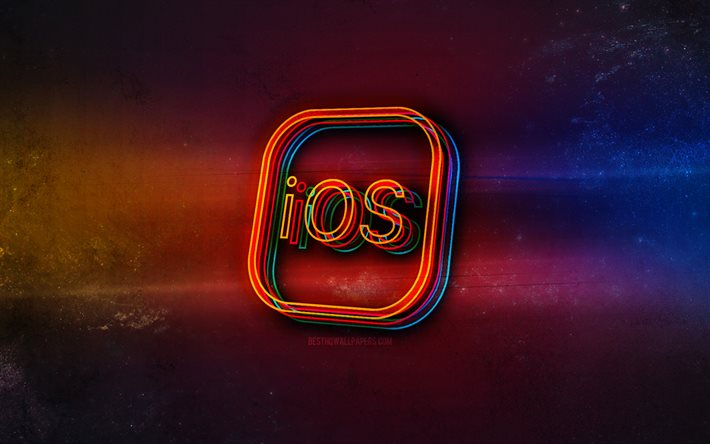

## iOS là gì?

iOS là viết tắt của "iPhone Operating System". Đây là hệ điều hành dành cho các thiết bị của Apple, và nó được coi là hệ điều hành di động phổ biến thứ hai trên toàn cầu sau Android. Hệ điều hành này hỗ trợ nhiều sản phẩm của Apple bao gồm iPhone, iPad và iPod. iOS được nhiều người khen ngợi vì giao diện trực quan và thân thiện với người dùng.

**Tính năng của iOS**

- iPhone cung cấp khả năng đa nhiệm. Trên thiết bị iOS, bạn có thể dễ dàng chuyển đổi giữa các ứng dụng bằng tính năng đa nhiệm hoặc cử chỉ nhiều ngón tay.
- iOS giúp bạn dễ dàng tích hợp các tương tác mạng xã hội với ứng dụng của mình bằng cách hiển thị luồng hoạt động và chia sẻ nội dung.
- Dịch vụ iCloud của Apple cho phép người dùng lưu trữ dữ liệu trên Internet. Nó cung cấp mức độ mã hóa cao và tùy chọn sao lưu để đảm bảo người dùng không bị mất dữ liệu.
- Cửa hàng ứng dụng của Apple có sẵn trên tất cả các nền tảng, cung cấp cho người dùng các dịch vụ và tài liệu bổ sung bao gồm các mặt hàng kỹ thuật số (iOS, iPad, macOS), đăng ký và nội dung cao cấp.
- Bạn có thể xem tất cả các cảnh báo ứng dụng của mình trong Trung tâm thông báo trong iOS. Tuy nhiên, cài đặt thông báo có thể được sửa đổi.
- iOS là một hệ thống đóng. Mã nguồn của các ứng dụng của Apple không có sẵn cho các nhà phát triển và chủ sở hữu iPhone và iPad không thể sửa đổi code trên thiết bị của họ. Điều này làm cho các thiết bị chạy iOS khó bị hack hơn.

## Mục lục

[1. Giải thích kiến trúc iOS?](#1-gi%E1%BA%A3i-th%C3%ADch-ki%E1%BA%BFn-tr%C3%BAc-ios)

[2. Thuộc tính trong iOS?](#2-thu%E1%BB%99c-t%C3%ADnh-trong-ios)

[3. Bạn có thể giải thích sự khác biệt giữa các thuộc tính atomic và nonatomic không?](#3-b%E1%BA%A1n-c%C3%B3-th%E1%BB%83-gi%E1%BA%A3i-th%C3%ADch-s%E1%BB%B1-kh%C3%A1c-bi%E1%BB%87t-gi%E1%BB%AFa-c%C3%A1c-thu%E1%BB%99c-t%C3%ADnh-atomic-v%C3%A0-nonatomic-kh%C3%B4ng)

[4. Các trạng thái khác nhau của ứng dụng iOS?](#4-c%C3%A1c-tr%E1%BA%A1ng-th%C3%A1i-kh%C3%A1c-nhau-c%E1%BB%A7a-%E1%BB%A9ng-d%E1%BB%A5ng-ios)

[5. Trách nhiệm của nhà phát triển iOS?](#5-tr%C3%A1ch-nhi%E1%BB%87m-c%E1%BB%A7a-nh%C3%A0-ph%C3%A1t-tri%E1%BB%83n-ios)

[6. Sự khác biệt giữa Android và iOS?](#6-s%E1%BB%B1-kh%C3%A1c-bi%E1%BB%87t-gi%E1%BB%AFa-android-v%C3%A0-ios)

[7. Deep linking trong iOS là gì?](#7-deep-linking-trong-ios-l%C3%A0-g%C3%AC)

[8. Giải thích GCD trong iOS?](#8-gi%E1%BA%A3i-th%C3%ADch-gcd-trong-ios)

[9. ARC là gì?](#9-arc-l%C3%A0-g%C3%AC)

[10. Sự khác biệt giữa Cocoa và Cocoa Touch?](#10-s%E1%BB%B1-kh%C3%A1c-bi%E1%BB%87t-gi%E1%BB%AFa-cocoa-v%C3%A0-cocoa-touch)

[11. Các ngôn ngữ lập trình dùng cho phát triển iOS?](#11-c%C3%A1c-ng%C3%B4n-ng%E1%BB%AF-l%E1%BA%ADp-tr%C3%ACnh-d%C3%B9ng-cho-ph%C3%A1t-tri%E1%BB%83n-ios)

[12. Framework được sử dụng để xây dựng giao diện ứng dụng cho iOS là gì?](#12-framework-%C4%91%C6%B0%E1%BB%A3c-s%E1%BB%AD-d%E1%BB%A5ng-%C4%91%E1%BB%83-x%C3%A2y-d%E1%BB%B1ng-giao-di%E1%BB%87n-%E1%BB%A9ng-d%E1%BB%A5ng-cho-ios-l%C3%A0-g%C3%AC)

[13. Các cách để thực hiện đồng thời trong iOS?](#13-c%C3%A1c-c%C3%A1ch-%C4%91%E1%BB%83-th%E1%BB%B1c-hi%E1%BB%87n-%C4%91%E1%BB%93ng-th%E1%BB%9Di-trong-ios)

[14. Sự khác biệt giữa App ID và Bundle ID?](#14-s%E1%BB%B1-kh%C3%A1c-bi%E1%BB%87t-gi%E1%BB%AFa-app-id-v%C3%A0-bundle-id)

[15. Framework SpriteKit và SceneKit trong phát triển game?](#15-framework-spritekit-v%C3%A0-scenekit-trong-ph%C3%A1t-tri%E1%BB%83n-game)

[16. Sự khác biệt giữa từ khoá assign và retain?](#16-s%E1%BB%B1-kh%C3%A1c-bi%E1%BB%87t-gi%E1%BB%AFa-t%E1%BB%AB-kho%C3%A1-assign-v%C3%A0-retain)

[17. Objective-C trong iOS?](#17-objective-c-trong-ios)

[18. Các kiểu dữ liệu phổ biến trong Objective-C?](#18-c%C3%A1c-ki%E1%BB%83u-d%E1%BB%AF-li%E1%BB%87u-ph%E1%BB%95-bi%E1%BA%BFn-trong-objective-c)

[19. Swift trong iOS?](#19-swift-trong-ios)

[20. Các tính năng nổi bật của Swift?](#20-c%C3%A1c-t%C3%ADnh-n%C4%83ng-n%E1%BB%95i-b%E1%BA%ADt-c%E1%BB%A7a-swift)

[21. NSError trong Swift?](#21-nserror-trong-swift)

[22. Enum trong Swift?](#22-enum-trong-swift)

[23. Thuộc tính lazy trong iOS?](#23-thu%E1%BB%99c-t%C3%ADnh-lazy-trong-ios)

[24. Generic trong Swift?](#24-generic-trong-swift)

[25. Dictionary trong Swift?](#25-dictionary-trong-swift)

[26. Các design pattern được dùng trong iOS?](#26-c%C3%A1c-design-pattern-%C4%91%C6%B0%E1%BB%A3c-d%C3%B9ng-trong-ios)

[27. Framework JSON nào được hỗ trợ trong iOS?](#27-framework-json-n%C3%A0o-%C4%91%C6%B0%E1%BB%A3c-h%E1%BB%97-tr%E1%BB%A3-trong-ios)

[28. iBeacons trong iOS?](#28-ibeacons-trong-ios)

[29. Sự khác biệt giữa KVC và KVO trong Swift?](#29-s%E1%BB%B1-kh%C3%A1c-bi%E1%BB%87t-gi%E1%BB%AFa-kvc-v%C3%A0-kvo-trong-swift)

[30. TDD là gì?](#30-tdd-l%C3%A0-g%C3%AC)

[31. Giải thích các hàm completion handler?](#31-gi%E1%BA%A3i-th%C3%ADch-c%C3%A1c-h%C3%A0m-completion-handler)

[32. Sự khác biệt giữa strong, weak, readonly và copy?](#32-s%E1%BB%B1-kh%C3%A1c-bi%E1%BB%87t-gi%E1%BB%AFa-strong-weak-readonly-v%C3%A0-copy)

[33. Dynamic dispatch là gì?](#33-dynamic-dispatch-l%C3%A0-g%C3%AC)

[34. Giải thích lệnh @dynamic và @synthesize trong Objective-C?](#34-gi%E1%BA%A3i-th%C3%ADch-l%E1%BB%87nh-dynamic-v%C3%A0-synthesize-trong-objective-c)

[35. Cách triển khai storage và persistence trong iOS?](#35-c%C3%A1ch-tri%E1%BB%83n-khai-storage-v%C3%A0-persistence-trong-ios)

[36. Tác vụ đồng bộ và bất đồng bộ trong iOS?](#36-t%C3%A1c-v%E1%BB%A5-%C4%91%E1%BB%93ng-b%E1%BB%99-v%C3%A0-b%E1%BA%A5t-%C4%91%E1%BB%93ng-b%E1%BB%99-trong-ios)

## Câu hỏi phỏng vấn iOS cho Fresher

### 1. Giải thích kiến trúc iOS?

iOS hoạt động theo cấu trúc lớp. Kiến trúc iOS bao gồm bốn lớp, mỗi lớp cung cấp một framework lập trình để tạo các ứng dụng hoạt động trên phần cứng. Giao tiếp sẽ được tăng cường bởi các lớp giữa lớp ứng dụng và lớp phần cứng. Lớp cấp thấp hơn cung cấp các dịch vụ mà tất cả các ứng dụng yêu cầu, trong khi lớp cấp cao cung cấp các dịch vụ liên quan đến đồ họa và giao diện.

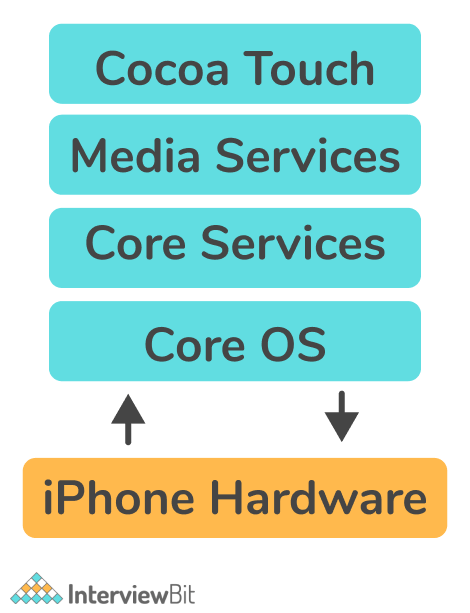

- **Lớp core OS:** nằm ngay trên đầu phần cứng thiết bị và là lớp dưới cùng của kiến trúc hệ điều hành iPhone. Ngoài các dịch vụ hệ điều hành cơ bản, chẳng hạn như quản lý bộ nhớ, xử lý hệ thống file và luồng, lớp này còn cung cấp mạng cấp thấp, quyền truy cập vào các phụ kiện bên ngoài,...
- **Lớp dịch vụ:** Mục đích của nó là thiết kế các dịch vụ mà lớp trên hoặc người dùng yêu cầu. Các tính năng thiết yếu của nó là các đối tượng khối, Grand Central Dispatch, mua hàng trong ứng dụng và lưu trữ iCloud. Lớp dịch vụ đã được củng cố bằng cách bổ sung tính năng ARC Automatic Reference Counting.
- **Lớp Media:** xử lý media như video, âm thanh, hình ảnh,... Lớp media cho phép ta sử dụng tất cả công nghệ đồ hoạ, âm thanh, hình ảnh của hệ thống.
- **Lớp Cocoa Touch:** còn biết đến là lớp ứng dụng. Đây là nơi mà các framework được tạo ra khi các ứng dụng được xây dựng. Ngoài ra, nó có chức năng như giao diện để người dùng iOS làm việc với hệ điều hành. Điều này bao gồm khả năng cảm ứng và chuyển động.

### 2. Thuộc tính trong iOS?

Thuộc tính cơ bản là các giá trị được liên kết với một class, struct hay enum. Nó có thể là một biến con, một phần của đối tượng khác.

Ví dụ:

```swift
struct Icecream  
{ 
    var flavor: String = ""
} 
var choco = Icecream() 
choco.flavor = "Chocolate Icecream"
```

Trong đoạn code trên, ta tạo một cấu trúc gọi là `Icecream`. Một trong những thuộc tính của nó được gọi là `flavor`, có giá trị ban đầu là một chuỗi trống.

#### Phân loại thuộc tính

- **Thuộc tính lưu trữ**: kiểu thuộc tính này dành cho lưu trữ một giá trị hằng hoặc biến và thường được cung cấp bởi class hay structure.

Ví dụ:

```swift
class Programmer {
    var progName: String
    let progLanguage: String
    var totalExperience = 0
    var secondLanguage: String?
}
```

Ở trên, lớp `Programmer` khai báo bốn thuộc tính: `progName`, `progLanguage`, `totalExperience`, và `secondLanguage`. Chúng là thuộc tính lưu trữ có thể bao gồm giá trị và là một phần của thực thể lớp. Đoạn code trên hiển thị thuộc tính mà không có giá trị mặc định.

- **Thuộc tính tính toán**: các thuộc tính này dùng cho tính toán thay vì lưu trữ thường được cung cấp bởi class, enum hay struct.

Ví dụ:

```swift
struct Angle {
    var degrees: Double = 0

    var rads: Double {
        get {
            return degrees * .pi / 180
        }
        set(newRads) {
            degrees = newRads * 180 / .pi
        }
    }
}
```

Ở trên, cấu trúc `Angle` có thuộc tính lưu trữ `degrees` để lưu trữ độ của góc. Hơn thế nữa, `Angle` còn thế có chuyển thành radian, thế nên `Angle` bao gồm thuộc tính `rads` để tính toán thuộc tính.

### 3. Bạn có thể giải thích sự khác biệt giữa các thuộc tính atomic và nonatomic không?

**Thuộc tính atomic:** Nó là thuộc tính mặc định và đảm bảo một giá trị hợp lệ sẽ được trả về từ getter hoặc được thiết lập bởi setter. Điều này đảm bảo rằng chỉ một luồng có thể truy cập getter/setter của một thuộc tính nhất định tại một thời điểm và tất cả các luồng khác phải đợi cho đến khi luồng đầu tiên giải phóng getter/setter. Mặc dù luồng an toàn, nhưng nó không nhanh, vì nó đảm bảo rằng quá trình được hoàn thành hoàn toàn.

**Thuộc tính nonatomic:** Với thuộc tính này, nhiều luồng có thể truy cập vào phương thức getter/setter của một thuộc tính nhất định cùng một lúc, do đó có khả năng tồn tại sự không nhất quán giữa các giá trị. Chúng đi kèm với quyền truy cập nâng cao, nhưng không đảm bảo về giá trị trả về.

### 4. Các trạng thái khác nhau của ứng dụng iOS?

Trong quá trình thực thi, ứng dụng iOS trải qua một loạt trạng thái. Mỗi trạng thái này được coi là trạng thái vòng đời của ứng dụng. Dưới đây là năm trạng thái có thể xảy ra đối với ứng dụng iOS:

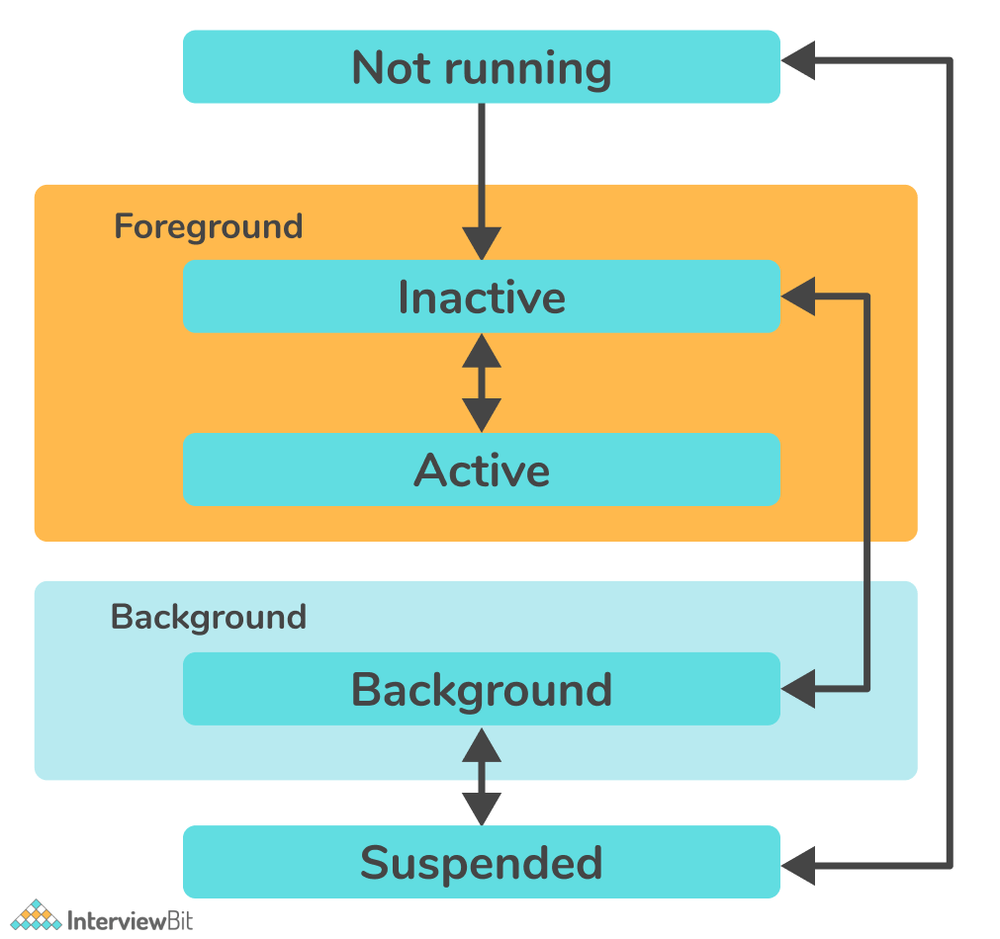

- **Not running:** ở trạng thái này, ứng dụng đã không được khởi chạy hoặc đã bị đóng bởi hệ thống.
- **Inactive:** một trạng thái không hoạt động ngắn xảy ra khi ứng dụng đang rời khỏi hoặc đang ở trạng thái hoạt động. Mặc dù chạy ở chế độ đã hiển thị, nó vẫn chưa sẵn sàng để chấp nhận đầu vào hoặc sự kiện từ người dùng. Điều này có nghĩa là ứng dụng vẫn không hoạt động tại thời điểm này.
- **Active:** trạng thái này cho biết rằng ứng dụng đang được hiển thị và nhận các sự kiện. Đây là chế độ bình thường cho các ứng dụng và Giao diện người dùng có thể truy cập được.
- **Background:** trong trạng thái này, giao diện người dùng của ứng dụng bị ẩn, nhưng nó vẫn tiếp tục chạy trong nền của hệ thống iOS. Các ứng dụng thường vượt qua trạng thái này trước khi bị đình chỉ.
- **Suspended:** Trong trường hợp này, ứng dụng đang ở chế độ nền nhưng không chạy code. Trong điều kiện bộ nhớ thấp, hệ thống có thể xóa các ứng dụng ở trạng thái bị treo mà không cần cảnh báo.

### 5. Trách nhiệm của nhà phát triển iOS?

Nhà phát triển iOS là một lập trình viên hoặc kỹ sư phần mềm, người thiết kế và phát triển các ứng dụng chạy iOS của Apple trên thiết bị iOS. Tốt nhất, nhà phát triển iOS phải có kỹ năng trong hai ngôn ngữ lập trình, là Objective-C và Swift.

Trách nhiệm của nhà phát triển iOS:

- Code sạch sẽ, hiệu quả cho các ứng dụng iOS.
- Đảm bảo code an toàn bằng cách thực hiện khắc phục sự cố và sửa lỗi cho các ứng dụng.
- Việc phát triển và triển khai các tính năng ứng dụng nâng cao cũng như duy trì và cải tiến các tính năng hiện có.
- Phát triển các giải pháp sáng tạo để đáp ứng nhu cầu kinh doanh của khách hàng.
- Hỗ trợ tất cả các khía cạnh của phát triển ứng dụng, bao gồm thiết kế, thử nghiệm, phát hành và hỗ trợ.
- Khám phá, đánh giá và triển khai các công nghệ mới liên tục để tối đa hóa hiệu quả phát triển.

### 6. Sự khác biệt giữa Android và iOS?

**Android**: Đây là hệ điều hành di động dành cho các thiết bị Android do Google LLC cung cấp và tập trung vào các thiết bị di động có màn hình cảm ứng như điện thoại thông minh và máy tính bảng. Một số ngôn ngữ lập trình đã được sử dụng trong quá trình phát triển của nó, bao gồm C, Java, C++ và các ngôn ngữ khác.

**iOS**: Đây là hệ điều hành dành cho các thiết bị của Apple do Apple cung cấp và nó được coi là hệ điều hành di động phổ biến thứ hai trên toàn cầu sau Android. Nó chủ yếu được thiết kế cho các thiết bị di động của Apple như iPhone, iPod Touch, v.v. Một số ngôn ngữ lập trình đã được sử dụng trong quá trình phát triển của nó, bao gồm Objective-C, Swift, C++ và các ngôn ngữ khác.

| Android | iOS |
|-|-|
| Hệ điều hành di động cho thiết bị Android được cung cấp bởi Google LLC | Hệ điều hành cho thiết bị Apple được cung cấp bởi tập đoàn Apple |
| Dành cho smartphone và máy tính bảng | Dành cho iPhone, iPod và iPad |
| Chủ yếu dùng Java, C, C++ | Chủ yếu dùng Swift, Objective-C, C/C++ |
| Google Chrome là trình duyệt mặc định | Safari là trình duyệt mặc định |
| Hiệu suất giảm theo thời gian | Hiệu suất bảo toàn theo thời gian |
| Mã nguồn mở, có thể chỉnh sửa tuỳ ý thay đổi hệ điều hành. Dẫn đến bảo mật kém | Mã nguồn đóng, các nhà phát triển không thể chỉnh sửa code trên thiết bị, giúp iOS bảo mật và khó hack hơn |

### 7. Deep linking trong iOS là gì?

Deep linking là các liên kết đưa người dùng trực tiếp đến một ứng dụng thay vì trang web hoặc cửa hàng bằng cách sử dụng URI (Uniform Resource Identifier) hoặc các universal links. URI là một phương pháp phổ biến để có deep linking, nhưng từ iOS 9, Apple đã thêm Universal Link thay cho URI. 

Deep linking không chỉ liên quan đến việc tạo liên kết có thể click để mở ứng dụng của bạn mà còn là liên kết thông minh điều hướng đến tài nguyên mà bạn mong muốn. Người dùng được dẫn thẳng đến các vị trí trong ứng dụng bằng cách sử dụng các liên kết này, điều này giúp họ tiết kiệm thời gian và nỗ lực tự tìm kiếm các trang đó, do đó cải thiện trải nghiệm người dùng của họ rất nhiều.

Ví dụ: Nếu bạn dùng URL: `fb://`, bạn sẽ mở ứng dụng Facebook. Nhưng nếu dùng `fb://profile/33138223345` bạn sẽ mở thông tin người dùng trên ứng dụng Facebook.

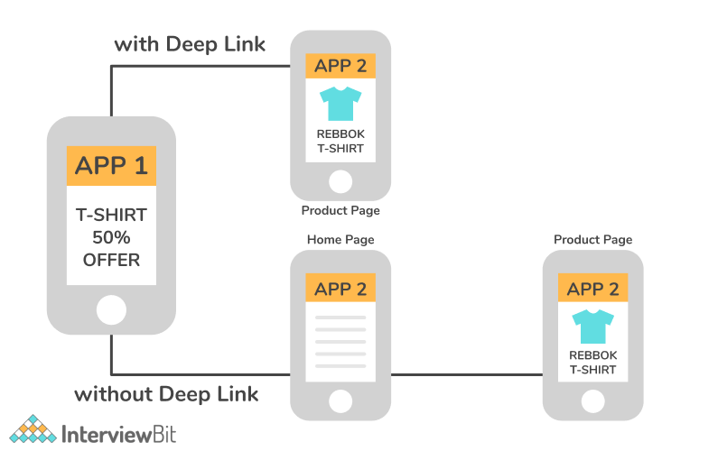

### 8. Giải thích GCD trong iOS?

Grand Central Dispatch (GCD) là một API cấp thấp cho phép người dùng chạy đồng thời nhiều tác vụ được luồng quản lý trong nền. GCD là một giải pháp của Apple để thực hiện tính đồng thời (concurrency) và song song (parallelism) trong ứng dụng iOS, thế nên nhiều tác vụ có thể chạy trong nền mà không ảnh hưởng gì đến luồng chính. Nó được giới thiệu trong iOS4 để tránh tiến trình dài dòng của việc thực hiện nối tiếp các tác vụ.

### 9. ARC là gì?

Trong ngôn ngữ Swift, ARC (Automatic Reference Counting) được dùng cho quản lý bộ nhớ ứng dụng. Nó khởi tạo và xác định tài nguyên hệ thống, do đó giải phóng bộ nhớ dành cho một thực thể lớp khi nó không còn cần đến nữa. ARC theo dõi có bao nhiêu thuộc tính, hằng số và biến hiện đang tham chiếu đến mỗi thực thể lớp. Khi có ít nhất một tham chiếu hoạt động tới một thực thể, ARC sẽ giải phóng thực thể đó. Việc sử dụng các khái niệm ARC là một phần thiết yếu của quá trình phát triển iOS.

Chức năng ARC:
- ARC tạo một thực thể lớp mới bằng `init()` và cấp phát một phần của bộ nhớ cho lưu trữ thông tin.
- Bộ nhớ lưu trữ thông tin về kiểu và giá trị của nó.
- Khi thực thể lớp không còn cần nữa, ARC sẽ tự động giải phóng bộ nhớ bằng lệnh gọi `deinit()`.
- Bằng cách theo dõi tham chiếu đến thuộc tính, hằng, biến của lớp, ARC đảm bảo `deinit()` chỉ thực hiện trên các thực thể khôgn còn dùng nữa.

### 10. Sự khác biệt giữa Cocoa và Cocoa Touch?

Cocoa và Cocoa Touch là hai trong số các framework được sử dụng rộng rãi của Apple được sử dụng để xây dựng các ứng dụng. Tuy nhiên, chúng khác nhau theo những cách sau:

| Cocoa | Cocoa Touch |
|-|-|
| Framework cho xây dựng ứng dụng chạy trên Mac OS | Framework cho xây dựng ựng dụng chạy trên iPhone hay iPad |
| Framework như Foundation và AppKit được kết hợp vào Cocoa | Cocoa Touch là sự kết hợp của các framework như Foundation và UIKit được tích hợp vào Cocoa Touch |
| Các lớp Cocoa sử dụng tiền tố NS (được sử dụng cho tất cả các lớp và hằng số trong framework Cocoa), như NSTextField, NSWindow | Mặt khác, các lớp Cocoa Touch sử dụng tiền tố UI (được sử dụng cho tất cả các lớp và hằng số trong framework Cacoa Touch) (như UITextField và UIWindow) |

### 11. Các ngôn ngữ lập trình dùng cho phát triển iOS?

- HTML5
- .NET
- C
- C++
- Swift
- Javascript
- Objective-C

### 12. Framework được sử dụng để xây dựng giao diện ứng dụng cho iOS là gì?

Trái ngược với framework Foundation định nghĩa các lớp, giao thức và hàm để phát triển cả iOS và OS X. UIKit được thiết kế đặc biệt để phát triển giao diện iOS. Trong iOS, giao diện người dùng và cơ sở hạ tầng đồ họa của ứng dụng được phát triển bằng UIKit. Nó bao gồm:
- Xử lý sự kiện (xử lý các cử chỉ khác nhau như cử chỉ nhập liệu, cử chỉ nhấn nút, cử chỉ đa chạm, ...)
- Cấu trúc ứng dụng (Quản lý sự tương tác giữa hệ thống và người dùng)
- Giao diện người dùng (Cung cấp các tương tác của người dùng, khả năng chia sẻ văn bản và nội dung, chọn hình ảnh, chỉnh sửa video, in tệp,...)
- Đồ họa, vẽ và in ấn.

### 13. Các cách để thực hiện đồng thời trong iOS?

Concurrency có nghĩa là "chạy nhiều tác vụ đồng thời". Concurrency cho phép thiết bị iOS xử lý các tác vụ nền (chẳng hạn như tải xuống hoặc xử lý dữ liệu) trong khi vẫn duy trì giao diện người dùng. Trong iOS, bạn có thể quản lý các tác vụ đồng thời bằng cách sử dụng Grand Central Dispatch (GCD) và Operations (chính thức được gọi là NSOperation). Để thực hiện được sự đồng thời, iOS cung cấp ba cách như sau:
* **Dispatch queues:** Chúng được sử dụng để quản lý các tác vụ theo thứ tự vào trước ra trước (FIFO) và thực thi các tác vụ một cách tuần tự hoặc đồng thời. Đây là một cách dễ dàng để xử lý các tác vụ bất đồng bộ (không xảy ra cùng lúc) và đồng thời trong ứng dụng của bạn.
* **Thread:** Một chuỗi instructions độc lập có thể được thực thi riêng biệt với code khác trong một chương trình. Thông qua các luồng, người ta có thể thực thi nhiều đường dẫn code đồng thời trong một ứng dụng duy nhất. Có một luồng đặc biệt hữu ích khi bạn cần thực hiện một tác vụ dài mà không ảnh hưởng đến việc thực hiện phần còn lại của chương trình.
* **Operation Queues**: Các đối tượng operation queue được gọi theo mức độ ưu tiên và mức độ sẵn sàng của chúng. Về cơ bản, Operation queue là sự trừu tượng hóa cấp cao của mô hình hàng đợi, được xây dựng trên GCD (Grand Central Dispatch). Do đó, có thể thực thi các tác vụ đồng thời, giống như GCD, nhưng theo cách hướng đối tượng.

### 14. Sự khác biệt giữa App ID và Bundle ID?

- **Bundle ID**: Chúng là định danh duy nhất của các ứng dụng trong hệ sinh thái của Apple. Nói cách khác, không có hai ứng dụng nào có thể có cùng định danh. Bundle ID được sử dụng cho cả ứng dụng OS X và iOS, và có thể được sử dụng để nhận dạng các bản cập nhật ứng dụng.
    Ví dụ:
    Nếu tên miền của tổ chức của ta là scaler.com và ta tạo một ứng dụng có tên là Edge, bạn có thể chỉ định chuỗi `com.scaler.edge` làm Bundle ID của ứng dụng.
- **App ID**: Chuỗi này xác định duy nhất một hoặc nhiều ứng dụng từ cùng một nhóm phát triển. Có hai thành phần trong chuỗi, Team ID và Bundle ID, được phân tách bằng dấu chấm (.). Apple cung cấp Team ID để xác định một nhóm phát triển cụ thể, trong khi các nhà phát triển cung cấp Bundle ID để xác định một ứng dụng hoặc một bộ sưu tập ứng dụng.
    Ví dụ:
    **ABCDE12345.com.scaler.edge**
    Trong ví dụ trên, `ABCDE12345` là Team ID và `com.scaler.edge` là Bundle ID .

### 15. Framework SpriteKit và SceneKit trong phát triển game?

**SpriteKit**: Framework này được thiết kế để giúp các nhà phát triển trò chơi dễ dàng và nhanh chóng hơn trong việc tạo các nội dung/đối tượng hoạt hình 2D trong các trò chơi thông thường. Với nó, bạn có thể vẽ các hình dạng, hạt, văn bản, hình ảnh và video theo hai chiều.

**SceneKit**: Đây là một framework iOS kế thừa từ OS X, giúp tạo đồ họa 3D. Với SceneKit, bạn có thể tạo các cảnh và hiệu ứng hoạt hình 3D cho các trò chơi và ứng dụng iOS của mình.

### 16. Sự khác biệt giữa từ khoá assign và retain?

- **Assign**: một tham chiếu được tạo từ đối tượng này sang đối tượng khác mà không làm tăng số lượng lưu giữ của nguồn (theo dõi có bao nhiêu đối tượng đang "giữ" đối tượng khác). Nó không sao chép hoặc giữ lại giá trị mà chỉ định trực tiếp cho biến thực thể.

```swift
if (object != object) 
{  
    [object release];  
    object = nil;  
    object = object;  
}
```

Ở đây, Assign sẽ tạo ra một setter trực tiếp gán giá trị cho biến thực thể, thay vì sao chép hoặc giữ lại nó.

- **Retain:** Sử dụng phương pháp này, bạn tạo một tham chiếu từ đối tượng này sang đối tượng khác và tăng số lượng giữ lại của đối tượng nguồn.

```swift
if (object != object) 
{   
    [object release]; 
    object = nil;   
    object = [object retain];   
}
```

Thông điệp retain ngăn một đối tượng được phân bổ cho đến khi bạn sử dụng xong.

## Câu hỏi phỏng vấn iOS cho Experienced

### 17. Objective-C trong iOS?

Kể từ những năm 1990, Objective-C đã được Apple sử dụng như một ngôn ngữ lập trình hướng đối tượng. Ngôn ngữ này kết hợp những ưu điểm của hai ngôn ngữ trước đó - C và Smalltalk. Là một tập mở rộng của C, nó cung cấp chức năng hướng đối tượng và một môi trường runtime động.

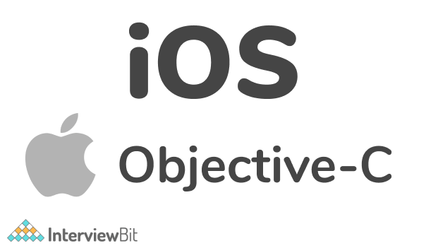

**Tính năng**
- Biên dịch khá nhanh và hoạt động mềm mại
- Obj-C tương thích với cả C và C++
- Hỗ trợ Runtime
- Làm việc tốt với các Foundation APIs

### 18. Các kiểu dữ liệu phổ biến trong Objective-C?

* **BOOL**: biểu diễn giá trị Boolean tức là true hoặc false. Cả từ khoác _Bool và BOOL đều hợp lệ.
    Ví dụ:

    ```mm
    _Bool flag = 0;
    BOOL secondflag = 1;
    ```
* **NSInteger**: biểu diễn số nguyên.
    Ví dụ:
    
    ```mm
    typedef long NSInteger;
    typedef int NSInteger;
    ```

* **NSUInteger**: biểu diễn số nguyên không dấu.
    Ví dụ:

    ```mm
    typedef unsigned long NSUInteger; 
    typedef unsigned int NSUInteger;
    ```

* **NSString**: biểu diễn chuỗi.
    Ví dụ:
    
    ```mm
    NSString *greeting = @"Hello";
    ```

### 19. Swift trong iOS?

Swift là ngôn ngữ lập trình phát triển nhanh nhất hiện nay, do Apple tạo ra. Với lợi thế đáng kể so với Objective-C, Swift giữ vị trí dẫn đầu trong việc phát triển iOS. Đây là một ngôn ngữ hoàn toàn mới được tạo ra đặc biệt để phát triển phần mềm cho các hệ điều hành của Apple. Vì Swift triển khai tất cả các tính năng của các ngôn ngữ hiện đại khác, bạn có thể tìm thấy kiểu tự suy, tùy chọn, generics và các hàm bậc cao hơn. Nó tương thích với macOS, iOS, watchOS và tvOS.

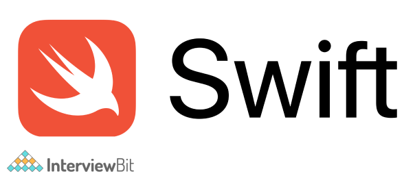

### 20. Các tính năng nổi bật của Swift?

Ngôn ngữ lập trình Swift đang được thiết kế để các nhà phát triển có thể viết các chương trình chính xác và bảo trì chúng một cách dễ dàng. Nó cung cấp các tính năng sau:

- **An toàn:** Swift đem về một cách hiệu quả để viết chương trình. Kiểm tra code trước khi nó được sử dụng trong sản xuất là rất quan trọng. Apple Swift loại bỏ bất kỳ code không an toàn nào trước khi nó được sử dụng trong quá trình sản xuất.
- **Cú pháp đơn giản:** Cú pháp của Swift rất đơn giản và dễ sử dụng, giống như các nhà phát triển mong đợi. Các tính năng cú pháp của Swift cho phép bạn viết code tường minh hơn.
- **Tính dễ đọc:** Swift có cú pháp đơn giản, dễ đọc và dễ viết hơn. Các nhà phát triển viết code Swift dễ dàng hơn vì nó giống với tiếng Anh thuần túy hơn, cho phép họ dành ít thời gian hơn để tìm kiếm mã có vấn đề.
- **Hỗ trợ đa dạng:** Swift hoàn toàn tương thích với iOS, macOS, tvOS, watchOS, Linux và nhiều nền tảng khác. Điều này có nghĩa là bạn có thể phát triển phần mềm tương thích với tất cả các hệ điều hành.
- **Mã nguồn mở:** Swift được phát triển tại *swift.org*, một framework mã nguồn mở. Để Swift trở thành một ngôn ngữ lập trình xác định, công nghệ này phải được mở cho tất cả mọi người. Swift hỗ trợ tất cả các nền tảng của Apple và giúp lập trình dễ dàng hơn, nhanh hơn và an toàn hơn.
- **Tương thích với Objective C:** Swift có khả năng tương thích hoàn toàn với Objective-C. Swift cho phép các lập trình viên nhập các framework từ Objective-C bằng cú pháp Swift. Lập trình viên có thể sử dụng các thư viện và lớp Objective-C bên trong code Swift.

### 21. NSError trong Swift?

Thông tin về điều kiện lỗi được đóng gói trong đối tượng NSError theo cách có thể mở rộng và hướng đối tượng. Đối tượng NSError bao gồm ba thuộc tính cơ bản: miền lỗi được xác định trước (được biểu thị dưới dạng chuỗi), mã lỗi dành riêng cho miền và từ điển thông tin người dùng chứa thông tin dành riêng cho ứng dụng.

```swift
NSString *domain = @"com.MyCompany.MyApplication.ErrorDomain";

NSString *desc = NSLocalizedString(@"Unable to complete the process", @"");

NSDictionary *userInfo = @{ NSLocalizedDescriptionKey : desc };

NSError *error = [NSError errorWithDomain:domain code:-101 userInfo:userInfo];
```

### 22. Enum trong Swift?

Thuật ngữ enum đề cập đến một kiểu dữ liệu do người dùng xác định bao gồm một tập hợp các giá trị liên quan cho phép bạn làm việc với các giá trị đó trong code của mình theo cách an toàn về kiểu. Một kiểu dữ liệu enum được xác định bởi từ khóa enum.

Cú pháp

```swift
enum enum_name  
{    
// enumeration values are described here 
}
```

Ví dụ:

```swift
enum MonthsofaYear 
{    
case January 
case Februrary 
… 
case December 
}
```

Các giá trị được xác định trong một enum `MonthsofaYear` như `January`, `Februrary` cho đến `December` là các trường hợp liệt kê của nó. Các trường hợp liệt kê mới có thể được thêm bằng cách sử dụng từ khóa `case`. Bạn có thể đặt nhiều `case` trên một dòng, được phân tách bằng dấu phẩy như sau:

```swift
enum MonthsofaYear
{
   case January, February,....,December
}
```

### 23. Thuộc tính lazy trong iOS?

Thuộc tính lazy là thuộc tính có giá trị ban đầu không được tính cho đến lần đầu tiên chúng được sử dụng. Bao gồm từ khóa `lazy` trước khi khai báo thuộc tính được lưu trữ để cho biết nó là lazy. Điều này cho phép bạn trì hoãn việc khởi tạo các thuộc tính được lưu trữ. Đây có thể là một cách tuyệt vời để đơn giản hóa code của bạn và giảm bớt công việc không cần thiết. Khi một đoạn code nặng nề và không có khả năng nhất quán, thì biến lazy có thể là một giải pháp tuyệt vời.

```swift
class Person { 
    var name: String
    lazy var personalizdgreeting : String = {  
        return "HelloScala \(self.name)!" 
    }()
    init(name: String) { 
        self.name = name 
    } 
}
```

Như đã trình bày ở trên, chúng ta không chắc chắn về giá trị `personalizdgreeting` nên có. Để biết chính xác, chúng ta cần đợi cho đến khi đối tượng này được khởi tạo.

### 24. Generic trong Swift?

Một tính năng chính của Swift là generic và phần lớn thư viện chuẩn của Swift được viết bằng code generic. Ví dụ: kiểu 'Array' và 'Dictionary' của Swift tạo thành các tập hợp generic. Code generic cho phép bạn tạo các hàm và kiểu linh hoạt, có thể tái sử dụng hoạt động với bất kỳ kiểu dữ liệu nào. Bạn có thể tạo code không quá cụ thể về các kiểu dữ liệu cơ bản, dẫn đến code sạch hơn.

```swift
func Swapping(x: inout Int, y: inout Int)  
{    
    let temp = x 
    x = y 
    y = temp 
} 
var num1 = 10 
var num2 = 50 
print("Before Swapping: \(num1) and \(num2)") 
Swapping(x: &num1, y: &num2) 
print("After Swapping: \(num1) and \(num2)")
```

Kết quả:

```
Before Swapping: 10 and 50 
After Swapping: 50 and 10
```

Trong ví dụ trên, chúng ta đã định nghĩa một hàm `Swapping()` để hoán đổi các số nguyên. Nó nhận hai tham số x và y kiểu int. Như đã thấy trong đầu ra, các giá trị của x và y được trao đổi sau khi hoán đổi.

### 25. Dictionary trong Swift?

Swift định nghĩa dictionary là một tập hợp các mục không có thứ tự. Nó lưu trữ các mục theo cặp key-value. Dictionary sử dụng một định danh duy nhất được gọi là khóa (key) để lưu trữ một giá trị (value) được liên kết mà sau này có thể được tham chiếu và truy xuất thông qua cùng một khóa.

Cú pháp:

```swift
var Dict_name = [KeyType: ValueType]() 
```

Ví dụ:

```swift
var examresult= ["Rahul": "79", "Aditya": "86", "Aditi": "67"] 
print(examresult) 
```

Kết quả:

```swift
["Rahul": "79", "Aditya": "86", "Aditi": "67"] 
```

Trong ví dụ trên ta tạo một dictionary là `examresult`. Với
- Khoá là `Rahul`, `Aditya`, `Aditi`.
- Giá trị là `79`, `86`, `67`.

### 26. Các design pattern được dùng trong iOS?

Design pattern là giải pháp cho một vấn đề cụ thể mà bạn có thể gặp phải khi thiết kế kiến trúc của ứng dụng. Chúng là các mẫu được thiết kế để giúp bạn viết code dễ dàng hơn và có thể tái sử dụng nhiều hơn. Sau đây là một số design pattern có thể được sử dụng trong iOS:

#### MVC (Model-View-Controller)

MVC là một design pattern để phát triển các ứng dụng web trong đó ba thành phần được kết nối, là **view**, **controller** và **model**. View có thể được hiểu là giao diện người dùng được hiển thị cho người dùng cuối tại một thời điểm nhất định. Model đại diện cho dữ liệu được hiển thị trên view. Controller hoạt động như một liên kết giữa view và model. Giữa ba thành phần này luôn có mối quan hệ.

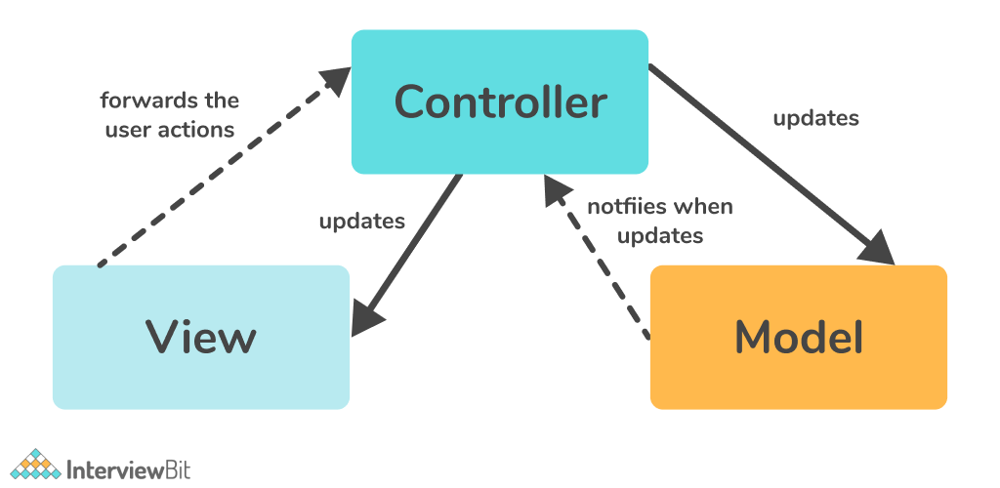

#### MVVM (Model-View-View Model)

Không giống như MVC, có một lớp đặc biệt trong MVVM được gọi là View Model giữa View và Model. Sử dụng view model, thông tin từ model có thể được chuyển đổi thành các giá trị có thể được hiển thị trên view. Có một liên kết ràng buộc giữa view và view model cho phép view model chia sẻ các cập nhật với view.

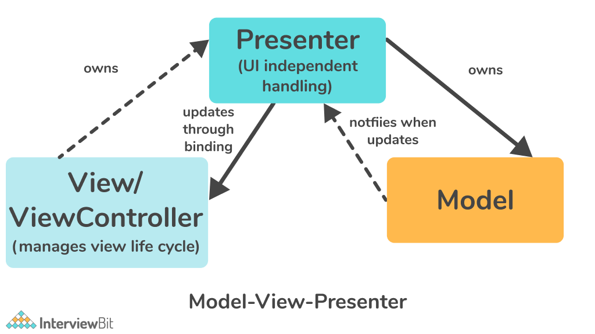

#### Facade

Facade cung cấp một interface đơn giản hơn thay vì một tập hợp lớp hay thư viện phức tạp. Thay vì cung cấp cho người dùng một tập lớp và API của chúng, nó thực hiện đơn giản hơn chỉ cung cấp các API hữu ích. Facade giúp giảm sự phức tạp tổng thể của ứng dụng, nó giúp ta chuyển các phụ thuộc không mong muốn sang một nơi duy nhất.

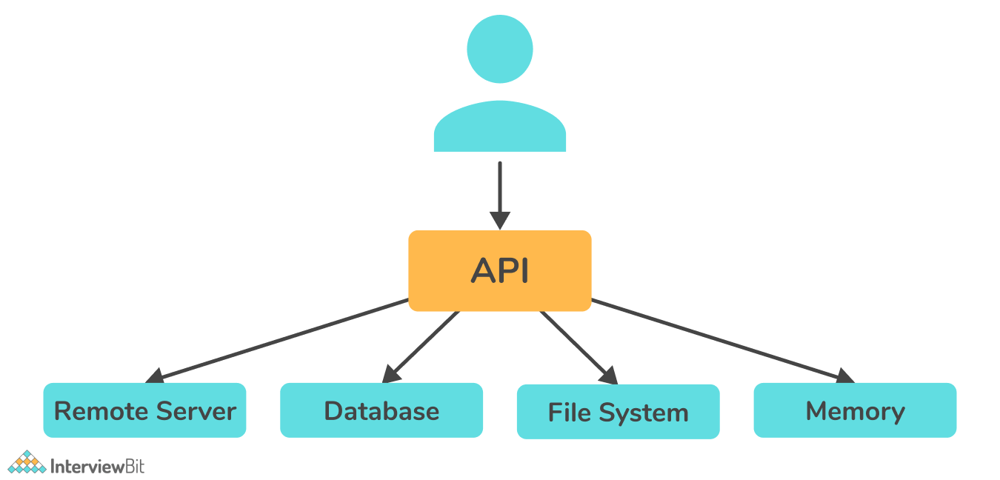

### 27. Framework JSON nào được hỗ trợ trong iOS?

iOS hỗ trợ framework SBJson. Con người và máy tính đều có thể dễ dàng đọc và ghi công cụ định dạng trao đổi dữ liệu này. Xử lý JSON được đơn giản hóa với các API linh hoạt của SBJson và kiểm soát bổ sung.

### 28. iBeacons trong iOS?

iBeacon, công nghệ không dây Bluetooth năng lượng thấp mới của Apple, cho phép iPhone và người dùng iOS khác nhận thông tin và dịch vụ dựa trên vị trí trên điện thoại thông minh. IBeacons là những thiết bị phát không dây, nhỏ, truyền tín hiệu đến các thiết bị thông minh gần đó thông qua công nghệ năng lượng thấp Bluetooth.

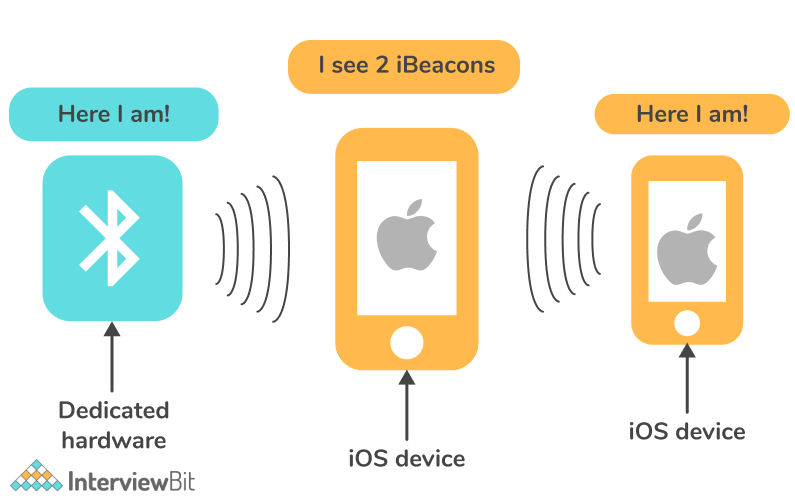

### 29. Sự khác biệt giữa KVC và KVO trong Swift?

- **KVC (Key-Value Coding):** Nó cho phép các thuộc tính của đối tượng được truy cập trong thời gian chạy bằng cách sử dụng các chuỗi thay vì biết tên thuộc tính một cách tĩnh trong quá trình phát triển.
- **KVO (Key-Value Observing):** Trong Objective-C và Swift, KVO là một trong những phương pháp để quan sát các thay đổi trạng thái chương trình. Nếu một đối tượng có các biến cá thể, KVO cho phép các đối tượng khác quan sát những thay đổi đối với các biến đó.

### 30. TDD là gì?

Các nhà phát triển phần mềm có thể sử dụng testing-driven development (TDD) trong quá trình phát triển phần mềm. Trong TDD, các nhà phát triển lập kế hoạch các tính năng của phần mềm mà họ muốn tạo và sau đó viết các trường hợp kiểm thử cho từng tính năng trước khi triển khai nó. Thông qua testing-driven development, chúng ta có thể hiểu rõ hơn về cả chất lượng của việc triển khai (nó có hoạt động không) và chất lượng của thiết kế (nó có được cấu trúc tốt không).

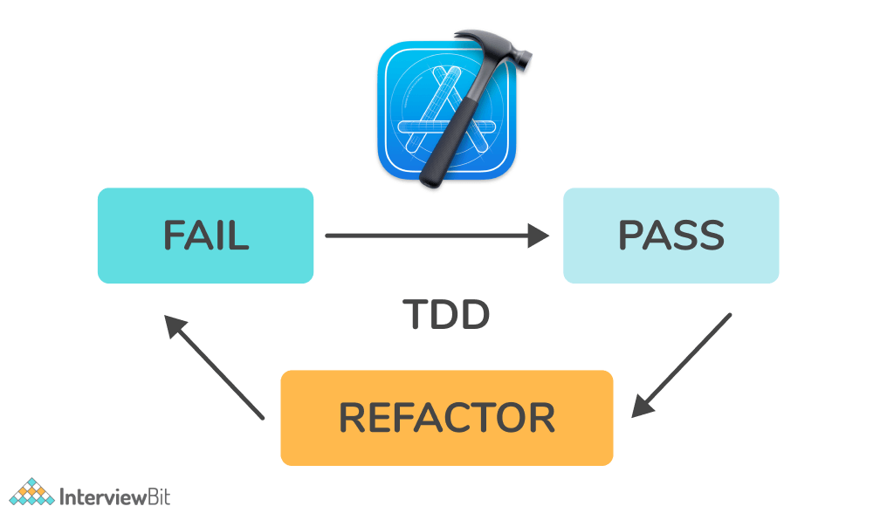

Lúc đầu, trường hợp thử nghiệm sẽ thất bại vì code chưa được triển khai và điều này thường được gọi là *giai đoạn đỏ*. Sau đó, code được viết để đảm bảo rằng trường hợp thử nghiệm vượt qua và không phá vỡ bất kỳ thành phần nào hoặc trường hợp thử nghiệm hiện tại, được gọi là *giai đoạn xanh*. Sau đó, nhà phát triển cấu trúc lại việc triển khai code bằng cách làm sạch và bảo trì codebase, cũng như tối ưu hóa hiệu quả. Quá trình này sau đó nên được lặp lại mỗi khi một trường hợp thử nghiệm mới được thêm vào.

### 31. Giải thích các hàm completion handler?

Completion handler về cơ bản là các hàm được truyền dưới dạng tham số cho các hàm khác. Chúng được dùng cho xử lý các phản hồi của tác vụ bất đồng bộ vì chúng ta không biết khi nào chúng sẽ kết thức. Completion handler thông báo cho ứng dụng khi một hoạt động, chẳng hạn như lệnh gọi API, đã được hoàn thành. Chương trình được thông báo rằng bước tiếp theo cần được thực hiện.

**Ví dụ**

Ta tạo một lớp gọi là `CompletionHandler` có một phương thức là `count` để đếm từ 0 đến 50. Sau khi đến 25 (giá trị ngẫu nhiên), nó sẽ tạo một yêu cầu mạng đến `https://scaler.com`. Sau khi mỗi yêu cầu hoàn thành ta in `Received response`.

```swift
class CompletionHandler {
    func count() {
        for i in 0...50 {
            if i == 25 {
                if let url = URL(string: "https://scaler.com") {
                    URLSession.shared.dataTask(with: url) { (data, response, error) in
                        print("Received response")
                    }.resume()
                }
            }     
            print("I = ", i)
        }
    }
}
let newInstance = CompletionHandler()
newInstance.count()
```

Bạn sẽ thấy tất cả các số được in ra trong bảng điều khiển ngay sau khi code chạy, nhưng `Received response` sẽ chỉ được in sau khi tất cả các số khác đã được in.

### 32. Sự khác biệt giữa strong, weak, readonly và copy?

- **Strong**: Thuộc tính này duy trì một tham chiếu đến thuộc tính trong suốt thời gian tồn tại của một đối tượng. Khi bạn khai báo `strong`, bạn có ý định "sở hữu" đối tượng mà bạn đang tham chiếu. Dữ liệu bạn gán cho thuộc tính này sẽ không bị hủy miễn là bạn hoặc bất kỳ đối tượng nào khác tham chiếu `strong` đến thuộc tính này.
- **Weak**: Có nghĩa là đối tượng nên được giữ trong bộ nhớ miễn là ai đó trỏ strong vào nó và bạn không cần kiểm soát thời gian tồn tại của nó.
- **Read-only**: Thuộc tính của một đối tượng có thể được xác định ban đầu, nhưng nó không thể được thay đổi hoặc sửa đổi.
- **Copy**: Thuộc tính này là một thay thế cho `strong`. Thay cho việc chiếm quyền sở hữu một đối tượng hiện tại, nó tạo ra một bản sao của bất kỳ thứ gì bạn gán cho thuộc tính, sau đó có quyền sở hữu bản sao đó.

### 33. Dynamic dispatch là gì?

Nói một cách dễ hiểu, dynamic dispatch có nghĩa là chương trình quyết định trong thời gian chạy việc triển khai một phương thức hoặc hàm cụ thể nào mà nó cần gọi. Trong trường hợp lớp con ghi đè một phương thức của lớp cha của nó, dynamic dispatch sẽ xác định xem nên gọi triển khai phương thức của lớp con hay của lớp cha.

### 34. Giải thích lệnh @dynamic và @synthesize trong Objective-C?

- **@synthesize**: Lệnh này tạo ra các phương thức getter và setter trong thuộc tính và hoạt động cùng với lệnh @dynamic. Theo mặc định, @synthesize tạo một biến có cùng tên với đối tượng đích của set/get như được minh họa trong ví dụ dưới đây.
    - Ví dụ 1: 
    ```mm
    @property (nonatomic, retain) NSButton *someButton;
    ...
    @synthesize someButton;
    ```
    - Ví dụ 2:
    ```mm
    @property (nonatomic, retain) NSButton *someButton;
    ...
    @synthesize someButton= _homeButton;
    ```
- **@dynamic**: Điều này cho trình biên dịch biết rằng các phương thức getter và setter không được triển khai trong chính lớp đó, mà ở những nơi khác (như lớp cha hoặc chúng sẽ có sẵn trong thời gian chạy).
    - Ví dụ:
    ```mm
    @property (nonatomic, retain) IBOutlet NSButton *someButton;
    ...
    @dynamic someButton;
    ```

### 35. Cách triển khai storage và persistence trong iOS?

Persistence có nghĩa là lưu trữ dữ liệu trên đĩa để có thể truy xuất dữ liệu mà không bị thay đổi trong lần mở ứng dụng tiếp theo. Từ đơn giản đến phức tạp, có các phương pháp sau để lưu trữ dữ liệu:

- Các cấu trúc dữ liệu như mảng, tập hợp, dictionary và các cấu trúc dữ liệu khác là những cấu trúc hoàn hảo để lưu trữ dữ liệu ngay lập tức.
- `NSUserDefaults` và `Keychains` đều là kho lưu trữ key-value đơn giản. `NSUserDefaults` thì không an toàn, trong khi Keychains bảo mật hơn.
- File hoặc disk storage là một cách để lưu trữ dữ liệu (được tuần tự hóa hoặc không) đến đĩa bằng `NSFileManager`.
- Cơ sở dữ liệu quan hệ, chẳng hạn như SQLite, rất tốt để triển khai các cơ chế truy vấn phức tạp

### 36. Tác vụ đồng bộ và bất đồng bộ trong iOS?

iOS của Apple hỗ trợ cả tác vụ đồng bộ và bất đồng bộ. Trong các hoạt động đồng bộ, các tác vụ được thực hiện lần lượt. Do đó, các tác vụ khác phải đợi cho đến khi hoàn thành tác vụ trước rồi mới tiếp tục. Các tác vụ bất đồng bộ chạy đồng thời trong nền. Nếu các tác vụ nền được hoàn thành, bạn sẽ được thông báo. Lập trình bất đồng bộ cho phép bạn xử lý nhiều yêu cầu cùng một lúc, vì vậy bạn có thể hoàn thành nhiều tác vụ hơn trong một khoảng thời gian ngắn hơn.

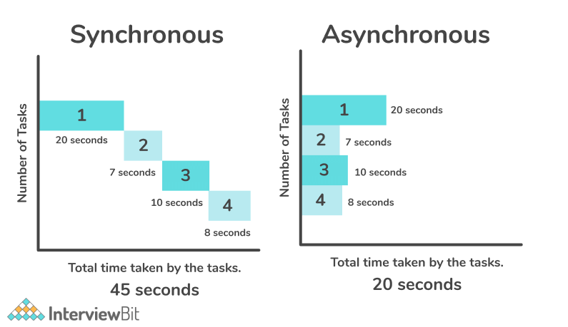

Hình trên chỉ ra rằng các tác vụ đồng bộ cần nhiều thời gian hơn để hoàn thành, tức là 45 giây, khi mỗi tác vụ được thực hiện một lần. Mặt khác, các tác vụ bất đồng bộ sẽ mất ít thời gian hơn để hoàn thành, tức là 20 giây khi chúng chạy đồng thời.

Công việc bất đồng bộ có thể được xử lý bằng thư viện của bên thứ ba. Một vài ví dụ nổi bật là Promise(PromiseKit), RxSwift và ReactiveCocoa.