# Câu hỏi phỏng vấn Java


## Java là gì?

Java là một ngôn ngữ lập trình hướng đối tượng được phát triển cho môi trường phân tán và phát triển phần mềm đa nền tảng.

Ngôn ngữ lập trình Java là một ngôn ngữ độc lập với nền tảng, có nghĩa là không có giới hạn đối với bất kỳ phần cứng hoặc hệ điều hành cụ thể nào. Nó cung cấp cho người dùng cơ sở để 'viết một lần, chạy ở mọi nơi'. Nhiều hệ điều hành như Sun Solaris, RedHat, Windows, v.v., hỗ trợ Java.

## Mục lục

[1. Java có phải nền tảng độc lập không?](#1-java-c%C3%B3-ph%E1%BA%A3i-n%E1%BB%81n-t%E1%BA%A3ng-%C4%91%E1%BB%99c-l%E1%BA%ADp-kh%C3%B4ng)

[2. Tại sao nói Java không phải ngôn ngữ thuần đối tượng?](#2-t%E1%BA%A1i-sao-n%C3%B3i-java-kh%C3%B4ng-ph%E1%BA%A3i-ng%C3%B4n-ng%E1%BB%AF-thu%E1%BA%A7n-%C4%91%E1%BB%91i-t%C6%B0%E1%BB%A3ng)

[3. Con trỏ trong Java?](#3-con-tr%E1%BB%8F-trong-java)

[4. Biến toàn cục và biến cục bộ trong Java?](#4-bi%E1%BA%BFn-to%C3%A0n-c%E1%BB%A5c-v%C3%A0-bi%E1%BA%BFn-c%E1%BB%A5c-b%E1%BB%99-trong-java)

[5. Đóng gói dữ liệu là gì?](#5-%C4%91%C3%B3ng-g%C3%B3i-d%E1%BB%AF-li%E1%BB%87u-l%C3%A0-g%C3%AC)

[6. JIT compiler là gì?](#6-jit-compiler-l%C3%A0-g%C3%AC)

[7. Sự khác biết giữa phương thức equals() và toán tử == trong Java?](#7-s%E1%BB%B1-kh%C3%A1c-bi%E1%BA%BFt-gi%E1%BB%AFa-ph%C6%B0%C6%A1ng-th%E1%BB%A9c-equals-v%C3%A0-to%C3%A1n-t%E1%BB%AD--trong-java)

[8. Dùng vòng lặp trong Java thế nào?](#8-d%C3%B9ng-v%C3%B2ng-l%E1%BA%B7p-trong-java-th%E1%BA%BF-n%C3%A0o)

[9. Giải thích khái niệm constructor overloading?](#9-gi%E1%BA%A3i-th%C3%ADch-kh%C3%A1i-ni%E1%BB%87m-constructor-overloading)

[10. Nạp chồng phương thức và ghi đè phương thức trong Java?](#10-n%E1%BA%A1p-ch%E1%BB%93ng-ph%C6%B0%C6%A1ng-th%E1%BB%A9c-v%C3%A0-ghi-%C4%91%C3%A8-ph%C6%B0%C6%A1ng-th%E1%BB%A9c-trong-java)

[11. Một try có thể có nhiều catch trong Java?](#11-m%E1%BB%99t-try-c%C3%B3-th%E1%BB%83-c%C3%B3-nhi%E1%BB%81u-catch-trong-java)

[12. Giải thích từ khoá final trong biến, phương thức và lớp?](#12-gi%E1%BA%A3i-th%C3%ADch-t%E1%BB%AB-kho%C3%A1-final-trong-bi%E1%BA%BFn-ph%C6%B0%C6%A1ng-th%E1%BB%A9c-v%C3%A0-l%E1%BB%9Bp)

[13. Các từ khoá final, finally và finalize là giống nhau?](#13-c%C3%A1c-t%E1%BB%AB-kho%C3%A1-final-finally-v%C3%A0-finalize-l%C3%A0-gi%E1%BB%91ng-nhau)

[14. Khi nào dùng từ khoá super?](#14-khi-n%C3%A0o-d%C3%B9ng-t%E1%BB%AB-kho%C3%A1-super)

[15. Các cách tạo đối tượng trong Java?](#15-c%C3%A1c-c%C3%A1ch-t%E1%BA%A1o-%C4%91%E1%BB%91i-t%C6%B0%E1%BB%A3ng-trong-java)

[16. Có thể ghi đè phương thức tĩnh?](#16-c%C3%B3-th%E1%BB%83-ghi-%C4%91%C3%A8-ph%C6%B0%C6%A1ng-th%E1%BB%A9c-t%C4%A9nh)

[17. Đối tượng chính của bộ dọn rác?](#17-%C4%91%E1%BB%91i-t%C6%B0%E1%BB%A3ng-ch%C3%ADnh-c%E1%BB%A7a-b%E1%BB%99-d%E1%BB%8Dn-r%C3%A1c)

[18. Sự khác biệt giữa bộ nhớ Heap và Stack?](#18-s%E1%BB%B1-kh%C3%A1c-bi%E1%BB%87t-gi%E1%BB%AFa-b%E1%BB%99-nh%E1%BB%9B-heap-v%C3%A0-stack)

[19. Ngoài khía cạnh bảo mật, những lý do đằng sau việc làm cho chuỗi bất biến trong Java là gì?](#19-ngo%C3%A0i-kh%C3%ADa-c%E1%BA%A1nh-b%E1%BA%A3o-m%E1%BA%ADt-nh%E1%BB%AFng-l%C3%BD-do-%C4%91%E1%BA%B1ng-sau-vi%E1%BB%87c-l%C3%A0m-cho-chu%E1%BB%97i-b%E1%BA%A5t-bi%E1%BA%BFn-trong-java-l%C3%A0-g%C3%AC)

[20. Sự khác biệt giữa String, StringBuffer và StringBuilder?](#20-s%E1%BB%B1-kh%C3%A1c-bi%E1%BB%87t-gi%E1%BB%AFa-string-stringbuffer-v%C3%A0-stringbuilder)

[21. Sử dụng các thuộc tính có liên quan làm nổi bật sự khác biệt giữa các interface và các lớp trừu tượng?](#21-s%E1%BB%AD-d%E1%BB%A5ng-c%C3%A1c-thu%E1%BB%99c-t%C3%ADnh-c%C3%B3-li%C3%AAn-quan-l%C3%A0m-n%E1%BB%95i-b%E1%BA%ADt-s%E1%BB%B1-kh%C3%A1c-bi%E1%BB%87t-gi%E1%BB%AFa-c%C3%A1c-interface-v%C3%A0-c%C3%A1c-l%E1%BB%9Bp-tr%E1%BB%ABu-t%C6%B0%E1%BB%A3ng)

[22. Trong Java, có thể ghi đè phương thức static cũng như phương thức private không?](#22-trong-java-c%C3%B3-th%E1%BB%83-ghi-%C4%91%C3%A8-ph%C6%B0%C6%A1ng-th%E1%BB%A9c-static-c%C5%A9ng-nh%C6%B0-ph%C6%B0%C6%A1ng-th%E1%BB%A9c-private-kh%C3%B4ng)

[23. HashSet khác TreeSet như thế nào?](#23-hashset-kh%C3%A1c-treeset-nh%C6%B0-th%E1%BA%BF-n%C3%A0o)

[24. Tại sao mảng ký tự được ưu tiên hơn chuỗi để lưu trữ thông tin bí mật?](#24-t%E1%BA%A1i-sao-m%E1%BA%A3ng-k%C3%BD-t%E1%BB%B1-%C4%91%C6%B0%E1%BB%A3c-%C6%B0u-ti%C3%AAn-h%C6%A1n-chu%E1%BB%97i-%C4%91%E1%BB%83-l%C6%B0u-tr%E1%BB%AF-th%C3%B4ng-tin-b%C3%AD-m%E1%BA%ADt)

[25. Sự khác biệt của JVM, JRE và JDK?](#25-s%E1%BB%B1-kh%C3%A1c-bi%E1%BB%87t-c%E1%BB%A7a-jvm-jre-v%C3%A0-jdk)

[26. Sự khác biệt giữa HashMap và HashTable trong Java?](#26-s%E1%BB%B1-kh%C3%A1c-bi%E1%BB%87t-gi%E1%BB%AFa-hashmap-v%C3%A0-hashtable-trong-java)

[27. Reflection trong Java?](#27-reflection-trong-java)

[28. Các cách sử dụng luồng?](#28-c%C3%A1c-c%C3%A1ch-s%E1%BB%AD-d%E1%BB%A5ng-lu%E1%BB%93ng)

[29. Sự khác biệt giữa constructor và phương thức của lớp?](#29-s%E1%BB%B1-kh%C3%A1c-bi%E1%BB%87t-gi%E1%BB%AFa-constructor-v%C3%A0-ph%C6%B0%C6%A1ng-th%E1%BB%A9c-c%E1%BB%A7a-l%E1%BB%9Bp)

[30. Truyền giá trị và truyền tham chiếu trong Java?](#30-truy%E1%BB%81n-gi%C3%A1-tr%E1%BB%8B-v%C3%A0-truy%E1%BB%81n-tham-chi%E1%BA%BFu-trong-java)

[31. Giữa String và StringBuffer cái nào nên được ưu tiên hơn khi có rất nhiều cập nhật cần được thực hiện trong dữ liệu?](#31-gi%E1%BB%AFa-string-v%C3%A0-stringbuffer-c%C3%A1i-n%C3%A0o-n%C3%AAn-%C4%91%C6%B0%E1%BB%A3c-%C6%B0u-ti%C3%AAn-h%C6%A1n-khi-c%C3%B3-r%E1%BA%A5t-nhi%E1%BB%81u-c%E1%BA%ADp-nh%E1%BA%ADt-c%E1%BA%A7n-%C4%91%C6%B0%E1%BB%A3c-th%E1%BB%B1c-hi%E1%BB%87n-trong-d%E1%BB%AF-li%E1%BB%87u)

[32. Sự khác biệt giữa biến transient và volatile trong Java?](#32-s%E1%BB%B1-kh%C3%A1c-bi%E1%BB%87t-gi%E1%BB%AFa-bi%E1%BA%BFn-transient-v%C3%A0-volatile-trong-java)

[33. Hệ thống phân cấp của lớp Java Exception?](#33-h%E1%BB%87-th%E1%BB%91ng-ph%C3%A2n-c%E1%BA%A5p-c%E1%BB%A7a-l%E1%BB%9Bp-java-exception)

[34. Sự khác biệt giữa Error và Exception?](#34-s%E1%BB%B1-kh%C3%A1c-bi%E1%BB%87t-gi%E1%BB%AFa-error-v%C3%A0-exception)

[35. Cách thực hiện Object Cloning trong Java?](#35-c%C3%A1ch-th%E1%BB%B1c-hi%E1%BB%87n-object-cloning-trong-java)

[36. Làm thế nào để một ngoại lệ lan truyền trong code?](#36-l%C3%A0m-th%E1%BA%BF-n%C3%A0o-%C4%91%E1%BB%83-m%E1%BB%99t-ngo%E1%BA%A1i-l%E1%BB%87-lan-truy%E1%BB%81n-trong-code)

[37. Có bắt buộc sử dụng catch sau try không?](#37-c%C3%B3-b%E1%BA%AFt-bu%E1%BB%99c-s%E1%BB%AD-d%E1%BB%A5ng-catch-sau-try-kh%C3%B4ng)

[38. Liệu khối finally có được thực thi khi câu lệnh return được viết ở cuối khối try và khối catch ở như dưới đây không?](#38-li%E1%BB%87u-kh%E1%BB%91i-finally-c%C3%B3-%C4%91%C6%B0%E1%BB%A3c-th%E1%BB%B1c-thi-khi-c%C3%A2u-l%E1%BB%87nh-return-%C4%91%C6%B0%E1%BB%A3c-vi%E1%BA%BFt-%E1%BB%9F-cu%E1%BB%91i-kh%E1%BB%91i-try-v%C3%A0-kh%E1%BB%91i-catch-%E1%BB%9F-nh%C6%B0-d%C6%B0%E1%BB%9Bi-%C4%91%C3%A2y-kh%C3%B4ng)

[39. Có thể gọi một constructor của một lớp bên trong một constructor khác không?](#39-c%C3%B3-th%E1%BB%83-g%E1%BB%8Di-m%E1%BB%99t-constructor-c%E1%BB%A7a-m%E1%BB%99t-l%E1%BB%9Bp-b%C3%AAn-trong-m%E1%BB%99t-constructor-kh%C3%A1c-kh%C3%B4ng)

[40. Các vị trí bộ nhớ liền nhau thường được sử dụng để lưu trữ các giá trị thực tế trong một mảng nhưng không phải trong ArrayList. Giải thích?](#40-c%C3%A1c-v%E1%BB%8B-tr%C3%AD-b%E1%BB%99-nh%E1%BB%9B-li%E1%BB%81n-nhau-th%C6%B0%E1%BB%9Dng-%C4%91%C6%B0%E1%BB%A3c-s%E1%BB%AD-d%E1%BB%A5ng-%C4%91%E1%BB%83-l%C6%B0u-tr%E1%BB%AF-c%C3%A1c-gi%C3%A1-tr%E1%BB%8B-th%E1%BB%B1c-t%E1%BA%BF-trong-m%E1%BB%99t-m%E1%BA%A3ng-nh%C6%B0ng-kh%C3%B4ng-ph%E1%BA%A3i-trong-arraylist-gi%E1%BA%A3i-th%C3%ADch)

[41. Mặc dù kế thừa là một khái niệm OOPs phổ biến, nhưng nó kém lợi thế hơn so với composition. Giải thích?](#41-m%E1%BA%B7c-d%C3%B9-k%E1%BA%BF-th%E1%BB%ABa-l%C3%A0-m%E1%BB%99t-kh%C3%A1i-ni%E1%BB%87m-oops-ph%E1%BB%95-bi%E1%BA%BFn-nh%C6%B0ng-n%C3%B3-k%C3%A9m-l%E1%BB%A3i-th%E1%BA%BF-h%C6%A1n-so-v%E1%BB%9Bi-composition-gi%E1%BA%A3i-th%C3%ADch)

[42. Tạo chuỗi với new() khác với cách dùng ký tự như thể nào?](#42-t%E1%BA%A1o-chu%E1%BB%97i-v%E1%BB%9Bi-new-kh%C3%A1c-v%E1%BB%9Bi-c%C3%A1ch-d%C3%B9ng-k%C3%BD-t%E1%BB%B1-nh%C6%B0-th%E1%BB%83-n%C3%A0o)

[43. Có thể vượt quá giới hạn bộ nhớ trong một chương trình mặc dù có bộ thu gom rác không?](#43-c%C3%B3-th%E1%BB%83-v%C6%B0%E1%BB%A3t-qu%C3%A1-gi%E1%BB%9Bi-h%E1%BA%A1n-b%E1%BB%99-nh%E1%BB%9B-trong-m%E1%BB%99t-ch%C6%B0%C6%A1ng-tr%C3%ACnh-m%E1%BA%B7c-d%C3%B9-c%C3%B3-b%E1%BB%99-thu-gom-r%C3%A1c-kh%C3%B4ng)

[44. Đồng bộ hoá trong Java?](#44-%C4%91%E1%BB%93ng-b%E1%BB%99-ho%C3%A1-trong-java)

[45. Cho đoạn code bên dưới, ký hiệu ... là gì?](#45-cho-%C4%91o%E1%BA%A1n-code-b%C3%AAn-d%C6%B0%E1%BB%9Bi-k%C3%BD-hi%E1%BB%87u--l%C3%A0-g%C3%AC)

[46. Vòng đời của luồng Java?](#46-v%C3%B2ng-%C4%91%E1%BB%9Di-c%E1%BB%A7a-lu%E1%BB%93ng-java)

[47. Điều gì có thể cân bằng giữa việc sử dụng một mảng không có thứ tự so với việc sử dụng một mảng có thứ tự?](#47-%C4%91i%E1%BB%81u-g%C3%AC-c%C3%B3-th%E1%BB%83-c%C3%A2n-b%E1%BA%B1ng-gi%E1%BB%AFa-vi%E1%BB%87c-s%E1%BB%AD-d%E1%BB%A5ng-m%E1%BB%99t-m%E1%BA%A3ng-kh%C3%B4ng-c%C3%B3-th%E1%BB%A9-t%E1%BB%B1-so-v%E1%BB%9Bi-vi%E1%BB%87c-s%E1%BB%AD-d%E1%BB%A5ng-m%E1%BB%99t-m%E1%BA%A3ng-c%C3%B3-th%E1%BB%A9-t%E1%BB%B1)

[48. Có thể import cùng một lớp hoặc ơackage hai lần trong Java không và điều gì xảy ra với nó trong thời gian chạy?](#48-c%C3%B3-th%E1%BB%83-import-c%C3%B9ng-m%E1%BB%99t-l%E1%BB%9Bp-ho%E1%BA%B7c-%C6%A1ackage-hai-l%E1%BA%A7n-trong-java-kh%C3%B4ng-v%C3%A0-%C4%91i%E1%BB%81u-g%C3%AC-x%E1%BA%A3y-ra-v%E1%BB%9Bi-n%C3%B3-trong-th%E1%BB%9Di-gian-ch%E1%BA%A1y)

[49. Sự khác biệt giữa Inner Class và Sub Class?](#49-s%E1%BB%B1-kh%C3%A1c-bi%E1%BB%87t-gi%E1%BB%AFa-inner-class-v%C3%A0-sub-class)

[50. Các kiểu tham chiếu trong Java?](#50-c%C3%A1c-ki%E1%BB%83u-tham-chi%E1%BA%BFu-trong-java)

[51. Marker interface trong Java là gì?](#51-marker-interface-trong-java-l%C3%A0-g%C3%AC)

[52. Giải thích "Double Brace Initialisation" trong Java?](#52-gi%E1%BA%A3i-th%C3%ADch-%22double-brace-initialisation%22-trong-java)

[53. Tại sao nói rằng phương thức length() của lớp String không trả về kết quả chính xác?](#53-t%E1%BA%A1i-sao-n%C3%B3i-r%E1%BA%B1ng-ph%C6%B0%C6%A1ng-th%E1%BB%A9c-length-c%E1%BB%A7a-l%E1%BB%9Bp-string-kh%C3%B4ng-tr%E1%BA%A3-v%E1%BB%81-k%E1%BA%BFt-qu%E1%BA%A3-ch%C3%ADnh-x%C3%A1c)

[54. Giải thích kết quả của đoạn code sau?](#54-gi%E1%BA%A3i-th%C3%ADch-k%E1%BA%BFt-qu%E1%BA%A3-c%E1%BB%A7a-%C4%91o%E1%BA%A1n-code-sau)

[55. Các cách để tạo điều kiện cho đối tượng bị thu gom gác (GC) trong Java?](#55-c%C3%A1c-c%C3%A1ch-%C4%91%E1%BB%83-t%E1%BA%A1o-%C4%91i%E1%BB%81u-ki%E1%BB%87n-cho-%C4%91%E1%BB%91i-t%C6%B0%E1%BB%A3ng-b%E1%BB%8B-thu-gom-g%C3%A1c-gc-trong-java)

## Câu hỏi phỏng vấn Java cho Fresher

### 1. Java có phải nền tảng độc lập không?

Java là một ngôn ngữ độc lập với nền tảng vì mã nguồn của Java có thể chạy trên nhiều hệ điều hành. Các chương trình Java có thể chạy trên bất kỳ máy nào hoặc hệ điều hành không cần cài đặt bất kỳ phần mềm đặc biệt nào. Mặc dù JVM cần phải có mặt trong máy. Mã Java biên dịch thành bytecode (file .class), độc lập với nền tảng. Chúng tôi có thể chạy mã bytecode này trên Windows, Linux, Mac OS,....

### 2. Tại sao nói Java không phải ngôn ngữ thuần đối tượng?

Java hỗ trợ kiểu dữ liệu nguyên thuỷ byte, boolean, char, short, int, float, long, và double, do đó nó không phải là ngôn ngữ thuần đối tượng.

### 3. Con trỏ trong Java?

Con trỏ là một khái niệm khá phức tạp đối với những người mới bắt đầu. Java tập trung vào sự đơn giản cho code nên việc sử dụng con trỏ có thể khiến nó trở nên phức tạp hơn. Đồng thời, tính bảo mật cũng bị ảnh hưởng nếu con trỏ được sử dụng vì người dùng có thể truy cập trực tiếp vào bộ nhớ với sự trợ giúp của con trỏ.

Do đó, một mức trừu tượng nhất định được cung cấp bằng cách không bao gồm các con trỏ trong Java. Hơn nữa, việc sử dụng con trỏ có thể làm cho tiến trình thu gom rác khá chậm và sai sót. Java sử dụng các tham chiếu vì chúng không thể thao tác được, không giống như con trỏ.

### 4. Biến toàn cục và biến cục bộ trong Java?

**Biến toàn cục (instance variables)** là các biến có thể được truy cập bởi tất cả phương thức trong lớp. Chúng được khai báo bên ngoài phương thức và bên trong lớp. Các biến này mô tả thuộc tính của một đối tượng, chúng được tạo khi một đối tượng được tạo bằng việc sử dụng từ khóa “new” và sẽ bị phá hủy khi đối tượng bị phá hủy.

Tất cả các đối tượng của lớp sẽ có bản sao các biến để sử dụng. Nếu bất kỳ thay đổi nào được thực hiện trên các biến này, chỉ có đối tượng đó bị tác động, các đối tượng cùng lớp khác sẽ không ảnh hưởng.

```java
class Athlete {
    public String athleteName;
    public double athleteSpeed;
    public int athleteAge;
}
```

**Biến cục bộ (local variables)** là các biến được khai báo trong các phương thức, hàm contructor hoặc trong các khối (`{}`). Việc sử dụng biến bị hạn chế trong phạm vi khối. Bất cứ khi nào một biến cục bộ được khai báo bên trong một phương thức, các phương thức lớp khác không biết gì về sự tồn tại của nó.

```java
public void athlete() {
    String athleteName;
    double athleteSpeed;
    int athleteAge;
}
```

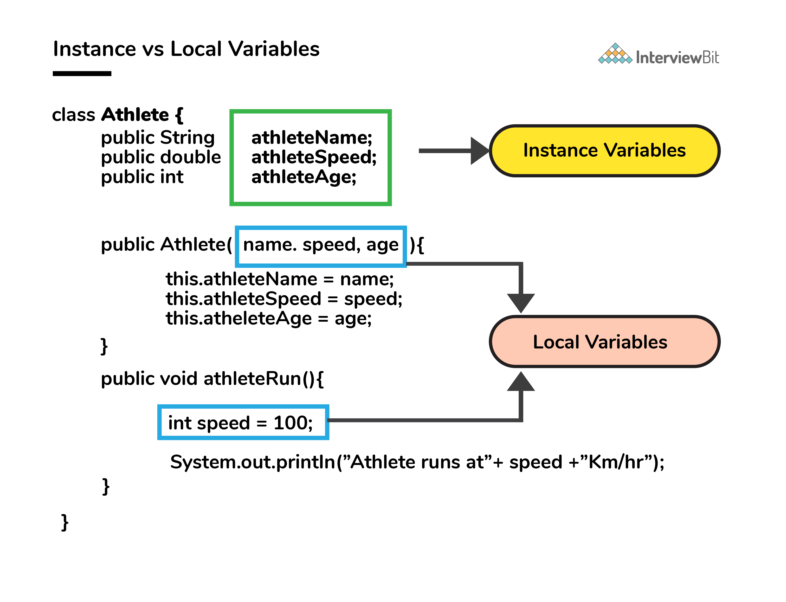

### 5. Đóng gói dữ liệu là gì?

- Đóng gói dữ liệu là một khái niệm trong lập trình hướng đối tượng để ẩn các thuộc tính dữ liệu và hành vi của chúng trong một đơn vị duy nhất.
- Nó giúp các nhà phát triển tuân theo module trong khi phát triển phần mềm bằng cách đảm bảo rằng mỗi đối tượng độc lập với các đối tượng khác bằng cách có các phương thức, thuộc tính và chức năng riêng của nó.
- Nó được sử dụng để bảo mật các thuộc tính riêng tư của một đối tượng và do đó phục vụ mục đích ẩn dữ liệu.

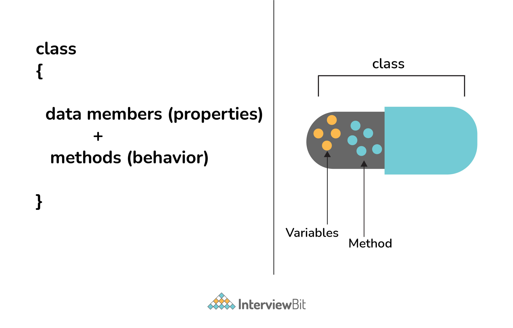

### 6. JIT compiler là gì?

JIT là viết tắt của Just-In-Time, được dùng để cải thiện hiệu suất khi biên dịch. Nó thực hiện nhiệm vụ biên dịch các phần của bytecode có chức năng giống nhau cùng lúc, do đó giảm lượng thời gian biên dịch để chạy code.

Trình biên dịch (compiler) là nơi dịch mã nguồn thành mã máy tính có thể hiểu. Nhưng JIT đặc biệt vì:
- Mã nguồn (.java) được chuyển thành bytecode (.class) xảy ra ở trình biên dịch javac.
- Sau đó file `.class` được tải bởi JVM và sự trợ giúp của trình thông dịch(interpreter), nó được chuyển thành mã máy tính có thể hiểu.
- Trình biên dịch JIT là một phần của JVM. Khi JIT khởi động, JVM phân tích phương thức gọi trong file `.class` và biên dịch chúng để có được code thuần và hiệu quả hơn. Nó cũng đảm bảo phương thức gọi ưu tiên được tối ưu hoá.
- Sau khi bước trên hoàn thành, JVM thực thi code tối ưu trực tiếp thay vì thông dịch lần nữa. Điều này tăng hiệu suất và tốc độ thực thi.

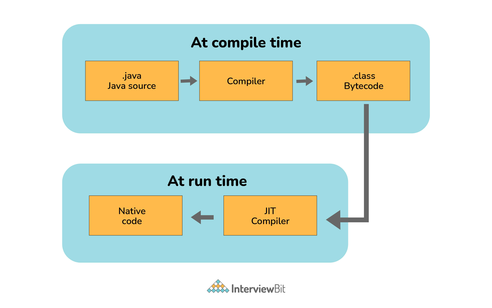

### 7. Sự khác biết giữa phương thức equals() và toán tử == trong Java?

| equals() | == |
|-|-|
| Phương thức khai báo trong lớp, đối tượng | Toán tử nhị phân trong Java |
| Dùng cho kiếm tra so sánh bằng nội dung giữa hai đối tượng theo logic nghiệp vụ cụ thể | Dùng để so sánh địa chỉ (hoặc tham chiếu), tức là kiểm tra xem cả hai đối tượng có trỏ đến cùng một vị trí bộ nhớ hay không |

*Lưu ý*

- Trong trường hợp phương thức `equals` không được ghi đè trong một lớp, thì lớp đó sử dụng cách triển khai mặc định của phương thức `equals` gần với lớp cha nhất.
- Lớp `object` được coi là lớp cha của tất cả các lớp java. Việc triển khai phương thức `equals` trong lớp object sử dụng toán tử `==` để so sánh hai đối tượng. Việc triển khai mặc định này có thể được ghi đè theo logic nghiệp vụ.

### 8. Dùng vòng lặp trong Java thế nào?

- Vòng lặp For:

```java
for(;;)
{
    // Business logic
    // Any break logic
}
```

- Vòng lặp While:

```java
while(true) {
    // Business logic
    // Any break logic
}
```

- Vòng lặp do-while:

```java
do {
    // Business logic
    // Any break logic
} while(true);
```

### 9. Giải thích khái niệm constructor overloading?

Nạp chồng hàm khởi tạo (constructor overloading) là quá trình tạo nhiều hàm khởi tạo có cùng tên nhưng khác các tham số trong lớp. Tùy thuộc vào số lượng tham số và kiểu tương ứng của chúng, việc phân biệt các loại constructor khác nhau được thực hiện bởi trình biên dịch.

```java
class Hospital {
    int variable1, variable2;
    double variable3;
    public Hospital(int doctors, int nurses) {
        variable1 = doctors;
        variable2 = nurses;
    }
    public Hospital(int doctors) {
        variable1 = doctors;
    }
    public Hospital(double salaries) {
        variable3 = salaries
    }
}
```


### 10. Nạp chồng phương thức và ghi đè phương thức trong Java?

Trong Java, việc **nạp chồng phương thức (overloading)** được thực hiện bằng cách đưa các phương thức khác nhau vào cùng một lớp có cùng tên. Tuy nhiên, tất cả các hàm khác nhau về số lượng hoặc kiểu tham số. Nó diễn ra bên trong một lớp và nâng cao khả năng đọc của chương trình.

Sự khác biệt duy nhất trong kiểu trả về của phương thức không thúc đẩy quá trình nạp chồng phương thức. Ví dụ sau đây sẽ cung cấp cho bạn một bức tranh rõ ràng về nó.

```java
class OverloadingHelp {
    public int findarea (int l, int b) {
        int var1;
        var1 = l * b;
        return var1;
    }
    public int findarea (int l, int b, int h) {
        int var2;
        var2 = l * b * h;
        return var2;
    }
}
```

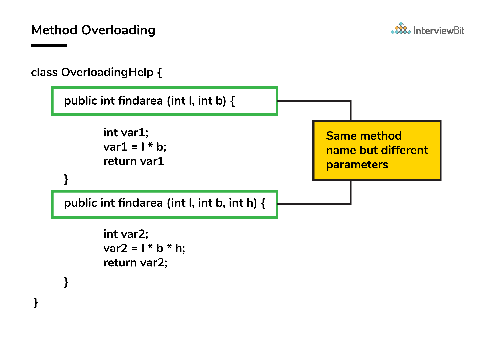

Cả hai hàm có cùng tên nhưng khác nhau về số lượng tham số. Phương pháp đầu tiên tính diện tích hình chữ nhật, trong khi phương pháp thứ hai tính diện tích hình hộp chữ nhật.

**Ghi đè phương thức (override)** là khái niệm trong đó hai phương thức giống nhau hiện diện trong hai lớp khác nhau, trong đó có mối quan hệ kế thừa. Có thể thực hiện một phương thức cụ thể (đã có trong lớp cơ sở) cho lớp dẫn xuất bằng cách sử dụng ghi đè phương thức.

Hãy xem ví dụ này:

```java
class HumanBeing {
    public int walk (int distance, int time) {
        int speed = distance / time;
        return speed;
    }
}
class Athlete extends HumanBeing {
    public int walk(int distance, int time) {
        int speed = distance / time;
        speed = speed * 2;
        return speed;
    }
}
```

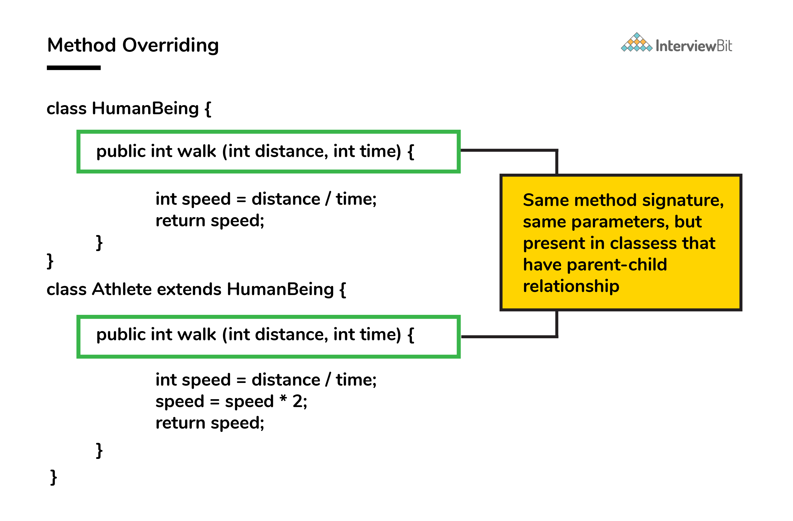

Cả hai phương thức lớp đều có tên `walk` và các tham số: `distance` và `time` giống nhau. Nếu phương thức lớp dẫn xuất được gọi, thì phương thức `walk` của lớp cơ sở sẽ bị ghi đè bởi phương thức của lớp dẫn xuất.

### 11. Một try có thể có nhiều catch trong Java?

Có, nhiều khối catch có thể tồn tại nhưng các phương pháp tiếp cận cụ thể nên ưu tiên hơn cách tiếp cận chung vì khi khối đầu tiên thoả mãn điều kiện catch mới được thực thi. Ví dụ:

```java
public class MultipleCatch {
    public static void main(String args[]) {
        try {
            int n = 1000, x = 0;
            int arr[] = new int[n];
            for (int i = 0; i <= n; i++) {
                arr[i] = i / x;
            }
        }
        catch (ArrayIndexOutOfBoundsException exception) {
            System.out.println("1st block = ArrayIndexOutOfBoundsException");
        }
        catch (ArithmeticException exception) {
            System.out.println("2nd block = ArithmeticException");
        }
        catch (Exception exception) {
            System.out.println("3rd block = Exception");
        }
    }
}
```

Ở đây khối catch thứ hai sẽ được thực thi vì phép chia bởi `0(i/x)`. Trong trường hợp x lớn 0 thì khối catch đầu tiên sẽ thực thi vì vòng lặp chạy đến khi i = n và chỉ số mảng đến n-1.

### 12. Giải thích từ khoá final trong biến, phương thức và lớp?

Trong Java, từ khoá `final` được dùng cho xác định một thứ gì đó là một hằng và không thể chỉnh sửa nữa.

- biến `final`:
    - Khi một biến được khai báo là final trong Java, giá trị không thể chỉnh sửa sau khi gán.
    - Nếu không có bất kỳ giá trị nào được gán cho biến, nó có thể được gán bằng constructor của lớp.
- phương thức `final`:
    - Một phương thức được khai báo là final nó sẽ không thể bị ghi đè bởi lớp con của nó.
    - Một constructor không thể là final vì nếu một lớp được kế thừa thì constructor cũng kế thừa theo. Do đó, khi đánh dấu constructor là final, Java sẽ trả về lỗi - `modifier final not allowed here`
- lớp `final`:
    - Một lớp được khai báo là final thì không có bất kỳ lớp nào có thể kế thừa lớp đó. 

### 13. Các từ khoá final, finally và finalize là giống nhau?

**Final:** dùng cho các lớp, biến hoặc phương thức. Việc kế thừa một lớp final hay ghi đè một phương thức final sẽ bị hạn chế bởi việc sử dụng từ khoá final. Giá trị biến trở thành hằng sau khi dùng từ khoá final. Ví dụ:

```java
final int a=100;
a = 0;  // error
```

**Finally:** Nó là khối hiện diện trong chương trình nơi tất cả code được viết bên trong nó được thực thi kể cả việc xử lý ngoại lệ. Ví dụ:

```java
try {
    int variable = 5;
}
catch (Exception exception) {
    System.out.println("Exception occurred");
}
finally {
    System.out.println("Execution of finally block");
}
```

**Finalize:** Trước khi thu gom rác của một đối tượng, phương thức finalize được gọi để hoạt động dọn dẹp được thực hiện. Ví dụ:

```java
public static void main(String[] args) {
    String example = new String("InterviewBit");
    example = null;
    System.gc(); // Garbage collector called
}
public void finalize() {
    // Finalize called
}
```

### 14. Khi nào dùng từ khoá super?

Từ khoá `super` được dùng để truy cập các trường ẩn và ghi đề phương thức hoặc thuộc tính của lớp cha.
Nó dùng trong các trường hợp sau:
- Truy cập dữ liệu thành viên của lớp cha khi tên thành viên của lớp cha và lớp con giống nhau.
- Để gọi phương thức khởi tạo tham số và mặc định của lớp cha bên trong lớp con.
- Truy cập phương thức lớp cha khi lớp con ghi đè chúng.

Ví dụ:

```java
public class Parent{
    protected int num = 1;
    
    Parent(){
        System.out.println("Parent class default constructor.");
    }
    
    Parent(String x){
        System.out.println("Parent class parameterised constructor.");
    }
    
    public void foo(){
        System.out.println("Parent class foo!");
    }
}
   
public class Child extends Parent{
    private int num = 2;
    
    Child(){
        System.out.println("Child class default Constructor");
        
        super();    // to call default parent constructor
        super("Call Parent");    // to call parameterised constructor.
    }
    
    void printNum(){
        System.out.println(num);
        System.out.println(super.num); //prints the value of num of parent class
    }
    
    @Override
    public void foo(){
        System.out.println("Parent class foo!");
        super.foo();    //Calls foo method of Parent class inside the Overriden foo method of Child class.
    }
}
```

### 15. Các cách tạo đối tượng trong Java?

- Sử dụng từ khoá new:

```java
class ObjectCreationExample{
	String Owner;
}
public class MainClass {
	public static void main(String[] args) {
		// Here we are creating Object of JBT using new keyword
		ObjectCreationExample obj = new ObjectCreationExample();
	}
}
```

- Sử dụng reflection:

```java
class CreateObjectClass {
	static int j = 10;
	CreateObjectClass() {
		i = j++;
	}
	int i;
	@Override
	public String toString() {
		return "Value of i :" + i;
	}
}

class MainClass {
	public static void main(String[] args) {
		try {
			Class cls = Class.forName("CreateObjectClass");
			CreateObjectClass obj = (CreateObjectClass) cls.newInstance();
			CreateObjectClass obj1 = (CreateObjectClass) cls.newInstance();
			System.out.println(obj);
			System.out.println(obj1);
		} catch (ClassNotFoundException e) {
			e.printStackTrace();
		} catch (InstantiationException e) {
			e.printStackTrace();
		} catch (IllegalAccessException e) {
			e.printStackTrace();
		}
	}
}
```

- Sử dụng clone:

```java
 class CreateObjectWithClone implements Cloneable {
	@Override
	protected Object clone() throws CloneNotSupportedException {
		return super.clone();
	}
	int i;
	static int j = 10;
	CreateObjectWithClone() {
		i = j++;
	}
	@Override
	public String toString() {
		return "Value of i :" + i;
	}
}

class MainClass {
	public static void main(String[] args) {
		CreateObjectWithClone obj1 = new CreateObjectWithClone();
		System.out.println(obj1);
		try {
			CreateObjectWithClone obj2 = (CreateObjectWithClone) obj1.clone();
			System.out.println(obj2);
		} catch (CloneNotSupportedException e) {
			e.printStackTrace();
		}
	}
}
```

- Sử dụng ClassLoader:

```java
class CreateObjectWithClassLoader {
	static int j = 10;
	CreateObjectWithClassLoader() {
		i = j++;
	}
	int i;
	@Override
	public String toString() {
		return "Value of i :" + i;
	}
}

public class MainClass {
	public static void main(String[] args) {
		CreateObjectWithClassLoader obj = null;
		try {
			obj = (CreateObjectWithClassLoader) new MainClass().getClass()
					.getClassLoader().loadClass("CreateObjectWithClassLoader").newInstance();
        // Fully qualified classname should be used.
		} catch (InstantiationException e) {
			e.printStackTrace();
		} catch (IllegalAccessException e) {
			e.printStackTrace();
		} catch (ClassNotFoundException e) {
			e.printStackTrace();
		}
		System.out.println(obj);
	}
}
```

### 16. Có thể ghi đè phương thức tĩnh?

Không! Việc khai báo các phương thức tĩnh có cùng một đặc trưng có thể được thực hiện trong lớp con nhưng tính đa hình thời gian chạy không thể diễn ra trong những trường hợp như vậy.

Ghi đè hoặc đa hình động xảy ra trong thời gian chạy, nhưng các phương thức tĩnh được tải và tra cứu thời gian biên dịch một cách tĩnh. Do đó, các phương thức này không thể bị ghi đè.

### 17. Đối tượng chính của bộ dọn rác?

Mục tiêu chính của quá trình này là giải phóng không gian bộ nhớ bị chiếm bởi các đối tượng không cần thiết và không thể truy cập trong quá trình thực thi chương trình Java bằng cách xóa các đối tượng không thể truy cập đó.

Điều này đảm bảo rằng tài nguyên bộ nhớ được sử dụng hiệu quả, nhưng nó không đảm bảo rằng sẽ có đủ bộ nhớ để thực thi chương trình.

### 18. Sự khác biệt giữa bộ nhớ Heap và Stack?

**Heap**

Không gian Java Heap được sử dụng bởi java runtime để cấp phát bộ nhớ cho các đối tượng và các lớp JRE. Bất cứ khi nào chúng ta tạo bất kỳ đối tượng nào, đối tượng đó luôn được tạo trong không gian Heap.

Garbage Collection chạy trên bộ nhớ heap để giải phóng bộ nhớ được sử dụng bởi các đối tượng không có bất kỳ tham chiếu nào. Bất kỳ đối tượng nào được tạo trong không gian heap đều có quyền truy cập toàn cục và có thể được tham chiếu từ bất kỳ đâu của ứng dụng.

**Stack**

Stack trong java là một phần bộ nhớ chứa các phương thức, biến cục bộ và biến tham chiếu. Các biến cục bộ được tạo trong stack.

Bộ nhớ stack luôn được tham chiếu theo trật tự LIFO (Last-In-First-Out). Bất cứ khi nào một phương thức được gọi, một khối mới sẽ được tạo trong bộ nhớ ngăn xếp để phương thức này lưu giữ các giá trị nguyên thủy cục bộ và tham chiếu đến các đối tượng khác trong phương thức.

Ngay sau khi phương thức kết thúc, khối sẽ không được sử dụng và có sẵn cho phương thức tiếp theo. Kích thước bộ nhớ stack nhỏ hơn rất nhiều so với bộ nhớ heap.

**Sự khác biệt**

| Stack | Heap |
|-|-|
| Dùng cho từng bộ phận mỗi khi thực thi một luồng | Ứng dụng thực sử dụng Heap trong thời gian chạy |
| Phụ thuộc vào hệ điều hành và thường nhỏ hơn Heap | Không có giới hạn cụ thể |
| Lưu trữ biến nguyên thuỷ và tham chiếu đến đối tượng được tạo trong Heap | Tất cả đối tượng được tạo đều được lưu ở đây |
| Truy cập sử dụng hệ thống cấp phát bộ nhớ LIFO (Last-in First-out) | Bộ nhớ này được truy cập thông qua các kỹ thuật quản lý bộ nhớ phức tạp bao gồm Young Generation, Old hoặc Tenured Generation, và Permanent Generation |
| Chỉ tồn tại khi phương thức đang chạy | Tồn tại xuyên suốt quá trình chạy ứng dụng |
| Nhanh hơn so với heap | Chậm hơn so với stack |
| Bộ nhớ này được tự động cấp phát và giải phóng khi một phương thức được gọi và trả về tương ứng | Không gian heap được cấp phát khi các đối tượng mới được tạo và giải phóng bởi Garbage Collector khi chúng không còn được tham chiếu |

### 19. Ngoài khía cạnh bảo mật, những lý do đằng sau việc làm cho chuỗi bất biến trong Java là gì?

Một chuỗi sẽ thành bất biến vì những lý do sau đây:

- **String Pool:** Các nhà thiết kế Java đã nhận thấy được rằng trong thực tế kiểu dữ liệu Strung được sử dụng chủ yếu bởi các lập trình viên và nhà phát triển. Vì vậy, họ muốn tối ưu hoá nó bằng cách đưa ra khái niệm String Pool (một vùng lưu trữ trong Java Heap) để lưu trữ các chuỗi ký tự. Họ dự định giảm đối tượng String tạm thời với sự trợ giúp của tính năng chia sẻ. Một lớp bất biến là cần thiết để tạo điều kiện chia sẻ. Việc chia sẻ cấu trúc có thể thay đổi giữa hai bên không xác định là không thể. Do đó, chuỗi trong Java bất biến giúp thực thi khái niệm String Pool.

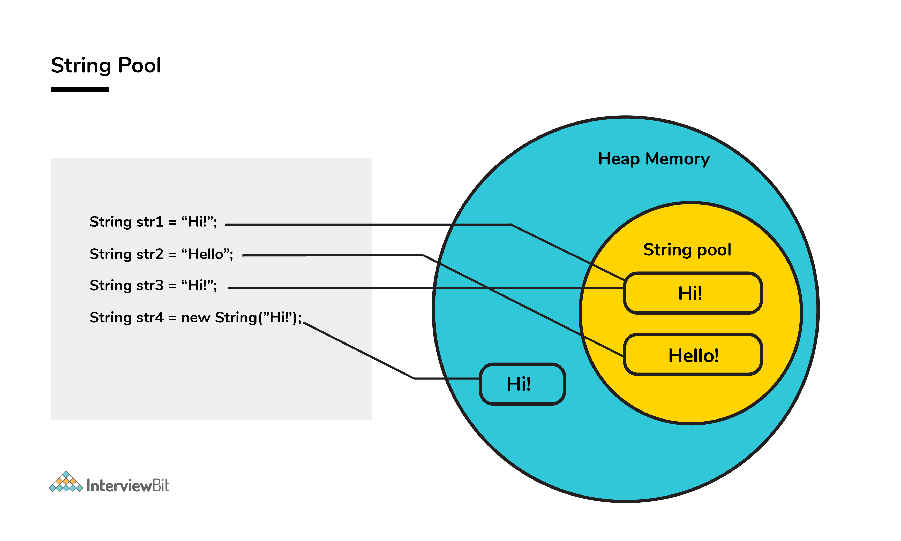

- **Đa luồng:** Sự an toàn của các luồng liên quan đến các đối tượng String là một khía cạnh quan trọng trong Java. Không cần đồng bộ hóa bên ngoài nếu các đối tượng String là bất biến. Do đó, một mã code rõ ràng hơn có thể được viết để chia sẻ các đối tượng String trên các luồng khác nhau. Quá trình phức tạp của đồng thời được hỗ trợ bởi phương pháp này.

- **Collections:** Trong trường hợp Hash Table và Hash Maps, keys sẽ là một đối tượng String. Nếu các đối tượng String không phải là bất biến, thì nó có thể được sửa đổi trong khoảng thời gian nó nằm trong HashMaps. Do đó, không thể truy xuất dữ liệu mong muốn. Những sự thay đổi như vậy tiềm ẩn rất nhiều rủi ro. Vì vậy, sẽ an toàn hơn nếu làm cho chuỗi bất biến.

### 20. Sự khác biệt giữa String, StringBuffer và StringBuilder?

- **Khu vực lưu trữ:** Với String, String Pool đóng vai trò là khu vực lưu trữ. Đối với StringBuilder và StringBuffer, bộ nhớ heap là vùng lưu trữ.
- **Tính thay đổi:** Một String là bất biến, trong khi cả StringBuilder và StringBuffer đều có thể thay đổi.
- **Hiệu quả:** Khá chậm để làm việc với một String. Tuy nhiên, StringBuilder là nhanh nhất trong việc thực hiện các hoạt động. Tốc độ của StringBuffer hơn String và nhỏ hơn StringBuilder. (Ví dụ: thêm một ký tự là nhanh nhất trong StringBuilder và rất chậm trong String vì cần có bộ nhớ mới cho chuỗi mới với ký tự được nối.)
- **Thread-safe:** Trong trường hợp môi trường luồng, StringBuilder và StringBuffer được sử dụng trong khi một String không được sử dụng. Tuy nhiên, StringBuilder phù hợp với môi trường có một luồng duy nhất và StringBuffer phù hợp với đa luồng.

```java
// String
String first = "InterviewBit";
String second = new String("InterviewBit");
// StringBuffer
StringBuffer third = new StringBuffer("InterviewBit");
// StringBuilder
StringBuilder fourth = new StringBuilder("InterviewBit");
```

### 21. Sử dụng các thuộc tính có liên quan làm nổi bật sự khác biệt giữa các interface và các lớp trừu tượng?

- **Phương thức khả dụng:** chỉ phương thức trừu tượng là khả dụng trong interface, trong khi đó các phương thức không phải trừu tượng vẫn có thể có trong lớp trừu tượng.
- **Kiểu biến:** biến static và final chỉ có thể khai báo trong interface, các biến trong lớp trừu tượng không thể là hai kiểu trên.
- **Kế thừa:** đa kế thừa được hỗ trợ trong interface, trong khi các lớp trừu tượng không khuyến khích đa kế thừa.
- **Truy cập dữ liệu thành viên:** mặc định, dữ liệu thành viên của interface là công khai, ngược lại dữ liệu thành viên của lớp trừu tượng là riêng tư.
- **Triển khai:** với lớp trừu tượng có thể triển khai interface dễ dàng, nhưng không thể làm ngược lại.

Ví dụ lớp trừu tượng:

```java
public abstract class Athlete {
    public abstract void walk()
}
```

Ví dụ interface:

```java
public interface Walkable {
    void walk();
}
```

### 22. Trong Java, có thể ghi đè phương thức static cũng như phương thức private không?

Không. Các phương thức static không liên quan đến các đối tượng và các phương thức này thuộc cấp độ lớp. Trong trường hợp của một lớp con, một phương thức static có ký hiệu phương thức giống hệt như của lớp cha có thể tồn tại mà không gây ra bất kỳ lỗi biên dịch nào.

Hiện tượng được đề cập ở đây thường được gọi là phương thức ẩn, và việc ghi đè chắc chắn là không thể. Việc ghi đè phương thức private là không thể xảy ra được vì khả năng hiển thị của phương thức private chỉ bị hạn chế ở lớp cha. Do đó, chỉ có thể tạo điều kiện cho việc ẩn và không thể ghi đè.

### 23. HashSet khác TreeSet như thế nào?

Mặc dù cả HashSet và TreeSet đều không được đồng bộ hóa và đảm bảo rằng không trùng nhưng có một số thuộc tính phân biệt HashSet với TreeSet.
- **Triển khai**: với HashSet, bảng băm được dùng cho lưu trữ phần tử không theo thứ tự. Tuy nhiên, TreeSet dùng cây đỏ đen (red-black tree) cho lưu trữ phần tử theo thứ tự.
- **Hiệu suất/Độ phức tạp**: Với thêm, xem và xoá phần tử độ phức tạp thời gian là `O(1)` cho HashSet. Độ phức tạp thời gian cho hiệu suất tương tự như bit lớn nhất cho TreeSet và bằng `O(logn)`. Tổng thể hiệu suất HashSet nhanh hơn so với TreeSet.
- **Phương thức**: `hashCode()` và `equals()` là phương thức dùng cho HashSet để so sánh giữa các đối tượng. Còn TreeSet dùng các phương thức `compareTo()` và `compare()` để so sánh đối tượng.
- **Kiểu đối tượng**: Các đối tượng không đồng nhất và null có thể được lưu trữ với sự trợ giúp của HashSet. Trong trường hợp TreeSet, **runtime exception** xảy ra trong khi chèn các đối tượng không đồng nhất hoặc đối tượng null.

### 24. Tại sao mảng ký tự được ưu tiên hơn chuỗi để lưu trữ thông tin bí mật?

Trong Java, một chuỗi về cơ bản là bất biến, tức là không thể sửa đổi. Sau khi khai báo, nó tiếp tục ở trong string pool miễn là nó không bị loại bỏ dưới dạng rác. Nói cách khác, một chuỗi nằm trong phần heap của bộ nhớ trong một khoảng thời gian không được kiểm soát và không xác định sau khi quá trình xử lý giá trị chuỗi được thực hiện.

Do đó, thông tin quan trọng có thể bị đánh cắp để thực hiện các hoạt động có hại của hacker nếu chúng bị chúng truy cập bất hợp pháp vào bộ nhớ. Những rủi ro như vậy có thể được loại bỏ bằng cách sử dụng các đối tượng hoặc cấu trúc có thể thay đổi được như mảng ký tự để lưu trữ bất kỳ biến nào. Sau khi công việc của biến mảng ký tự được thực hiện, biến có thể được cấu hình để trống ngay lập tức. Do đó, nó giúp tiết kiệm bộ nhớ heap và cũng không tạo cơ hội cho hacker trích xuất dữ liệu quan trọng.

### 25. Sự khác biệt của JVM, JRE và JDK?

| JDK | JRE | JVM |
|-|-|-|
| Java Development Kit | Java Runtime Enviroment | Java Virtual Machine |
| JDK là một bộ phát triển phần mềm hoàn chỉnh để phát triển các ứng dụng Java. Nó bao gồm JRE, JavaDoc, trình biên dịch, trình gỡ lỗi,... | JRE là một gói phần mềm cung cấp các thư viện lớp Java, JVM và tất cả các thành phần cần thiết để chạy các ứng dụng Java | JVM là một máy ảo, phụ thuộc vào nền tảng, bao gồm 3 thông số kỹ thuật - tài liệu mô tả các yêu cầu triển khai JVM, chương trình máy tính đáp ứng các yêu cầu JVM và đối tượng thực thể để thực thi bytecode Java và cung cấp môi trường thời gian chạy để thực thi |
| JDK chủ yếu được sử dụng để phát triển và thực thi code | JRE chủ yếu được sử dụng để tạo môi trường để thực thi code | JVM cung cấp thông số kỹ thuật cho tất cả các triển khai cho JRE |
| JDK cung cấp các công cụ như trình biên dịch, trình gỡ lỗi, v.v. để phát triển code | JRE cung cấp các thư viện và lớp theo yêu cầu của JVM để chạy chương trình | JVM không bao gồm bất kỳ công cụ nào, nhưng thay vào đó, nó cung cấp đặc điểm kỹ thuật để triển khai |
| JDK = JRE + công cụ phát triển | JRE = JVM + thư viện thực thi ứng dụng | JVM = môi trường thực thi bytecode Java |


### 26. Sự khác biệt giữa HashMap và HashTable trong Java?

| HashMap | HashTable |
|-|-|
| HashMap không được đồng bộ hóa do đó nó tốt hơn cho các ứng dụng không phân luồng | HashTable được đồng bộ hóa và do đó nó phù hợp với các ứng dụng phân luồng |
| Chỉ cho phép một khóa null nhưng bất kỳ giá trị nào cũng có thể null | Không cho phép null trong cả khóa hoặc giá trị |
| Hỗ trợ chèn theo thứ tự bằng cách sử dụng LinkedHashMap lớp con của nó | Chèn theo thứ tự không được đảm bảo trong HashTable |

### 27. Reflection trong Java?

Thuật ngữ `reflection` được sử dụng để mô tả khả năng kiểm tra của một code trên code khác của chính nó hoặc của hệ thống của nó và sửa đổi nó trong thời gian chạy.

Hãy xem xét một ví dụ trong đó chúng ta có một đối tượng không xác định kiểu và chúng ta có một phương thức `fooBar()` mà chúng ta cần gọi trên đối tượng. Hệ thống static typing của Java không cho phép gọi phương thức này trừ khi kiểu đối tượng được biết trước. 
Điều này có thể thực hiện được bằng cách sử dụng reflection, cho phép code quét đối tượng và xác định xem nó có bất kỳ phương thức nào được gọi là `fooBar()` hay không và chỉ gọi phương thức nếu cần.

```java
Method methodOfFoo = fooObject.getClass().getMethod("fooBar", null);
methodOfFoo.invoke(fooObject, null);
```

Sử dụng reflection có các hạn chế sau:
- Tốc độ - Các lệnh gọi phương thức do reflection chậm hơn khoảng ba lần so với các lệnh gọi phương thức trực tiếp.
- An toàn kiểu - Khi một phương thức được gọi nhầm qua tham chiếu của nó bằng cách sử dụng reflection, thì lệnh gọi không thành công trong thời gian chạy vì nó không được phát hiện tại thời gian biên dịch.
- Truy xuất nguồn gốc - Bất cứ khi nào một phương pháp reflection không thành công, rất khó tìm ra nguyên nhân gốc rễ của lỗi này. Người ta phải đi sâu vào phương thức log như `invoke()` và `proxy()` để xác định nguyên nhân gốc rễ.

### 28. Các cách sử dụng luồng?

- **Kế thừa từ lớp Thread**

```java
class InterviewBitThreadExample extends Thread{  
    public void run(){  
        System.out.println("Thread runs...");  
    }  
    public static void main(String args[]){  
        InterviewBitThreadExample ib = new InterviewBitThreadExample();  
        ib.start();  
    }  
}
```

- **Triển khai interface Runnable**

```java
class InterviewBitThreadExample implements Runnable{  
    public void run(){  
        System.out.println("Thread runs...");  
    }  
    public static void main(String args[]){  
        Thread ib = new Thread(new InterviewBitThreadExample()); 
        ib.start();  
    }  
}
```

- Việc triển khai một luồng bằng phương thức của interface Runnable được ưu tiên và thuận lợi hơn vì Java không hỗ trợ kế thừa nhiều lớp.
- Phương thức `start()` được sử dụng để tạo một call stack riêng biệt để thực thi luồng. Khi call stack được tạo, JVM gọi phương thức `run()` để thực thi luồng trong call stack đó.

### 29. Sự khác biệt giữa constructor và phương thức của lớp?

| Constructor | Method |
|-|-|
| Contrustor dùng cho khởi tạo trạng thái đối tượng | Phương thức dùng để lộ hành vi của đối tượng |
| Constructor không có kiểu trả về | Phương thức nên có kiểu trả về, trong trường hợp không trả về thứ gì, sẽ trả về kiểu void |
| Dùng cho gọi nội bộ | Dùng cho gọi đối tượng bên ngoài |
| Nếu constructor không được xác định, constructor mặc định sẽ được cung cấp bởi trình biên dịch Java | Nếu phương thức không được xác định, trình biên dịch không cung cấp gì cả |
| Tên constructor là tên lớp | Tên phương thức có thể là bất cứ tên nào |
| Không thể là final vì bất cứ khi nào lớp được kế thừa thì constructor cũng sẽ được kế thừa. Cố đánh sẽ trả về lỗi `modifier final not allowed here` | Phương thức có thể là final để không bị ghi đè ở lớp con |
| Biến final có thể ở trong construcor để áp dụng lên toàn lớp và đối tượng của nó | Biến final nếu được tạo trong phương thức đảm bảo rằng biến không thể bị thay đổi trong phạm vị phương thức đó |

### 30. Truyền giá trị và truyền tham chiếu trong Java?

Java luôn hoạt động "truyền giá trị", không có gì được gọi là "truyền qua tham chiếu" trong Java. Tuy nhiên, khi đối tượng được truyền trong bất kỳ phương thức nào, địa chỉ của giá trị sẽ được truyền do bản chất của việc xử lý đối tượng trong Java. Khi một đối tượng được truyền, một bản sao của tham chiếu sẽ được tạo bởi Java và nó được chuyển cho phương thức. Các đối tượng trỏ đến cùng một vị trí bộ nhớ. 2 trường hợp có thể xảy ra bên trong phương thức:
- **Trường hợp 1 - Khi đối tượng được trỏ đến một vị trí khác:** Trong trường hợp này, các thay đổi được thực hiện đối với đối tượng đó không được phản ánh lên đối tượng ban đầu trước khi nó được chuyển tới phương thức vì tham chiếu trỏ đến vị trí khác.

```java
class InterviewBitTest{
    int num;
    InterviewBitTest(int x){ 
        num = x; 
    }
    InterviewBitTest(){ 
        num = 0; 
    }
}
class Driver {
    public static void main(String[] args)
    {
        //create a reference
        InterviewBitTest ibTestObj = new InterviewBitTest(20);
        //Pass the reference to updateObject Method
        updateObject(ibTestObj);
        //After the updateObject is executed, check for the value of num in the object.
        System.out.println(ibTestObj.num);
    }
    public static void updateObject(InterviewBitTest ibObj)
    {
        // Point the object to new reference
        ibObj = new InterviewBitTest();
        // Update the value 
        ibObj.num = 50;
    }
}
// Output: 20
```

- **Trường hợp 2 - Khi tham chiếu đối tượng không được sửa đổi:** Trong trường hợp này, vì chúng ta có bản sao của tham chiếu đối tượng chính trỏ đến cùng một vị trí bộ nhớ, bất kỳ thay đổi nào trong nội dung của đối tượng sẽ được phản ánh trong đối tượng ban đầu.

```java
class InterviewBitTest{
    int num;
    InterviewBitTest(int x){ 
        num = x; 
    }
    InterviewBitTest(){ 
        num = 0; 
    }
}
class Driver{
    public static void main(String[] args)
    {
        //create a reference
        InterviewBitTest ibTestObj = new InterviewBitTest(20);
        //Pass the reference to updateObject Method
        updateObject(ibTestObj);
        //After the updateObject is executed, check for the value of num in the object.
        System.out.println(ibTestObj.num);
    }
    public static void updateObject(InterviewBitTest ibObj)
    {
        // no changes are made to point the ibObj to new location
        // Update the value of num
        ibObj.num = 50;
    }
}
// Output: 50
```

### 31. Giữa String và StringBuffer cái nào nên được ưu tiên hơn khi có rất nhiều cập nhật cần được thực hiện trong dữ liệu?

Về bản chất StringBuffer là động và có thể thay đổi trong khi String là bất biến. Mỗi lần cập nhật/sửa đổi String sẽ tạo ra một String mới do đó làm quá tải String Pool với các đối tượng không cần thiết. Do đó, trong trường hợp có nhiều bản cập nhật, người ta luôn ưu tiên sử dụng StringBuffer vì nó sẽ giảm chi phí tạo nhiều đối tượng String trong String Pool.

### 32. Sự khác biệt giữa biến transient và volatile trong Java?

**Transient**: Bộ chỉnh sửa transient báo cho hệ thống con loại trừ các trường khi serialize một thực thể của lớp. Đối tượng sau đó được deserialized, trường sẽ được khởi tạo thành giá trị mặc định; tức là null cho một kiểu tham chiếu và 0 hoặc false cho một kiểu nguyên thủy.

```java
public transient int limit = 55;   // will not persist
public int b;   // will persist
```

**Volatile**: Bộ chỉnh sửa volatile cho JVM biết rằng việc ghi vào trường phải luôn được chuyển đồng bộ vào bộ nhớ và các lần đọc của trường phải luôn được đọc từ bộ nhớ. Điều này có nghĩa là các trường được đánh dấu là volatile có thể được truy cập và cập nhật một cách an toàn trong một ứng dụng đa luồng mà không cần sử dụng đồng bộ hóa dựa trên thư viện chuẩn.

```java
public class MyRunnable implements Runnable {
    private volatile boolean active;
    public void run() {
        active = true;
        while (active) {    
        }
    }
    public void stop() {
        active = false;  
    }
}
```

### 33. Hệ thống phân cấp của lớp Java Exception?

Ngoại lệ (exception) là một sự kiện lỗi có thể xảy ra trong quá trình thực thi một chương trình và làm gián đoạn quy trình bình thường của nó.

#### Các kiểu ngoại lệ của Java

- **Checked Exception**: Các lớp kế thừa trực tiếp `Throwable class` ngoại trừ RuntimeException và Error được gọi là checked exception, ví dụ: IOException, SQLException,... Các checked exception được kiểm tra tại thời điểm biên dịch.
- **Unchecked Exception**: Các lớp kế thừa `RuntimeException` được gọi là unchecked exception, ví dụ: ArithmeticException, NullPointerException, ArrayIndexOutOfBoundsException, ... Các unchecked exception không được kiểm tra tại thời điểm biên dịch, nhưng chúng được kiểm tra trong thời gian chạy.
- **Error**: Lỗi không thể khôi phục được, ví dụ: OutOfMemoryError, VirtualMachineError, AssertionError, v.v.

#### Hệ thống phân cấp của các lớp Java Exception

Lớp `java.lang.Throwable` là lớp gốc của hệ thống phân cấp Java Exception được kế thừa bởi hai lớp con: Exception và Error.


Ví dụ

```java
import java.io.FileInputStream;
import java.io.FileNotFoundException;
import java.io.IOException;
import java.io.InputStream;

public class CustomExceptionExample {

	public static void main(String[] args) throws MyException {
		try {
			processFile("file.txt");
		} catch (MyException e) {
			processErrorCodes(e);
		}
	}

	private static void processErrorCodes(MyException e) throws MyException {
		switch(e.getErrorCode()){
		  case "BAD_FILE_TYPE":
			 System.out.println("Bad File Type, notify user");
			 throw e;
		  case "FILE_NOT_FOUND_EXCEPTION":
			 System.out.println("File Not Found, notify user");
			 throw e;
		  case "FILE_CLOSE_EXCEPTION":
			 System.out.println("File Close failed, just log it.");
			 break;
		  default:
			 System.out.println("Unknown exception occured," +e.getMessage());
			 e.printStackTrace();
		}
	}

	private static void processFile(String file) throws MyException {		
		InputStream fis = null;
		try {
			fis = new FileInputStream(file);
		} catch (FileNotFoundException e) {
			throw new MyException(e.getMessage(),"FILE_NOT_FOUND_EXCEPTION");
		} finally {
			try {
				if(fis !=null) fis.close();
			} catch (IOException e) {
				throw new MyException(e.getMessage(),"FILE_CLOSE_EXCEPTION");
			}
		}
	}
}
```

### 34. Sự khác biệt giữa Error và Exception?

| Error | Exception |
|-|-|
| Xảy ra do thiếu tài nguyên hệ thống | Xảy ra do code |
| Không thể phục hồi | Có thể phục hồi |
| Không thể xử lý bằng code | Có thể xử lý bằng `try`, `catch` và `throw` |
| Khi lỗi được phát hiện, chương trình sẽ kết thúc bất thường | Khi ngoại lệ được phát hiện, nó có thể được xử lý bằng `throw` và `catch` tương ứng |
| Là kiểu không được kiểm tra | Có thể là kiểu kiểm tra và không được kiểm tra |
| Được khai báo trong `java.lang.Error`| Được khai báo trong `java.lang.Exception` |
| OutOfMemory, StackOverFlow | Checked Exceptions: NoSuchMethod, ClassNotFound.Unchecked Exceptions: NullPointer, IndexOutOfBounds |

### 35. Cách thực hiện Object Cloning trong Java?

Object Cloning là quá trình tạo ra một bản sao chính xác của bất kỳ đối tượng nào. Để thực hiện điều này, một lớp java phải triển khai interface `Cloneable` của package `java.lang` và ghi đè phương thức `clone()` được cung cấp bởi lớp Object theo cú pháp của nó là:

```java
protected Object clone() throws CloneNotSupportedException {
    return (Object)super.clone();
}
```

Trong trường hợp Cloneable không được triển khai và chỉ có phương thức bị ghi đè thì Java trả về lỗi `CloneNotSupportedException`.

### 36. Làm thế nào để một ngoại lệ lan truyền trong code?

Khi một ngoại lệ xảy ra, trước tiên nó tìm kiếm để xác định vị trí khối `catch` phù hợp. Trong trường hợp, khối `catch` phù hợp được định vị, thì khối đó sẽ được thực thi. Ngược lại, ngoại lệ truyền thông qua phương thức callstack và đi vào phương thức caller, nơi quá trình `catch` phù hợp được thực hiện. Sự lan truyền này xảy ra cho đến khi tìm thấy khối `catch` phù hợp. Nếu không tìm thấy kết quả phù hợp, thì chương trình sẽ bị kết thúc trong phương thức `main`.

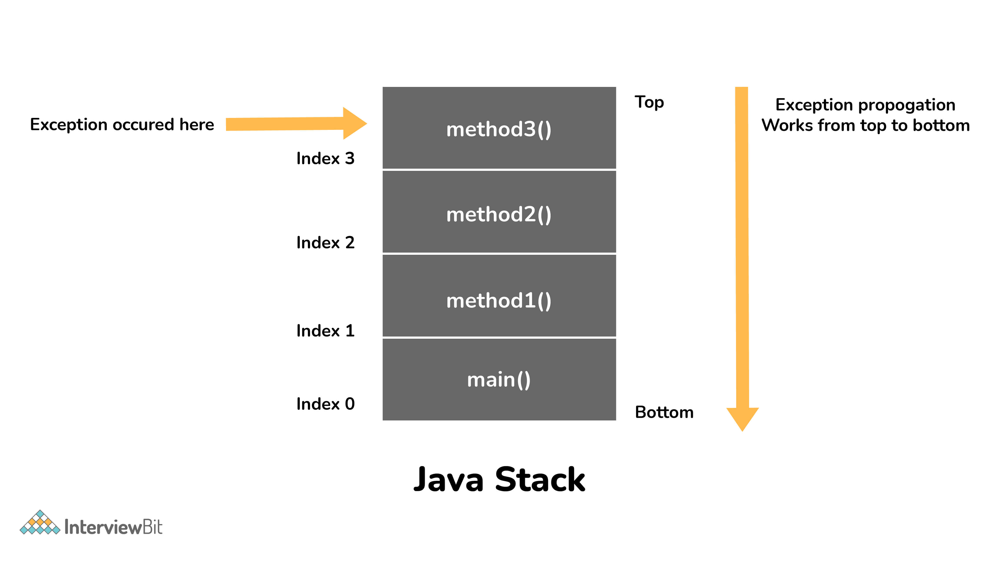

### 37. Có bắt buộc sử dụng catch sau try không?

Không, không nhất thiết khối `catch` phải hiện diện sau khối `try`. Khối `try` nên được theo sau bởi khối `catch` hoặc khối `finally`. Nếu khả năng ngoại lệ nhiều hơn, thì chúng nên được khai báo bằng mệnh đề `throw` của phương thức.

### 38. Liệu khối finally có được thực thi khi câu lệnh return được viết ở cuối khối try và khối catch ở như dưới đây không?

```java
public int someMethod(int i) {
    try {
        //some statement
        return 1;
    } catch(Exception e) {
        //some statement
        return 999;
    } finally {
        //finally block statements
    }
}
```

Khối `finally` sẽ được thực thi bất kể ngoại lệ hay không. Trường hợp duy nhất mà khối `finally` không được thực thi là khi nó gặp phương thức `System.exit()` ở bất kỳ đâu trong khối try/catch.

### 39. Có thể gọi một constructor của một lớp bên trong một constructor khác không?

Có, khái niệm này có thể được gọi là chuỗi constructor và có thể thực hiện được bằng cách sử dụng `this()`.

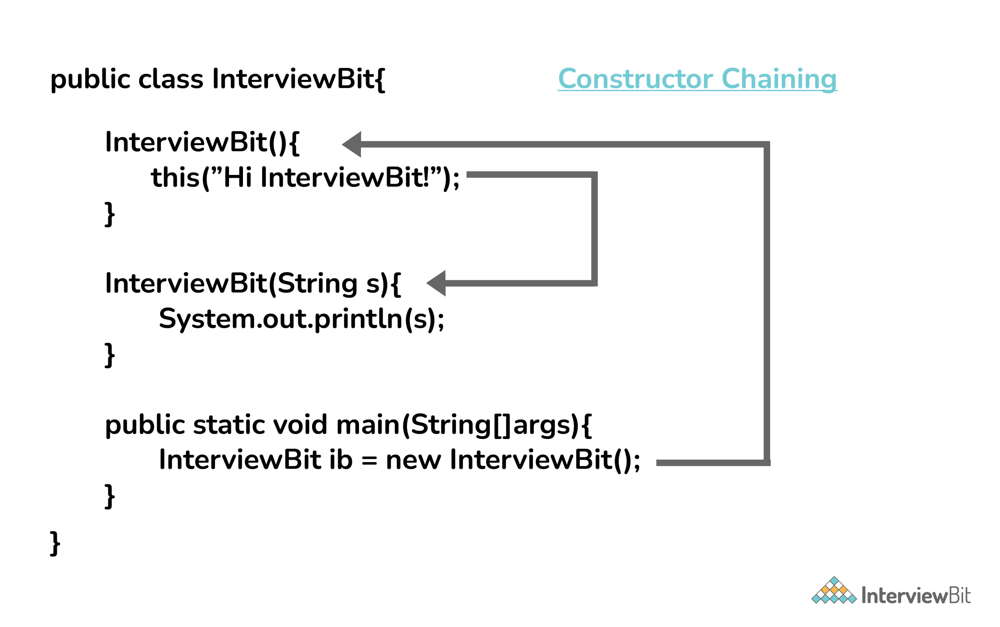

### 40. Các vị trí bộ nhớ liền nhau thường được sử dụng để lưu trữ các giá trị thực tế trong một mảng nhưng không phải trong ArrayList. Giải thích?

Trong trường hợp của ArrayList, việc lưu trữ dữ liệu dưới dạng các kiểu dữ liệu nguyên thủy (như int, float, ...) là không thể. Các thành viên/đối tượng dữ liệu có trong ArrayList có tham chiếu đến các đối tượng nằm ở các vị trí khác nhau trong bộ nhớ. Do đó, việc lưu trữ các đối tượng thực tế hoặc các kiểu dữ liệu không nguyên thủy (như Integer, Double,...) diễn ra ở các vị trí bộ nhớ khác nhau.

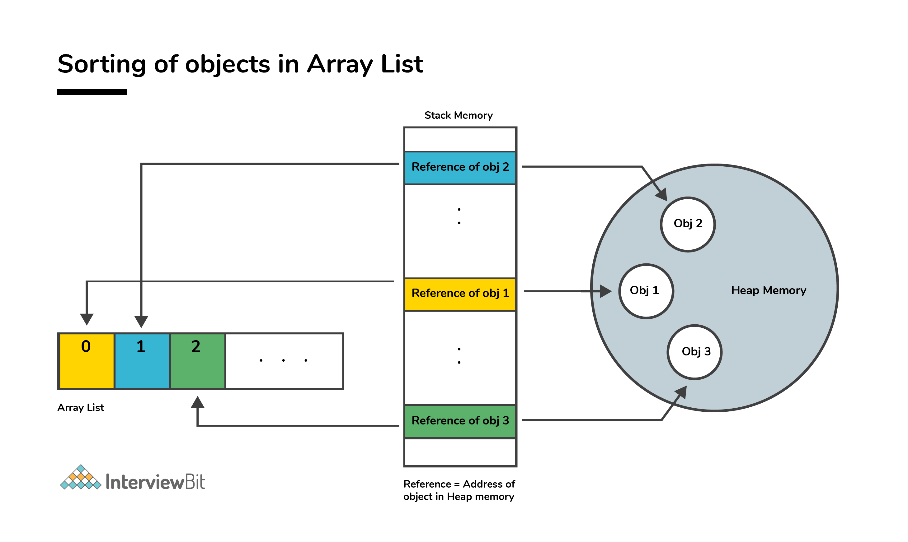

Tuy nhiên, điều tương tự không áp dụng cho các mảng. Đối tượng hoặc giá trị kiểu nguyên thủy có thể được lưu trữ trong mảng ở các vị trí bộ nhớ liền nhau, do đó mọi phần tử không yêu cầu bất kỳ tham chiếu nào đến phần tử tiếp theo.

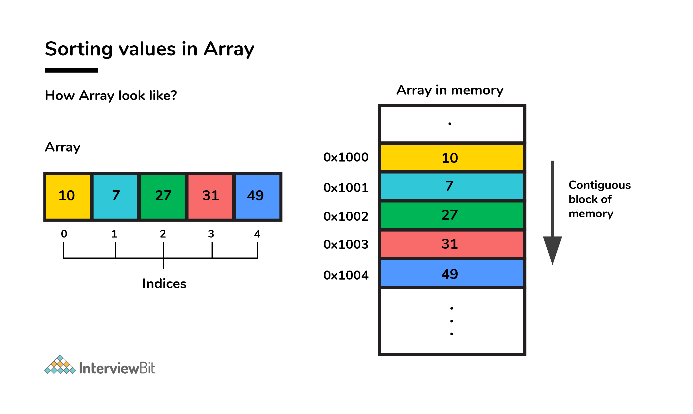

## Câu hỏi phỏng vấn Java cho Experienced

### 41. Mặc dù kế thừa là một khái niệm OOPs phổ biến, nhưng nó kém lợi thế hơn so với composition. Giải thích?

Kế thừa chậm hơn composition trong các trường hợp sau:

- Đa kế thừa không thể thực hiện được trong Java. Các lớp chỉ có thể kế thừa từ một lớp cha. Trong trường hợp yêu cầu nhiều chức năng, ví dụ - để đọc và ghi thông tin vào file, thì composition sẽ được ưu tiên hơn. Người viết, cũng như các chức năng của người đọc, có thể được sử dụng bằng cách coi họ như những thành viên riêng tư.
- Composition hỗ trợ đạt được tính linh hoạt cao và ngăn chặn việc phá vỡ đóng gói.
- Unit test có thể thực hiện được với composition chứ không phải kế thừa. Khi một nhà phát triển muốn kiểm tra một lớp tạo ra một lớp khác, thì Đối tượng Mock có thể được tạo để biểu thị lớp đã compose để tạo điều kiện cho quá trình test. Kỹ thuật này không thể thực hiện được với kế thừa vì lớp dẫn xuất không thể được kiểm tra nếu không có sự trợ giúp của lớp cha trong kế thừa.
- Bản chất kết hợp lỏng lẻo của composition được ưu tiên hơn bản chất kết hợp chặt chẽ của sự kế thừa.

Hãy lấy một ví dụ:

```java
package comparison;

public class Top {
    public int start() {
        return 0;
    }
}
class Bottom extends Top {
    public int stop() {
        return 0;
    }
}
```

Trong đoạn code trên ta thực hiện kế thừa. Bây giờ khi ta chỉnh sửa lớp `Top`:

```java
public class Top {
    public int start() {
        return 0;
    }
    public void stop() {
    }
}
```

Nếu việc triển khai mới của lớp Top được tuân theo, **compile-time error** xảy ra trong lớp Bottom. Loại trả về không tương thích cho hàm `Top.stop()`. Các thay đổi phải được thực hiện đối với lớp Top cùng hoặc Bottom cùng để đảm bảo tính tương thích. Tuy nhiên, kỹ thuật composition có thể được sử dụng để giải quyết vấn đề đã cho:

```java
class Bottom {
    Top par = new Top();
    public int stop() {
        par.start();
        par.stop();
        return 0;
    }
}
```

### 42. Tạo chuỗi với new() khác với cách dùng ký tự như thể nào?

Khi một String được hình thành dưới dạng một ký tự với sự hỗ trợ của toán tử gán, nó sẽ đi vào String Pool để có thể diễn ra quá trình String Interning. Cùng một đối tượng trong heap này sẽ được tham chiếu bởi một String khác nếu nội dung giống nhau cho cả hai.

```java
public bool checking() {
    String first = "InterviewBit";
    String second = "InterviewBit";
    if (first == second)
        return true;
    else
        return false;
}
```

Hàm `checking()` sẽ trả về true vì cùng nội dung được tham chiếu bởi hai biến.

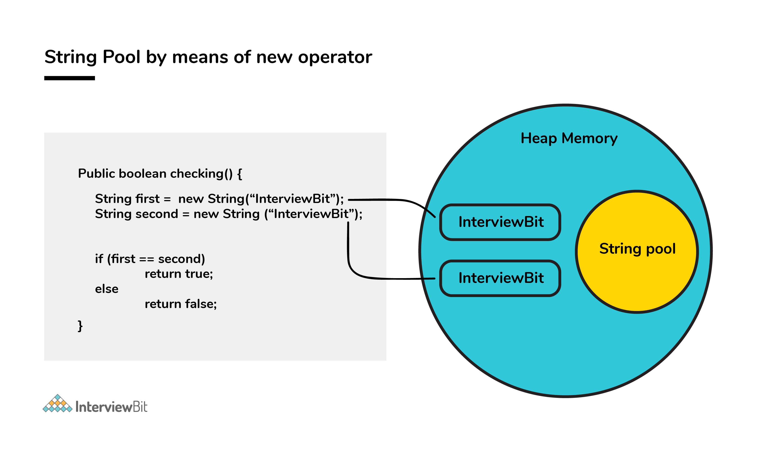

Ngược lại, khi tạo chuỗi diễn ra với sự trợ giúp của toán tử `new()`, quá trình thực thi sẽ không diễn ra. Đối tượng được tạo trong bộ nhớ heap ngay cả khi có cùng một đối tượng nội dung.

```java
public bool checking() {
    String first = new String("InterviewBit");
    String second = new String("InterviewBit");
    if (first == second)
        return true;
    else
        return false;
}
```

Hàm `checking()` sẽ trả về false vì cùng nội dung không được tham chiếu bởi hai biến.

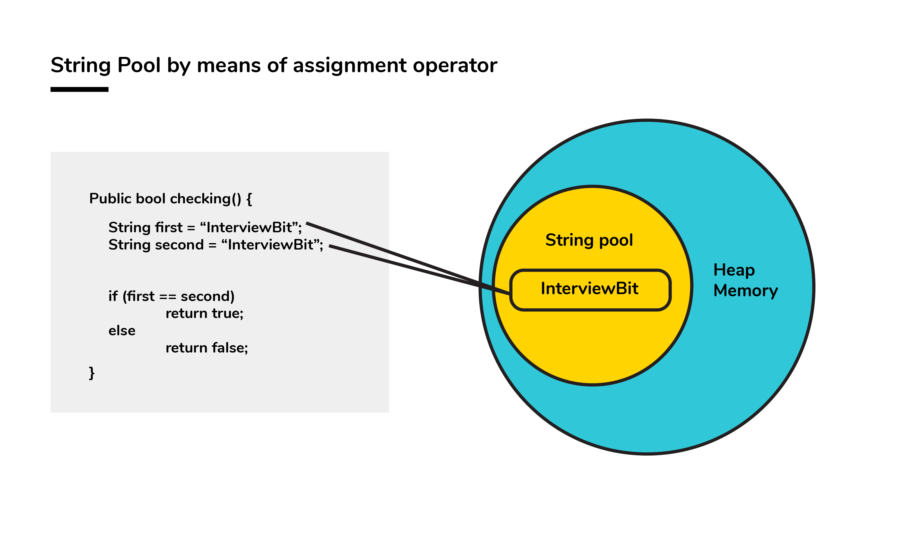

### 43. Có thể vượt quá giới hạn bộ nhớ trong một chương trình mặc dù có bộ thu gom rác không?

Có, chương trình có thể hết bộ nhớ bất chấp sự hiện diện của bộ thu gom rác. Tính năng thu gom rác hỗ trợ nhận dạng và loại bỏ những đối tượng không cần thiết trong chương trình nữa, để giải phóng tài nguyên được sử dụng bởi chúng.

Trong một chương trình, nếu một đối tượng không thể truy cập được, thì việc thực hiện thu gom rác sẽ diễn ra đối với đối tượng đó. Nếu dung lượng bộ nhớ cần thiết để tạo một đối tượng mới không đủ, thì bộ nhớ sẽ được giải phóng cho những đối tượng không còn trong phạm vi với sự trợ giúp của bộ thu gom rác. Chương trình bị vượt quá giới hạn bộ nhớ khi bộ nhớ được giải phóng không đủ để tạo các đối tượng mới.

Hơn nữa, việc cạn kiệt bộ nhớ heap diễn ra nếu các đối tượng được tạo theo cách mà chúng vẫn nằm trong phạm vi và sử dụng bộ nhớ. Nhà phát triển phải đảm bảo bỏ qua đối tượng sau khi công việc của nó hoàn thành. Mặc dù bộ thu gom rác cố gắng ở mức tốt nhất để lấy lại bộ nhớ nhiều nhất có thể, giới hạn bộ nhớ vẫn có thể bị vượt quá.

Hãy xem ví dụ sau:

```java
List<String> example = new LinkedList<String>();
while(true){
    example.add(new String("Memory Limit Exceeded"));
}
```

### 44. Đồng bộ hoá trong Java?

Có thể thực hiện đồng thời các tiến trình khác nhau bằng cách đồng bộ hóa. Khi một tài nguyên cụ thể được chia sẻ giữa nhiều luồng, các tình huống có thể phát sinh trong đó nhiều luồng yêu cầu cùng một tài nguyên được chia sẻ.

Đồng bộ hóa hỗ trợ giải quyết sự cố và tài nguyên được chia sẻ bởi một luồng duy nhất tại một thời điểm. Hãy lấy một ví dụ để hiểu rõ ràng hơn. Ví dụ: bạn có một URL và bạn phải tìm ra số lượng yêu cầu được thực hiện đối với nó. Hai yêu cầu đồng thời có thể làm cho số lượng thất thường.

Không đồng bộ hóa:

```java
package anonymous;
public class Counting {
    private int increase_counter;
    public int increase() {
        increase_counter = increase_counter + 1;
        return increase_counter;
    }
}
```

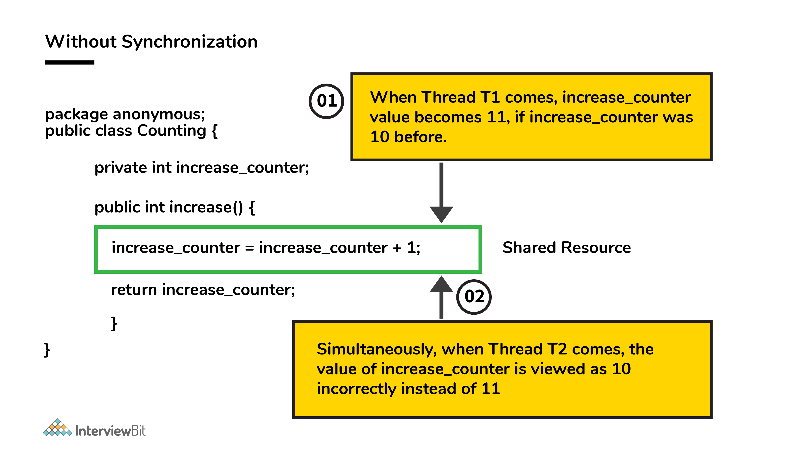

Nếu một luồng `Thread1` đếm là 10, nó sẽ được tăng lên 1 thành 11. Đồng thời, nếu một luồng khác `Thread2` đếm là 10, thì nó cũng sẽ được tăng từ 1 lên 11. Do đó, sự không nhất quán trong các giá trị đếm xảy ra do giá trị cuối cùng dự kiến là 12 nhưng giá trị cuối cùng thực tế mà chúng tôi nhận được sẽ là 11.

Bây giờ, hàm `increase()` được đồng bộ hóa để không thể truy cập đồng thời.

Với sự đồng bộ hóa:

```java
package anonymous;
public class Counting {
    private int increase_counter;
    public synchronized int increase() {
        increase_counter = increase_counter + 1;
        return increase_counter;
    }
}
```

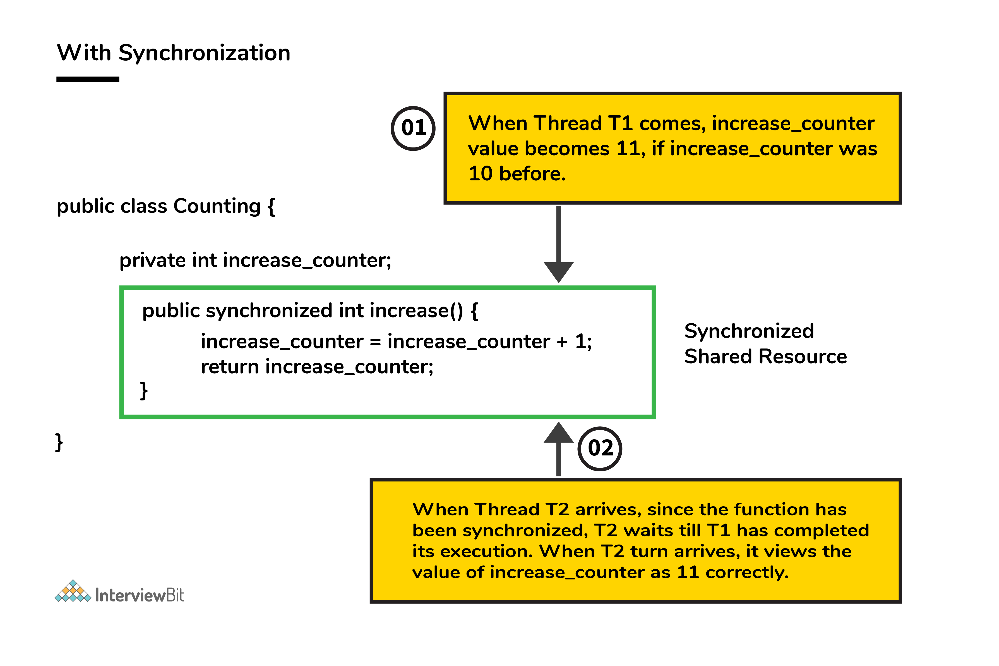

Nếu một luồng `Thread1` đếm là 10, nó sẽ được tăng lên từ 1 đến 11, sau đó luồng `Thread2` sẽ lấy số đếm là 11, nó sẽ được tăng lên 1 thành 12. Do đó, sự nhất quán trong các giá trị số đếm diễn ra.

### 45. Cho đoạn code bên dưới, ký hiệu ... là gì?

```java
public void fooBarMethod(String... variables){
   // method code
}
```

- Khả năng cung cấp ... là một tính năng được gọi là varargs (đối số biến) được giới thiệu ở Java 5.
- Hàm có ... trong ví dụ trên chỉ ra rằng nó có thể nhận nhiều đối số của chuỗi kiểu dữ liệu.
- Ví dụ: `fooBarMethod` có thể được gọi theo nhiều cách và chúng ta vẫn có thể có một phương pháp để xử lý dữ liệu như bên dưới đây:

```java
fooBarMethod("foo", "bar");
fooBarMethod("foo", "bar", "boo");
fooBarMethod(new String[]{"foo", "var", "boo"});
public void myMethod(String... variables){
    for(String variable : variables){
        // business logic
    }
}
```

### 46. Vòng đời của luồng Java?

- **New** - Khi thực thể của luồng được tạo và phương thức `start()` chưa được gọi, luồng được coi là còn sống và do đó ở trạng thái NEW.
- **Runnable** - Khi phương thức `start()` được gọi, trước khi phương thức `run()` được gọi bởi JVM, luồng được cho là ở trạng thái RUNNABLE (sẵn sàng chạy). Trạng thái này cũng có thể được nhập từ trạng thái Waiting hoặc Sleeping của luồng.
- **Running** - Khi phương thức `run()` được gọi và luồng bắt đầu thực thi, luồng được cho là đang ở trạng thái RUNNING.
- **Non-Runnable (Blocked/Waiting)** - Khi luồng không thể chạy mặc dù thực tế là vẫn còn tồn tại, thì luồng được cho là ở trạng thái NON-RUNNABLE được. Lý tưởng nhất là sau một thời gian tồn tại, luồng sẽ chuyển sang trạng thái có thể chạy được.
    + Một luồng được cho là ở trạng thái Blocked nếu nó muốn nhập code được đồng bộ hóa nhưng không thể thực hiện được vì một luồng khác đang hoạt động trong khối được đồng bộ hóa đó trên cùng một đối tượng. Luồng đầu tiên phải đợi cho đến khi luồng khác thoát khỏi khối được đồng bộ hóa.
    + Một luồng được cho là ở trạng thái Waiting nếu nó đang đợi tín hiệu thực thi từ một luồng khác, tức là nó chờ hoạt động cho đến khi nhận được tín hiệu.
- **Terminated** - Khi quá trình thực thi phương thức `run()` hoàn tất, luồng được cho là đi vào bước TERMINATED và được coi là không còn tồn tại.

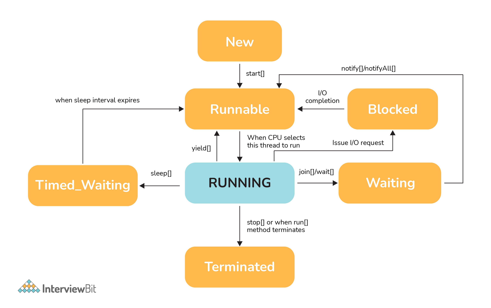

### 47. Điều gì có thể cân bằng giữa việc sử dụng một mảng không có thứ tự so với việc sử dụng một mảng có thứ tự?

- Ưu điểm chính của việc có một mảng có thứ tự là giảm độ phức tạp thời gian tìm kiếm của `O(log n)` trong khi độ phức tạp thời gian trong một mảng không có thứ tự là `O(n)`.
- Hạn chế chính của mảng có thứ tự là thời gian chèn tăng lên của nó là `O(n)` do phần tử của nó phải được sắp xếp lại để duy trì thứ tự của mảng trong mỗi lần chèn trong khi độ phức tạp về thời gian trong mảng không có thứ tự chỉ là `O(1)`.
- Xem xét 2 điểm chính trên và tùy thuộc vào trường hợp mà nhà phát triển yêu cầu, cấu trúc dữ liệu thích hợp có thể được sử dụng để thực hiện.

### 48. Có thể import cùng một lớp hoặc ơackage hai lần trong Java không và điều gì xảy ra với nó trong thời gian chạy?

Có thể import một lớp hoặc package nhiều hơn một lần, tuy nhiên, điều đó là dư thừa vì JVM tải nội bộ package hoặc lớp chỉ một lần.

### 49. Sự khác biệt giữa Inner Class và Sub Class?

Lớp bên trong lồng nhau (Inner Class) có thể truy cập bất kỳ biến thực thể riêng tư nào của lớp bên ngoài. Giống như bất kỳ biến thực thể nào khác, chúng ta có thể có bộ sửa đổi truy cập là private, protected, public và default modifier.

```java
class Outer { 
    class Inner { 
        public void show() { 
            System.out.println("In a nested class method"); 
        } 
    } 
} 
class Main { 
    public static void main(String[] args) { 
        Outer.Inner in = new Outer().new Inner(); 
        in.show(); 
    } 
}
```

Lớp con (subclass) là lớp kế thừa phương thức hoặc thuộc tính từ lớp cha.

```java
class Car {
    //...
}
 
class HybridCar extends Car {
    //...
}
```

### 50. Các kiểu tham chiếu trong Java?

Trong Java có 4 kiểu tham chiếu được phân biệt theo cách chúng bị thu gom rác.

* Strong References - tham chiếu mạnh
* Weak References - tham chiếu yếu
* Soft References - tham chiếu mềm
* Phantom References - tham chiếu ảo

- **Strong References:** Đây là kiểu/lớp mặc định của đối tượng tham chiếu. Bất kỳ đối tượng nào có tham chiếu mạnh đang hoạt động đều không đủ điều kiện để thu gom rác. Đối tượng chỉ được thu gom khi biến được tham chiếu mạnh trỏ tới null.

```java
MyClass obj = new MyClass();
```

- **Weak References:** không phải là kiểu/lớp mặc định của đối tượng tham chiếu và chúng phải được chỉ định rõ ràng khi sử dụng chúng. 

```java
//Java Code to illustrate Weak reference 
import java.lang.ref.WeakReference; 
class MainClass 
{ 
    public void message() { 
        System.out.println("Weak References Example"); 
    } 
} 
  
public class Example 
{ 
    public static void main(String[] args) { 
        // Strong Reference 
        MainClass g = new MainClass();    
        g.message(); 
          
        // Creating Weak Reference to MainClass-type object to which 'g'  
        // is also pointing. 
        WeakReference<MainClass> weakref = new WeakReference<MainClass>(g); 
        g = null;  
        g = weakref.get();  
        g.message(); 
    } 
}
```

- **Sort References:** Trong tham chiếu mềm, ngay cả khi đối tượng được giải phóng để thu gom rác thì chúng cũng không được thu thập, cho đến khi JVM cần bộ nhớ. Các đối tượng sẽ bị xóa khỏi bộ nhớ khi JVM hết bộ nhớ. Để tạo các tham chiếu như vậy, lớp `java.lang.ref.SoftReference` được sử dụng.

```java
//Java Code to illustrate Weak reference 
import java.lang.ref.SoftReference; 
class MainClass 
{ 
    public void message() { 
        System.out.println("Weak References Example"); 
    } 
} 
  
public class Example 
{ 
    public static void main(String[] args) { 
        // Strong Reference 
        MainClass g = new MainClass();    
        g.message(); 
          
        // Creating Weak Reference to MainClass-type object to which 'g'  
        // is also pointing. 
        SoftReference<MainClass> softref = new SoftReference<MainClass>(g); 
        g = null;  
        g = softref.get();  
        g.message(); 
    } 
} 
```

- **Phantom References:** Các đối tượng đang được tham chiếu bởi tham chiếu ảo đủ điều kiện để thu gom rác. Tuy nhiên, trước khi xóa chúng khỏi bộ nhớ, JVM đặt chúng vào một hàng đợi gọi là "hàng đợi tham chiếu". Chúng được đặt trong một hàng đợi tham chiếu sau khi gọi phương thức `finalize()` trên chúng. Để tạo các tham chiếu như vậy, lớp `java.lang.ref.PhantomReference` được sử dụng.

```java
//Java Code to illustrate Weak reference 
import java.lang.ref.*; 
class MainClass 
{ 
    public void message() { 
        System.out.println("Phantom References Example"); 
    } 
} 
  
public class Example 
{ 
    public static void main(String[] args) { 
        // Strong Reference 
        MainClass g = new MainClass();    
        g.message(); 
          
        // Creating Phantom Reference to MainClass-type object to which 'g'  
        // is also pointing. 
        PhantomReference<MainClass> phantomRef = null; 
        phantomRef = new PhantomReference<MainClass>(g,refQueue); 
        g = null; 
        g = phantomRef.get();  
        g.message(); 
    } 
}
```

### 51. Marker interface trong Java là gì?

Marker interface, còn được gọi là interface gắn thẻ là những interface không có phương thức và hằng số được xác định trong chúng. Chúng ở đó để giúp trình biên dịch và JVM lấy thông tin liên quan đến thời gian chạy liên quan đến các đối tượng.

Cú pháp:

```java
public interface Interface_Name {

}
```

Ví dụ:

```java
/**
* Java program to illustrate Maker Interface 
*
**/
interface Marker {    }

class A implements Marker {
    //do some task
}

class Main {
    public static void main(String[] args) {
        A obj = new A();
        if (obj instanceOf Marker){
            // do some task
        }
    }
}
```

### 52. Giải thích "Double Brace Initialisation" trong Java?

Đây là một phương tiện thuận tiện để khởi tạo bất kỳ tập hợp nào trong Java. Hãy xem xét ví dụ dưới đây.

```java
import java.util.HashSet;
import java.util.Set;
 
public class IBDoubleBraceDemo{
    public static void main(String[] args){
        Set<String> stringSets = new HashSet<String>()
        {
            {
                add("set1");
                add("set2");
                add("set3");
            }
        };
    
        doSomething(stringSets);
    }
    
    private static void doSomething(Set<String> stringSets){
        System.out.println(stringSets);
    }
}
```

Trong ví dụ trên, chúng ta thấy rằng `stringSets` được khởi tạo bằng cách sử dụng cặp dấu ngoặc nhọn.

- Dấu ngoặc nhọn đầu tiên thực hiện nhiệm vụ tạo một lớp bên trong ẩn danh có khả năng truy cập hành vi của lớp cha. Trong ví dụ trên, chúng ta đang tạo lớp con của HashSet để nó có thể sử dụng phương thức `add()` của HashSet.
- Dấu ngoặc nhọn thứ hai làm tác vụ khởi tạo các thực thể.

Cần cẩn thận khi khởi tạo thông qua phương thức này vì phương pháp này liên quan đến việc tạo ra các lớp ẩn danh bên trong có thể gây ra sự cố trong quá trình thu gom rác hoặc tuần tự hóa và cũng có thể dẫn đến rò rỉ bộ nhớ.

### 53. Tại sao nói rằng phương thức length() của lớp String không trả về kết quả chính xác?

- Phương thức length trả về số lượng đơn vị Unicode của Chuỗi. Chúng ta hãy hiểu đơn vị Unicode là gì và sự nhầm lẫn là gì dưới đây.
- Chúng ta biết rằng Java sử dụng UTF-16 để biểu diễn chuỗi. Với Unicode này, chúng ta cần hiểu hai thuật ngữ liên quan đến Unicode dưới đây:
    - Code Point: Điều này đại diện cho một số nguyên biểu thị một ký tự trong không gian code.
    - Đơn vị code: Đây là một chuỗi bit được sử dụng để mã hóa các code point. Để làm được điều này, có thể cần một hoặc nhiều đơn vị để đại diện cho một code point.
- Theo lược đồ UTF-16, các code point được chia một cách hợp lý thành 17 mặt phẳng và mặt phẳng đầu tiên được gọi là Basic Multilingual Plane (BMP). BMP có các ký tự cổ điển - U + 0000 đến U + FFFF. Các ký tự còn lại - U + 10000 đến U + 10FFFF được gọi là ký tự bổ sung vì chúng được chứa trong các mặt phẳng còn lại.
- Các code point từ mặt phẳng đầu tiên được mã hóa bằng một đơn vị code 16 bit
- Các code point từ các mặt phẳng còn lại được mã hóa bằng hai đơn vị code.
Bây giờ nếu một chuỗi chứa các ký tự bổ sung, thì hàm length sẽ tính là 2 đơn vị và kết quả của hàm `length()` sẽ không như những gì được mong đợi.

Nói cách khác, nếu có 1 ký tự phụ là 2 đơn vị thì độ dài của ký tự DUY NHẤT đó được coi là HAI - Hãy lưu ý sự thiếu chính xác ở đây? Theo tài liệu java, nó được mong đợi, nhưng theo logic thực, nó không chính xác.

### 54. Giải thích kết quả của đoạn code sau?

```java
public class InterviewBit{
    public static void main(String[] args)
    {
        System.out.println('b' + 'i' + 't');
    }
}
```

`"bit"` sẽ là kết quả được in ra nếu các chữ cái được sử dụng trong dấu nháy kép (hoặc chuỗi ký tự). Nhưng câu hỏi có các ký tự chữ (dấu nháy đơn) đang được sử dụng, đó là lý do tại sao việc nối không xảy ra. Các giá trị ASCII tương ứng của mỗi ký tự sẽ được thêm vào và kết quả của tổng đó sẽ được in.
Giá trị ASCII:
- b = 98
- i = 105
- t = 116
98 + 105 + 116 = 319

Nên 319 sẽ được in.

### 55. Các cách để tạo điều kiện cho đối tượng bị thu gom gác (GC) trong Java?

- **Cách đầu tiên:** thiệt lập tham chiếu đối tượng đến null sau khi đối tượng được sử dụng.

```java
public class IBGarbageCollect {
    public static void main (String [] args){
        String s1 = "Some String";
            // s1 referencing String object - not yet eligible for GC
        s1 = null; // now s1 is eligible for GC
    }
}
```

- **Cách thứ hai:** Trỏ biến tham chiếu đến một đối tượng khác. Làm điều này, đối tượng mà biến tham chiếu đã tham chiếu trước đó sẽ đủ điều kiện cho GC.

```java
public class IBGarbageCollect {
    public static void main(String [] args){
        String s1 = "To Garbage Collect";
        String s2 = "Another Object";
        System.out.println(s1); // s1 is not yet eligible for GC
        s1 = s2; // Point s1 to other object pointed by s2
        /* Here, the string object having the content  "To Garbage Collect" is not referred by any reference variable. Therefore, it is eligible for GC */
    }
}
```

- **Cách thứ ba:** Khi 2 biến tham chiếu trỏ đến các thực thể của cùng một lớp và các biến này chỉ tham chiếu đến nhau và các đối tượng được trỏ bởi 2 biến này không có bất kỳ tham chiếu nào khác, thì nó được cho là đã hình thành "Island of Isolation" và 2 đối tượng này đủ điều kiện để được cấp GC.

```java
public class IBGarbageCollect {
    IBGarbageCollect ib;    
    public static void main(String [] str){
        IBGarbageCollect ibgc1 = new IBGarbageCollect();
        IBGarbageCollect ibgc2 = new IBGarbageCollect();
        ibgc1.ib = ibgc2; //ibgc1 points to ibgc2
        ibgc2.ib = ibgc1; //ibgc2 points to ibgc1
        ibgc1 = null;
        ibgc2 = null;
        /* 
        * We see that ibgc1 and ibgc2 objects refer 
        * to only each other and have no valid 
        * references- these 2 objects for island of isolcation - eligible for GC
        */
    }
}
```