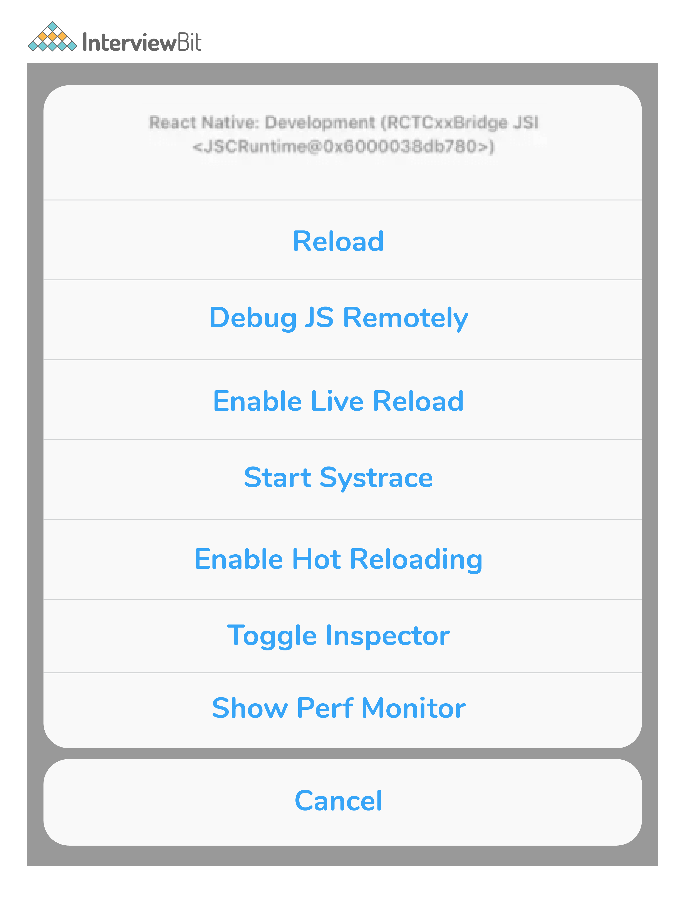
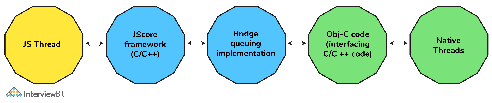
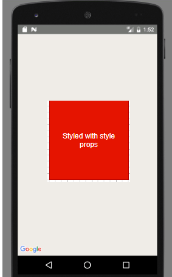

# Câu hỏi phỏng vấn React Native


React Native là một framework ứng dụng di động dựa trên JavaScript, được thiết kế để tạo các ứng dụng di động cho iOS và Android bằng cách cung cấp cho người lập trình một công cụ để sử dụng React cùng với nền tảng di động native. Ưu điểm chính của React Native là code có thể được viết và chia sẻ một lần giữa cả iOS và Android. Các ứng dụng dành cho thiết bị di động thực sự "native" về cả giao diện và cảm nhận có thể được xây dựng bằng chính Javascript.

## Câu hỏi phỏng vấn React Native cho Fresher

### 1. Sự khác biệt giữa ReactJS và React Native?

- Mục đích:
    + ReactJS là thư viện dùng cho xây dựng giao diện người dùng trên ứng dụng web
    + React Native là framework cho tạo ứng dụng di động ở như một ứng dụng native.
- Cú pháp: cả hai đều dùng JSX nhưng React dùng cú pháp `<div>`, `<h1>`, `<p>` còn React Native dùng `<view>`, `<text>`,...
- Animation:
    + ReactJS sử dụng CSS animation để tạo ảnh động trên ứng dụng web.
    + React Native sử dụng Animated API
- Cơ chế routing:
    + React dùng react-router cho chuyển hướng trang
    + React Native sử dụng thư viện Navigator cho chuyển hướng trên ứng dụng di động.


| React JS | React Native |
|-|-|
| Dùng cho phát triển ứng dụng web | Dùng cho phát triển ứng dụng di động |
| Dùng react-router cho điều hướng trang | Dùng thư viện navigator cho điều hướng trong ứng dụng di động |
| Dùng thẻ HTML | Không dùng thẻ HTML |
| Cung cấp bảo mật cao | Bảo mật thấp hơn so với ReactJS |
| Sử dụng virtual DOM để render trên trình duyệt | Dùng API để render cho ứng dụng di động |

### 2. Flexbox là gì?

Nó là mô hình bố cục cho phép phần tử được căn chỉnh và cách đều trong container. Với flexbox ta có thể tuỳ chỉnh width và height một cách linh hoạt, tất cả bên trong container chính có thể được căn chỉnh để lấp đầy hoặc cách khoảng giữa các phần tử, điều này làm cho nó trở thành một công cụ tuyệt vời để sử dụng cho các hệ thống thiết kế reponsive.

| Property | Values | Desc |
|-|-|-|
| flexDirection | 'column', 'row' | Dùng cho căn chỉnh phần tử theo chiều dọc hay ngang |
| justifyContent | 'center','flex-start','flex-end','space-around','space-between' | Được sử dụng để xác định cách các phần tử nên được cách khoảng bên trong container |
| alignItems | 'center','flex-start','flex-end','stretched' | Được sử dụng để xác định cách các phần tử nên được cách khoảng bên trong container dọc theo trục thứ cấp (ngược với flexDirection) |

### 3. Ưu điểm của React Native?

**Cộng đồng lớn**

React Native là một Framework mã nguồn mở, nó hoàn toàn do cộng đồng thúc đẩy phát triển nên mọi vấn đề đều có thể được giải quyết bằng cách nhận trợ giúp trực tuyến từ các nhà phát triển khác.
 
**Khả năng tái sử dụng**

Code có thể được viết một lần và có thể được sử dụng cho cả iOS và Android, giúp duy trì và cũng như debug các ứng dụng phức tạp lớn vì không cần nhóm riêng biệt để hỗ trợ cả hai nền tảng, điều này cũng làm giảm chi phí ở mức độ lớn.
 
**Hot Reloading**

Thói quen thông thường của dev khi code là test các thay đổi mỗi lần code được viết. Để thực hiện được, app cần phải được đóng gói lại và cài đặt hoặc trong 1 simulator hoặc một thiết bị thật sự.

Với React Native, phần lớn thời gian, bạn không cần phải tổng hợp lại app mỗi lần có thay đổi. Bạn chỉ cần làm mới app trong simulator, emulator hoặc thiết bị. Thậm chí còn có một tính năng là Live Reload để tự động refresh app mỗi lần phát hiện 1 thay đổi trong code.

**Các plugin bổ sung của bên thứ ba**
Nếu các module hiện có không đáp ứng yêu cầu nghiệp vụ trong React Native, chúng ta cũng có thể sử dụng các plugin của Bên thứ ba để giúp tăng tốc quá trình phát triển.

### 4. Giải thích các thread khác nhau trong React Native?


Luồng điều khiển tuần tự đơn trong một chương trình có thể được điều khiển bởi một thread.

**React Native sử dụng 3 threads**

- **MAIN/UI Thread** - Đây là thread chính mà ứng dụng Android/iOS của bạn đang chạy. Giao diện người dùng của ứng dụng có thể được thay đổi bởi thread chính và có quyền truy cập vào nó.

- **Shadow Thread** - bố cục được tạo bởi thư viện React trong React Native.
- **JavaScript Thread** - code JavaScript sẽ được thực thi ở thread này.

### 5. defaultProps có khả dụng trong React Native không?

Có, nó hoạt động trong React Native tương tự như ở ReactJS.

```jsx
import {View, Text} from 'react-native';

class DefaultPropComponent extends Component {
    render() {
        return ( 
            <View>
                <Text> 
                {this.props.name} 
                </Text> 
            </View>
        )
    }
}
Demo.defaultProps = {
   name: 'BOB'
}

export default DefaultPropComponent;
```

### 6. Xử lý input trong React Native?

TextInput là component chính cho phép người dùng nhập văn bản vào. Nó có `onChangeText` để nhận một hàm gọi mỗi khi văn bản có thay đổi, và `onSubmitEditing` để nhận một hàm gọi mỗi khi có submit.

```jsx
import React, { useState } from 'react';
import { Text, TextInput, View } from 'react-native';

const PizzaTranslator = () => {
    const [text, setText] = useState('');
    return (
        <View style={{padding: 10}}>
            <TextInput
                style={{height: 40}}
                placeholder="Type here to translate!"
                onChangeText={text => setText(text)}
                defaultValue={text}
            />
            <Text style={{padding: 10, fontSize: 42}}>
                {text.split(' ').map((word) => word && '🍕').join(' ')}
            </Text>
        </View>
    );
}

export default PizzaTranslator;
```

### 7. Cách sử dụng state trong React Native?

Nó dùng cho điều khiển component. Biến dữ liệu có thể lưu trong state, và nó có thể thay đổi giá trị bất cứ lúc nào. Ví dụ

```jsx
import React, {Component} from 'react';    
import { Text, View } from 'react-native';

export default class App extends Component {    
    state = {
        myState: 'State of Text Component'
    }

    updateState = () => this.setState({myState: 'The state is updated'})
    render() {
        return (
            <View>    
                <Text onPress={this.updateState}> {this.state.myState} </Text>    
            </View> 
        ); 
    } 
}
```

### 8. Redux trong React Native?

Redux là một công cụ quản lý trạng thái được dùng cho các ứng dụng JavaScript. Nó giúp toàn bộ luồng dữ liệu của ứng dụng được xử lý trong một container duy nhất không khi trạng thái trước đó vẫn tồn tại.


*Actions*: là khối lượng thông tin gửi dữ liệu từ ứng dụng của bạn đến store. Chúng là nguồn thông tin duy nhất cho store. Điều này có nghĩa là nếu bất kỳ thay đổi trạng thái nào là cần thiết, sẽ được thực hiện thông qua các action.

*Reducers*: Các action mô tả thực tế là có điều gì đó đã xảy ra, nhưng không chỉ rõ trạng thái của ứng dụng thay đổi như thế nào để phản hồi. Đây là công việc của những reducer.

*Store*: một store có thể được tạo ra với sự trợ giúp của các reducers lưu giữ toàn bộ trạng thái của ứng dụng. Cách được khuyến khích là sử dụng một store duy nhất cho toàn bộ ứng dụng, vì có nhiều store sẽ vi phạm việc sử dụng redux vốn chỉ có một store duy nhất.

*Component*: đây là nơi lưu giữ giao diện người dùng của ứng dụng.

### 9. Các hàm thời gian trong React Native?

- **setTimeout, clearTimeout**

Có các yêu cầu nghiệp vụ, `setTimeout` để thực thi một mẫu code sau một khoảng thời gian chờ đợi. `clearTimeout` dùng để xoá timer lại thời gian được bắt đầu.

```js
setTimeout(() => {
    yourFunction();
}, 3000);
```

- **setInterval, clearInterval**

Là phương thức để gọi một hàm hoặc chạy code sau những khoảng thời gian cụ thể, được chỉ định trong tham số thứ hai.

```js
setInterval(() => {
    console.log('Interval triggered');
}, 1000);
```

Một hàm hoặc khối code được liên kết với một khoảng thời gian sẽ thực thi cho đén khi nó bị dừng. Để dùng khoảng thời gian, ta dùng phương thức `clearInterval()`.

- **setImmediate, clearImmediate**

Gọi hàm thực thi sớm nhất có thể.

```js
var immediateID = setImmediate(function);
// The below code displays the alert dialog immediately.
var immediateId = setImmediate(
    () => {    alert('Immediate Alert');
}
```

`clearImmediate()` dùng để huỷ hành động ngay lập tức nếu nó được thiết lập bằng `setImmediate()`.

- **requestAnimationFrame, cancelAnimationFrame**

Là chuẩn để thực hiện ảnh động.

Gọi một hàm để cập nhật ảnh động trước khi đến frame ảnh động kế tiếp.

```js
var requestID = requestAnimationFrame(function);
// The following code performs the animation.
var requestId = requestAnimationFrame(
    () => { // animate something}
)
```

`cancelAnimationFrame()` dùng để huỷ hàm được thiết lập bởi `requestAnimationFrame()`.

### 10. Cách debug ứng dụng React Native và các công cụ cần thiết?

Trong React Native, có rất nhiều cách debug khác nhau với nhiều công cụ khác nhau, do React Native chạy trên cả hai môi trường Android và iOS. 

- Danh mục:
Reload: reloads the app
Debug JS Remotely: opens a channel to a JavaScript debugger
Enable Live Reload: makes the app reload automatically on clicking Save
Enable Hot Reloading: watches for changes accrued in a changed file
Toggle Inspector: toggles an inspector interface, which allows us to inspect any UI element on the screen and its properties, and presents an interface that has other tabs like networking, which shows us the HTTP calls, and a tab for performance.




### 11. Props Drilling là gì?

Props Drilling là một khái niệm đề cập đến quá trình truyền dữ liệu từ component cha đến component con chính xác NHƯNG ở giữa có rất nhiều component truyền props như một chuỗi.


#### Các bước tránh nó

- React Context API
- Composition
- Render props
- HOC
- Redux, Mobx

### 12. Mô tả kết nối mạng trong React Native?

React Native cung cấp fetch API cho kết nối mạng. Để lấy nội dung từ một URL, ta có thể làm như sau:

```js
fetch('https://mywebsite.com/endpoint/', {
    method: 'POST',
    headers: {
        Accept: 'application/json',
        'Content-Type': 'application/json'
    },
    body: JSON.stringify({
        firstParam: 'yourValue',
        secondParam: 'yourOtherValue'
    })
});
```

Kết nối mạng là một hoạt động bất đồng bộ. Các phương thức fetch sẽ trả về một Promise giúp dễ dàng viết code hoạt động theo cách bất đồng bộ:

```js
const getMoviesFromApi = () => {
    return fetch('https://reactnative.dev/movies.json')
        .then((response) => response.json())
        .then((json) => {
            return json.movies;
        })
        .catch((error) => {
            console.error(error);
        });
};
```

API XMLHttpRequest là api sẵn có trong React Native. Ta cũng có thể sử dụng axios với frisbee với api này.

```js
var request = new XMLHttpRequest();
request.onreadystatechange = (e) => {
    if (request.readyState !== 4) {
        return;
    }

    if (request.status === 200) {
        console.log('success', request.responseText);
    } else {
        console.warn('error');
    }
};

request.open('GET', 'https://mywebsite.com/endpoint/');
request.send();
```

### 13. Liệt kê các điểm chính để tích hợp React Native trong một ứng dụng Android?

Các điểm chính cần lưu ý để tích hợp các React Native vào ứng dụng Android của bạn là:

- Thiết lập cấu trúc thư mục và phụ thuộc React Native.
- Phát triển các component React Native của bạn trong JavaScript.
- Thêm ReactRootView vào ứng dụng Android của bạn. Chế độ xem này sẽ đóng vai trò là container cho component React Native của bạn.
- Khởi động React Native server và chạy ứng dụng native của bạn.
- Cuối cùng, chúng tôi cần xác minh việc React Native trong ứng dụng của bạn hoạt động như mong đợi.

### 14. Code React Native được xử lý như thế nào?

- Khi bắt đầu khởi động ứng dụng, luồng chính bắt đầu thực thi và tải JS bundles.
- Khi code JS đã được tải hoàn tất, luồng chính gửi nó vào luồng JS khác vì JS thực hiện các tính toán nặng trong một thời gian, luồng UI sẽ không phải chịu ảnh hưởng gì cả.
- Khi React bắt đầu render, Reconciler bắt đầu "driffing", và nó tạo một virtual DOM (layout) mới, nó gửi các thay đổi đến luồng khác. (Luồng shadow)
- Luồng shadow tính toán bố cụ và gửi tham số/đối tượng bố cục đến luồng chính. 
- Vì chỉ luồng chính mới có thể hiển thị thứ gì đó trên màn hình, nên luồng shadow sẽ gửi bố cục đã tạo đến luồng chính và chỉ khi đó giao diện người dùng mới hiển thị.

### 15. Bridge trong React Native là gì?

Bridge là một lớp hoặc một kết nối chịu trách nhiệm gắn kết môi trường Native và JavaScript lại với nhau.

Sơ đồ:


- Lớp gần nhất với thiết bị mà ứng dụng chạy trên đó là Lớp Native.
 
- Bridge về cơ bản là một lớp truyền tải hoạt động như một kết nối giữa các module Javascript và Native, nó thực hiện công việc vận chuyển các thông báo phản hồi được tuần tự hóa bất đồng bộ từ JavaScript đến các module Native.

Ví dụ bây giờ, có một số thay đổi trạng thái xảy ra, do đó React Native sẽ cập nhật hàng loạt UI và gửi nó đến Bridge. Bridge sẽ chuyển phản hồi được tuần tự hóa này đến lớp Native, lớp này sẽ xử lý tất cả các lệnh mà nó có thể phân biệt với phản hồi được tuần tự hóa và sẽ cập nhật giao diện người dùng cho phù hợp.

**Nền tảng iOS**



**Nền tảng Android**


### 16. Các component cốt lõi trong React Native?

Các component cốt lỗi thường được dùng trong React Native: `<View>`, `<Text>`, `<Image>`, `<ScrollView>` và `<TextInput>`.

| React Native Component | Android View | iOS view | Web view | Mô tả |
|-|-|-|-|-|
| <View> | <ViewGroup> | <UIView> | <div> | Một container hỗ trợ bố cục với kiểu flexbox, một số điều khiển cảm ứng và điều khiển trợ năng |
| <Text> | <TextView> | <UITextView> | <p> | Hiển thị style, lồng chuỗi văn bản hoặc xử lý sự kiện |
| <Image> | <ImageView> | <UIImageView> |  | Hiển thị ảnh |
| <ScrollView> | <ScrollView> | <UIScrollView> | <div> | Một container scroll chung có thể chứa nhiều component và view |
| <TextInput> | <EditText> | <UITextField> | <input type="text"> | Cho phép người dùng nhập văn bản |

### 17. ListView trong React Native?

ListView là một component bao gồm danh sách các mục được hiển thị và có thể scroll theo chiều dọc.

```jsx
export default class MyListComponent extends Component {  
    constructor() {  
        super();  
        const ds = new ListView.DataSource({rowHasChanged: (r1, r2) => r1 !== r2});  
        this.state = {  
            dataSource: ds.cloneWithRows(['Android','iOS', 'Java','Php', 'Hadoop', 'Sap', 'Python','Ajax', 'C++']), 
        };
    }  
    render() {  
        return ( 
            <ListView 
                dataSource={this.state.dataSource}  
                renderRow={  
                (rowData) =>  
                <Text style={{fontSize: 30}}>{rowData}</Text>} 
            />  
        ); 
    }  
}
```

### 18. Làm thế nào bạn có thể viết code khác nhau cho IOS và Android trong cùng một codebase?

Module platform sẽ phát hiện từng nền tảng khi ứng dụng được chạy.

```jsx
import { Platform, Stylesheet } from 'react-native';

const styles = Stylesheet.create({
    height: Platform.OS === 'IOS' ? 200 : 400
})
```

Ngoài ra, phương thức `Platform.select` lấy một đối tượng chứa Platform.OS làm khóa và trả về giá trị cho nền tảng bạn hiện đang sử dụng. 

```jsx
import { Platform, StyleSheet } from 'react-native';
const styles = StyleSheet.create({
    container: {
        flex: 1,
        ...Platform.select({
            ios: {
                backgroundColor: 'red',
            },
            android: {
                backgroundColor: 'green',
            },
            default: {
                // other platforms, web for example
                backgroundColor: 'blue',
            },    
        }),
    },
});
```

### 19. Touchable và cách dùng nó trong React Native?

Các cử chỉ chạm có thể được ghi lại bằng các component Touchable và có thể hiển thị phản hồi khi một cử chỉ được nhận dạng.

Tùy thuộc vào loại phản hồi bạn muốn cung cấp, mà chọn loại component Touchable.

- Nhìn chung, chúng ta sử dụng `TouchableHighlight` ở bất kỳ nơi nào sử dụng button hoặc link đến web. Chế độ nền của view sẽ tối đi khi người dùng nhấn nút xuống.

- Chúng ta có thể sử dụng `TouchableNativeFeedback` trên Android để hiển thị các gợn sóng phản ứng bề mặt mực phản ứng với thao tác chạm của người dùng.

- `TouchableOpacity` có thể được sử dụng để cung cấp phản hồi bằng cách giảm độ mờ của button, cho phép nhìn thấy nền trong khi người dùng nhấn xuống.

- Nếu chúng ta cần xử lý một cử chỉ nhấn nhưng bạn không muốn hiển thị bất kỳ phản hồi nào, hãy sử dụng `TouchableWithoutFeedback`.

```jsx
import React, { Component } from 'react';
import { 
    Platform, 
    StyleSheet, 
    Text, 
    TouchableHighlight, 
    TouchableOpacity, 
    TouchableNativeFeedback, 
    TouchableWithoutFeedback, 
    View 
} from 'react-native';

export default class Touchables extends Component {
    _onPressButton() {
        alert('You tapped the button!')
    }
    _onLongPressButton() {
        alert('You long-pressed the button!')
    }
    render() {
        return (
            <View style={styles.container}>
                <TouchableHighlight onPress={this._onPressButton} underlayColor="white">
                    <View style={styles.button}>
                        <Text style={styles.buttonText}>TouchableHighlight</Text>
                    </View>
                </TouchableHighlight>
            </View>
        );
    }
}
```

### 20. Component FlatList là gì?

Component FlatList hiển thị dữ liệu có cấu trúc trong một danh dách có thể scroll. Nó hoạt động với những danh sách dữ liệu lớn và số lượng mục có thể thay đổi theo thời gian.

**Tính năng:**

FlatList chỉ hiển thị các phần tử được render hiện đang hiển thị trên màn hình, không hiển thị tất cả các phần tử của danh sách cùng một lúc.

```jsx
import React, { Component } from 'react';  
import { AppRegistry, FlatList,  
   StyleSheet, Text, View,Alert } from 'react-native';  

export default class FlatListBasics extends Component {  
    renderSeparator = () => {  
        return (  
            <View  
                style={{  
                    height: 1,  
                    width: "100%",  
                    backgroundColor: "#000",  
                }}  
            />  
        );  
    };  
    //handling onPress action  
    getListViewItem = (item) => {  
        Alert.alert(item.key);  
    }  
 
    render() {  
        return (  
            <View style={styles.container}>  
                <FlatList  
                    data={[  
                        {key: 'Android'},{key: 'iOS'}, {key: 'Java'},{key: 'Swift'},  
                        {key: 'Php'},{key: 'Hadoop'},{key: 'Sap'},  
                    ]}  
                    renderItem={({item}) =>  
                        <Text style={styles.item}  
                                onPress={this.getListViewItem.bind(this, item)}>{item.key}</Text>}  
                    ItemSeparatorComponent={this.renderSeparator}  
                />  
            </View>  
        );  
    }
}  
AppRegistry.registerComponent('AwesomeProject', () => FlatListBasics);  
```

### 21. Cách định tuyến với React Navigation trong React Native?

Một trong những thư viện phổ biến để định tuyến và điều hướng trong ứng dụng React Native là React Navigation.

Thư viện này giúp giải quyết vấn đề điều hướng giữa nhiều màn hình và chia sẻ dữ liệu giữa chúng.

```jsx
import * as React from 'react';
import { NavigationContainer } from '@react-navigation/native';
import { createStackNavigator } from '@react-navigation/stack';

const Stack = createStackNavigator();

const MyStack = () => {
    return (
        <NavigationContainer>
            <Stack.Navigator>
            <Stack.Screen
                name="Home"
                component={HomeScreen}
                options={{ title: 'Welcome' }}
            />
            <Stack.Screen name="Profile" component={ProfileScreen} />
            </Stack.Navigator>
        </NavigationContainer>
    );
};
```

### 22. Các cách thiết kế style trong ứng dụng React Native?

#### Dùng thuộc tính style

Bạn có thể thêm style vào component của mình bằng cách sử dụng các thuộc tính style. Bạn chỉ cần thêm các thuộc tính style vào phần tử của mình và nó chấp nhận một đối tượng thuộc tính.

```jsx
import React, {Component} from 'react';
import {Platform, StyleSheet, Text, View} from 'react-native';

export default class App extends Component<Props> {
    render() {
        return (
        <View style={{flex:1,justifyContent:"center",backgroundColor:"#fff", alignItems:"center"}}>
            <View style={{width:200,height:150,backgroundColor:"red",padding:10}}>
                <Text style={{fontSize:20, color:"#666"}}>Styled with style props</Text>
            </View>
        </View>
        );
    }
}
```



#### Dùng StyleSheet

Đối với một codebase cực kỳ lớn hoặc bạn muốn đặt nhiều thuộc tính cho các phần tử của mình, việc viết quy tắc tạo style trực tiếp bên trong các thuộc tính style sẽ làm cho code trở nên phức tạp hơn, đó là lý do tại sao React Native cung cấp cho chúng ta một cách khác để viết code ngắn gọn bằng phương thức StyleSheet:

```jsx
import { StyleSheet} from 'react-native';

const styles = StyleSheet.create({
    container: {
        flex:1,
        justifyContent:"center",
        backgroundColor:"#fff",
        alignItems:"stretch"
    },
    title: {
        fontSize:20,
        color:"#fff"
    },
    item1: {
        backgroundColor:"orange",
        flex:1
    },
    item2: {
        backgroundColor:"purple",
        flex:1
    },
    item3: {
        backgroundColor:"yellow",
        flex:1
    },
});
```

Khi ta truyền đối tượng style vào component thông qua thuộc tính style:

```jsx
<View style={styles.container}>
    <View style={styles.item1}>
        <Text style={{fontSize:20, color:"#fff"}}>Item number 1</Text>
    </View>
    <View style={styles.item2}>
        <Text style={{fontSize:20, color:"#fff"}}>Item number 1</Text>
    </View>
    <View style={styles.item3}>
        <Text style={{fontSize:20, color:"#fff"}}>Item number 1</Text>
    </View>
    <View style={styles.item4}>
        <Text style={{fontSize:20, color:"#fff"}}>Item number 1</Text>
    </View>
</View>
```

#### styled-components

Ta có thể đã sử dụng styled-component để tạo style với React Native để có tạo style như CSS bình thường. Để sử dụng nó trong dự án chỉ cần chạy lệnh cài đặt module như sau:

```
npm install styled-component
```

Ví dụ

```jsx
import React, {Component} from 'react';
import { StyleSheet,Text, View} from 'react-native';
import styled from 'styled-components';

const Container=styled.View`
   flex:1;
   padding:50px 0;
   justify-content:center;
   background-color:#f4f4f4;
   align-items:center
`;
const Title=styled.Text`
    font-size:20px;
    text-align:center;
    color:red;
`;
const Item=styled.View`
    flex:1;
    border:1px solid #ccc;
    margin:2px 0;
    border-radius:10px;
    box-shadow:0 0 10px #ccc;
    background-color:#fff;
    width:80%;
    padding:10px;
`;

export default class App extends Component {
    render() {
        return (
            <Container>
                <Item >
                    <Title >Item number 1</Title>
                </Item>
                <Item >
                    <Title >Item number 2</Title>
                </Item>
                <Item >
                    <Title >Item number 3</Title>
                </Item>
                <Item >
                    <Title >Item number  4</Title>
                </Item>
            </Container>
        );
    }
}
```

### 23. Giải thích Async Storage trong React Native?

- Async Storage trong React Native tương đương với Local Storage trên web.
- Async Storage là một module do cộng đồng duy trì cho React Native, cung cấp một kho lưu trữ key-value bất đồng bộ, không được mã hóa. Async Storage không được chia sẻ giữa các ứng dụng: mọi ứng dụng đều có môi trường sandbox riêng và không có quyền truy cập vào dữ liệu từ ứng dụng khác

Dùng Async Storage khi:
- Dữ liệu không nhạy cảm liên tục trên các lần chạy ứng dụng
- Trạng thái Redux
- Trạng thái GraphQL
- Lưu trữ các biến toàn cục trên toàn ứng dụng

Không dùng cho:
- Token
- Khoá bí mật

### 24. Nguyên nhân thực sự đằng sau các vấn đề về hiệu suất trong React Native là gì?

Nguyên nhân thực sự đằng sau các vấn đề về hiệu suất React Native là mỗi luồng (tức là luồng Native và JS) quá nhanh. Tắc nghẽn hiệu suất trong ứng dụng React Native xảy ra khi bạn chuyển các thành phần từ luồng này sang luồng khác một cách không cần thiết hoặc nhiều hơn mức cần thiết. Quy tắc ngón tay cái chính được dùng để tránh bất kỳ vấn đề nào liên quan đến hiệu suất trong React Native và giữ cho các lần vượt qua bridge ở mức tối thiểu.

- Luồng Native được xây dựng để chạy Java/Kotlin, Swift/Objective C.
- Luồng Javascript là luồng chính chạy mọi thứ từ hoạt ảnh dựa trên javascript đến các component giao diện người dùng khác.
- Bridge như tên cho thấy hoạt động như một điểm giao tiếp trung gian cho luồng Native và JS.

