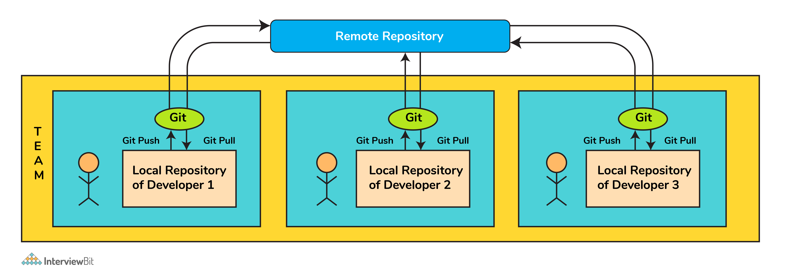

# Câu hỏi phỏng vấn Git


## Git là gì?

Git là một VCS (version control system) mã nguồn mở, phổ biến và được dùng rộng rải cho phát triển các dự án vừa và nhỏ để đem về hiệu quả và dễ quản lý.

Nó phù hợp khi có nhiều người làm việc trong các dự án như một nhóm và được sử dụng để theo dõi các thay đổi của dự án và hỗ trợ hiệu quả sự cộng tác của quá trình phát triển.

Nhà phát triển có thể xác định ai đã thực hiện những thay đổi nào và sau đó chạy thử nghiệm và sửa lỗi nếu có, sau đó thực hiện triển khai tính năng cần thiết. Trong trường hợp xảy ra bất kỳ bất trắc nào, code có thể được hoàn nguyên về bất kỳ phiên bản nào đã hoạt động trước đó, do đó tiết kiệm công sức hơn rất nhiều.



Nhờ là một VCS được thiết lập tốt nhằm hỗ trợ cho công việc cộng tác, git đã thu hút một lượng phổ biến rộng rãi không chỉ các nhà phát triển phần mềm mà còn cả những người làm công việc khác. Ban đầu có vẻ khó khăn, nhưng khi hiểu rõ về git thì nó sẽ làm mọi thứ trở nên đơn giản.

Nó có một hệ thống phân branch tuyệt vời hỗ trợ phát triển phi tuyến tính cùng với việc giữ cho các nhà phát triển chịu trách nhiệm về code của họ. Điều này giúp làm cho quá trình phát triển hiệu quả và nhanh hơn.

## Câu hỏi phỏng vấn Git cho Fresher

### 1. VCS là gì?

VCS (version control system) theo dõi những đóng góp của các nhà phát triển làm việc như một nhóm trong các dự án. Nó duy trì lịch sử của các thay đổi code đã thực hiện và với sự phát triển của dự án, nó tạo ưu thế cho các nhà phát triển để thêm code mới, sửa lỗi và chạy thử nghiệm với niềm tin rằng bản sao làm việc trước đó của họ có thể được khôi phục bất cứ lúc nào trong trường hợp xảy ra sự cố.

### 2. Git repository là gì?

Một repository là cấu trúc file lưu trữ tất cả file của dự án. Git có thể lưu trữ file cục bộ hoặc từ xa.

### 3. Git clone là gì?

Câu lệnh tạo ra một bản sao của repository đã có. Nó thường được dùng để sao chép các repository từ xa.

### 4. Git config là gì?

Lệnh `git config` là một cách thuận tiện để đặt các tùy chọn cấu hình để xác định hành vi của repository, thông tin người dùng và tùy chọn, cấu hình dựa trên cài đặt git, và nhiều thứ như vậy.

Ví dụ:

Để thiết lập tên và địa chỉ email của bạn trước khi sử dụng lệnh git, chúng ta có thể chạy các lệnh dưới đây:

```shell
git config --global user.name "<<your_name>>"
 
git config --global user.email "<<your_email>>"
```

### 5. Thuật ngữ head trong git?

- Head là tham chiếu đến đối tượng commit của một branch.
- Với tất cả repository, nó thường có head mặc định là "master", hiện tại là "main" nhưng không có giới hạn về số lượng head. 

Công dụng:

- Để đến hoặc checkout một commit trước khi commit cuối cùng, ta dùng `git checkout HEAD~1`.
- Để uncommit 3 commit cuối cùng mà không có thây đổi nào, ta chay `git reset HEAD~3`. Sau đó ta sẽ thấy 3 commit cuối cùng và cập nhật nó thủ công.

